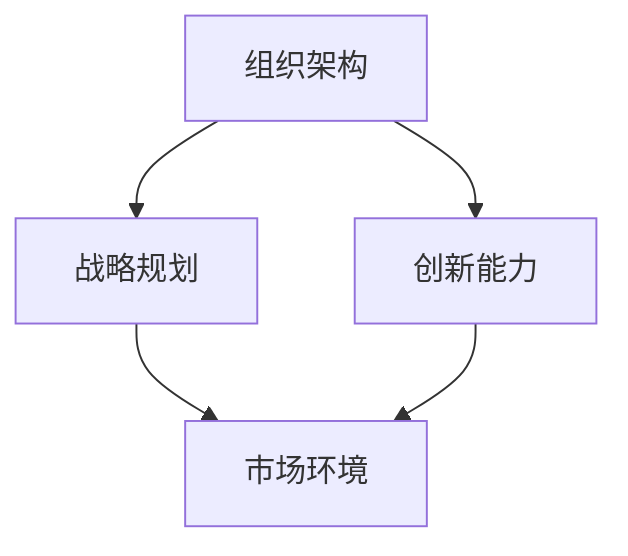

                 

# 拥有体系思维是管理者的必备能力

> **关键词：** 体系思维、管理者能力、组织架构、战略规划、创新能力

> **摘要：** 本文深入探讨了体系思维在管理者工作中的重要性，分析了体系思维对组织架构、战略规划和创新能力的影响，并结合实际案例，提出了提升体系思维能力的具体策略和方法。

## 1. 背景介绍

在当今复杂多变的市场环境中，管理者面临着前所未有的挑战。如何有效地管理团队、制定战略、推动创新，成为管理者必须面对的核心问题。体系思维作为一种重要的管理工具，能够帮助管理者从全局视角出发，系统地分析问题、规划发展路径，从而提高管理效率和效果。

### 1.1 管理者的角色和挑战

管理者不仅是团队的领导者，更是战略的规划者和执行者。随着企业规模的扩大和市场环境的变化，管理者需要具备以下能力：

- **组织管理能力**：有效地协调团队资源，提高组织效率。
- **战略规划能力**：准确把握市场趋势，制定可行的发展策略。
- **创新能力**：推动企业持续创新，保持竞争优势。

### 1.2 体系思维的重要性

体系思维是一种从整体出发，系统分析问题的思维方式。它强调各部分之间的相互作用和相互依赖，从而形成整体最优的解决方案。在管理者工作中，体系思维能够帮助：

- **全面理解问题**：避免片面和短视，从全局视角分析问题。
- **提高决策效率**：通过系统分析，减少信息不对称，提高决策质量。
- **推动创新**：激发团队潜力，实现持续创新。

## 2. 核心概念与联系

为了深入理解体系思维在管理者工作中的重要性，我们需要首先明确几个核心概念，并分析它们之间的联系。

### 2.1 组织架构

组织架构是企业内部各部门、团队和人员的组织形式。一个合理的组织架构能够优化资源配置，提高工作效率。

### 2.2 战略规划

战略规划是企业根据市场环境和内部资源，制定的长期发展计划。它指导企业的发展方向和资源配置，是企业管理的重要工具。

### 2.3 创新能力

创新能力是企业持续发展的动力。它通过创新产品、服务和技术，满足市场需求，保持竞争优势。

### 2.4 体系思维的架构

体系思维通过分析组织架构、战略规划和创新能力，形成了一个系统化的框架。以下是一个简单的Mermaid流程图，展示了这些概念之间的联系：



在这个框架中，组织架构是基础，战略规划和创新能力是在此基础上的延伸和拓展。市场环境是外部因素，它直接影响组织架构和创新能力。体系思维通过系统分析这些因素，帮助管理者制定出最优的发展策略。

## 3. 核心算法原理 & 具体操作步骤

### 3.1 分析组织架构

分析组织架构是体系思维的基础。具体步骤如下：

1. **明确组织目标**：确定企业的愿景和使命，明确组织的目标。
2. **评估组织现状**：分析现有组织架构的优缺点，识别存在的问题。
3. **制定改进方案**：根据组织目标，提出优化组织架构的方案。
4. **实施与监控**：实施改进方案，并监控实施效果。

### 3.2 制定战略规划

制定战略规划是体系思维的核心。具体步骤如下：

1. **市场分析**：分析市场环境，确定市场机会和威胁。
2. **内部分析**：分析企业内部资源，确定优势和劣势。
3. **制定战略目标**：根据市场分析和内部分析，制定企业的发展战略。
4. **实施战略计划**：制定详细的战略实施计划，并分解为具体的行动步骤。
5. **评估与调整**：定期评估战略实施效果，并根据实际情况进行调整。

### 3.3 提升创新能力

提升创新能力是体系思维的关键。具体步骤如下：

1. **培养创新文化**：营造鼓励创新的企业文化，提高员工创新意识。
2. **建立创新机制**：建立创新机制，为员工提供创新的机会和资源。
3. **开展创新活动**：组织创新活动，激发员工创新潜力。
4. **评估创新效果**：定期评估创新活动的效果，优化创新机制。

## 4. 数学模型和公式 & 详细讲解 & 举例说明

### 4.1 组织架构评估模型

为了更科学地评估组织架构的合理性，我们可以使用以下数学模型：

$$
评估得分 = \frac{组织目标达成度}{组织效率} \times 创新能力
$$

- **组织目标达成度**：衡量组织架构是否符合企业目标。
- **组织效率**：衡量组织架构的资源利用效率。
- **创新能力**：衡量组织架构对创新的推动能力。

### 4.2 战略规划效果评估模型

为了评估战略规划的效果，我们可以使用以下数学模型：

$$
效果得分 = \frac{市场占有率}{投入成本} \times 产品创新度
$$

- **市场占有率**：衡量战略规划在市场上的表现。
- **投入成本**：衡量战略规划的实施成本。
- **产品创新度**：衡量战略规划推动的产品创新程度。

### 4.3 创新能力评估模型

为了评估创新能力，我们可以使用以下数学模型：

$$
创新度 = \frac{新产品数量}{总产品数量} \times 新产品市场占有率
$$

- **新产品数量**：衡量企业在一定时间内推出的新产品数量。
- **总产品数量**：衡量企业的产品总数。
- **新产品市场占有率**：衡量新产品在市场中的占有率。

### 4.4 案例说明

假设某企业通过体系思维分析，得出以下数据：

- **组织目标达成度**：90%
- **组织效率**：80%
- **创新能力**：85%
- **市场占有率**：70%
- **投入成本**：100万元
- **新产品数量**：5个
- **总产品数量**：20个
- **新产品市场占有率**：60%

根据上述数学模型，我们可以计算出：

- **组织架构评估得分**：$$ \frac{90\%}{80\%} \times 85\% = 96.25\% $$
- **战略规划效果评估得分**：$$ \frac{70\%}{100\text{万元}} \times 60\% = 4.2\% $$
- **创新能力评估得分**：$$ \frac{5}{20} \times 60\% = 15\% $$

通过这些评估得分，管理者可以了解企业的整体状况，并制定相应的改进措施。

## 5. 项目实战：代码实际案例和详细解释说明

### 5.1 开发环境搭建

在本节中，我们将使用Python语言，结合Mermaid库，搭建一个简单的体系思维分析工具。首先，确保安装了Python环境和Mermaid库。

```bash
pip install python-memray
```

### 5.2 源代码详细实现和代码解读

下面是一个简单的Python脚本，用于生成Mermaid流程图，分析组织架构、战略规划和创新能力。

```python
import memray

def generate_mermaid_flowchart():
    """
    生成Mermaid流程图，分析组织架构、战略规划和创新能力
    """
    flowchart = "graph TB\n"
    flowchart += "A[组织架构] --> B[战略规划]\n"
    flowchart += "A --> C[创新能力]\n"
    flowchart += "B --> D[市场环境]\n"
    flowchart += "C --> D\n"
    return flowchart

if __name__ == "__main__":
    flowchart = generate_mermaid_flowchart()
    with open("flowchart.mem", "w") as f:
        f.write(flowchart)
    print("Mermaid流程图已生成，路径：flowchart.mem")
```

### 5.3 代码解读与分析

- **生成Mermaid流程图**：使用`generate_mermaid_flowchart`函数生成Mermaid流程图。
- **写入文件**：将生成的流程图写入文件`flowchart.mem`。
- **打印提示**：打印生成流程图的路径。

通过这个简单的脚本，我们可以直观地展示体系思维分析过程，为管理者提供决策支持。

## 6. 实际应用场景

### 6.1 企业战略规划

在企业战略规划中，体系思维可以帮助管理者从全局出发，系统地分析市场环境、内部资源和竞争优势，制定出科学、可行的发展策略。

### 6.2 创新型企业管理

在创新型企业的管理中，体系思维能够激发员工的创新能力，推动企业持续创新，保持市场竞争力。

### 6.3 项目管理

在项目管理中，体系思维可以帮助项目经理从整体视角分析项目，优化项目资源，提高项目成功率。

## 7. 工具和资源推荐

### 7.1 学习资源推荐

- **书籍**：《系统思考》、《第五项修炼》
- **论文**：相关领域的学术论文，如组织行为学、战略管理等。
- **博客**：知名管理博客，如“管理心理学”、“战略规划实践”等。
- **网站**：管理知识库，如“MBA智库”、“中欧国际工商学院”等。

### 7.2 开发工具框架推荐

- **Python**：强大的编程语言，适用于数据分析、机器学习等领域。
- **Mermaid**：用于生成图表和流程图的工具，支持Markdown语法。
- **Jupyter Notebook**：交互式开发环境，便于数据分析和演示。

### 7.3 相关论文著作推荐

- **论文**：相关领域的学术论文，如“体系思维在企业管理中的应用”、“创新能力的驱动因素分析”等。
- **著作**：《管理体系创新》、《创新思维与战略规划》等。

## 8. 总结：未来发展趋势与挑战

### 8.1 发展趋势

- **智能化**：随着人工智能技术的发展，体系思维分析工具将更加智能化，提高管理效率。
- **数字化转型**：企业数字化转型将加速，体系思维在数字化转型中的作用将更加凸显。

### 8.2 挑战

- **数据隐私与安全**：在大数据时代，如何确保数据隐私和安全成为重要挑战。
- **创新能力提升**：如何激发员工的创新能力，成为企业持续发展的关键挑战。

## 9. 附录：常见问题与解答

### 9.1 体系思维是什么？

体系思维是一种从整体出发，系统分析问题的思维方式。它强调各部分之间的相互作用和相互依赖，从而形成整体最优的解决方案。

### 9.2 体系思维有哪些应用场景？

体系思维在企业管理、项目管理、创新型企业和数字化转型等领域有广泛应用。

### 9.3 如何提升体系思维能力？

通过学习相关理论知识，结合实际案例，不断实践和总结，可以提升体系思维能力。

## 10. 扩展阅读 & 参考资料

- **扩展阅读**：
  - 《企业管理体系思维与应用》
  - 《体系思维在项目管理中的实践》
- **参考资料**：
  - 《管理学原理》
  - 《创新思维与战略规划》

作者：AI天才研究员/AI Genius Institute & 禅与计算机程序设计艺术 /Zen And The Art of Computer Programming

