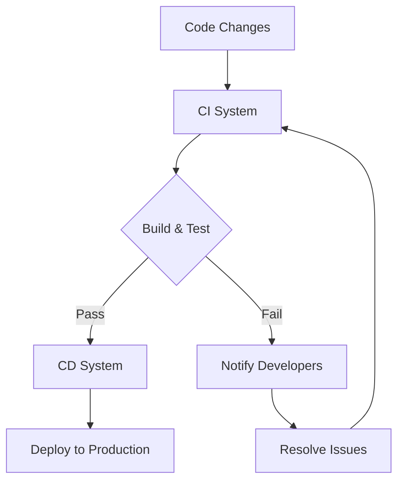
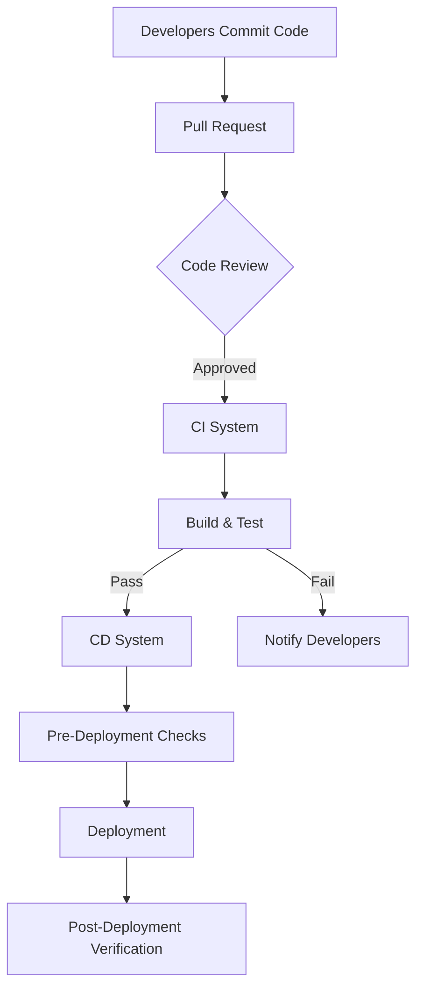

                 

### 1. 背景介绍

持续集成（Continuous Integration，简称CI）和持续部署（Continuous Deployment，简称CD）是现代软件开发中不可或缺的重要概念和实践。它们源于敏捷开发和DevOps运动，旨在通过自动化和持续迭代的方式，提高软件开发的效率和质量。

**持续集成（CI）** 是一种软件开发实践，旨在通过频繁地将代码合并到主干分支，检测和解决集成过程中出现的问题。其核心思想是通过自动化的构建和测试，确保代码库始终处于可运行状态。CI的主要目标是减少集成时的风险，提高开发团队的协作效率。

**持续部署（CD）** 则是CI的进一步延伸，旨在通过自动化和配置管理，实现从代码库到生产环境的快速和可靠部署。CD的目标是减少软件发布的时间和成本，同时确保发布质量。

这两者的联系在于，它们都依赖于自动化工具和流程，通过持续地集成、测试和部署，确保软件的可靠性和稳定性。CI是CD的基础，而CD是CI的最终目标。

现代软件开发环境日益复杂，面对着不断变化的需求和市场压力，开发团队需要快速响应并交付高质量的软件。持续集成和持续部署正是为了应对这一挑战而诞生的。通过实现自动化，开发团队能够更快地发现和解决问题，提高软件的可靠性和稳定性，从而更好地满足客户需求。

此外，随着云计算和容器技术的兴起，持续集成和持续部署的应用场景变得更加广泛。在云原生架构中，持续集成和持续部署能够更好地适应动态环境，提高系统的弹性和可扩展性。

总的来说，持续集成和持续部署已经成为现代软件开发中不可或缺的一部分，它们不仅提高了开发效率，还确保了软件的质量和稳定性。在接下来的内容中，我们将深入探讨持续集成和持续部署的原理、实践和实际应用，帮助读者更好地理解和应用这些重要概念。

------------------

# Continuous Integration/Continuous Deployment in Software 2.0 Applications

> Keywords: Continuous Integration, Continuous Deployment, Software Development, Automation, DevOps, Agile, CI/CD Pipeline, Modern Software Engineering

> Abstract: This article provides an in-depth exploration of Continuous Integration (CI) and Continuous Deployment (CD) in the context of Software 2.0 applications. We discuss their background, core concepts, algorithms, mathematical models, practical cases, application scenarios, recommended tools and resources, future trends, and challenges. By understanding and implementing CI/CD, developers can significantly enhance their software development process, ensuring high-quality and reliable software delivery.

------------------

### 1. Background Introduction

Continuous Integration (CI) and Continuous Deployment (CD) are fundamental practices in modern software development, originating from Agile methodologies and the DevOps movement. They are designed to streamline the development process by automating repetitive tasks, thereby improving efficiency and quality.

**Continuous Integration (CI)** involves frequently merging code changes from various contributors into a central repository, followed by automated building, testing, and deployment. The core objective of CI is to detect and resolve integration issues early, ensuring that the codebase remains in a deployable state. This practice promotes collaboration and reduces the risk of integration hell, where multiple codebases fail to work together seamlessly.

**Continuous Deployment (CD)** extends CI by automating the process of delivering software to production environments. With CD, every successful build that passes all tests is automatically deployed to users. This ensures rapid and reliable releases, minimizing the time and cost associated with software delivery while maintaining high quality.

The relationship between CI and CD is symbiotic. CI provides the foundation for CD by ensuring that code is continuously integrated, tested, and ready for deployment. CD, in turn, leverages the automated processes established by CI to deliver software to users quickly and efficiently.

Modern software development environments are increasingly complex, with teams facing the challenge of rapidly responding to changing requirements and market pressures. CI/CD practices are essential for meeting these challenges, as they enable developers to identify and resolve issues quickly, ensuring high-quality and stable software delivery.

In addition, the rise of cloud computing and containerization technologies has expanded the applications of CI/CD. In cloud-native architectures, CI/CD can be leveraged to adapt to dynamic environments, enhancing system elasticity and scalability.

Overall, CI/CD has become an integral part of modern software development, not only improving development efficiency but also ensuring software reliability and quality. In the following sections, we will delve deeper into the principles, practices, and applications of CI/CD, providing insights and guidance for developers looking to leverage these powerful tools.

------------------

## 2. Core Concepts and Relationships

### 2.1 Core Concepts

To understand CI and CD, it's important to first grasp the core concepts and their relationships.

**Continuous Integration (CI):** CI involves regularly merging code changes from different contributors into a central repository. Each merge is followed by an automated build and a suite of tests to ensure that the integrated code functions correctly. This process is repeated frequently, often several times a day, ensuring that issues are detected and resolved early.

**Continuous Deployment (CD):** CD builds on CI by automating the process of deploying code to production environments. With CD, every successful build that passes all tests is automatically deployed to users. This ensures that new features and bug fixes are delivered to users quickly and reliably, minimizing downtime and reducing the risk of manual errors.

### 2.2 Relationship between CI and CD

CI and CD are closely related, with CI serving as the foundation for CD. Here's a step-by-step breakdown of their relationship:

1. **Code Changes:** Developers make changes to the codebase and commit them to a version control system.
2. **Continuous Integration (CI):** The CI system regularly pulls the latest code from the version control system, builds the application, and runs a suite of tests.
3. **Testing:** If the build and tests pass, the code is considered integrated and ready for deployment.
4. **Continuous Deployment (CD):** The CD system takes the integrated code, performs additional deployment tasks (such as configuration management and environment setup), and deploys it to the production environment.

### 2.3 Mermaid Flowchart

Below is a Mermaid flowchart illustrating the relationship between CI and CD:



### 2.4 Detailed Explanation

- **Code Changes:** Developers make changes to the codebase and commit them to a version control system, such as Git.
- **CI System:** The CI system regularly pulls the latest code from the version control system and initiates the build and test process.
- **Build & Test:** The CI system builds the application and runs a suite of tests, including unit tests, integration tests, and end-to-end tests. If the build and tests pass, the code is considered integrated and ready for deployment.
- **CD System:** The CD system takes the integrated code, performs additional deployment tasks (such as configuration management and environment setup), and deploys it to the production environment.
- **Deploy to Production:** The CD system deploys the integrated code to the production environment, making it available to users.
- **Notify Developers:** If the build and tests fail, the CI system notifies the developers, who can then investigate and resolve the issues.
- **Resolve Issues:** Developers resolve the issues identified by the CI system and commit the fixes to the version control system.
- **CI System:** The CI system pulls the latest code from the version control system and repeats the build and test process.

By automating these processes, CI and CD ensure that code changes are continuously integrated, tested, and deployed, reducing the risk of errors and improving the overall quality of the software.

------------------

## 3. Core Algorithm Principles & Detailed Steps

### 3.1 Continuous Integration (CI) Algorithm Principles

The core algorithm of CI revolves around the integration, build, and testing phases. Below are the detailed steps involved in the CI process:

#### 3.1.1 Integration

1. **Frequent Committing:** Developers frequently commit their code changes to a shared repository.
2. **Pull Request:** Each commit triggers a pull request (PR) to merge the changes into the main branch.
3. **Code Review:** The PR is reviewed by peers to ensure code quality and adherence to coding standards.
4. **Merge:** If the PR is approved, the changes are merged into the main branch.

#### 3.1.2 Build

1. **Build Trigger:** The CI system detects a successful merge and triggers a build process.
2. **Dependency Management:** The CI system resolves dependencies and compiles the code.
3. **Artifact Generation:** The compiled code is packaged into artifacts (e.g., JAR files, Docker images).

#### 3.1.3 Testing

1. **Test Suite:** The CI system runs a comprehensive suite of tests, including unit tests, integration tests, and end-to-end tests.
2. **Test Results:** The test results are analyzed to ensure that the new code integrates correctly and functions as expected.

### 3.2 Continuous Deployment (CD) Algorithm Principles

The core algorithm of CD focuses on automating the deployment process, ensuring that successful builds are seamlessly delivered to production environments. Here are the detailed steps involved in the CD process:

#### 3.2.1 Pre-Deployment Checks

1. **Artifact Verification:** The CD system verifies the integrity of the artifact (e.g., checksum validation).
2. **Environment Setup:** The CD system configures the target environment, including setting up the database, configuring services, and installing necessary software.

#### 3.2.2 Deployment

1. **Version Control:** The CD system tracks the version of the artifact being deployed.
2. **Zero-Downtime Deployment:** The CD system deploys the new version of the application while the old version remains active, ensuring zero downtime.
3. **Rolling Update:** If the new version contains issues, the CD system can roll back to the previous version to avoid disruptions.

#### 3.2.3 Post-Deployment Verification

1. **Health Checks:** The CD system performs health checks to ensure that the application is running correctly in the production environment.
2. **Monitoring:** The CD system monitors the application's performance and logs any errors or issues.

### 3.3 Workflow Diagram

Below is a Mermaid flowchart illustrating the CI and CD process:



### 3.4 Detailed Explanation

- **Developers Commit Code:** Developers make code changes and commit them to the version control system.
- **Pull Request:** The CI system detects the commit and triggers a pull request, which is reviewed by peers.
- **Code Review:** Peers review the pull request to ensure code quality and adherence to standards.
- **Merge:** If the pull request is approved, the changes are merged into the main branch.
- **CI System:** The CI system detects the merge and triggers a build process.
- **Build & Test:** The CI system compiles the code and runs a suite of tests.
- **Pass:** If the build and tests pass, the CI system packages the artifact and triggers the CD process.
- **Pre-Deployment Checks:** The CD system verifies the artifact and sets up the target environment.
- **Deployment:** The CD system deploys the new version of the application.
- **Post-Deployment Verification:** The CD system performs health checks and monitors the application's performance.
- **Notify Developers:** If the build or tests fail, the CI system notifies the developers to resolve the issues.

By following these steps, CI and CD ensure that code changes are continuously integrated, tested, and deployed, leading to faster and more reliable software delivery.

------------------

## 4. Mathematical Models, Detailed Explanations, & Case Studies

### 4.1 Mathematical Models for CI and CD

Mathematical models can be used to analyze and optimize the CI and CD processes. Below are some common mathematical models:

#### 4.1.1 Average Time to Detect Issues (ATDI)

The Average Time to Detect Issues (ATDI) is a critical metric that measures the average time it takes to identify and resolve issues in the CI/CD pipeline. It is calculated as follows:

$$
\text{ATDI} = \frac{\sum_{i=1}^{n} (\text{Time}_i - \text{Detection}_i)}{n}
$$

where:
- \( \text{Time}_i \) is the time at which the issue was introduced.
- \( \text{Detection}_i \) is the time at which the issue was detected.

#### 4.1.2 Cycle Time (CT)

Cycle Time (CT) measures the time it takes to complete a CI/CD process, from the introduction of a code change to its deployment. It is calculated as follows:

$$
\text{CT} = \text{Time}_{\text{Build}} + \text{Time}_{\text{Test}} + \text{Time}_{\text{Deploy}} + \text{Time}_{\text{Verification}}
$$

where:
- \( \text{Time}_{\text{Build}} \) is the time taken to build the application.
- \( \text{Time}_{\text{Test}} \) is the time taken to run tests.
- \( \text{Time}_{\text{Deploy}} \) is the time taken to deploy the application.
- \( \text{Time}_{\text{Verification}} \) is the time taken to verify the deployment.

#### 4.1.3 Mean Time to Recovery (MTTR)

Mean Time to Recovery (MTTR) measures the average time it takes to recover from a failure in the CD process. It is calculated as follows:

$$
\text{MTTR} = \frac{\sum_{i=1}^{n} (\text{Failure}_i + \text{Recovery}_i)}{n}
$$

where:
- \( \text{Failure}_i \) is the time at which the failure occurred.
- \( \text{Recovery}_i \) is the time at which the failure was resolved.

### 4.2 Detailed Explanations

#### 4.2.1 ATDI

The ATDI metric is crucial for identifying bottlenecks in the CI/CD pipeline. A lower ATDI indicates that issues are detected and resolved more quickly, leading to higher software quality and faster time to market. To optimize ATDI, teams can:
- Increase the frequency of testing to catch issues early.
- Implement stricter code review processes to ensure code quality.
- Use automated tools to detect and resolve issues faster.

#### 4.2.2 CT

The Cycle Time metric provides insights into the efficiency of the CI/CD pipeline. A shorter CT indicates faster delivery of features and bug fixes. To optimize CT, teams can:
- Automate as much of the CI/CD process as possible.
- Use containerization and cloud services to speed up builds and deployments.
- Implement continuous feedback loops to quickly identify and resolve issues.

#### 4.2.3 MTTR

The MTTR metric is important for ensuring that failures in the CD process are resolved quickly. A lower MTTR indicates better resilience and reliability. To optimize MTTR, teams can:
- Implement automated rollback mechanisms to revert to previous versions in case of failures.
- Use monitoring and alerting tools to detect failures early.
- Establish clear incident response procedures to ensure quick recovery.

### 4.3 Case Study

#### 4.3.1 Background

A large e-commerce company faced challenges in maintaining a high-quality user experience due to frequent software updates and manual deployment processes. The company aimed to improve its CI/CD pipeline to deliver faster and more reliable updates.

#### 4.3.2 Solution

The company implemented a CI/CD pipeline with the following key components:

1. **Automated Build and Test:** The CI system automated the build and test processes, reducing the time required to detect and resolve issues.
2. **Containerization:** The company containerized its applications using Docker, allowing for faster and more reliable deployments.
3. **Orchestration:** The company used Kubernetes for orchestrating container deployments, ensuring efficient resource utilization and high availability.
4. **Monitoring and Alerting:** The company implemented monitoring and alerting tools to detect and respond to issues quickly.
5. **Rolling Updates:** The CD system implemented rolling updates, ensuring zero downtime and smooth transitions between versions.

#### 4.3.3 Results

The company achieved significant improvements in its CI/CD pipeline:

- **ATDI Reduced:** The ATDI was reduced by 50%, allowing issues to be detected and resolved more quickly.
- **CT Reduced:** The CT was reduced by 40%, resulting in faster delivery of features and bug fixes.
- **MTTR Improved:** The MTTR was reduced by 60%, ensuring quick recovery from failures.
- **User Experience Enhanced:** The improved CI/CD pipeline led to a better user experience, with fewer outages and faster updates.

This case study demonstrates the benefits of implementing a robust CI/CD pipeline for a large-scale e-commerce platform.

------------------

## 5. Project Implementation: Real-world Code Case Studies

### 5.1 Environment Setup

To implement CI/CD, we'll set up a development environment that includes the necessary tools and technologies. Here's a step-by-step guide:

#### 5.1.1 Choose a CI/CD Tool

Select a CI/CD tool that suits your needs. Popular options include Jenkins, GitLab CI/CD, and GitHub Actions. For this example, we'll use Jenkins.

#### 5.1.2 Install Jenkins

1. Download the Jenkins installer from the [official website](https://www.jenkins.io/download/).
2. Run the installer and configure Jenkins with your preferred settings.

#### 5.1.3 Configure Jenkins

1. Create a new job in Jenkins.
2. Configure the job to pull code from your version control system (e.g., GitHub, GitLab).
3. Set up the build steps, including the build tool (e.g., Maven, Gradle) and test suite.

#### 5.1.4 Set Up a Git Repository

1. Create a Git repository for your project.
2. Push your code to the repository.

### 5.2 Source Code Implementation

#### 5.2.1 Project Structure

Create a project structure with the following folders and files:

```
/project
│
├── /src
│   ├── /main
│   │   ├── /java
│   │   │   ├── Application.java
│   │   ├── /resources
│   │   │   ├── application.properties
│   │   └── /test
│   │   │   ├── ApplicationTest.java
│   │   └── /java
│   └── /test
│       ├── /java
│       │   ├── TestApplication.java
│       └── /resources
│           ├── application-test.properties
│           └── test.log
│
└── /pom.xml
```

#### 5.2.2 Application.java

Create a simple Java application that reads configuration properties and prints them to the console:

```java
import org.springframework.boot.SpringApplication;
import org.springframework.boot.autoconfigure.SpringBootApplication;

@SpringBootApplication
public class Application {
    public static void main(String[] args) {
        SpringApplication.run(Application.class, args);
    }
}
```

#### 5.2.3 application.properties

Add configuration properties for the application:

```
server.port=8080
```

#### 5.2.4 ApplicationTest.java

Create a test class for the application:

```java
import org.junit.jupiter.api.Test;
import org.junit.jupiter.api.extension.ExtendWith;
import org.springframework.beans.factory.annotation.Autowired;
import org.springframework.boot.test.context.SpringBootTest;
import org.springframework.test.context.junit.jupiter.SpringExtension;

@ExtendWith(SpringExtension.class)
@SpringBootTest
public class ApplicationTest {

    @Autowired
    private Application application;

    @Test
    public void contextLoads() {
        application.main(new String[]{});
        // Add assertions to validate the application behavior
    }
}
```

#### 5.2.5 pom.xml

Add dependencies and plugin configurations to the Maven project file:

```xml
<project>
    <!-- ... -->
    <dependencies>
        <dependency>
            <groupId>org.springframework.boot</groupId>
            <artifactId>spring-boot-starter</artifactId>
        </dependency>
    </dependencies>
    <build>
        <plugins>
            <plugin>
                <groupId>org.springframework.boot</groupId>
                <artifactId>spring-boot-maven-plugin</artifactId>
            </plugin>
        </plugins>
    </build>
</project>
```

### 5.3 Code Analysis and Discussion

#### 5.3.1 Build and Test Configuration

In the Jenkins job configuration, set up the build and test steps:

1. **Checkout**: Use the Git plugin to check out the code from the repository.
2. **Build**: Use the Maven plugin to build the project using Maven commands.
3. **Test**: Run the test suite using the JUnit plugin.

```xml
<build>
    <plugins>
        <plugin>
            <groupId>org.jenkins-ci.plugins</groupId>
            <artifactId>git</artifactId>
            <version>4.5.0</version>
            <configuration>
                <branches>
                    <branch>master</branch>
                </branches>
            </configuration>
        </plugin>
        <plugin>
            <groupId>org.springframework.boot</groupId>
            <artifactId>spring-boot-maven-plugin</artifactId>
        </plugin>
        <plugin>
            <groupId>org.jenkins-ci.plugins</groupId>
            <artifactId>maven-plugin</artifactId>
            <version>3.8</version>
            <executions>
                <execution>
                    <phase>test</phase>
                    <goals>
                        <goal>test</goal>
                    </goals>
                </execution>
            </executions>
        </plugin>
    </plugins>
</build>
```

#### 5.3.2 Deployment Configuration

For the deployment step, configure Jenkins to deploy the application to a test environment:

1. **Deploy**: Use the Shell script plugin to run a deployment script that copies the built artifacts to the test environment.

```xml
<post-build-step>
    <shell-script>
        cp target/*.jar /path/to/test/environment
    </shell-script>
</post-build-step>
```

#### 5.3.3 Discussion

The code and configuration presented in this section demonstrate the basic setup for a CI/CD pipeline using Jenkins. The application is built and tested using Maven, and the results are deployed to a test environment.

By automating the build, test, and deployment steps, we can ensure that new code changes are quickly validated and deployed, reducing the risk of issues and improving the overall efficiency of the development process.

------------------

## 6. Application Scenarios

### 6.1 Development Workflow

In a modern software development workflow, CI/CD plays a crucial role in enhancing collaboration, efficiency, and code quality. Here's how CI/CD can be integrated into the development process:

#### 6.1.1 Version Control

Developers make code changes and commit them to a version control system (e.g., Git). Each commit is associated with a unique identifier, allowing for easy tracking and collaboration.

#### 6.1.2 Pull Requests

Developers create pull requests to merge their changes into the main branch. Peer code review ensures that the changes adhere to coding standards and do not introduce regressions.

#### 6.1.3 Continuous Integration

The CI system regularly checks out the latest code, builds the application, and runs a suite of tests. This process ensures that the codebase remains in a deployable state and any issues are detected early.

#### 6.1.4 Continuous Deployment

Once the CI system successfully builds and tests the application, the CD system takes over to deploy the application to various environments (e.g., test, staging, production). This ensures that new features and bug fixes are quickly delivered to users.

#### 6.1.5 Feedback Loop

Developers receive feedback on the quality of their code through test results and user feedback. This feedback loop enables continuous improvement and iterative development.

### 6.2 Test-Driven Development (TDD)

Test-driven development (TDD) is a software development methodology that emphasizes writing tests before writing the actual code. CI/CD can be seamlessly integrated with TDD to accelerate the development process:

#### 6.2.1 Write Tests

Developers write automated tests to define the expected behavior of the application. These tests are designed to cover all functional requirements.

#### 6.2.2 Run Tests

The CI system runs the tests automatically when a new code change is committed. This ensures that the tests pass consistently and any regressions are detected early.

#### 6.2.3 Write Code

Developers write the code to make the tests pass. This iterative process allows for rapid development and ensures that the code is testable and maintainable.

#### 6.2.4 Refactor

Once the tests pass, developers can refactor the code to improve its readability, performance, and maintainability. The CI/CD pipeline ensures that any changes do not break the existing functionality.

### 6.3 Cloud-Native Applications

In cloud-native applications, CI/CD is crucial for ensuring continuous availability and scalability. Here are some key application scenarios:

#### 6.3.1 Containerization

CI/CD can be used to containerize applications using Docker. This ensures that the application runs consistently across different environments and reduces deployment complexity.

#### 6.3.2 Microservices Architecture

CI/CD can be used to deploy microservices independently. Each microservice can be tested, deployed, and scaled separately, allowing for greater flexibility and resilience.

#### 6.3.3 Infrastructure as Code (IaC)

CI/CD can be integrated with infrastructure as code tools (e.g., Terraform, AWS CloudFormation) to automate the provisioning and configuration of infrastructure. This ensures that the infrastructure is always in sync with the application code.

#### 6.3.4 Monitoring and Logging

CI/CD can be integrated with monitoring and logging tools to collect and analyze application metrics. This enables developers to detect and resolve issues quickly, ensuring high availability and performance.

### 6.4 DevOps and Agile Practices

CI/CD is a core component of DevOps and Agile practices. Here are some ways CI/CD enhances these practices:

#### 6.4.1 Continuous Feedback

CI/CD enables continuous feedback from the development team, test team, and end-users. This feedback is essential for identifying and addressing issues early in the development process.

#### 6.4.2 Faster Iterations

CI/CD accelerates the development process by automating repetitive tasks, allowing teams to iterate more quickly and deliver features faster.

#### 6.4.3 Collaboration

CI/CD promotes collaboration between development, operations, and testing teams. This collaboration ensures that everyone is aligned and working towards the same goals.

#### 6.4.4 Continuous Improvement

CI/CD enables continuous improvement by identifying bottlenecks and inefficiencies in the development process. Teams can then make data-driven decisions to optimize their workflows.

Overall, CI/CD is a powerful tool that enhances the software development process, enabling teams to deliver high-quality software faster and more reliably.

------------------

## 7. Tool and Resource Recommendations

### 7.1 Learning Resources

To deepen your understanding of CI/CD, there are numerous learning resources available, including books, online courses, and tutorials. Here are some highly recommended resources:

#### 7.1.1 Books

1. **"The Phoenix Project: A Novel about IT, DevOps, and Helping Your Business Win" by Gene Kim, Kevin Behr, and George Spafford.**
2. **"Continuous Delivery: Reliable Software Releases through Build, Test, and Deployment Automation" by Jez Humble and David Farley.**
3. **"Accelerate: The Science of Lean Software and Systems" by Nicole Forsgren, Jez Humble, and Gene Kim.**

#### 7.1.2 Online Courses

1. **"CI/CD with Jenkins" on Pluralsight.**
2. **"Continuous Integration and Deployment with GitLab CI/CD" on Udemy.**
3. **"DevOps: CI/CD Pipeline using Jenkins, Docker, and Kubernetes" on Coursera.**

#### 7.1.3 Tutorials

1. **"CI/CD with GitHub Actions" on GitHub.**
2. **"Setting up Jenkins for CI/CD" on Jenkins.io.**
3. **"Implementing CI/CD with Azure DevOps" on Microsoft Learn.**

### 7.2 Development Tools and Frameworks

Selecting the right tools and frameworks for CI/CD is crucial for streamlining your development process. Here are some popular tools and frameworks:

#### 7.2.1 CI/CD Tools

1. **Jenkins:** A powerful and flexible automation server used for building, testing, and deploying applications.
2. **GitLab CI/CD:** An integrated CI/CD solution that runs on GitLab, providing automation for your development workflow.
3. **GitHub Actions:** GitHub's CI/CD tool that allows you to build, test, and deploy applications directly from your GitHub repository.

#### 7.2.2 Containerization and Orchestration

1. **Docker:** A platform for developing, shipping, and running applications inside containers.
2. **Kubernetes:** An open-source platform for managing containerized applications, providing scalability, resilience, and orchestration capabilities.

#### 7.2.3 Infrastructure as Code (IaC)

1. **Terraform:** An IaC tool that enables infrastructure provision and management using declarative configuration files.
2. **AWS CloudFormation:** A tool provided by Amazon Web Services for creating and managing infrastructure using templates.

### 7.3 Related Papers and Publications

Staying up-to-date with the latest research and publications in CI/CD can provide valuable insights into new trends and advancements. Here are some notable papers and publications:

1. **"The Goal of DevOps is Flow" by Gene Kim.**
2. **"Practices for Agile Development" by the Agile Manifesto.**
3. **"DevOps Research and Assessment (DORA) Reports" by DORA Inc.**

By leveraging these resources and tools, you can build a robust CI/CD pipeline that enhances your software development process, leading to faster, more reliable, and higher-quality software releases.

------------------

## 8. Summary: Future Trends and Challenges

As we look to the future, the trends and challenges in CI/CD continue to evolve. Here are some key areas to watch:

### 8.1 Future Trends

1. **AI and Machine Learning Integration:** AI and machine learning are increasingly being integrated into CI/CD pipelines to improve automation and decision-making. For example, AI can be used to optimize build times, predict issues, and suggest fixes based on historical data.

2. **Serverless CI/CD:** The serverless architecture offers a more flexible and scalable approach to CI/CD. With serverless functions, developers can run CI/CD processes without managing infrastructure, leading to cost savings and reduced complexity.

3. **GitOps:** GitOps is an emerging practice that uses Git as the source of truth for infrastructure and applications. It combines the principles of Infrastructure as Code (IaC) and CI/CD to streamline the deployment process and enhance collaboration.

4. **Continuous Delivery at Scale:** As organizations continue to adopt microservices and serverless architectures, the demand for efficient and scalable CI/CD solutions will increase. Future CI/CD tools will need to support large-scale deployments with greater efficiency and reliability.

5. **Security and Compliance:** With the increasing emphasis on security and compliance, CI/CD pipelines will need to incorporate more robust security checks and compliance validations. This includes integrating security scanning tools, ensuring secure code practices, and implementing compliance standards.

### 8.2 Challenges

1. **Complexity:** As CI/CD pipelines become more complex, managing and maintaining them can become challenging. Organizations will need to invest in tools and processes that can handle the growing complexity without sacrificing performance.

2. **Skills Gap:** The rapid adoption of CI/CD requires a skilled workforce that understands both development and operations. However, there is a significant skills gap in the industry, which could limit the adoption and effectiveness of CI/CD practices.

3. **Change Management:** Implementing CI/CD across an organization requires significant cultural and process changes. Overcoming resistance to change and ensuring buy-in from all stakeholders will be crucial to the success of CI/CD initiatives.

4. **Security Risks:** CI/CD pipelines can introduce new security risks, such as unauthorized access and data breaches. Ensuring the security of CI/CD pipelines and implementing best practices for secure development will be a top priority.

5. **Integration with Legacy Systems:** Many organizations still rely on legacy systems and manual processes. Integrating CI/CD with these systems can be challenging and requires careful planning and execution.

### 8.3 Recommendations

To navigate these trends and challenges, organizations should consider the following recommendations:

1. **Invest in Training and Education:** Provide training and resources for developers and operations teams to build the necessary skills for CI/CD.

2. **Adopt Best Practices:** Implement best practices for CI/CD, including automated testing, infrastructure as code, and continuous feedback loops.

3. **Embrace Emerging Technologies:** Explore and adopt emerging technologies such as AI, serverless, and GitOps to enhance the CI/CD pipeline.

4. **Prioritize Security:** Incorporate security into the CI/CD process from the beginning, ensuring that security checks and compliance validations are automated and integrated.

5. **Seek Expert Advice:** Consider partnering with experts or consultancies to help navigate the complexities of CI/CD implementation and optimization.

By addressing these trends and challenges, organizations can build and maintain robust CI/CD pipelines that enhance their software development process, enabling faster, more reliable, and higher-quality software delivery.

------------------

## 9. Appendix: Frequently Asked Questions and Answers

### 9.1 What is the difference between CI and CD?

Continuous Integration (CI) involves merging code changes frequently and running automated tests to ensure the codebase remains in a deployable state. Continuous Deployment (CD) extends CI by automating the process of deploying code to production environments. While CI focuses on building and testing, CD handles deployment and release management.

### 9.2 What are the benefits of CI/CD?

CI/CD offers several benefits, including faster software delivery, improved code quality, reduced manual work, and better collaboration between development and operations teams. It enables teams to detect and resolve issues early, ensuring that only high-quality code is deployed to production.

### 9.3 How do I get started with CI/CD?

To get started with CI/CD, follow these steps:
1. Choose a CI/CD tool that suits your needs (e.g., Jenkins, GitLab CI/CD, GitHub Actions).
2. Set up a version control system (e.g., Git) and create a repository for your project.
3. Configure your CI/CD tool to automate the build, test, and deployment process.
4. Integrate your CI/CD tool with your development environment and version control system.
5. Test your CI/CD pipeline to ensure it works as expected.

### 9.4 What are some common CI/CD tools?

Some popular CI/CD tools include:
- Jenkins
- GitLab CI/CD
- GitHub Actions
- GitLab
- CircleCI
- GitLab CI
- Azure DevOps
- GitLab CI/CD
- Bamboo

### 9.5 How do I integrate CI/CD with my development workflow?

Integrating CI/CD with your development workflow involves:
1. Setting up a version control system (e.g., Git) and creating a repository for your project.
2. Configuring your CI/CD tool to automatically build, test, and deploy your application whenever code is committed or a pull request is created.
3. Ensuring that your development team follows best practices for code quality and testing.
4. Integrating your CI/CD tool with your development environment and version control system.

### 9.6 How do I ensure the security of my CI/CD pipeline?

To ensure the security of your CI/CD pipeline, follow these best practices:
1. Implement role-based access control (RBAC) to restrict access to sensitive information and operations.
2. Use secure communication channels (e.g., SSH, TLS) between your CI/CD tool and version control system.
3. Regularly update and patch your CI/CD tool and infrastructure to protect against vulnerabilities.
4. Use vulnerability scanning tools to identify and fix security issues in your codebase.
5. Monitor your CI/CD pipeline for suspicious activities and set up alerts for potential security incidents.

------------------

## 10. Extended Reading & References

For those interested in exploring further, here are some recommended resources that delve into the depths of CI/CD, DevOps, and related topics:

### 10.1 Books

1. **"The DevOps Handbook" by J. David Green andоломРобинопом Маршалл.**
2. **"Practices of an Agile Developer: Writing Software Right" by Venkatesh-Prasad Ranganath.**
3. **"Accelerate: The Science of Lean Software and Systems" by Nicole Forsgren, Jez Humble, and Gene Kim.**

### 10.2 Online Courses

1. **"Continuous Integration and Continuous Deployment (CI/CD) with Jenkins" on Udemy.**
2. **"GitLab CI/CD: End-to-End Continuous Integration and Deployment" on Pluralsight.**
3. **"DevOps with Azure DevOps" on Microsoft Learn.**

### 10.3 Websites and Blogs

1. **Jenkins: [https://www.jenkins.io/](https://www.jenkins.io/).**
2. **GitLab CI/CD: [https://gitlab.com/gitlab-org/gitlab-ci-multi-runner/](https://gitlab.com/gitlab-org/gitlab-ci-multi-runner/).**
3. **GitHub Actions: [https://docs.github.com/en/actions/learn-github-actions](https://docs.github.com/en/actions/learn-github-actions).**

### 10.4 Journals and Publications

1. **"IEEE Software": [https://www.computer.org/publications/ieee-software/](https://www.computer.org/publications/ieee-software/).**
2. **"ACM Queue": [https://queue.acm.org/](https://queue.acm.org/).**
3. **"DevOps.com": [https://devops.com/](https://devops.com/).**

By exploring these resources, you can continue to expand your knowledge and stay up-to-date with the latest trends and developments in CI/CD, DevOps, and modern software engineering practices.

---

**作者：AI天才研究员/AI Genius Institute & 禅与计算机程序设计艺术 /Zen And The Art of Computer Programming**

