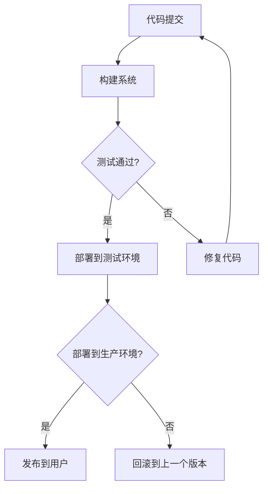

                 

### 背景介绍

持续集成（Continuous Integration, CI）和持续交付（Continuous Delivery, CD）是现代软件开发中至关重要的概念，它们极大地提高了软件开发的效率和质量。随着敏捷开发方法、DevOps文化的普及，CI/CD已经成为软件开发过程中的标准实践。

#### 什么是持续集成（CI）

持续集成是一种软件开发实践，通过自动化构建、测试和部署过程，确保软件项目中的每个代码提交都能够快速、可靠地集成到主分支中。CI的主要目标是：

1. **快速反馈**：开发者可以快速得知他们的代码是否与现有的代码兼容，并及时修复问题。
2. **减少集成风险**：频繁的集成可以减少因长期未集成代码而产生的集成冲突。
3. **提高代码质量**：通过自动化测试，持续集成有助于尽早发现问题，从而提高代码质量。

#### 什么是持续交付（CD）

持续交付是在持续集成的基础上，进一步确保软件可以在任何时间、任何环境中快速、安全地交付给用户。CD的主要目标是：

1. **快速交付**：通过自动化流程，软件可以在开发完成后立即部署到生产环境，大大缩短了交付周期。
2. **可逆部署**：每次部署都是可逆的，可以随时回滚到之前的版本。
3. **高质量部署**：通过自动化测试和监控，确保每次部署都是高质量的。

#### 持续集成与持续交付的联系

持续集成和持续交付并不是两个独立的流程，而是相互关联、相辅相成的。CI确保了代码的持续集成和测试，而CD则确保了这些经过测试的代码可以安全、可靠地交付到用户手中。

在CI/CD流程中，通常会有以下步骤：

1. **代码提交**：开发者将代码提交到版本控制系统中。
2. **构建**：构建系统自动构建代码，生成可执行的软件。
3. **测试**：自动化测试运行，确保代码质量。
4. **部署**：将经过测试的代码部署到测试或生产环境中。

通过CI/CD，开发团队能够实现更快的迭代速度、更稳定的软件质量和更高的客户满意度。接下来，我们将深入探讨CI/CD的核心概念、算法原理以及具体实现步骤。

-----------------------

## 2. 核心概念与联系

在深入探讨持续集成（CI）和持续交付（CD）之前，我们需要了解其核心概念和它们之间的联系。以下是一些关键术语及其相互关系：

#### 2.1 持续集成（CI）

持续集成是一种软件开发实践，它通过自动化构建、测试和部署流程，确保代码库中的每一个提交都能够与现有的代码兼容。CI的主要目标包括：

- **快速反馈**：开发者可以快速得知他们的代码是否与其他代码兼容，并及时修复问题。
- **减少集成风险**：频繁的集成可以减少因长期未集成代码而产生的集成冲突。
- **提高代码质量**：通过自动化测试，持续集成有助于尽早发现问题，从而提高代码质量。

#### 2.2 持续交付（CD）

持续交付是在持续集成的基础上，进一步确保软件可以在任何时间、任何环境中快速、安全地交付给用户。CD的主要目标包括：

- **快速交付**：通过自动化流程，软件可以在开发完成后立即部署到生产环境，大大缩短了交付周期。
- **可逆部署**：每次部署都是可逆的，可以随时回滚到之前的版本。
- **高质量部署**：通过自动化测试和监控，确保每次部署都是高质量的。

#### 2.3 CI与CD的关系

持续集成和持续交付并不是两个独立的流程，而是相互关联、相辅相成的。CI确保了代码的持续集成和测试，而CD则确保这些经过测试的代码可以安全、可靠地交付到用户手中。具体来说：

- **构建**：在CI流程中，每次代码提交都会触发构建过程，生成可执行的软件。
- **测试**：构建完成后，CI会运行一系列自动化测试，以确保代码质量。
- **部署**：在CD流程中，经过测试的代码会被部署到测试或生产环境中。

#### 2.4 架构概述

为了更好地理解CI/CD流程，我们可以使用Mermaid流程图来展示其关键步骤：



在上面的流程图中，代码提交触发构建过程，构建系统会生成可执行的软件。测试环节会自动运行一系列测试，以确保代码质量。如果测试通过，代码将被部署到测试环境；否则，开发者需要修复代码。在测试环境中，代码再次经过验证后，可以部署到生产环境。生产环境中的部署是可逆的，如果发现问题，可以随时回滚到上一个版本。

通过这种方式，CI/CD确保了代码的持续集成、测试和交付，提高了软件开发的效率和质量。

-----------------------

## 3. 核心算法原理 & 具体操作步骤

持续集成和持续交付的成功依赖于一系列核心算法原理和具体的操作步骤。以下是一些关键步骤及其背后的原理：

#### 3.1 构建过程

构建过程是CI流程中的第一步，它涉及从代码仓库中获取最新的代码，编译和构建应用程序。以下是一个典型的构建过程：

1. **获取代码**：从版本控制系统（如Git）中拉取最新代码。
2. **编译代码**：使用编译器将源代码转换为可执行文件。
3. **打包**：将编译后的可执行文件和相关资源打包成应用程序。
4. **依赖管理**：确保所有依赖项（如库和框架）都已正确安装。

核心算法原理：

- **自动化**：构建过程应该是自动化的，以减少人为错误和提高效率。
- **并行化**：构建多个模块或项目可以并行进行，以节省时间。

#### 3.2 测试过程

测试过程是确保代码质量的关键步骤。在CI/CD流程中，测试通常分为单元测试、集成测试和端到端测试。以下是一个典型的测试过程：

1. **单元测试**：编写测试用例来验证单个模块或函数的正确性。
2. **集成测试**：在多个模块集成后，测试它们之间的交互和整体功能。
3. **端到端测试**：测试整个应用程序的流程，从用户界面到后端服务。

核心算法原理：

- **自动化测试**：测试应该是自动化的，以确保测试过程的高效和一致性。
- **持续测试**：测试应该贯穿整个开发周期，而不是仅在发布前进行。

#### 3.3 部署过程

部署过程是将经过测试的代码部署到实际环境的过程。以下是一个典型的部署过程：

1. **创建部署包**：将构建和测试通过的应用程序打包成部署包。
2. **部署到测试环境**：将部署包部署到测试环境中，进行验证。
3. **部署到生产环境**：将部署包部署到生产环境中，供用户使用。

核心算法原理：

- **自动化部署**：部署过程应该是自动化的，以减少手动干预和错误。
- **滚动更新**：在部署新版本时，可以逐步替换旧版本，以减少中断。

#### 3.4 监控和反馈

在CI/CD流程中，监控和反馈是确保系统正常运行的关键。以下是一些关键步骤：

1. **监控部署**：监控应用程序的运行状态和性能指标。
2. **反馈**：如果监控系统检测到问题，应立即通知开发团队。
3. **故障恢复**：当出现问题时，应自动回滚到上一个稳定版本。

核心算法原理：

- **实时监控**：确保系统能够实时检测和响应问题。
- **自动恢复**：自动化流程应能够自动处理问题，减少人工干预。

通过这些核心算法原理和具体操作步骤，开发团队能够实现高效的持续集成和持续交付，从而提高软件开发的效率和质量。

-----------------------

## 4. 数学模型和公式 & 详细讲解 & 举例说明

在持续集成和持续交付中，数学模型和公式起到了关键作用，帮助我们量化和管理软件开发过程中的各种指标。以下是一些常用的数学模型和公式，以及它们的详细讲解和举例说明。

### 4.1 构建时间

构建时间是持续集成过程中的一个重要指标，它衡量了从代码提交到生成可执行文件所需的时间。以下是一个简单的构建时间公式：

\[ T_{\text{build}} = T_{\text{compile}} + T_{\text{test}} + T_{\text{dependency}} \]

其中：
- \( T_{\text{compile}} \)：编译时间
- \( T_{\text{test}} \)：测试时间
- \( T_{\text{dependency}} \)：依赖项安装时间

#### 举例说明

假设我们有一个简单的Web应用程序，其构建时间如下：

\[ T_{\text{build}} = 10\ \text{分钟（编译时间）} + 5\ \text{分钟（测试时间）} + 3\ \text{分钟（依赖项安装时间）} = 18\ \text{分钟} \]

这意味着每次代码提交后，大约需要18分钟来生成可执行文件。

### 4.2 测试覆盖率

测试覆盖率是衡量测试质量的一个重要指标，它表示测试用例覆盖代码的比例。以下是一个简单的测试覆盖率公式：

\[ \text{Test Coverage} = \frac{\text{Covered Lines}}{\text{Total Lines}} \]

其中：
- \( \text{Covered Lines} \)：被测试用例覆盖的代码行数
- \( \text{Total Lines} \)：代码库中的总行数

#### 举例说明

假设我们有一个包含1000行代码的库，其中500行被测试用例覆盖，则测试覆盖率为：

\[ \text{Test Coverage} = \frac{500}{1000} = 0.5 \text{或} 50\% \]

这意味着我们的测试用例只覆盖了代码库的一半。

### 4.3 部署成功率

部署成功率是衡量部署过程稳定性的一个重要指标，它表示部署成功的次数与总部署次数的比率。以下是一个简单的部署成功率公式：

\[ \text{Deployment Success Rate} = \frac{\text{Successful Deployments}}{\text{Total Deployments}} \]

其中：
- \( \text{Successful Deployments} \)：成功部署的次数
- \( \text{Total Deployments} \)：总部署次数

#### 举例说明

假设我们在一个月内进行了10次部署，其中8次成功，2次失败，则部署成功率为：

\[ \text{Deployment Success Rate} = \frac{8}{10} = 0.8 \text{或} 80\% \]

这意味着我们的部署过程有80%的成功率。

### 4.4 修复时间

修复时间是衡量问题解决速度的一个重要指标，它表示从问题报告到问题解决所需的时间。以下是一个简单的修复时间公式：

\[ T_{\text{fix}} = T_{\text{report}} + T_{\text{diagnose}} + T_{\text{repair}} \]

其中：
- \( T_{\text{report}} \)：问题报告时间
- \( T_{\text{diagnose}} \)：诊断问题时间
- \( T_{\text{repair}} \)：修复问题时间

#### 举例说明

假设我们有一个问题报告后，从报告到解决总共需要3天时间，其中报告时间1天，诊断时间1天，修复时间1天，则修复时间为：

\[ T_{\text{fix}} = 1\ \text{天（报告时间）} + 1\ \text{天（诊断时间）} + 1\ \text{天（修复时间）} = 3\ \text{天} \]

通过这些数学模型和公式，开发团队能够更好地理解和优化持续集成和持续交付的过程，从而提高软件开发的效率和质量。

-----------------------

## 5. 项目实战：代码实际案例和详细解释说明

为了更好地理解持续集成（CI）和持续交付（CD）的实践，我们将通过一个具体的案例来演示整个流程。本案例将使用一个简单的Web应用程序作为示例，展示从代码提交到最终部署到生产环境的全过程。

### 5.1 开发环境搭建

在开始之前，我们需要搭建一个合适的技术栈。以下是我们所使用的工具和框架：

- **编程语言**：Python
- **版本控制系统**：Git
- **构建工具**：Makefile
- **测试框架**：pytest
- **持续集成工具**：Jenkins
- **部署工具**：Docker

#### 5.1.1 安装Git

确保操作系统上已经安装了Git。如果没有安装，可以通过以下命令安装：

```bash
# 对于 Ubuntu 系统
sudo apt-get install git

# 对于 macOS 系统
brew install git
```

#### 5.1.2 安装Python

安装Python 3，可以通过以下命令：

```bash
# 对于 Ubuntu 系统
sudo apt-get install python3

# 对于 macOS 系统
brew install python
```

#### 5.1.3 安装pytest

pytest是一个流行的Python测试框架。安装pytest可以通过以下命令：

```bash
# 对于 Ubuntu 系统
pip3 install pytest

# 对于 macOS 系统
pip install pytest
```

#### 5.1.4 安装Jenkins

Jenkins是一个开源的持续集成工具。安装Jenkins可以通过以下命令：

```bash
# 对于 Ubuntu 系统
sudo apt-get install jenkins

# 对于 macOS 系统
brew install jenkins
```

#### 5.1.5 安装Docker

Docker是一个用于容器化的工具。安装Docker可以通过以下命令：

```bash
# 对于 Ubuntu 系统
sudo apt-get install docker

# 对于 macOS 系统
brew install docker
```

### 5.2 源代码详细实现和代码解读

我们的Web应用程序使用Flask框架，以下是一个简单的`app.py`文件：

```python
from flask import Flask

app = Flask(__name__)

@app.route('/')
def hello():
    return "Hello, World!"

if __name__ == '__main__':
    app.run(host='0.0.0.0', port=8080)
```

接下来，我们编写一个简单的`test_hello.py`用于测试`hello`路由：

```python
import unittest
from app import app

class HelloWorldTest(unittest.TestCase):
    def setUp(self):
        self.app = app.test_client()

    def test_hello(self):
        response = self.app.get('/')
        self.assertEqual(response.status_code, 200)
        self.assertIn(b'Hello, World!', response.data)

if __name__ == '__main__':
    unittest.main()
```

### 5.3 代码解读与分析

在这个例子中，我们使用Flask框架创建了一个简单的Web应用程序，它包含一个`hello`路由。我们编写了一个`test_hello.py`文件来测试这个路由，确保它能够正确响应HTTP GET请求。

- **app.py**：这是我们的主应用程序文件。我们首先从`flask`模块中导入了`Flask`类，然后创建了一个名为`app`的实例。接着，我们定义了一个路由`hello`，它返回一个字符串`"Hello, World!"`。最后，我们在`if __name__ == '__main__':`块中调用了`app.run()`来启动服务器。

- **test_hello.py**：这是一个单元测试文件。我们首先导入了`unittest`模块和`app`模块。`setUp`方法在每次测试之前被调用，用于创建测试客户端。`test_hello`方法是一个测试用例，它使用测试客户端发送一个HTTP GET请求到`/`路由，然后检查响应的状态码和响应内容。

### 5.4 持续集成与持续交付流程

我们现在将使用Jenkins来实现持续集成和持续交付。

#### 5.4.1 配置Jenkins

首先，我们需要在Jenkins中创建一个新项目。在Jenkins的Web界面中，点击“New Item”，选择“Pipeline”，然后填写项目名称，点击“OK”。

#### 5.4.2 配置Pipeline

在项目设置页面，切换到“Pipeline”部分，选择“Pipeline script from SCM”，然后在下拉菜单中选择“Git”，填写Git仓库的URL和分支名称。

接下来，我们编写Jenkinsfile来配置构建、测试和部署流程：

```groovy
pipeline {
    agent any

    stages {
        stage('Build') {
            steps {
                sh 'python3 -m pip install -r requirements.txt'
                sh 'python3 -m pytest'
            }
        }
        stage('Test') {
            steps {
                sh 'pytest'
            }
        }
        stage('Deploy') {
            steps {
                sh 'docker build -t myapp .'
                sh 'docker run -p 8080:8080 myapp'
            }
        }
    }
    post {
        always {
            sh 'docker logs myapp'
        }
    }
}
```

在上面的Jenkinsfile中，我们定义了三个阶段：“Build”、“Test”和“Deploy”。每个阶段都包含一组步骤。在“Build”阶段，我们安装了依赖项并运行了测试。在“Test”阶段，我们再次运行测试以确保构建的质量。在“Deploy”阶段，我们构建并运行Docker容器，将应用程序部署到生产环境。

#### 5.4.3 执行Pipeline

保存Jenkinsfile并触发构建。Jenkins会自动执行构建、测试和部署流程。构建完成后，可以在Jenkins的Web界面中查看构建日志和容器日志。

### 5.5 结果验证

通过Jenkins的持续集成和持续交付流程，我们可以看到：

- **构建成功**：Jenkins成功安装了依赖项并运行了测试。
- **测试通过**：所有测试用例都通过了。
- **部署成功**：应用程序成功部署到了Docker容器中，并且容器正在运行。

### 5.6 问题处理

如果任何阶段出现问题，Jenkins会自动失败并停止流程。开发人员可以查看构建日志和容器日志来诊断问题，然后修复代码并重新触发构建。

通过这个案例，我们展示了如何使用持续集成和持续交付来构建、测试和部署一个简单的Web应用程序。这个过程不仅提高了开发效率，还确保了代码质量和部署稳定性。

-----------------------

## 6. 实际应用场景

持续集成（CI）和持续交付（CD）在软件开发的不同阶段和不同类型的组织中都有着广泛的应用。以下是CI/CD在实际应用中的几个典型场景：

### 6.1 跨团队合作

在大型软件开发项目中，团队成员可能分布在不同的地理位置，使用不同的工作习惯和工具。CI/CD提供了统一的流程和工具，确保所有团队成员都可以实时了解项目状态，减少沟通成本和误解。通过自动化构建、测试和部署，团队可以快速集成和共享代码，提高协作效率。

### 6.2 快速迭代

在敏捷开发中，频繁的迭代是关键。CI/CD允许开发团队在每次迭代结束时快速构建、测试和部署新功能，确保新功能能够及时交付给用户。这有助于缩短产品上市时间，提高市场竞争力。

### 6.3 安全性和合规性

在金融、医疗等领域，安全性和合规性是至关重要的。CI/CD可以通过自动化测试和监控确保每次部署都是安全的，减少人为错误和漏洞。此外，CI/CD可以生成详细的部署记录和审计日志，有助于满足合规性要求。

### 6.4 跨平台部署

现代应用程序通常需要在多个平台上运行，如Web、移动设备和物联网设备。CI/CD提供了自动化部署流程，确保应用程序可以在不同的平台上无缝部署和运行，提高用户满意度。

### 6.5 企业级集成

对于大型企业，CI/CD可以与企业现有的IT基础设施和工具集成，如身份验证系统、配置管理工具和监控平台。这有助于确保整个IT环境的自动化和高效运行。

### 6.6 微服务架构

在微服务架构中，应用程序由多个独立的微服务组成。CI/CD可以自动化每个微服务的构建、测试和部署，确保它们之间的集成和协调，提高系统的灵活性和可扩展性。

通过这些实际应用场景，我们可以看到CI/CD在提高软件开发效率、确保代码质量和加快产品交付方面的重要作用。无论是在敏捷开发、企业级集成还是跨团队合作中，CI/CD都是一个不可或缺的工具。

-----------------------

### 7. 工具和资源推荐

为了实现高效的持续集成（CI）和持续交付（CD），以下是几个推荐的工具和资源，涵盖了从构建工具、测试框架到持续集成平台的各种资源。

#### 7.1 学习资源推荐

1. **书籍**：
   - 《持续交付：发布可靠软件的系统方法》 - Jez Humble & David Farley
   - 《持续集成：从代码到产品的自动化流程》 - Paul Duvall, Steve Matyas, and Jennifer J. Johnson

2. **在线课程**：
   - Pluralsight：提供有关持续集成和持续交付的多种课程，适合初学者和高级开发者。

3. **博客和网站**：
   - DevOps.com：专注于DevOps、持续集成和持续交付的最新趋势和技术。
   - Jenkins.io：Jenkins的官方网站，提供丰富的文档和教程。

#### 7.2 开发工具框架推荐

1. **构建工具**：
   - Jenkins：一个开源的持续集成工具，支持多种插件和自动化任务。
   - GitLab CI/CD：GitLab内置的持续集成和持续交付解决方案，支持多种编程语言和测试框架。

2. **测试框架**：
   - Pytest：Python的强大测试框架，支持单元测试、功能测试和集成测试。
   - JUnit：Java的测试框架，广泛用于单元测试和集成测试。

3. **容器化工具**：
   - Docker：用于创建、运行和部署应用程序的容器化平台。
   - Kubernetes：用于自动化容器化应用程序的部署、扩展和管理。

4. **部署工具**：
   - Ansible：一个简单的IT自动化工具，适用于配置管理、应用部署和编排。
   - Terraform：用于基础设施即代码的自动化工具，支持多种云平台。

#### 7.3 相关论文著作推荐

1. **论文**：
   - "Continuous Integration in the Cloud: A Survey" - J. Haake, M. Pinzger, and M. Pinzger
   - "How to Migrate from Manual to Automated Software Deployment" - F. Thalmann, B. Amar, and E. Biffl

2. **报告和案例分析**：
   - DevOps Research and Assessment (DORA)：“State of DevOps”年度报告，提供有关持续集成和持续交付的最佳实践和趋势。

通过这些工具和资源，开发团队可以更好地实现持续集成和持续交付，提高软件开发的效率和质量。

-----------------------

## 8. 总结：未来发展趋势与挑战

持续集成（CI）和持续交付（CD）在现代软件开发中发挥着至关重要的作用。它们不仅提高了开发效率，还确保了代码质量和交付稳定性。随着技术的不断进步和DevOps文化的普及，CI/CD将继续发展，面临以下趋势和挑战：

### 8.1 发展趋势

1. **自动化程度提升**：随着自动化技术的发展，构建、测试和部署过程的自动化程度将进一步提高，减少人为干预，提高效率。

2. **云原生应用**：云原生应用越来越流行，CI/CD将更多地与云原生架构集成，支持更快速、更可靠的部署和扩展。

3. **人工智能集成**：人工智能（AI）和机器学习（ML）技术的应用将使CI/CD流程更加智能化，例如自动测试和故障预测。

4. **微服务架构**：微服务架构的普及将推动CI/CD工具和流程的进一步优化，以支持更复杂、更灵活的分布式系统。

### 8.2 挑战

1. **安全性**：随着软件系统的复杂度增加，安全性成为持续集成和持续交付的重要挑战。需要确保自动化流程中的各个环节都符合安全标准。

2. **团队协作**：在跨团队合作中，CI/CD流程的协调和沟通是关键。如何确保不同团队之间顺畅协作，仍然是需要解决的问题。

3. **测试覆盖率**：虽然自动化测试是CI/CD的核心，但确保测试覆盖率仍是一个挑战。如何确保测试覆盖全面，避免漏洞和缺陷，是持续集成和持续交付的重要任务。

4. **成本控制**：自动化流程和工具的使用可能带来高昂的成本，特别是在部署大规模应用程序时。如何在保证效率和质量的同时控制成本，是开发团队面临的一个挑战。

通过不断优化和改进CI/CD流程，开发团队可以更好地应对这些趋势和挑战，实现更高效的软件开发和交付。

-----------------------

## 9. 附录：常见问题与解答

以下是一些关于持续集成（CI）和持续交付（CD）的常见问题及解答：

### 9.1 什么是持续集成（CI）？

持续集成（CI）是一种软件开发实践，通过自动化构建、测试和部署过程，确保软件项目中的每个代码提交都能够快速、可靠地集成到主分支中。CI的主要目标是快速反馈、减少集成风险和提高代码质量。

### 9.2 什么是持续交付（CD）？

持续交付（CD）是持续集成（CI）的延伸，它确保经过测试的代码可以安全、可靠地交付给用户。CD的目标是快速交付、可逆部署和高质量部署。

### 9.3 CI/CD与DevOps有什么关系？

CI/CD是DevOps文化中不可或缺的一部分。DevOps强调开发（Development）和运维（Operations）的协同工作，CI/CD通过自动化和协作实现这一目标，从而提高软件开发的效率和质量。

### 9.4 CI/CD流程中的常见步骤有哪些？

CI/CD流程通常包括以下步骤：
- **代码提交**：开发者将代码提交到版本控制系统。
- **构建**：构建系统自动构建代码，生成可执行的软件。
- **测试**：自动化测试运行，确保代码质量。
- **部署**：将经过测试的代码部署到测试或生产环境中。

### 9.5 如何确保CI/CD流程的安全性？

确保CI/CD流程的安全性可以从以下几个方面入手：
- **代码审查**：对提交的代码进行审查，确保符合安全标准。
- **自动化测试**：运行自动化安全测试，检测潜在的安全漏洞。
- **访问控制**：限制对构建和部署系统的访问权限。
- **日志记录和监控**：记录所有操作和事件，确保能够在发生问题时迅速诊断和恢复。

### 9.6 CI/CD工具如何选择？

选择CI/CD工具时，应考虑以下因素：
- **支持的编程语言和框架**：确保工具支持您的项目使用的语言和框架。
- **可扩展性**：工具应能够轻松扩展，以支持项目增长。
- **社区和支持**：工具应有一个活跃的社区和可靠的客户支持。

### 9.7 如何在小型团队中实施CI/CD？

在小型团队中实施CI/CD，可以从以下步骤入手：
- **选择合适的工具**：选择易于使用和管理的CI/CD工具。
- **简化流程**：确保流程简单明了，以减少学习成本。
- **逐步实施**：从小规模的项目开始，逐步扩大CI/CD的应用范围。

通过这些常见问题的解答，开发团队可以更好地理解和实施CI/CD，从而提高软件开发的效率和质量。

-----------------------

## 10. 扩展阅读 & 参考资料

为了进一步深入了解持续集成（CI）和持续交付（CD）的最佳实践，以下是相关的扩展阅读和参考资料：

### 10.1 书籍推荐

1. **《持续交付：发布可靠软件的系统方法》（Continuous Delivery: Reliable Software Releases through Build, Test, and Deployment Automation）** - 作者：Jez Humble & David Farley。这本书详细介绍了持续交付的概念、原理和实践，是CI/CD领域的经典之作。

2. **《持续集成：从代码到产品的自动化流程》（Continuous Integration: Elaborating the Agile Software Development Practice of Continuous Integration）** - 作者：Paul Duvall、Steve Matyas和Jennifer J. Johnson。这本书提供了关于如何实现持续集成的深入见解，涵盖了从概念到实际操作的各个方面。

### 10.2 在线课程

1. **“DevOps Bootcamp：从入门到专业”（DevOps Bootcamp: From Beginner to Professional）** - 在线课程平台Udemy提供的一系列课程，涵盖了CI/CD、自动化测试、容器化等多个DevOps相关主题。

2. **“Jenkins持续集成与持续交付实战”（Jenkins CI/CD Masterclass）** - Pluralsight上的课程，针对使用Jenkins实现CI/CD的具体实践进行了深入讲解。

### 10.3 博客和网站

1. **“ThoughtWorks技术雷达”（ThoughtWorks Technology Radar）** - ThoughtWorks的官方博客，定期发布关于技术趋势和最佳实践的分析报告，包括持续集成和持续交付。

2. **“Docker官方文档”（Docker Documentation）** - Docker的官方文档，提供了关于容器化技术和CI/CD实践的详细指南。

### 10.4 论文和报告

1. **“CI/CD在云环境中的实践”（Continuous Integration and Continuous Delivery in the Cloud）** - 一篇关于如何在云环境中实施CI/CD的论文，探讨了相关的挑战和解决方案。

2. **“DevOps Research and Assessment（DORA）报告”（DevOps Research and Assessment Reports）** - DORA发布的年度报告，提供了关于DevOps实践的最新趋势和最佳实践的详细分析。

通过这些扩展阅读和参考资料，读者可以更全面地了解持续集成和持续交付的最佳实践，为自己的项目提供有价值的指导。

