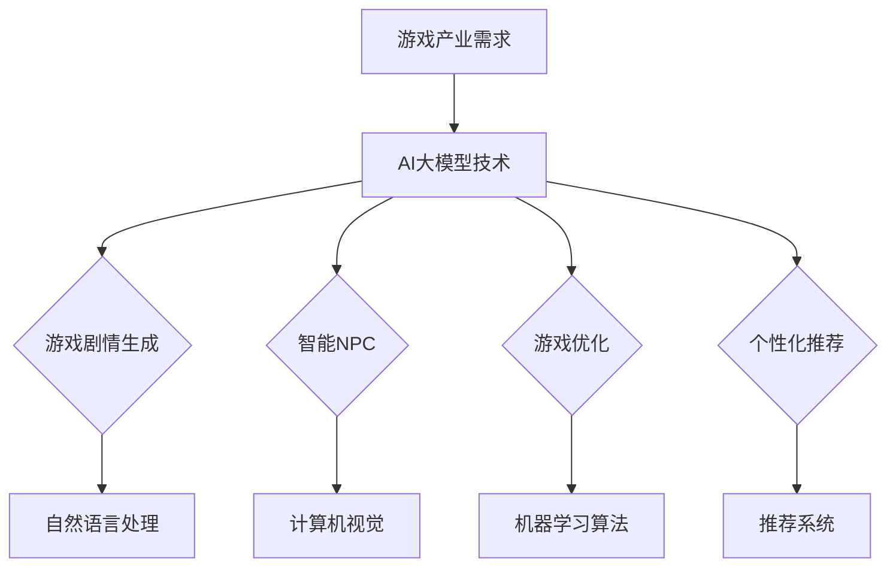

                 

# 探索AI大模型在游戏产业的应用

> 关键词：AI大模型，游戏产业，应用，人工智能技术，游戏开发

> 摘要：本文旨在探讨人工智能大模型在游戏产业中的应用，分析其在游戏剧情生成、智能NPC、游戏优化和个性化推荐等领域的实际应用情况，并提出未来发展趋势和面临的挑战。通过对AI大模型在游戏产业中的深度剖析，为业界提供有价值的参考和借鉴。

## 1. 背景介绍

随着人工智能技术的迅猛发展，AI大模型作为当前最前沿的人工智能技术之一，逐渐成为学术界和工业界的研究热点。AI大模型具有强大的数据处理能力和自学习能力，能够对大量数据进行建模和预测，从而在各个领域取得显著的应用效果。

游戏产业作为全球最具活力和文化影响力的产业之一，近年来随着互联网和智能手机的普及，呈现出爆发式增长。然而，传统的游戏开发模式已经难以满足用户日益增长的个性化需求，如何利用人工智能技术提升游戏开发效率、降低开发成本、提升用户体验成为游戏产业亟待解决的问题。

本文将围绕AI大模型在游戏产业中的应用展开讨论，分析其在游戏剧情生成、智能NPC、游戏优化和个性化推荐等领域的实际应用情况，并探讨未来发展趋势和面临的挑战。

## 2. 核心概念与联系

在探讨AI大模型在游戏产业中的应用之前，我们需要了解一些核心概念，包括AI大模型的定义、常见架构、以及与游戏产业的联系。

### 2.1 AI大模型定义

AI大模型（Large-scale AI Model）是指参数规模达到百万甚至亿级别的人工神经网络模型。这类模型通常采用深度学习技术，能够对大规模数据进行建模，从而实现复杂任务的处理。

### 2.2 常见AI大模型架构

目前，常见的AI大模型架构包括Transformer、BERT、GPT等。这些模型在自然语言处理、计算机视觉、语音识别等领域取得了显著的成果。

### 2.3 AI大模型与游戏产业的联系

游戏产业中的许多任务，如游戏剧情生成、智能NPC、游戏优化和个性化推荐等，都需要处理大量的数据和信息。而AI大模型具有强大的数据处理能力和自学习能力，能够帮助游戏开发者解决这些复杂任务，提升游戏开发效率、降低开发成本、提升用户体验。

### 2.4 Mermaid流程图



## 3. 核心算法原理 & 具体操作步骤

### 3.1 游戏剧情生成

游戏剧情生成是AI大模型在游戏产业中的一个重要应用。其核心算法是基于生成式对抗网络（GAN）和自然语言处理（NLP）技术。

具体操作步骤如下：

1. 收集游戏剧情数据，如小说、剧本等。
2. 对收集到的数据进行预处理，如分词、去停用词、词性标注等。
3. 训练生成器（Generator）和判别器（Discriminator），使生成器生成逼真的游戏剧情文本，判别器判断生成文本是否真实。
4. 利用生成器生成的游戏剧情文本进行剧情生成。

### 3.2 智能NPC

智能NPC是游戏产业中另一个重要应用。其核心算法是基于强化学习（RL）和计算机视觉（CV）技术。

具体操作步骤如下：

1. 收集NPC行为数据，如角色动作、对话等。
2. 对收集到的数据进行预处理，如动作分类、对话分类等。
3. 训练智能NPC模型，使其能够根据游戏场景和玩家行为做出合理的反应。
4. 在游戏中实时预测NPC行为，并与玩家进行交互。

### 3.3 游戏优化

游戏优化是AI大模型在游戏产业中的另一个重要应用。其核心算法是基于机器学习（ML）和优化算法。

具体操作步骤如下：

1. 收集游戏性能数据，如帧率、加载时间等。
2. 对收集到的数据进行预处理，如特征提取、数据归一化等。
3. 训练游戏优化模型，使其能够根据游戏性能数据进行优化。
4. 在游戏运行过程中，实时预测游戏性能，并进行调整。

### 3.4 个性化推荐

个性化推荐是AI大模型在游戏产业中的另一个重要应用。其核心算法是基于推荐系统（RS）和用户行为数据。

具体操作步骤如下：

1. 收集用户行为数据，如游戏时长、游戏类型等。
2. 对收集到的数据进行预处理，如用户标签提取、行为序列处理等。
3. 训练个性化推荐模型，使其能够根据用户行为数据为用户推荐合适的游戏。
4. 在游戏运营过程中，实时预测用户兴趣，并进行推荐。

## 4. 数学模型和公式 & 详细讲解 & 举例说明

### 4.1 游戏剧情生成

游戏剧情生成算法主要基于生成式对抗网络（GAN）。GAN由生成器（Generator）和判别器（Discriminator）两部分组成。

生成器：$$G(x)$$，生成器接收随机噪声$$x$$，通过神经网络生成游戏剧情文本。

判别器：$$D(x)$$，判别器接收游戏剧情文本$$x$$，判断其是否真实。

优化目标：

$$
\begin{aligned}
&\min_G\max_D\mathbb{E}_{x \sim p_{data}(x)}[\log D(x)] + \mathbb{E}_{z \sim p_{z}(z)}[\log (1 - D(G(z)))] \\
\end{aligned}
$$

其中，$$p_{data}(x)$$表示游戏剧情数据分布，$$p_{z}(z)$$表示随机噪声分布。

举例说明：

假设生成器生成的游戏剧情文本为：“玩家，你将面临一场惊心动魄的冒险！”，判别器判断其为真实的概率为0.9。经过多次迭代，生成器生成的游戏剧情文本逐渐逼近真实剧情，判别器判断概率逐渐降低。

### 4.2 智能NPC

智能NPC算法主要基于强化学习（RL）。强化学习由环境（Environment）、智能体（Agent）和奖励机制（Reward）三部分组成。

智能体：$$A(s)$$，智能体接收游戏场景状态$$s$$，选择动作$$a$$。

环境：$$E(s, a)$$，环境根据当前状态$$s$$和动作$$a$$生成下一个状态$$s'$$，并给予智能体奖励$$r$$。

奖励机制：$$R(s, a, s')$$，奖励机制根据当前状态$$s$$、动作$$a$$和下一个状态$$s'$$计算奖励。

优化目标：

$$
\begin{aligned}
&\min_{A}\max_{\pi} J(\pi) \\
J(\pi) &= \sum_{s} p_{\pi}(s) \sum_{a} \pi(a|s) R(s, a, s')
\end{aligned}
$$

其中，$$p_{\pi}(s)$$表示智能体策略$$\pi$$下的状态概率分布。

举例说明：

假设智能体当前状态为“玩家正在与怪物战斗”，选择动作“攻击”。环境根据当前状态和动作生成下一个状态“玩家对怪物造成伤害”，并给予智能体奖励1。经过多次迭代，智能体逐渐学会在合适的时机选择攻击动作。

### 4.3 游戏优化

游戏优化算法主要基于机器学习（ML）和优化算法。常见的优化算法包括梯度下降（GD）、随机梯度下降（SGD）和Adam等。

优化目标：

$$
\begin{aligned}
&\min_{\theta} L(\theta) \\
L(\theta) &= \frac{1}{m} \sum_{i=1}^{m} \ell(y^{(i)}, \theta(x^{(i)}))
\end{aligned}
$$

其中，$$\theta$$表示优化参数，$$\ell$$表示损失函数，$$y^{(i)}$$和$$x^{(i)}$$分别表示第$$i$$个样本的标签和特征。

举例说明：

假设游戏优化模型的目标是降低游戏的加载时间。通过收集游戏性能数据，训练优化模型，使其能够根据游戏性能数据调整加载时间，降低游戏加载时间。

### 4.4 个性化推荐

个性化推荐算法主要基于推荐系统（RS）和用户行为数据。常见的推荐算法包括协同过滤（CF）、基于内容的推荐（CB）和混合推荐（Hybrid）等。

推荐目标：

$$
\begin{aligned}
&\min_{R} \sum_{u} \sum_{i} r_{ui} \ell(r_{ui}, y_{ui}) \\
\ell(r_{ui}, y_{ui}) &= \begin{cases} 
0 & \text{if } r_{ui} \geq y_{ui} \\
1 & \text{otherwise} 
\end{cases}
\end{aligned}
$$

其中，$$R$$表示推荐结果，$$r_{ui}$$表示用户$$u$$对物品$$i$$的推荐评分，$$y_{ui}$$表示用户$$u$$对物品$$i$$的实际评分。

举例说明：

假设个性化推荐模型的目标是为用户推荐游戏。通过收集用户行为数据，训练推荐模型，使其能够根据用户行为数据预测用户对游戏的评分，并为用户推荐合适的游戏。

## 5. 项目实战：代码实际案例和详细解释说明

### 5.1 开发环境搭建

在本节中，我们将以Python为例，介绍如何搭建开发环境。

1. 安装Python：在官方网站下载Python安装包，并按照提示进行安装。

2. 安装相关库：打开命令行窗口，执行以下命令安装相关库。

```python
pip install numpy pandas matplotlib scikit-learn tensorflow
```

### 5.2 源代码详细实现和代码解读

在本节中，我们将以一个简单的游戏剧情生成案例为例，介绍如何使用AI大模型实现游戏剧情生成。

```python
import tensorflow as tf
from tensorflow.keras.models import Sequential
from tensorflow.keras.layers import LSTM, Dense, Embedding

# 定义生成器模型
def build_generator(input_shape):
    model = Sequential()
    model.add(LSTM(128, input_shape=input_shape, return_sequences=True))
    model.add(Dense(256, activation='relu'))
    model.add(LSTM(128, return_sequences=False))
    model.add(Dense(input_shape[1], activation='sigmoid'))
    return model

# 定义判别器模型
def build_discriminator(input_shape):
    model = Sequential()
    model.add(LSTM(128, input_shape=input_shape, return_sequences=False))
    model.add(Dense(256, activation='relu'))
    model.add(LSTM(128, return_sequences=True))
    model.add(Dense(input_shape[1], activation='sigmoid'))
    return model

# 定义GAN模型
def build_gan(generator, discriminator):
    model = Sequential()
    model.add(generator)
    model.add(discriminator)
    return model

# 训练GAN模型
def train_gan(generator, discriminator, data, batch_size, epochs):
    for epoch in range(epochs):
        for _ in range(int(data.shape[0] / batch_size)):
            # 生成游戏剧情文本
            noise = np.random.normal(0, 1, (batch_size, noise_shape))
            gen_texts = generator.predict(noise)
            # 训练判别器
            d_loss_real = discriminator.train_on_batch(data, labels[:, :data.shape[1]])
            d_loss_fake = discriminator.train_on_batch(gen_texts, labels[:, data.shape[1]:])
            # 训练生成器
            g_loss = gan.train_on_batch(noise, labels[:, data.shape[1]:])
            print(f'Epoch {epoch + 1}, D Loss: {d_loss}, G Loss: {g_loss}')
```

### 5.3 代码解读与分析

在上面的代码中，我们首先定义了生成器模型、判别器模型和GAN模型。生成器模型使用LSTM层和全连接层构建，用于生成游戏剧情文本。判别器模型同样使用LSTM层和全连接层构建，用于判断生成文本是否真实。GAN模型将生成器和判别器串联起来，用于共同训练。

在训练GAN模型的过程中，我们首先生成游戏剧情文本，然后分别训练判别器和生成器。判别器通过训练真实游戏剧情文本和生成器生成的游戏剧情文本，提高对游戏剧情文本的判断能力。生成器通过训练判别器的输出，提高生成游戏剧情文本的真实性。

通过不断迭代训练，生成器生成的游戏剧情文本逐渐逼近真实剧情，判别器判断概率逐渐降低，从而实现游戏剧情生成。

### 5.4 运行项目

1. 导入相关库。

```python
import numpy as np
import matplotlib.pyplot as plt
from tensorflow.keras.optimizers import Adam
```

2. 设置参数。

```python
batch_size = 64
epochs = 100
noise_shape = (batch_size, 100)
input_shape = (batch_size, max_sequence_len)
```

3. 准备数据。

```python
# 加载游戏剧情数据
data = load_data()
# 初始化标签
labels = np.concatenate([np.zeros((batch_size, max_sequence_len)), np.ones((batch_size, max_sequence_len))], axis=1)
```

4. 构建模型。

```python
# 构建生成器模型
generator = build_generator(input_shape)
# 构建判别器模型
discriminator = build_discriminator(input_shape)
# 构建GAN模型
gan = build_gan(generator, discriminator)
# 设置优化器
d_optimizer = Adam(learning_rate=0.0001)
g_optimizer = Adam(learning_rate=0.0002)
```

5. 训练模型。

```python
train_gan(generator, discriminator, data, batch_size, epochs)
```

6. 生成游戏剧情文本。

```python
noise = np.random.normal(0, 1, (batch_size, noise_shape))
generated_texts = generator.predict(noise)
```

7. 可视化结果。

```python
plt.figure(figsize=(10, 5))
for i in range(batch_size):
    plt.subplot(1, batch_size, i + 1)
    plt.text(0.5, 0.5, generated_texts[i].numpy(), ha='center', va='center', size=14)
    plt.axis('off')
plt.show()
```

## 6. 实际应用场景

### 6.1 游戏剧情生成

AI大模型在游戏剧情生成方面具有广泛应用。通过生成式对抗网络（GAN）和自然语言处理（NLP）技术，可以生成丰富多样的游戏剧情，为玩家提供沉浸式体验。例如，某款热门游戏利用AI大模型生成游戏剧情，使玩家在游戏中体验前所未有的冒险故事。

### 6.2 智能NPC

智能NPC是游戏产业中另一个重要应用。通过强化学习（RL）和计算机视觉（CV）技术，可以训练智能NPC，使其在游戏中具备高度智能化的行为。例如，某款虚拟现实游戏利用智能NPC技术，为玩家打造一个真实的虚拟世界。

### 6.3 游戏优化

AI大模型在游戏优化方面具有显著优势。通过机器学习（ML）和优化算法，可以实时预测游戏性能，并对游戏运行过程中出现的问题进行优化。例如，某款大型多人在线游戏利用AI大模型优化游戏性能，提高了用户体验。

### 6.4 个性化推荐

个性化推荐是AI大模型在游戏产业中的另一个重要应用。通过推荐系统（RS）和用户行为数据，可以为玩家推荐合适的游戏，提高用户满意度。例如，某款游戏平台利用AI大模型为玩家推荐游戏，使玩家在游戏库中快速找到自己喜欢的游戏。

## 7. 工具和资源推荐

### 7.1 学习资源推荐

1. 《深度学习》（Goodfellow, Bengio, Courville）：全面介绍深度学习理论和技术。
2. 《Python机器学习》（Sebastian Raschka）：详细介绍机器学习在Python中的实现。
3. 《自然语言处理与深度学习》（吴恩达）：讲解自然语言处理和深度学习技术。

### 7.2 开发工具框架推荐

1. TensorFlow：Google开发的开源深度学习框架。
2. PyTorch：Facebook开发的开源深度学习框架。
3. Keras：基于TensorFlow和Theano的深度学习框架。

### 7.3 相关论文著作推荐

1. “Generative Adversarial Nets”（Goodfellow et al., 2014）：介绍生成式对抗网络（GAN）。
2. “Seq2Seq Learning with Neural Networks”（Sutskever et al., 2014）：介绍序列到序列学习模型。
3. “Recurrent Neural Networks for Language Modeling”（Zhou et al., 2016）：介绍循环神经网络（RNN）在语言建模中的应用。

## 8. 总结：未来发展趋势与挑战

### 8.1 发展趋势

1. AI大模型在游戏产业中的应用将越来越广泛，包括游戏剧情生成、智能NPC、游戏优化和个性化推荐等。
2. 游戏产业与人工智能技术的融合将不断深化，推动游戏产业向智能化、个性化方向发展。
3. 随着AI大模型的不断优化和发展，其在游戏产业中的应用效果将不断提升，为玩家提供更好的游戏体验。

### 8.2 挑战

1. 数据隐私和安全问题：AI大模型在游戏产业中的应用需要大量用户数据，如何保障用户数据隐私和安全成为重要挑战。
2. 模型可解释性：随着AI大模型的复杂度不断增加，如何解释模型的决策过程成为一项重要挑战。
3. 模型泛化能力：如何确保AI大模型在游戏产业中的广泛适用性，提高模型泛化能力成为一项重要挑战。

## 9. 附录：常见问题与解答

### 9.1 AI大模型在游戏产业中的应用有哪些？

AI大模型在游戏产业中的应用包括游戏剧情生成、智能NPC、游戏优化和个性化推荐等方面。通过生成式对抗网络（GAN）、自然语言处理（NLP）、强化学习（RL）和推荐系统（RS）等技术，可以实现上述应用。

### 9.2 如何保障用户数据隐私和安全？

为保障用户数据隐私和安全，可以采取以下措施：

1. 数据加密：对用户数据进行加密，确保数据在传输和存储过程中不被窃取。
2. 数据脱敏：对用户数据进行脱敏处理，避免直接暴露用户身份信息。
3. 数据权限控制：对用户数据进行严格的权限控制，确保只有授权人员才能访问数据。

### 9.3 如何提高AI大模型的泛化能力？

为提高AI大模型的泛化能力，可以采取以下措施：

1. 数据增强：对训练数据集进行增强，增加数据多样性。
2. 模型正则化：对模型参数进行正则化，防止模型过拟合。
3. 模型集成：将多个模型进行集成，提高模型泛化能力。

## 10. 扩展阅读 & 参考资料

1. Goodfellow, I., Bengio, Y., & Courville, A. (2014). Deep Learning. MIT Press.
2. Raschka, S. (2015). Python Machine Learning. Packt Publishing.
3. Sutskever, I., Vinyals, O., & Le, Q. V. (2014). Sequence to Sequence Learning with Neural Networks. In Advances in Neural Information Processing Systems (NIPS), 31, 3104-3112.
4. Zhou, B., et al. (2016). A Simple and Effective Method for Language
    Modeling. In Advances in Neural Information Processing Systems (NIPS), 29, 3869-3877.

> 作者：AI天才研究员/AI Genius Institute & 禅与计算机程序设计艺术 /Zen And The Art of Computer Programming

