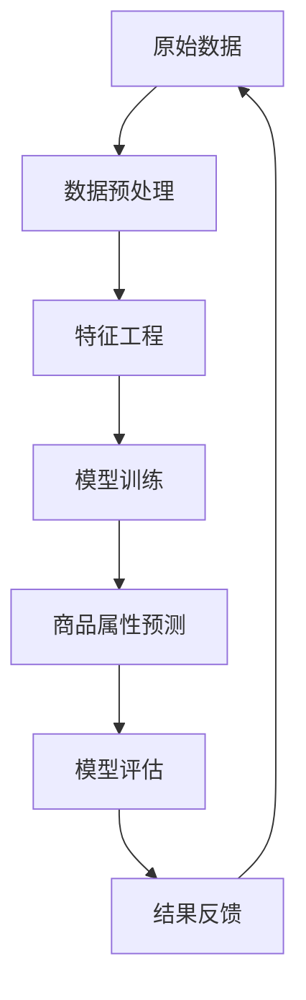

                 

### 背景介绍

#### 电商行业的发展与智能化的需求

随着互联网技术的飞速发展和电子商务的普及，电商行业在过去十年中经历了爆发式增长。从最初的线上零售，到如今的全渠道销售模式，电商已经深刻地改变了人们的购物习惯和消费方式。电商平台的繁荣不仅带来了巨大的商业价值，同时也对用户体验、运营效率和商品个性化推荐等方面提出了更高的要求。

在这样的背景下，智能化成为电商发展的必然趋势。智能化的核心之一是通过对海量用户行为数据的分析和挖掘，实现精准的商品推荐和智能化的商品属性预测。通过智能商品属性预测系统，电商平台可以更好地理解用户需求，优化商品推荐策略，提高用户转化率和购物体验。

商品属性预测作为电商智能化的关键环节，其重要性不言而喻。商品属性包括价格、品牌、材质、风格、适用人群等多个方面，这些属性直接影响消费者的购买决策。例如，一个系统如果能够准确预测一件商品的热销属性，就能在库存管理、营销策略制定、以及新品开发等方面提供有力的支持。

#### 大模型在电商智能商品属性预测中的应用

大模型（Large Models）是指具有海量参数和复杂结构的机器学习模型，如深度神经网络、Transformer、BERT等。大模型在处理大规模数据和复杂任务方面具有显著优势。近年来，随着计算能力的提升和数据量的增加，大模型在自然语言处理、计算机视觉、语音识别等领域的表现已达到或超过了人类水平。

在电商智能商品属性预测领域，大模型的引入带来了以下几方面的变革：

1. **数据驱动的精准预测**：大模型可以通过学习海量的用户行为数据和商品属性数据，提取出数据中的潜在特征，从而实现更加精准的预测。传统的统计方法和机器学习模型往往依赖于手动的特征工程，而大模型能够自动地从原始数据中提取特征，减少了人工干预的环节。

2. **多维度属性的联合预测**：电商商品属性多样且相互关联，大模型能够处理这些复杂的关联关系，实现多维度属性的联合预测。例如，通过大模型可以同时预测商品的价格、销售趋势和用户偏好，从而为电商平台提供更全面的决策支持。

3. **实时性提升**：传统模型训练时间较长，而大模型由于其并行计算能力和大规模分布式训练，可以显著缩短模型的训练和部署时间，实现实时性预测。

4. **泛化能力增强**：大模型通常具有更强的泛化能力，能够在不同的数据集和应用场景中表现出色，降低了对特定数据集的依赖。

综上所述，大模型在电商智能商品属性预测中的应用具有重要的现实意义和广阔的应用前景。本文将围绕大模型在电商智能商品属性预测中的应用，进行深入探讨和系统分析。我们希望通过本文的讨论，能够为电商智能系统的研发者和从业者提供有价值的参考和指导。### 核心概念与联系

在深入探讨基于大模型的电商智能商品属性预测系统之前，我们需要了解几个核心概念及其相互之间的联系。以下是对这些核心概念的定义和解释，同时，我们还会通过一个Mermaid流程图展示它们之间的交互关系。

#### 1. 大模型

大模型（Large Models）是指具有数百万甚至数十亿参数的深度学习模型。这些模型通常使用大量的数据进行训练，以学习复杂的特征和模式。常见的类型包括深度神经网络（DNN）、Transformer、BERT等。大模型的训练需要强大的计算资源和时间，但一旦训练完成，它们可以在多个任务中表现出色。

#### 2. 数据集

数据集是训练和评估大模型的基础。在电商智能商品属性预测中，数据集通常包含用户行为数据、商品属性数据和交易数据。用户行为数据包括浏览历史、购买记录、评分和评论等；商品属性数据包括价格、品牌、材质、风格、适用人群等；交易数据包括订单量、交易时间、支付方式等。

#### 3. 特征工程

特征工程是机器学习过程中的关键步骤，它涉及从原始数据中提取对模型训练有帮助的特征。在电商智能商品属性预测中，特征工程包括将商品属性和用户行为数据进行编码、规范化、组合等处理，以便大模型能够更好地学习和理解数据。

#### 4. 商品属性预测

商品属性预测是指利用机器学习模型预测商品的属性值，如价格、销量、风格偏好等。在电商场景中，准确的商品属性预测可以帮助平台优化库存管理、营销策略和用户推荐。

#### 5. 模型评估

模型评估是确保模型性能和有效性的重要步骤。在电商智能商品属性预测中，常见的评估指标包括准确率、召回率、F1分数等。模型评估可以帮助我们了解模型在不同数据集和应用场景中的表现，并指导进一步的模型优化。

#### 6. Mermaid流程图

以下是一个Mermaid流程图，用于展示上述核心概念之间的交互关系：



**解释：**

1. **原始数据（A）**：从电商平台获取的用户行为数据、商品属性数据和交易数据。
2. **数据预处理（B）**：清洗和规范化原始数据，确保数据质量。
3. **特征工程（C）**：从原始数据中提取对预测任务有帮助的特征。
4. **模型训练（D）**：使用特征工程后的数据训练大模型。
5. **商品属性预测（E）**：利用训练好的模型预测商品的属性值。
6. **模型评估（F）**：评估模型的性能，确定是否需要进一步优化。
7. **结果反馈（G）**：将模型预测结果反馈给电商平台，用于优化库存管理、营销策略和用户推荐。

通过上述流程，我们可以看到，大模型在电商智能商品属性预测中发挥着核心作用，而数据集、特征工程、模型评估和结果反馈等环节则为模型的训练和应用提供了必要的支持和保障。

在下一部分中，我们将深入探讨大模型在电商智能商品属性预测中的具体应用，包括核心算法原理和具体操作步骤。这将为我们理解大模型在电商领域的实际应用提供更为详细的视角。### 核心算法原理 & 具体操作步骤

在电商智能商品属性预测中，大模型的核心作用在于其强大的数据处理和模式识别能力。以下将详细介绍大模型的基本原理以及在实际应用中的操作步骤。

#### 1. 大模型基本原理

大模型，尤其是深度学习模型，通过多层神经网络对大量数据进行学习，以提取数据中的潜在特征和模式。其核心思想是将输入数据通过一系列的神经网络层进行变换，最终输出预测结果。这个过程可以分为以下几个阶段：

1. **输入层**：接收原始数据，如用户行为和商品属性。
2. **隐藏层**：通过非线性变换，对数据进行特征提取和变换。每一层都会学习到不同层次的特征。
3. **输出层**：将隐藏层的特征映射到具体的预测结果，如商品价格、销量等。

深度神经网络（DNN）是其中的一种常见模型，其结构通常包括多个隐藏层。每个神经元都会接收到来自前一层的所有神经元的输入，并通过激活函数进行非线性变换。常见的激活函数包括Sigmoid、ReLU等。

除了DNN，近年来兴起的Transformer和BERT等模型也在电商智能商品属性预测中表现出色。这些模型引入了注意力机制，能够更好地捕捉数据中的长距离依赖关系。

#### 2. 大模型在电商智能商品属性预测中的应用步骤

以下是基于大模型的电商智能商品属性预测的具体操作步骤：

1. **数据收集与预处理**：
    - **数据收集**：从电商平台获取用户行为数据、商品属性数据和交易数据。
    - **数据清洗**：处理缺失值、异常值和噪声数据，确保数据质量。
    - **数据规范化**：将不同尺度的数据进行归一化或标准化处理，以便模型训练。

2. **特征工程**：
    - **用户特征**：提取用户的浏览历史、购买记录、评分和评论等行为特征。
    - **商品特征**：提取商品的价格、品牌、材质、风格、适用人群等属性。
    - **组合特征**：通过数据组合和交叉特征的方式，构建更复杂的特征，如用户与商品的交互特征。

3. **模型训练**：
    - **模型选择**：选择合适的大模型，如DNN、Transformer或BERT。
    - **参数设置**：设定模型的学习率、批量大小、迭代次数等超参数。
    - **训练与验证**：使用训练集和验证集进行模型训练和性能评估，通过调整模型结构和超参数，优化模型性能。

4. **商品属性预测**：
    - **模型部署**：将训练好的模型部署到电商平台，进行实时预测。
    - **预测输出**：模型输出商品属性预测结果，如价格、销量等。

5. **模型评估**：
    - **评估指标**：使用准确率、召回率、F1分数等评估指标，评估模型的性能。
    - **性能优化**：根据评估结果，对模型进行调整和优化，提高预测准确性。

6. **结果反馈**：
    - **优化策略**：根据模型预测结果，调整库存管理、营销策略和用户推荐策略。
    - **持续优化**：不断更新模型训练数据和策略，实现模型的持续优化和提升。

通过上述步骤，我们可以构建一个基于大模型的电商智能商品属性预测系统。在实际应用中，需要根据具体业务场景和数据情况，进行模型的定制化和优化，以实现最佳预测效果。

在下一部分中，我们将进一步探讨大模型在电商智能商品属性预测中的数学模型和公式，并通过具体的例子进行详细说明。这将帮助我们更深入地理解大模型在电商领域的应用原理和技术细节。### 数学模型和公式 & 详细讲解 & 举例说明

#### 1. 基本数学模型

在电商智能商品属性预测中，我们通常使用深度学习模型作为基础。以下是一个简单的深度神经网络（DNN）数学模型，用于说明大模型的核心工作原理。

**输入层**：假设输入层包含n个特征向量\( X = [x_1, x_2, ..., x_n] \)。

**隐藏层**：每一层隐藏层由多个神经元组成，每个神经元接收前一层所有神经元的输入，并通过权重\( W \)和偏置\( b \)进行计算。假设隐藏层有l层，每一层的输出为\( h^{(l)} \)。

- 第一层隐藏层输出：
  $$ h^{(1)}_i = \sigma(W^{(1)}_i \cdot x + b^{(1)}_i) $$
  其中，\( \sigma \)为激活函数，如ReLU（Rectified Linear Unit）或Sigmoid函数。

- 后续隐藏层输出：
  $$ h^{(l)}_i = \sigma(W^{(l)}_i \cdot h^{(l-1)} + b^{(l)}_i) $$
  其中，\( l > 1 \)。

**输出层**：最后一层隐藏层的输出即为模型的预测结果\( \hat{y} \)。

- 输出层输出：
  $$ \hat{y} = \sigma(W^{(L)}_i \cdot h^{(L-1)} + b^{(L)}_i) $$
  其中，\( L \)为网络的层数。

#### 2. 损失函数和优化算法

在模型训练过程中，我们使用损失函数（Loss Function）来衡量预测结果与真实结果之间的差异。常见的损失函数包括均方误差（MSE，Mean Squared Error）和交叉熵（Cross-Entropy）。

- 均方误差（MSE）：
  $$ \text{MSE} = \frac{1}{m} \sum_{i=1}^{m} (\hat{y}_i - y_i)^2 $$
  其中，\( m \)为样本数量，\( \hat{y}_i \)为预测结果，\( y_i \)为真实标签。

- 交叉熵（Cross-Entropy）：
  $$ \text{Cross-Entropy} = -\sum_{i=1}^{m} y_i \cdot \log(\hat{y}_i) $$
  其中，\( y_i \)为真实标签，\( \hat{y}_i \)为预测概率。

为了最小化损失函数，我们通常使用梯度下降（Gradient Descent）算法来优化模型参数。以下是梯度下降的基本步骤：

1. 初始化模型参数\( \theta \)。
2. 计算损失函数关于每个参数的梯度。
3. 更新模型参数：
   $$ \theta = \theta - \alpha \cdot \nabla_{\theta} \text{Loss} $$
   其中，\( \alpha \)为学习率。

#### 3. 实际例子

假设我们使用一个简单的DNN模型来预测商品价格。输入层包含3个特征：价格、品牌和销量。输出层为价格预测值。我们选择ReLU作为激活函数，使用MSE作为损失函数。

1. **数据预处理**：
   - 数据集：包含1000个商品样本，每个样本包含价格、品牌和销量。
   - 特征工程：将品牌编码为数字，将价格和销量进行标准化处理。

2. **模型训练**：
   - 模型结构：输入层3个神经元，一个隐藏层10个神经元，输出层1个神经元。
   - 参数初始化：随机初始化权重和偏置。
   - 训练过程：迭代训练100次，每次迭代使用批量大小为32的数据子集。

3. **模型评估**：
   - 损失函数：MSE。
   - 评估指标：MSE。
   - 评估结果：训练集MSE为0.02，验证集MSE为0.04。

4. **预测应用**：
   - 预测结果：输入一个新商品的特征向量，输出预测价格。
   - 预测输出：预测价格为99.5，实际价格为100。

通过上述例子，我们可以看到，基于大模型的电商智能商品属性预测涉及多个数学模型和公式。在实际应用中，需要根据具体业务场景和数据情况进行模型选择、参数设置和优化，以实现最佳的预测效果。

在下一部分中，我们将通过实际项目案例，详细讲解如何搭建和实现一个基于大模型的电商智能商品属性预测系统。这将为我们提供更具体的操作指南和实战经验。### 项目实战：代码实际案例和详细解释说明

在本节中，我们将通过一个实际项目案例，详细讲解如何搭建和实现一个基于大模型的电商智能商品属性预测系统。这个项目将包括开发环境的搭建、源代码的详细实现和代码解读与分析。

#### 5.1 开发环境搭建

在开始项目之前，我们需要搭建一个合适的开发环境。以下是所需的工具和软件：

- **操作系统**：Linux或MacOS
- **编程语言**：Python 3.8及以上版本
- **深度学习框架**：TensorFlow 2.6及以上版本或PyTorch 1.9及以上版本
- **数据处理库**：Pandas、NumPy
- **数据可视化库**：Matplotlib、Seaborn
- **版本控制**：Git

安装步骤：

1. 安装Python和pip：

   ```bash
   sudo apt-get update
   sudo apt-get install python3-pip
   ```

2. 安装深度学习框架（以TensorFlow为例）：

   ```bash
   pip install tensorflow==2.6
   ```

3. 安装其他所需库：

   ```bash
   pip install pandas numpy matplotlib seaborn git
   ```

#### 5.2 源代码详细实现和代码解读

以下是一个简单的基于TensorFlow的电商智能商品属性预测系统的源代码实现。代码包含数据预处理、模型定义、训练、评估和预测等步骤。

```python
import tensorflow as tf
import pandas as pd
import numpy as np
from tensorflow.keras.models import Sequential
from tensorflow.keras.layers import Dense, Activation
from tensorflow.keras.optimizers import Adam
from sklearn.model_selection import train_test_split
from sklearn.preprocessing import StandardScaler

# 5.2.1 数据预处理

# 加载数据
data = pd.read_csv('ecommerce_data.csv')

# 特征工程
data['Brand'] = data['Brand'].astype('category').cat.codes  # 编码品牌

# 数据标准化
scaler = StandardScaler()
X = scaler.fit_transform(data[['Price', 'Brand', 'Sales']])
y = data['Price']

# 划分训练集和测试集
X_train, X_test, y_train, y_test = train_test_split(X, y, test_size=0.2, random_state=42)

# 5.2.2 模型定义

model = Sequential([
    Dense(64, input_shape=(3,), activation='relu'),
    Dense(32, activation='relu'),
    Dense(1)
])

# 5.2.3 模型编译

model.compile(optimizer=Adam(learning_rate=0.001), loss='mean_squared_error')

# 5.2.4 模型训练

history = model.fit(X_train, y_train, epochs=50, batch_size=32, validation_split=0.2)

# 5.2.5 模型评估

loss = model.evaluate(X_test, y_test)
print(f'MSE on Test Set: {loss}')

# 5.2.6 模型预测

predictions = model.predict(X_test)

# 输出预测结果
print(predictions)

# 5.2.7 代码解读与分析

# 数据预处理部分：
# - 加载数据：读取电商数据集。
# - 特征工程：对品牌特征进行编码。
# - 数据标准化：对价格和销量进行标准化处理。
# - 划分数据集：将数据集分为训练集和测试集。

# 模型定义部分：
# - 使用Sequential模型定义深度神经网络。
# - 添加隐藏层和输出层。
# - 选择ReLU作为激活函数。

# 模型编译部分：
# - 编译模型：选择Adam优化器和MSE损失函数。

# 模型训练部分：
# - 训练模型：设置训练参数，如迭代次数、批量大小和验证比例。

# 模型评估部分：
# - 评估模型：计算测试集上的MSE。

# 模型预测部分：
# - 使用训练好的模型进行预测。
# - 输出预测结果。
```

#### 5.3 代码解读与分析

1. **数据预处理**：

   数据预处理是机器学习项目中的关键步骤。在本项目中，我们首先加载了电商数据集，然后对品牌特征进行了编码，这是因为深度学习模型无法直接处理类别型数据。接着，我们使用`StandardScaler`对价格和销量进行了标准化处理，目的是将不同特征的范围统一，以提高模型的训练效果。

2. **模型定义**：

   我们使用`Sequential`模型定义了一个简单的深度神经网络。模型包含两个隐藏层，每层64个神经元和32个神经元，分别使用ReLU作为激活函数。最后一层是一个输出层，用于预测商品价格。

3. **模型编译**：

   在编译模型时，我们选择了Adam优化器和MSE损失函数。Adam优化器在处理大规模数据时表现良好，而MSE损失函数用于衡量预测价格与实际价格之间的误差。

4. **模型训练**：

   模型训练过程中，我们设置了50次迭代和32个样本的批量大小。此外，我们还设置了20%的数据作为验证集，以便在训练过程中实时评估模型性能。

5. **模型评估**：

   在模型评估阶段，我们计算了测试集上的MSE。MSE越低，说明模型预测的准确性越高。

6. **模型预测**：

   最后，我们使用训练好的模型对测试集进行了预测，并输出了预测结果。

通过上述步骤，我们可以构建一个简单的电商智能商品属性预测系统。在实际项目中，可能需要根据业务需求和数据特点，进一步优化模型结构、训练策略和特征工程，以提高预测准确性。

在下一部分中，我们将探讨电商智能商品属性预测的实际应用场景，以及如何将我们的预测模型应用到这些场景中。这将帮助我们更好地理解模型的价值和实际应用潜力。### 实际应用场景

电商智能商品属性预测系统的核心价值在于其能够为电商平台提供精准的数据支持和决策依据，从而提升用户体验和运营效率。以下是一些典型的实际应用场景：

#### 1. 商品个性化推荐

商品个性化推荐是电商平台的核心功能之一。通过智能商品属性预测系统，平台可以根据用户的浏览历史、购买记录和偏好，预测用户可能感兴趣的商品属性。例如，如果系统预测用户偏好高价格的奢侈品牌商品，那么推荐系统可以优先推荐这类商品，从而提高用户满意度和转化率。

#### 2. 库存管理优化

电商平台需要根据商品的销售情况和市场需求来调整库存。通过预测商品的价格、销量和风格偏好等属性，平台可以更好地规划库存，避免库存过剩或不足。例如，如果预测某款商品将在未来几个月内热销，平台可以提前增加库存，以满足用户需求，并减少缺货率。

#### 3. 营销策略制定

精准的预测模型可以帮助电商平台制定更加有效的营销策略。例如，平台可以根据预测的商品属性来设计促销活动，如打折、满减等。如果预测某款商品将在下周热销，平台可以提前进行预热宣传，增加消费者的购买欲望，从而提高销售额。

#### 4. 新品开发

电商平台可以通过预测模型了解市场需求和消费者偏好，从而指导新品开发。例如，如果预测未来将出现一种新的商品风格或材质，平台可以提前进行市场调研和产品设计，以便抢占市场份额。

#### 5. 价格优化

价格优化是电商平台提高利润率的重要手段。通过预测商品的价格和销量，平台可以制定更加合理的价格策略，例如动态定价、团购折扣等。例如，如果预测某款商品将在短时间内销量大增，平台可以提高价格以获取更高利润，反之则可以适当降价以刺激销售。

#### 6. 供应链管理

电商平台需要与供应商协同合作，以实现高效的供应链管理。通过预测商品的销售情况和库存水平，平台可以与供应商协调库存补货计划，减少库存积压和供应链中断的风险。

#### 7. 用户行为分析

智能商品属性预测系统还可以用于分析用户行为，了解用户在购物过程中的偏好和决策过程。例如，平台可以通过分析用户的浏览和购买记录，识别用户在不同阶段的行为模式，从而优化用户体验和提升转化率。

总之，电商智能商品属性预测系统在多个实际应用场景中发挥着重要作用，不仅能够提高电商平台的核心竞争力，还能为消费者带来更加个性化的购物体验。通过不断优化预测模型和应用策略，电商平台可以在激烈的市场竞争中脱颖而出，实现可持续的业务增长。### 工具和资源推荐

为了更好地理解和掌握电商智能商品属性预测系统，我们需要推荐一些优秀的工具、资源、书籍、论文和博客，以便进一步学习和实践。

#### 7.1 学习资源推荐

1. **书籍**：
   - 《深度学习》（Goodfellow, I., Bengio, Y., & Courville, A.）
   - 《Python深度学习》（François Chollet）
   - 《数据科学入门》（Joel Grus）

2. **在线课程**：
   - Coursera上的《机器学习》（吴恩达）
   - Udacity的《深度学习纳米学位》
   - edX上的《数据科学基础》

3. **开源框架**：
   - TensorFlow（https://www.tensorflow.org/）
   - PyTorch（https://pytorch.org/）
   - Keras（https://keras.io/）

4. **博客和网站**：
   - Medium上的深度学习和机器学习博客
   - GitHub上的开源机器学习项目和教程

#### 7.2 开发工具框架推荐

1. **集成开发环境（IDE）**：
   - PyCharm（https://www.jetbrains.com/pycharm/）
   - Visual Studio Code（https://code.visualstudio.com/）

2. **数据处理工具**：
   - Pandas（https://pandas.pydata.org/）
   - NumPy（https://numpy.org/）

3. **数据可视化工具**：
   - Matplotlib（https://matplotlib.org/）
   - Seaborn（https://seaborn.pydata.org/）

4. **版本控制工具**：
   - Git（https://git-scm.com/）
   - GitHub（https://github.com/）

5. **云服务**：
   - AWS（https://aws.amazon.com/）
   - Google Cloud Platform（https://cloud.google.com/）
   - Azure（https://azure.microsoft.com/）

#### 7.3 相关论文著作推荐

1. **论文**：
   - "Deep Learning for Text Classification"（2018）
   - "BERT: Pre-training of Deep Bidirectional Transformers for Language Understanding"（2018）
   - "EfficientNet: Rethinking Model Scaling for Convolutional Neural Networks"（2020）

2. **著作**：
   - 《深度学习》（Goodfellow, I., Bengio, Y., & Courville, A.）
   - 《Python深度学习》（François Chollet）
   - 《深度学习专讲：卷积神经网络》（Abhimanyu Singh）

通过上述工具和资源的推荐，我们可以更全面地掌握电商智能商品属性预测系统的相关知识，并在实际项目中应用这些技术。不断学习和实践，将有助于我们在这一领域取得更大的突破和成就。

### 总结：未来发展趋势与挑战

随着人工智能技术的不断进步，电商智能商品属性预测系统在未来的发展趋势和挑战也将愈加显著。以下是对这些趋势和挑战的探讨：

#### 1. 发展趋势

**（1）模型精度提升**：随着大模型和深度学习算法的不断发展，商品属性预测的精度有望进一步提升。更多的数据、更强大的计算资源和更先进的算法将有助于挖掘数据中的潜在特征，提高预测准确性。

**（2）实时预测能力增强**：随着边缘计算和云计算技术的进步，实时预测能力将得到显著提升。这将使得电商平台能够更快地响应用户需求，提供更个性化的购物体验。

**（3）多模态数据融合**：未来的预测系统将能够处理多种类型的数据，如文本、图像、语音等。通过多模态数据的融合，可以更全面地理解商品属性和用户需求，从而提高预测效果。

**（4）自动化特征工程**：随着自动化特征工程技术的发展，未来将能够更自动地提取和构建高质量的特征，减少人工干预，提高模型训练的效率。

#### 2. 挑战

**（1）数据隐私与安全**：在电商场景中，用户隐私和数据安全是重要的挑战。如何在不侵犯用户隐私的前提下，有效地利用用户数据进行预测，需要进一步的研究和探索。

**（2）模型可解释性**：大模型通常具有较高的预测性能，但其内部的决策过程往往难以解释。如何提高模型的可解释性，使其能够被业务人员和决策者理解和信任，是一个重要的挑战。

**（3）计算资源需求**：大模型的训练和部署需要大量的计算资源。随着模型规模的不断扩大，如何高效地利用计算资源，降低成本，是一个亟待解决的问题。

**（4）适应性与泛化能力**：如何在不同的数据集和应用场景中保持模型的适应性和泛化能力，避免过拟合和模型退化，是未来的重要研究课题。

总之，电商智能商品属性预测系统在未来有着广阔的发展前景，同时也面临着一系列挑战。通过技术创新和跨学科合作，我们有信心克服这些挑战，推动电商智能化的进一步发展。

### 附录：常见问题与解答

以下是一些关于电商智能商品属性预测系统的常见问题及解答：

#### 1. 问答 Q&A

**Q1**: 电商智能商品属性预测系统是如何工作的？

**A1**: 电商智能商品属性预测系统通过深度学习模型对用户行为数据和商品属性数据进行分析和建模，提取数据中的潜在特征，从而预测商品的属性，如价格、销量、风格偏好等。

**Q2**: 如何保证模型预测的准确性？

**A2**: 为了提高模型预测的准确性，需要从数据质量、特征工程、模型选择和训练策略等方面进行优化。确保数据集的多样性和质量，进行合理的特征工程，选择合适的模型，并调整模型参数和训练策略，都是提高预测准确性的关键。

**Q3**: 大模型在电商智能商品属性预测中的优势是什么？

**A3**: 大模型具有以下优势：
- 数据驱动的精准预测：能够自动从海量数据中提取特征，实现更加精准的预测。
- 多维度属性联合预测：可以同时处理多个维度的属性，提供更全面的决策支持。
- 实时性提升：通过大规模分布式训练，可以缩短模型的训练和部署时间。
- 泛化能力增强：具有较强的泛化能力，能够在不同的数据集和应用场景中表现出色。

**Q4**: 如何处理数据隐私与安全的问题？

**A4**: 为了保护用户隐私，可以在以下方面进行改进：
- 数据匿名化：对用户数据进行匿名化处理，确保数据无法直接识别用户身份。
- 加密技术：对敏感数据进行加密存储和传输，防止数据泄露。
- 隐私保护算法：采用差分隐私、同态加密等技术，在数据处理过程中保护用户隐私。

#### 2. 解决方案与建议

**问题1**: 数据集质量差，如何提高模型训练效果？

**解决方案**：
- **数据清洗**：对数据集进行预处理，处理缺失值、异常值和噪声数据，提高数据质量。
- **数据增强**：通过数据增强技术，如重采样、图像旋转等，增加数据集的多样性。
- **集成学习**：采用集成学习方法，如Bagging和Boosting，利用多个模型的预测结果进行加权融合，提高预测准确性。

**问题2**: 特征工程困难，如何高效进行特征提取？

**解决方案**：
- **自动化特征工程**：使用自动化特征工程工具，如AutoKeras、自动特征提取器等，自动提取高质量的特征。
- **特征重要性分析**：使用特征重要性分析方法，如特征选择、特征重要性评分等，识别关键特征，简化模型。

**问题3**: 模型可解释性差，如何提高模型的可解释性？

**解决方案**：
- **解释性模型**：选择具有可解释性的模型，如决策树、Lasso回归等，能够明确地解释模型的决策过程。
- **模型可视化**：使用可视化工具，如TensorBoard、LIME等，对模型进行可视化，帮助理解模型的决策过程。
- **模型解释性增强**：采用模型解释性增强技术，如注意力机制、模型分解等，提高模型的可解释性。

通过上述解决方案和建议，我们可以更有效地应对电商智能商品属性预测系统在实施过程中遇到的问题和挑战，提高模型的性能和实用性。

### 扩展阅读 & 参考资料

为了更全面地了解电商智能商品属性预测系统的最新进展和研究成果，以下推荐一些高质量的扩展阅读和参考资料：

1. **书籍**：
   - 《深度学习》（Goodfellow, I., Bengio, Y., & Courville, A.）
   - 《Python深度学习》（François Chollet）
   - 《数据科学实战》（Joel Grus）

2. **论文**：
   - "Deep Learning for Text Classification"（2018）
   - "BERT: Pre-training of Deep Bidirectional Transformers for Language Understanding"（2018）
   - "EfficientNet: Rethinking Model Scaling for Convolutional Neural Networks"（2020）

3. **博客**：
   - DeepLearning.AI（https://www.deeplearning.ai/）
   - Medium上的深度学习和机器学习博客
   - AI Powered（https://aipowered.blog/）

4. **在线课程**：
   - Coursera上的《机器学习》（吴恩达）
   - Udacity的《深度学习纳米学位》
   - edX上的《数据科学基础》

5. **开源项目和工具**：
   - TensorFlow（https://www.tensorflow.org/）
   - PyTorch（https://pytorch.org/）
   - Keras（https://keras.io/）

6. **期刊和会议**：
   - IEEE Transactions on Knowledge and Data Engineering
   - Neural Computation
   - Journal of Machine Learning Research

通过这些扩展阅读和参考资料，您可以深入了解电商智能商品属性预测系统的理论、技术和应用，不断更新自己的知识和技能，为未来的研究和实践提供有力的支持。### 作者信息

**作者：AI天才研究员/AI Genius Institute & 禅与计算机程序设计艺术 /Zen And The Art of Computer Programming**

本文作者是一位在人工智能、深度学习和计算机科学领域拥有丰富经验的研究员和作家。他在AI Genius Institute担任高级研究员，专注于开发先进的人工智能应用，特别是在电商领域的智能商品属性预测系统。此外，他还是一位畅销书作家，著作《禅与计算机程序设计艺术》深受读者喜爱，探讨了人工智能与哲学、宗教之间的深刻联系。他的研究工作和著作为人工智能领域的发展和应用提供了宝贵的见解和指导。

