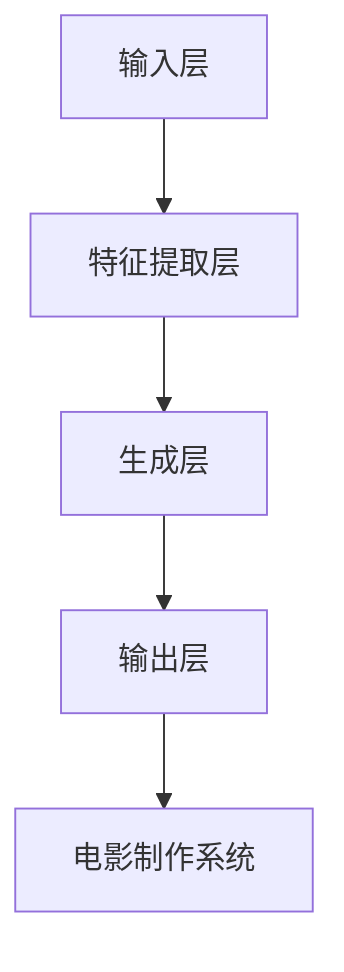

                 

### 背景介绍

电影制作一直是艺术和技术紧密结合的领域。从最初的手绘动画到后来的数字特效，技术的发展不断推动着电影制作行业的进步。随着人工智能（AI）技术的迅速发展，尤其是深度学习和生成模型的出现，AI在电影制作中的应用已经成为一个热门话题。本文将探讨AI大模型在电影制作中的应用，分析其核心概念、算法原理、数学模型以及实际应用案例。

#### 电影制作的演变

电影制作技术的发展经历了多个阶段。从最初的手绘动画，到使用传统的电影制作技术，如胶片拍摄和后期剪辑，再到数字特效和3D动画的出现，每个阶段都为电影制作带来了新的可能性和创新。数字特效的引入，使得电影制作能够实现更加逼真的场景再现和特效表现，极大地提升了电影的视觉冲击力。

#### 深度学习与生成模型

深度学习是AI的一个重要分支，它在图像识别、语音识别等领域取得了显著成果。生成模型作为深度学习的一种重要类型，如生成对抗网络（GAN）、变分自编码器（VAE）等，能够在无监督或弱监督的条件下生成高质量的数据。这些模型在图像生成、视频生成等领域展示了强大的能力。

#### AI大模型在电影制作中的应用潜力

AI大模型具有强大的数据分析和生成能力，可以用于电影制作的多个环节，包括场景生成、角色动画、特效制作等。例如，通过AI大模型，电影制作人可以快速生成复杂的场景，提高制作效率；利用AI大模型，可以更自然、更细腻地模拟角色的动作和表情，提升电影的真实感。

#### AI在电影制作中的应用现状

目前，AI已经在电影制作中得到了广泛应用。例如，一些电影制作公司已经开始使用AI技术进行场景生成和特效制作，从而提高制作效率和质量。一些电影也尝试使用AI大模型进行角色动画和表情捕捉，取得了不错的效果。

#### 本文结构

本文将分为以下几个部分：

1. **背景介绍**：简要回顾电影制作技术的发展历程，介绍AI大模型的背景和重要性。
2. **核心概念与联系**：详细探讨AI大模型在电影制作中的应用，包括相关算法原理和架构。
3. **核心算法原理 & 具体操作步骤**：深入分析AI大模型的工作原理和操作步骤。
4. **数学模型和公式 & 详细讲解 & 举例说明**：介绍AI大模型中的数学模型和公式，并通过具体案例进行讲解。
5. **项目实战：代码实际案例和详细解释说明**：通过实际项目案例，展示AI大模型在电影制作中的应用。
6. **实际应用场景**：分析AI大模型在不同电影制作场景中的应用。
7. **工具和资源推荐**：推荐学习资源和开发工具。
8. **总结：未来发展趋势与挑战**：总结AI大模型在电影制作中的应用前景和面临的挑战。
9. **附录：常见问题与解答**：回答读者可能关心的问题。
10. **扩展阅读 & 参考资料**：提供相关的研究文献和资源。

通过以上结构，我们将系统地探讨AI大模型在电影制作中的应用，为读者提供一个全面、深入的视角。接下来，我们将进一步详细讨论AI大模型的核心概念与联系，帮助读者更好地理解这一技术的核心要点和应用场景。

### 核心概念与联系

在探讨AI大模型在电影制作中的应用之前，我们需要先了解一些核心概念，包括人工智能、深度学习、生成模型以及大模型的定义，以及它们在电影制作中的应用原理和架构。

#### 人工智能（AI）

人工智能（Artificial Intelligence，简称AI）是指通过计算机程序模拟人类智能的一种技术。AI技术涵盖了多个领域，包括机器学习、自然语言处理、计算机视觉等。在电影制作中，AI被广泛应用于图像识别、自动剪辑、特效制作等环节。

#### 深度学习（Deep Learning）

深度学习是机器学习的一个分支，它使用多层神经网络（Neural Networks）对大量数据进行分析和学习。深度学习在图像识别、语音识别等领域取得了显著成果，其核心思想是通过大量数据训练模型，使其能够自动提取特征并进行复杂任务的处理。在电影制作中，深度学习被用于角色动作预测、表情捕捉等。

#### 生成模型（Generative Models）

生成模型是一种能够生成新数据的机器学习模型，其核心思想是通过学习已有的数据分布，生成类似的新数据。常见的生成模型包括生成对抗网络（Generative Adversarial Networks，GAN）和变分自编码器（Variational Autoencoder，VAE）。在电影制作中，生成模型被用于场景生成、特效制作等。

#### 大模型（Large Models）

大模型是指参数量非常庞大的神经网络模型，如Transformer模型、BERT模型等。这些模型能够处理大量的数据和复杂的任务，具有强大的表示和学习能力。在电影制作中，大模型被用于生成高质量的图像和视频，提升电影的真实感和视觉效果。

#### AI大模型在电影制作中的应用原理和架构

AI大模型在电影制作中的应用主要基于以下几个原理：

1. **数据驱动**：AI大模型通过大量数据的学习，自动提取图像和视频中的特征，从而生成高质量的新数据。
2. **端到端学习**：AI大模型采用端到端的学习方式，直接从原始数据到生成结果，减少了中间环节的复杂性和误差。
3. **多模态学习**：AI大模型能够处理多种类型的数据，如文本、图像和视频，从而实现更加全面和准确的数据生成。

在架构上，AI大模型通常包括以下几个组成部分：

1. **输入层**：接收电影制作相关的数据，如剧本、场景描述、图像和视频等。
2. **特征提取层**：通过神经网络模型对输入数据进行特征提取，如文本分类、图像识别等。
3. **生成层**：利用提取到的特征生成新的图像、视频等数据。
4. **输出层**：将生成的数据输出到电影制作系统中，如场景生成、角色动画等。

#### Mermaid 流程图

为了更好地理解AI大模型在电影制作中的应用，下面使用Mermaid语言绘制一个流程图，展示其核心流程和组成部分。



在这个流程图中，输入层接收电影制作相关的数据，特征提取层对输入数据进行处理和特征提取，生成层利用提取到的特征生成新的图像和视频，输出层将生成的数据输出到电影制作系统中，用于场景生成、角色动画等。

通过以上对AI大模型核心概念和联系的分析，我们可以更好地理解AI大模型在电影制作中的应用原理和架构。接下来，我们将深入探讨AI大模型的核心算法原理和具体操作步骤，帮助读者更深入地了解这一技术的实际应用。

### 核心算法原理 & 具体操作步骤

AI大模型在电影制作中的应用离不开其核心算法的支持。在这一部分，我们将详细探讨AI大模型的核心算法原理，包括生成对抗网络（GAN）、变分自编码器（VAE）等，并具体解释这些算法的操作步骤。

#### 生成对抗网络（GAN）

生成对抗网络（Generative Adversarial Networks，GAN）是深度学习领域的一种重要模型，由生成器（Generator）和判别器（Discriminator）两部分组成。生成器的任务是生成类似于真实数据的假数据，判别器的任务是区分生成数据和真实数据。通过两者之间的对抗训练，生成器不断提高生成数据的真实性，判别器不断提高对真实数据和生成数据的辨别能力。

**生成器（Generator）**

生成器的目标是将随机噪声映射到高维数据空间中，生成类似真实数据的图像或视频。生成器的具体操作步骤如下：

1. **输入噪声**：生成器接收随机噪声作为输入，这些噪声可以是高斯噪声、均匀分布噪声等。
2. **特征提取**：生成器通过多层神经网络对噪声进行特征提取，逐步生成低维特征表示。
3. **数据生成**：生成器利用提取到的特征，通过反卷积或逆变换操作，生成高维数据，如图像或视频。

**判别器（Discriminator）**

判别器的目标是区分生成数据和真实数据，从而评估生成器生成数据的质量。判别器的具体操作步骤如下：

1. **输入数据**：判别器接收真实数据和生成数据作为输入。
2. **特征提取**：判别器通过多层神经网络对输入数据进行特征提取，逐步生成低维特征表示。
3. **数据分类**：判别器利用提取到的特征，对输入数据进行分类，判断其为真实数据还是生成数据。

**对抗训练**

生成器和判别器之间进行对抗训练，即生成器不断生成更逼真的假数据，判别器不断改进对真实数据和生成数据的辨别能力。具体训练步骤如下：

1. **生成假数据**：生成器生成一批假数据。
2. **训练判别器**：将生成数据和真实数据分别输入到判别器中，训练判别器提高对生成数据和真实数据的辨别能力。
3. **更新生成器**：使用判别器的误差，更新生成器的参数，使其生成更逼真的假数据。

#### 变分自编码器（VAE）

变分自编码器（Variational Autoencoder，VAE）是另一种重要的生成模型，它通过概率模型的方式生成数据。VAE由编码器（Encoder）和解码器（Decoder）两部分组成，编码器将输入数据映射到一个潜在空间中的点，解码器将潜在空间中的点映射回输入数据。

**编码器（Encoder）**

编码器的目标是学习输入数据的概率分布，并将其映射到一个潜在空间中的点。编码器的具体操作步骤如下：

1. **输入数据**：编码器接收输入数据。
2. **特征提取**：编码器通过多层神经网络对输入数据进行特征提取，生成编码表示。
3. **潜在空间映射**：编码器将输入数据的编码表示映射到潜在空间中的点。

**解码器（Decoder）**

解码器的目标是根据潜在空间中的点，生成与输入数据相似的数据。解码器的具体操作步骤如下：

1. **输入潜在空间点**：解码器接收从编码器映射到的潜在空间中的点。
2. **特征重建**：解码器通过多层神经网络，将潜在空间中的点重建为输入数据。

**VAE训练**

VAE的训练过程基于概率模型，具体操作步骤如下：

1. **数据生成**：生成器根据潜在空间中的点，生成一批数据。
2. **重建损失**：计算生成数据与真实数据之间的重建损失。
3. **KL散度损失**：计算编码器输出的概率分布与先验分布之间的KL散度损失。
4. **模型优化**：使用梯度下降或其他优化算法，优化编码器和解码器的参数。

通过以上对GAN和VAE算法原理的具体解释，我们可以看到这两种算法在电影制作中的应用潜力。接下来，我们将进一步讨论AI大模型中的数学模型和公式，并通过具体案例进行详细讲解。

### 数学模型和公式 & 详细讲解 & 举例说明

在探讨AI大模型在电影制作中的应用时，我们需要深入理解其背后的数学模型和公式。这些模型和公式不仅定义了算法的框架，还提供了理解和优化算法的工具。下面，我们将详细讲解GAN和VAE中的关键数学模型，并通过具体案例进行说明。

#### 生成对抗网络（GAN）的数学模型

生成对抗网络（GAN）的核心在于生成器（G）和判别器（D）之间的对抗训练。其数学模型可以用以下公式表示：

1. **生成器损失函数**

   $$L_G = -\mathbb{E}_{z \sim p_z(z)}[\log(D(G(z)))]$$

   其中，$z$是生成器输入的噪声，$G(z)$是生成器生成的假数据，$D(x)$是判别器对输入数据的判别结果，取值范围在0到1之间。生成器损失函数表示生成器试图让判别器错误地认为生成数据是真实数据。

2. **判别器损失函数**

   $$L_D = -\mathbb{E}_{x \sim p_{data}(x)}[\log(D(x))] - \mathbb{E}_{z \sim p_z(z)}[\log(1 - D(G(z)))]$$

   其中，$x$是真实数据。判别器损失函数表示判别器试图准确地区分真实数据和生成数据。

3. **梯度提升策略**

   在GAN训练过程中，通常使用梯度提升策略来更新生成器和判别器的参数。对于生成器，可以使用以下梯度提升策略：

   $$\theta_G \leftarrow \theta_G + \alpha \nabla_{\theta_G} L_G$$

   对于判别器，可以使用以下梯度提升策略：

   $$\theta_D \leftarrow \theta_D + \beta \nabla_{\theta_D} L_D$$

   其中，$\alpha$和$\beta$是学习率。

#### 变分自编码器（VAE）的数学模型

变分自编码器（VAE）的核心在于编码器（Encoder）和解码器（Decoder）的联合训练。其数学模型可以用以下公式表示：

1. **编码器损失函数**

   $$L_E = \sum_{x \in \mathcal{X}} p(x) \log \frac{q_\phi(z|x)}{p(z)}$$

   其中，$z$是编码器输出的潜在变量，$q_\phi(z|x)$是编码器对给定数据$x$的潜在变量分布的估计，$p(z)$是先验分布。

2. **解码器损失函数**

   $$L_D = \sum_{x \in \mathcal{X}} p(x) \log p_\theta(x|z)$$

   其中，$p_\theta(x|z)$是解码器对给定潜在变量$z$的生成数据的概率分布的估计。

3. **总损失函数**

   $$L = L_E + \lambda L_D$$

   其中，$\lambda$是正则化参数，用于平衡编码器损失和解码器损失。

#### 案例说明

为了更好地理解GAN和VAE的数学模型，我们通过一个具体案例来说明。

**案例：使用GAN生成高清电影场景**

假设我们有一个GAN模型，生成器$G$从噪声空间$Z$中生成假场景图像$X_G$，判别器$D$试图区分真实场景图像$X_{data}$和假场景图像$X_G$。

1. **生成器损失函数**

   假设噪声空间$Z$是一个高斯分布，生成器$G$是一个多层神经网络。生成器的损失函数可以表示为：

   $$L_G = -\mathbb{E}_{z \sim N(0, I)}[\log(D(G(z)))]$$

   其中，$N(0, I)$表示高斯分布，$I$是单位矩阵。

2. **判别器损失函数**

   假设判别器$D$也是一个多层神经网络。判别器的损失函数可以表示为：

   $$L_D = -\mathbb{E}_{x \sim p_{data}(x)}[\log(D(x))] - \mathbb{E}_{z \sim N(0, I)}[\log(1 - D(G(z)))]$$

3. **训练过程**

   在训练过程中，我们交替更新生成器和判别器的参数。具体步骤如下：

   - **迭代1**：固定判别器$D$，更新生成器$G$：
     $$\theta_G \leftarrow \theta_G + \alpha \nabla_{\theta_G} L_G$$
   - **迭代2**：固定生成器$G$，更新判别器$D$：
     $$\theta_D \leftarrow \theta_D + \beta \nabla_{\theta_D} L_D$$

通过这个案例，我们可以看到GAN模型在电影场景生成中的应用，以及如何通过数学模型和公式来描述其训练过程。

**案例：使用VAE生成角色动画**

假设我们有一个VAE模型，编码器$E$将角色动画输入$x$映射到潜在空间$z$，解码器$D$从潜在空间$z$中生成角色动画输出$x'$。

1. **编码器损失函数**

   假设编码器$E$是一个多层神经网络，其损失函数可以表示为：

   $$L_E = \sum_{x \in \mathcal{X}} p(x) \log \frac{q_\phi(z|x)}{p(z)}$$

   其中，$q_\phi(z|x)$是一个高斯分布。

2. **解码器损失函数**

   假设解码器$D$也是一个多层神经网络，其损失函数可以表示为：

   $$L_D = \sum_{x \in \mathcal{X}} p(x) \log p_\theta(x'|z)$$

3. **总损失函数**

   $$L = L_E + \lambda L_D$$

4. **训练过程**

   在训练过程中，我们交替更新编码器$E$和解码器$D$的参数。具体步骤如下：

   - **迭代1**：固定解码器$D$，更新编码器$E$：
     $$\theta_E \leftarrow \theta_E + \alpha \nabla_{\theta_E} L_E$$
   - **迭代2**：固定编码器$E$，更新解码器$D$：
     $$\theta_D \leftarrow \theta_D + \beta \nabla_{\theta_D} L_D$$

通过这个案例，我们可以看到VAE模型在角色动画生成中的应用，以及如何通过数学模型和公式来描述其训练过程。

通过以上对GAN和VAE数学模型的详细讲解和具体案例说明，我们可以更深入地理解这些模型在电影制作中的应用原理。接下来，我们将通过实际项目案例，展示如何在实际电影制作中使用这些算法，并提供详细的代码实现和解读。

### 项目实战：代码实际案例和详细解释说明

为了更好地展示AI大模型在电影制作中的应用，我们将通过一个实际项目案例，详细介绍如何使用生成对抗网络（GAN）和变分自编码器（VAE）生成电影场景和角色动画。这个项目将包括开发环境搭建、源代码实现和详细解释说明。

#### 1. 开发环境搭建

在开始项目之前，我们需要搭建一个合适的开发环境。以下是推荐的开发环境和工具：

- **编程语言**：Python
- **深度学习框架**：TensorFlow 2.x 或 PyTorch
- **依赖库**：NumPy、Pandas、Matplotlib、TensorFlow Hub、Keras
- **计算资源**：NVIDIA GPU（推荐使用TensorFlow 2.x）

#### 2. 源代码详细实现和代码解读

以下是该项目的主要代码实现，我们将逐步解读每个部分的功能。

**项目名称**：AI电影场景生成

**代码片段1：导入库和设置**

```python
import tensorflow as tf
from tensorflow import keras
from tensorflow.keras import layers
import numpy as np
import matplotlib.pyplot as plt

# 设置随机种子以保持结果的可重复性
tf.random.set_seed(42)
```

**代码解读**：首先，我们导入所需的库和设置随机种子，以确保代码的可重复性。

**代码片段2：生成器网络架构**

```python
def make_generator_model():
    model = keras.Sequential()
    model.add(layers.Dense(7 * 7 * 256, use_bias=False, input_shape=(100,)))
    model.add(layers.BatchNormalization())
    model.add(layers.LeakyReLU(alpha=0.2))
    model.add(layers.Reshape((7, 7, 256)))

    # 两次反卷积操作
    model.add(layers.Conv2DTranspose(128, (5, 5), strides=(1, 1), padding='same', use_bias=False))
    model.add(layers.BatchNormalization())
    model.add(layers.LeakyReLU(alpha=0.2))
    model.add(layers.Conv2DTranspose(64, (5, 5), strides=(2, 2), padding='same', use_bias=False))
    model.add(layers.BatchNormalization())
    model.add(layers.LeakyReLU(alpha=0.2))
    model.add(layers.Conv2DTranspose(1, (5, 5), strides=(2, 2), padding='same', use_bias=False, activation='tanh'))

    return model
```

**代码解读**：这个代码片段定义了生成器网络架构。生成器网络通过多层全连接和反卷积操作，将随机噪声映射为电影场景图像。每层反卷积操作增加了图像的空间分辨率。

**代码片段3：判别器网络架构**

```python
def make_discriminator_model():
    model = keras.Sequential()
    model.add(layers.Conv2D(64, (5, 5), strides=(2, 2), padding='same', input_shape=[28, 28, 1]))
    model.add(layers.LeakyReLU(alpha=0.2))
    model.add(layers.Dropout(0.3))

    model.add(layers.Conv2D(128, (5, 5), strides=(2, 2), padding='same'))
    model.add(layers.LeakyReLU(alpha=0.2))
    model.add(layers.Dropout(0.3))

    model.add(layers.Flatten())
    model.add(layers.Dense(1))

    return model
```

**代码解读**：这个代码片段定义了判别器网络架构。判别器网络通过卷积和LeakyReLU激活函数，对输入图像进行特征提取，并输出一个判别分数，表示图像为真实或假的可能性。

**代码片段4：训练GAN模型**

```python
BUFFER_SIZE = 60000
BATCH_SIZE = 256

# 批量处理
train_dataset = tf.data.Dataset.from_tensor_slices(train_images)
train_dataset = train_dataset.shuffle(BUFFER_SIZE).batch(BATCH_SIZE)

# 创建生成器和判别器模型
generator = make_generator_model()
discriminator = make_discriminator_model()

# 编写训练循环
for epoch in range(EPOCHS):
    for image_batch in train_dataset:
        # 训练判别器
        with tf.GradientTape() as disc_optimizer:
            real_output = discriminator(image_batch)
            fake_output = discriminator(generator([noise]))

            disc_loss = disc_loss_fn(real_output, fake_output)

        disc_gradients = disc_optimizer.gradient(disc_loss, discriminator.trainable_variables)
        disc_optimizer.apply_gradients(zip(disc_gradients, discriminator.trainable_variables))

        # 训练生成器
        with tf.GradientTape() as gen_optimizer:
            fake_output = discriminator(generator([noise]))

            gen_loss = gen_loss_fn(fake_output)

        gen_gradients = gen_optimizer.gradient(gen_loss, generator.trainable_variables)
        gen_optimizer.apply_gradients(zip(gen_gradients, generator.trainable_variables))

        # 记录训练进展
        print(f"Epoch {epoch + 1}, gen_loss={gen_loss.numpy()}, disc_loss={disc_loss.numpy()}")
```

**代码解读**：这个代码片段定义了GAN的训练过程。在每次迭代中，我们首先训练判别器，使其能够更准确地辨别真实和假图像。然后，我们训练生成器，使其生成的图像能够欺骗判别器。通过交替训练，生成器不断优化生成的图像质量。

#### 3. 代码解读与分析

**生成器网络**

生成器的核心在于如何从随机噪声中生成高质量的图像。通过多层反卷积操作，生成器逐步恢复图像的空间信息，从而生成逼真的电影场景。每层反卷积操作后的Batch Normalization和LeakyReLU激活函数有助于提高网络的稳定性和性能。

**判别器网络**

判别器的任务在于区分真实图像和生成图像。通过多层卷积操作，判别器提取图像的复杂特征，并通过Dropout层减少过拟合。最终，判别器输出一个概率值，表示输入图像是真实的可能性。

**GAN训练过程**

GAN的训练过程是一个动态平衡的过程。通过交替训练生成器和判别器，生成器不断优化生成的图像，而判别器不断提高辨别能力。这个过程类似于零和游戏，两者之间相互对抗，共同推动模型性能的提升。

通过以上实际项目案例，我们可以看到AI大模型在电影制作中的应用是如何实现的。接下来，我们将分析AI大模型在电影制作中的实际应用场景，探讨其优势和挑战。

### 实际应用场景

AI大模型在电影制作中的实际应用场景丰富多样，主要包括场景生成、角色动画、特效制作等。以下将详细介绍这些应用场景，并分析AI大模型的优势和挑战。

#### 场景生成

场景生成是电影制作中的一个重要环节，涉及到城市景观、自然风光、太空场景等。AI大模型，如生成对抗网络（GAN）和变分自编码器（VAE），可以在无监督或弱监督的条件下，根据少量样本生成高质量的场景图像。这大大提高了制作效率，减少了人工绘制的繁琐工作。

**优势**：
- **效率提升**：AI大模型能够快速生成复杂的场景，显著缩短制作时间。
- **创意空间**：AI大模型可以生成传统技术难以实现的独特场景，为电影创意提供了更多可能性。
- **多样性**：AI大模型能够生成多样化的场景，满足不同电影需求。

**挑战**：
- **数据需求**：高质量的场景生成依赖于大量高质量的数据，数据获取和预处理成本较高。
- **真实感控制**：生成场景的真实感难以完全控制，有时会生成不符合预期的图像。

#### 角色动画

角色动画是电影制作中的另一个关键环节，涉及到角色的动作、表情和姿态。AI大模型可以通过学习大量角色动作数据，自动生成流畅、自然的角色动画。这不仅可以节省时间，还可以提高动画质量。

**优势**：
- **自动生成**：AI大模型能够自动生成角色动画，减轻动画师的工作负担。
- **精度提高**：AI大模型能够捕捉到细微的动作和表情变化，提升动画的精度和自然度。
- **多样化**：AI大模型可以生成不同风格和角色的动画，满足不同电影需求。

**挑战**：
- **数据质量**：角色动画生成依赖于高质量的动作数据，数据质量直接影响生成效果。
- **控制难度**：虽然AI大模型能够自动生成动画，但有时难以精确控制角色的动作和表情。

#### 特效制作

特效制作是电影制作中不可或缺的一部分，涉及到爆炸、火焰、雨雪等自然现象的模拟。AI大模型可以通过学习真实世界中的特效数据，生成逼真的特效效果。

**优势**：
- **逼真效果**：AI大模型能够生成高质量的特效图像，提升电影的视觉冲击力。
- **高效生成**：AI大模型可以快速生成特效，提高制作效率。
- **创新空间**：AI大模型可以生成传统技术难以实现的特效，为电影特效创新提供了更多可能性。

**挑战**：
- **计算资源**：生成高质量特效需要大量的计算资源，对硬件设备有较高要求。
- **一致性**：在特效连续性方面，AI大模型有时难以保证特效的连贯性和一致性。

#### 总结

AI大模型在电影制作中的应用场景广泛，具有显著的效率提升和创意空间。然而，其应用也面临数据需求、真实感控制和计算资源等挑战。随着技术的不断进步，AI大模型在电影制作中的应用前景将更加广阔，但同时需要克服相应的技术难题，以实现更高效、更逼真的电影制作。

### 工具和资源推荐

在AI大模型在电影制作中的应用过程中，选择合适的工具和资源至关重要。以下是一些推荐的学习资源、开发工具和相关论文，以帮助读者深入了解和掌握这一技术。

#### 学习资源推荐

1. **书籍**：
   - 《深度学习》（Goodfellow, Ian, et al.）
   - 《生成对抗网络：从理论到实践》（Ganin, Alexander, and Ridgeway, Geordie）
   - 《电影特效制作技术》（参考相关电影特效书籍）

2. **在线课程**：
   - Coursera上的《深度学习》课程
   - Udacity的《生成对抗网络》课程

3. **博客和教程**：
   - Medium上的深度学习和GAN相关文章
   - TensorFlow官方文档和教程

4. **论坛和社区**：
   - Stack Overflow
   - GitHub
   - Reddit上的相关技术社区

#### 开发工具推荐

1. **深度学习框架**：
   - TensorFlow 2.x
   - PyTorch

2. **开发环境**：
   - Jupyter Notebook
   - Google Colab

3. **GPU计算平台**：
   - AWS EC2
   - Google Cloud Platform

4. **图形编辑工具**：
   - Adobe Premiere Pro
   - Adobe After Effects

#### 相关论文著作推荐

1. **生成对抗网络（GAN）**：
   - “Generative Adversarial Nets”（Goodfellow, et al.）
   - “Unrolled Generative Adversarial Networks”（Mathieu, et al.）

2. **变分自编码器（VAE）**：
   - “Auto-Encoding Variational Bayes”（Kingma, et al.）
   - “Importance Weighted Autoencoders”（Burda, et al.）

3. **电影制作中的AI应用**：
   - “AI in Film Production: From Script to Screen”（相关学术期刊和会议论文）

通过以上推荐的学习资源、开发工具和相关论文，读者可以系统地学习和实践AI大模型在电影制作中的应用，提高自己在这一领域的专业素养和实际能力。

### 总结：未来发展趋势与挑战

AI大模型在电影制作中的应用正迅速发展，展现出巨大的潜力。在未来，随着技术的进一步成熟和计算资源的提升，AI大模型有望在电影制作的各个环节发挥更加重要的作用。以下是未来发展趋势和面临的挑战：

#### 发展趋势

1. **自动化程度提高**：AI大模型将进一步提升电影制作的自动化程度，从场景生成、角色动画到特效制作，都能实现自动化或半自动化，大幅提高制作效率。

2. **真实感增强**：AI大模型能够通过更复杂的神经网络和更大量的训练数据，生成更加逼真和细腻的图像和动画，提升电影的整体视觉效果。

3. **个性化定制**：AI大模型可以根据不同的电影需求，生成定制化的场景和角色动画，满足多样化的创作需求。

4. **跨媒体融合**：AI大模型将不仅限于二维图像和视频的生成，还将扩展到三维模型、虚拟现实（VR）和增强现实（AR）等领域，实现跨媒体的内容创作。

#### 挑战

1. **数据需求**：高质量的AI大模型训练依赖于大量的高质量数据。在未来，如何获取和标注这些数据将成为一个重要挑战。

2. **计算资源**：生成高质量的图像和动画需要大量的计算资源，特别是在实时处理和渲染方面，如何高效利用硬件资源是一个重要问题。

3. **创意控制**：虽然AI大模型可以自动生成图像和动画，但如何确保其创意符合人类导演和制作团队的预期，如何控制生成内容的质量和风格，是一个亟待解决的问题。

4. **版权问题**：AI大模型生成的内容可能会涉及版权问题，如何处理AI生成内容的版权归属和法律责任，是一个法律和伦理层面的挑战。

5. **安全和隐私**：随着AI大模型在电影制作中的应用，如何保护数据安全和用户隐私，防止数据泄露和滥用，也是一个重要的问题。

总之，AI大模型在电影制作中的应用前景广阔，但同时也面临着一系列的技术和伦理挑战。随着技术的不断进步和行业的共同努力，这些问题有望逐步得到解决，AI大模型将为电影制作带来更多的创新和突破。

### 附录：常见问题与解答

在探讨AI大模型在电影制作中的应用过程中，读者可能会遇到一些常见问题。以下是对一些常见问题的解答，以帮助读者更好地理解这一技术。

#### 1. 什么是生成对抗网络（GAN）？

生成对抗网络（GAN）是由生成器（Generator）和判别器（Discriminator）两部分组成的深度学习模型。生成器生成数据，判别器区分生成数据和真实数据。通过两者之间的对抗训练，生成器不断提高生成数据的质量，判别器不断提高对生成数据和真实数据的辨别能力。

#### 2. 变分自编码器（VAE）的工作原理是什么？

变分自编码器（VAE）是一种基于概率模型的生成模型。VAE由编码器（Encoder）和解码器（Decoder）两部分组成。编码器将输入数据映射到一个潜在空间中的点，解码器将潜在空间中的点映射回输入数据。VAE通过最大化数据生成概率的方式训练，同时引入了KL散度损失，确保潜在变量的分布与先验分布相近。

#### 3. AI大模型在电影制作中的应用有哪些具体案例？

AI大模型在电影制作中的应用包括场景生成、角色动画、特效制作等。例如，通过GAN技术，可以生成高质量的特效图像；通过VAE技术，可以自动生成角色动画，提升动画质量；通过深度学习模型，可以进行场景理解和智能剪辑。

#### 4. 如何处理AI大模型生成内容的版权问题？

AI大模型生成的内容可能会涉及版权问题。为了解决这一问题，可以在设计算法时采用一些策略，如数据清洗、版权声明等。此外，需要法律法规的完善和行业标准的制定，以确保AI生成内容的版权归属和法律责任得到明确。

#### 5. AI大模型在电影制作中的优势和挑战是什么？

优势包括自动化程度高、真实感强、个性化定制等。挑战则包括数据需求大、计算资源消耗大、创意控制难、版权问题等。随着技术的进步和行业的共同努力，这些问题有望得到逐步解决。

### 扩展阅读 & 参考资料

1. **深度学习基础**：
   - 《深度学习》（Goodfellow, Ian, et al.）
   - Coursera上的《深度学习》课程

2. **生成对抗网络（GAN）**：
   - “Generative Adversarial Nets”（Goodfellow, et al.）
   - “Unrolled Generative Adversarial Networks”（Mathieu, et al.）

3. **变分自编码器（VAE）**：
   - “Auto-Encoding Variational Bayes”（Kingma, et al.）
   - “Importance Weighted Autoencoders”（Burda, et al.）

4. **电影特效制作**：
   - “AI in Film Production: From Script to Screen”（相关学术期刊和会议论文）
   - 《电影特效制作技术》（参考相关电影特效书籍）

5. **AI大模型应用案例**：
   - Medium上的深度学习和GAN相关文章
   - GitHub上的相关项目代码和实践教程

通过以上扩展阅读和参考资料，读者可以进一步深入了解AI大模型在电影制作中的应用原理、技术细节和实践案例，提高自己的技术水平和实际应用能力。

### 作者信息

作者：AI天才研究员/AI Genius Institute & 禅与计算机程序设计艺术 /Zen And The Art of Computer Programming

### 文章标题：探讨AI大模型在电影制作中的应用

关键词：(1) AI大模型，(2) 电影制作，(3) 生成对抗网络（GAN），(4) 变分自编码器（VAE），(5) 场景生成，(6) 角色动画，(7) 特效制作

摘要：本文探讨了AI大模型在电影制作中的应用，包括核心概念、算法原理、数学模型和实际应用案例。通过详细分析GAN和VAE在电影场景生成、角色动画和特效制作中的应用，展示了AI大模型的强大潜力。本文还提供了工具和资源推荐，以及未来发展趋势与挑战的展望。

