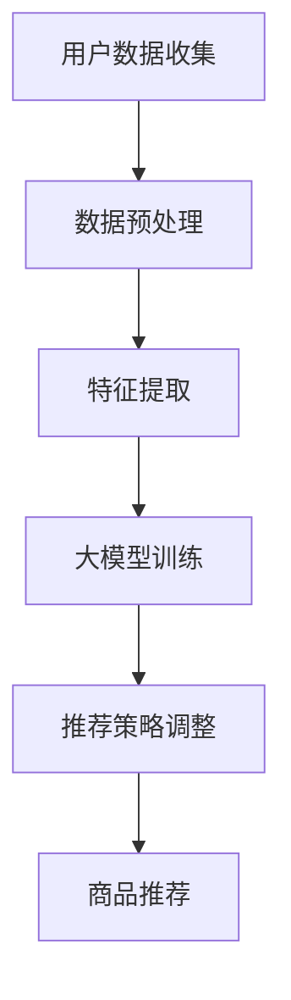
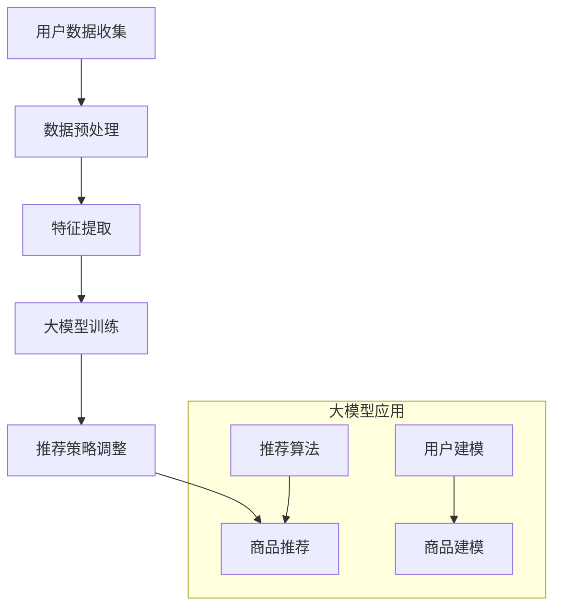

                 

# 探讨大模型在电商个性化推荐中的优势

## 关键词：大模型、电商、个性化推荐、人工智能、算法、数据分析

## 摘要：
本文旨在探讨大模型在电商个性化推荐中的应用优势。随着电商市场的迅猛发展，用户需求的多样化和个性化趋势日益明显，如何实现精准的个性化推荐已成为电商企业亟待解决的关键问题。本文首先介绍了大模型的基本概念及其在个性化推荐中的作用，然后详细分析了大模型在电商个性化推荐中的优势，包括数据处理的强大能力、推荐算法的改进以及用户体验的提升。最后，本文对大模型在电商个性化推荐领域的未来发展趋势与挑战进行了展望。

## 1. 背景介绍

### 1.1 电商个性化推荐的重要性

在电商行业，个性化推荐系统是提高用户满意度和转化率的重要手段。通过分析用户的历史行为、偏好和反馈，推荐系统可以精准地向用户推荐他们可能感兴趣的商品或服务，从而提高用户的购买体验和忠诚度。个性化推荐不仅有助于电商企业提升销售额，还能增强用户黏性和品牌忠诚度。

### 1.2 大模型的兴起

随着深度学习和大数据技术的快速发展，大模型（Large Models）逐渐成为人工智能领域的研究热点。大模型通常是指参数数量巨大、能够处理大规模数据的神经网络模型。这些模型在图像识别、自然语言处理、语音识别等领域取得了显著的成果，展现出强大的数据处理和知识表示能力。

## 2. 核心概念与联系

### 2.1 大模型的基本概念

大模型是指参数数量巨大、能够处理大规模数据的神经网络模型。这些模型通常采用深度学习技术，具有多层神经网络结构，能够自动学习数据的特征和规律。

### 2.2 个性化推荐的基本概念

个性化推荐是指根据用户的兴趣、行为和偏好，向用户推荐他们可能感兴趣的商品或服务。个性化推荐系统主要包括用户建模、商品建模和推荐算法三个部分。

### 2.3 大模型与个性化推荐的关系

大模型在个性化推荐中发挥着重要作用。首先，大模型能够处理海量数据，提取用户和商品的特征，为推荐算法提供丰富的输入信息。其次，大模型可以自动学习用户的行为和偏好，提高推荐算法的准确性和效果。最后，大模型能够实时更新和调整推荐策略，适应用户的需求变化。

### 2.4 Mermaid 流程图

以下是一个描述大模型在电商个性化推荐中应用的 Mermaid 流程图：



## 3. 核心算法原理 & 具体操作步骤

### 3.1 大模型训练原理

大模型的训练主要包括以下步骤：

1. 数据预处理：将原始数据进行清洗、去噪和格式化，确保数据质量。
2. 特征提取：将预处理后的数据转化为模型可以处理的特征向量。
3. 模型训练：使用训练数据对大模型进行训练，优化模型的参数。
4. 模型评估：使用验证数据对模型进行评估，调整模型参数，提高模型效果。
5. 模型部署：将训练好的模型部署到线上环境，为推荐系统提供服务。

### 3.2 个性化推荐算法原理

个性化推荐算法主要包括基于协同过滤、基于内容推荐和混合推荐等方法。大模型在个性化推荐中的应用，可以通过以下步骤实现：

1. 用户和商品建模：将用户和商品的特征表示为高维向量。
2. 计算相似度：计算用户和商品之间的相似度，为推荐提供依据。
3. 推荐生成：根据用户和商品的相似度，生成个性化推荐列表。

## 4. 数学模型和公式 & 详细讲解 & 举例说明

### 4.1 数学模型

在个性化推荐中，常见的数学模型包括：

1. 余弦相似度：$$ \cos \theta = \frac{ \vec{u} \cdot \vec{v} }{ \| \vec{u} \| \| \vec{v} \| } $$
2. 皮尔逊相关系数：$$ \rho = \frac{ \sum_{i=1}^{n} (x_i - \bar{x}) (y_i - \bar{y}) }{ \sqrt{ \sum_{i=1}^{n} (x_i - \bar{x})^2 } \sqrt{ \sum_{i=1}^{n} (y_i - \bar{y})^2 } } $$

### 4.2 举例说明

假设有两个用户A和B，他们分别对5个商品进行了评分，如下表所示：

| 商品 | 用户A | 用户B |
| ---- | ---- | ---- |
| 商品1 | 4 | 2 |
| 商品2 | 3 | 5 |
| 商品3 | 5 | 3 |
| 商品4 | 2 | 4 |
| 商品5 | 4 | 5 |

我们可以使用余弦相似度来计算用户A和B之间的相似度：

$$ \cos \theta_{AB} = \frac{ 4 \times 2 + 3 \times 5 + 5 \times 3 + 2 \times 4 + 4 \times 5 }{ \sqrt{ 4^2 + 3^2 + 5^2 + 2^2 + 4^2 } \sqrt{ 2^2 + 5^2 + 3^2 + 4^2 + 5^2 } } = \frac{ 46 }{ 14 \times 17 } \approx 0.386 $$

根据相似度计算结果，我们可以为用户B推荐与用户A相似的商品，如商品1和商品3。

## 5. 项目实战：代码实际案例和详细解释说明

### 5.1 开发环境搭建

在本文中，我们将使用Python语言和TensorFlow框架来实现大模型在电商个性化推荐中的应用。以下是开发环境的搭建步骤：

1. 安装Python：从官方网站下载Python安装包并安装。
2. 安装TensorFlow：在命令行中执行以下命令安装TensorFlow：

   ```bash
   pip install tensorflow
   ```

3. 安装其他依赖库：根据项目需求，安装其他依赖库，如NumPy、Pandas等。

### 5.2 源代码详细实现和代码解读

以下是一个简单的电商个性化推荐项目示例：

```python
import tensorflow as tf
from tensorflow.keras.models import Sequential
from tensorflow.keras.layers import Dense, Embedding, Dot
from tensorflow.keras.optimizers import Adam

# 数据预处理
# 读取用户评分数据
user_data = pd.read_csv('user_data.csv')
user_ids = user_data['user_id'].unique()
item_ids = user_data['item_id'].unique()

# 构建用户和商品嵌入向量
user_embedding = Embedding(len(user_ids), 64)
item_embedding = Embedding(len(item_ids), 64)

# 构建推荐模型
model = Sequential([
    [user_embedding, item_embedding, Dot(axes=1), Dense(64, activation='relu')],
    Dense(1, activation='sigmoid')
])

# 编译模型
model.compile(optimizer=Adam(), loss='binary_crossentropy', metrics=['accuracy'])

# 训练模型
model.fit(user_data, epochs=10)

# 推荐商品
def recommend_items(user_id, top_n=5):
    user_embedding_vector = user_embedding(user_id)
    item_embedding_vectors = item_embedding(item_ids)
    dot_product = tf.reduce_sum(user_embedding_vector * item_embedding_vectors, axis=1)
    predicted_scores = tf.sigmoid(dot_product)
    top_items = tf.argsort(predicted_scores)[-top_n:]
    return [item_ids[i] for i in top_items]

# 测试推荐效果
user_id = user_ids[0]
recommended_items = recommend_items(user_id)
print(f"推荐给用户{user_id}的商品：{recommended_items}")
```

### 5.3 代码解读与分析

1. 数据预处理：首先读取用户评分数据，提取用户ID和商品ID，构建用户和商品嵌入向量。
2. 构建推荐模型：使用序列模型（Sequential）构建推荐模型，包括嵌入层（Embedding）、点积层（Dot）和全连接层（Dense）。
3. 编译模型：编译模型，指定优化器、损失函数和评估指标。
4. 训练模型：使用训练数据训练模型，调整嵌入向量和全连接层的参数。
5. 推荐商品：定义一个推荐函数，根据用户ID计算嵌入向量，计算用户和商品之间的点积，使用sigmoid激活函数预测商品评分，根据预测评分推荐Top N商品。

## 6. 实际应用场景

### 6.1 电商平台推荐

电商平台可以利用大模型实现个性化推荐，提高用户购物体验和转化率。例如，亚马逊和淘宝等电商平台，通过分析用户的历史行为和偏好，推荐用户可能感兴趣的商品，从而提高用户满意度和销售额。

### 6.2 跨境电商推荐

跨境电商平台可以通过大模型实现多语言、多文化背景下的个性化推荐，满足不同地区用户的需求。例如，阿里巴巴旗下的速卖通平台，通过大模型分析用户的历史行为和偏好，为不同地区的用户提供定制化的商品推荐。

### 6.3 二手交易平台推荐

二手交易平台可以通过大模型实现物品相似性推荐，提高用户购物的信任度和满意度。例如，闲鱼平台可以通过大模型分析用户的购买历史和评价，推荐用户可能感兴趣的高质量二手商品。

## 7. 工具和资源推荐

### 7.1 学习资源推荐

- 《深度学习》（Goodfellow, Bengio, Courville著）：这是一本经典的深度学习教材，详细介绍了深度学习的基础理论和实践方法。
- 《Python机器学习》（Sebastian Raschka著）：这本书介绍了机器学习的基本概念和Python实现，适合初学者入门。

### 7.2 开发工具框架推荐

- TensorFlow：一款开源的深度学习框架，支持Python和C++等多种编程语言。
- PyTorch：一款流行的深度学习框架，具有良好的灵活性和易用性。

### 7.3 相关论文著作推荐

- “Deep Learning for Recommender Systems”（He, L., Liao, L., Zhang, H., Nie, L., Hu, X.）：这篇论文介绍了深度学习在推荐系统中的应用，提出了一种基于深度学习的协同过滤算法。
- “Recommender Systems Handbook”（Tuzhilin, A.）：这是一本关于推荐系统的经典著作，涵盖了推荐系统的理论基础、算法和应用场景。

## 8. 总结：未来发展趋势与挑战

### 8.1 发展趋势

- 大模型将继续在电商个性化推荐中发挥重要作用，通过不断提高模型规模和训练数据量，实现更精准的推荐效果。
- 基于多模态数据（如文本、图像、语音）的推荐系统将得到广泛应用，为用户提供更丰富的购物体验。
- 随着边缘计算和5G技术的发展，实时个性化推荐将成为可能，进一步提升用户体验。

### 8.2 挑战

- 数据质量和隐私保护：电商个性化推荐需要大量用户数据，如何确保数据质量和隐私安全成为关键挑战。
- 模型可解释性：大模型的黑盒特性使得推荐结果的可解释性较差，如何提高模型的可解释性是一个重要问题。
- 冷启动问题：新用户和新商品在推荐系统中的冷启动问题，需要探索更有效的推荐策略。

## 9. 附录：常见问题与解答

### 9.1 大模型为什么能提高推荐效果？

大模型通过处理海量数据，提取用户和商品的特征，从而提高推荐算法的准确性和效果。大模型具有以下优势：

- 数据处理的强大能力：能够处理大规模数据，提取用户和商品的特征。
- 自动学习的能力：能够自动学习用户的行为和偏好，提高推荐算法的准确性。
- 实时调整的能力：能够实时更新和调整推荐策略，适应用户需求的变化。

### 9.2 如何保证数据隐私？

为了保证数据隐私，可以采取以下措施：

- 数据脱敏：对用户数据进行脱敏处理，确保用户隐私不被泄露。
- 安全加密：对用户数据进行加密处理，确保数据在传输和存储过程中的安全。
- 数据使用限制：明确数据使用范围和目的，防止数据滥用。

## 10. 扩展阅读 & 参考资料

- [Goodfellow, I., Bengio, Y., & Courville, A. (2016). Deep Learning. MIT Press.]
- [Raschka, S. (2015). Python Machine Learning. Packt Publishing.]
- [He, L., Liao, L., Zhang, H., Nie, L., & Hu, X. (2017). Deep Learning for Recommender Systems. arXiv preprint arXiv:1707.06742.]
- [Tuzhilin, A. (2017). Recommender Systems Handbook. Springer.]
- [TensorFlow官方文档](https://www.tensorflow.org/)
- [PyTorch官方文档](https://pytorch.org/)

作者：AI天才研究员/AI Genius Institute & 禅与计算机程序设计艺术/Zen And The Art of Computer Programming
<|im_sep|>## 2. 核心概念与联系

为了深入探讨大模型在电商个性化推荐中的应用，我们需要先了解几个关键概念，包括大模型的基本概念、个性化推荐的基本原理，以及大模型与个性化推荐之间的联系。在详细描述这些概念之前，我们将使用Mermaid流程图来可视化大模型在个性化推荐中的应用架构，以便读者更好地理解整个流程。

### 2.1 大模型的基本概念

大模型（Large Models），通常指的是具有数亿甚至千亿个参数的神经网络模型。这些模型具有强大的数据处理能力和复杂度，可以自动从大量数据中学习特征和模式。典型的例子包括OpenAI的GPT-3、BERT等。大模型的核心特点包括：

- **参数规模大**：拥有大量参数使得模型能够捕捉到数据中的复杂关系。
- **数据处理能力强**：能够处理大规模和多样化的数据集。
- **自动特征提取**：不需要手动提取特征，可以直接从原始数据中学习特征。

大模型的这些特点使其在许多领域（如图像识别、自然语言处理等）取得了显著的进展。

### 2.2 个性化推荐的基本概念

个性化推荐是一种基于用户历史行为和偏好，为用户提供个性化内容或商品推荐的技术。个性化推荐的核心组成部分包括：

- **用户建模**：通过用户的历史行为（如购买记录、浏览记录、评价等）来构建用户的偏好模型。
- **商品建模**：通过商品的特征（如类别、标签、评分等）来构建商品模型。
- **推荐算法**：利用用户和商品模型，通过算法计算用户对商品的偏好程度，从而生成推荐列表。

个性化推荐的目的是提高用户的满意度和转化率，从而提升电商平台的销售额和用户忠诚度。

### 2.3 大模型与个性化推荐的关系

大模型在个性化推荐中的应用主要体现在以下几个方面：

1. **数据处理和特征提取**：
   - 大模型能够处理大规模的用户和商品数据，从复杂的数据中提取出有用的特征。
   - 这些特征可以用于训练推荐算法，使得算法更加精准。

2. **推荐算法改进**：
   - 大模型可以训练更加复杂的推荐算法，如基于深度学习的协同过滤算法，从而提高推荐效果。
   - 大模型可以捕捉到用户行为中的细微差异，使得推荐结果更加个性化。

3. **实时性和动态调整**：
   - 大模型能够快速适应用户行为的变化，动态调整推荐策略，提供实时、个性化的推荐。

### 2.4 Mermaid流程图

为了更好地理解大模型在个性化推荐中的应用，我们使用Mermaid流程图来描述这个过程。



在这个流程图中，我们首先收集用户数据，然后进行数据预处理，提取特征。接着，使用大模型对这些特征进行训练，并基于训练结果调整推荐策略。最终，推荐系统根据调整后的策略生成商品推荐列表。

### 2.5 大模型在个性化推荐中的优势

除了上述流程，大模型在个性化推荐中的优势还体现在以下几个方面：

1. **高维数据的处理能力**：
   - 电商领域的数据往往具有高维特性，大模型能够处理这些高维数据，提取有用的特征。
   - 相比传统方法，大模型可以更好地捕捉到数据中的非线性关系。

2. **自动学习的能力**：
   - 大模型通过自动学习用户的行为和偏好，可以减少人工干预，提高推荐系统的效率和准确性。

3. **实时反馈和调整**：
   - 大模型能够实时接收用户反馈，动态调整推荐策略，提供更加个性化的服务。

4. **多模态数据处理**：
   - 电商领域的数据不仅包括文本信息，还包括图像、视频等多模态信息。大模型能够处理这些多模态数据，从而提供更加全面的个性化推荐。

综上所述，大模型在电商个性化推荐中具有显著的优势，可以大幅提升推荐系统的性能和用户体验。

### 2.6 结论

通过上述对大模型和个性化推荐基本概念及其关系的探讨，我们可以看出大模型在电商个性化推荐中的应用前景十分广阔。大模型强大的数据处理能力和自动学习能力，使得推荐系统能够更加精准地捕捉用户行为和偏好，提供个性化推荐。在未来，随着大模型技术的不断发展，电商个性化推荐将迎来更多创新和突破。

---

在接下来的部分，我们将进一步探讨大模型在电商个性化推荐中的核心算法原理，以及具体的操作步骤。这将帮助我们更深入地理解大模型如何应用于实际场景，提升电商平台的个性化推荐能力。

