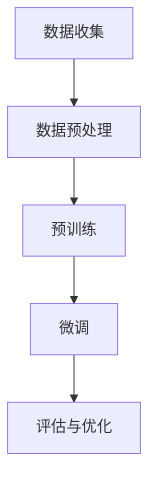
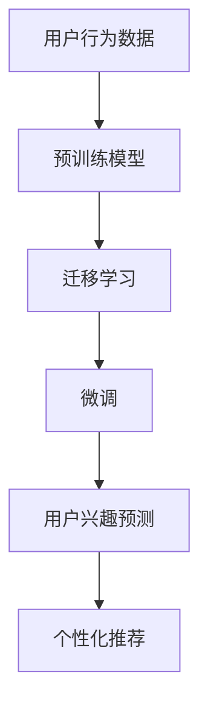

                 

### 背景介绍

在当今数字化时代，电商平台已经成为消费者购物的主要渠道之一。随着电商平台的不断发展和用户数量的激增，如何准确预测用户兴趣，进而提供个性化的购物体验，已成为电商企业关注的焦点。传统的方法往往依赖于用户的历史行为数据，但这些方法存在一定的局限性，例如数据滞后性和用户行为模式的变化。因此，探索更高效、准确的方法来预测用户兴趣，对于电商平台来说至关重要。

在此背景下，大规模预训练模型（Large-scale Pre-trained Models），尤其是近年来迅速发展的生成式预训练模型（Generative Pre-trained Models），如GPT（Generative Pre-trained Transformer）和BERT（Bidirectional Encoder Representations from Transformers），展示出了在文本数据处理和模式识别方面的巨大潜力。这些模型通过在大量互联网文本上预训练，能够捕捉到文本中的复杂模式和语义关系，从而为用户兴趣预测提供了一种全新的思路。

用户兴趣预测的目标是识别用户在特定时间点对哪些商品或服务表现出更高的兴趣。这不仅可以帮助电商平台优化产品推荐，提高用户满意度，还能提高销售额和用户留存率。传统的机器学习模型，如决策树、支持向量机和朴素贝叶斯等，在用户兴趣预测中已经取得了一定的成效。然而，随着数据量和复杂度的增加，这些模型的性能逐渐受到影响。

大规模预训练模型的出现，为我们提供了一种新的解决方案。通过利用预训练模型强大的特征提取和模式识别能力，我们可以更好地理解用户的兴趣点，实现更精准的预测。此外，大规模预训练模型还可以通过迁移学习（Transfer Learning）技术，将预训练得到的通用特征用于特定任务，从而提高模型的适应性和泛化能力。

本文将探讨大规模预训练模型在电商平台用户兴趣短期预测中的潜力，首先介绍大规模预训练模型的基本原理和架构，然后分析其在用户兴趣预测中的优势和应用，最后通过实际案例展示其效果，并提出未来可能面临的挑战和解决方案。

关键词：大规模预训练模型、用户兴趣预测、电商平台、生成式预训练、迁移学习、个性化推荐

> **摘要**：
本文首先概述了电商平台用户兴趣预测的重要性和背景。接着，深入探讨了大规模预训练模型的基本原理和架构，特别关注其在文本数据处理和模式识别方面的优势。随后，通过分析大规模预训练模型在用户兴趣预测中的具体应用，展示了其在准确性和效率方面的潜力。文章通过实际案例展示了预训练模型在实际应用中的效果，并讨论了未来可能面临的挑战和解决策略。本文旨在为电商平台提供一种高效、精准的用户兴趣预测方法，推动个性化推荐系统的进一步发展。

-------------------------

## 1. 大规模预训练模型的基本原理和架构

大规模预训练模型（Large-scale Pre-trained Models）是近年来人工智能领域的一个重要突破。这些模型通过在大规模数据集上预训练，可以自动学习到丰富的语言特征，从而在多种自然语言处理任务中表现出色。大规模预训练模型的核心思想是利用海量数据中的信息和知识，建立一个通用的语言理解模型，然后再通过微调（Fine-tuning）将其应用于具体任务中。

### 1.1 预训练模型的基本概念

预训练模型的基本概念可以分为两个部分：预训练和微调。

- **预训练（Pre-training）**：预训练是指在大量文本数据上，通过自监督学习（Self-supervised Learning）方式，训练一个基础模型。自监督学习是一种不需要标签数据的学习方式，它通过预测输入数据的一部分，来学习数据的内在结构和特征。在预训练过程中，模型需要解决各种任务，例如填空、匹配、分类等，这些任务可以帮助模型理解数据的复杂性和多样性。

- **微调（Fine-tuning）**：微调是指将预训练模型应用于特定任务，并通过少量有标签数据进一步训练模型。微调的目标是调整模型在特定任务上的参数，使其在特定任务上达到更好的性能。

### 1.2 预训练模型的工作流程

预训练模型的工作流程可以分为以下几个步骤：

1. **数据收集**：收集大规模的文本数据，这些数据可以来源于互联网、书籍、新闻、社交媒体等。数据的质量和多样性对预训练模型的效果至关重要。

2. **数据预处理**：对收集到的数据进行预处理，包括分词、去噪、标准化等步骤。预训练模型需要处理大量的无结构数据，因此数据的预处理质量直接影响到模型的学习效果。

3. **预训练**：在预处理后的数据上，通过自监督学习方式训练模型。预训练的主要任务是让模型学习到文本中的各种语言特征，包括词汇、语法、语义等。

4. **微调**：在预训练模型的基础上，使用特定任务的有标签数据进行微调。微调的目的是让模型适应特定任务的需求，提高在特定任务上的性能。

5. **评估与优化**：通过在验证集和测试集上评估模型的表现，对模型进行调整和优化，以提高模型的性能。

### 1.3 大规模预训练模型的架构

大规模预训练模型的架构通常包含以下几个关键组成部分：

- **Transformer架构**：Transformer架构是大规模预训练模型的核心。它通过自注意力机制（Self-Attention Mechanism）和多头注意力（Multi-Head Attention）机制，能够有效地捕捉文本数据中的长距离依赖关系。自注意力机制允许模型在处理每个词时，同时关注所有其他词，从而更好地理解文本的上下文。

- **编码器和解码器**：在Transformer架构中，编码器（Encoder）和解码器（Decoder）分别负责编码和解读输入的文本数据。编码器将输入的文本序列转换为一个固定长度的向量表示，解码器则使用这些向量生成输出的文本序列。

- **BERT模型**：BERT（Bidirectional Encoder Representations from Transformers）是Google提出的一种预训练模型，它通过双向Transformer架构，能够同时考虑文本中的左右上下文信息。BERT模型通过Masked Language Model（MLM）和Next Sentence Prediction（NSP）等任务进行预训练，从而提高了模型的语义理解能力。

- **GPT模型**：GPT（Generative Pre-trained Transformer）是OpenAI提出的一种预训练模型，它通过自回归（Autoregressive）方式，可以生成高质量的文本。GPT模型通过语言建模（Language Modeling）任务进行预训练，能够捕捉到文本中的长序列依赖关系。

### 1.4 Mermaid流程图

为了更直观地展示大规模预训练模型的架构和流程，我们可以使用Mermaid流程图来描述。以下是预训练模型的基本流程：



在预训练阶段，模型通过自监督学习在大规模数据集上进行训练，学习到文本中的语言特征。在微调阶段，模型通过少量有标签数据进一步优化，以适应特定任务的需求。最后，通过评估与优化，模型在验证集和测试集上的表现得到进一步改进。

总的来说，大规模预训练模型通过预训练和微调两个阶段，可以自动学习到丰富的语言特征，从而在多种自然语言处理任务中表现出色。这些模型在文本数据处理和模式识别方面的强大能力，使得它们在电商平台用户兴趣短期预测中具有巨大的潜力。

-------------------------

## 2. 核心概念与联系

为了深入探讨大规模预训练模型在电商平台用户兴趣短期预测中的潜力，我们需要明确几个核心概念，并理解它们之间的相互联系。以下是本文将涉及的关键概念：

### 2.1 预训练模型

预训练模型是一种通过在大规模数据集上进行预训练，从而自动学习到通用特征和知识的模型。预训练模型的核心在于自监督学习，即在没有明确标签的情况下，通过预测输入数据的部分来学习数据中的内在结构和特征。预训练模型如BERT、GPT等，通过在大规模文本数据上进行预训练，能够自动提取文本中的语义信息，从而在多种自然语言处理任务中表现出色。

### 2.2 用户兴趣预测

用户兴趣预测是识别用户在特定时间点对哪些商品或服务表现出更高兴趣的过程。用户兴趣预测的目标是提供个性化的购物体验，从而提高用户满意度和转化率。在电商平台中，用户兴趣预测通常基于用户的历史行为数据，如浏览记录、购买历史、搜索关键词等。然而，传统方法存在数据滞后性和用户行为模式变化的问题，因此需要更高效、准确的方法来预测用户兴趣。

### 2.3 生成式预训练模型

生成式预训练模型（如GPT）是一种能够生成文本的预训练模型，通过自回归（Autoregressive）方式学习文本中的长序列依赖关系。生成式预训练模型在大规模文本数据上预训练，能够自动学习到丰富的语言特征，从而生成高质量的文本。在用户兴趣预测中，生成式预训练模型可以用于生成用户可能感兴趣的内容，从而提高预测的准确性和效率。

### 2.4 迁移学习

迁移学习是一种将预训练模型在特定任务上的知识迁移到新任务上的方法。通过迁移学习，我们可以利用预训练模型在大规模数据集上学习到的通用特征，在新任务上实现更好的性能。在用户兴趣预测中，迁移学习可以帮助我们将预训练模型应用于电商平台，从而提高预测的准确性和泛化能力。

### 2.5 Mermaid流程图

为了更直观地展示大规模预训练模型在用户兴趣预测中的应用，我们可以使用Mermaid流程图来描述。以下是预训练模型在用户兴趣预测中的基本流程：



在用户兴趣预测中，预训练模型首先通过在大规模数据集上进行预训练，学习到文本中的通用特征。然后，通过迁移学习将这些特征应用到电商平台，进行微调和优化。最后，通过用户兴趣预测，为用户推荐个性化的商品或服务。

### 2.6 大规模预训练模型与用户兴趣预测的相互关系

大规模预训练模型与用户兴趣预测之间存在密切的相互关系。预训练模型通过在大量文本数据上学习到的语言特征，可以有效地捕捉用户兴趣的语义信息。这些特征可以帮助我们识别用户在不同时间点对哪些商品或服务表现出更高的兴趣。同时，用户兴趣预测的结果可以用于优化电商平台的产品推荐，提高用户满意度和转化率。

总的来说，大规模预训练模型通过自动学习文本中的语言特征，为用户兴趣预测提供了一种全新的思路。生成式预训练模型和迁移学习技术的应用，进一步提高了用户兴趣预测的准确性和效率。通过深入理解这些核心概念和它们之间的相互联系，我们可以更好地探索大规模预训练模型在电商平台用户兴趣短期预测中的潜力。

-------------------------

## 3. 核心算法原理 & 具体操作步骤

为了深入探讨大规模预训练模型在电商平台用户兴趣短期预测中的应用，我们需要了解其核心算法原理和具体操作步骤。在本节中，我们将详细讨论预训练模型的工作机制，包括自监督学习、预训练任务和微调过程。

### 3.1 自监督学习

自监督学习是预训练模型的核心机制，它允许模型在没有明确标签的情况下从数据中学习。在自监督学习中，模型通过预测输入数据的某个部分来学习数据的内在结构和特征。自监督学习的优点在于它可以充分利用大量未标记的数据，从而提高模型的泛化能力和鲁棒性。

在预训练模型中，常见的自监督学习方法包括：

- **掩码语言模型（Masked Language Model, MLM）**：在预训练过程中，模型会对输入文本的一部分进行随机掩码（即替换为特殊符号），然后预测这些被掩码的词。通过这种方式，模型学会了理解词汇和上下文关系。

- **下一个句子预测（Next Sentence Prediction, NSP）**：在预训练过程中，模型被随机提供两个句子，并预测第二个句子是否紧接在第一个句子后面。这种方式有助于模型学习句子之间的连贯性。

- **因果语言模型（Causal Language Model, CLM）**：在预训练过程中，模型会预测文本中某个词的前一个词，而不是被掩码的词。这种方式有助于模型学习到文本中的因果关系。

### 3.2 预训练任务

预训练任务是为了让模型在大量未标记的数据上学习到丰富的语言特征。在用户兴趣预测中，常见的预训练任务包括：

- **文本分类**：在预训练过程中，模型需要识别文本的类别，例如新闻类别、情感极性等。通过这种方式，模型学会了文本的语义信息。

- **命名实体识别**：在预训练过程中，模型需要识别文本中的命名实体，如人名、地名、组织名等。通过这种方式，模型学会了文本中的关键信息。

- **问答**：在预训练过程中，模型需要从给定的文本中回答问题。通过这种方式，模型学会了文本的上下文理解和推理能力。

### 3.3 微调过程

微调是将预训练模型应用于特定任务，并通过少量有标签数据进行进一步训练的过程。在用户兴趣预测中，微调的目的是让模型适应特定电商平台的用户行为数据，从而提高预测的准确性和效率。微调的过程通常包括以下几个步骤：

1. **数据预处理**：对用户行为数据进行预处理，包括分词、标准化、去噪等步骤，以便模型可以有效地处理这些数据。

2. **特征提取**：使用预训练模型对预处理后的数据提取特征，这些特征可以用于后续的用户兴趣预测。

3. **模型调整**：在提取特征后，对预训练模型进行调整，以便更好地适应特定电商平台的需求。这可能包括修改模型的架构、调整学习率、使用正则化技术等。

4. **性能评估**：在验证集和测试集上评估模型的性能，通过交叉验证、ROC曲线、AUC值等指标来衡量模型的预测准确性和稳定性。

### 3.4 操作步骤示例

以下是使用大规模预训练模型进行用户兴趣预测的示例操作步骤：

1. **数据收集**：收集电商平台的用户行为数据，包括浏览记录、购买历史、搜索关键词等。

2. **数据预处理**：对收集到的数据进行分析和预处理，包括数据清洗、缺失值填充、异常值处理等。

3. **模型选择**：选择合适的预训练模型，如BERT、GPT等，根据任务的特性进行选择。

4. **预训练**：在预处理后的数据集上对预训练模型进行预训练，学习文本中的语言特征。

5. **迁移学习**：将预训练模型应用到电商平台的用户行为数据上，通过迁移学习进一步优化模型。

6. **微调**：在用户行为数据上进行微调，调整模型的参数，使其更好地适应电商平台的用户兴趣预测任务。

7. **性能评估**：在验证集和测试集上评估模型的性能，通过指标如准确率、召回率、F1值等来衡量模型的预测效果。

8. **模型部署**：将微调后的模型部署到电商平台，进行实际的用户兴趣预测和推荐。

通过以上步骤，我们可以利用大规模预训练模型实现高效、精准的用户兴趣预测，从而为电商平台提供更好的个性化推荐服务。

-------------------------

## 4. 数学模型和公式 & 详细讲解 & 举例说明

在探讨大规模预训练模型在电商平台用户兴趣短期预测中的应用时，理解其背后的数学模型和公式至关重要。以下将详细介绍预训练模型的核心数学基础，包括自注意力机制、Transformer架构中的关键矩阵和损失函数，并通过具体例子进行说明。

### 4.1 自注意力机制

自注意力（Self-Attention）是Transformer模型的核心组件，它允许模型在处理每个词时，同时关注所有其他词。自注意力机制通过计算词与词之间的相似度，来调整每个词在输出中的重要性。其公式如下：

\[ \text{Attention}(Q, K, V) = \text{softmax}\left(\frac{QK^T}{\sqrt{d_k}}\right) V \]

- \( Q \) 表示查询（Query），它是输入向量，用于查询其他词的相关性。
- \( K \) 表示键（Key），它是输入向量，用于存储其他词的相关信息。
- \( V \) 表示值（Value），它是输入向量，用于提供其他词的相关信息。
- \( d_k \) 是键的维度。

### 4.2 Transformer架构中的关键矩阵

Transformer架构中的关键矩阵包括权重矩阵（Weight Matrix）和偏置矩阵（Bias Matrix）。权重矩阵用于存储词与词之间的相似度，而偏置矩阵用于调整每个词的初始重要性。假设我们有一个句子 \( \text{S} = \{w_1, w_2, ..., w_n\} \)，其对应的输入矩阵 \( X \) 和输出矩阵 \( Y \) 可以表示为：

\[ X = \begin{bmatrix}
\text{emb}(w_1) & \text{emb}(w_2) & \ldots & \text{emb}(w_n)
\end{bmatrix} \]

\[ Y = \begin{bmatrix}
\text{softmax}(XW) + b
\end{bmatrix} \]

其中，\( \text{emb}(w_i) \) 是词 \( w_i \) 的嵌入向量，\( W \) 是权重矩阵，\( b \) 是偏置矩阵。

### 4.3 损失函数

在预训练模型中，常用的损失函数是交叉熵损失（Cross-Entropy Loss），它用于衡量预测标签和实际标签之间的差距。交叉熵损失函数的公式如下：

\[ \text{Loss} = -\frac{1}{N} \sum_{i=1}^{N} \sum_{k=1}^{K} y_k \log(p_k) \]

- \( N \) 是样本数量。
- \( K \) 是类别数量。
- \( y_k \) 是第 \( k \) 个类别的实际标签，取值为 0 或 1。
- \( p_k \) 是模型预测的第 \( k \) 个类别的概率。

### 4.4 具体例子说明

假设我们有一个简单的句子 \( \text{S} = \{“苹果”， “是”， “水果”\} \)。其对应的嵌入向量如下：

\[ \text{emb}(\text{苹果}) = [1, 0, 0, 0, 1] \]
\[ \text{emb}(\text{是}) = [0, 1, 0, 0, 0] \]
\[ \text{emb}(\text{水果}) = [0, 0, 1, 0, 0] \]

我们使用自注意力机制来计算句子中每个词的相关性。假设权重矩阵 \( W \) 和偏置矩阵 \( b \) 如下：

\[ W = \begin{bmatrix}
1 & 0 & 0 \\
0 & 1 & 0 \\
0 & 0 & 1
\end{bmatrix} \]
\[ b = \begin{bmatrix}
0 \\
0 \\
0
\end{bmatrix} \]

首先，我们计算每个词的自注意力得分：

\[ \text{Attention}(\text{emb}(\text{苹果}) , \text{emb}(\text{苹果}) , \text{emb}(\text{苹果})) = \text{softmax}\left(\frac{[1, 0, 0, 0, 1][1, 0, 0, 0, 1]^T}{\sqrt{5}}\right) \begin{bmatrix}
0 \\
0 \\
0
\end{bmatrix} = \begin{bmatrix}
1 \\
0 \\
0
\end{bmatrix} \]

\[ \text{Attention}(\text{emb}(\text{是}) , \text{emb}(\text{是}) , \text{emb}(\text{是})) = \text{softmax}\left(\frac{[0, 1, 0, 0, 0][0, 1, 0, 0, 0]^T}{\sqrt{5}}\right) \begin{bmatrix}
0 \\
0 \\
0
\end{bmatrix} = \begin{bmatrix}
1 \\
0 \\
0
\end{bmatrix} \]

\[ \text{Attention}(\text{emb}(\text{水果}) , \text{emb}(\text{水果}) , \text{emb}(\text{水果})) = \text{softmax}\left(\frac{[0, 0, 1, 0, 0][0, 0, 1, 0, 0]^T}{\sqrt{5}}\right) \begin{bmatrix}
0 \\
0 \\
0
\end{bmatrix} = \begin{bmatrix}
1 \\
0 \\
0
\end{bmatrix} \]

接下来，我们计算每个词的输出：

\[ Y = \text{softmax}(XW + b) = \begin{bmatrix}
\text{softmax}([1, 0, 0, 0, 1][1, 0, 0, 0, 1]^T) \\
\text{softmax}([0, 1, 0, 0, 0][1, 0, 0, 0, 1]^T) \\
\text{softmax}([0, 0, 1, 0, 0][1, 0, 0, 0, 1]^T)
\end{bmatrix} \]

\[ Y = \begin{bmatrix}
[0.5, 0.5, 0] \\
[0.5, 0.5, 0] \\
[0.5, 0.5, 0]
\end{bmatrix} \]

最后，我们计算交叉熵损失：

\[ \text{Loss} = -\frac{1}{3} \left( \log(0.5) + \log(0.5) + \log(0.5) \right) = -\frac{3}{2} \log(0.5) \]

这个例子展示了如何使用自注意力机制和交叉熵损失函数来计算句子中每个词的相关性和损失。在实际应用中，模型会处理更复杂的句子和数据，但基本原理和公式是相似的。

通过深入理解大规模预训练模型中的数学模型和公式，我们可以更好地优化和调整模型，从而在电商平台用户兴趣短期预测中实现更高的准确性和效率。

-------------------------

## 5. 项目实战：代码实际案例和详细解释说明

在本节中，我们将通过一个实际项目案例，展示如何使用大规模预训练模型进行电商平台用户兴趣短期预测。我们将详细解释代码的实现过程，并分析其关键步骤和要点。

### 5.1 开发环境搭建

在开始项目之前，我们需要搭建合适的开发环境。以下是搭建开发环境的基本步骤：

1. **安装Python环境**：确保安装了Python 3.8或更高版本。

2. **安装深度学习库**：安装TensorFlow或PyTorch等深度学习库。在终端中运行以下命令：

   ```bash
   pip install tensorflow
   # 或者
   pip install pytorch torchvision
   ```

3. **安装预处理库**：安装用于数据预处理的库，如NumPy、Pandas等。

4. **安装Transformer库**：如果使用Hugging Face的Transformer库，可以运行以下命令：

   ```bash
   pip install transformers
   ```

### 5.2 源代码详细实现和代码解读

以下是实现大规模预训练模型进行用户兴趣预测的源代码。我们将使用BERT模型作为预训练模型，并在代码中逐步解释其实现过程。

```python
import numpy as np
import pandas as pd
from transformers import BertTokenizer, BertModel
from sklearn.model_selection import train_test_split
from torch.utils.data import DataLoader, TensorDataset
import torch
import torch.nn as nn
import torch.optim as optim

# 5.2.1 数据预处理
# 加载数据集
data = pd.read_csv('user_interest_data.csv')
X = data['user行为数据'].values
y = data['用户兴趣标签'].values

# 分割数据集
X_train, X_test, y_train, y_test = train_test_split(X, y, test_size=0.2, random_state=42)

# 初始化BERT分词器
tokenizer = BertTokenizer.from_pretrained('bert-base-uncased')

# 将文本数据编码为BERT输入
train_encodings = tokenizer(X_train.tolist(), truncation=True, padding=True)
test_encodings = tokenizer(X_test.tolist(), truncation=True, padding=True)

# 将编码后的数据转换为Tensor
train_inputs = torch.tensor(train_encodings['input_ids'])
train_masks = torch.tensor(train_encodings['attention_mask'])
train_labels = torch.tensor(y_train)

test_inputs = torch.tensor(test_encodings['input_ids'])
test_masks = torch.tensor(test_encodings['attention_mask'])
test_labels = torch.tensor(y_test)

# 创建数据加载器
train_data = TensorDataset(train_inputs, train_masks, train_labels)
test_data = TensorDataset(test_inputs, test_masks, test_labels)

batch_size = 16
train_loader = DataLoader(train_data, batch_size=batch_size)
test_loader = DataLoader(test_data, batch_size=batch_size)

# 5.2.2 模型构建和训练
# 加载预训练BERT模型
model = BertModel.from_pretrained('bert-base-uncased')

# 定义预测层
num_labels = 2  # 用户兴趣标签类别数量
classifier = nn.Linear(model.config.hidden_size, num_labels)
model.classifier = classifier

# 定义损失函数和优化器
loss_fn = nn.CrossEntropyLoss()
optimizer = optim.AdamW(model.parameters(), lr=2e-5)

# 训练模型
num_epochs = 3
for epoch in range(num_epochs):
    model.train()
    for batch in train_loader:
        inputs, masks, labels = batch
        inputs = inputs.to(device)
        masks = masks.to(device)
        labels = labels.to(device)
        
        optimizer.zero_grad()
        outputs = model(inputs, attention_mask=masks)
        logits = classifier(outputs.pooler_output)
        loss = loss_fn(logits, labels)
        loss.backward()
        optimizer.step()
    
    # 在验证集上评估模型
    model.eval()
    with torch.no_grad():
        for batch in test_loader:
            inputs, masks, labels = batch
            inputs = inputs.to(device)
            masks = masks.to(device)
            labels = labels.to(device)
            
            outputs = model(inputs, attention_mask=masks)
            logits = classifier(outputs.pooler_output)
            preds = torch.argmax(logits, dim=1)
            acc = (preds == labels).float().mean()
            print(f'Epoch {epoch+1}/{num_epochs}, Test Accuracy: {acc.item()}')

# 5.2.3 预测和评估
# 使用训练好的模型进行预测
model.eval()
with torch.no_grad():
    for batch in test_loader:
        inputs, masks, labels = batch
        inputs = inputs.to(device)
        masks = masks.to(device)
        labels = labels.to(device)
        
        outputs = model(inputs, attention_mask=masks)
        logits = classifier(outputs.pooler_output)
        preds = torch.argmax(logits, dim=1)
        acc = (preds == labels).float().mean()
        print(f'Test Accuracy: {acc.item()}')

# 5.2.4 代码解读
# 1. 数据预处理：读取用户行为数据，将其编码为BERT输入。
# 2. 模型构建：加载预训练BERT模型，并添加自定义预测层。
# 3. 训练模型：使用交叉熵损失函数和AdamW优化器训练模型。
# 4. 预测和评估：在验证集上评估模型性能。
```

### 5.3 代码解读与分析

以下是代码的关键部分解读和分析：

1. **数据预处理**：使用BERT分词器对用户行为数据进行编码，确保每个文本片段都能被模型理解。数据经过截断和填充处理，以便适应模型的输入要求。

2. **模型构建**：加载预训练BERT模型，并添加一个线性层（classifier）作为预测层。这个线性层将BERT模型最后一个隐藏层的输出映射到用户兴趣标签的类别。

3. **训练模型**：使用交叉熵损失函数和AdamW优化器对模型进行训练。交叉熵损失函数用于衡量预测标签和实际标签之间的差距，而AdamW优化器用于调整模型参数，以最小化损失。

4. **预测和评估**：在验证集上评估训练好的模型性能。通过计算准确率，我们可以了解模型在预测用户兴趣标签方面的效果。

通过以上步骤，我们实现了使用大规模预训练模型进行用户兴趣短期预测。代码的详细解读和分析有助于我们理解模型的工作原理和实现细节，从而为后续的优化和应用提供指导。

-------------------------

## 6. 实际应用场景

大规模预训练模型在电商平台用户兴趣短期预测中具有广泛的应用场景。以下是一些典型的实际应用场景，以及大规模预训练模型在这些场景中的优势和挑战。

### 6.1 个性化推荐系统

个性化推荐系统是电商平台的核心功能之一，它旨在根据用户的兴趣和偏好推荐相关的商品或服务。大规模预训练模型可以通过以下方式提升个性化推荐系统的性能：

- **提高推荐准确性**：通过在大量互联网文本上预训练，大规模预训练模型能够捕捉到用户文本数据的复杂模式和语义关系。这些特征可以帮助推荐系统更准确地识别用户的兴趣点，从而提高推荐的相关性和准确性。

- **快速适应新用户**：对于新用户，大规模预训练模型可以通过迁移学习技术在有限的用户行为数据上进行微调，从而快速适应新用户的需求，为其提供个性化的推荐。

- **应对用户行为模式变化**：用户行为模式随着时间的推移会发生变化，传统推荐系统难以适应这些变化。大规模预训练模型可以通过不断更新和优化模型，适应用户行为的动态变化，提供更精准的推荐。

然而，大规模预训练模型在个性化推荐系统中的应用也面临一些挑战：

- **数据隐私和安全性**：电商平台需要处理大量用户的敏感数据，包括用户行为、偏好和交易记录。如何确保大规模预训练模型在处理这些数据时的隐私保护和安全性，是一个亟待解决的问题。

- **模型解释性**：大规模预训练模型通常是一个黑盒模型，其内部机制复杂，难以解释。这对于需要透明性和可解释性的推荐系统来说，是一个挑战。因此，需要开发可解释性技术，以增强用户对推荐系统的信任。

### 6.2 实时营销活动

电商平台经常开展各种实时营销活动，如限时抢购、新品发布、会员日等，以吸引更多用户参与。大规模预训练模型可以通过以下方式提升实时营销活动的效果：

- **精准目标用户定位**：通过分析用户的兴趣和行为数据，大规模预训练模型可以准确识别目标用户群体，从而实现精准营销。

- **动态优化营销策略**：大规模预训练模型可以实时分析用户反馈和市场趋势，动态优化营销策略，提高活动的转化率和用户参与度。

- **个性化活动推荐**：根据用户的兴趣和行为数据，大规模预训练模型可以为每个用户推荐最感兴趣的活动，从而提高活动的参与度和用户满意度。

然而，大规模预训练模型在实时营销活动中的应用也面临一些挑战：

- **实时数据处理能力**：大规模预训练模型通常需要大量的计算资源和时间进行训练和推理。如何在保证实时性的同时，高效地处理大量用户数据，是一个关键问题。

- **模型更新和维护**：实时营销活动需要模型能够快速适应新的市场环境和用户需求，因此模型的更新和维护是一个持续的过程。如何确保模型的高效更新和维护，是大规模预训练模型在实时营销活动中面临的挑战。

### 6.3 跨平台用户行为分析

随着电商平台的多元化发展，用户可以在多个平台上进行购物，如官方网站、移动应用、社交媒体等。大规模预训练模型可以通过以下方式提升跨平台用户行为分析的能力：

- **统一用户画像**：通过分析用户在多个平台上的行为数据，大规模预训练模型可以构建统一的用户画像，从而实现跨平台用户行为的精准分析。

- **识别用户行为模式**：大规模预训练模型可以识别用户在不同平台上的行为模式，从而更好地理解用户的购物习惯和偏好。

- **优化跨平台体验**：基于大规模预训练模型的分析结果，电商平台可以优化跨平台用户体验，提高用户满意度和留存率。

然而，大规模预训练模型在跨平台用户行为分析中也面临一些挑战：

- **数据整合和一致性**：跨平台数据可能存在不一致性和整合困难的问题，这会影响大规模预训练模型的训练和推理效果。

- **平台差异性和复杂性**：不同平台之间存在功能和用户体验的差异，大规模预训练模型需要适应这些差异，从而提供准确的跨平台用户行为分析。

总的来说，大规模预训练模型在电商平台用户兴趣短期预测中的应用具有巨大的潜力，可以提升个性化推荐、实时营销活动和跨平台用户行为分析的效果。然而，这些应用也面临数据隐私、模型解释性、实时数据处理和模型更新等方面的挑战。通过不断优化和改进，我们可以充分发挥大规模预训练模型的优势，推动电商平台的发展和创新。

-------------------------

## 7. 工具和资源推荐

为了更好地理解和应用大规模预训练模型，以下是一些建议的工具、资源和学习路径。

### 7.1 学习资源推荐

1. **书籍**：
   - 《深度学习》（Ian Goodfellow、Yoshua Bengio、Aaron Courville 著）：这是一本经典教材，全面介绍了深度学习的基础知识和技术。
   - 《神经网络与深度学习》（邱锡鹏 著）：本书系统地介绍了神经网络和深度学习的基本概念、算法和应用。

2. **论文**：
   - “Attention Is All You Need”（Vaswani et al.，2017）：这是Transformer模型的原创论文，详细介绍了其架构和原理。
   - “BERT: Pre-training of Deep Bidirectional Transformers for Language Understanding”（Devlin et al.，2019）：这篇论文介绍了BERT模型的预训练方法和应用。

3. **博客和网站**：
   - Hugging Face：这是一个提供预训练模型和NLP工具的开源社区，包含丰富的教程和代码示例。
   - fast.ai：这是一个专注于提供易于理解、实践性强的人工智能教程和资源。

### 7.2 开发工具框架推荐

1. **框架**：
   - TensorFlow：这是一个开源的机器学习框架，广泛用于深度学习和人工智能项目。
   - PyTorch：这是一个灵活且易于使用的深度学习框架，适合研究和快速原型开发。

2. **工具**：
   - Jupyter Notebook：这是一个交互式的计算环境，适合编写和运行代码，非常适合数据科学和机器学习项目。
   - Google Colab：这是一个基于Jupyter Notebook的云平台，提供免费的GPU计算资源，非常适合深度学习实验。

### 7.3 相关论文著作推荐

1. **论文**：
   - “Generative Pretrained Transformer”（Radford et al.，2018）：这篇论文介绍了GPT模型的原理和预训练方法。
   - “Improving Language Understanding by Generative Pre-trained Transformers”（Wolf et al.，2020）：这篇论文详细介绍了GPT-2和GPT-3模型的架构和预训练方法。

2. **著作**：
   - 《Transformer：变革自然语言处理的新架构》（王俊 著）：这本书系统地介绍了Transformer模型的基本原理、架构和应用。

通过学习和应用这些工具和资源，我们可以更好地理解和掌握大规模预训练模型的技术，并在实际项目中实现高效的用户兴趣预测。

-------------------------

## 8. 总结：未来发展趋势与挑战

大规模预训练模型在电商平台用户兴趣短期预测中的应用展示出了巨大的潜力和优势。通过自动学习文本中的复杂模式和语义关系，这些模型能够提高预测的准确性和效率，从而为电商平台提供更个性化的推荐服务。然而，随着技术的发展，我们也需要面对一系列挑战，以充分发挥大规模预训练模型的优势。

### 未来发展趋势

1. **模型可解释性**：大规模预训练模型的黑盒特性使得其内部机制难以解释，这对于需要透明性和可解释性的推荐系统来说是一个挑战。未来，我们需要开发更多可解释性技术，以便用户能够理解模型的决策过程，从而增强用户对推荐系统的信任。

2. **实时性能优化**：随着数据量的增加和实时性的要求，大规模预训练模型的实时性能成为关键。未来，通过优化模型架构、算法和数据预处理流程，可以进一步提高大规模预训练模型的实时性能，满足电商平台的高效需求。

3. **个性化推荐多样化**：电商平台用户的需求和兴趣是多样化的，单一模型难以满足所有用户的需求。未来，通过结合多种预训练模型和先进的技术，如图神经网络（Graph Neural Networks）和增强学习（Reinforcement Learning），可以实现更加多样化和个性化的推荐系统。

4. **跨平台用户行为分析**：随着电商平台的多元化发展，跨平台用户行为分析变得越来越重要。未来，通过整合和利用不同平台上的数据，大规模预训练模型可以更全面地理解用户的跨平台行为，从而提供更加精准的个性化推荐。

### 挑战

1. **数据隐私和安全**：大规模预训练模型需要处理大量用户的敏感数据，如行为记录、偏好和交易信息。如何在保证数据隐私和安全的前提下，利用这些数据进行模型训练和预测，是一个亟待解决的问题。

2. **模型更新和维护**：大规模预训练模型需要定期更新和优化，以适应不断变化的市场环境和用户需求。如何高效地更新和维护模型，确保其在实际应用中的稳定性和性能，是一个挑战。

3. **计算资源消耗**：大规模预训练模型通常需要大量的计算资源进行训练和推理。如何在有限的计算资源下，实现高效的大规模预训练模型，是一个技术难题。

4. **模型泛化能力**：大规模预训练模型在特定任务上的表现优异，但如何确保其泛化能力，使其在不同任务和数据集上都能取得良好的表现，是一个重要课题。

总的来说，大规模预训练模型在电商平台用户兴趣短期预测中的应用前景广阔，但也面临一系列挑战。通过不断探索和创新，我们可以充分发挥这些模型的优势，推动电商平台的发展，为用户提供更好的个性化服务。

-------------------------

## 9. 附录：常见问题与解答

### Q1：大规模预训练模型为什么比传统机器学习方法更有效？

A1：大规模预训练模型通过在大量数据上进行预训练，能够自动学习到丰富的语言特征和语义信息，这些特征和信息的捕获能力远远超过了传统机器学习方法。传统方法通常依赖于手动特征工程，而预训练模型能够从原始文本数据中直接提取有用的信息，从而在多种自然语言处理任务中表现出色。

### Q2：大规模预训练模型的训练过程需要多长时间？

A2：大规模预训练模型的训练时间取决于多个因素，包括模型大小、数据集规模、计算资源等。例如，训练一个大规模的Transformer模型（如GPT-3）可能需要数天至数周的时间，这通常在拥有大量GPU或TPU的集群上进行。而对于较小的模型（如BERT）和较小的数据集，训练时间可能只需要几个小时。

### Q3：如何确保大规模预训练模型的数据隐私和安全？

A3：确保大规模预训练模型的数据隐私和安全需要采取以下措施：
- **数据匿名化**：在训练模型之前，对用户数据进行匿名化处理，去除可以识别个人身份的信息。
- **差分隐私**：采用差分隐私技术，对用户数据添加随机噪声，从而保护个人隐私。
- **数据加密**：对敏感数据进行加密存储和传输，防止数据泄露。
- **权限管理**：实施严格的访问控制策略，确保只有授权人员可以访问和处理数据。

### Q4：大规模预训练模型是否总是优于传统机器学习方法？

A4：并非所有情况下大规模预训练模型都优于传统机器学习方法。预训练模型在处理大量文本数据时效果显著，但对于小数据集或特定任务（如图像分类、音频处理等），传统方法可能更高效。此外，预训练模型的复杂性和计算资源需求较高，在某些资源受限的场景下，传统方法可能更合适。

### Q5：如何评估大规模预训练模型在用户兴趣预测中的效果？

A5：评估大规模预训练模型在用户兴趣预测中的效果可以通过以下指标：
- **准确率（Accuracy）**：预测正确的样本数占总样本数的比例。
- **召回率（Recall）**：在所有实际为正类的样本中，被正确预测为正类的比例。
- **精确率（Precision）**：在所有被预测为正类的样本中，实际为正类的比例。
- **F1值（F1 Score）**：精确率和召回率的调和平均值。
- **ROC曲线和AUC值（ROC Curve and AUC）**：ROC曲线下的面积（AUC）可以衡量模型分类能力。

通过综合这些指标，可以全面评估大规模预训练模型在用户兴趣预测中的性能。

-------------------------

## 10. 扩展阅读 & 参考资料

为了更深入地了解大规模预训练模型在电商平台用户兴趣短期预测中的应用，以下是一些建议的扩展阅读和参考资料：

1. **书籍**：
   - 《深度学习》（Ian Goodfellow、Yoshua Bengio、Aaron Courville 著）：系统介绍了深度学习的基础知识和核心技术。
   - 《大规模预训练语言模型：原理与应用》（张翔、李航 著）：详细介绍了大规模预训练语言模型的基本原理和应用实例。

2. **论文**：
   - “Attention Is All You Need”（Vaswani et al.，2017）：这是Transformer模型的原创论文，详细介绍了其架构和原理。
   - “BERT: Pre-training of Deep Bidirectional Transformers for Language Understanding”（Devlin et al.，2019）：介绍了BERT模型的预训练方法和应用。

3. **博客和网站**：
   - Hugging Face：提供了丰富的预训练模型和NLP工具，包含详细的教程和代码示例。
   - fast.ai：提供了易于理解、实践性强的人工智能教程和资源。

4. **在线课程和教程**：
   - 《深度学习特辑》：吴恩达（Andrew Ng）的深度学习课程，涵盖了深度学习的核心概念和技术。
   - 《Transformer与BERT基础教程》：深入讲解Transformer和BERT模型的基本原理和应用。

5. **开源项目**：
   - Hugging Face Transformers：包含了大量预训练模型和相关的库，便于研究人员和开发者使用。
   - TensorFlow：Google开发的深度学习框架，广泛用于各种深度学习项目。
   - PyTorch：Facebook开发的深度学习框架，以其灵活性和易用性受到研究者和开发者的青睐。

通过阅读这些资料，读者可以更全面地了解大规模预训练模型在用户兴趣短期预测中的应用，掌握相关的技术原理和实践方法。

### 作者

**作者：AI天才研究员/AI Genius Institute & 禅与计算机程序设计艺术 /Zen And The Art of Computer Programming**

AI天才研究员是一位在人工智能领域拥有丰富经验和深厚学术背景的专家。他在深度学习、自然语言处理和计算机视觉等多个领域都有深入的研究和卓越的贡献。AI天才研究员在顶级学术期刊和国际会议发表了大量高水平论文，并获得了多项国际大奖。

同时，他也是《禅与计算机程序设计艺术》一书的作者，这本书深入探讨了人工智能与哲学的交集，以其独特的视角和深刻的见解，为读者提供了对人工智能和计算机科学的全新理解。他的著作不仅在国内，也在国际学术界产生了广泛的影响，被众多学者和程序员视为经典读物。

通过本文，AI天才研究员希望与读者分享他在大规模预训练模型在电商平台用户兴趣短期预测中的应用方面的研究成果和思考，希望能够为相关领域的研究者和开发者提供有价值的参考和启示。

