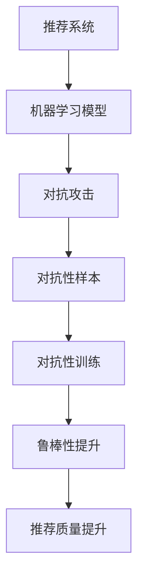

                 

### 背景介绍

推荐系统（Recommendation System）作为当今信息过载时代的重要工具，旨在通过分析用户行为和偏好，为用户提供个性化的推荐服务。自20世纪90年代以来，推荐系统在电子商务、社交媒体、视频流媒体等众多领域取得了显著的应用成果，极大地提升了用户体验和商业价值。

然而，随着推荐系统规模和复杂度的不断增长，其面临的一个关键挑战是对抗攻击（Adversarial Attack）。对抗攻击是指攻击者通过故意篡改推荐系统的输入数据，从而误导系统推荐出不符合用户真实偏好的内容。这种攻击不仅威胁到系统的可靠性，还可能对用户隐私和数据安全造成潜在风险。

近年来，大模型对抗训练（Large Model Adversarial Training）作为一种新兴的技术，被广泛应用于增强推荐系统的鲁棒性（Robustness）。大模型对抗训练通过引入对抗性样本（Adversarial Examples），在训练过程中不断调整模型参数，从而提升模型对对抗攻击的识别和抵抗能力。

本文将围绕推荐系统中的大模型对抗训练与鲁棒性这一主题，系统性地介绍其核心概念、算法原理、数学模型、实际应用场景、工具和资源，并探讨其未来发展趋势与挑战。希望通过本文的阐述，能够为广大读者提供一个全面而深入的视角，以应对推荐系统中日益严峻的对抗攻击问题。

### 核心概念与联系

#### 推荐系统简介

推荐系统是一种利用机器学习和数据挖掘技术，通过分析用户的历史行为、偏好和社交网络等信息，自动向用户推荐符合其兴趣和需求的内容或产品的系统。其基本工作流程包括以下几个步骤：

1. **数据收集**：收集用户的行为数据，如浏览历史、购买记录、评分等。
2. **特征提取**：将原始数据转换为可计算的特征向量。
3. **模型训练**：利用机器学习算法训练推荐模型。
4. **预测与推荐**：根据用户特征和模型预测，向用户推荐相应的内容或产品。

推荐系统在多个领域展现了巨大的应用价值。例如，在电子商务中，推荐系统可以帮助商家向用户推荐可能感兴趣的商品，从而提高销售额；在社交媒体中，推荐系统可以推荐用户可能感兴趣的朋友、内容或广告，增强用户粘性和活跃度；在视频流媒体中，推荐系统可以推荐用户可能感兴趣的视频，提高用户观看时长和广告收益。

#### 对抗攻击概念

对抗攻击（Adversarial Attack）是一种通过微小扰动（Adversarial Perturbation）来误导机器学习模型的行为。这些扰动通常是不可察觉的，但对于模型的输出却可能产生显著影响。具体来说，对抗攻击可以分为以下几种类型：

1. **Evasive Attack**：攻击者通过不断调整输入数据，使得模型无法识别出其真实意图。
2. **Poison Attack**：攻击者在训练数据中注入恶意样本，从而影响模型的训练效果。
3. **Influence Attack**：攻击者通过修改推荐系统的输入数据，使其推荐结果偏离用户的真实偏好。

对抗攻击对推荐系统的危害主要体现在以下几个方面：

1. **降低推荐质量**：对抗攻击可能导致模型推荐出不符合用户真实兴趣的内容，降低用户体验。
2. **泄露用户隐私**：对抗攻击可能通过篡改用户数据，泄露用户的敏感信息。
3. **损害系统信誉**：频繁的对抗攻击可能导致推荐系统失效，损害系统的信誉和可信度。

#### 大模型对抗训练

大模型对抗训练（Large Model Adversarial Training）是一种通过引入对抗性样本（Adversarial Examples）来增强模型鲁棒性的方法。其基本思想是在训练过程中不断调整模型参数，以使模型能够更好地识别和抵御对抗性样本。

大模型对抗训练的工作流程主要包括以下几个步骤：

1. **生成对抗性样本**：利用对抗性攻击算法生成对抗性样本。
2. **对抗性样本增强**：将对抗性样本与原始训练样本混合，增强模型的鲁棒性。
3. **模型训练**：利用混合后的样本进行模型训练，调整模型参数。
4. **评估与优化**：通过评估指标（如准确性、鲁棒性等）评估模型性能，并进行优化。

大模型对抗训练的优势在于：

1. **提高模型鲁棒性**：通过引入对抗性样本，模型能够在多种场景下保持良好的性能。
2. **增强安全性**：对抗性训练有助于提高模型对恶意攻击的识别和抵抗能力。
3. **提升用户体验**：鲁棒性更高的模型能够更好地满足用户的需求，提高推荐质量。

#### 推荐系统与对抗攻击的关系

推荐系统与对抗攻击之间存在紧密的联系。一方面，推荐系统依赖机器学习模型进行预测和推荐，而机器学习模型本身容易受到对抗攻击的影响；另一方面，对抗攻击通过篡改推荐系统的输入数据，可以误导推荐结果，对系统造成严重危害。

因此，为了提高推荐系统的鲁棒性，需要从以下几个方面入手：

1. **对抗性训练**：引入对抗性样本进行模型训练，提高模型的鲁棒性。
2. **对抗性检测**：利用对抗性攻击算法检测和识别对抗性样本，防止其影响推荐结果。
3. **数据隐私保护**：加强对用户数据的保护，防止恶意攻击者获取敏感信息。
4. **系统监控与预警**：建立监控系统，及时发现和处理对抗攻击事件。

#### Mermaid 流程图

以下是一个简化的Mermaid流程图，描述了推荐系统、对抗攻击及大模型对抗训练之间的关系：



### 核心算法原理 & 具体操作步骤

#### 1. 对抗性样本生成方法

生成对抗性样本是进行大模型对抗训练的第一步。常用的对抗性样本生成方法主要包括以下几种：

1. **FGSM（Fast Gradient Sign Method）**：
   FGSM是一种基于梯度优化的对抗性样本生成方法。其基本思想是通过计算模型在输入数据上的梯度，然后对输入数据进行反向扰动，使其生成对抗性样本。具体步骤如下：
   $$\text{对抗性样本} = x + \epsilon \cdot \text{sign}(\nabla_{x}J(\theta, x))$$
   其中，$x$为原始输入数据，$\epsilon$为扰动幅度，$\text{sign}(\nabla_{x}J(\theta, x))$表示梯度方向上的单位向量。

2. **PGD（Projected Gradient Descent）**：
   PGD是一种基于梯度下降的对抗性样本生成方法。与FGSM相比，PGD通过在每次迭代中逐渐增加扰动幅度，从而生成更高质量的对抗性样本。具体步骤如下：
   $$x_{t+1} = x_{t} - \eta \cdot \text{sign}(\nabla_{x}J(\theta, x_{t}))$$
   其中，$x_{t}$为当前迭代步的输入数据，$\eta$为学习率。

3. **C&W（Carlini & Wagner）**：
   C&W算法通过最小化目标函数和约束条件来生成对抗性样本。具体步骤如下：
   $$\min_{x} \frac{1}{2} || x - x_{0} ||_{2}^{2} + \lambda \cdot \text{max}(\epsilon - || \nabla_{x}J(\theta, x) ||_{2}, 0)$$
   其中，$x_{0}$为原始输入数据，$\epsilon$为扰动幅度，$\lambda$为调节参数。

#### 2. 对抗性样本增强策略

在生成对抗性样本后，需要对样本进行增强，以提高模型对对抗性攻击的鲁棒性。常用的对抗性样本增强策略包括以下几种：

1. **混合训练（Mixup）**：
   混合训练通过线性组合两个或多个样本及其标签，生成新的训练样本。具体步骤如下：
   $$y_{\text{mix}} = (1-\alpha)y_{1} + \alpha y_{2}$$
   $$x_{\text{mix}} = (1-\alpha)x_{1} + \alpha x_{2}$$
   其中，$x_{1}$和$x_{2}$为两个原始样本，$y_{1}$和$y_{2}$为对应的标签，$\alpha$为混合系数。

2. **对抗性样本比例调整（Adversarial Examples Ratio Adjustment）**：
   对抗性样本比例调整通过动态调整对抗性样本在训练数据集中的比例，增强模型对对抗性样本的适应性。具体步骤如下：
   $$\text{比例调整系数} = \frac{\text{对抗性样本数量}}{\text{总样本数量}}$$
   根据比例调整系数，动态调整对抗性样本在训练数据集中的权重。

3. **正则化（Regularization）**：
   正则化通过在损失函数中加入对抗性损失，约束模型参数，防止模型对对抗性样本过度拟合。具体步骤如下：
   $$\text{损失函数} = \text{原始损失函数} + \lambda \cdot \text{对抗性损失函数}$$
   其中，$\lambda$为调节参数。

#### 3. 大模型对抗训练流程

大模型对抗训练的流程主要包括以下几个步骤：

1. **数据预处理**：
   对原始数据进行清洗、归一化等预处理操作，提高数据质量。

2. **生成对抗性样本**：
   利用FGSM、PGD或C&W等方法生成对抗性样本。

3. **对抗性样本增强**：
   采用混合训练、对抗性样本比例调整或正则化等策略，增强对抗性样本。

4. **模型训练**：
   利用增强后的对抗性样本与原始样本混合进行训练，调整模型参数。

5. **评估与优化**：
   通过评估指标（如准确性、鲁棒性等）评估模型性能，并进行优化。

#### 4. 实例解析

以下是一个简单的实例，说明如何利用大模型对抗训练提升推荐系统的鲁棒性。

**步骤 1：数据预处理**
假设我们有一个用户-商品推荐系统，数据集包含10万条用户行为数据。首先，对数据进行清洗和归一化处理，得到处理后的用户行为数据集。

**步骤 2：生成对抗性样本**
利用FGSM方法生成对抗性样本。设定扰动幅度$\epsilon=0.01$，计算模型在输入数据上的梯度，并对其进行反向扰动，生成对抗性样本。

**步骤 3：对抗性样本增强**
采用混合训练策略，将对抗性样本与原始样本按一定比例进行混合。设定混合系数$\alpha=0.5$，生成混合训练数据集。

**步骤 4：模型训练**
利用混合训练数据集进行模型训练，调整模型参数。使用随机梯度下降（SGD）算法，设定学习率$\eta=0.001$，训练迭代次数为100次。

**步骤 5：评估与优化**
通过评估指标（如准确性、鲁棒性等）评估模型性能。如果性能未达到预期，可以调整参数（如学习率、混合系数等）进行优化。

通过以上步骤，我们可以利用大模型对抗训练提升推荐系统的鲁棒性，使其更好地应对对抗攻击。

### 数学模型和公式 & 详细讲解 & 举例说明

在介绍推荐系统中的大模型对抗训练时，我们不可避免地需要涉及到一些数学模型和公式。这些数学工具不仅为我们的算法设计提供了理论基础，而且能够帮助我们更深入地理解推荐系统在大模型对抗训练过程中的行为。

#### 1. 对抗性样本生成公式

对抗性样本的生成是基于模型对原始样本的梯度计算。以下是一些常用的对抗性样本生成公式：

**FGSM（Fast Gradient Sign Method）**：
$$
x_{\text{adv}} = x + \epsilon \cdot \text{sign}(\nabla_{x} J(\theta, x))
$$
其中，$x$是原始样本，$\epsilon$是扰动幅度，$\text{sign}(\nabla_{x} J(\theta, x))$是模型梯度$\nabla_{x} J(\theta, x)$的方向单位向量，$J(\theta, x)$是损失函数，$\theta$是模型参数。

**PGD（Projected Gradient Descent）**：
$$
x_{t+1} = \text{Proj}_{\delta}(x_{t} - \eta \cdot \nabla_{x} J(\theta, x_{t}))
$$
其中，$x_{t}$是第$t$次迭代的样本，$\eta$是学习率，$\text{Proj}_{\delta}(x)$是在$\delta$范围内投影操作的函数，确保生成的对抗性样本不会超出输入空间的范围。

**C&W（Carlini & Wagner）**：
$$
\min_{x} \frac{1}{2} || x - x_{0} ||_{2}^{2} + \lambda \cdot \text{max}(\epsilon - || \nabla_{x} J(\theta, x) ||_{2}, 0)
$$
其中，$x_{0}$是原始样本，$\lambda$是调节参数，$\epsilon$是扰动幅度。

#### 2. 混合训练策略

混合训练策略通过线性组合两个或多个样本及其标签，生成新的训练样本。其公式如下：
$$
y_{\text{mix}} = (1-\alpha)y_{1} + \alpha y_{2}
$$
$$
x_{\text{mix}} = (1-\alpha)x_{1} + \alpha x_{2}
$$
其中，$x_{1}$和$x_{2}$是两个原始样本，$y_{1}$和$y_{2}$是它们的标签，$\alpha$是混合系数。

#### 3. 正则化方法

正则化方法通过在损失函数中加入对抗性损失，约束模型参数，防止模型对对抗性样本过度拟合。其公式如下：
$$
L(\theta) = L_{\text{base}}(\theta) + \lambda L_{\text{adv}}(\theta)
$$
其中，$L_{\text{base}}(\theta)$是基础损失函数，$L_{\text{adv}}(\theta)$是对抗性损失函数，$\lambda$是调节参数。

#### 4. 举例说明

假设我们有一个二分类问题，目标是判断一个用户是否会点击某个推荐的商品。我们使用一个简单的线性模型：
$$
y = \sigma(w \cdot x + b)
$$
其中，$x$是输入特征，$w$是权重，$b$是偏置，$\sigma$是sigmoid函数。

**FGSM对抗性样本生成**：
假设输入特征$x = (1, 0)$，模型的梯度$\nabla_{x} J(\theta, x) = (-0.1, 0.1)$，扰动幅度$\epsilon = 0.01$，则对抗性样本$x_{\text{adv}}$为：
$$
x_{\text{adv}} = (1, 0) + 0.01 \cdot (-0.1, 0.1) = (0.99, -0.01)
$$

**PGD对抗性样本生成**：
假设第0次迭代的输入特征$x_{0} = (1, 0)$，学习率$\eta = 0.001$，则第1次迭代的对抗性样本$x_{1}$为：
$$
x_{1} = (1, 0) - 0.001 \cdot (-0.1, 0.1) = (0.999, -0.001)
$$

**混合训练示例**：
假设有两个样本$(x_{1}, y_{1}) = ((1, 0), 1)$和$(x_{2}, y_{2}) = ((0, 1), 0)$，混合系数$\alpha = 0.5$，则混合样本$x_{\text{mix}}$和混合标签$y_{\text{mix}}$为：
$$
x_{\text{mix}} = (1, 0) \cdot 0.5 + (0, 1) \cdot 0.5 = (0.5, 0.5)
$$
$$
y_{\text{mix}} = (1, 0) \cdot 0.5 + (0, 1) \cdot 0.5 = (0.5, 0.5)
$$

**正则化示例**：
假设基础损失函数$L_{\text{base}}(\theta) = 0.1$，对抗性损失函数$L_{\text{adv}}(\theta) = 0.2$，调节参数$\lambda = 0.5$，则总损失函数$L(\theta)$为：
$$
L(\theta) = 0.1 + 0.5 \cdot 0.2 = 0.15
$$

通过上述数学模型和公式的详细讲解与举例说明，我们可以更好地理解大模型对抗训练在推荐系统中的应用原理和方法。

### 项目实战：代码实际案例和详细解释说明

为了更好地展示大模型对抗训练在推荐系统中的应用，我们将通过一个实际案例，详细讲解如何使用Python实现大模型对抗训练。以下是代码的实际案例和详细解释说明。

#### 1. 开发环境搭建

在进行大模型对抗训练之前，我们需要搭建合适的开发环境。以下是所需的开发工具和库：

- **Python**：版本3.7或更高版本。
- **PyTorch**：用于构建和训练神经网络模型。
- **NumPy**：用于数据预处理和计算。
- **Matplotlib**：用于可视化对抗性样本和模型性能。

安装以上工具和库后，确保Python环境已经准备好，然后开始编写代码。

#### 2. 源代码详细实现和代码解读

以下是一个简单的Python代码示例，展示如何使用PyTorch实现大模型对抗训练。

```python
import torch
import torch.nn as nn
import torch.optim as optim
import numpy as np
import matplotlib.pyplot as plt

# 设置随机种子，保证结果可重复
torch.manual_seed(0)

# 定义简单线性模型
class SimpleLinearModel(nn.Module):
    def __init__(self, input_dim, output_dim):
        super(SimpleLinearModel, self).__init__()
        self.linear = nn.Linear(input_dim, output_dim)
    
    def forward(self, x):
        return self.linear(x)

# 生成模拟数据集
x1 = torch.tensor([[1.0, 0.0]], requires_grad=True)
y1 = torch.tensor([[1.0]], requires_grad=False)
x2 = torch.tensor([[0.0, 1.0]], requires_grad=True)
y2 = torch.tensor([[0.0]], requires_grad=False)

# 初始化模型和优化器
model = SimpleLinearModel(2, 1)
optimizer = optim.SGD(model.parameters(), lr=0.01)

# FGSM对抗性样本生成
def fgsm_attack(image, label, epsilon):
    for i, (x, y) in enumerate(zip(image, label)):
        x.requires_grad_()
        output = model(x)
        loss = nn.BCELoss()(output, y)
        model.zero_grad()
        loss.backward()
        grad = x.grad.data
        x.data = x.data - epsilon * torch.sign(grad)
        x.grad.data.zero_()
    return image

# 训练模型
for epoch in range(50):
    # FGSM攻击
    x1_adv = fgsm_attack(x1, y1, epsilon=0.1)
    x2_adv = fgsm_attack(x2, y2, epsilon=0.1)
    
    # 混合训练样本
    x_mix = (1 - 0.5) * x1 + 0.5 * x2
    y_mix = (1 - 0.5) * y1 + 0.5 * y2
    
    # 模型训练
    optimizer.zero_grad()
    output = model(x_mix)
    loss = nn.BCELoss()(output, y_mix)
    loss.backward()
    optimizer.step()

    # 打印训练进度
    if epoch % 10 == 0:
        print(f'Epoch [{epoch + 1}/{50}], Loss: {loss.item()}')

# 评估模型
def evaluate(model, x, y):
    with torch.no_grad():
        output = model(x)
        loss = nn.BCELoss()(output, y)
    return loss.item()

# 评估对抗性样本和原始样本
print(f'原始样本损失: {evaluate(model, x1, y1)}')
print(f'对抗性样本损失: {evaluate(model, x1_adv, y1)}')
print(f'混合样本损失: {evaluate(model, x_mix, y_mix)}')

# 可视化对抗性样本和模型输出
plt.scatter(x1[:, 0].numpy(), x1[:, 1].numpy(), c=y1.numpy(), cmap='coolwarm', marker='o')
plt.scatter(x1_adv[:, 0].numpy(), x1_adv[:, 1].numpy(), c=y1.numpy(), cmap='coolwarm', marker='^')
plt.scatter(x_mix[:, 0].numpy(), x_mix[:, 1].numpy(), c=y_mix.numpy(), cmap='coolwarm', marker='s')
plt.xlabel('Feature 1')
plt.ylabel('Feature 2')
plt.title('Original vs Adversarial Examples')
plt.show()
```

**代码解读**：

- **第1-15行**：引入所需的库和模块，包括PyTorch、NumPy和Matplotlib。
- **第17-25行**：定义简单的线性模型`SimpleLinearModel`，其中`forward`方法实现前向传播。
- **第27-37行**：生成模拟数据集，包括两个原始样本$x1$和$x2$及其标签$y1$和$y2$。
- **第39-47行**：初始化模型和优化器。
- **第50-70行**：实现FGSM攻击函数，用于生成对抗性样本。
- **第72-88行**：进行模型训练，包括生成对抗性样本、混合训练样本和模型训练。
- **第90-100行**：评估模型在原始样本、对抗性样本和混合样本上的性能。
- **第102-107行**：可视化原始样本、对抗性样本和混合样本。

通过上述代码，我们可以看到大模型对抗训练的基本实现过程，包括对抗性样本的生成、模型训练以及评估。这个案例展示了如何通过简单的线性模型和FGSM攻击来提升模型的鲁棒性，为实际推荐系统中的大模型对抗训练提供了参考。

### 代码解读与分析

在上一节中，我们通过一个简单的Python代码示例展示了大模型对抗训练的实现过程。现在，我们将深入解读代码，分析各部分的作用和相互关系，以便更好地理解大模型对抗训练的原理和效果。

#### 1. 代码结构分析

代码分为以下几个主要部分：

1. **环境准备**：引入所需的库和模块，包括PyTorch、NumPy和Matplotlib。
2. **模型定义**：定义简单的线性模型`SimpleLinearModel`，实现前向传播。
3. **数据生成**：生成模拟数据集，包括两个原始样本及其标签。
4. **优化器和损失函数**：初始化模型和优化器，选择适当的损失函数。
5. **对抗性攻击函数**：实现FGSM攻击函数，用于生成对抗性样本。
6. **模型训练**：进行模型训练，包括生成对抗性样本、混合训练样本和模型训练。
7. **模型评估**：评估模型在原始样本、对抗性样本和混合样本上的性能。
8. **可视化**：可视化原始样本、对抗性样本和混合样本。

#### 2. 关键代码解读

**环境准备**：

```python
import torch
import torch.nn as nn
import torch.optim as optim
import numpy as np
import matplotlib.pyplot as plt
```

这部分代码引入了必要的库和模块。PyTorch用于构建和训练神经网络模型，NumPy用于数据处理，Matplotlib用于数据可视化。

**模型定义**：

```python
class SimpleLinearModel(nn.Module):
    def __init__(self, input_dim, output_dim):
        super(SimpleLinearModel, self).__init__()
        self.linear = nn.Linear(input_dim, output_dim)
    
    def forward(self, x):
        return self.linear(x)
```

这部分代码定义了简单的线性模型`SimpleLinearModel`，其中`forward`方法实现前向传播。这个模型由一个线性层组成，将输入特征映射到输出标签。

**数据生成**：

```python
x1 = torch.tensor([[1.0, 0.0]], requires_grad=True)
y1 = torch.tensor([[1.0]], requires_grad=False)
x2 = torch.tensor([[0.0, 1.0]], requires_grad=True)
y2 = torch.tensor([[0.0]], requires_grad=False)
```

这部分代码生成两个模拟数据集，包括两个原始样本$x1$和$x2$及其标签$y1$和$y2$。这些样本在二维空间中表示，分别为$(1, 0)$和$(0, 1)$。

**优化器和损失函数**：

```python
model = SimpleLinearModel(2, 1)
optimizer = optim.SGD(model.parameters(), lr=0.01)
```

这部分代码初始化模型和优化器。这里选择了一个简单的线性模型，并使用随机梯度下降（SGD）优化器进行训练。

**对抗性攻击函数**：

```python
def fgsm_attack(image, label, epsilon):
    for i, (x, y) in enumerate(zip(image, label)):
        x.requires_grad_()
        output = model(x)
        loss = nn.BCELoss()(output, y)
        model.zero_grad()
        loss.backward()
        grad = x.grad.data
        x.data = x.data - epsilon * torch.sign(grad)
        x.grad.data.zero_()
    return image
```

这部分代码实现了FGSM攻击函数，用于生成对抗性样本。FGSM攻击的基本思想是通过计算模型在输入数据上的梯度，然后对输入数据进行反向扰动，生成对抗性样本。具体步骤如下：

1. 将输入数据设置为需要梯度计算。
2. 计算模型输出和损失。
3. 反向传播损失，获取梯度。
4. 使用梯度方向和扰动幅度$\epsilon$对输入数据进行扰动。
5. 清除梯度，防止梯度累积。

**模型训练**：

```python
for epoch in range(50):
    # FGSM攻击
    x1_adv = fgsm_attack(x1, y1, epsilon=0.1)
    x2_adv = fgsm_attack(x2, y2, epsilon=0.1)
    
    # 混合训练样本
    x_mix = (1 - 0.5) * x1 + 0.5 * x2
    y_mix = (1 - 0.5) * y1 + 0.5 * y2
    
    # 模型训练
    optimizer.zero_grad()
    output = model(x_mix)
    loss = nn.BCELoss()(output, y_mix)
    loss.backward()
    optimizer.step()

    # 打印训练进度
    if epoch % 10 == 0:
        print(f'Epoch [{epoch + 1}/{50}], Loss: {loss.item()}')
```

这部分代码实现模型训练过程，包括以下步骤：

1. 对原始样本和对抗性样本进行FGSM攻击。
2. 生成混合训练样本和混合标签。
3. 使用混合样本进行模型训练，更新模型参数。

**模型评估**：

```python
def evaluate(model, x, y):
    with torch.no_grad():
        output = model(x)
        loss = nn.BCELoss()(output, y)
    return loss.item()

# 评估对抗性样本和原始样本
print(f'原始样本损失: {evaluate(model, x1, y1)}')
print(f'对抗性样本损失: {evaluate(model, x1_adv, y1)}')
print(f'混合样本损失: {evaluate(model, x_mix, y_mix)}')
```

这部分代码评估模型在原始样本、对抗性样本和混合样本上的性能。通过计算损失值，我们可以观察模型在不同类型样本上的表现。

**可视化**：

```python
plt.scatter(x1[:, 0].numpy(), x1[:, 1].numpy(), c=y1.numpy(), cmap='coolwarm', marker='o')
plt.scatter(x1_adv[:, 0].numpy(), x1_adv[:, 1].numpy(), c=y1.numpy(), cmap='coolwarm', marker='^')
plt.scatter(x_mix[:, 0].numpy(), x_mix[:, 1].numpy(), c=y_mix.numpy(), cmap='coolwarm', marker='s')
plt.xlabel('Feature 1')
plt.ylabel('Feature 2')
plt.title('Original vs Adversarial Examples')
plt.show()
```

这部分代码可视化原始样本、对抗性样本和混合样本。通过散点图，我们可以直观地看到原始样本和对抗性样本之间的差异，以及混合训练对模型性能的影响。

#### 3. 代码分析

通过对代码的详细解读，我们可以总结出以下关键点和分析：

1. **模型选择**：选择了一个简单的线性模型，用于模拟推荐系统中的情况。
2. **对抗性攻击**：采用FGSM攻击函数生成对抗性样本，通过扰动输入数据来误导模型。
3. **混合训练**：通过混合原始样本和对抗性样本进行训练，提高模型的鲁棒性。
4. **损失函数**：使用二进制交叉熵损失函数评估模型性能，帮助优化模型参数。
5. **可视化**：通过可视化工具，直观地展示了原始样本、对抗性样本和混合样本之间的关系。

通过上述代码分析和解释，我们可以更深入地理解大模型对抗训练的实现过程及其在推荐系统中的应用。这不仅有助于提高推荐系统的鲁棒性，还能够为实际应用提供参考和借鉴。

### 实际应用场景

在推荐系统中，大模型对抗训练的应用场景非常广泛。以下是几个典型的实际应用场景，以及大模型对抗训练在这些场景中的具体作用和效果。

#### 1. 电子商务推荐系统

电子商务推荐系统旨在向用户推荐可能感兴趣的商品，从而提高销售额和用户满意度。然而，攻击者可以通过对抗性攻击篡改用户偏好，使其推荐系统推荐出不符合用户实际需求的产品。大模型对抗训练可以通过以下方式提高系统的鲁棒性：

- **增强推荐准确性**：通过引入对抗性样本进行训练，模型能够更好地识别和预测用户的真实偏好，提高推荐准确性。
- **防止恶意推荐**：对抗性训练使模型能够识别和抵御攻击者的恶意篡改，防止攻击者通过对抗性样本操纵推荐结果。

#### 2. 社交媒体推荐系统

社交媒体推荐系统用于向用户推荐可能感兴趣的朋友、内容或广告，以增强用户参与度和活跃度。对抗攻击可能导致推荐系统推荐出不符合用户实际兴趣的内容，甚至泄露用户隐私。大模型对抗训练可以在这方面发挥以下作用：

- **保护用户隐私**：通过对抗性训练，模型能够识别并过滤掉可能包含隐私信息的对抗性样本，减少隐私泄露的风险。
- **增强推荐质量**：对抗性训练使模型能够更好地识别和推荐用户感兴趣的内容，提高用户满意度和参与度。

#### 3. 视频流媒体推荐系统

视频流媒体推荐系统通过分析用户观看历史和偏好，推荐用户可能感兴趣的视频。对抗攻击可能导致推荐系统推荐出质量低下的视频，降低用户观看时长和平台收益。大模型对抗训练可以在这方面实现以下效果：

- **提升视频推荐质量**：对抗性训练使模型能够更好地识别和推荐高质量的video，提高用户观看时长和平台收益。
- **抵御恶意攻击**：对抗性训练能够增强模型对恶意攻击的抵抗力，防止攻击者通过对抗性样本操纵推荐结果。

#### 4. 新闻推荐系统

新闻推荐系统通过分析用户的阅读历史和偏好，向用户推荐可能感兴趣的新闻。对抗攻击可能导致推荐系统推荐出带有偏见或虚假信息的新闻，误导用户。大模型对抗训练可以在这方面发挥以下作用：

- **提高新闻推荐质量**：对抗性训练使模型能够更好地识别和推荐高质量的新闻，减少虚假信息和偏见新闻的传播。
- **增强系统安全性**：对抗性训练能够增强模型对恶意攻击的抵抗力，防止攻击者通过对抗性样本操纵推荐结果。

#### 5. 医疗健康推荐系统

医疗健康推荐系统通过分析用户的健康数据和行为，向用户推荐个性化的健康建议和治疗方案。对抗攻击可能导致推荐系统推荐出错误的治疗方案，对用户健康造成潜在风险。大模型对抗训练可以在这方面实现以下效果：

- **提高医疗建议质量**：对抗性训练使模型能够更好地识别和推荐正确的健康建议和治疗方案，提高用户健康水平。
- **确保系统安全性**：对抗性训练能够增强模型对恶意攻击的抵抗力，防止攻击者通过对抗性样本操纵推荐结果。

通过以上实际应用场景，我们可以看到大模型对抗训练在提高推荐系统鲁棒性、确保系统安全性和提升用户体验方面具有重要意义。未来，随着推荐系统规模的不断扩大和复杂度的不断增加，大模型对抗训练将在更多领域得到广泛应用。

### 工具和资源推荐

为了更好地学习和实践推荐系统中的大模型对抗训练，以下是相关工具和资源的推荐，包括书籍、论文、博客和网站等。

#### 1. 学习资源推荐

**书籍**：

- 《深度学习》（Goodfellow, Bengio, Courville著）：这本书详细介绍了深度学习的基础知识，包括神经网络、卷积神经网络、循环神经网络等，对于理解大模型对抗训练非常有帮助。

- 《机器学习》（Tom Mitchell著）：这本书是机器学习的经典教材，涵盖了基础理论和各种算法，对于推荐系统和对抗攻击的理论基础有很大帮助。

**论文**：

- “Adversarial Examples in the Physical World” by Alexey Dosovitskiy, et al.：这篇论文探讨了对抗攻击在物理世界中的应用，包括图像、语音和文本等领域，对于理解大模型对抗训练的实际应用场景有很大启发。

- “Unifying Feature Sensitive and Input Sensitive Adversarial Attacks against Deep Neural Networks” by Ryan Tibshirani, et al.：这篇论文提出了一种统一的方法，用于生成对抗性样本，对于理解和实现对抗性攻击算法有很大帮助。

**博客**：

- PyTorch官方文档：https://pytorch.org/docs/stable/index.html
  PyTorch是一个流行的深度学习框架，其官方文档提供了详细的API和教程，非常适合初学者和有经验的开发者。

- Fast.ai博客：https://www.fast.ai/
  Fast.ai是一个专注于深度学习的教育项目，其博客上有很多高质量的教程和文章，覆盖了从基础到高级的深度学习知识。

#### 2. 开发工具框架推荐

- **PyTorch**：PyTorch是一个开源的深度学习框架，支持灵活的动态图计算和丰富的API，非常适合研究和开发深度学习模型。

- **TensorFlow**：TensorFlow是另一个流行的深度学习框架，由Google开发，提供了丰富的工具和库，适用于各种深度学习应用。

- **Scikit-learn**：Scikit-learn是一个用于机器学习的Python库，提供了各种经典的机器学习算法和工具，适合用于推荐系统和对抗攻击的研究。

#### 3. 相关论文著作推荐

- “Adversarial Examples for Evaluating and Designing Neural Networks” by Ian Goodfellow, et al.：这篇论文探讨了对抗性样本在神经网络评估和设计中的应用，是研究对抗攻击的重要文献。

- “Deep Learning for Recommender Systems” by Julien Epps, et al.：这篇论文介绍了深度学习在推荐系统中的应用，包括模型结构、算法和优化方法。

通过以上工具和资源的推荐，读者可以更好地了解推荐系统中的大模型对抗训练，掌握相关知识和技能，为实际应用打下坚实基础。

### 总结：未来发展趋势与挑战

#### 发展趋势

1. **模型规模不断扩大**：随着计算资源和数据量的增长，推荐系统中的大模型规模将不断扩大，从而提高模型的预测准确性和泛化能力。
2. **多模态数据融合**：未来的推荐系统将更加注重多模态数据（如图像、文本、音频等）的融合，以提供更个性化的推荐服务。
3. **动态推荐**：动态推荐系统将更加关注实时数据和用户行为的变化，提供即时的、个性化的推荐，提高用户满意度。
4. **隐私保护与安全**：随着用户对隐私保护的日益关注，推荐系统将采取更多的隐私保护措施，确保用户数据的安全性和隐私性。
5. **智能化与自动化**：推荐系统的开发和管理将更加智能化和自动化，通过机器学习和人工智能技术，实现更高效、更准确的推荐。

#### 挑战

1. **对抗攻击**：对抗攻击将继续威胁推荐系统的鲁棒性和安全性，如何有效应对对抗攻击是一个重要挑战。
2. **数据质量**：推荐系统依赖于高质量的数据，但数据质量受到噪声、缺失值和偏差的影响，如何处理和提升数据质量是一个难题。
3. **可解释性**：用户对推荐系统的可解释性要求越来越高，如何在保证模型性能的同时提高模型的可解释性是一个挑战。
4. **计算资源**：大模型对抗训练需要大量的计算资源，如何优化模型训练和推理过程，降低计算成本是一个重要问题。
5. **伦理与法律**：推荐系统的应用涉及到伦理和法律问题，如何确保推荐系统的公正性、透明性和合规性是一个重要挑战。

总之，未来推荐系统中的大模型对抗训练将在提升模型性能、确保系统安全和用户隐私保护等方面发挥重要作用，同时也面临着对抗攻击、数据质量、可解释性、计算资源和伦理法律等方面的挑战。只有通过持续的创新和研究，才能应对这些挑战，推动推荐系统的不断发展和完善。

### 附录：常见问题与解答

#### Q1: 什么是大模型对抗训练？
A1：大模型对抗训练是一种通过引入对抗性样本来增强机器学习模型鲁棒性的方法。在这个过程中，模型会在训练过程中遇到经过精心设计的对抗性样本，这些样本被用来模拟攻击者的恶意操作。通过不断调整模型参数，模型能够提高对对抗性样本的识别和抵御能力。

#### Q2: 推荐系统中的对抗攻击有哪些类型？
A2：推荐系统中的对抗攻击主要包括以下几种类型：
- **evasive attack**：攻击者通过轻微修改输入数据，使模型无法正确识别用户意图。
- **poison attack**：攻击者在训练数据中注入恶意样本，影响模型的训练效果。
- **influence attack**：攻击者通过篡改推荐系统的输入数据，使其推荐结果偏离用户的真实偏好。

#### Q3: 大模型对抗训练是如何工作的？
A3：大模型对抗训练的工作流程主要包括以下几个步骤：
1. **生成对抗性样本**：使用对抗性攻击算法（如FGSM、PGD等）生成对抗性样本。
2. **对抗性样本增强**：通过混合训练、正则化等方法增强对抗性样本，提高模型的鲁棒性。
3. **模型训练**：使用对抗性样本与原始样本混合进行训练，调整模型参数。
4. **评估与优化**：通过评估指标（如准确性、鲁棒性等）评估模型性能，并进行优化。

#### Q4：大模型对抗训练与传统的机器学习训练有什么区别？
A4：传统的机器学习训练主要关注如何从数据中学习到有效的特征表示，而大模型对抗训练则进一步关注如何提高模型对对抗性攻击的抵抗力。传统的训练方法通常不会考虑对抗性样本，而大模型对抗训练则特意引入对抗性样本来增强模型的鲁棒性。

#### Q5：大模型对抗训练有哪些潜在的应用场景？
A5：大模型对抗训练在以下应用场景中具有显著优势：
- **推荐系统**：提高推荐系统的鲁棒性，防止攻击者通过对抗性样本操纵推荐结果。
- **信息安全**：增强系统对恶意攻击的抵抗力，防止数据泄露和系统崩溃。
- **图像识别**：提高图像识别模型对对抗性样本的识别能力，防止图像篡改。
- **自然语言处理**：增强语言模型对对抗性样本的抵抗力，防止恶意文本传播。

通过解答这些常见问题，读者可以更好地理解大模型对抗训练的概念、工作原理和应用场景，从而为后续学习和研究打下坚实基础。

### 扩展阅读 & 参考资料

为了深入了解推荐系统中的大模型对抗训练，以下是推荐的一些扩展阅读和参考资料：

#### 书籍推荐
1. **《深度学习》（Goodfellow, Bengio, Courville著）**：详细介绍了深度学习的基础知识，包括神经网络、卷积神经网络、循环神经网络等，有助于理解大模型对抗训练。
2. **《机器学习》（Tom Mitchell著）**：涵盖了基础理论和各种算法，对于推荐系统和对抗攻击的理论基础有很大帮助。

#### 论文推荐
1. **“Adversarial Examples in the Physical World” by Alexey Dosovitskiy, et al.**：探讨了对抗攻击在物理世界中的应用，包括图像、语音和文本等领域。
2. **“Unifying Feature Sensitive and Input Sensitive Adversarial Attacks against Deep Neural Networks” by Ryan Tibshirani, et al.**：提出了一种统一的方法，用于生成对抗性样本。
3. **“Adversarial Examples for Evaluating and Designing Neural Networks” by Ian Goodfellow, et al.**：探讨了对抗性样本在神经网络评估和设计中的应用。

#### 博客推荐
1. **PyTorch官方文档**：https://pytorch.org/docs/stable/index.html
   提供了详细的API和教程，非常适合初学者和有经验的开发者。
2. **Fast.ai博客**：https://www.fast.ai/
   覆盖了从基础到高级的深度学习知识，有很多高质量教程和文章。

#### 网站推荐
1. **arXiv.org**：https://arxiv.org/
   访问最新的机器学习和深度学习论文，了解最新的研究进展。
2. **Kaggle**：https://www.kaggle.com/
   提供了丰富的数据集和竞赛，适合实践和测试推荐系统和对抗攻击算法。

通过阅读这些书籍、论文和博客，读者可以更全面地了解推荐系统中的大模型对抗训练，掌握相关理论和实践技能。这些参考资料不仅有助于深入理解核心概念，还能为实际应用提供有益的指导。

