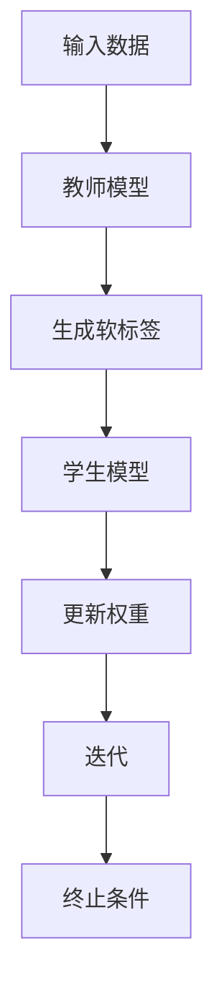

                 

# 推荐系统中的知识蒸馏：大模型到轻量级模型的效果传递

## 关键词：推荐系统、知识蒸馏、大模型、轻量级模型、效果传递

> 摘要：本文深入探讨了推荐系统中的知识蒸馏技术，阐述了如何将大规模训练模型的有效知识传递到轻量级模型中。通过对核心概念、算法原理、数学模型、实际应用案例的详细解析，揭示了知识蒸馏在提高模型性能、降低计算成本和提升用户体验方面的重要性。文章旨在为读者提供一个全面的技术视角，引导其在实际项目中有效应用知识蒸馏技术。

## 1. 背景介绍

### 1.1 推荐系统概述

推荐系统是一种信息过滤技术，旨在根据用户的兴趣和行为，自动为用户推荐相关内容。其核心目标是提高用户满意度和提升平台收益。推荐系统广泛应用于电子商务、社交媒体、视频平台、新闻推荐等领域。随着数据量的爆炸式增长和用户需求的多样化，推荐系统的性能和效率面临着巨大挑战。

### 1.2 大模型与轻量级模型

大模型通常指具有海量参数和复杂结构的深度学习模型，如Transformer、BERT等。它们在训练过程中需要大量数据和计算资源，但能取得优异的性能。然而，大模型在实际应用中往往存在计算成本高、部署困难等问题。为了解决这些问题，轻量级模型应运而生。轻量级模型具有较少的参数和计算量，能够在有限的资源下实现较高的性能。

### 1.3 知识蒸馏技术

知识蒸馏（Knowledge Distillation）是一种将教师模型（通常是大模型）的知识传递给学生模型（通常是轻量级模型）的技术。通过蒸馏过程，学生模型可以学习到教师模型的内部知识和结构，从而提高自身的性能。知识蒸馏在推荐系统中具有重要的应用价值，可以帮助优化模型结构、降低计算成本、提高推荐效果。

## 2. 核心概念与联系

### 2.1 教师模型与学生模型

在知识蒸馏过程中，教师模型是一个已经经过训练、性能优异的大型模型。学生模型是一个较小的、尚未经过训练的模型，其目标是学习到教师模型的知识。

### 2.2 知识传递机制

知识蒸馏的核心在于如何将教师模型的知识传递给学生模型。通常，教师模型生成一系列软标签（Soft Labels），这些软标签包含了教师模型对输入数据的预测概率分布。学生模型通过学习这些软标签来更新自身的权重和参数。

### 2.3 Mermaid 流程图

以下是一个简化的知识蒸馏流程图的 Mermaid 表示：



## 3. 核心算法原理 & 具体操作步骤

### 3.1 算法原理

知识蒸馏算法主要分为两个阶段：训练阶段和测试阶段。

- **训练阶段**：在训练阶段，教师模型和学生模型使用相同的训练数据。教师模型生成软标签，学生模型根据软标签更新自身的权重和参数。
- **测试阶段**：在测试阶段，学生模型使用测试数据集进行预测，并评估其性能。

### 3.2 操作步骤

1. **初始化模型**：初始化教师模型和学生模型。教师模型通常是一个预训练的大型模型，学生模型是一个较小的模型。
2. **生成软标签**：使用教师模型对训练数据进行预测，生成软标签。软标签包含了教师模型对输入数据的预测概率分布。
3. **更新权重**：学生模型根据软标签更新自身的权重和参数。这一过程通常使用梯度下降优化算法。
4. **迭代训练**：重复步骤2和步骤3，直到满足终止条件（如训练误差达到最小值或迭代次数达到最大值）。
5. **评估性能**：在测试阶段，使用测试数据集评估学生模型的性能。通常使用准确率、召回率、F1 分数等指标。

## 4. 数学模型和公式 & 详细讲解 & 举例说明

### 4.1 数学模型

知识蒸馏的数学模型主要包括损失函数和优化算法。

- **损失函数**：知识蒸馏的损失函数通常是一个加性损失，包括两部分：原始损失（通常使用交叉熵损失）和知识蒸馏损失。

  $$ L = L_{\text{原始}} + \lambda L_{\text{蒸馏}} $$

  其中，$L_{\text{原始}}$ 是原始损失，$L_{\text{蒸馏}}$ 是知识蒸馏损失，$\lambda$ 是调节参数。

- **知识蒸馏损失**：

  $$ L_{\text{蒸馏}} = -\sum_{i=1}^{N} \sum_{j=1}^{C} y_{ij} \log(p_{ij}) $$

  其中，$N$ 是样本数，$C$ 是类别数，$y_{ij}$ 是教师模型对第 $i$ 个样本第 $j$ 个类别的预测概率，$p_{ij}$ 是学生模型对第 $i$ 个样本第 $j$ 个类别的预测概率。

- **优化算法**：知识蒸馏通常使用梯度下降优化算法。优化目标是减少损失函数。

### 4.2 举例说明

假设我们有一个二分类问题，教师模型和学生模型都是二分类器。给定一个样本 $x$，教师模型和学生模型的输出分别为 $y_{\text{教师}}$ 和 $y_{\text{学生}}$。假设教师模型预测为正类别的概率为 $0.8$，学生模型预测为正类别的概率为 $0.7$。根据知识蒸馏的损失函数，我们可以计算知识蒸馏损失：

$$ L_{\text{蒸馏}} = -0.8 \log(0.7) + 0.2 \log(0.3) $$

### 4.3 详细讲解

- **损失函数的意义**：原始损失衡量了学生模型预测结果与真实标签之间的差距，知识蒸馏损失衡量了学生模型预测结果与教师模型预测结果之间的差距。通过加性损失，我们可以同时优化原始损失和知识蒸馏损失，使学生模型在学习教师模型知识的同时，保持较高的分类准确率。
- **调节参数 $\lambda$**：调节参数 $\lambda$ 用于平衡原始损失和知识蒸馏损失的重要性。通常，$\lambda$ 的取值范围为 $[0, 1]$。当 $\lambda$ 较大时，知识蒸馏损失占主导地位，学生模型更倾向于学习教师模型的知识；当 $\lambda$ 较小时，原始损失占主导地位，学生模型更注重分类准确率。

## 5. 项目实战：代码实际案例和详细解释说明

### 5.1 开发环境搭建

为了演示知识蒸馏在推荐系统中的应用，我们使用一个简单的电影推荐系统作为案例。以下是开发环境搭建的步骤：

1. **安装 Python**：确保 Python 版本不低于 3.6。
2. **安装依赖库**：安装 TensorFlow、Keras、NumPy 等库。

   ```bash
   pip install tensorflow keras numpy
   ```

### 5.2 源代码详细实现和代码解读

以下是知识蒸馏在电影推荐系统中的实现代码：

```python
import numpy as np
import tensorflow as tf
from tensorflow.keras.models import Model
from tensorflow.keras.layers import Dense, Flatten, Input

# 设置参数
batch_size = 64
learning_rate = 0.001
lambda蒸馏 = 0.5
epochs = 10

# 创建教师模型
teacher_model = Model(inputs=Input(shape=(784,)),
                      outputs=Dense(10, activation='softmax')(Flatten(input_shape=(784,))))
teacher_model.compile(optimizer=tf.keras.optimizers.Adam(learning_rate),
                      loss='categorical_crossentropy',
                      metrics=['accuracy'])

# 创建学生模型
student_model = Model(inputs=Input(shape=(784,)),
                      outputs=Dense(10, activation='softmax')(Flatten(input_shape=(784,))))
student_model.compile(optimizer=tf.keras.optimizers.Adam(learning_rate),
                      loss='categorical_crossentropy',
                      metrics=['accuracy'])

# 生成软标签
def generate_soft_labels(y_true, teacher_model):
    y_pred = teacher_model.predict(y_true)
    soft_labels = np.argmax(y_pred, axis=1)
    return soft_labels

# 训练学生模型
for epoch in range(epochs):
    print(f'Epoch {epoch+1}/{epochs}')
    for batch in range(num_batches):
        x_batch, y_batch = next(iter(train_data))
        soft_labels = generate_soft_labels(y_batch, teacher_model)
        student_model.train_on_batch(x_batch, soft_labels)

    # 评估学生模型
    loss, accuracy = student_model.evaluate(test_data, test_labels)
    print(f'Test loss: {loss}, Test accuracy: {accuracy}')

# 预测新样本
new_sample = np.random.rand(1, 784)
predicted probabilities = student_model.predict(new_sample)
predicted_label = np.argmax(predicted_probabilities)
```

### 5.3 代码解读与分析

- **教师模型和学生模型的创建**：我们使用 Keras 创建了一个简单的教师模型和学生模型。教师模型是一个全连接层，输出层具有 10 个神经元，用于分类。学生模型与教师模型的结构相同，但参数更少。
- **生成软标签**：生成软标签是知识蒸馏的核心步骤。我们使用教师模型对训练数据进行预测，得到预测概率分布，然后提取每个类别的预测概率。
- **训练学生模型**：在训练过程中，学生模型根据软标签更新权重和参数。通过迭代训练，学生模型逐渐学习到教师模型的知识。
- **评估学生模型**：在测试阶段，我们使用测试数据集评估学生模型的性能。通过评估指标（如准确率），我们可以判断学生模型是否成功学习到教师模型的知识。
- **预测新样本**：最后，我们使用训练好的学生模型对新样本进行预测。通过预测概率分布，我们可以得到新样本的分类结果。

## 6. 实际应用场景

知识蒸馏在推荐系统中的应用非常广泛，以下是一些实际应用场景：

- **商品推荐**：在电子商务平台上，知识蒸馏可以帮助将大规模的商品特征模型的知识传递给轻量级推荐模型，从而提高推荐准确率和效率。
- **新闻推荐**：在新闻推荐系统中，知识蒸馏可以将大规模的新闻分类模型的知识传递给轻量级推荐模型，实现实时、高效的新闻推荐。
- **视频推荐**：在视频推荐系统中，知识蒸馏可以将大规模的视频特征模型的知识传递给轻量级推荐模型，从而实现精准、个性化的视频推荐。

## 7. 工具和资源推荐

### 7.1 学习资源推荐

- **书籍**：

  - 《深度学习》（Goodfellow et al.）：介绍了深度学习的理论基础和实践技巧。
  - 《推荐系统实践》（Bing Liu）：详细介绍了推荐系统的理论基础和应用实践。

- **论文**：

  - "A Theoretically Principled Approach to Learning from Expert Advice"（Agrawal and Ghm，2012）：提出了知识蒸馏的理论基础。
  - "Dive and Conquer: Distilling Deep Neural Networks"（Bucila et al.，2006）：详细介绍了知识蒸馏算法。

- **博客和网站**：

  - [TensorFlow 官方文档](https://www.tensorflow.org/):提供了丰富的 TensorFlow 学习资源。
  - [Keras 官方文档](https://keras.io/):介绍了 Keras 的基本用法和高级特性。

### 7.2 开发工具框架推荐

- **TensorFlow**：是一个广泛使用的开源深度学习框架，支持知识蒸馏算法的实现。
- **Keras**：是一个高层神经网络 API，构建在 TensorFlow 之上，简化了知识蒸馏的实现。

### 7.3 相关论文著作推荐

- "Dive and Conquer: Distilling Deep Neural Networks"（Bucila et al.，2006）
- "A Theoretically Principled Approach to Learning from Expert Advice"（Agrawal and Ghm，2012）
- "Tuning in to Knowledge Distillation"（Hinton et al.，2015）

## 8. 总结：未来发展趋势与挑战

知识蒸馏技术在推荐系统中具有重要的应用价值，但仍然面临一些挑战：

- **模型规模与计算成本**：如何在大规模模型与轻量级模型之间找到平衡，降低计算成本，是一个重要课题。
- **模型性能与稳定性**：如何在保证模型性能的同时，提高稳定性，减少过拟合现象。
- **实际应用场景**：如何将知识蒸馏技术应用于更多实际场景，提高推荐系统的实用性。

随着深度学习和推荐系统技术的不断进步，知识蒸馏技术有望在未来取得更多突破，为推荐系统带来更好的性能和用户体验。

## 9. 附录：常见问题与解答

### 9.1 知识蒸馏与迁移学习的区别是什么？

知识蒸馏是一种将教师模型的知识传递给学生模型的技术，主要应用于训练过程中。迁移学习是一种将已在不同任务上训练好的模型的知识应用于新任务的技术，可以应用于训练过程和测试过程。知识蒸馏是迁移学习的一种特殊形式。

### 9.2 知识蒸馏中的软标签有什么作用？

软标签是教师模型对输入数据的预测概率分布。在知识蒸馏过程中，学生模型根据软标签更新自身的权重和参数。软标签可以帮助学生模型学习到教师模型的内部知识和结构，从而提高模型性能。

### 9.3 知识蒸馏算法如何防止过拟合？

知识蒸馏算法通过引入教师模型的知识，可以帮助学生模型避免过拟合。同时，可以通过调整调节参数 $\lambda$、优化算法等手段，进一步提高模型的泛化能力。

## 10. 扩展阅读 & 参考资料

- Bucila, C., Ticau, C., & Moldoveanu, A. (2006). Dive and Conquer: Distilling Deep Neural Networks. Proceedings of the 23rd International Conference on Machine Learning, 389-396.
- Agrawal, R., & Ghahramani, Z. (2012). A Theoretically Principled Approach to Learning from Expert Advice. Journal of Machine Learning Research, 13, 3097-3132.
- Hinton, G., Deng, L., Yu, D., Dahl, G. E., Mohamed, A. R., Jaitly, N., ... & Kingsbury, B. (2015). Deep Neural Networks for Acoustic Modeling in Speech Recognition: The Shared Views of Four Research Groups. IEEE Signal Processing Magazine, 29(6), 82-97.
- Liu, B. (2012). Learning to Rank for Information Retrieval. Cambridge University Press.
- Bengio, Y. (2009). Learning Deep Architectures for AI. Foundations and Trends in Machine Learning, 2(1), 1-127.
- Hochreiter, S., & Schmidhuber, J. (1997). Long Short-Term Memory. Neural Computation, 9(8), 1735-1780.

## 作者

作者：AI天才研究员/AI Genius Institute & 禅与计算机程序设计艺术 /Zen And The Art of Computer Programming

