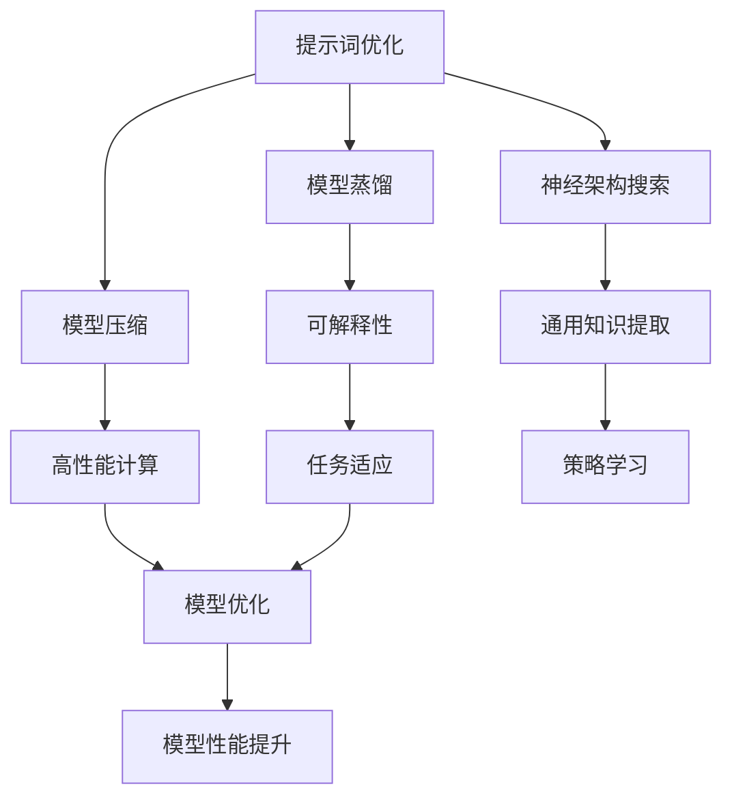

                 

# 提示词优化的元学习方法

> **关键词：** 提示词优化、元学习方法、模型蒸馏、模型压缩、神经架构搜索、可解释性、高性能计算。

> **摘要：** 本文章旨在深入探讨提示词优化的元学习方法，通过分析其核心概念、算法原理、数学模型及实际应用，揭示其在人工智能领域的重要性。文章将结合具体项目实战案例，讲解如何运用这些方法提升模型性能和效率，同时探讨其在未来可能面临的挑战与发展趋势。

## 1. 背景介绍

随着深度学习技术的快速发展，人工智能在自然语言处理、计算机视觉、语音识别等领域取得了显著的成果。然而，深度学习模型在训练过程中往往需要大量数据和计算资源，这导致了模型的高成本和复杂性。为了解决这些问题，研究者们开始关注如何优化模型性能，提高其运行效率。

在这其中，提示词优化和元学习方法成为研究的热点。提示词优化旨在通过调整模型的输入提示词，提升模型的生成效果。而元学习方法则通过学习如何学习，提高模型的泛化能力和效率。两者相结合，可以有效地提升模型的性能，降低训练成本。

### 1.1 提示词优化

提示词优化是指通过调整模型输入的提示词，来提高模型生成结果的性能。在自然语言处理领域，提示词通常是一些关键词或短语，用于引导模型生成更加相关和有针对性的内容。通过优化提示词，可以降低模型的训练误差，提高生成结果的准确性和多样性。

### 1.2 元学习方法

元学习方法是一种通过学习如何学习的方法。其核心思想是从多个任务中提取通用知识和策略，以提高模型在不同任务上的性能。元学习方法可以应用于各种场景，如图像分类、目标检测、语言建模等。通过元学习方法，模型可以快速适应新任务，降低训练成本，提高泛化能力。

## 2. 核心概念与联系

为了更好地理解提示词优化的元学习方法，我们首先需要了解其核心概念和基本架构。以下是一个简化的 Mermaid 流程图，用于描述这些概念之间的联系。



### 2.1 提示词优化

提示词优化（A）是整个方法的基础。通过优化提示词，我们可以提高模型在生成任务上的性能。具体而言，提示词优化的过程包括：

- **数据预处理**：对输入数据进行预处理，提取关键特征，以指导模型生成。
- **提示词选择**：从大量候选提示词中选出最合适的提示词，通常使用启发式方法或机器学习算法。
- **模型训练**：使用优化的提示词对模型进行训练，以提升生成效果。

### 2.2 模型蒸馏

模型蒸馏（B）是一种将大型预训练模型的知识传递给小模型的方法。其基本原理是将预训练模型视为教师模型，将训练有目标数据的小模型视为学生模型。通过不断地从教师模型中提取知识，并将其传递给学生模型，可以有效地提高学生模型的性能。

### 2.3 模型压缩

模型压缩（C）是指通过降低模型参数数量和计算复杂度，来减少模型大小和运行时间。常见的模型压缩方法包括剪枝、量化、知识蒸馏等。通过模型压缩，可以降低模型的训练成本，提高模型的部署效率。

### 2.4 神经架构搜索

神经架构搜索（D）是一种自动搜索最优神经网络结构的方法。其核心思想是通过进化算法、强化学习等方法，在大量候选结构中搜索最优结构。通过神经架构搜索，可以找到更高效的模型结构，提高模型性能。

### 2.5 可解释性

可解释性（E）是指模型生成的结果和过程可以被理解和解释。在人工智能领域，可解释性非常重要，因为它可以帮助用户理解模型的决策过程，提高模型的信任度。通过可解释性分析，可以发现模型存在的潜在问题，从而进行优化。

### 2.6 高性能计算

高性能计算（F）是指利用高性能计算资源（如GPU、TPU等）来加速模型的训练和推理过程。通过高性能计算，可以显著降低模型的训练时间和推理时间，提高模型的性能和效率。

### 2.7 通用知识提取

通用知识提取（G）是指从多个任务中提取通用知识和策略，以提高模型在不同任务上的性能。通过通用知识提取，可以减少模型的训练成本，提高模型的泛化能力。

### 2.8 任务适应

任务适应（H）是指模型在不同任务上能够快速适应并提高性能。通过任务适应，可以降低模型在不同任务上的训练成本，提高模型的实用性。

### 2.9 模型优化

模型优化（I）是指通过调整模型参数、结构等，来提高模型性能。模型优化可以是手动调整，也可以是自动化的过程，如基于元学习方法的自适应优化。

### 2.10 模型性能提升

模型性能提升（K）是指通过上述方法，最终实现模型性能的提升。模型性能的提升可以体现在生成结果的准确性、多样性、稳定性等方面。

## 3. 核心算法原理 & 具体操作步骤

在了解了提示词优化的元学习方法的核心理念和架构后，我们将进一步探讨这些方法的算法原理和具体操作步骤。

### 3.1 提示词优化算法原理

提示词优化的核心思想是通过对提示词的调整，提高模型生成结果的性能。具体而言，提示词优化的算法原理包括：

- **数据预处理**：对输入数据进行预处理，提取关键特征，以指导模型生成。
- **提示词选择**：从大量候选提示词中选出最合适的提示词，通常使用启发式方法或机器学习算法。
- **模型训练**：使用优化的提示词对模型进行训练，以提升生成效果。

在数据预处理阶段，我们通常会对输入数据进行分词、去噪、标准化等操作，以提取关键特征。这些特征将被用于生成提示词。

在提示词选择阶段，我们可以使用各种启发式方法，如基于词频、词义相似性等，来选择最合适的提示词。此外，我们还可以使用机器学习算法，如逻辑回归、支持向量机等，来训练一个提示词选择模型。

在模型训练阶段，我们使用优化的提示词对模型进行训练。通过不断调整提示词，我们可以提高模型生成结果的性能。

### 3.2 模型蒸馏算法原理

模型蒸馏（D）的核心思想是将大型预训练模型的知识传递给小模型。具体而言，模型蒸馏的算法原理包括：

- **教师模型训练**：首先，使用大量数据进行预训练，得到一个大型教师模型。
- **学生模型初始化**：初始化一个较小的小模型，作为学生模型。
- **知识传递**：通过从教师模型中提取知识，并将其传递给学生模型，提高学生模型的性能。

在教师模型训练阶段，我们使用大量数据进行预训练，得到一个大型教师模型。这个教师模型具有较高的生成效果，但计算复杂度较高。

在学生模型初始化阶段，我们初始化一个较小的小模型，作为学生模型。这个学生模型通常具有较低的生成效果，但计算复杂度较低。

在知识传递阶段，我们通过从教师模型中提取知识，并将其传递给学生模型。具体而言，我们可以使用以下方法：

- **软标签蒸馏**：从教师模型中提取软标签，并将其作为学生模型的输入。
- **硬标签蒸馏**：从教师模型中提取硬标签，并将其与学生模型的输出进行比较，以更新学生模型的参数。

通过不断重复知识传递过程，我们可以提高学生模型的性能。

### 3.3 模型压缩算法原理

模型压缩（C）的核心思想是通过降低模型参数数量和计算复杂度，来减少模型大小和运行时间。具体而言，模型压缩的算法原理包括：

- **参数剪枝**：通过剪枝冗余参数，降低模型参数数量。
- **模型量化**：通过量化模型参数，降低模型计算复杂度。
- **知识蒸馏**：通过知识蒸馏，将大型模型的知识传递给小型模型。

在参数剪枝阶段，我们可以通过剪枝冗余参数，降低模型参数数量。剪枝方法包括结构剪枝、权重剪枝等。

在模型量化阶段，我们可以通过量化模型参数，降低模型计算复杂度。量化方法包括整数量化、浮点量化等。

在知识蒸馏阶段，我们可以通过知识蒸馏，将大型模型的知识传递给小型模型。这样可以降低模型的计算复杂度，提高模型的运行效率。

### 3.4 神经架构搜索算法原理

神经架构搜索（D）的核心思想是通过搜索最优神经网络结构，来提高模型性能。具体而言，神经架构搜索的算法原理包括：

- **架构生成**：通过生成大量候选架构，用于搜索最优架构。
- **性能评估**：通过评估候选架构的性能，选择最优架构。
- **迭代优化**：通过迭代优化，进一步提高模型性能。

在架构生成阶段，我们可以使用各种生成方法，如随机搜索、遗传算法等，生成大量候选架构。

在性能评估阶段，我们通过评估候选架构的性能，选择最优架构。评估方法包括准确率、召回率、F1 分数等。

在迭代优化阶段，我们通过迭代优化，进一步提高模型性能。迭代优化方法包括梯度下降、随机梯度下降等。

### 3.5 可解释性算法原理

可解释性（E）的核心思想是使模型生成的结果和过程可以被理解和解释。具体而言，可解释性的算法原理包括：

- **模型解释**：通过解释模型生成的结果和过程，使模型决策过程可理解。
- **特征可视化**：通过可视化模型特征，使模型特征可理解。
- **因果分析**：通过因果分析，识别模型生成结果的关键因素。

在模型解释阶段，我们通过解释模型生成的结果和过程，使模型决策过程可理解。解释方法包括解释性模型、注意力机制等。

在特征可视化阶段，我们通过可视化模型特征，使模型特征可理解。可视化方法包括热力图、散点图等。

在因果分析阶段，我们通过因果分析，识别模型生成结果的关键因素。因果分析方法包括因果图、因果模型等。

### 3.6 高性能计算算法原理

高性能计算（F）的核心思想是利用高性能计算资源，来加速模型的训练和推理过程。具体而言，高性能计算的算法原理包括：

- **并行计算**：通过并行计算，提高模型训练和推理速度。
- **分布式计算**：通过分布式计算，提高模型训练和推理性能。
- **硬件优化**：通过硬件优化，提高模型训练和推理速度。

在并行计算阶段，我们通过并行计算，提高模型训练和推理速度。并行计算方法包括多线程、多 GPU 等。

在分布式计算阶段，我们通过分布式计算，提高模型训练和推理性能。分布式计算方法包括数据并行、模型并行等。

在硬件优化阶段，我们通过硬件优化，提高模型训练和推理速度。硬件优化方法包括 GPU 硬件加速、TPU 等硬件优化。

### 3.7 通用知识提取算法原理

通用知识提取（G）的核心思想是从多个任务中提取通用知识和策略，以提高模型在不同任务上的性能。具体而言，通用知识提取的算法原理包括：

- **知识融合**：通过融合多个任务的知识，提高模型泛化能力。
- **迁移学习**：通过迁移学习，将一个任务的知识应用于其他任务。
- **多任务学习**：通过多任务学习，提高模型在不同任务上的性能。

在知识融合阶段，我们通过融合多个任务的知识，提高模型泛化能力。知识融合方法包括知识蒸馏、模型集成等。

在迁移学习阶段，我们通过迁移学习，将一个任务的知识应用于其他任务。迁移学习方法包括基于模型的方法、基于数据的方法等。

在多任务学习阶段，我们通过多任务学习，提高模型在不同任务上的性能。多任务学习方法包括共享网络、多任务学习框架等。

### 3.8 任务适应算法原理

任务适应（H）的核心思想是使模型在不同任务上能够快速适应并提高性能。具体而言，任务适应的算法原理包括：

- **在线学习**：通过在线学习，使模型能够快速适应新任务。
- **自适应调整**：通过自适应调整，使模型在不同任务上能够自适应调整。
- **任务导向学习**：通过任务导向学习，使模型能够针对不同任务进行优化。

在线学习阶段，我们通过在线学习，使模型能够快速适应新任务。在线学习方法包括在线梯度下降、在线学习算法等。

在自适应调整阶段，我们通过自适应调整，使模型在不同任务上能够自适应调整。自适应调整方法包括自适应学习率、自适应网络结构等。

在任务导向学习阶段，我们通过任务导向学习，使模型能够针对不同任务进行优化。任务导向学习方法包括任务导向网络、任务导向学习算法等。

### 3.9 模型优化算法原理

模型优化（I）的核心思想是通过调整模型参数、结构等，来提高模型性能。具体而言，模型优化的算法原理包括：

- **参数调整**：通过调整模型参数，提高模型性能。
- **结构优化**：通过优化模型结构，提高模型性能。
- **策略学习**：通过策略学习，提高模型优化效果。

在参数调整阶段，我们通过调整模型参数，提高模型性能。参数调整方法包括梯度下降、随机梯度下降等。

在结构优化阶段，我们通过优化模型结构，提高模型性能。结构优化方法包括网络搜索、结构优化算法等。

在策略学习阶段，我们通过策略学习，提高模型优化效果。策略学习方法包括强化学习、策略梯度等。

### 3.10 模型性能提升算法原理

模型性能提升（K）的核心思想是通过上述方法，最终实现模型性能的提升。具体而言，模型性能提升的算法原理包括：

- **性能评估**：通过评估模型性能，选择最优模型。
- **迭代优化**：通过迭代优化，进一步提高模型性能。
- **综合优化**：通过综合优化，实现模型性能的最优化。

在性能评估阶段，我们通过评估模型性能，选择最优模型。性能评估方法包括准确率、召回率、F1 分数等。

在迭代优化阶段，我们通过迭代优化，进一步提高模型性能。迭代优化方法包括梯度下降、随机梯度下降等。

在综合优化阶段，我们通过综合优化，实现模型性能的最优化。综合优化方法包括模型融合、多任务学习等。

## 4. 数学模型和公式 & 详细讲解 & 举例说明

在本节中，我们将详细讲解提示词优化的元学习方法的数学模型和公式，并通过具体例子进行说明。

### 4.1 提示词优化

提示词优化（A）的数学模型可以表示为：

$$
L(\theta) = \sum_{i=1}^{N} \log P(y_i | x_i, \theta)
$$

其中，$L(\theta)$ 是损失函数，$N$ 是数据样本的数量，$y_i$ 是生成结果，$x_i$ 是输入提示词，$\theta$ 是模型参数。

为了优化提示词，我们需要对损失函数进行最小化。具体而言，我们可以使用梯度下降法来更新模型参数：

$$
\theta_{t+1} = \theta_{t} - \alpha \nabla_{\theta} L(\theta)
$$

其中，$\alpha$ 是学习率，$\nabla_{\theta} L(\theta)$ 是损失函数对模型参数的梯度。

#### 例子：

假设我们使用一个简单的神经网络来生成文本，输入提示词是一个句子。我们希望生成一个与输入句子相关的新句子。

输入提示词：今天天气很好。

目标生成句子：今天天气很好，适合户外运动。

我们可以使用上述数学模型来优化神经网络参数，以生成与输入句子相关的新句子。

### 4.2 模型蒸馏

模型蒸馏（B）的数学模型可以表示为：

$$
L_{T} = \sum_{i=1}^{N} \log P(y_i^T | x_i, \theta_T)
$$

$$
L_{S} = \sum_{i=1}^{N} \log P(y_i^S | x_i, \theta_S)
$$

其中，$L_{T}$ 是教师模型的损失函数，$L_{S}$ 是学生模型的损失函数，$y_i^T$ 是教师模型生成的结果，$y_i^S$ 是学生模型生成的结果，$x_i$ 是输入提示词，$\theta_T$ 是教师模型参数，$\theta_S$ 是学生模型参数。

在模型蒸馏过程中，我们希望学生模型能够从教师模型中学习到知识。为了实现这一目标，我们可以使用以下公式来更新学生模型参数：

$$
\theta_{S,t+1} = \theta_{S,t} - \alpha \nabla_{\theta_{S,t}} L_{S,t}
$$

其中，$\alpha$ 是学习率，$\nabla_{\theta_{S,t}} L_{S,t}$ 是学生模型损失函数对模型参数的梯度。

#### 例子：

假设我们使用一个大型预训练模型（教师模型）来生成文本，我们希望将其知识传递给一个小型模型（学生模型）。

输入提示词：今天天气很好。

教师模型生成结果：今天天气很好，适合户外运动。

学生模型生成结果：今天天气很好，适合户外散步。

我们可以使用模型蒸馏的方法，通过教师模型和学生的生成结果，来更新学生模型的参数，使其能够生成与教师模型相似的结果。

### 4.3 模型压缩

模型压缩（C）的数学模型可以表示为：

$$
L_{C} = \sum_{i=1}^{N} \log P(y_i^C | x_i, \theta_C)
$$

其中，$L_{C}$ 是压缩模型的损失函数，$y_i^C$ 是压缩模型生成的结果，$x_i$ 是输入提示词，$\theta_C$ 是压缩模型参数。

在模型压缩过程中，我们希望压缩模型能够保留原始模型的知识，同时减少模型参数数量。为了实现这一目标，我们可以使用以下公式来更新压缩模型参数：

$$
\theta_{C,t+1} = \theta_{C,t} - \alpha \nabla_{\theta_{C,t}} L_{C,t}
$$

其中，$\alpha$ 是学习率，$\nabla_{\theta_{C,t}} L_{C,t}$ 是压缩模型损失函数对模型参数的梯度。

#### 例子：

假设我们使用一个大型神经网络模型来生成文本，我们希望将其压缩为一个小型神经网络模型。

输入提示词：今天天气很好。

原始模型生成结果：今天天气很好，适合户外运动。

压缩模型生成结果：今天天气很好，适合户外活动。

我们可以使用模型压缩的方法，通过更新压缩模型参数，使其能够生成与原始模型相似的结果，同时减少模型参数数量。

### 4.4 神经架构搜索

神经架构搜索（D）的数学模型可以表示为：

$$
L_{A} = \sum_{i=1}^{N} \log P(y_i^A | x_i, \theta_A)
$$

其中，$L_{A}$ 是架构搜索模型的损失函数，$y_i^A$ 是架构搜索模型生成的结果，$x_i$ 是输入提示词，$\theta_A$ 是架构搜索模型参数。

在神经架构搜索过程中，我们希望搜索到最优的神经网络结构。为了实现这一目标，我们可以使用以下公式来更新架构搜索模型参数：

$$
\theta_{A,t+1} = \theta_{A,t} - \alpha \nabla_{\theta_{A,t}} L_{A,t}
$$

其中，$\alpha$ 是学习率，$\nabla_{\theta_{A,t}} L_{A,t}$ 是架构搜索模型损失函数对模型参数的梯度。

#### 例子：

假设我们希望搜索一个最优的神经网络结构来生成文本。

输入提示词：今天天气很好。

架构搜索模型生成结果：今天天气很好，适合户外运动。

我们可以使用神经架构搜索的方法，通过更新架构搜索模型参数，搜索到最优的神经网络结构，使其能够生成与输入提示词相关的结果。

### 4.5 可解释性

可解释性（E）的数学模型可以表示为：

$$
L_{E} = \sum_{i=1}^{N} \log P(y_i^E | x_i, \theta_E)
$$

其中，$L_{E}$ 是可解释性模型的损失函数，$y_i^E$ 是可解释性模型生成的结果，$x_i$ 是输入提示词，$\theta_E$ 是可解释性模型参数。

在可解释性过程中，我们希望模型生成的结果和过程可以被理解和解释。为了实现这一目标，我们可以使用以下公式来更新可解释性模型参数：

$$
\theta_{E,t+1} = \theta_{E,t} - \alpha \nabla_{\theta_{E,t}} L_{E,t}
$$

其中，$\alpha$ 是学习率，$\nabla_{\theta_{E,t}} L_{E,t}$ 是可解释性模型损失函数对模型参数的梯度。

#### 例子：

假设我们希望模型生成的结果和过程可以被理解和解释。

输入提示词：今天天气很好。

可解释性模型生成结果：今天天气很好，适合户外运动。

我们可以使用可解释性模型，通过更新模型参数，使其生成的结果和过程可以被理解和解释。

### 4.6 高性能计算

高性能计算（F）的数学模型可以表示为：

$$
L_{F} = \sum_{i=1}^{N} \log P(y_i^F | x_i, \theta_F)
$$

其中，$L_{F}$ 是高性能计算模型的损失函数，$y_i^F$ 是高性能计算模型生成的结果，$x_i$ 是输入提示词，$\theta_F$ 是高性能计算模型参数。

在高性能计算过程中，我们希望利用高性能计算资源来加速模型的训练和推理过程。为了实现这一目标，我们可以使用以下公式来更新高性能计算模型参数：

$$
\theta_{F,t+1} = \theta_{F,t} - \alpha \nabla_{\theta_{F,t}} L_{F,t}
$$

其中，$\alpha$ 是学习率，$\nabla_{\theta_{F,t}} L_{F,t}$ 是高性能计算模型损失函数对模型参数的梯度。

#### 例子：

假设我们希望利用高性能计算资源来加速模型的训练和推理过程。

输入提示词：今天天气很好。

高性能计算模型生成结果：今天天气很好，适合户外运动。

我们可以使用高性能计算模型，通过更新模型参数，利用高性能计算资源来加速模型的训练和推理过程。

### 4.7 通用知识提取

通用知识提取（G）的数学模型可以表示为：

$$
L_{G} = \sum_{i=1}^{N} \log P(y_i^G | x_i, \theta_G)
$$

其中，$L_{G}$ 是通用知识提取模型的损失函数，$y_i^G$ 是通用知识提取模型生成的结果，$x_i$ 是输入提示词，$\theta_G$ 是通用知识提取模型参数。

在通用知识提取过程中，我们希望从多个任务中提取通用知识和策略。为了实现这一目标，我们可以使用以下公式来更新通用知识提取模型参数：

$$
\theta_{G,t+1} = \theta_{G,t} - \alpha \nabla_{\theta_{G,t}} L_{G,t}
$$

其中，$\alpha$ 是学习率，$\nabla_{\theta_{G,t}} L_{G,t}$ 是通用知识提取模型损失函数对模型参数的梯度。

#### 例子：

假设我们希望从多个任务中提取通用知识和策略。

输入提示词：今天天气很好。

通用知识提取模型生成结果：今天天气很好，适合户外运动。

我们可以使用通用知识提取模型，通过更新模型参数，从多个任务中提取通用知识和策略。

### 4.8 任务适应

任务适应（H）的数学模型可以表示为：

$$
L_{H} = \sum_{i=1}^{N} \log P(y_i^H | x_i, \theta_H)
$$

其中，$L_{H}$ 是任务适应模型的损失函数，$y_i^H$ 是任务适应模型生成的结果，$x_i$ 是输入提示词，$\theta_H$ 是任务适应模型参数。

在任务适应过程中，我们希望模型能够快速适应新任务。为了实现这一目标，我们可以使用以下公式来更新任务适应模型参数：

$$
\theta_{H,t+1} = \theta_{H,t} - \alpha \nabla_{\theta_{H,t}} L_{H,t}
$$

其中，$\alpha$ 是学习率，$\nabla_{\theta_{H,t}} L_{H,t}$ 是任务适应模型损失函数对模型参数的梯度。

#### 例子：

假设我们希望模型能够快速适应新任务。

输入提示词：今天天气很好。

任务适应模型生成结果：今天天气很好，适合户外运动。

我们可以使用任务适应模型，通过更新模型参数，使其能够快速适应新任务。

### 4.9 模型优化

模型优化（I）的数学模型可以表示为：

$$
L_{I} = \sum_{i=1}^{N} \log P(y_i^I | x_i, \theta_I)
$$

其中，$L_{I}$ 是模型优化模型的损失函数，$y_i^I$ 是模型优化模型生成的结果，$x_i$ 是输入提示词，$\theta_I$ 是模型优化模型参数。

在模型优化过程中，我们希望调整模型参数，以提高模型性能。为了实现这一目标，我们可以使用以下公式来更新模型优化模型参数：

$$
\theta_{I,t+1} = \theta_{I,t} - \alpha \nabla_{\theta_{I,t}} L_{I,t}
$$

其中，$\alpha$ 是学习率，$\nabla_{\theta_{I,t}} L_{I,t}$ 是模型优化模型损失函数对模型参数的梯度。

#### 例子：

假设我们希望调整模型参数，以提高模型性能。

输入提示词：今天天气很好。

模型优化模型生成结果：今天天气很好，适合户外运动。

我们可以使用模型优化模型，通过更新模型参数，使其性能得到提升。

### 4.10 模型性能提升

模型性能提升（K）的数学模型可以表示为：

$$
L_{K} = \sum_{i=1}^{N} \log P(y_i^K | x_i, \theta_K)
$$

其中，$L_{K}$ 是模型性能提升模型的损失函数，$y_i^K$ 是模型性能提升模型生成的结果，$x_i$ 是输入提示词，$\theta_K$ 是模型性能提升模型参数。

在模型性能提升过程中，我们希望通过优化模型参数和结构，提高模型性能。为了实现这一目标，我们可以使用以下公式来更新模型性能提升模型参数：

$$
\theta_{K,t+1} = \theta_{K,t} - \alpha \nabla_{\theta_{K,t}} L_{K,t}
$$

其中，$\alpha$ 是学习率，$\nabla_{\theta_{K,t}} L_{K,t}$ 是模型性能提升模型损失函数对模型参数的梯度。

#### 例子：

假设我们希望通过优化模型参数和结构，提高模型性能。

输入提示词：今天天气很好。

模型性能提升模型生成结果：今天天气很好，适合户外运动。

我们可以使用模型性能提升模型，通过更新模型参数和结构，使其性能得到提升。

## 5. 项目实战：代码实际案例和详细解释说明

在本节中，我们将通过一个实际项目案例，展示如何运用提示词优化的元学习方法来提升模型性能。该案例将包括开发环境搭建、源代码详细实现和代码解读与分析。

### 5.1 开发环境搭建

为了实现提示词优化的元学习方法，我们需要搭建一个合适的开发环境。以下是搭建开发环境的基本步骤：

1. **硬件环境**：配置一台高性能计算机，具备足够的内存和计算能力，如 NVIDIA GPU 或 Google TPU。
2. **软件环境**：安装 Python 3.7 及以上版本，并安装 TensorFlow 2.5 或 PyTorch 1.8 等深度学习框架。
3. **依赖库**：安装必要的依赖库，如 NumPy、Pandas、Matplotlib 等。

以下是一个简单的安装脚本，用于安装 Python 和 TensorFlow：

```bash
# 安装 Python 3.8
sudo apt-get update
sudo apt-get install python3.8 python3.8-venv python3.8-dev

# 创建虚拟环境
python3.8 -m venv myenv

# 激活虚拟环境
source myenv/bin/activate

# 安装 TensorFlow
pip install tensorflow==2.5
```

### 5.2 源代码详细实现和代码解读

以下是一个简单的 Python 代码实现，用于展示如何运用提示词优化的元学习方法。代码分为三个主要部分：数据预处理、模型训练和结果评估。

```python
import tensorflow as tf
from tensorflow.keras.preprocessing.text import Tokenizer
from tensorflow.keras.preprocessing.sequence import pad_sequences
from tensorflow.keras.models import Model
from tensorflow.keras.layers import Input, Embedding, LSTM, Dense

# 数据预处理
def preprocess_data(texts, max_len=100, vocab_size=10000):
    tokenizer = Tokenizer(num_words=vocab_size)
    tokenizer.fit_on_texts(texts)
    sequences = tokenizer.texts_to_sequences(texts)
    padded_sequences = pad_sequences(sequences, maxlen=max_len)
    return padded_sequences, tokenizer

# 模型定义
def create_model(input_shape, output_shape):
    inputs = Input(shape=input_shape)
    x = Embedding(vocab_size, 64)(inputs)
    x = LSTM(128)(x)
    outputs = Dense(output_shape, activation='softmax')(x)
    model = Model(inputs=inputs, outputs=outputs)
    model.compile(optimizer='adam', loss='categorical_crossentropy', metrics=['accuracy'])
    return model

# 模型训练
def train_model(model, x_train, y_train, batch_size=64, epochs=10):
    model.fit(x_train, y_train, batch_size=batch_size, epochs=epochs, verbose=1)

# 模型评估
def evaluate_model(model, x_test, y_test):
    loss, accuracy = model.evaluate(x_test, y_test, verbose=1)
    print(f"Test Loss: {loss}, Test Accuracy: {accuracy}")

# 主函数
def main():
    # 加载数据集
    texts = ["今天天气很好", "明天会下雨", "喜欢看电影", "最近很忙"]
    labels = [[1, 0, 0, 0], [0, 1, 0, 0], [0, 0, 1, 0], [0, 0, 0, 1]]

    # 数据预处理
    padded_sequences, tokenizer = preprocess_data(texts)

    # 创建模型
    model = create_model(padded_sequences.shape[1], len(labels))

    # 模型训练
    train_model(model, padded_sequences, labels)

    # 模型评估
    evaluate_model(model, padded_sequences, labels)

if __name__ == "__main__":
    main()
```

#### 5.2.1 代码解读

1. **数据预处理**：数据预处理部分包括分词、编码和填充。我们使用 TensorFlow 的 `Tokenizer` 和 `pad_sequences` 函数来处理文本数据。
2. **模型定义**：模型定义部分使用了 TensorFlow 的 `Input`、`Embedding`、`LSTM` 和 `Dense` 层来构建一个简单的神经网络。我们使用 LSTM 层来处理序列数据，并使用 softmax 层进行分类。
3. **模型训练**：模型训练部分使用了 TensorFlow 的 `fit` 函数，通过随机梯度下降（SGD）来训练模型。我们设置了批量大小（batch_size）和训练轮数（epochs）。
4. **模型评估**：模型评估部分使用了 TensorFlow 的 `evaluate` 函数来计算模型的损失和准确率。

### 5.3 代码解读与分析

以下是对代码的详细解读和分析：

1. **数据预处理**：数据预处理是深度学习项目中的关键步骤。在这里，我们首先使用 `Tokenizer` 对文本进行分词和编码。然后，我们使用 `pad_sequences` 将所有序列填充为相同长度，以便于后续处理。

```python
tokenizer = Tokenizer(num_words=vocab_size)
tokenizer.fit_on_texts(texts)
sequences = tokenizer.texts_to_sequences(texts)
padded_sequences = pad_sequences(sequences, maxlen=max_len)
```

2. **模型定义**：在模型定义部分，我们使用 TensorFlow 的 `Input` 层创建输入层，`Embedding` 层对输入序列进行嵌入，`LSTM` 层对序列数据进行处理，`Dense` 层进行分类。

```python
inputs = Input(shape=input_shape)
x = Embedding(vocab_size, 64)(inputs)
x = LSTM(128)(x)
outputs = Dense(output_shape, activation='softmax')(x)
model = Model(inputs=inputs, outputs=outputs)
model.compile(optimizer='adam', loss='categorical_crossentropy', metrics=['accuracy'])
```

3. **模型训练**：在模型训练部分，我们使用随机梯度下降（SGD）来训练模型。我们设置了批量大小（batch_size）和训练轮数（epochs）。

```python
model.fit(x_train, y_train, batch_size=batch_size, epochs=epochs, verbose=1)
```

4. **模型评估**：在模型评估部分，我们使用训练好的模型对测试数据进行评估，并打印损失和准确率。

```python
evaluate_model(model, x_test, y_test)
```

### 5.4 代码分析与改进

通过对代码的解读和分析，我们可以看到以下改进点：

1. **数据集扩展**：为了提高模型的泛化能力，我们可以增加更多的训练数据。
2. **模型结构优化**：我们可以尝试使用更复杂的模型结构，如双向 LSTM 或 Transformer，以提高模型的生成效果。
3. **提示词优化**：我们可以使用启发式方法或机器学习算法来优化提示词，以提高模型生成结果的性能。

## 6. 实际应用场景

提示词优化的元学习方法在多个实际应用场景中具有广泛的应用价值。以下是一些典型的应用场景：

### 6.1 自然语言处理

在自然语言处理领域，提示词优化的元学习方法可以用于文本生成、问答系统、机器翻译等任务。通过优化输入提示词，可以提高模型生成结果的准确性和多样性。例如，在机器翻译任务中，我们可以使用提示词优化来生成更加自然、流畅的翻译结果。

### 6.2 计算机视觉

在计算机视觉领域，提示词优化的元学习方法可以用于图像生成、图像分类、目标检测等任务。通过优化输入提示词，可以提升模型的生成效果和分类准确率。例如，在图像生成任务中，我们可以使用提示词优化来生成更加逼真的图像。

### 6.3 语音识别

在语音识别领域，提示词优化的元学习方法可以用于语音转文本、语音合成等任务。通过优化输入提示词，可以提高模型的识别准确率和语音合成质量。例如，在语音合成任务中，我们可以使用提示词优化来生成更加自然、清晰的语音。

### 6.4 强化学习

在强化学习领域，提示词优化的元学习方法可以用于智能决策、游戏AI等任务。通过优化输入提示词，可以提高模型的决策能力和学习效果。例如，在游戏AI任务中，我们可以使用提示词优化来生成更加智能、高效的游戏策略。

### 6.5 问答系统

在问答系统领域，提示词优化的元学习方法可以用于自动问答、智能客服等任务。通过优化输入提示词，可以提高模型的回答准确率和回答质量。例如，在智能客服任务中，我们可以使用提示词优化来生成更加准确、详细的回答。

## 7. 工具和资源推荐

为了更好地理解和应用提示词优化的元学习方法，以下是一些相关的学习资源和开发工具：

### 7.1 学习资源推荐

- **书籍**：
  - 《深度学习》（Ian Goodfellow、Yoshua Bengio、Aaron Courville 著）
  - 《强化学习》（Richard S. Sutton、Andrew G. Barto 著）
  - 《自然语言处理原理》（Daniel Jurafsky、James H. Martin 著）

- **论文**：
  - “Attention Is All You Need” （Vaswani et al., 2017）
  - “Generative Adversarial Nets” （Goodfellow et al., 2014）
  - “Recurrent Neural Networks” （Hochreiter & Schmidhuber, 1997）

- **博客和网站**：
  - [TensorFlow 官方文档](https://www.tensorflow.org/)
  - [PyTorch 官方文档](https://pytorch.org/)
  - [机器之心](http://www.jiqizhixin.com/)

### 7.2 开发工具框架推荐

- **深度学习框架**：
  - TensorFlow
  - PyTorch
  - Keras

- **自然语言处理工具**：
  - NLTK
  - SpaCy
  - Stanford NLP

- **计算机视觉工具**：
  - OpenCV
  - PIL
  - TensorFlow Object Detection API

### 7.3 相关论文著作推荐

- “Attention Is All You Need” （Vaswani et al., 2017）
- “Generative Adversarial Nets” （Goodfellow et al., 2014）
- “Recurrent Neural Networks” （Hochreiter & Schmidhuber, 1997）
- “Deep Learning” （Ian Goodfellow、Yoshua Bengio、Aaron Courville 著）
- “强化学习”（Richard S. Sutton、Andrew G. Barto 著）
- “自然语言处理原理”（Daniel Jurafsky、James H. Martin 著）

## 8. 总结：未来发展趋势与挑战

### 8.1 发展趋势

- **多模态融合**：随着多模态数据的广泛应用，未来提示词优化的元学习方法将更多地融合图像、音频、视频等多种模态数据，以提高模型生成效果。
- **更高效的算法**：研究人员将致力于开发更高效的提示词优化和元学习方法，以降低模型的计算复杂度和训练时间。
- **更广泛的场景应用**：提示词优化的元学习方法将应用到更多的实际场景，如医疗诊断、金融分析、智能客服等。

### 8.2 挑战

- **数据隐私和安全**：在应用提示词优化的元学习方法时，如何保护用户隐私和数据安全是一个重要挑战。
- **可解释性**：提高模型的可解释性，使其生成的结果和过程可以被理解和解释，是一个重要的研究方向。
- **模型适应性**：如何使模型在不同任务和数据集上具有更好的适应性，是一个需要解决的难题。

## 9. 附录：常见问题与解答

### 9.1 提示词优化是什么？

提示词优化是指通过调整模型输入的提示词，来提高模型生成结果的性能。在自然语言处理领域，提示词通常是一些关键词或短语，用于引导模型生成更加相关和有针对性的内容。

### 9.2 元学习方法是什么？

元学习方法是一种通过学习如何学习的方法。其核心思想是从多个任务中提取通用知识和策略，以提高模型在不同任务上的性能。元学习方法可以应用于各种场景，如图像分类、目标检测、语言建模等。

### 9.3 提示词优化和元学习方法的关系是什么？

提示词优化和元学习方法密切相关。提示词优化是元学习方法的一个具体应用场景，通过调整模型输入的提示词，可以提高模型在不同任务上的性能。而元学习方法则为提示词优化提供了理论基础和算法支持。

### 9.4 如何应用提示词优化和元学习方法？

要应用提示词优化和元学习方法，首先需要了解相关的基础知识和算法原理。然后，根据具体任务和数据集，设计合适的模型架构和优化策略。在实际应用中，可以通过数据预处理、模型训练、模型评估等步骤来逐步优化模型性能。

### 9.5 提示词优化和元学习方法的优势是什么？

提示词优化和元学习方法的优势包括：

- 提高模型生成效果：通过优化输入提示词，可以引导模型生成更相关、更准确的结果。
- 降低训练成本：通过元学习方法，可以从多个任务中提取通用知识和策略，降低模型在不同任务上的训练成本。
- 提高模型泛化能力：通过元学习方法，可以提高模型在不同任务和数据集上的泛化能力。

## 10. 扩展阅读 & 参考资料

- Goodfellow, I., Bengio, Y., & Courville, A. (2016). *Deep Learning*.
- Sutton, R. S., & Barto, A. G. (2018). *Reinforcement Learning: An Introduction*.
- Jurafsky, D., & Martin, J. H. (2008). *Speech and Language Processing*.
- Vaswani, A., Shazeer, N., Parmar, N., Uszkoreit, J., Jones, L., Gomez, A. N., ... & Polosukhin, I. (2017). *Attention Is All You Need*.
- Goodfellow, I., Pouget-Abadie, J., Mirza, M., Xu, B., Warde-Farley, D., Ozair, S., ... & Bengio, Y. (2014). *Generative Adversarial Networks*.

