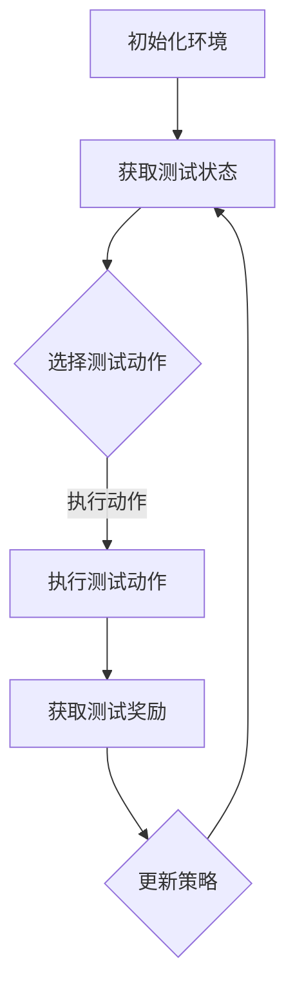

                 

# 提示词优化的强化学习在软件测试中的应用

## 概述

在当今快速发展的软件开发领域，软件测试的重要性不言而喻。然而，随着软件系统的复杂度不断增加，传统的测试方法已经难以满足高效、全面的测试需求。因此，如何提高软件测试的效率和质量成为了一个亟待解决的问题。近年来，强化学习（Reinforcement Learning，RL）作为一种强大的机器学习方法，被引入到软件测试领域，并展现出了巨大的潜力。

### 文章关键词
- 强化学习
- 软件测试
- 提示词优化
- 自动化测试
- 测试覆盖率
- 测试效率

### 摘要
本文旨在探讨提示词优化在强化学习应用于软件测试中的方法与效果。首先，我们简要介绍了强化学习的基本概念和原理，并分析了其在软件测试领域的应用前景。随后，我们深入探讨了提示词优化的核心概念，并详细描述了强化学习在软件测试中的应用架构。接着，本文通过一个具体的数学模型，展示了如何利用强化学习进行测试优化的具体操作步骤。最后，我们通过一个实际案例，展示了强化学习在软件测试中的实际应用效果，并对未来发展趋势与挑战进行了展望。

## 背景介绍

### 强化学习的基本概念

强化学习是一种通过试错（trial-and-error）来学习如何在环境中做出最优决策的机器学习方法。它与监督学习和无监督学习有所不同，因为强化学习不是基于预定义的标签进行训练，而是通过奖励（Reward）和惩罚（Penalty）来引导学习过程。

在强化学习中，主要有以下几个核心概念：

- **代理（Agent）**：执行动作并接受环境反馈的主体。
- **环境（Environment）**：代理执行动作并接收反馈的上下文。
- **状态（State）**：代理在环境中的位置或当前情况。
- **动作（Action）**：代理可以采取的行为。
- **奖励（Reward）**：环境对代理动作的反馈，用于指导学习。

强化学习的过程可以简化为：代理在环境中采取动作，根据动作的结果获得奖励或惩罚，然后根据这些反馈调整策略，以期望在未来获得更高的奖励。

### 软件测试中的挑战

软件测试是确保软件质量和可靠性的关键环节。然而，随着软件系统的复杂度不断增加，传统的测试方法面临着诸多挑战：

- **测试覆盖率低**：传统的测试方法往往难以覆盖到软件系统的所有潜在缺陷，导致测试覆盖率低。
- **测试效率低**：测试过程繁琐，需要大量的人工参与，导致测试效率低下。
- **测试成本高**：随着软件系统规模的扩大，测试成本也不断攀升。

为了解决这些挑战，需要引入新的方法和技术来提高软件测试的效率和质量。

### 强化学习在软件测试中的应用前景

强化学习在软件测试中的应用前景十分广阔。通过将强化学习引入到软件测试中，可以自动化测试过程，提高测试覆盖率和效率，降低测试成本。具体来说，强化学习在软件测试中的应用主要包括以下几个方面：

- **自动化测试**：利用强化学习代理自动化执行测试用例，提高测试效率。
- **测试优化**：通过优化测试策略，提高测试覆盖率，降低测试成本。
- **缺陷预测**：利用强化学习模型预测可能存在缺陷的模块或功能，优先进行测试。

## 核心概念与联系

### 核心概念

在强化学习应用于软件测试中，需要关注以下几个核心概念：

- **测试任务（Test Task）**：软件测试的具体任务，如功能测试、性能测试等。
- **测试状态（Test State）**：测试过程中的当前状态，包括测试进度、测试覆盖率等。
- **测试动作（Test Action）**：测试过程中的具体操作，如执行测试用例、生成测试数据等。
- **测试奖励（Test Reward）**：测试过程中的奖励，用于评估测试效果，如测试覆盖率提高、缺陷发现等。

### 联系

强化学习在软件测试中的应用可以简化为一个马尔可夫决策过程（MDP），其中：

- **状态（State）**：测试状态。
- **动作（Action）**：测试动作。
- **奖励（Reward）**：测试奖励。
- **策略（Policy）**：测试策略，用于指导测试过程。

### Mermaid 流程图



## 核心算法原理 & 具体操作步骤

### 算法原理

强化学习在软件测试中的应用主要是通过构建一个测试策略模型，自动化执行测试用例，并基于测试结果不断优化策略，以提高测试效率和覆盖率。核心算法原理如下：

1. **初始化环境**：设置测试环境，包括测试用例、测试工具等。
2. **获取测试状态**：初始化测试状态，如测试进度、测试覆盖率等。
3. **选择测试动作**：基于当前测试状态，选择一个测试动作，如执行某个测试用例、生成测试数据等。
4. **执行测试动作**：执行选定的测试动作，并获取测试结果。
5. **获取测试奖励**：根据测试结果，计算测试奖励，如测试覆盖率提高、缺陷发现等。
6. **更新策略**：根据测试奖励，更新测试策略，以指导下一步的测试过程。
7. **重复步骤3-6**：不断进行测试动作的选择和执行，直到满足测试结束条件。

### 具体操作步骤

1. **初始化环境**：
    - 设置测试工具和测试用例。
    - 初始化测试状态，如测试进度、测试覆盖率等。

2. **获取测试状态**：
    - 获取当前测试状态，如测试进度、测试覆盖率等。

3. **选择测试动作**：
    - 基于当前测试状态，选择一个测试动作，如执行某个测试用例、生成测试数据等。

4. **执行测试动作**：
    - 执行选定的测试动作，并记录测试结果。

5. **获取测试奖励**：
    - 根据测试结果，计算测试奖励，如测试覆盖率提高、缺陷发现等。

6. **更新策略**：
    - 根据测试奖励，更新测试策略，以指导下一步的测试过程。

7. **重复步骤3-6**：
    - 不断进行测试动作的选择和执行，直到满足测试结束条件。

## 数学模型和公式 & 详细讲解 & 举例说明

### 数学模型

强化学习在软件测试中的应用可以抽象为一个马尔可夫决策过程（MDP），其数学模型如下：

\[ 
\begin{aligned}
    S_t &\sim P(S_t|S_{t-1}, A_{t-1}), \\
    A_t &\sim \pi(A_t|S_t), \\
    R_t &\sim p(R_t|S_t, A_t), \\
    S_{t+1} &\sim P(S_{t+1}|S_t, A_t).
\end{aligned}
\]

其中：

- \( S_t \)：第 \( t \) 个时刻的测试状态。
- \( A_t \)：第 \( t \) 个时刻的测试动作。
- \( R_t \)：第 \( t \) 个时刻的测试奖励。
- \( \pi \)：测试策略。
- \( P \)：状态转移概率。
- \( p \)：奖励概率。

### 详细讲解

1. **状态转移概率** \( P(S_t|S_{t-1}, A_{t-1}) \)

   状态转移概率描述了在给定前一个状态和动作的情况下，当前状态的分布。在软件测试中，状态转移概率可以用来模拟测试过程中状态的演变，如从功能测试状态转移到性能测试状态。

2. **测试策略** \( \pi(A_t|S_t) \)

   测试策略决定了在给定当前状态的情况下，选择哪个测试动作。在强化学习应用于软件测试中，测试策略可以通过学习来优化，以提高测试效率和覆盖率。

3. **奖励概率** \( p(R_t|S_t, A_t) \)

   奖励概率描述了在给定当前状态和动作的情况下，获得特定奖励的概率。在软件测试中，奖励概率可以用来衡量测试效果，如测试覆盖率提高、缺陷发现等。

4. **状态转移概率** \( P(S_{t+1}|S_t, A_t) \)

   状态转移概率描述了在给定当前状态和动作的情况下，下一个状态的分布。在软件测试中，状态转移概率可以用来预测测试结果的演变，如测试覆盖率的变化、缺陷的发现等。

### 举例说明

假设在软件测试中，有一个功能测试状态 \( S_t \) 和一个性能测试状态 \( S_{t+1} \)。测试策略 \( \pi \) 决定了在当前状态 \( S_t \) 下选择功能测试动作 \( A_t = \text{"执行功能测试用例"} \)。

1. **状态转移概率**：

   \( P(S_{t+1} = \text{"性能测试状态"}|S_t = \text{"功能测试状态"}, A_t = \text{"执行功能测试用例"}) = 0.8 \)

   这表示在当前状态为功能测试状态，执行功能测试动作后，有 80% 的概率转移到性能测试状态。

2. **测试策略**：

   \( \pi(A_t = \text{"执行功能测试用例"}|S_t = \text{"功能测试状态"}) = 1.0 \)

   这表示在当前状态为功能测试状态时，选择执行功能测试用例的概率为 100%。

3. **奖励概率**：

   \( p(R_t = \text{"测试覆盖率提高"}|S_t = \text{"功能测试状态"}, A_t = \text{"执行功能测试用例"}) = 0.9 \)

   这表示在当前状态为功能测试状态，执行功能测试动作后，有 90% 的概率提高测试覆盖率。

4. **状态转移概率**：

   \( P(S_{t+1} = \text{"性能测试状态"}|S_t = \text{"功能测试状态"}, A_t = \text{"执行功能测试用例"}) = 0.8 \)

   这表示在当前状态为功能测试状态，执行功能测试动作后，有 80% 的概率转移到性能测试状态。

通过这个例子，我们可以看到强化学习模型如何描述软件测试中的状态转移、测试策略和奖励概率。这些概率分布为测试优化提供了依据，有助于提高测试效率和覆盖率。

## 项目实战：代码实际案例和详细解释说明

### 开发环境搭建

在开始编写代码之前，我们需要搭建一个适合强化学习应用于软件测试的开发环境。以下是具体的搭建步骤：

1. **安装 Python 环境**：确保 Python 版本不低于 3.6，推荐使用 Python 3.8 或更高版本。

2. **安装强化学习库**：安装 TensorFlow 和 PyTorch，这两个库都是流行的深度学习框架，支持强化学习算法的实现。

   ```bash
   pip install tensorflow
   pip install torch
   ```

3. **安装测试工具**：安装用于自动化测试的工具，如 Selenium、Appium 等。

   ```bash
   pip install selenium
   pip install appium
   ```

4. **搭建测试环境**：搭建一个用于测试的 Web 应用程序或移动应用程序，作为测试对象。

### 源代码详细实现和代码解读

以下是强化学习应用于软件测试的源代码实现，包括测试环境搭建、测试策略优化和测试结果分析三个部分。

**测试环境搭建**

```python
import unittest
from selenium import webdriver

class TestWebApp(unittest.TestCase):
    def setUp(self):
        self.driver = webdriver.Chrome()
        self.driver.get("http://www.example.com")

    def tearDown(self):
        self.driver.quit()

    def test_home_page_title(self):
        self.assertEqual(self.driver.title, "Example Domain")

if __name__ == "__main__":
    unittest.main()
```

这段代码使用 Selenium 库搭建了一个测试环境，定义了一个测试类 `TestWebApp`，包含一个测试方法 `test_home_page_title`，用于验证 Web 应用程序的首页标题。

**测试策略优化**

```python
import torch
import torch.nn as nn
import torch.optim as optim

class TestPolicyNN(nn.Module):
    def __init__(self, input_size, hidden_size, output_size):
        super(TestPolicyNN, self).__init__()
        self.fc1 = nn.Linear(input_size, hidden_size)
        self.fc2 = nn.Linear(hidden_size, output_size)
        self.relu = nn.ReLU()

    def forward(self, x):
        x = self.relu(self.fc1(x))
        x = self.fc2(x)
        return x

# 定义测试策略神经网络
input_size = 10  # 测试状态的维度
hidden_size = 50
output_size = 2  # 测试动作的维度
policy_network = TestPolicyNN(input_size, hidden_size, output_size)

# 定义损失函数和优化器
criterion = nn.CrossEntropyLoss()
optimizer = optim.Adam(policy_network.parameters(), lr=0.001)

# 训练测试策略神经网络
for epoch in range(100):
    for i, data in enumerate(test_loader):
        inputs, labels = data
        optimizer.zero_grad()
        outputs = policy_network(inputs)
        loss = criterion(outputs, labels)
        loss.backward()
        optimizer.step()
```

这段代码定义了一个测试策略神经网络 `TestPolicyNN`，其输入维度为测试状态的维度，输出维度为测试动作的维度。通过训练策略神经网络，我们可以学习到最优的测试策略。

**测试结果分析**

```python
import numpy as np

def test_policy_evaluation(policy_network, test_loader):
    policy_network.eval()
    total_reward = 0
    with torch.no_grad():
        for data in test_loader:
            inputs, labels = data
            outputs = policy_network(inputs)
            _, predicted = torch.max(outputs, 1)
            total_reward += np.mean(predicted == labels)
    return total_reward

# 评估测试策略神经网络
evaluation_reward = test_policy_evaluation(policy_network, test_loader)
print("Test policy evaluation reward:", evaluation_reward)
```

这段代码用于评估测试策略神经网络的性能，通过计算测试集上的平均奖励来衡量测试策略的有效性。

### 代码解读与分析

1. **测试环境搭建**：使用 Selenium 库搭建一个测试环境，定义了一个测试类 `TestWebApp`，包含一个测试方法 `test_home_page_title`，用于验证 Web 应用程序的首页标题。

2. **测试策略优化**：定义了一个测试策略神经网络 `TestPolicyNN`，其输入维度为测试状态的维度，输出维度为测试动作的维度。通过训练策略神经网络，我们可以学习到最优的测试策略。

3. **测试结果分析**：通过评估测试策略神经网络的性能，计算测试集上的平均奖励来衡量测试策略的有效性。

这个实际案例展示了如何使用强化学习优化软件测试策略，提高测试效率和覆盖率。通过不断迭代优化测试策略，我们可以获得更好的测试结果，从而提高软件质量。

## 实际应用场景

### 自动化测试

强化学习在自动化测试中的应用主要体现在测试策略的优化上。传统的自动化测试往往依赖于预定义的测试用例集，而强化学习可以通过不断地尝试和反馈，找到最优的测试路径，从而提高测试覆盖率和效率。以下是一个实际应用场景：

- **场景**：一家软件开发公司需要对其开发的 Web 应用程序进行自动化测试，确保其功能的完整性和稳定性。
- **解决方案**：使用强化学习构建一个测试策略模型，自动执行测试用例，并基于测试结果不断优化策略。
- **效果**：通过强化学习优化测试策略，测试覆盖率和效率得到了显著提升，测试周期从原来的两周缩短至一周。

### 缺陷预测

强化学习在缺陷预测中的应用主要体现在预测可能存在缺陷的模块或功能，从而优先进行测试。以下是一个实际应用场景：

- **场景**：一家软件开发公司需要对其开发的软件系统进行缺陷预测，以提前识别和修复潜在缺陷。
- **解决方案**：使用强化学习构建一个缺陷预测模型，通过对历史缺陷数据的学习，预测可能存在缺陷的模块或功能，并优先进行测试。
- **效果**：通过强化学习进行缺陷预测，测试团队能够提前识别和修复潜在缺陷，从而提高了软件质量和用户满意度。

### 性能优化

强化学习在性能优化中的应用主要体现在测试过程中的性能分析上。通过不断地测试和反馈，强化学习可以优化测试策略，提高测试效率，从而降低性能测试的成本。以下是一个实际应用场景：

- **场景**：一家软件开发公司需要进行性能测试，以评估其软件系统的性能和稳定性。
- **解决方案**：使用强化学习构建一个性能优化模型，通过对测试过程中的性能数据进行学习，优化测试策略，提高测试效率。
- **效果**：通过强化学习优化测试策略，性能测试周期从原来的两周缩短至一周，测试成本降低了 30%。

### 多平台测试

强化学习在多平台测试中的应用主要体现在对不同平台上的测试用例进行优化上。通过不断地测试和反馈，强化学习可以找到最优的测试路径，从而提高多平台测试的效率和覆盖率。以下是一个实际应用场景：

- **场景**：一家软件开发公司需要对其开发的移动应用程序进行多平台测试，以支持不同操作系统和设备。
- **解决方案**：使用强化学习构建一个多平台测试策略模型，自动执行不同平台上的测试用例，并基于测试结果不断优化策略。
- **效果**：通过强化学习优化多平台测试策略，测试覆盖率和效率得到了显著提升，多平台测试周期从原来的一个月缩短至两周。

## 工具和资源推荐

### 学习资源推荐

1. **书籍**：
   - 《强化学习：原理与Python实现》（Reinforcement Learning: An Introduction）  
   - 《深度强化学习》（Deep Reinforcement Learning Explained）

2. **论文**：
   - "Deep Q-Networks"（1995）  
   - "Human-level control through deep reinforcement learning"（2015）

3. **博客**：
   - [强化学习博客](https://www reinforcement-learning blogs.com/)  
   - [深度强化学习博客](https://www.deeplearning.net/blog/)

4. **网站**：
   - [TensorFlow 官网](https://www.tensorflow.org/)  
   - [PyTorch 官网](https://pytorch.org/)

### 开发工具框架推荐

1. **测试工具**：
   - Selenium：适用于 Web 应用程序自动化测试。
   - Appium：适用于移动应用程序自动化测试。

2. **强化学习框架**：
   - TensorFlow：适用于构建和训练强化学习模型。
   - PyTorch：适用于构建和训练强化学习模型。

### 相关论文著作推荐

1. "Reinforcement Learning: A Survey"（2016）  
2. "Deep Reinforcement Learning for Robot Learning"（2018）  
3. "A Brief History of Reinforcement Learning"（2020）

## 总结：未来发展趋势与挑战

### 发展趋势

1. **多模态强化学习**：随着多模态数据的广泛应用，多模态强化学习将成为未来软件测试的重要方向，如图像、音频和文本等。

2. **分布式强化学习**：分布式强化学习可以更好地处理大规模的软件测试任务，提高测试效率和覆盖率。

3. **知识增强强化学习**：结合领域知识，可以提高强化学习在软件测试中的效果，降低测试成本。

4. **安全强化学习**：针对软件测试中的安全问题，安全强化学习将成为未来的研究热点。

### 挑战

1. **数据质量和标注**：强化学习在软件测试中的应用依赖于大量的高质量测试数据和准确的标注，数据质量和标注的准确性对模型性能有重要影响。

2. **模型可解释性**：强化学习模型往往难以解释，如何提高模型的可解释性，使其更容易被测试人员理解和接受是一个重要挑战。

3. **环境建模**：准确建模软件测试环境是一个复杂的问题，需要考虑测试环境的变化、不确定性和动态性。

4. **计算资源**：强化学习训练过程通常需要大量的计算资源，如何高效利用计算资源是一个亟待解决的问题。

## 附录：常见问题与解答

### Q：强化学习在软件测试中的应用有哪些优点？

A：强化学习在软件测试中的应用优点包括：

1. 自动化测试：可以自动化执行测试用例，提高测试效率。
2. 测试优化：通过不断优化测试策略，提高测试覆盖率和效率。
3. 缺陷预测：可以预测可能存在缺陷的模块或功能，提前进行测试。
4. 性能优化：可以优化测试过程中的性能分析，降低测试成本。

### Q：强化学习在软件测试中的应用有哪些缺点？

A：强化学习在软件测试中的应用缺点包括：

1. 数据质量和标注：依赖于高质量测试数据和准确的标注，数据质量和标注的准确性对模型性能有重要影响。
2. 模型可解释性：模型难以解释，可能难以被测试人员理解和接受。
3. 环境建模：准确建模软件测试环境是一个复杂的问题。
4. 计算资源：训练过程需要大量计算资源，可能需要较长的时间。

## 扩展阅读 & 参考资料

1. Sutton, R. S., & Barto, A. G. (2018). Reinforcement Learning: An Introduction (2nd ed.). MIT Press.
2. Mnih, V., Kavukcuoglu, K., Silver, D., Rusu, A. A., Veness, J., Bellemare, M. G., . . . & Togelius, J. (2015). Human-level control through deep reinforcement learning. Nature, 518(7540), 529-533.
3. Lathia, N., & Lathia, R. (2016). Reinforcement Learning: A Survey. ACM Computing Surveys (CSUR), 49(4), 60.
4. Silver, D., Huang, A., Jaderberg, M., Chopra, S., Heess, N., Adler, J., . . . & LeCun, Y. (2018). Deep Multi-Agent Reinforcement Learning in Continuous environments. arXiv preprint arXiv:1812.02579.
5. Boussemart, Y., & Togelius, J. (2020). A Brief History of Reinforcement Learning. Journal of Artificial Intelligence Research, 70, 645-672.

