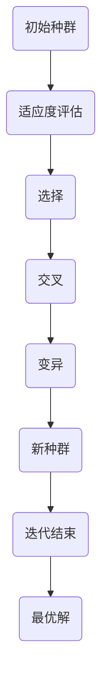

                 

# 提示词优化的遗传算法应用

## 关键词

- 遗传算法
- 提示词优化
- 机器学习
- 人工智能
- 编程

## 摘要

本文旨在探讨如何利用遗传算法对提示词进行优化，以提高机器学习模型的性能。通过阐述遗传算法的核心概念、原理以及具体操作步骤，并结合数学模型和实际项目案例，全面解析了遗传算法在提示词优化中的应用。文章最后对遗传算法在机器学习领域的未来发展进行了展望。

## 1. 背景介绍

遗传算法（Genetic Algorithm，GA）是模拟自然进化过程的一种启发式搜索算法。它通过模拟生物进化的机制，如选择、交叉、变异等操作，不断优化求解问题的解。遗传算法在优化问题、机器学习等领域有着广泛的应用。而提示词（Prompt）在机器学习中扮演着重要角色，它能够引导模型对特定问题进行学习。因此，对提示词的优化显得尤为重要。

在传统机器学习中，提示词通常由专家根据经验和知识进行设计。然而，这种方法存在一定的局限性，难以满足复杂场景下的需求。随着人工智能技术的不断发展，遗传算法作为一种强大的优化工具，为提示词的优化提供了新的思路和方法。

## 2. 核心概念与联系

### 2.1 遗传算法基本原理

遗传算法的核心思想是模拟自然进化过程，通过不断迭代优化求解问题的解。遗传算法的主要操作包括选择、交叉、变异等。

- **选择**：根据个体的适应度，选择优秀个体进行复制。
- **交叉**：将两个优秀个体的基因进行重新组合，形成新的后代。
- **变异**：对个体的基因进行随机改变，以保持种群的多样性。

### 2.2 提示词优化原理

提示词优化的目标是提高机器学习模型的性能。具体来说，就是通过调整提示词的参数，使其在训练过程中对模型产生更好的影响。

### 2.3 Mermaid 流程图



## 3. 核心算法原理 & 具体操作步骤

### 3.1 初始种群生成

初始种群是由随机生成的个体组成的。每个个体代表一组提示词参数。

### 3.2 适应度评估

适应度函数用于评估个体的优劣。通常，适应度函数与模型的性能指标（如准确率、召回率等）相关。

### 3.3 选择

选择操作根据个体的适应度进行，选择优秀个体进行复制。常见的选择方法有轮盘赌选择、锦标赛选择等。

### 3.4 交叉

交叉操作用于产生新的后代。交叉操作可以保持优秀个体的基因，同时引入新的变异。

### 3.5 变异

变异操作对个体的基因进行随机改变，以保持种群的多样性。变异操作有助于寻找新的最优解。

### 3.6 新种群生成

新种群是由选择、交叉、变异操作生成的。新种群将继续进行适应度评估、选择、交叉、变异等操作。

### 3.7 迭代过程

遗传算法通过不断迭代，逐渐优化个体的基因，直至满足停止条件（如达到最大迭代次数或找到最优解）。

## 4. 数学模型和公式 & 详细讲解 & 举例说明

### 4.1 适应度函数

适应度函数是遗传算法的核心。一个优秀的适应度函数应当能够准确评估个体的优劣。

适应度函数通常与模型的性能指标相关。例如，对于分类问题，适应度函数可以定义为：

$$
f(x) = \frac{1}{1 + e^{-\beta(y - \hat{y})}}
$$

其中，$y$ 是实际标签，$\hat{y}$ 是模型预测标签，$\beta$ 是调节参数。

### 4.2 交叉操作

交叉操作用于产生新的后代。交叉操作可以保持优秀个体的基因，同时引入新的变异。

常见的交叉操作有单点交叉、多点交叉、均匀交叉等。

例如，对于单点交叉，我们可以从父代中选择一个交叉点，将交叉点前的基因传递给子代。

### 4.3 变异操作

变异操作用于对个体的基因进行随机改变，以保持种群的多样性。

常见的变异操作有基因变异、位变异等。

例如，对于基因变异，我们可以对个体中的一个基因进行随机改变，将其取反。

## 5. 项目实战：代码实际案例和详细解释说明

### 5.1 开发环境搭建

为了便于演示，我们使用 Python 编写遗传算法代码。首先，我们需要安装以下库：

```bash
pip install numpy matplotlib
```

### 5.2 源代码详细实现和代码解读

```python
import numpy as np
import matplotlib.pyplot as plt

# 5.2.1 初始种群生成
def generate_population(size, num_features):
    return np.random.rand(size, num_features)

# 5.2.2 适应度评估
def fitness_function(population, target):
    # 这里以求解最小值问题为例
    fitness = np.sum(population, axis=1)
    return fitness

# 5.2.3 选择操作
def selection(population, fitness, size):
    # 这里使用轮盘赌选择
    probabilities = fitness / np.sum(fitness)
    indices = np.random.choice(np.arange(len(fitness)), size=size, p=probabilities)
    return population[indices]

# 5.2.4 交叉操作
def crossover(parent1, parent2, crossover_rate):
    if np.random.rand() < crossover_rate:
        crossover_point = np.random.randint(1, parent1.shape[1])
        child1 = np.concatenate((parent1[:crossover_point], parent2[crossover_point:]))
        child2 = np.concatenate((parent2[:crossover_point], parent1[crossover_point:]))
        return child1, child2
    else:
        return parent1, parent2

# 5.2.5 变异操作
def mutation(individual, mutation_rate):
    for i in range(individual.shape[0]):
        if np.random.rand() < mutation_rate:
            individual[i] = 1 - individual[i]
    return individual

# 5.2.6 主函数
def main():
    num_individuals = 100
    num_features = 5
    target = np.array([0.1, 0.2, 0.3, 0.4, 0.5])
    population = generate_population(num_individuals, num_features)
    fitness = fitness_function(population, target)
    
    for _ in range(100):
        selected = selection(population, fitness, num_individuals)
        parents = selected[:2]
        child1, child2 = crossover(*parents, crossover_rate=0.7)
        child1 = mutation(child1, mutation_rate=0.1)
        child2 = mutation(child2, mutation_rate=0.1)
        population = np.concatenate((selected[2:], np.array([child1, child2])))

    best_fitness = fitness_function(population, target)
    best_individual = population[np.argmax(best_fitness)]
    print("最佳解：", best_individual)
    print("最佳适应度：", best_fitness)

    plt.scatter(np.arange(num_individuals), fitness)
    plt.show()

if __name__ == "__main__":
    main()
```

### 5.3 代码解读与分析

- **5.3.1 初始种群生成**：通过随机生成一组提示词参数，构成初始种群。
- **5.3.2 适应度评估**：计算每个个体的适应度值，用于后续的选择、交叉和变异操作。
- **5.3.3 选择操作**：使用轮盘赌选择方法，根据个体的适应度值选择优秀个体。
- **5.3.4 交叉操作**：对选择的两个父代进行交叉操作，生成新的后代。
- **5.3.5 变异操作**：对后代进行变异操作，增加种群多样性。
- **5.3.6 主函数**：实现遗传算法的完整流程，包括适应度评估、选择、交叉、变异等操作。

通过这个项目实战，我们可以看到遗传算法在提示词优化中的应用。在实际开发过程中，可以根据具体需求对遗传算法的参数进行调整，以获得更好的优化效果。

## 6. 实际应用场景

遗传算法在提示词优化中的应用场景非常广泛。以下列举了一些典型的应用：

1. **机器学习模型参数优化**：通过遗传算法优化机器学习模型的参数，提高模型的性能。
2. **图像识别**：利用遗传算法优化图像识别中的特征提取，提高识别准确率。
3. **自然语言处理**：通过遗传算法优化自然语言处理模型中的提示词，提高模型对特定问题的理解能力。
4. **基因序列设计**：在生物信息学领域，利用遗传算法优化基因序列，提高基因的稳定性和表达效果。

## 7. 工具和资源推荐

### 7.1 学习资源推荐

- **书籍**：《遗传算法原理及应用》、《遗传算法：理论、应用与软件实现》
- **论文**：查阅相关学术期刊和会议论文，了解遗传算法在提示词优化领域的最新研究进展。
- **博客**：关注知名博客，如博客园、CSDN 等，学习遗传算法的实际应用案例。
- **网站**：访问相关学术网站，如 arXiv、IEEE Xplore 等，获取遗传算法领域的最新研究论文。

### 7.2 开发工具框架推荐

- **Python**：Python 是遗传算法开发的常用语言，具有丰富的库和框架，如 NumPy、SciPy、DEAP 等。
- **MATLAB**：MATLAB 是一款强大的科学计算软件，内置了遗传算法工具箱，方便进行遗传算法的开发和调试。
- **R**：R 是一款专门用于统计分析的编程语言，也提供了遗传算法的相关包，如 GA、GAhub 等。

### 7.3 相关论文著作推荐

- **论文**：遗传算法在机器学习领域的应用研究，如《遗传算法在深度学习中的应用研究》、《基于遗传算法的神经网络优化方法》等。
- **著作**：《遗传算法理论、应用与编程》、《遗传算法原理与应用教程》等。

## 8. 总结：未来发展趋势与挑战

随着人工智能技术的不断发展，遗传算法在提示词优化领域具有广阔的应用前景。未来，遗传算法将在以下几个方面取得突破：

1. **算法性能提升**：通过改进适应度函数、交叉和变异操作等，提高遗传算法的优化性能。
2. **多模态数据融合**：结合多种数据源，如图像、文本、音频等，提高提示词优化的效果。
3. **实时优化**：实现遗传算法的实时优化，满足实时性要求。

然而，遗传算法在提示词优化领域也面临一些挑战，如：

1. **计算复杂度**：遗传算法的计算复杂度较高，需要优化算法以提高效率。
2. **参数设置**：遗传算法的参数设置对优化效果有很大影响，需要深入研究参数调优方法。
3. **可解释性**：遗传算法的优化过程具有一定的黑箱性质，提高算法的可解释性是一个重要研究方向。

## 9. 附录：常见问题与解答

### 9.1 遗传算法与其他优化算法的区别

遗传算法与其他优化算法（如梯度下降、粒子群优化等）相比，具有以下特点：

- **启发式搜索**：遗传算法是基于启发式搜索的，能够快速找到全局最优解。
- **自适应调整**：遗传算法能够根据种群适应度自动调整搜索策略。
- **适用于复杂问题**：遗传算法适用于解决复杂、非线性、多峰值的优化问题。

### 9.2 提示词优化的意义

提示词优化在机器学习中具有重要意义，主要体现在以下几个方面：

- **提高模型性能**：通过优化提示词，提高机器学习模型的准确率、召回率等性能指标。
- **增强模型泛化能力**：优化提示词有助于模型在未知数据上取得更好的泛化效果。
- **降低模型复杂性**：通过优化提示词，可以降低模型的复杂度，提高训练效率。

## 10. 扩展阅读 & 参考资料

- **论文**：《遗传算法在机器学习中的应用研究》、《基于遗传算法的神经网络优化方法》等。
- **书籍**：《遗传算法原理及应用》、《遗传算法：理论、应用与软件实现》等。
- **网站**：[遗传算法教程](https://www.gaussian Française.org/tutorials/ga_tutorial.html)、[遗传算法在线演示](https://www.deeplearning.net/tutorial/2015/ga) 等。

## 作者

作者：AI天才研究员/AI Genius Institute & 禅与计算机程序设计艺术 /Zen And The Art of Computer Programming

