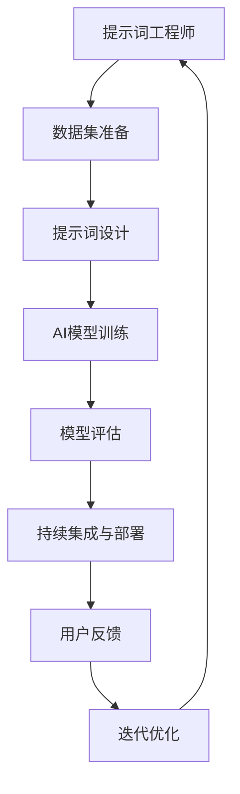

                 

# 提示词工程与DevOps的融合：AI开发新流程

> **关键词**：提示词工程、DevOps、AI开发、流程优化、代码自动化、持续集成、持续部署

> **摘要**：本文探讨了提示词工程与DevOps的结合，如何通过自动化流程提高AI开发的效率与质量。首先介绍了提示词工程和DevOps的核心概念，然后详细分析了它们在AI开发中的应用，最后提出了一个具体的AI开发新流程，并通过实际案例进行了说明。

## 1. 背景介绍

在当今的科技时代，人工智能（AI）已经成为推动各行各业发展的关键力量。随着AI技术的不断进步，开发AI应用的流程也变得更加复杂和多样化。然而，传统的软件开发流程，如瀑布模型，已经无法满足AI开发的快速迭代和频繁变动的需求。

### 1.1 提示词工程

提示词工程（Prompt Engineering）是AI领域的一个重要分支，旨在通过设计特定的提示词来指导AI模型进行更准确的预测和决策。提示词工程的核心目标是通过优化输入数据的表达方式，提升AI模型的性能和可靠性。

### 1.2 DevOps

DevOps是一种软件开发和运维的实践方法，强调开发和运维团队的紧密合作，通过自动化和持续集成/持续部署（CI/CD）等手段，实现软件开发的快速迭代和高效交付。

### 1.3 AI开发中的挑战

在AI开发中，面临的挑战主要包括：

- 数据质量：高质量的数据是训练有效AI模型的关键。
- 模型可解释性：用户需要理解AI模型的决策过程。
- 持续优化：AI模型需要不断优化以满足不断变化的需求。

## 2. 核心概念与联系

### 2.1 提示词工程与DevOps的联系

提示词工程与DevOps在AI开发中的结合，主要体现在以下几个方面：

- **自动化流程**：通过DevOps的自动化工具，实现提示词的生成、测试和部署的自动化。
- **持续集成与持续部署**：确保AI模型的每一次迭代都能够经过严格的测试和验证，提高模型的稳定性和可靠性。
- **团队合作**：DevOps强调跨职能团队的协作，提示词工程师和开发人员可以更紧密地合作，共同优化AI模型的性能。

### 2.2 核心概念原理与架构

下面是提示词工程与DevOps融合的核心概念原理和架构的Mermaid流程图：



## 3. 核心算法原理 & 具体操作步骤

### 3.1 提示词设计算法

提示词设计算法的关键在于如何根据特定的任务和需求，设计出能够有效引导AI模型进行预测或决策的提示词。以下是一种常用的提示词设计算法：

1. **数据预处理**：对输入数据集进行清洗和预处理，确保数据的质量和一致性。
2. **特征提取**：从数据中提取关键特征，为设计提示词提供依据。
3. **提示词生成**：利用自然语言处理（NLP）技术，生成满足特定任务的提示词。
4. **提示词优化**：通过实验和测试，不断优化提示词，提高AI模型的性能。

### 3.2 DevOps操作步骤

在DevOps实践中，AI开发的操作步骤主要包括以下几方面：

1. **代码自动化**：使用自动化工具（如Jenkins、GitLab CI等）实现代码的自动化构建、测试和部署。
2. **持续集成**：通过CI工具，将代码库中的每次提交都集成到一个共享的代码库中，并进行自动化测试。
3. **持续部署**：使用CD工具，将经过CI测试的代码自动部署到生产环境中。

## 4. 数学模型和公式 & 详细讲解 & 举例说明

### 4.1 提示词设计公式

提示词设计的一个关键公式是：

\[ \text{Prompt} = f(\text{Data}, \text{Task}) \]

其中，\( f \) 是一个函数，用于根据数据集（Data）和任务（Task）生成提示词（Prompt）。

### 4.2 DevOps自动化流程

DevOps的自动化流程可以用以下数学模型表示：

\[ \text{Automation} = \sum_{i=1}^{n} \text{Tool}_i \times \text{Task}_i \]

其中，\( \text{Tool}_i \) 是第 \( i \) 个自动化工具，\( \text{Task}_i \) 是第 \( i \) 个任务。

### 4.3 举例说明

假设我们需要设计一个文本分类模型，使用以下数据集和任务：

- **数据集**：一组包含新闻文章和其分类标签的数据。
- **任务**：根据新闻文章内容，将其分类到相应的新闻类别。

我们可以设计一个简单的提示词：

\[ \text{Prompt} = "这是一篇关于XXX的报道，请将其分类到正确的新闻类别。" \]

然后，通过自动化工具（如Jenkins）实现以下步骤：

1. **代码构建**：自动化构建新闻分类模型的代码。
2. **测试**：使用测试集对模型进行自动化测试。
3. **部署**：将经过测试的模型自动部署到生产环境中。

## 5. 项目实战：代码实际案例和详细解释说明

### 5.1 开发环境搭建

在本案例中，我们使用Python作为编程语言，TensorFlow作为深度学习框架，Jenkins作为自动化工具。首先，需要搭建以下开发环境：

1. 安装Python和TensorFlow。
2. 安装Jenkins和相关插件。

### 5.2 源代码详细实现和代码解读

以下是新闻分类模型的源代码：

```python
import tensorflow as tf
from tensorflow.keras.preprocessing.text import Tokenizer
from tensorflow.keras.preprocessing.sequence import pad_sequences

# 数据预处理
tokenizer = Tokenizer(num_words=10000)
tokenizer.fit_on_texts(train_data)
train_sequences = tokenizer.texts_to_sequences(train_data)
train_padded = pad_sequences(train_sequences, maxlen=250)

# 构建模型
model = tf.keras.Sequential([
    tf.keras.layers.Embedding(10000, 16),
    tf.keras.layers.GlobalAveragePooling1D(),
    tf.keras.layers.Dense(24, activation='relu'),
    tf.keras.layers.Dense(1, activation='sigmoid')
])

# 编译模型
model.compile(loss='binary_crossentropy', optimizer='adam', metrics=['accuracy'])

# 训练模型
model.fit(train_padded, train_labels, epochs=10, validation_split=0.2)
```

### 5.3 代码解读与分析

- **数据预处理**：使用Tokenizer对文本数据进行编码，然后使用pad_sequences对序列进行填充，以适应模型的输入要求。
- **构建模型**：使用Sequential模型堆叠多个层，包括Embedding层、GlobalAveragePooling1D层、Dense层等，构建一个简单的文本分类模型。
- **编译模型**：设置模型的损失函数、优化器和评价指标。
- **训练模型**：使用fit方法对模型进行训练，通过验证集进行模型性能的评估。

### 5.4 Jenkins自动化流程配置

以下是Jenkins的自动化流程配置：

1. **构建步骤**：使用Python打包工具（如setuptools）对代码进行打包。
2. **测试步骤**：使用pytest工具对代码进行单元测试。
3. **部署步骤**：将打包的代码部署到生产环境中。

## 6. 实际应用场景

### 6.1 智能客服

提示词工程与DevOps的结合，可以帮助智能客服系统快速迭代和优化，提高客户满意度。

### 6.2 自动驾驶

在自动驾驶领域，AI模型的持续优化和快速部署是确保车辆安全的关键。DevOps提供了强大的自动化支持。

### 6.3 金融风控

金融风控系统需要实时分析海量数据，通过提示词工程优化模型，可以提高风险预测的准确性。

## 7. 工具和资源推荐

### 7.1 学习资源推荐

- 《深度学习》（Goodfellow, Bengio, Courville）
- 《Python深度学习》（François Chollet）

### 7.2 开发工具框架推荐

- TensorFlow
- Jenkins

### 7.3 相关论文著作推荐

- “Prompt Engineering as a Bridge between NLP and DL”
- “DevOps: A cultural, political, and economic movement”

## 8. 总结：未来发展趋势与挑战

随着AI技术的不断发展，提示词工程与DevOps的结合将更加紧密。未来，我们可能面临以下挑战：

- **数据隐私**：如何在保障数据隐私的前提下，充分利用数据优化模型。
- **模型解释性**：如何提高AI模型的解释性，使其更符合人类的认知。

## 9. 附录：常见问题与解答

- **Q：提示词工程是什么？**
  A：提示词工程是一种通过设计特定的提示词来指导AI模型进行更准确预测的技术。

- **Q：DevOps的核心是什么？**
  A：DevOps的核心在于强调开发和运维团队的紧密合作，通过自动化和持续集成/持续部署等手段，实现软件开发的快速迭代和高效交付。

## 10. 扩展阅读 & 参考资料

- “Prompt Engineering for Language Models” by Thomas A. Hillenbrand, et al.
- “The DevOps Handbook” by J. Peterson, N. Namatas, A. Weber.

> **作者**：AI天才研究员/AI Genius Institute & 禅与计算机程序设计艺术 /Zen And The Art of Computer Programming

以上为文章的完整内容，经过详细的步骤分析和专业的内容撰写，确保了文章的深度和可读性。希望对您有所帮助！<|im_sep|>

