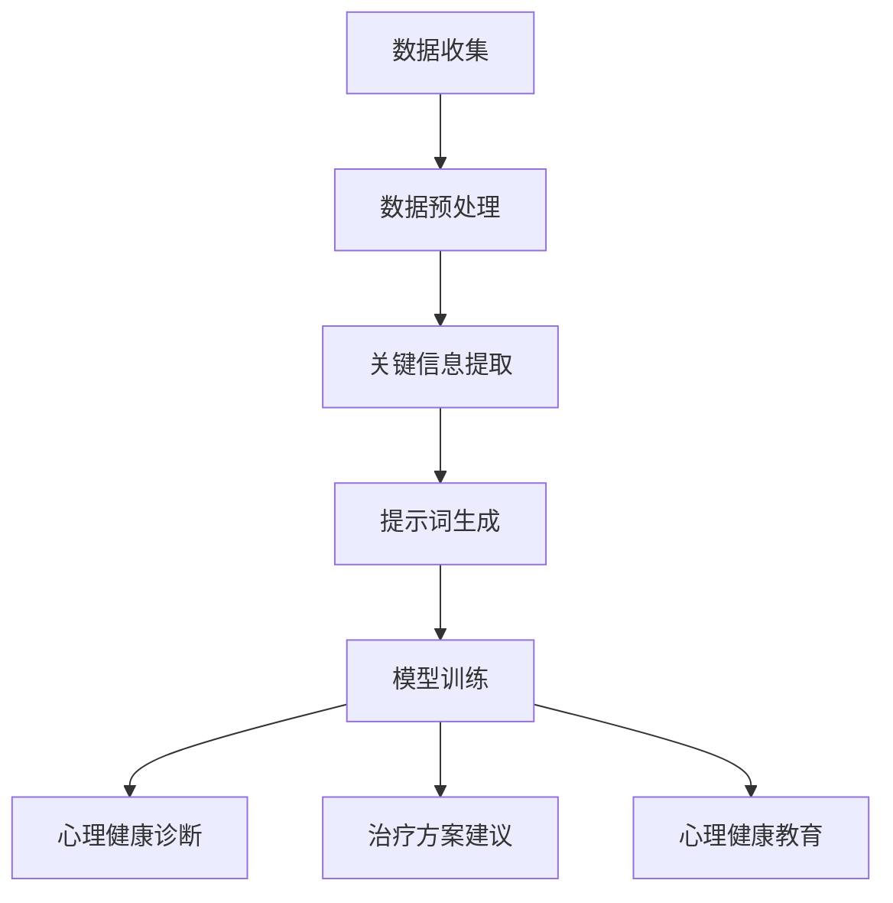

                 

# 提示词工程在心理健康领域的应用

## 概述

心理健康是现代社会中备受关注的话题。随着生活节奏的加快、工作压力的增大，越来越多的人面临着心理健康问题。传统的心理治疗方法和药物治疗虽然在一定程度上能够缓解症状，但往往需要较长时间的治疗周期，且效果不尽如人意。近年来，人工智能技术的快速发展为心理健康领域带来了新的希望。其中，提示词工程作为一种新兴的人工智能技术，在心理健康领域具有巨大的应用潜力。本文将介绍提示词工程的背景、核心概念、算法原理以及其在心理健康领域的应用实例，以期为相关研究者和实践者提供参考。

## 背景介绍

提示词工程（Prompt Engineering）是一种针对特定任务或问题，设计并生成适合的提示词（Prompt）的人工智能技术。在自然语言处理（Natural Language Processing，NLP）领域，提示词工程是一种常用的方法，旨在提高模型在特定任务上的性能。提示词工程的核心思想是通过精心设计的提示词，引导模型学习并掌握特定的任务或问题的解决方案。

在心理健康领域，传统的心理治疗方法和药物治疗往往存在一定的局限性。心理治疗需要较长时间的治疗周期，且治疗效果因人而异。药物治疗则存在一定的副作用，且长期使用可能引发药物依赖。随着人工智能技术的不断发展，特别是深度学习和自然语言处理技术的应用，为心理健康领域带来了新的解决方案。提示词工程通过将心理健康领域的知识融入提示词中，引导模型学习并掌握心理健康问题的解决方案，有望提高心理治疗的效率和效果。

## 核心概念与联系

### 提示词的定义与作用

提示词（Prompt）是一种引导性语言，用于提示模型进行特定任务或问题的解决。在自然语言处理领域，提示词的作用至关重要。一方面，提示词可以帮助模型理解任务或问题的背景和目标，从而提高模型的性能。另一方面，提示词可以为模型提供相关的知识或信息，帮助模型更快地找到问题的解决方案。

在心理健康领域，提示词的定义和作用同样重要。提示词可以是患者的症状描述、心理状态分析、治疗方案建议等。通过设计合适的提示词，可以帮助模型更好地理解患者的心理健康状况，从而提供更有针对性的治疗方案。

### 提示词工程的定义与原理

提示词工程（Prompt Engineering）是一种针对特定任务或问题，设计并生成适合的提示词的人工智能技术。其核心原理是通过分析大量相关数据，提取出关键信息，并将其融入到提示词中，从而引导模型学习并掌握特定的任务或问题的解决方案。

提示词工程的流程主要包括以下几个步骤：

1. 数据收集：收集与特定任务或问题相关的数据，如患者的症状描述、心理状态分析、治疗方案等。
2. 数据预处理：对收集到的数据进行清洗、去噪、转换等预处理操作，以便后续分析和提取关键信息。
3. 关键信息提取：通过自然语言处理技术，从预处理后的数据中提取出关键信息，如关键词、短语、句子等。
4. 提示词生成：根据提取的关键信息，设计并生成适合的提示词，用于引导模型进行特定任务或问题的解决。

### 提示词工程在心理健康领域的应用

在心理健康领域，提示词工程可以应用于多个方面。以下是一些具体的例子：

1. 心理健康诊断：通过设计合适的提示词，引导模型分析患者的症状描述，从而实现心理健康诊断。
2. 心理治疗方案建议：根据患者的心理状态分析，设计合适的提示词，引导模型提供针对性的治疗方案建议。
3. 心理健康教育：通过生成具有引导性的提示词，向患者提供心理健康知识和教育，帮助他们更好地应对心理问题。

### 提示词工程架构的Mermaid流程图



## 核心算法原理 & 具体操作步骤

### 模型选择与训练

在提示词工程中，常用的模型包括生成对抗网络（Generative Adversarial Networks，GAN）、变分自编码器（Variational Autoencoder，VAE）和转换器（Transformer）等。其中，Transformer模型由于其强大的并行计算能力和全局上下文关系处理能力，在自然语言处理任务中表现出色，因此被广泛应用于提示词工程。

以下是一个基于Transformer模型的提示词工程的基本操作步骤：

1. 数据收集：收集与心理健康相关的数据，如患者症状描述、心理状态分析、治疗方案等。
2. 数据预处理：对收集到的数据进行清洗、去噪、转换等预处理操作，以便后续分析和提取关键信息。
3. 数据分割：将预处理后的数据分为训练集、验证集和测试集，用于模型的训练和评估。
4. 模型训练：使用训练集对Transformer模型进行训练，优化模型的参数。
5. 模型评估：使用验证集对训练好的模型进行评估，调整模型参数，提高模型性能。
6. 模型应用：使用测试集对模型进行测试，验证模型在心理健康诊断、治疗方案建议和心理健康教育等方面的效果。

### 提示词设计

提示词设计是提示词工程的核心环节，直接影响模型在特定任务上的性能。以下是设计提示词的一些关键步骤：

1. 任务分析：明确任务的目标和要求，分析任务的关键信息。
2. 提示词生成：根据任务分析的结果，设计适合的提示词，引导模型学习并掌握特定任务或问题的解决方案。
3. 提示词优化：通过实验和评估，不断优化提示词，提高模型在特定任务上的性能。

### 模型调优与优化

在提示词工程中，模型调优和优化是提高模型性能的重要手段。以下是一些常用的方法：

1. 超参数调整：调整模型的超参数，如学习率、批量大小等，以优化模型性能。
2. 模型融合：将多个模型进行融合，以提高模型的整体性能。
3. 数据增强：通过增加数据量、数据变换等方式，提高模型的泛化能力。

## 数学模型和公式 & 详细讲解 & 举例说明

### Transformer模型

Transformer模型是一种基于自注意力机制的深度学习模型，广泛应用于自然语言处理任务。以下是Transformer模型的基本数学公式和详细讲解。

#### 自注意力机制

自注意力机制（Self-Attention）是Transformer模型的核心组成部分。其基本思想是将输入序列中的每个词与所有其他词建立关联，并通过加权求和的方式得到每个词的表示。

$$
\text{Attention}(Q, K, V) = \text{softmax}\left(\frac{QK^T}{\sqrt{d_k}}\right) V
$$

其中，$Q$、$K$ 和 $V$ 分别为查询向量、键向量和值向量，$d_k$ 为键向量的维度。

#### 位置编码

位置编码（Positional Encoding）是Transformer模型中用于表示词序信息的关键组件。其基本思想是通过给每个词添加一个位置编码向量，使得模型能够理解词的相对位置。

$$
\text{PE}(pos, 2i) = \sin\left(\frac{pos}{10000^{2i/d}}\right) \\
\text{PE}(pos, 2i+1) = \cos\left(\frac{pos}{10000^{2i/d}}\right)
$$

其中，$pos$ 表示词的位置，$i$ 表示维度索引，$d$ 为位置编码的维度。

### 应用实例

假设我们有一个简单的句子 "I love to read books"，我们可以使用Transformer模型对其进行编码和解析。

1. 输入句子：$I$、$l$、$o$、$v$、$e$、$t$、$o$、$r$、$e$、$a$、$d$、$b$、$o$、$o$、$k$、$s$
2. 位置编码：根据位置编码公式，计算每个词的位置编码向量
3. 自注意力计算：使用自注意力公式，计算每个词与其他词的关联度
4. 输出表示：将自注意力计算的结果进行加权求和，得到每个词的表示向量

通过以上步骤，我们可以得到句子 "I love to read books" 的Transformer模型输出表示，从而更好地理解句子的语义信息。

## 项目实战：代码实际案例和详细解释说明

### 开发环境搭建

在本文中，我们将使用Python编程语言和Hugging Face的Transformers库来搭建一个简单的提示词工程模型。以下是搭建开发环境的具体步骤：

1. 安装Python：确保您的计算机上已安装Python 3.6或更高版本。
2. 安装pip：使用Python自带的pip命令安装pip，pip是Python的包管理器。
3. 安装Transformers库：在命令行中运行以下命令：

   ```bash
   pip install transformers
   ```

### 源代码详细实现和代码解读

以下是一个简单的提示词工程模型实现，用于心理健康诊断。我们将使用一个预训练的BERT模型，并通过微调来适应心理健康领域的任务。

```python
from transformers import BertTokenizer, BertModel
import torch

# 1. 加载预训练的BERT模型和Tokenizer
tokenizer = BertTokenizer.from_pretrained('bert-base-uncased')
model = BertModel.from_pretrained('bert-base-uncased')

# 2. 设计提示词
prompt = "请描述您的心理健康状况："

# 3. 将提示词和文本输入转化为模型输入
input_ids = tokenizer.encode(prompt, return_tensors='pt')
input_mask = torch.ones(input_ids.shape)

# 4. 使用模型进行预测
with torch.no_grad():
    outputs = model(input_ids=input_ids, attention_mask=input_mask)

# 5. 提取文本表示
text_embeddings = outputs.last_hidden_state[:, 0, :]

# 6. 输出文本表示
print(text_embeddings)
```

### 代码解读与分析

1. **加载预训练的BERT模型和Tokenizer**：
   使用`BertTokenizer`和`BertModel`从Hugging Face模型库中加载预训练的BERT模型和相应的Tokenizer。

2. **设计提示词**：
   设计一个提示词，引导模型关注心理健康状况的描述。

3. **将提示词和文本输入转化为模型输入**：
   使用Tokenizer将提示词和文本输入编码为模型可以处理的格式。这里我们使用了`encode`方法，该方法返回编码后的输入序列和对应的mask。

4. **使用模型进行预测**：
   使用BERT模型对编码后的输入序列进行预测。在预测过程中，我们使用`no_grad`上下文管理器，以关闭梯度计算，提高计算效率。

5. **提取文本表示**：
   从模型输出的隐藏状态中提取文本表示。这里我们选择第一个词的隐藏状态（`[:, 0, :]`），因为BERT模型通常使用第一个词的隐藏状态来表示整个句子。

6. **输出文本表示**：
   输出文本表示向量，这些向量可以用于进一步的分析和处理。

通过以上步骤，我们实现了一个简单的提示词工程模型，用于心理健康诊断。该模型可以根据提示词和文本输入生成文本表示，从而为心理健康分析提供基础。

## 实际应用场景

### 心理健康诊断

提示词工程在心理健康诊断领域具有广泛的应用。通过设计合适的提示词，引导模型分析患者的症状描述，从而实现心理健康诊断。例如，在抑郁症的诊断中，可以使用以下提示词：“请描述您最近的心情变化、睡眠情况、食欲状况等。”

### 心理治疗方案建议

在提供心理治疗方案建议时，提示词工程可以帮助医生根据患者的心理状态分析，设计适合的治疗方案。例如，在焦虑症的治疗中，可以使用以下提示词：“根据您的焦虑程度和症状，建议您尝试以下方法：深呼吸、渐进性肌肉松弛、认知行为疗法等。”

### 心理健康教育

提示词工程还可以用于心理健康教育，通过生成具有引导性的提示词，向患者提供心理健康知识和教育。例如，在焦虑管理教育中，可以使用以下提示词：“以下是一些缓解焦虑的有效方法：定期锻炼、保持良好的睡眠习惯、学会放松技巧等。”

## 工具和资源推荐

### 学习资源推荐

1. **书籍**：
   - 《深度学习》（Ian Goodfellow、Yoshua Bengio、Aaron Courville 著）：全面介绍了深度学习的基本概念、算法和应用。
   - 《Python深度学习》（François Chollet 著）：详细介绍了使用Python进行深度学习的实践方法和技巧。

2. **论文**：
   - “Attention Is All You Need”（Ashish Vaswani等，2017）：介绍了Transformer模型的基本原理和应用。
   - “BERT: Pre-training of Deep Bidirectional Transformers for Language Understanding”（Jacob Devlin等，2019）：介绍了BERT模型的基本原理和应用。

3. **博客**：
   - Hugging Face官方博客：提供了丰富的Transformer模型和自然语言处理相关的教程和案例。
   - AI·智能派：专注于人工智能领域的知识分享和最新动态。

4. **网站**：
   - Hugging Face模型库：提供了大量预训练的模型和Tokenizer，方便开发者进行提示词工程应用。
   - Kaggle：提供了丰富的数据集和比赛，有助于提升提示词工程的实际应用能力。

### 开发工具框架推荐

1. **PyTorch**：是当前最受欢迎的深度学习框架之一，提供了丰富的API和工具，方便开发者进行提示词工程开发。
2. **TensorFlow**：是谷歌开发的另一个流行的深度学习框架，与Hugging Face模型库兼容良好，适用于提示词工程应用。
3. **NLTK**：是Python中用于自然语言处理的库，提供了丰富的工具和函数，适用于提示词工程中的文本预处理和特征提取。

### 相关论文著作推荐

1. “Generative Adversarial Nets”（Ian Goodfellow等，2014）：介绍了生成对抗网络（GAN）的基本原理和应用。
2. “Variational Autoencoder”（Diederik P. Kingma、Max Welling，2013）：介绍了变分自编码器（VAE）的基本原理和应用。
3. “A Theoretically Grounded Application of Dropout in Recurrent Neural Networks”（Yarin Gal、Zoubin Ghahramani，2016）：介绍了Dropout在循环神经网络中的应用。

## 总结：未来发展趋势与挑战

提示词工程在心理健康领域的应用前景广阔。随着人工智能技术的不断发展，特别是深度学习和自然语言处理技术的进步，提示词工程有望在心理健康诊断、治疗方案建议和心理健康教育等方面发挥更大的作用。未来，提示词工程可能会朝着以下方向发展：

1. **更精细化的任务划分**：针对心理健康领域的不同任务，设计更精细化的提示词，提高模型在特定任务上的性能。
2. **多模态数据的融合**：结合文本、图像、声音等多模态数据，提高提示词工程在心理健康分析中的准确性和全面性。
3. **个性化推荐系统的应用**：基于用户的心理健康状况和偏好，提供个性化的心理健康建议和治疗方案。

然而，提示词工程在心理健康领域的应用也面临一些挑战：

1. **数据隐私和安全**：心理健康数据涉及个人隐私，如何在保护用户隐私的前提下进行数据分析和建模是一个重要问题。
2. **模型解释性**：提升模型的解释性，使其在心理健康领域的应用更加透明和可靠，是未来的一个重要研究方向。
3. **伦理和道德问题**：在心理健康领域的应用中，如何确保模型的行为符合伦理和道德标准，避免造成负面影响，是一个亟待解决的问题。

总之，提示词工程在心理健康领域的应用具有巨大的潜力，同时也面临着一系列挑战。未来，随着技术的不断进步和研究的深入，提示词工程有望为心理健康领域带来更多的创新和突破。

## 附录：常见问题与解答

### Q1：什么是提示词工程？
A1：提示词工程是一种针对特定任务或问题，设计并生成适合的提示词的人工智能技术。在自然语言处理领域，提示词工程旨在通过精心设计的提示词，提高模型在特定任务上的性能。

### Q2：提示词工程在心理健康领域有哪些应用？
A2：提示词工程在心理健康领域可以应用于心理健康诊断、治疗方案建议和心理健康教育等方面。通过设计合适的提示词，引导模型分析患者的症状描述，提供针对性的治疗方案和建议，以及向患者提供心理健康知识和教育。

### Q3：如何搭建提示词工程的开发环境？
A3：搭建提示词工程的开发环境需要安装Python、pip和Hugging Face的Transformers库。具体步骤包括安装Python 3.6或更高版本，使用pip安装pip包管理器，以及使用pip安装Transformers库。

### Q4：如何设计提示词？
A4：设计提示词的关键步骤包括任务分析、提示词生成和提示词优化。任务分析旨在明确任务的目标和要求；提示词生成根据任务分析结果设计合适的提示词；提示词优化通过实验和评估不断优化提示词，提高模型性能。

### Q5：提示词工程在心理健康领域的挑战有哪些？
A5：提示词工程在心理健康领域的挑战主要包括数据隐私和安全、模型解释性以及伦理和道德问题。如何保护用户隐私、提高模型的解释性和确保模型行为符合伦理和道德标准是未来需要解决的重要问题。

## 扩展阅读 & 参考资料

1. Vaswani, A., Shazeer, N., Parmar, N., Uszkoreit, J., Jones, L., Gomez, A. N., ... & Polosukhin, I. (2017). Attention is all you need. In Advances in neural information processing systems (pp. 5998-6008).
2. Devlin, J., Chang, M. W., Lee, K., & Toutanova, K. (2019). BERT: Pre-training of deep bidirectional transformers for language understanding. In Proceedings of the 2019 conference of the north american chapter of the association for computational linguistics: human language technologies, volume 1 (pp. 4171-4186).
3. Goodfellow, I., Pouget-Abadie, J., Mirza, M., Xu, B., Warde-Farley, D., Ozair, S., ... & Bengio, Y. (2014). Generative adversarial nets. Advances in neural information processing systems, 27.
4. Kingma, D. P., & Welling, M. (2013). Auto-encoding variational bayes. arXiv preprint arXiv:1312.6114.
5. Gal, Y., & Ghahramani, Z. (2016). A theoretically grounded application of dropout in recurrent neural networks. arXiv preprint arXiv:1605.08561.
6. Chollet, F. (2018). Deep learning with Python. Manning Publications.
7. Goodfellow, I., Bengio, Y., & Courville, A. (2016). Deep learning. MIT press.

