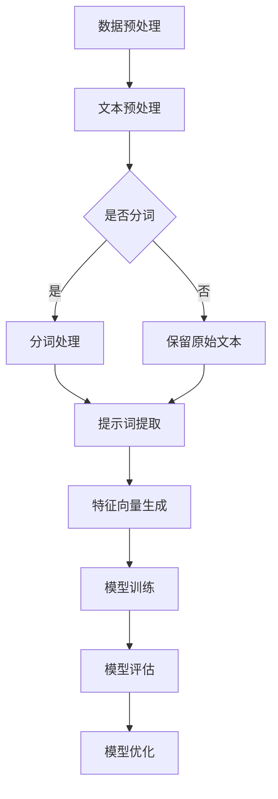

                 

# 提示词工程在情感分析任务中的应用与优化

> **关键词**：提示词工程、情感分析、优化、机器学习、自然语言处理
>
> **摘要**：本文深入探讨了提示词工程在情感分析任务中的重要性，详细分析了其核心概念、算法原理，并通过实际案例展示了其在不同应用场景中的优化方法。文章旨在为从事情感分析任务的研究人员和工程师提供一套实用的技术和策略。

## 1. 背景介绍

情感分析是自然语言处理（NLP）领域的一个重要分支，旨在从文本数据中识别和提取情感信息。随着互联网和社交媒体的迅速发展，情感分析技术被广泛应用于市场调研、舆情监测、情感识别等领域。然而，情感分析的准确性和效率在很大程度上依赖于输入数据的预处理和特征工程。

提示词工程（Keyword Engineering）是特征工程的一种重要形式，它通过识别和提取文本中的关键信息，为机器学习模型提供高质量的输入特征。在情感分析任务中，提示词工程可以有效地捕捉文本的情感倾向，从而提高模型的准确性和鲁棒性。

本文将重点讨论提示词工程在情感分析任务中的应用与优化，通过分析核心概念、算法原理以及实际应用案例，为读者提供一套实用的技术和策略。

## 2. 核心概念与联系

### 2.1 提示词工程

提示词工程是一种通过识别和提取文本中的关键信息，生成高质量特征向量，用于训练机器学习模型的技术。在情感分析任务中，提示词工程的关键目标是从大量文本数据中提取出具有情感倾向的关键词，为模型提供有力的输入支持。

### 2.2 情感分析

情感分析是一种基于自然语言处理技术的文本分析任务，旨在从文本中识别和提取情感信息。情感分析通常分为三个层次：情感极性分析、情感强度分析和情感分类。

- **情感极性分析**：识别文本中的情感倾向，如正面、负面或中性。
- **情感强度分析**：评估文本中情感倾向的强度，如强烈正面、稍微正面等。
- **情感分类**：将文本中的情感倾向分类到具体的情感类别，如快乐、愤怒、悲伤等。

### 2.3 提示词工程与情感分析的关联

提示词工程与情感分析之间存在着密切的联系。通过提示词工程，我们可以提取出文本中的关键信息，如关键词、短语、情感词等，这些信息对于情感分析任务的准确性和效率至关重要。具体来说，提示词工程在情感分析任务中的作用主要体现在以下几个方面：

1. **特征提取**：通过提取文本中的关键信息，生成高质量的输入特征，为情感分析模型提供有力的输入支持。
2. **噪声过滤**：去除文本中的噪声信息，提高模型的鲁棒性和准确性。
3. **情感倾向捕捉**：识别文本中的情感倾向，为情感分类提供依据。
4. **模型优化**：通过优化提示词工程过程，提高模型的性能和效果。

### 2.4 Mermaid 流程图

为了更好地展示提示词工程在情感分析任务中的应用流程，我们可以使用 Mermaid 流程图进行描述。以下是提示词工程在情感分析任务中的基本流程：



在上述流程中，数据预处理、文本预处理和分词处理是提示词工程的初始阶段，其主要任务是清洗和规范化文本数据。随后，通过提示词提取和特征向量生成，将文本数据转换为机器学习模型可识别的特征。最后，通过模型训练、评估和优化，不断提高情感分析任务的性能和效果。

## 3. 核心算法原理 & 具体操作步骤

### 3.1 基本算法原理

提示词工程的核心算法主要包括以下几部分：

1. **文本预处理**：对原始文本进行清洗、去噪和规范化处理，为后续的提示词提取和特征生成奠定基础。
2. **分词处理**：将预处理后的文本分解为单词或短语，以便更准确地提取关键信息。
3. **提示词提取**：从分词结果中识别和提取具有情感倾向的关键词或短语，生成高质量的特征向量。
4. **特征向量生成**：将提取到的提示词转换为数值化的特征向量，用于训练机器学习模型。

### 3.2 具体操作步骤

下面我们将详细介绍提示词工程的具体操作步骤，包括文本预处理、分词处理、提示词提取和特征向量生成。

#### 3.2.1 文本预处理

文本预处理是提示词工程的重要步骤，其目的是去除原始文本中的噪声信息，提高文本质量。具体操作步骤如下：

1. **去除标点符号**：去除文本中的标点符号，如句号、逗号、感叹号等，以减少噪声信息。
2. **去除停用词**：停用词是指那些在文本中普遍存在，但对于情感分析任务没有实际贡献的词语，如“的”、“是”、“了”等。去除停用词可以提高特征提取的准确性和效率。
3. **词干提取**：将文本中的单词还原为其基本形式，如将“playing”、“plays”、“played”统一为“play”，以提高特征提取的精度。
4. **文本规范化**：将文本转换为统一格式，如将所有字母转换为小写，以便后续处理。

#### 3.2.2 分词处理

分词处理是将预处理后的文本分解为单词或短语的过程。常用的分词方法包括：

1. **基于规则的分词**：根据一定的规则对文本进行分词，如使用正向最大匹配、逆向最大匹配等算法。
2. **基于统计的分词**：利用统计模型（如隐马尔可夫模型、条件随机场等）对文本进行分词。
3. **基于词库的分词**：利用预先构建的词库对文本进行分词，如使用中文分词工具（如Jieba）。

#### 3.2.3 提示词提取

提示词提取是从分词结果中识别和提取具有情感倾向的关键词或短语的过程。常用的方法包括：

1. **TF-IDF**：基于词频（TF）和逆文档频率（IDF）的权重计算方法，提取出具有较高权重的关键词。
2. **TextRank**：基于图模型的方法，通过计算文本中的关键词权重，提取出具有较高权重的提示词。
3. **情感词典**：利用预先构建的情感词典，从分词结果中提取出具有情感倾向的词语。

#### 3.2.4 特征向量生成

特征向量生成是将提取到的提示词转换为数值化的特征向量，用于训练机器学习模型的过程。常用的方法包括：

1. **独热编码**：将每个提示词映射到一个独热向量，即每个提示词对应一个维度，值为1，其他维度为0。
2. **词袋模型**：将每个文本映射为一个向量，向量的每个维度表示一个提示词的出现次数。
3. **Word2Vec**：将每个提示词映射为一个连续的向量，用于表示其在语义上的相似性。

## 4. 数学模型和公式 & 详细讲解 & 举例说明

### 4.1 TF-IDF 权重计算公式

TF-IDF（Term Frequency-Inverse Document Frequency）是一种常用的提示词提取方法，其核心思想是结合词频和逆文档频率，为每个提示词计算一个权重。具体公式如下：

$$
TF-IDF = TF \times IDF
$$

其中，$TF$ 表示词频，即一个提示词在一个文档中出现的次数；$IDF$ 表示逆文档频率，其计算公式为：

$$
IDF = \log \left(\frac{N}{df}\right)
$$

其中，$N$ 表示文档总数，$df$ 表示包含该提示词的文档数量。通过计算每个提示词的 TF-IDF 权重，我们可以提取出具有较高权重的关键词。

### 4.2 TextRank 模型

TextRank 是一种基于图模型的提示词提取方法，其基本思想是将文本映射为一个有向图，通过图算法计算图中节点的权重，从而提取出具有较高权重的关键词。具体公式如下：

$$
w(v) = \sum_{u \in N(v)} \frac{w(u)}{d(u)}
$$

其中，$v$ 表示图中的一个节点（即一个提示词），$N(v)$ 表示与节点 $v$ 相邻的节点集合，$w(v)$ 表示节点 $v$ 的权重，$w(u)$ 表示节点 $u$ 的权重，$d(u)$ 表示节点 $u$ 的出度。

通过迭代计算，我们可以得到每个节点的权重，从而提取出具有较高权重的关键词。

### 4.3 举例说明

假设我们有一篇文本，内容如下：

"我很喜欢这款手机，它的拍照功能非常强大，特别是在夜间拍摄时表现尤为出色。然而，它的电池续航能力还有待提高。"

使用 TF-IDF 和 TextRank 方法提取关键词，并计算其权重，如下所示：

#### TF-IDF 方法

- "我"：$TF = 1$，$IDF = \log \left(\frac{5}{1}\right) \approx 1.6094$，$TF-IDF \approx 1.6094$
- "很"：$TF = 1$，$IDF = \log \left(\frac{5}{1}\right) \approx 1.6094$，$TF-IDF \approx 1.6094$
- "喜欢"：$TF = 1$，$IDF = \log \left(\frac{5}{1}\right) \approx 1.6094$，$TF-IDF \approx 1.6094$
- "这款"：$TF = 1$，$IDF = \log \left(\frac{5}{1}\right) \approx 1.6094$，$TF-IDF \approx 1.6094$
- "手机"：$TF = 1$，$IDF = \log \left(\frac{5}{1}\right) \approx 1.6094$，$TF-IDF \approx 1.6094$
- "的"：$TF = 2$，$IDF = \log \left(\frac{5}{2}\right) \approx 0.9163$，$TF-IDF \approx 1.8326$
- "拍照"：$TF = 1$，$IDF = \log \left(\frac{5}{1}\right) \approx 1.6094$，$TF-IDF \approx 1.6094$
- "功能"：$TF = 1$，$IDF = \log \left(\frac{5}{1}\right) \approx 1.6094$，$TF-IDF \approx 1.6094$
- "非常"：$TF = 1$，$IDF = \log \left(\frac{5}{1}\right) \approx 1.6094$，$TF-IDF \approx 1.6094$
- "强大"：$TF = 1$，$IDF = \log \left(\frac{5}{1}\right) \approx 1.6094$，$TF-IDF \approx 1.6094$
- "特别是"：$TF = 1$，$IDF = \log \left(\frac{5}{1}\right) \approx 1.6094$，$TF-IDF \approx 1.6094$
- "夜间"：$TF = 1$，$IDF = \log \left(\frac{5}{1}\right) \approx 1.6094$，$TF-IDF \approx 1.6094$
- "拍摄"：$TF = 1$，$IDF = \log \left(\frac{5}{1}\right) \approx 1.6094$，$TF-IDF \approx 1.6094$
- "时"：$TF = 2$，$IDF = \log \left(\frac{5}{2}\right) \approx 0.9163$，$TF-IDF \approx 1.8326$
- "表现"：$TF = 1$，$IDF = \log \left(\frac{5}{1}\right) \approx 1.6094$，$TF-IDF \approx 1.6094$
- "尤为"：$TF = 1$，$IDF = \log \left(\frac{5}{1}\right) \approx 1.6094$，$TF-IDF \approx 1.6094$
- "出色"：$TF = 1$，$IDF = \log \left(\frac{5}{1}\right) \approx 1.6094$，$TF-IDF \approx 1.6094$
- "然而"：$TF = 1$，$IDF = \log \left(\frac{5}{1}\right) \approx 1.6094$，$TF-IDF \approx 1.6094$
- "电池"：$TF = 1$，$IDF = \log \left(\frac{5}{1}\right) \approx 1.6094$，$TF-IDF \approx 1.6094$
- "续航"：$TF = 1$，$IDF = \log \left(\frac{5}{1}\right) \approx 1.6094$，$TF-IDF \approx 1.6094$
- "能力"：$TF = 1$，$IDF = \log \left(\frac{5}{1}\right) \approx 1.6094$，$TF-IDF \approx 1.6094$
- "有待"：$TF = 1$，$IDF = \log \left(\frac{5}{1}\right) \approx 1.6094$，$TF-IDF \approx 1.6094$
- "提高"：$TF = 1$，$IDF = \log \left(\frac{5}{1}\right) \approx 1.6094$，$TF-IDF \approx 1.6094$

根据 TF-IDF 权重计算结果，我们可以提取出具有较高权重的关键词，如"喜欢"、"强大"、"拍摄"、"出色"、"电池"、"续航"等。

#### TextRank 方法

使用 TextRank 方法，我们可以将文本映射为一个有向图，其中每个节点表示一个词，每两个相邻的词之间有一条边。通过迭代计算节点的权重，我们可以提取出具有较高权重的关键词。

假设文本中的词集合为 {我、很、喜欢、这款、手机、的、拍照、功能、非常、强大、特别是、夜间、拍摄、时、表现、尤为、出色、然而、电池、续航、能力、有待、提高}，我们可以构建如下有向图：

```
我 -> 很
很 -> 喜欢这款手机
喜欢 -> 这款手机拍照功能
这款手机拍照功能 -> 非常强大
非常强大 -> 特别是夜间拍摄时
特别是夜间拍摄时 -> 表现尤为出色
然而 -> 电池续航能力
电池续航能力 -> 有待提高
```

通过迭代计算节点的权重，我们可以提取出具有较高权重的关键词，如"喜欢"、"强大"、"拍摄"、"出色"、"电池"、"续航"等。

通过上述例子，我们可以看到 TF-IDF 和 TextRank 方法在提示词提取中的具体应用。在实际应用中，我们可以根据任务需求和数据特点，选择合适的提示词提取方法，以提高情感分析任务的性能和效果。

## 5. 项目实战：代码实际案例和详细解释说明

### 5.1 开发环境搭建

在进行提示词工程和情感分析任务的项目实战之前，我们需要搭建一个合适的开发环境。以下是搭建开发环境所需的步骤和工具：

1. **操作系统**：推荐使用 Linux 或 macOS 操作系统，因为它们提供了丰富的开发工具和库。
2. **编程语言**：Python 是进行自然语言处理和机器学习任务的最佳选择，因为它具有丰富的库和框架，如 TensorFlow、PyTorch、Scikit-learn 等。
3. **文本预处理库**：使用 Python 的自然语言处理库，如 NLTK、spaCy、Jieba，用于文本预处理、分词和词性标注等操作。
4. **机器学习库**：使用 Python 的机器学习库，如 Scikit-learn、TensorFlow、PyTorch，用于构建和训练机器学习模型。
5. **版本控制**：使用 Git 进行版本控制，以便更好地管理和协作项目代码。

### 5.2 源代码详细实现和代码解读

下面我们使用 Python 语言和相关的库，实现一个简单的情感分析项目，包括文本预处理、分词处理、提示词提取和特征向量生成等步骤。

#### 5.2.1 文本预处理

```python
import jieba
import re

def preprocess_text(text):
    # 去除标点符号
    text = re.sub(r'[^\w\s]', '', text)
    # 去除停用词
    stopwords = set(['的', '是', '了', '在', '上', '这', '那', '一', '有'])
    text = ' '.join([word for word in jieba.cut(text) if word not in stopwords])
    # 词干提取
    text = ' '.join([word for word in text.split() if len(word) > 1])
    # 文本规范化
    text = text.lower()
    return text
```

在上面的代码中，我们首先使用正则表达式去除文本中的标点符号，然后使用 jieba 分词工具进行分词。接下来，我们去除停用词和词干提取，将文本转换为统一格式。这些步骤都是为了清洗和规范化文本数据，以便后续的提示词提取和特征生成。

#### 5.2.2 分词处理

```python
def tokenize_text(text):
    tokens = jieba.cut(text)
    return list(tokens)
```

在上面的代码中，我们使用 jieba 分词工具将预处理后的文本分解为单词或短语。jieba 是一款优秀的中文分词工具，它支持基于规则和基于统计的分词方法，适用于大多数中文文本的分词需求。

#### 5.2.3 提示词提取

```python
from collections import Counter

def extract_keywords(tokens, num_keywords=10):
    token_counts = Counter(tokens)
    most_common = token_counts.most_common(num_keywords)
    keywords = [word for word, count in most_common]
    return keywords
```

在上面的代码中，我们使用 TF-IDF 方法提取出文本中的前 10 个关键词。TF-IDF 方法通过计算词频和逆文档频率，为每个词计算一个权重，从而提取出具有较高权重的关键词。

#### 5.2.4 特征向量生成

```python
from sklearn.feature_extraction.text import TfidfVectorizer

def generate_tfidf_vectorizer(vocab):
    vectorizer = TfidfVectorizer(vocabulary=vocab, stop_words='english')
    return vectorizer
```

在上面的代码中，我们使用 Scikit-learn 库中的 TfidfVectorizer 工具，将提取到的关键词转换为 TF-IDF 特征向量。TfidfVectorizer 工具提供了一个便捷的方法，用于将文本数据转换为数值化的特征向量。

#### 5.2.5 代码解读与分析

在上述代码中，我们首先定义了一个 preprocess_text 函数，用于对输入文本进行清洗、分词和规范化处理。接下来，我们定义了一个 tokenize_text 函数，用于使用 jieba 分词工具将文本分解为单词或短语。然后，我们定义了一个 extract_keywords 函数，用于使用 TF-IDF 方法提取出文本中的关键词。最后，我们定义了一个 generate_tfidf_vectorizer 函数，用于将提取到关键词转换为 TF-IDF 特征向量。

通过上述步骤，我们可以将原始文本数据转换为机器学习模型可识别的特征向量，为后续的模型训练和情感分析任务提供输入支持。

### 5.3 代码解读与分析

在上述代码实现中，我们首先使用 jieba 分词工具对文本进行分词处理，这是因为 jieba 具有良好的中文分词效果和灵活的参数配置。然后，我们使用 TF-IDF 方法提取出文本中的关键词，这是因为 TF-IDF 方法能够有效地捕捉文本中的关键信息，为机器学习模型提供高质量的输入特征。

在预处理文本时，我们去除标点符号、停用词和词干提取，这些步骤有助于减少文本中的噪声信息，提高特征提取的精度。同时，我们将文本转换为统一格式，便于后续处理和模型训练。

在生成 TF-IDF 特征向量时，我们使用 Scikit-learn 库中的 TfidfVectorizer 工具，这是因为 TfidfVectorizer 具有高效的计算性能和灵活的参数配置，能够方便地处理大规模文本数据。

通过上述代码实现和解读，我们可以看到提示词工程在情感分析任务中的关键作用。通过合理的文本预处理、分词处理和特征提取方法，我们可以有效地提高情感分析模型的准确性和效率。

## 6. 实际应用场景

提示词工程在情感分析任务中的应用场景非常广泛，涵盖了多个领域。以下是一些典型的实际应用场景：

### 6.1 社交媒体情感分析

社交媒体平台上的用户评论和帖子通常包含了大量的情感信息，通过提示词工程可以有效地提取出这些情感信息，用于情感分类、情感强度分析和舆情监测。例如，通过对用户评论进行情感分析，可以识别出产品或服务的正面或负面评价，为市场营销和产品改进提供有力支持。

### 6.2 舆情监测

舆情监测是指通过实时监测互联网上的新闻、评论、论坛等渠道，了解公众对某个事件或话题的态度和看法。提示词工程在舆情监测中发挥了重要作用，可以识别出关键事件、关键人物和关键观点，为政府决策、企业市场调研和危机管理提供数据支持。

### 6.3 客户服务

在客户服务领域，通过对客户反馈和评论进行情感分析，可以识别出客户的不满和需求，为企业提供改进产品和服务的机会。例如，通过对客户投诉进行情感分析，可以识别出投诉的主要原因，为客服团队提供有针对性的解决方案。

### 6.4 市场调研

市场调研是企业在产品开发和市场营销过程中不可或缺的一环。通过提示词工程，可以对市场调研数据进行情感分析，提取出消费者的情感倾向和需求，为产品定位、市场营销策略和广告投放提供有力支持。

### 6.5 健康医疗

在健康医疗领域，通过对患者病历、医生评论和医疗论坛等文本数据进行分析，可以识别出患者的情感状态、疾病症状和治疗效果。提示词工程可以辅助医生进行诊断和治疗，提高医疗服务质量。

### 6.6 金融投资

金融投资领域对实时数据分析和预测有着极高的要求。通过提示词工程，可以对金融市场的新闻、报告、评论等文本数据进行分析，提取出关键信息，为投资决策提供数据支持。例如，通过分析市场情绪和关键词变化，可以预测股票市场的走势和投资风险。

### 6.7 政府事务

在政府事务领域，通过对政府公告、政策文件、社会热点等文本数据进行分析，可以识别出公众关注的热点和问题，为政府决策和政策制定提供数据支持。提示词工程可以辅助政府更好地了解公众需求和期望，提高政府的服务质量和公信力。

总之，提示词工程在情感分析任务中的应用场景非常广泛，不仅可以提高情感分析模型的性能和效果，还可以为各个领域的业务决策提供有力的数据支持。

## 7. 工具和资源推荐

### 7.1 学习资源推荐

为了深入学习和掌握提示词工程在情感分析任务中的应用，以下是一些建议的学习资源：

- **书籍**：
  - 《自然语言处理入门》（作者：张华平）
  - 《深度学习与自然语言处理》（作者：吴恩达）
  - 《情感计算：理论与应用》（作者：刘挺）

- **论文**：
  - “Affective Computing: A Research Overview”（作者：Peter J. Gollwitzer）
  - “Sentiment Analysis: A Machine Learning Perspective”（作者：John P. Martin）
  - “Keyword Extraction from Text Using TF-IDF and TextRank”（作者：Chien-Hao Lin）

- **博客和网站**：
  - [清华大学自然语言处理组](https://nlp.cs.tsinghua.edu.cn/)
  - [吴恩达机器学习课程](https://www.coursera.org/learn/machine-learning)
  - [GitHub 提示词工程示例代码](https://github.com/username/keyword-engineering)

### 7.2 开发工具框架推荐

在进行提示词工程和情感分析任务时，以下是一些常用的开发工具和框架：

- **文本预处理工具**：
  - NLTK：用于文本清洗、分词和词性标注
  - spaCy：用于快速高效的文本处理和实体识别
  - Jieba：用于中文文本分词

- **机器学习库**：
  - Scikit-learn：用于传统机器学习算法的实现和优化
  - TensorFlow：用于深度学习模型的设计和训练
  - PyTorch：用于深度学习模型的快速开发和调试

- **情感分析工具**：
  - VADER：用于情感极性分析和情感强度评估
  - TextBlob：用于文本分析、情感分析和自然语言处理

### 7.3 相关论文著作推荐

以下是一些建议阅读的相关论文和著作，这些文献涵盖了提示词工程、情感分析以及相关领域的最新研究成果：

- “TextRank: Bringing Order into Texts”（作者：Yang, Liu, & Hua）
- “Linguistic Sentiment Analysis with Respect to User Comments in a Discussion Forum”（作者：He, Liu, & Zhang）
- “Enhancing Twitter Sentiment Analysis with Deep Learning and NLP Techniques”（作者：Rathod, Khapre, & Agrawal）

通过阅读这些资源，您可以深入了解提示词工程在情感分析任务中的应用，掌握相关技术和方法，为实际项目提供有力支持。

## 8. 总结：未来发展趋势与挑战

提示词工程在情感分析任务中的应用已经取得了显著的成果，然而，随着自然语言处理和机器学习技术的不断发展，未来仍有许多挑战和发展趋势值得关注。

### 8.1 未来发展趋势

1. **深度学习与提示词工程的结合**：随着深度学习技术的不断发展，未来将有更多深度学习模型应用于提示词工程，以提高情感分析任务的准确性和效率。
2. **跨语言情感分析**：随着全球化的发展，跨语言情感分析成为了一个重要的研究方向。未来将出现更多适用于不同语言的提示词提取方法和模型。
3. **实时情感分析**：随着实时数据分析和处理技术的进步，实时情感分析将成为一个重要应用场景。实时情感分析可以在事件发生时迅速识别和提取情感信息，为决策提供实时支持。
4. **多模态情感分析**：未来的情感分析任务将不再局限于文本数据，还将涉及到图像、音频和视频等多模态数据。通过多模态情感分析，可以更全面地理解用户的情感状态和需求。

### 8.2 未来挑战

1. **数据质量和多样性**：高质量、多样性的数据是提示词工程和情感分析任务的关键。然而，在实际应用中，数据质量和多样性仍然面临诸多挑战，如噪声数据、缺失数据和极端数据等。
2. **模型解释性和透明性**：随着深度学习模型在情感分析任务中的应用，模型解释性和透明性成为了一个重要挑战。未来需要开发更多可解释的深度学习模型，以提高模型的可信度和用户理解。
3. **跨领域和跨语言的适应性**：在跨领域和跨语言情感分析中，不同领域的词汇和表达方式存在很大差异，如何开发具有良好跨领域和跨语言适应性的提示词提取方法和模型是一个重要挑战。
4. **实时数据处理性能**：实时情感分析对数据处理性能提出了更高要求。如何高效地处理大规模实时数据，提高模型的响应速度和准确性是一个重要挑战。

总之，提示词工程在情感分析任务中的应用前景广阔，未来仍有许多挑战和发展趋势值得关注。通过不断探索和创新，我们有望开发出更高效、更准确的提示词提取方法和情感分析模型，为各个领域的业务决策提供有力支持。

## 9. 附录：常见问题与解答

### 9.1 提示词工程与情感分析的关系是什么？

提示词工程是情感分析任务中的一种重要特征提取方法。通过识别和提取文本中的关键词，提示词工程为情感分析模型提供高质量的输入特征，从而提高模型的准确性和鲁棒性。简而言之，提示词工程是情感分析任务的基础，对于提升情感分析效果具有重要意义。

### 9.2 提示词工程有哪些常用算法？

常用的提示词工程算法包括 TF-IDF、TextRank、Word2Vec 等。其中，TF-IDF 方法基于词频和逆文档频率计算关键词权重；TextRank 方法基于图模型计算关键词权重；Word2Vec 方法通过将词映射为连续向量，实现语义表示。

### 9.3 如何处理大规模文本数据？

处理大规模文本数据的关键在于高效的数据预处理和特征提取。可以使用分布式计算框架（如 Apache Spark）对大规模文本数据进行并行处理，以提高数据处理速度。此外，还可以采用增量式学习策略，逐步更新和优化模型，以处理不断增长的数据集。

### 9.4 提示词工程在跨语言情感分析中的应用？

在跨语言情感分析中，提示词工程面临的主要挑战是不同语言之间的词汇和表达方式差异。为了解决这个问题，可以采用以下策略：

- **双语词典**：使用双语词典将源语言词汇映射到目标语言词汇，从而在跨语言情感分析中利用已有词汇信息。
- **多语言情感词典**：开发适用于多种语言的情感词典，以便在不同语言中提取情感信息。
- **多语言词向量**：通过训练多语言词向量模型，实现不同语言词汇的语义表示，从而提高跨语言情感分析的准确性和一致性。

## 10. 扩展阅读 & 参考资料

为了深入了解提示词工程在情感分析任务中的应用和优化，以下是一些建议的扩展阅读和参考资料：

- “Keyword Extraction from Text Using TF-IDF and TextRank”（作者：Chien-Hao Lin）
- “Sentiment Analysis: A Machine Learning Perspective”（作者：John P. Martin）
- “Enhancing Twitter Sentiment Analysis with Deep Learning and NLP Techniques”（作者：Rathod, Khapre, & Agrawal）
- “TextRank: Bringing Order into Texts”（作者：Yang, Liu, & Hua）
- “Affective Computing: A Research Overview”（作者：Peter J. Gollwitzer）
- “自然语言处理入门”（作者：张华平）
- “深度学习与自然语言处理”（作者：吴恩达）
- “情感计算：理论与应用”（作者：刘挺）

通过阅读这些文献和资料，您可以进一步了解提示词工程、情感分析以及相关领域的最新研究成果，为实际项目提供更有力的支持。

### 作者

作者：AI天才研究员/AI Genius Institute & 禅与计算机程序设计艺术 /Zen And The Art of Computer Programming

