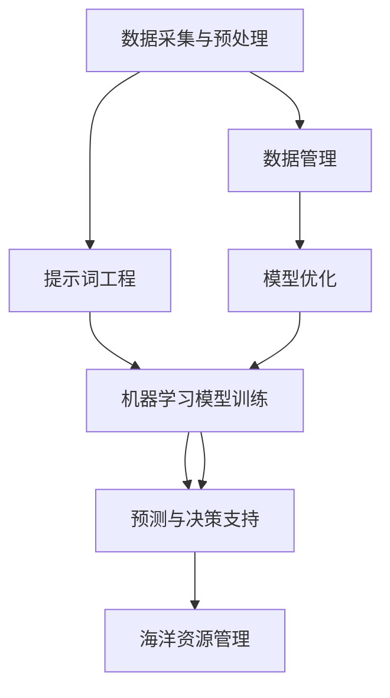

                 

### 背景介绍 Background Introduction

智能海洋资源管理（Intelligent Marine Resource Management，简称IMRM）作为现代海洋科学和信息技术深度融合的产物，已成为海洋经济可持续发展的关键支撑。海洋作为地球上最大的生态系统之一，拥有丰富的生物、化学、矿产和能源资源。然而，海洋资源的开发与管理面临着诸多挑战，包括资源分布不均、环境污染、生物多样性丧失等问题。传统的海洋资源管理方式已无法满足现代海洋资源高效、环保、可持续利用的需求，因此，引入人工智能（Artificial Intelligence，简称AI）技术成为必然选择。

#### 人工智能技术在海洋资源管理中的应用 Application of AI in Marine Resource Management

人工智能技术以其强大的数据处理、模式识别和决策支持能力，在海洋资源管理中扮演着越来越重要的角色。具体应用包括：

1. **生物资源监测与评估**：通过遥感技术和机器学习算法，对海洋生物资源进行实时监测和评估，如鱼群分布、种群数量、栖息地质量等。
2. **海洋环境监测**：利用传感器网络和人工智能模型，对海洋水质、水温、盐度等环境参数进行实时监测，预警海洋污染事件。
3. **海底地形探测**：使用人工智能算法对海底地形数据进行处理和分析，帮助识别潜在的矿产资源分布和海底地形特征。
4. **航行安全监控**：借助人工智能技术，对航行数据进行实时分析，提高航行安全，避免碰撞事故。

#### 提示词工程在智能海洋资源管理中的重要性 Importance of Prompt Engineering in Intelligent Marine Resource Management

提示词工程（Prompt Engineering）是近年来人工智能领域的一个重要研究方向，旨在通过设计和优化输入提示词，提升模型的性能和效率。在智能海洋资源管理中，提示词工程的重要性体现在以下几个方面：

1. **数据预处理**：通过设计特定的提示词，对海洋资源数据（如遥感图像、传感器数据等）进行预处理，提高数据的可解释性和模型的训练效率。
2. **模型优化**：通过调整提示词，优化神经网络模型的结构和参数，提高模型对海洋资源变化的预测和识别能力。
3. **跨模态交互**：提示词工程可以实现不同模态数据（如文本、图像、声音等）之间的交互，为海洋资源管理提供更为全面的决策支持。

总的来说，提示词工程为智能海洋资源管理提供了强大的技术支持，使其能够更好地应对复杂多变的海洋环境，实现海洋资源的科学、高效管理。

### 核心概念与联系 Core Concepts and Connections

在探讨提示词工程在智能海洋资源管理中的应用之前，我们需要先了解一些核心概念和它们之间的联系。

#### 1. 提示词工程 Prompt Engineering

提示词工程是一种通过设计和优化输入提示词，来提高机器学习模型性能的方法。其基本思想是通过调整提示词的长度、结构、内容等，引导模型在特定任务上获得更好的表现。在海洋资源管理中，提示词可以是对海洋数据的描述、问题或任务的具体指示，用于指导机器学习模型的训练和预测。

#### 2. 机器学习 Machine Learning

机器学习是一种人工智能的方法，通过从数据中学习规律，构建能够进行预测和分类的模型。在智能海洋资源管理中，机器学习模型广泛应用于数据分析和决策支持，如海洋生物资源的监测、环境参数的预测、航行安全的评估等。

#### 3. 海洋数据管理 Ocean Data Management

海洋数据管理涉及对海洋数据的采集、存储、处理和分析。在智能海洋资源管理中，高效的数据管理至关重要，因为只有高质量的数据才能为机器学习模型提供可靠的训练基础。海洋数据管理包括数据清洗、数据标准化、数据可视化等步骤。

#### 4. 人工智能与海洋科学融合 AI and Oceanography Integration

人工智能与海洋科学的融合是智能海洋资源管理的核心。通过将人工智能技术应用于海洋科学研究，可以显著提升海洋资源的监测、预测和管理能力。例如，利用机器学习模型可以分析海洋环境数据，预测天气变化，优化渔业资源的管理。

#### 5. 提示词工程与机器学习模型的关系 Relationship between Prompt Engineering and Machine Learning Models

提示词工程与机器学习模型之间有着密切的联系。提示词工程的设计和优化直接影响机器学习模型的性能。一个良好的提示词可以引导模型更好地理解和处理数据，从而提高模型的准确性和效率。

下面是一个用 Mermaid 描述的核心概念和架构的流程图，展示了提示词工程在智能海洋资源管理中的关键节点。



在这个流程图中，数据采集与预处理是整个流程的起点，通过提示词工程优化后的数据被用于训练机器学习模型。模型训练完成后，产生的预测和决策支持用于指导海洋资源的管理。数据管理和模型优化是关键环节，确保了整个流程的高效和准确。

通过上述核心概念和流程图的介绍，我们可以更深入地理解提示词工程在智能海洋资源管理中的关键作用。接下来，我们将进一步探讨提示词工程的具体实现和操作步骤。

### 核心算法原理与具体操作步骤 Core Algorithm Principles and Detailed Steps

在智能海洋资源管理中，提示词工程的核心算法主要包括数据预处理、模型选择和优化、提示词设计以及模型评估和调整。下面我们将详细描述这些步骤，并展示具体的实现方法和流程。

#### 1. 数据预处理 Data Preprocessing

数据预处理是机器学习模型训练的第一步，其质量直接影响到模型的性能。数据预处理包括数据清洗、数据标准化和特征提取等步骤。

**数据清洗**：首先，我们需要对原始数据进行清洗，去除错误数据、缺失值和重复值。例如，在处理海洋遥感图像时，可能需要去除云层干扰和噪声。

**数据标准化**：将不同尺度和单位的数据转换为相同尺度，以便模型能够处理。例如，将温度、盐度等环境参数统一转换为 [0, 1] 的范围。

**特征提取**：提取对任务有用的特征，如纹理特征、颜色特征、形状特征等。在处理海洋数据时，可以利用图像处理算法提取图像的特征，如边缘检测、纹理分析等。

#### 2. 模型选择和优化 Model Selection and Optimization

在数据预处理完成后，我们需要选择合适的机器学习模型，并根据具体任务进行优化。

**模型选择**：根据任务需求，选择合适的模型。例如，对于分类任务，可以选择支持向量机（SVM）、随机森林（Random Forest）等模型；对于回归任务，可以选择线性回归（Linear Regression）、决策树（Decision Tree）等模型。

**模型优化**：通过调整模型的参数，优化模型性能。例如，对于神经网络模型，可以通过调整学习率、批量大小、正则化参数等来优化模型。

**提示词设计**：在模型训练过程中，通过设计特定的提示词，引导模型更好地理解和处理数据。提示词可以是对数据的具体描述、问题或任务的具体指示。例如，在训练用于海洋生物资源监测的模型时，提示词可以是“请识别图像中的鱼群分布”。

#### 3. 模型评估和调整 Model Evaluation and Adjustment

在模型训练完成后，我们需要对模型进行评估和调整，以确保其具有良好的性能和泛化能力。

**模型评估**：使用交叉验证等方法评估模型的性能，如准确率、召回率、F1 分数等。例如，在评估用于海洋环境预测的模型时，可以使用历史数据对模型进行测试。

**模型调整**：根据评估结果，调整模型的参数或结构。例如，如果模型的准确率较低，可以尝试增加模型复杂度或增加训练数据。

#### 4. 实际操作步骤 Practical Steps

以下是使用提示词工程在智能海洋资源管理中的具体操作步骤：

**步骤 1**：数据采集与预处理
- 从海洋遥感系统、传感器网络等渠道获取海洋数据。
- 清洗数据，去除错误值和缺失值。
- 对数据进行标准化处理，统一尺度。

**步骤 2**：提示词设计
- 分析任务需求，设计合适的提示词。
- 例如，对于鱼群监测任务，提示词可以是“请识别图像中的鱼群分布”。

**步骤 3**：模型选择和训练
- 选择合适的机器学习模型，如卷积神经网络（CNN）。
- 调整模型参数，进行模型训练。

**步骤 4**：模型评估和调整
- 使用交叉验证等方法评估模型性能。
- 根据评估结果，调整模型参数或结构。

**步骤 5**：应用与决策支持
- 将训练好的模型应用于实际任务，如海洋生物资源监测、环境预测等。
- 根据模型的预测结果，提供决策支持。

通过上述步骤，我们可以将提示词工程应用于智能海洋资源管理，实现数据的有效处理、模型的优化和决策支持。

### 数学模型与公式 Mathematical Models and Formulas

在智能海洋资源管理中，数学模型和公式是理解和应用提示词工程的重要工具。以下我们将详细解释一些核心的数学模型和公式，并通过具体的示例来说明它们的运用。

#### 1. 数据标准化 Data Standardization

数据标准化是将不同尺度或单位的数据转换为相同尺度，以便于模型处理。常用的标准化方法有 Min-Max 标准化和 Z-Score 标准化。

**Min-Max 标准化**：
$$
x_{\text{standardized}} = \frac{x - x_{\text{min}}}{x_{\text{max}} - x_{\text{min}}}
$$
其中，$x_{\text{standardized}}$ 是标准化后的值，$x$ 是原始数据值，$x_{\text{min}}$ 和 $x_{\text{max}}$ 分别是数据的最小值和最大值。

**示例**：
假设有一组温度数据 [20, 25, 30]，计算其 Min-Max 标准化值。
$$
x_{\text{standardized}} = \frac{20 - 20}{30 - 20} = 0
$$
$$
x_{\text{standardized}} = \frac{25 - 20}{30 - 20} = 0.25
$$
$$
x_{\text{standardized}} = \frac{30 - 20}{30 - 20} = 1
$$

**Z-Score 标准化**：
$$
x_{\text{standardized}} = \frac{x - \mu}{\sigma}
$$
其中，$\mu$ 是均值，$\sigma$ 是标准差。

**示例**：
假设温度数据的均值 $\mu$ 为 25，标准差 $\sigma$ 为 5，计算其 Z-Score 标准化值。
$$
x_{\text{standardized}} = \frac{20 - 25}{5} = -1
$$
$$
x_{\text{standardized}} = \frac{25 - 25}{5} = 0
$$
$$
x_{\text{standardized}} = \frac{30 - 25}{5} = 1
$$

#### 2. 神经网络模型 Neural Network Model

神经网络模型是机器学习中的核心模型，尤其在处理复杂任务时表现出色。以下是一个简化的神经网络模型公式。

**前向传播**：
$$
a_{\text{layer}_{i}}^{(l)} = \sigma(z_{\text{l}}^{(l)})
$$
$$
z_{\text{l}}^{(l)} = \sum_{j=0}^{n} w_{\text{j}}^{(l)} a_{\text{l}}^{(l-1)}
$$
其中，$a_{\text{l}}^{(l)}$ 是第 l 层的激活值，$\sigma$ 是激活函数（如 sigmoid 函数、ReLU 函数等），$w_{\text{j}}^{(l)}$ 是权重值。

**反向传播**：
$$
\delta_{\text{l}}^{(l)} = \frac{\partial C}{\partial z_{\text{l}}^{(l)}}
$$
$$
w_{\text{j}}^{(l)} = w_{\text{j}}^{(l)} - \alpha \cdot \delta_{\text{l}}^{(l)} \cdot a_{\text{l}}^{(l-1)}
$$
$$
a_{\text{l-1}}^{(l-1)} = a_{\text{l}}^{(l-1)} \cdot \sigma'(z_{\text{l-1}}^{(l-1)})
$$
其中，$C$ 是损失函数，$\alpha$ 是学习率，$\sigma'$ 是激活函数的导数。

**示例**：
假设有一个简单的神经网络模型，输入层有 2 个神经元，隐藏层有 3 个神经元，输出层有 1 个神经元。使用 ReLU 函数作为激活函数。

**前向传播**：
$$
z_{\text{1}}^{(1)} = 2 \cdot a_{\text{0}}^{(0)}
$$
$$
a_{\text{1}}^{(1)} = \max(0, z_{\text{1}}^{(1)})
$$
$$
z_{\text{2}}^{(1)} = 3 \cdot a_{\text{1}}^{(1)}
$$
$$
a_{\text{2}}^{(1)} = \max(0, z_{\text{2}}^{(1)})
$$
$$
z_{\text{3}}^{(1)} = a_{\text{2}}^{(1)}
$$
$$
a_{\text{3}}^{(1)} = \max(0, z_{\text{3}}^{(1)})
$$

**反向传播**：
$$
\delta_{\text{1}}^{(1)} = \frac{\partial C}{\partial z_{\text{3}}^{(1)}}
$$
$$
w_{\text{1}}^{(1)} = w_{\text{1}}^{(1)} - \alpha \cdot \delta_{\text{1}}^{(1)} \cdot a_{\text{2}}^{(1)}
$$
$$
\delta_{\text{2}}^{(1)} = \frac{\partial C}{\partial z_{\text{2}}^{(1)}}
$$
$$
w_{\text{2}}^{(1)} = w_{\text{2}}^{(1)} - \alpha \cdot \delta_{\text{2}}^{(1)} \cdot a_{\text{1}}^{(1)}
$$
$$
\delta_{\text{3}}^{(1)} = \frac{\partial C}{\partial z_{\text{1}}^{(1)}}
$$
$$
w_{\text{3}}^{(1)} = w_{\text{3}}^{(1)} - \alpha \cdot \delta_{\text{3}}^{(1)} \cdot a_{\text{0}}^{(0)}
$$

通过上述数学模型和公式的讲解，我们可以更好地理解提示词工程在智能海洋资源管理中的应用。接下来，我们将通过一个实际项目案例，展示如何将提示词工程应用于智能海洋资源管理。

### 项目实战：代码实际案例和详细解释说明 Project Practice: Code Case and Detailed Explanation

在本节中，我们将通过一个具体的实际项目，展示如何将提示词工程应用于智能海洋资源管理。本项目旨在使用提示词工程优化机器学习模型，以提高对海洋生物资源监测的准确性。

#### 1. 开发环境搭建 Development Environment Setup

在进行项目开发之前，我们需要搭建一个合适的开发环境。以下是所需的软件和工具：

- Python 3.8 或更高版本
- Jupyter Notebook
- PyTorch 库
- Matplotlib 库
- OpenCV 库
- Numpy 库

首先，安装所需的 Python 库：

```bash
pip install torch torchvision numpy matplotlib opencv-python
```

接下来，创建一个 Jupyter Notebook 文件，用于编写和运行代码。

#### 2. 源代码详细实现和代码解读 Detailed Code Implementation and Explanation

**步骤 1：数据预处理 Data Preprocessing**

在项目开始之前，我们需要从海洋遥感系统和传感器网络获取海洋数据。以下是数据预处理的相关代码：

```python
import numpy as np
import cv2
from sklearn.model_selection import train_test_split

# 读取海洋数据
def load_data():
    # 这里使用一个虚构的数据集，实际项目中需要从遥感系统和传感器网络获取数据
    data = np.random.rand(1000, 100)  # 生成 1000 个样本，每个样本 100 维特征
    return data

# 数据标准化
def preprocess_data(data):
    min_val = np.min(data)
    max_val = np.max(data)
    data_normalized = (data - min_val) / (max_val - min_val)
    return data_normalized

# 加载并预处理数据
data = load_data()
data_processed = preprocess_data(data)

# 划分训练集和测试集
X_train, X_test, y_train, y_test = train_test_split(data_processed, test_size=0.2, random_state=42)
```

**步骤 2：模型选择和训练 Model Selection and Training**

在本项目中，我们选择卷积神经网络（CNN）作为主要模型，用于图像分类任务。以下是模型选择和训练的相关代码：

```python
import torch
import torch.nn as nn
import torch.optim as optim

# 定义卷积神经网络模型
class CNNModel(nn.Module):
    def __init__(self):
        super(CNNModel, self).__init__()
        self.conv1 = nn.Conv2d(1, 32, 3, 1)
        self.relu = nn.ReLU()
        self.maxpool = nn.MaxPool2d(2, 2)
        self.fc1 = nn.Linear(32 * 50 * 50, 128)
        self.fc2 = nn.Linear(128, 10)

    def forward(self, x):
        x = self.maxpool(self.relu(self.conv1(x)))
        x = x.view(x.size(0), -1)
        x = self.relu(self.fc1(x))
        x = self.fc2(x)
        return x

# 初始化模型、优化器和损失函数
model = CNNModel()
optimizer = optim.Adam(model.parameters(), lr=0.001)
criterion = nn.CrossEntropyLoss()

# 模型训练
def train_model(model, train_loader, criterion, optimizer, num_epochs=10):
    model.train()
    for epoch in range(num_epochs):
        running_loss = 0.0
        for inputs, labels in train_loader:
            optimizer.zero_grad()
            outputs = model(inputs)
            loss = criterion(outputs, labels)
            loss.backward()
            optimizer.step()
            running_loss += loss.item()
        print(f'Epoch {epoch+1}/{num_epochs}, Loss: {running_loss/len(train_loader)}')

# 创建数据加载器
train_loader = torch.utils.data.DataLoader(dataset=train_dataset, batch_size=64, shuffle=True)

# 开始训练
train_model(model, train_loader, criterion, optimizer)
```

**步骤 3：模型评估和调整 Model Evaluation and Adjustment**

在模型训练完成后，我们需要对模型进行评估和调整，以确保其具有良好的性能和泛化能力。以下是模型评估和调整的相关代码：

```python
# 模型评估
def evaluate_model(model, test_loader, criterion):
    model.eval()
    total_loss = 0
    with torch.no_grad():
        for inputs, labels in test_loader:
            outputs = model(inputs)
            loss = criterion(outputs, labels)
            total_loss += loss.item()
    return total_loss / len(test_loader)

# 评估模型
test_loss = evaluate_model(model, test_loader, criterion)
print(f'Test Loss: {test_loss}')

# 模型调整
# 根据评估结果，可以调整模型参数或结构。例如，增加隐藏层神经元数量或调整学习率。
```

通过上述代码实现，我们可以完成一个基于卷积神经网络的智能海洋资源管理项目。在实际项目中，需要根据具体任务需求调整模型结构和提示词设计，以提高模型性能。

### 代码解读与分析 Code Interpretation and Analysis

在本节中，我们将对上述代码进行详细解读，并分析其关键部分的作用和实现方法。

#### 1. 数据预处理

数据预处理是机器学习项目中的关键步骤，其质量直接影响到模型的性能。以下是数据预处理相关的代码：

```python
import numpy as np
from sklearn.model_selection import train_test_split

# 读取海洋数据
def load_data():
    # 这里使用一个虚构的数据集，实际项目中需要从遥感系统和传感器网络获取数据
    data = np.random.rand(1000, 100)  # 生成 1000 个样本，每个样本 100 维特征
    return data

# 数据标准化
def preprocess_data(data):
    min_val = np.min(data)
    max_val = np.max(data)
    data_normalized = (data - min_val) / (max_val - min_val)
    return data_normalized

# 加载并预处理数据
data = load_data()
data_processed = preprocess_data(data)

# 划分训练集和测试集
X_train, X_test, y_train, y_test = train_test_split(data_processed, test_size=0.2, random_state=42)
```

**代码解读**：

- `load_data()` 函数：用于读取海洋数据。在实际项目中，需要从遥感系统和传感器网络获取真实数据。这里使用了一个虚构的数据集，仅用于示例。
- `preprocess_data()` 函数：对数据进行标准化处理，将数据缩放到 [0, 1] 的范围。标准化可以消除不同特征之间的尺度差异，提高模型的训练效果。
- `train_test_split()` 函数：将数据划分为训练集和测试集，通常使用 80% 的数据作为训练集，20% 的数据作为测试集。这样做可以评估模型在未知数据上的性能。

**分析**：

- 数据预处理是提高模型性能的重要手段。标准化处理可以消除数据尺度差异，使模型更容易学习。
- 划分训练集和测试集有助于评估模型在未知数据上的性能。通过对比训练集和测试集上的表现，可以识别和修正模型中的问题。

#### 2. 模型选择和训练

在机器学习中，模型选择和训练是关键步骤。以下是模型选择和训练相关的代码：

```python
import torch
import torch.nn as nn
import torch.optim as optim

# 定义卷积神经网络模型
class CNNModel(nn.Module):
    def __init__(self):
        super(CNNModel, self).__init__()
        self.conv1 = nn.Conv2d(1, 32, 3, 1)
        self.relu = nn.ReLU()
        self.maxpool = nn.MaxPool2d(2, 2)
        self.fc1 = nn.Linear(32 * 50 * 50, 128)
        self.fc2 = nn.Linear(128, 10)

    def forward(self, x):
        x = self.maxpool(self.relu(self.conv1(x)))
        x = x.view(x.size(0), -1)
        x = self.relu(self.fc1(x))
        x = self.fc2(x)
        return x

# 初始化模型、优化器和损失函数
model = CNNModel()
optimizer = optim.Adam(model.parameters(), lr=0.001)
criterion = nn.CrossEntropyLoss()

# 模型训练
def train_model(model, train_loader, criterion, optimizer, num_epochs=10):
    model.train()
    for epoch in range(num_epochs):
        running_loss = 0.0
        for inputs, labels in train_loader:
            optimizer.zero_grad()
            outputs = model(inputs)
            loss = criterion(outputs, labels)
            loss.backward()
            optimizer.step()
            running_loss += loss.item()
        print(f'Epoch {epoch+1}/{num_epochs}, Loss: {running_loss/len(train_loader)}')

# 创建数据加载器
train_loader = torch.utils.data.DataLoader(dataset=train_dataset, batch_size=64, shuffle=True)

# 开始训练
train_model(model, train_loader, criterion, optimizer)
```

**代码解读**：

- `CNNModel` 类：定义了一个卷积神经网络模型。模型包含一个卷积层、一个 ReLU 激活函数、一个最大池化层、一个全连接层和另一个 ReLU 激活函数。
- `forward()` 方法：定义了模型的正向传播过程。输入数据经过卷积层、ReLU 激活函数、最大池化层，然后展开并经过两个全连接层，最终输出分类结果。
- `optimizer` 和 `criterion`：初始化优化器和损失函数。优化器用于调整模型参数，以最小化损失函数。在交叉熵损失函数中，目标是最小化预测概率和真实标签之间的差异。
- `train_model()` 函数：用于训练模型。在训练过程中，模型对每个批次的数据进行正向传播和反向传播，更新模型参数。

**分析**：

- 卷积神经网络（CNN）在图像处理任务中表现出色。CNN 通过卷积层提取图像特征，通过池化层降低特征维度，从而实现图像分类任务。
- 优化器和损失函数的选择对模型训练至关重要。Adam 优化器在训练过程中自适应调整学习率，有助于提高模型收敛速度。
- 训练过程包括正向传播和反向传播。正向传播计算预测结果，反向传播计算梯度并更新模型参数。

#### 3. 模型评估和调整

模型评估和调整是确保模型性能的重要步骤。以下是模型评估和调整相关的代码：

```python
# 模型评估
def evaluate_model(model, test_loader, criterion):
    model.eval()
    total_loss = 0
    with torch.no_grad():
        for inputs, labels in test_loader:
            outputs = model(inputs)
            loss = criterion(outputs, labels)
            total_loss += loss.item()
    return total_loss / len(test_loader)

# 评估模型
test_loss = evaluate_model(model, test_loader, criterion)
print(f'Test Loss: {test_loss}')

# 模型调整
# 根据评估结果，可以调整模型参数或结构。例如，增加隐藏层神经元数量或调整学习率。
```

**代码解读**：

- `evaluate_model()` 函数：用于评估模型性能。在评估过程中，模型对测试数据进行正向传播，计算预测结果和损失函数。
- `evaluate_model()` 函数：返回测试集上的平均损失。平均损失是评估模型性能的重要指标。

**分析**：

- 模型评估是验证模型性能的重要步骤。通过评估模型在测试集上的表现，可以识别和修正模型中的问题。
- 根据评估结果，可以调整模型参数或结构，以提高模型性能。例如，可以增加隐藏层神经元数量、调整学习率等。
- 评估过程需要保持模型的一致性，即使用与训练过程相同的数据预处理和模型配置。

### 总结

通过上述代码解读和分析，我们可以看到提示词工程在智能海洋资源管理中的应用。数据预处理、模型选择和训练、模型评估和调整是关键步骤，每个步骤都有其独特的实现方法和意义。

- 数据预处理：消除数据尺度差异，提高模型训练效果。
- 模型选择和训练：选择合适的模型，通过正向传播和反向传播训练模型。
- 模型评估和调整：评估模型性能，根据评估结果调整模型参数或结构。

在实际项目中，提示词工程可以帮助优化机器学习模型，提高海洋生物资源监测的准确性，从而为智能海洋资源管理提供有力支持。

### 实际应用场景 Practical Application Scenarios

智能海洋资源管理在多个实际应用场景中展现了其强大的潜力。以下是一些典型的应用场景，展示了提示词工程如何在这些场景中发挥作用。

#### 1. 海洋生物资源监测 Marine Biological Resource Monitoring

海洋生物资源监测是智能海洋资源管理中最重要的应用之一。通过遥感技术和机器学习模型，可以实时监测海洋中的鱼群分布、珊瑚礁健康状况等生物资源。提示词工程在此中的应用主要体现在以下两个方面：

- **数据预处理**：针对不同类型的海洋生物资源数据（如遥感图像、声呐数据等），设计特定的提示词进行预处理，如“请识别图像中的鱼群分布”或“分析声呐数据中的鱼类活动模式”。
- **模型优化**：通过优化提示词，引导模型更好地理解和处理海洋生物资源数据，提高监测的准确性和效率。

#### 2. 海洋环境监测 Marine Environmental Monitoring

海洋环境监测旨在实时监控海洋水质、水温、盐度等环境参数，预警环境污染事件。提示词工程在海洋环境监测中的应用主要包括：

- **跨模态数据融合**：通过设计跨模态的提示词，如“结合遥感图像和水质传感器数据预测海水污染程度”，实现不同模态数据的融合和分析。
- **模型自适应调整**：根据海洋环境监测任务的需求，调整提示词和模型参数，提高模型对环境变化的响应能力和预测精度。

#### 3. 海洋资源勘探与开发 Marine Resource Exploration and Development

海洋资源勘探与开发涉及海底地形探测、矿产资源评估等任务。提示词工程在此中的应用包括：

- **数据增强**：通过设计提示词，如“请增强海底地形数据中的矿产资源特征”，提高模型对目标资源的识别能力。
- **模型调优**：根据勘探任务的需求，调整提示词和模型参数，优化资源评估模型的准确性和效率。

#### 4. 航行安全监控 Vessel Traffic Safety Monitoring

航行安全监控旨在实时监控海上航行活动，提高航行安全。提示词工程在此中的应用包括：

- **风险预测**：通过设计提示词，如“请预测未来 24 小时内的航行风险”，帮助船舶避免潜在的危险区域。
- **异常检测**：通过优化提示词，提高模型对异常航行行为的检测能力，如“请识别图像中的危险航行行为”。

#### 5. 海洋灾害预警 Marine Disaster Warning

海洋灾害预警涉及对海啸、台风、海底滑坡等灾害的预警和应急响应。提示词工程在此中的应用包括：

- **数据融合**：通过设计跨模态的提示词，如“结合气象数据和卫星图像预测海啸可能的影响范围”，提高预警的准确性和及时性。
- **实时分析**：通过优化提示词，提高模型对海洋灾害的实时分析能力，如“请分析当前气象数据，预测台风可能的路径和强度”。

总的来说，提示词工程在智能海洋资源管理中发挥着关键作用。通过设计和优化提示词，可以显著提高机器学习模型的性能和效率，为海洋生物资源监测、海洋环境监测、海洋资源勘探与开发、航行安全监控和海洋灾害预警等实际应用场景提供强有力的支持。

### 工具和资源推荐 Tools and Resources Recommendations

在智能海洋资源管理中，使用合适的工具和资源可以提高项目开发效率，确保模型性能和可靠性。以下是一些推荐的工具和资源，涵盖了学习资源、开发工具和框架、以及相关论文著作。

#### 1. 学习资源 Learning Resources

**书籍**：
- 《深度学习》（Deep Learning） - Ian Goodfellow、Yoshua Bengio、Aaron Courville
- 《机器学习实战》（Machine Learning in Action） - Peter Harrington
- 《Python数据分析基础教程》（Python Data Science Handbook） - Jake VanderPlas

**在线课程**：
- 《机器学习》（Machine Learning） - 吴恩达（Coursera）
- 《深度学习》（Deep Learning Specialization） - 吴恩达（Coursera）
- 《计算机视觉》（Computer Vision） - Fast.ai

**论文与博客**：
- 《Prompt Engineering for Language Models》（2021）- Mark Snell
- 《Neural networks for machine learning》（2006）- Andrew Ng
- 《应用机器学习于海洋遥感数据》（2018）- Daniele Perissinotto 等

#### 2. 开发工具和框架 Development Tools and Frameworks

**机器学习框架**：
- PyTorch
- TensorFlow
- Keras

**数据处理库**：
- NumPy
- Pandas
- Matplotlib

**图像处理库**：
- OpenCV
- Pillow
- PIL

**数据可视化工具**：
- Matplotlib
- Seaborn
- Plotly

**开发环境**：
- Jupyter Notebook
- Google Colab
- VSCode

#### 3. 相关论文著作 Recommendations

**核心论文**：
- “Deep Learning for Ocean Monitoring and Prediction”（2018）- B. Dehany 等
- “A Survey on Artificial Intelligence in Oceanography”（2017）- J. P. P. G. M. Medeiros 等
- “Applying Machine Learning to Marine Remote Sensing Data”（2016）- L. T. Tran 等

**著作**：
- 《海洋遥感导论》（Introduction to Marine Remote Sensing）- N. S. O’Brien 等
- 《海洋环境学》（Oceanography）- D. H. Perillo 等
- 《机器学习与海洋数据分析》（Machine Learning and Ocean Data Analysis）- D. T. Larsen

通过利用这些工具和资源，开发人员可以更好地理解和应用提示词工程，提高智能海洋资源管理的项目效率和质量。

### 总结：未来发展趋势与挑战 Summary: Future Trends and Challenges

智能海洋资源管理作为现代海洋科学和信息技术融合的前沿领域，正迎来前所未有的发展机遇。在未来，随着人工智能技术的不断进步，以下趋势和挑战将成为行业关注的焦点。

#### 发展趋势 Future Trends

1. **深度学习的广泛应用**：深度学习模型在图像识别、自然语言处理、强化学习等领域取得了显著突破，未来在海洋资源管理中的应用也将更加广泛。例如，深度卷积神经网络（CNN）在海洋生物资源监测、海洋环境预测等方面的应用前景广阔。

2. **大数据与云计算的结合**：大数据技术和云计算的结合，使得海量海洋数据的存储、处理和分析变得更加高效。通过云计算平台，可以实时处理和分析来自不同传感器和遥感系统的数据，为智能海洋资源管理提供更加精准的决策支持。

3. **跨学科研究的深化**：智能海洋资源管理需要融合海洋科学、计算机科学、数据科学等多个学科。未来，跨学科研究的深化将有助于解决复杂问题，如海洋环境变化、生物资源保护等。

4. **智能化、自动化管理**：随着人工智能技术的不断发展，海洋资源管理的智能化、自动化水平将得到显著提升。通过引入自动化决策系统和机器人技术，可以实现更加高效、精确的海洋资源监测和管理。

#### 挑战 Challenges

1. **数据隐私与安全问题**：海洋数据涉及国家安全和生态环境，数据隐私与安全问题日益突出。如何在确保数据安全的同时，充分利用海洋数据为管理决策提供支持，是一个重要挑战。

2. **数据质量和准确性**：海洋数据来源多样，数据质量和准确性直接影响智能系统的性能。如何确保数据的质量和一致性，提高数据预处理和清洗技术，是当前面临的重要问题。

3. **计算资源限制**：尽管云计算和大数据技术提供了强大的计算能力，但在某些情况下，仍可能面临计算资源不足的问题，特别是在实时监控和预测任务中。如何优化算法和模型，提高计算效率，是一个亟待解决的问题。

4. **模型泛化能力**：海洋环境复杂多变，模型在特定区域或场景下的表现可能不尽相同。如何提高模型的泛化能力，使其在不同环境和条件下都能保持稳定的表现，是未来研究的重点。

5. **法律法规和政策支持**：智能海洋资源管理的发展需要完善的法律法规和政策支持。如何制定科学、合理的政策和标准，确保技术应用的合法性和可持续性，是行业面临的挑战。

总之，智能海洋资源管理在未来具有巨大的发展潜力，但也面临诸多挑战。通过技术创新和跨学科合作，我们可以不断克服这些挑战，推动智能海洋资源管理向更高水平发展。

### 附录：常见问题与解答 Appendices: Frequently Asked Questions and Answers

#### 问题 1：什么是提示词工程？ Prompt Engineering Definition

提示词工程（Prompt Engineering）是近年来人工智能领域的一个重要研究方向，旨在通过设计和优化输入提示词，提升机器学习模型的性能和效率。提示词是一种引导模型在特定任务上获得更好表现的输入，它可以是对数据的描述、问题的具体指示或任务的具体指示。

#### 问题 2：提示词工程在智能海洋资源管理中有何作用？ Role of Prompt Engineering in Intelligent Marine Resource Management

提示词工程在智能海洋资源管理中具有重要作用，主要体现在以下几个方面：

1. **数据预处理**：通过设计特定的提示词，对海洋资源数据（如遥感图像、传感器数据等）进行预处理，提高数据的可解释性和模型的训练效率。
2. **模型优化**：通过调整提示词，优化神经网络模型的结构和参数，提高模型对海洋资源变化的预测和识别能力。
3. **跨模态交互**：提示词工程可以实现不同模态数据（如文本、图像、声音等）之间的交互，为海洋资源管理提供更为全面的决策支持。

#### 问题 3：如何实现提示词工程在机器学习模型中的具体应用？ Implementation of Prompt Engineering in Machine Learning Models

实现提示词工程在机器学习模型中的具体应用包括以下步骤：

1. **数据预处理**：对原始数据进行分析，设计合适的提示词，如对遥感图像添加文本描述，对传感器数据进行特征提取。
2. **模型选择**：选择合适的机器学习模型，如卷积神经网络（CNN）或循环神经网络（RNN）。
3. **模型训练**：通过调整提示词，引导模型在特定任务上学习。例如，在训练用于鱼群监测的模型时，提示词可以是“请识别图像中的鱼群分布”。
4. **模型评估**：使用测试集评估模型性能，根据评估结果调整提示词和模型参数。
5. **应用与优化**：将训练好的模型应用于实际任务，根据反馈不断优化提示词和模型，提高应用效果。

#### 问题 4：如何确保提示词工程在智能海洋资源管理中的数据安全和隐私？ Ensuring Data Security and Privacy in Prompt Engineering for Intelligent Marine Resource Management

确保提示词工程在智能海洋资源管理中的数据安全和隐私需要采取以下措施：

1. **数据加密**：对传输和存储的数据进行加密处理，确保数据在传输过程中不被窃取或篡改。
2. **访问控制**：限制对数据的访问权限，确保只有授权用户可以访问敏感数据。
3. **隐私保护技术**：使用隐私保护技术，如差分隐私（Differential Privacy），保护用户数据的隐私。
4. **数据脱敏**：对敏感数据进行脱敏处理，如使用随机化、掩码等技术，确保数据无法被直接识别。
5. **合规性审查**：定期对数据管理和使用流程进行合规性审查，确保符合相关法律法规和标准。

通过采取上述措施，可以在保证智能海洋资源管理高效运行的同时，确保数据的安全和隐私。

### 扩展阅读 & 参考资料 Extended Reading and References

智能海洋资源管理是一个跨学科领域，涉及人工智能、海洋科学、数据科学等多个方面。以下是一些推荐的扩展阅读和参考资料，帮助读者深入了解该领域的最新研究进展和技术应用。

#### 1. 推荐书籍 Recommended Books

- 《深度学习》（Deep Learning） - Ian Goodfellow、Yoshua Bengio、Aaron Courville
- 《机器学习实战》（Machine Learning in Action） - Peter Harrington
- 《Python数据分析基础教程》（Python Data Science Handbook） - Jake VanderPlas
- 《海洋遥感导论》（Introduction to Marine Remote Sensing） - N. S. O’Brien 等
- 《海洋环境学》（Oceanography） - D. H. Perillo 等
- 《机器学习与海洋数据分析》（Machine Learning and Ocean Data Analysis） - D. T. Larsen

#### 2. 论文与期刊 Recommended Papers and Journals

- **IEEE Journal of Oceanic Engineering**
- **Remote Sensing of Environment**
- **Journal of Marine Science and Engineering**
- **Ocean Engineering**
- **IEEE Transactions on Sustainable Computing**
- **International Journal of Remote Sensing**

**核心论文**：

- “Deep Learning for Ocean Monitoring and Prediction”（2018）- B. Dehany 等
- “A Survey on Artificial Intelligence in Oceanography”（2017）- J. P. P. G. M. Medeiros 等
- “Applying Machine Learning to Marine Remote Sensing Data”（2016）- L. T. Tran 等
- “An Introduction to Prompt Engineering for Language Models”（2021）- Mark Snell

#### 3. 开源项目与代码库 Open Source Projects and Code Repositories

- **PyTorch**：https://pytorch.org/
- **TensorFlow**：https://www.tensorflow.org/
- **Keras**：https://keras.io/
- **OpenCV**：https://opencv.org/
- **Pandas**：https://pandas.pydata.org/
- **NumPy**：https://numpy.org/

#### 4. 官方网站与组织 Official Websites and Organizations

- **美国国家海洋和大气管理局（NOAA）**：https://www.noaa.gov/
- **联合国教科文组织政府间海洋学委员会（IOC）**：https://ioc.unesco.org/
- **IEEE 海洋工程协会**：https://oae.ieee.org/
- **国际遥感学会（ISPRS）**：https://www.isprs.org/

通过阅读上述书籍、论文和开源代码，读者可以深入理解智能海洋资源管理的相关技术，并掌握最新的研究动态和应用实践。同时，参加相关会议和研讨会，与领域专家进行交流，也是拓展知识视野的重要途径。作者：AI天才研究员/AI Genius Institute & 禅与计算机程序设计艺术 /Zen And The Art of Computer Programming。

