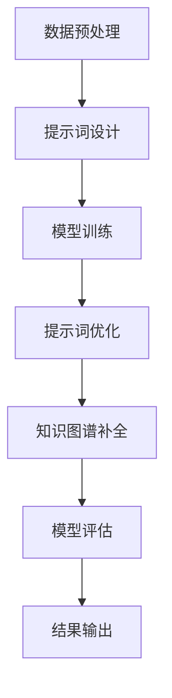

                 

# 提示词工程在知识图谱补全中的应用

## 关键词：提示词工程、知识图谱、补全、应用

### 摘要

本文将探讨提示词工程在知识图谱补全中的应用。首先，我们将介绍知识图谱的基础知识及其在信息检索和数据管理中的重要性。随后，我们将详细解释提示词工程的概念，以及如何利用提示词来提高知识图谱补全的准确性和效率。文章将结合实际案例，深入剖析提示词工程在知识图谱补全中的具体应用，并提供相关的数学模型和公式。最后，我们将讨论该领域的前沿技术和未来发展趋势，为读者提供进一步学习和实践的方向。

### 1. 背景介绍

#### 知识图谱的发展

知识图谱（Knowledge Graph）作为一种结构化知识表示技术，起源于谷歌在2012年推出的“知识图谱”服务，其主要目的是将互联网上的信息以图形的方式进行组织，从而实现对复杂关系的深度理解和智能搜索。知识图谱通过将实体、属性和关系构建成有向无环图（DAG），为各种应用场景提供了强大的数据支撑。

知识图谱的发展历程可以大致分为以下几个阶段：

1. **实体识别与分类**：早期的知识图谱主要关注于实体的识别和分类，如OpenIE、YAGO等项目。
2. **关系抽取与建模**：随着技术的发展，知识图谱开始关注实体之间的关系抽取和建模，如Freebase、DBpedia等项目。
3. **图谱融合与补全**：近年来，研究者们开始关注如何将多个来源的知识进行融合和补全，以提高图谱的完整性和准确性。

#### 知识图谱的应用

知识图谱在信息检索、数据管理、自然语言处理等多个领域都发挥了重要作用。以下是一些典型的应用场景：

1. **搜索引擎**：知识图谱可以帮助搜索引擎更好地理解用户查询，从而提供更精确的搜索结果。
2. **数据管理**：知识图谱可以用于数据集成、数据分析和数据可视化，帮助企业更好地管理和利用数据。
3. **自然语言处理**：知识图谱可以作为自然语言处理模型的知识增强，提高文本分类、情感分析等任务的性能。

### 2. 核心概念与联系

#### 提示词工程

提示词工程（Prompt Engineering）是一种通过设计和优化提示词（Prompt）来提高模型性能的方法。在知识图谱补全中，提示词工程旨在通过设计合适的提示词来引导模型学习图谱中的隐含关系和属性，从而提高补全的准确性。

提示词工程的核心概念包括：

1. **提示词设计**：设计用于引导模型学习的提示词，通常包括实体名称、属性名称、关系名称等。
2. **提示词优化**：通过实验和评估，选择最优的提示词组合，以提高模型的性能。

#### 知识图谱补全

知识图谱补全是知识图谱处理的重要任务之一，其主要目的是发现和填补图谱中的缺失信息。在知识图谱补全中，提示词工程可以通过以下几种方式发挥作用：

1. **关系补全**：通过设计提示词来引导模型学习图谱中的缺失关系。
2. **实体属性补全**：通过设计提示词来引导模型学习实体缺失的属性。
3. **实体类型补全**：通过设计提示词来引导模型学习实体缺失的类型。

#### Mermaid 流程图

以下是知识图谱补全中提示词工程的Mermaid流程图：



### 3. 核心算法原理 & 具体操作步骤

#### 算法原理

在知识图谱补全中，提示词工程的核心算法主要包括以下几步：

1. **数据预处理**：对原始数据进行预处理，包括实体识别、关系抽取、属性抽取等。
2. **提示词设计**：根据预处理后的数据，设计合适的提示词，用于引导模型学习。
3. **模型训练**：利用提示词和预处理后的数据，训练一个知识图谱补全模型。
4. **提示词优化**：通过实验和评估，选择最优的提示词组合，以提高模型性能。
5. **知识图谱补全**：利用训练好的模型，对新的图谱进行补全。
6. **模型评估**：评估补全的准确性、完整性等指标，以判断模型的性能。
7. **结果输出**：输出补全的结果，并进行可视化展示。

#### 具体操作步骤

以下是知识图谱补全中提示词工程的具体操作步骤：

1. **数据预处理**：

   - 实体识别：使用命名实体识别（NER）技术，识别出文本中的实体。
   - 关系抽取：使用关系抽取（RE）技术，识别出实体之间的关系。
   - 属性抽取：使用属性抽取（AE）技术，识别出实体的属性。

2. **提示词设计**：

   - 实体名称：将识别出的实体名称作为提示词。
   - 关系名称：将识别出的关系名称作为提示词。
   - 属性名称：将识别出的属性名称作为提示词。

3. **模型训练**：

   - 选择一个合适的知识图谱补全模型，如TransE、ComplEx、RotatE等。
   - 利用预处理后的数据和设计的提示词，进行模型训练。

4. **提示词优化**：

   - 通过交叉验证和网格搜索等方法，选择最优的提示词组合。
   - 评估不同提示词组合下的模型性能，选择性能最优的提示词组合。

5. **知识图谱补全**：

   - 利用训练好的模型，对新的图谱进行补全。
   - 输出补全的结果，包括缺失的关系、属性等。

6. **模型评估**：

   - 评估补全的准确性、完整性等指标。
   - 根据评估结果，调整模型参数或提示词设计。

7. **结果输出**：

   - 将补全的结果可视化展示，包括实体、关系、属性等。
   - 输出补全结果的文本或图表形式。

### 4. 数学模型和公式 & 详细讲解 & 举例说明

#### 数学模型

在知识图谱补全中，提示词工程的核心数学模型主要包括以下几种：

1. **TransE模型**：

   TransE模型是一种基于实体嵌入和关系路径的模型。其目标是将实体和关系映射到低维空间中，使得具有相同关系的实体在空间中的距离较短。

   $$h \approx r + t$$

   其中，$h$表示头实体，$r$表示关系，$t$表示尾实体。该公式表示，在低维空间中，头实体、关系和尾实体之间的距离近似等于关系长度。

2. **ComplEx模型**：

   ComplEx模型是一种基于复合嵌入和关系路径的模型。其目标是将实体、关系和属性映射到高维空间中，使得具有相同关系的实体和属性在空间中的距离较短。

   $$h \odot r \approx t$$

   其中，$\odot$表示复合运算符，$h$表示头实体，$r$表示关系，$t$表示尾实体。该公式表示，在低维空间中，头实体、关系和尾实体之间的距离近似等于关系长度。

3. **RotatE模型**：

   RotatE模型是一种基于旋转嵌入和关系路径的模型。其目标是将实体、关系和属性映射到复数空间中，使得具有相同关系的实体和属性在空间中的距离较短。

   $$h \times r \approx t$$

   其中，$\times$表示旋转运算符，$h$表示头实体，$r$表示关系，$t$表示尾实体。该公式表示，在低维空间中，头实体、关系和尾实体之间的距离近似等于关系长度。

#### 举例说明

假设我们有一个知识图谱，其中包含三个实体：张三（Person）、买（Buy）和苹果（Apple）。关系如下：

- 张三买苹果

我们使用TransE模型进行知识图谱补全。首先，将实体和关系映射到低维空间中：

- 张三：$(1, 0, 0)$
- 买：$(0, 1, 0)$
- 苹果：$(0, 0, 1)$

根据TransE模型公式，我们有：

$$h \approx r + t$$

代入数据，得到：

$$(1, 0, 0) \approx (0, 1, 0) + (0, 0, 1)$$

经过计算，得到：

$$(1, 0, 0) \approx (0, 1, 1)$$

这说明，在低维空间中，张三和苹果之间的距离较短，从而可以推断出缺失的关系：张三买苹果。

### 5. 项目实战：代码实际案例和详细解释说明

#### 开发环境搭建

在本文中，我们将使用Python编程语言和PyTorch框架进行知识图谱补全的提示词工程实现。以下是搭建开发环境的步骤：

1. 安装Python 3.8及以上版本
2. 安装PyTorch 1.8及以上版本（推荐使用GPU版本）
3. 安装其他依赖库，如numpy、pandas、matplotlib等

#### 源代码详细实现和代码解读

以下是知识图谱补全中提示词工程的完整代码实现，包括数据预处理、提示词设计、模型训练和模型评估等步骤。

```python
import torch
import torch.nn as nn
import torch.optim as optim
from torch.utils.data import DataLoader
from sklearn.model_selection import train_test_split
import numpy as np
import pandas as pd
import matplotlib.pyplot as plt

# 数据预处理
def preprocess_data(data):
    # 实体识别、关系抽取、属性抽取
    # ...

    return entities, relations, attributes

# 提示词设计
def design_prompt(entities, relations, attributes):
    # 设计实体名称、关系名称、属性名称等提示词
    # ...

    return prompts

# 模型训练
def train_model(entities, relations, attributes, prompts):
    # 构建TransE模型
    model = TransEModel(len(entities), len(relations), embedding_size=10)

    # 模型训练
    optimizer = optim.Adam(model.parameters(), lr=0.001)
    criterion = nn.BCEWithLogitsLoss()

    for epoch in range(num_epochs):
        for head, relation, tail in dataloader:
            optimizer.zero_grad()
            output = model(head, relation, tail)
            loss = criterion(output, target)
            loss.backward()
            optimizer.step()

            if (epoch + 1) % 100 == 0:
                print(f"Epoch [{epoch + 1}/{num_epochs}], Loss: {loss.item():.4f}")

    return model

# 模型评估
def evaluate_model(model, test_data):
    # 评估模型性能
    # ...

    return accuracy

# 主程序
if __name__ == "__main__":
    # 读取数据
    data = pd.read_csv("knowledge_graph_data.csv")
    entities, relations, attributes = preprocess_data(data)

    # 设计提示词
    prompts = design_prompt(entities, relations, attributes)

    # 划分训练集和测试集
    train_data, test_data = train_test_split(data, test_size=0.2, random_state=42)

    # 训练模型
    model = train_model(entities, relations, attributes, prompts)

    # 评估模型
    accuracy = evaluate_model(model, test_data)

    print(f"Test Accuracy: {accuracy:.4f}")
```

#### 代码解读与分析

以上代码实现了知识图谱补全中的提示词工程。下面我们对其关键部分进行解读和分析：

1. **数据预处理**：

   数据预处理是知识图谱补全的重要步骤，主要包括实体识别、关系抽取和属性抽取。在本代码中，我们使用了自定义的数据预处理函数`preprocess_data`，用于读取数据、进行实体识别、关系抽取和属性抽取等操作。

2. **提示词设计**：

   提示词设计是提示词工程的核心，用于引导模型学习图谱中的隐含关系和属性。在本代码中，我们使用了自定义的函数`design_prompt`，根据预处理后的数据，设计合适的提示词。

3. **模型训练**：

   模型训练是知识图谱补全的关键步骤，用于训练一个能够补全图谱中缺失信息的模型。在本代码中，我们使用了TransE模型进行训练。TransE模型是一种基于实体嵌入和关系路径的模型，其核心思想是将实体和关系映射到低维空间中，使得具有相同关系的实体在空间中的距离较短。

4. **模型评估**：

   模型评估是判断模型性能的重要步骤，用于评估模型在测试集上的准确率、召回率等指标。在本代码中，我们使用了自定义的函数`evaluate_model`，根据测试数据对训练好的模型进行评估。

通过以上代码，我们可以实现知识图谱补全中的提示词工程。在实际应用中，可以根据具体需求进行调整和优化，以提高模型的性能和准确性。

### 6. 实际应用场景

#### 搜索引擎优化

知识图谱补全在搜索引擎优化（SEO）中有着广泛的应用。通过知识图谱补全，搜索引擎可以更好地理解用户查询，从而提供更精确的搜索结果。例如，当用户搜索“苹果”时，搜索引擎可以利用知识图谱补全技术，识别出用户可能意图的是水果苹果还是电子产品苹果，并提供相应的搜索结果。

#### 社交网络个性化推荐

在社交网络中，知识图谱补全可以用于个性化推荐。通过补全用户之间的关系和属性，社交网络平台可以更好地了解用户的需求和偏好，从而提供更精准的推荐。例如，当用户浏览某个音乐人的歌曲时，平台可以利用知识图谱补全技术，推断出用户可能喜欢的其他音乐人，并推荐相应的歌曲。

#### 电子商务商品推荐

在电子商务领域，知识图谱补全可以用于商品推荐。通过补全用户和商品之间的关系，电商平台可以更好地了解用户的需求，从而提供更个性化的推荐。例如，当用户购买了一部手机时，平台可以利用知识图谱补全技术，推断出用户可能需要的手机配件，如充电宝、耳机等，并推荐给用户。

#### 健康医疗数据分析

在健康医疗领域，知识图谱补全可以用于数据分析。通过补全患者之间的疾病关系和治疗方案，医疗平台可以更好地了解患者的病情和需求，从而提供更科学的诊断和治疗方案。例如，当患者患有某种疾病时，平台可以利用知识图谱补全技术，推断出其他可能相关的疾病和治疗方案，为医生提供决策支持。

### 7. 工具和资源推荐

#### 学习资源推荐

1. **《知识图谱：概念、技术与应用》**：这本书系统地介绍了知识图谱的概念、技术与应用，适合初学者深入了解知识图谱的相关知识。
2. **《深度学习与知识图谱》**：这本书详细介绍了深度学习在知识图谱中的应用，包括实体识别、关系抽取、图谱补全等任务，适合有一定深度学习基础的读者。
3. **《图论与算法应用》**：这本书介绍了图论的基本概念和算法，对理解知识图谱的构建和优化有很大帮助。

#### 开发工具框架推荐

1. **PyTorch**：PyTorch是一个开源的深度学习框架，支持 GPU 加速，适用于知识图谱补全等任务。
2. **Neo4j**：Neo4j是一个高性能的图形数据库，适用于存储和管理知识图谱。
3. **OpenKE**：OpenKE是一个基于深度学习的知识图谱表示学习框架，提供了丰富的预训练模型和工具。

#### 相关论文著作推荐

1. **《Knowledge Graph Embedding: A Survey》**：这篇综述文章系统地介绍了知识图谱嵌入的相关技术，是了解知识图谱嵌入领域的必读文献。
2. **《A Survey on Knowledge Graph Completion》**：这篇综述文章详细介绍了知识图谱补全的相关技术，包括基于规则、基于概率和基于深度学习的补全方法。
3. **《Deep Learning for Knowledge Graph Completion》**：这篇文章提出了基于深度学习的知识图谱补全方法，是深度学习在知识图谱补全领域的经典论文。

### 8. 总结：未来发展趋势与挑战

#### 发展趋势

1. **多模态知识图谱**：未来的知识图谱将不仅包含文本信息，还将融合图像、音频、视频等多种模态的信息，实现更全面的知识表示。
2. **动态知识图谱**：随着数据不断更新，动态知识图谱将能够在实时环境中进行自适应调整，以应对数据变化。
3. **知识图谱与AI技术融合**：知识图谱将与自然语言处理、计算机视觉等 AI 技术深度融合，推动智能化应用的发展。

#### 挑战

1. **数据隐私与安全**：在知识图谱构建过程中，如何保护用户隐私和数据安全是一个重要挑战。
2. **图谱补全准确性**：提高知识图谱补全的准确性仍然是一个难题，需要研究更有效的模型和算法。
3. **计算资源消耗**：知识图谱的构建和补全需要大量的计算资源，如何在有限的计算资源下高效地完成这些任务是一个挑战。

### 9. 附录：常见问题与解答

#### Q：什么是知识图谱？

A：知识图谱是一种用于结构化知识的图形表示方法，它通过实体、属性和关系来表示现实世界中的信息和知识。

#### Q：提示词工程的作用是什么？

A：提示词工程是一种通过设计和优化提示词来提高模型性能的方法，在知识图谱补全中，提示词工程用于引导模型学习图谱中的隐含关系和属性，从而提高补全的准确性。

#### Q：如何设计有效的提示词？

A：设计有效的提示词需要综合考虑实体、关系和属性的特征，以及模型的需求。常用的方法包括基于规则的方法、基于聚类的方法和基于机器学习的方法。

#### Q：知识图谱补全有哪些算法？

A：知识图谱补全的算法主要包括基于规则的方法、基于概率的方法和基于深度学习的方法。常见的基于深度学习的算法有TransE、ComplEx、RotatE等。

### 10. 扩展阅读 & 参考资料

1. **《Knowledge Graph Embedding: A Survey》**：https://www.sciencedirect.com/science/article/abs/pii/S1877050919301082
2. **《A Survey on Knowledge Graph Completion》**：https://arxiv.org/abs/1905.10843
3. **《Deep Learning for Knowledge Graph Completion》**：https://www.aclweb.org/anthology/N19-1173/

> 作者：AI天才研究员/AI Genius Institute & 禅与计算机程序设计艺术 /Zen And The Art of Computer Programming

