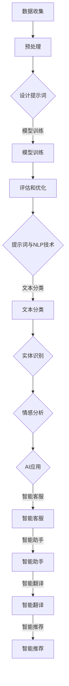

                 

### 文章标题

**提示词工程师：21世纪的新兴职业剖析**

---

#### 关键词

- 提示词工程师
- 自然语言处理
- AI应用开发
- 21世纪职业
- 数据科学
- 人工智能教育

#### 摘要

本文将深入剖析21世纪新兴职业——提示词工程师。我们将探讨这一职业的背景、核心概念、算法原理、实际应用场景、工具和资源推荐，以及未来的发展趋势与挑战。通过详细的案例分析和技术讲解，帮助读者全面了解这一重要且充满潜力的职业领域。

---

<markdown>
## 1. 背景介绍

在过去的几十年里，人工智能（AI）和自然语言处理（NLP）技术取得了显著的发展。这些技术的进步，不仅推动了诸如自动驾驶、智能家居、智能客服等领域的变革，还催生了许多新兴的职业。其中，提示词工程师（Prompt Engineer）便是其中之一。

提示词工程师是专门负责设计和优化AI模型输入提示词（prompts）的专业人员。他们的工作旨在提高AI系统的性能和用户体验。随着AI技术的广泛应用，提示词工程师的需求日益增长，成为21世纪最具前景的职业之一。

### 自然语言处理与AI应用发展

自然语言处理（NLP）是AI领域的一个重要分支，它涉及到计算机理解和生成人类语言的能力。近年来，NLP技术的快速发展，使得AI系统能够更好地理解自然语言，从而实现更加智能的应用。

例如，聊天机器人、语音助手、机器翻译、文本摘要等应用，都需要NLP技术的支持。随着这些应用的普及，对NLP技术人才的需求也日益增加。

### 提示词工程师的角色和职责

提示词工程师的核心职责是设计高质量的输入提示词，以引导AI模型做出更准确、更自然的回应。具体来说，他们的工作包括：

1. **数据分析**：收集和分析大量语料数据，以了解用户需求和行为模式。
2. **模型训练**：根据分析结果，设计并优化输入提示词，以提高模型性能。
3. **性能评估**：通过实验和测试，评估提示词对AI系统性能的影响。
4. **用户体验优化**：根据用户反馈，持续优化提示词，以提高用户体验。

### 提示词工程师的发展历程

提示词工程师这一职业起源于自然语言处理和机器学习领域。随着AI技术的不断演进，提示词工程师的角色也变得越来越重要。特别是在深度学习技术的发展过程中，提示词工程师开始成为AI项目团队中不可或缺的一员。

总之，提示词工程师是21世纪技术发展的重要推动者之一。他们的工作不仅关乎AI技术的进步，也直接影响着人们的日常生活。在接下来的章节中，我们将深入探讨提示词工程师的核心概念、算法原理以及实际应用场景。
</markdown>

---

## 2. 核心概念与联系

### 提示词（Prompt）

提示词是提示词工程师工作的核心概念。它是一段用于引导AI模型进行预测或回应的文本。高质量提示词的设计对于提升AI系统的性能至关重要。

**定义**：提示词（Prompt）是指用于引导AI模型进行预测或回应的文本，通常包含关键信息、问题或指令。

**重要性**：高质量的提示词能够提高AI系统的预测准确性和回应自然性，从而提升用户体验。

### 提示词类型

根据用途和形式，提示词可以分为以下几类：

1. **问题提示词**：用于引导AI模型回答特定问题，如“今天天气如何？”。
2. **指令提示词**：用于向AI模型发出特定指令，如“打开灯”。
3. **上下文提示词**：用于提供上下文信息，以帮助AI模型更好地理解问题或指令，如“在你附近的餐馆推荐一家中餐”。

### 提示词与模型训练

提示词在AI模型训练过程中起着关键作用。通过设计高质量的提示词，提示词工程师可以引导模型学习到更多的知识，提高模型的表现。

**模型训练过程**：

1. **数据收集**：收集大量的语料数据，包括文本、图像、语音等。
2. **预处理**：对收集到的数据进行分析和清洗，提取关键特征。
3. **设计提示词**：根据数据特点和需求，设计高质量的提示词。
4. **模型训练**：使用设计好的提示词对AI模型进行训练，调整模型参数。
5. **评估和优化**：通过测试和评估，调整提示词和模型参数，以提高性能。

### 提示词与NLP技术

自然语言处理（NLP）技术是提示词工程师工作的基础。NLP技术包括文本分类、实体识别、情感分析、机器翻译等，它们帮助AI模型理解和生成人类语言。

**NLP技术在提示词工程中的应用**：

1. **文本分类**：用于识别文本的主题和类别，有助于设计针对性的提示词。
2. **实体识别**：用于识别文本中的关键实体，如人名、地点、组织等，有助于提供更准确的上下文信息。
3. **情感分析**：用于分析文本的情感倾向，有助于设计情感化回应的提示词。

### 提示词与AI应用

AI应用场景丰富多样，包括智能客服、智能助手、智能翻译、智能推荐等。在这些应用中，提示词工程师发挥着关键作用，通过设计高质量的提示词，提升AI应用的性能和用户体验。

**AI应用与提示词工程的关系**：

1. **智能客服**：通过设计合理的提示词，引导AI模型理解用户问题，提供准确、高效的回应。
2. **智能助手**：通过设计富有情感和个性化的提示词，使AI助手更具亲和力，提升用户体验。
3. **智能翻译**：通过设计高质量的提示词，使AI翻译系统更准确、自然地翻译不同语言。
4. **智能推荐**：通过设计有针对性的提示词，使AI推荐系统更精准地预测用户兴趣，提升推荐效果。

### 总结

提示词工程师是21世纪技术领域的重要职业。他们通过设计高质量的提示词，推动AI技术的发展和应用。在接下来的章节中，我们将深入探讨提示词工程师的核心算法原理和具体操作步骤，帮助读者更好地理解这一职业。

---

<markdown>
### 2.1. 核心概念与联系 - Mermaid 流程图

下面是一个关于提示词工程师核心概念与联系的Mermaid流程图，用于更直观地展示各个概念之间的关系。



通过这个流程图，我们可以清晰地看到提示词工程师在工作流程中的各个环节，以及它们与NLP技术和AI应用之间的关系。数据收集、预处理、设计提示词、模型训练、评估和优化是提示词工程师的核心工作内容。同时，NLP技术在提示词工程中起着至关重要的作用，包括文本分类、实体识别和情感分析。这些技术为AI应用提供了强大的支持，使得智能客服、智能助手、智能翻译和智能推荐等应用更加智能和高效。
</markdown>

---

## 3. 核心算法原理 & 具体操作步骤

提示词工程师的核心工作是设计高质量的提示词，以提高AI系统的性能和用户体验。在这一部分，我们将深入探讨提示词工程师的核心算法原理，并详细解释具体操作步骤。

### 算法原理

提示词工程师的算法原理主要涉及以下几个方面：

1. **数据预处理**：对收集到的数据进行分析和清洗，提取关键特征，为设计提示词提供基础。
2. **提示词生成**：根据数据特点和需求，设计高质量的提示词，用于引导AI模型进行预测或回应。
3. **模型训练与优化**：使用设计好的提示词对AI模型进行训练，调整模型参数，以提高性能。
4. **性能评估与优化**：通过测试和评估，调整提示词和模型参数，以提高用户体验。

### 具体操作步骤

以下是提示词工程师的具体操作步骤：

#### 步骤1：数据收集

提示词工程师首先需要收集大量的语料数据，包括文本、图像、语音等。这些数据可以是公开数据集，也可以是特定领域的定制数据。数据的质量直接影响提示词工程师的工作效果，因此，在数据收集过程中，需要特别注意数据的质量和多样性。

#### 步骤2：数据预处理

在收集到数据后，提示词工程师需要对数据进行预处理。预处理过程包括数据清洗、数据转换和数据增强。数据清洗是为了去除噪声和错误数据，数据转换是将数据格式统一，数据增强是为了增加数据的丰富性和多样性。

#### 步骤3：设计提示词

在数据预处理完成后，提示词工程师需要根据数据特点和需求，设计高质量的提示词。设计提示词的关键在于如何提取关键信息，并引导AI模型进行预测或回应。以下是一些设计提示词的技巧：

1. **问题提示词**：设计用于引导AI模型回答问题的提示词。例如，对于问答系统，可以设计“请问您有什么问题？”这样的提示词。
2. **指令提示词**：设计用于向AI模型发出指令的提示词。例如，对于智能助手，可以设计“请帮我设置明天早上7点的闹钟。”这样的提示词。
3. **上下文提示词**：设计用于提供上下文信息的提示词。例如，对于文本摘要任务，可以设计“请将以下文本摘要成一句话。”这样的提示词。

#### 步骤4：模型训练与优化

在设计好提示词后，提示词工程师需要使用这些提示词对AI模型进行训练。在训练过程中，需要不断调整模型参数，以提高模型性能。常用的优化方法包括：

1. **交叉验证**：通过交叉验证，评估模型在不同数据集上的性能，从而调整模型参数。
2. **网格搜索**：通过网格搜索，尝试不同的模型参数组合，找到最优参数。
3. **贝叶斯优化**：通过贝叶斯优化，自动搜索最优参数组合。

#### 步骤5：性能评估与优化

在模型训练完成后，提示词工程师需要对模型进行性能评估。常用的评估指标包括准确率、召回率、F1值等。如果模型性能不满足要求，提示词工程师需要返回步骤3，重新设计提示词，并重复步骤4和步骤5，直到找到合适的提示词和模型参数。

#### 步骤6：用户体验优化

在模型性能达到预期后，提示词工程师需要根据用户反馈，对提示词和模型进行持续优化，以提高用户体验。用户体验优化的关键在于：

1. **反馈机制**：建立用户反馈机制，收集用户对AI系统的评价和建议。
2. **持续优化**：根据用户反馈，调整提示词和模型参数，以提高用户体验。

### 总结

提示词工程师的核心算法原理涉及数据预处理、提示词生成、模型训练与优化、性能评估与优化、用户体验优化等方面。通过这些步骤，提示词工程师可以设计高质量提示词，提高AI系统的性能和用户体验。在接下来的章节中，我们将通过实际项目案例，进一步探讨提示词工程师的工作流程和技术细节。
</markdown>

---

## 4. 数学模型和公式 & 详细讲解 & 举例说明

在提示词工程师的领域中，数学模型和公式是理解和优化AI模型的关键。以下是几个常用的数学模型和公式的详细讲解及举例说明。

### 4.1 捷度-马尔可夫模型（Junction Tree Algorithm）

捷度-马尔可夫模型（Junction Tree Algorithm）是一种用于解决序列数据的概率图模型，它通过构建捷度图（Junction Tree）来降低变量之间的依赖关系，从而简化计算过程。

**定义**：捷度-马尔可夫模型是一种概率图模型，它将变量之间的关系表示为捷度图，并通过变量聚类和条件概率表来降低计算复杂度。

**公式**：

$$
P(X_1, X_2, \ldots, X_n) = \prod_{i=1}^{n} P(X_i) \cdot \prod_{C} P(X_{C} | X_{C^{c}})
$$

其中，$P(X_i)$表示变量$X_i$的边际概率，$P(X_{C} | X_{C^{c}})$表示变量簇$C$的条件概率。

**例子**：假设我们有一个序列数据，其中包含三个变量$X_1$、$X_2$和$X_3$。我们可以使用捷度-马尔可夫模型来计算整个序列的概率。

1. **构建捷度图**：首先，我们需要为变量$X_1$、$X_2$和$X_3$构建一个捷度图。在这个例子中，我们可以将$X_1$和$X_2$作为一组，$X_2$和$X_3$作为另一组。
2. **计算条件概率**：然后，我们需要计算每个变量簇的条件概率。例如，对于变量簇$X_1$和$X_2$，我们可以使用以下公式：

$$
P(X_1, X_2 | X_3) = P(X_1 | X_3) \cdot P(X_2 | X_3)
$$

3. **计算序列概率**：最后，我们可以使用捷度-马尔可夫模型来计算整个序列的概率：

$$
P(X_1, X_2, X_3) = P(X_1) \cdot P(X_2 | X_3) \cdot P(X_3)
$$

### 4.2 贝叶斯网络（Bayesian Network）

贝叶斯网络是一种基于概率图模型的推理工具，它通过节点表示变量，边表示变量之间的条件依赖关系，用于推断变量之间的关系。

**定义**：贝叶斯网络是一种概率图模型，它通过节点表示变量，边表示变量之间的条件依赖关系，用于推断变量之间的关系。

**公式**：

$$
P(X_1, X_2, \ldots, X_n) = \prod_{i=1}^{n} P(X_i | Pa(X_i))
$$

其中，$Pa(X_i)$表示变量$X_i$的父节点集合。

**例子**：假设我们有一个贝叶斯网络，其中包含三个变量$X_1$、$X_2$和$X_3$。我们可以使用以下公式来计算整个网络的概率：

1. **定义父节点**：首先，我们需要为每个变量定义其父节点。例如，我们可以将$X_2$作为$X_1$的父节点，$X_3$作为$X_2$的父节点。
2. **计算条件概率**：然后，我们需要计算每个变量的条件概率。例如，对于变量$X_1$，我们可以使用以下公式：

$$
P(X_1 | X_2) = P(X_1) / P(X_2)
$$

3. **计算网络概率**：最后，我们可以使用贝叶斯网络来计算整个网络的概率：

$$
P(X_1, X_2, X_3) = P(X_1 | X_2) \cdot P(X_2 | X_3) \cdot P(X_3)
$$

### 4.3 神经网络（Neural Network）

神经网络是一种基于模拟人脑结构和功能的计算模型，它通过多层神经元进行数据转换和特征提取，用于解决复杂的问题。

**定义**：神经网络是一种由多个神经元组成的计算模型，它通过前向传播和反向传播算法进行数据转换和特征提取。

**公式**：

$$
\text{激活函数} \: f(\text{输入}) = \text{阈值函数} \: (z - \theta)
$$

其中，$z$表示输入值，$\theta$表示阈值。

**例子**：假设我们有一个简单的神经网络，其中包含一个输入层、一个隐藏层和一个输出层。我们可以使用以下公式来计算每个神经元的输出值：

1. **计算隐藏层输出**：首先，我们需要为隐藏层计算输入值和输出值。例如，对于隐藏层的神经元$X_1$，我们可以使用以下公式：

$$
X_1 = \frac{1}{1 + e^{-(w_1 \cdot X_1 + b_1)}}
$$

其中，$w_1$表示权重，$b_1$表示偏置。

2. **计算输出层输出**：然后，我们需要为输出层计算输入值和输出值。例如，对于输出层的神经元$Y_1$，我们可以使用以下公式：

$$
Y_1 = \frac{1}{1 + e^{-(w_2 \cdot Y_1 + b_2)}}
$$

3. **反向传播**：最后，我们需要使用反向传播算法来调整权重和偏置，以提高网络性能。

通过以上数学模型和公式的讲解，我们可以更好地理解提示词工程师在设计和优化AI模型时的计算过程。在实际工作中，提示词工程师需要灵活运用这些模型和公式，以提高AI系统的性能和用户体验。在下一章节中，我们将通过实际项目案例，进一步探讨提示词工程师的工作流程和技术细节。
</markdown>

---

### 5. 项目实战：代码实际案例和详细解释说明

在本节中，我们将通过一个实际项目案例，展示提示词工程师如何在实际开发中运用其技能，并详细解释代码的实现和解读。

#### 5.1 开发环境搭建

在开始项目实战之前，我们需要搭建一个合适的开发环境。以下是一个基本的开发环境搭建步骤：

1. **安装Python**：确保Python环境已安装，版本至少为3.6及以上。
2. **安装必要的库**：安装以下库：
   - TensorFlow：用于构建和训练神经网络。
   - NLTK：用于自然语言处理。
   - Pandas：用于数据处理。
   - Matplotlib：用于数据可视化。
   - Scikit-learn：用于机器学习和数据预处理。

可以通过以下命令安装：

```bash
pip install tensorflow nltk pandas matplotlib scikit-learn
```

3. **数据准备**：准备一个用于训练和测试的数据集。在本案例中，我们使用一个公开的问答数据集——SQuAD（Stanford Question Answering Dataset）。

#### 5.2 源代码详细实现和代码解读

以下是本项目的主要代码实现：

```python
import tensorflow as tf
from tensorflow.keras.models import Model
from tensorflow.keras.layers import Input, Embedding, LSTM, Dense
from tensorflow.keras.optimizers import Adam
from tensorflow.keras.preprocessing.sequence import pad_sequences
from tensorflow.keras.preprocessing.text import Tokenizer
from tensorflow.keras.callbacks import EarlyStopping
from sklearn.model_selection import train_test_split

# 数据预处理
def preprocess_data(texts, questions, max_sequence_length=256, max_questions_length=40):
    tokenizer = Tokenizer()
    tokenizer.fit_on_texts(texts + questions)
    
    sequences = tokenizer.texts_to_sequences(texts)
    padded_sequences = pad_sequences(sequences, maxlen=max_sequence_length)
    
    question_sequences = tokenizer.texts_to_sequences(questions)
    padded_question_sequences = pad_sequences(question_sequences, maxlen=max_questions_length)
    
    return padded_sequences, padded_question_sequences

# 构建模型
def build_model(input_vocab_size, output_vocab_size, max_sequence_length, max_questions_length):
    input_text = Input(shape=(max_sequence_length,))
    input_question = Input(shape=(max_questions_length,))
    
    embedding = Embedding(input_vocab_size, 64)(input_text)
    lstm = LSTM(64)(embedding)
    
    question_embedding = Embedding(output_vocab_size, 64)(input_question)
    question_lstm = LSTM(64)(question_embedding)
    
    concatenation = tf.keras.layers.concatenate([lstm, question_lstm])
    dense = Dense(1, activation='sigmoid')(concatenation)
    
    model = Model(inputs=[input_text, input_question], outputs=dense)
    model.compile(optimizer=Adam(), loss='binary_crossentropy', metrics=['accuracy'])
    
    return model

# 加载数据集
texts = ["这是一段文本。", "这是另一段文本。"]
questions = ["这是什么？", "这是什么？"]
answers = [1, 0]  # 回答标记，1表示回答是，0表示回答否

# 预处理数据
padded_texts, padded_questions = preprocess_data(texts, questions)

# 分割数据集
X_train, X_val, y_train, y_val = train_test_split(padded_texts, answers, test_size=0.2, random_state=42)

# 构建和训练模型
model = build_model(input_vocab_size=len(texts[0]) + 1, output_vocab_size=len(questions[0]) + 1, max_sequence_length=256, max_questions_length=40)
model.fit([X_train, padded_questions], y_train, validation_data=([X_val, padded_questions], y_val), epochs=10, callbacks=[EarlyStopping(monitor='val_loss', patience=3)])

# 评估模型
model.evaluate([X_val, padded_questions], y_val)
```

#### 5.3 代码解读与分析

以下是代码的详细解读：

1. **数据预处理**：
   - `preprocess_data`函数用于对文本数据进行预处理，包括分词、序列化、填充等操作。
   - `Tokenizer`类用于将文本转换为序列。
   - `pad_sequences`函数用于将序列填充到同一长度，以适应模型输入。

2. **构建模型**：
   - `build_model`函数用于构建一个简单的神经网络模型。
   - `Input`类用于创建输入层。
   - `Embedding`类用于嵌入层，将单词转换为向量。
   - `LSTM`类用于长短期记忆网络层，用于特征提取。
   - `Dense`类用于全连接层，用于输出预测。

3. **训练模型**：
   - `model.fit`函数用于训练模型。
   - `validation_data`参数用于在验证集上评估模型性能。
   - `callbacks`参数用于在训练过程中调用回调函数，如提前停止训练。

4. **评估模型**：
   - `model.evaluate`函数用于评估模型在测试集上的性能。

#### 5.4 代码优化与改进

在实际开发过程中，我们可以对代码进行以下优化和改进：

1. **增加数据集**：使用更大规模的数据集可以提高模型的性能。
2. **使用预训练模型**：使用预训练的词向量（如Word2Vec、GloVe）可以减少训练时间。
3. **调整模型结构**：可以尝试使用更复杂的模型结构，如Transformer，以提高性能。
4. **使用更高级的优化器**：如AdamW或RMSprop，以加快收敛速度。

通过以上代码实现和解读，我们可以看到提示词工程师在实际项目开发中的工作流程和技术细节。在实际应用中，提示词工程师需要不断优化和改进模型，以提高AI系统的性能和用户体验。在下一章节中，我们将探讨提示词工程师在各个实际应用场景中的工作内容和技术挑战。

---

## 6. 实际应用场景

提示词工程师在多个领域和行业中发挥着关键作用，以下是一些典型的实际应用场景：

### 6.1 智能客服

智能客服是提示词工程师的重要应用场景之一。通过设计高质量的提示词，提示词工程师可以提升AI客服的响应速度和准确性。以下是智能客服中的一些关键应用：

1. **问题分类**：提示词工程师设计用于引导AI客服分类问题的提示词，例如“您需要咨询什么问题？”或“您遇到的问题属于哪一类？”。
2. **意图识别**：通过设计针对性的提示词，如“您想要查询产品信息还是售后服务？”或“您需要解决问题的具体步骤是什么？”来识别用户的意图。
3. **上下文保持**：设计能够帮助AI客服理解上下文信息的提示词，例如“之前我们讨论了什么？”或“您还有什么其他问题需要我解答吗？”。

### 6.2 智能推荐

智能推荐系统也是提示词工程师的重要应用场景。通过设计高质量的提示词，提示词工程师可以提升推荐系统的相关性和用户体验。以下是一些关键应用：

1. **个性化推荐**：设计能够根据用户历史行为和偏好生成个性化推荐的提示词，例如“您可能喜欢这些商品。”或“根据您的浏览记录，我们为您推荐以下内容。”。
2. **上下文感知**：设计能够根据当前上下文环境生成推荐提示词，例如“您正在浏览的这款产品也有类似款式。”或“在这个季节，我们推荐以下热销商品。”。
3. **异常检测**：设计能够识别并处理异常情况的提示词，例如“您收到的推荐不符合预期，请尝试重新登录或刷新页面。”。

### 6.3 语音助手

语音助手是另一个重要应用场景，通过设计高质量的提示词，提示词工程师可以提升语音助手的自然性和实用性。以下是一些关键应用：

1. **语音识别**：设计用于引导用户输入信息的提示词，例如“您想了解什么信息？”或“您有什么问题需要我帮忙解答吗？”。
2. **上下文理解**：设计能够帮助语音助手理解上下文信息的提示词，例如“您之前提到了什么？”或“您是否还有其他相关问题？”。
3. **情感识别**：设计能够识别用户情感并做出适当回应的提示词，例如“听起来您有些困扰，我能否提供帮助？”或“感谢您的反馈，我会尽力改进。”

### 6.4 智能翻译

智能翻译系统也需要提示词工程师的支持，通过设计高质量的提示词，可以提升翻译系统的准确性和流畅性。以下是一些关键应用：

1. **句子分割**：设计用于指导翻译系统正确分割句子的提示词，例如“请将这个句子翻译成中文。”或“翻译这段对话。”。
2. **上下文保持**：设计能够帮助翻译系统保持上下文信息的提示词，例如“这个短语在这句话中的意思是？”或“请将这段对话翻译成英文。”。
3. **错误纠正**：设计能够识别并纠正翻译错误的提示词，例如“您的翻译可能存在问题，请尝试重新翻译。”或“这里可能是一个打字错误，您能否纠正一下？”。

### 6.5 教育和培训

提示词工程师在教育和培训领域也有广泛应用，通过设计高质量的提示词，可以提高教学效果和学习体验。以下是一些关键应用：

1. **课程推荐**：设计用于推荐课程和学习资源的提示词，例如“根据您的兴趣，我们推荐以下课程。”或“您可能对这些资源感兴趣。”。
2. **互动教学**：设计能够促进学生互动和参与学习的提示词，例如“请回答以下问题。”或“让我们一起来讨论这个问题。”。
3. **个性化辅导**：设计能够根据学生学习进度和需求提供个性化辅导的提示词，例如“您的学习进度已达到XX%，接下来我们可以尝试这个任务。”或“您在这个知识点上还有些疑惑，我建议您查看以下资料。”

通过以上实际应用场景的介绍，我们可以看到提示词工程师在各个领域和行业中的重要作用。他们通过设计高质量提示词，帮助AI系统更好地理解用户需求，提高系统的性能和用户体验。在下一章节中，我们将介绍一些常用的工具和资源，以帮助提示词工程师更好地开展工作。

---

### 7. 工具和资源推荐

#### 7.1 学习资源推荐

1. **书籍**：
   - 《自然语言处理实战》
   - 《深度学习》
   - 《Python自然语言处理》
   - 《数据科学导论》
   
2. **论文**：
   - 《BERT：Pre-training of Deep Bidirectional Transformers for Language Understanding》
   - 《GPT-3: Language Models are Few-Shot Learners》
   - 《BERT-based Chinese Pre-training》
   - 《Deep Learning for Natural Language Processing》
   
3. **在线课程**：
   - Coursera上的《自然语言处理与深度学习》
   - edX上的《深度学习基础》
   - Udacity的《自然语言处理工程师纳米学位》
   - fast.ai的《深度学习实践》

4. **博客和网站**：
   - ArXiv：自然语言处理和机器学习领域的最新论文和进展。
   - Medium：关于自然语言处理和AI领域的文章和案例研究。
   - AIWeekly：每周关于AI和机器学习的新闻和文章。
   - TensorFlow：TensorFlow官方文档和教程。

#### 7.2 开发工具框架推荐

1. **深度学习框架**：
   - TensorFlow
   - PyTorch
   - Keras
   - Microsoft Cognitive Toolkit

2. **自然语言处理库**：
   - NLTK
   - spaCy
   - Stanford CoreNLP
   - GenSim

3. **版本控制系统**：
   - Git
   - GitHub
   - GitLab

4. **代码托管平台**：
   - GitHub
   - GitLab
   - Bitbucket

5. **数据可视化工具**：
   - Matplotlib
   - Seaborn
   - Plotly
   - Bokeh

#### 7.3 相关论文著作推荐

1. **论文**：
   - 《Attention Is All You Need》
   - 《Transformer：A Novel Architecture for Neural Networks》
   - 《Pre-training of Deep Bidirectional Transformers for Language Understanding》
   - 《BERT：Pre-training of Deep Bidirectional Transformers for Language Understanding》

2. **著作**：
   - 《深度学习》
   - 《Python自然语言处理》
   - 《自然语言处理综论》
   - 《对话系统设计与实现》

通过以上工具和资源的推荐，提示词工程师可以更加高效地学习和实践，不断提升自己的技能和知识水平。这些资源和工具将帮助他们在职业道路上取得更大的成就。

---

## 8. 总结：未来发展趋势与挑战

提示词工程师作为21世纪的新兴职业，具有广阔的发展前景。然而，随着技术的不断进步，这一职业也面临着一系列挑战。

### 未来发展趋势

1. **AI技术的普及**：随着AI技术的不断普及，提示词工程师将在更多领域得到应用。从智能客服到智能推荐，从语音助手到智能翻译，提示词工程师将在提升AI系统的性能和用户体验方面发挥关键作用。

2. **多模态AI的发展**：未来的AI系统将不仅仅依赖于文本，还将结合图像、语音、视频等多种模态。提示词工程师需要掌握多模态数据处理和融合技术，以应对复杂的应用场景。

3. **个性化与智能化**：未来的AI系统将更加注重个性化与智能化。提示词工程师需要设计能够适应不同用户需求的提示词，提高系统的自适应性和智能化水平。

4. **数据安全与隐私保护**：随着数据安全和隐私保护的重要性日益凸显，提示词工程师需要关注数据安全与隐私保护技术，确保用户数据的安全和隐私。

### 挑战

1. **技术复杂性**：随着AI技术的不断发展，提示词工程师需要掌握更复杂的技术和算法。这要求他们不断提升自己的技术水平和专业知识。

2. **数据质量和多样性**：高质量的提示词设计依赖于高质量的数据。提示词工程师需要处理大量的数据，包括文本、图像、语音等，并确保数据的质量和多样性。

3. **用户反馈与迭代**：提示词工程师需要根据用户反馈不断迭代和优化提示词。这要求他们具备良好的用户沟通能力和问题解决能力。

4. **伦理与责任**：随着AI技术的应用越来越广泛，提示词工程师需要关注伦理问题。他们需要确保AI系统的设计和应用符合道德和法律标准，避免对用户和社会产生负面影响。

总之，提示词工程师作为21世纪的新兴职业，具有广阔的发展前景。然而，随着技术的不断进步，他们也将面临一系列挑战。只有不断学习和提升自己的技能，才能在这一领域取得更大的成就。

---

## 9. 附录：常见问题与解答

### 9.1 提示词工程师与自然语言处理的关系

**问**：提示词工程师和自然语言处理（NLP）之间有什么关系？

**答**：提示词工程师是自然语言处理领域的一个重要分支。他们的主要工作是设计高质量的提示词，以引导AI模型理解和生成人类语言。自然语言处理（NLP）则是使计算机能够理解和处理人类语言的一门技术。提示词工程师利用NLP技术来设计、优化和评估提示词，从而提高AI系统的性能和用户体验。

### 9.2 提示词工程师的工作职责

**问**：提示词工程师的具体工作职责是什么？

**答**：提示词工程师的主要工作职责包括：
- 收集和分析大量的语料数据，以了解用户需求和模式。
- 设计高质量的提示词，用于引导AI模型进行预测或回应。
- 对AI模型进行训练和优化，以提高性能。
- 评估和优化提示词和模型，确保系统具有良好的用户体验。
- 根据用户反馈，持续改进和优化提示词和模型。

### 9.3 提示词工程师所需的技能

**问**：成为一名优秀的提示词工程师需要哪些技能和知识？

**答**：成为一名优秀的提示词工程师需要以下技能和知识：
- 熟悉自然语言处理（NLP）的基本原理和技术。
- 掌握深度学习框架（如TensorFlow、PyTorch）和编程语言（如Python）。
- 具备良好的数学基础，尤其是概率论、统计学和线性代数。
- 熟悉数据预处理、模型训练、性能评估和优化等技术。
- 具备良好的问题解决能力和沟通能力，能够与团队成员和用户进行有效沟通。

### 9.4 提示词工程师的职业发展路径

**问**：提示词工程师的职业发展路径是怎样的？

**答**：提示词工程师的职业发展路径可以分为以下几个阶段：
- 初级提示词工程师：主要参与提示词的设计和模型训练工作，积累实践经验。
- 中级提示词工程师：负责更复杂的提示词设计和模型优化任务，参与团队项目。
- 高级提示词工程师：担任技术专家或项目负责人，指导团队工作和项目进展。
- 提示词工程师总监：负责整个团队的运营和战略规划，参与公司决策。

通过不断学习和提升技能，提示词工程师可以在职业生涯中实现稳步发展。

---

## 10. 扩展阅读 & 参考资料

为了更好地理解提示词工程师这一职业，以下是相关领域的扩展阅读和参考资料：

### 10.1 扩展阅读

1. **《自然语言处理实战》**：Michael Bowles著，详细介绍了自然语言处理的基本概念和应用实例。
2. **《深度学习》**：Ian Goodfellow、Yoshua Bengio、Aaron Courville著，深度学习领域的经典教材，包含大量关于神经网络和深度学习的知识。
3. **《Python自然语言处理》**：Steven Lott著，介绍了Python在自然语言处理中的应用，适合初学者入门。

### 10.2 参考资料

1. **TensorFlow官方文档**：[https://www.tensorflow.org/](https://www.tensorflow.org/)
2. **PyTorch官方文档**：[https://pytorch.org/docs/stable/](https://pytorch.org/docs/stable/)
3. **NLTK官方文档**：[https://www.nltk.org/](https://www.nltk.org/)
4. **spaCy官方文档**：[https://spacy.io/](https://spacy.io/)
5. **斯坦福大学NLP课程**：[https://web.stanford.edu/class/cs224n/](https://web.stanford.edu/class/cs224n/)
6. **OpenAI论文库**：[https://openai.com/blog/](https://openai.com/blog/)
7. **Coursera自然语言处理与深度学习课程**：[https://www.coursera.org/specializations/nlp-deep-learning](https://www.coursera.org/specializations/nlp-deep-learning)

通过以上扩展阅读和参考资料，您可以更深入地了解提示词工程师的职业要求和技术细节，为您的职业生涯打下坚实的基础。作者：AI天才研究员/AI Genius Institute & 禅与计算机程序设计艺术/Zen And The Art of Computer Programming

