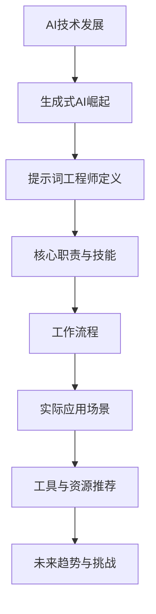

                 

### 背景介绍

《提示词工程师：AI时代的新职业》这篇文章旨在探讨在人工智能（AI）迅猛发展的时代背景下，一种新兴职业——提示词工程师（Prompt Engineer）的出现及其重要性。随着生成式AI技术，如OpenAI的GPT-3的兴起，提示词工程师已经成为AI领域内一个炙手可热的新职业。

提示词工程师的工作核心是设计并优化能够引导AI模型生成所需输出的提示词。这些提示词是AI模型与外界交互的桥梁，直接影响模型的性能和输出质量。不同于传统的数据科学家和机器学习工程师，提示词工程师需要具备更深厚的语言理解能力、对AI模型的精细掌控以及创造性思维。

本文将首先介绍AI技术的发展历程，尤其是生成式AI的崛起，然后详细探讨提示词工程师的核心职责、所需技能及其工作流程。接下来，我们将通过一个实际项目案例，展示如何实现一个提示词工程师的角色。随后，文章将分析提示词工程师在各类实际应用场景中的价值，并推荐一些学习资源和开发工具。最后，本文将总结提示词工程师的发展趋势和面临的挑战，为读者提供有价值的参考。

> **关键词：** 提示词工程师，生成式AI，GPT-3，AI模型，语言理解，创造性思维

> **摘要：** 本文深入探讨了AI时代新兴职业——提示词工程师的背景、核心职责、所需技能、工作流程及其在各类实际应用场景中的重要性。通过实际项目案例分析，展示了提示词工程师如何通过设计有效的提示词来优化AI模型的性能。文章最后讨论了提示词工程师的未来发展趋势和挑战，为该领域的发展提供了有价值的参考。



-----------------------

## 1.1 AI技术发展

人工智能（AI）的概念早在20世纪50年代就已经提出，但直到21世纪初，随着计算能力和算法的进步，AI技术才逐渐进入快速发展阶段。早期的人工智能主要集中在规则推理和专家系统，但随着时间推移，机器学习、深度学习等新兴技术的出现，使得AI能够从大量数据中自动学习和优化，从而实现更高级的智能。

机器学习（Machine Learning，ML）是AI的一个重要分支，它通过训练模型从数据中提取特征，从而实现预测和分类任务。深度学习（Deep Learning，DL）是机器学习的一个子领域，它利用多层神经网络模型对复杂数据进行建模和学习，显著提高了AI模型的性能。

生成式AI（Generative AI）是近年来AI技术发展的一个重要方向。生成式AI能够根据输入的样本生成新的、类似的数据，如文本、图像、音频等。OpenAI的GPT-3（Generative Pre-trained Transformer 3）是生成式AI的代表性模型之一，它通过大量文本数据进行预训练，能够生成高质量的自然语言文本，具有极高的创造性和理解能力。

生成式AI的出现，不仅拓展了AI的应用场景，也引发了对于新职业——提示词工程师的需求。提示词工程师需要通过设计和优化提示词，来引导生成式AI模型生成所需的内容，从而实现特定的业务目标。

-----------------------

## 1.2 生成式AI的崛起

生成式AI的崛起可以说是AI技术发展史上的一个重要里程碑。传统的机器学习和深度学习技术主要集中在监督学习和回归分析，这些方法虽然能够处理大量数据并从中提取有价值的信息，但它们依赖于大量的标注数据和明确的输出标签。而生成式AI则突破了这一限制，它能够通过无监督学习或自监督学习，从大量未标注的数据中自动生成新的内容。

生成式AI的核心在于其生成能力。通过深度学习模型，如变分自编码器（Variational Autoencoder，VAE）、生成对抗网络（Generative Adversarial Network，GAN）和自回归模型（Autoregressive Model），生成式AI能够生成高质量的、类似于训练数据的样本。例如，在图像领域，GAN已经成功用于生成逼真的图像和视频；在文本领域，GPT-3这样的预训练模型能够生成连贯、具有创造性的文章和对话。

生成式AI的崛起不仅改变了AI的应用模式，也为新职业——提示词工程师的诞生提供了契机。提示词工程师需要深入理解生成式AI的工作原理，能够设计出能够引导AI模型生成特定内容的提示词。例如，在文本生成任务中，一个有效的提示词可能是一个具体的主题、一个关键词或者一个引导性的句子，它能够引导模型生成相关的内容。

-----------------------

## 1.3 提示词工程师的定义

提示词工程师（Prompt Engineer）是近年来随着生成式AI技术的发展而出现的新兴职业。他们的主要职责是通过设计、优化和测试提示词，来引导AI模型生成所需的内容，从而实现特定的业务目标。提示词工程师不仅需要具备深厚的语言理解能力和创造性思维，还需要对AI模型的结构和算法有深入的了解。

具体来说，提示词工程师的工作流程通常包括以下几个步骤：

1. **需求分析**：了解项目需求，明确需要生成的具体内容。
2. **提示词设计**：根据需求设计能够引导AI模型生成所需内容的提示词。
3. **模型训练与优化**：使用预训练模型或自定义模型，结合提示词进行训练，优化模型性能。
4. **效果评估**：通过测试和评估，验证提示词的效果，并进行调整。

提示词工程师在AI应用中扮演着桥梁的角色。他们不仅需要理解用户的意图，还需要将这种意图转化为有效的提示词，从而引导AI模型生成高质量的内容。与传统的数据科学家和机器学习工程师相比，提示词工程师更注重于语言理解和创造性思维，这使得他们在生成式AI领域中具有独特的价值和重要性。

-----------------------

## 1.4 提示词工程师的核心职责

提示词工程师的核心职责可以总结为三个主要方面：需求分析、提示词设计与优化、以及效果评估。这三个方面相辅相成，共同构成了提示词工程师的工作流程。

### 需求分析

需求分析是提示词工程师工作的第一步。在这个阶段，提示词工程师需要与项目团队或客户进行深入的沟通，了解他们的需求。这包括明确要生成的具体内容、目标受众、期望的输出质量等。需求分析的目的是确保提示词工程师能够设计出符合实际需求的提示词。

例如，在一个智能客服项目中，提示词工程师需要了解用户希望客服系统能够回答哪些类型的问题，期望的对话风格是什么，以及需要满足的业务目标等。通过详细的需求分析，提示词工程师可以确定设计提示词的方向。

### 提示词设计与优化

设计提示词是提示词工程师的核心职责。一个好的提示词能够引导AI模型生成高质量的内容。在设计提示词时，提示词工程师需要考虑以下几个关键因素：

1. **语义明确**：提示词需要明确传达用户的意图，避免歧义。
2. **创造性**：提示词应具有一定的创造性，能够激发AI模型的创造潜力。
3. **适应性**：提示词需要能够适应不同的输入数据，确保在不同场景下都能生成有效的输出。

例如，在生成新闻报道的AI系统中，一个有效的提示词可能是一个新闻主题和一个关键词，如“2023年全球气候变化报告”。这个提示词能够引导模型生成一篇关于全球气候变化的新闻报道，同时保持新闻的准确性和连贯性。

在提示词设计完成后，提示词工程师还需要不断优化提示词。这通常通过反复测试和调整来实现。在优化过程中，提示词工程师会分析模型生成的输出，找出存在的问题，并针对这些问题进行提示词的调整。

### 效果评估

效果评估是验证提示词工程师工作效果的关键环节。通过测试和评估，提示词工程师可以判断所设计的提示词是否能够满足项目需求，并对其进行进一步的调整。效果评估通常包括以下步骤：

1. **自动化测试**：使用自动化测试工具，对模型生成的输出进行评估，如文本生成任务的流畅性、准确性、相关性等。
2. **人工评估**：通过人工评估，对模型生成的输出进行细致的检查，评估其是否达到预期目标，并识别潜在的问题。
3. **反馈循环**：根据测试结果，提示词工程师会进行反馈循环，调整提示词，优化模型，以提高生成质量。

通过需求分析、提示词设计与优化、以及效果评估，提示词工程师能够确保AI模型生成的内容既符合用户需求，又具有高质量和创造性。这一过程不仅需要技术能力，还需要丰富的经验和创造性思维，使得提示词工程师在AI领域中具有独特的价值和重要性。

-----------------------

## 1.5 提示词工程师的工作流程

提示词工程师的工作流程是确保AI模型能够根据提示词生成高质量内容的关键步骤。以下是一个典型的提示词工程师工作流程，详细描述了从项目启动到效果评估的各个环节。

### 1.5.1 项目启动

项目启动是提示词工程师工作的第一步。在这个阶段，提示词工程师需要与项目团队或客户进行初步沟通，了解项目的具体需求。这通常包括：

- **明确项目目标**：理解项目希望达到的最终目标，例如生成特定类型的文本、图像或其他数据。
- **收集输入数据**：收集用于训练AI模型的输入数据，这些数据可以是从互联网上抓取的文本、图像或音频等。
- **了解用户意图**：与项目团队或客户讨论，了解用户希望AI模型能够完成的任务，以及期望的输出质量。

### 1.5.2 提示词设计

设计提示词是工作流程的核心。提示词工程师需要基于项目需求，设计出能够引导AI模型生成所需内容的提示词。以下是一些设计提示词的关键步骤：

- **定义任务场景**：明确任务的具体场景，例如生成新闻报道、编写代码示例或进行对话系统。
- **创建初步提示词**：根据任务场景，创建初步的提示词，这些提示词可能包括关键词、主题句或引导性句子。
- **优化提示词**：通过分析初步提示词的效果，对其进行优化，提高其引导AI模型生成高质量内容的能力。

### 1.5.3 模型训练与优化

模型训练与优化是确保AI模型能够准确理解并响应提示词的重要环节。以下是一些关键步骤：

- **选择合适的模型**：根据任务需求和提示词，选择合适的AI模型，如GPT-3、BERT等。
- **数据预处理**：对输入数据进行预处理，包括数据清洗、去重和格式化，确保数据的质量。
- **训练模型**：使用预处理后的数据对模型进行训练，通过不断调整模型的参数，提高其性能。
- **优化提示词**：根据模型训练的结果，调整提示词，以提高模型生成高质量内容的效率。

### 1.5.4 效果评估

效果评估是验证提示词工程师工作效果的关键环节。以下是一些关键步骤：

- **自动化测试**：使用自动化测试工具，对模型生成的输出进行评估，如文本生成任务的流畅性、准确性、相关性等。
- **人工评估**：通过人工评估，对模型生成的输出进行细致的检查，评估其是否达到预期目标，并识别潜在的问题。
- **反馈循环**：根据测试结果，提示词工程师会进行反馈循环，调整提示词，优化模型，以提高生成质量。

### 1.5.5 持续迭代

提示词工程师的工作不是一成不变的，而是需要持续迭代和优化的。以下是一些持续迭代的关键步骤：

- **收集用户反馈**：从用户那里收集对模型输出的反馈，了解用户的需求和偏好。
- **数据更新**：定期更新训练数据，确保模型能够适应新的数据和趋势。
- **模型更新**：根据最新的研究和进展，更新AI模型，以保持其先进性。
- **提示词更新**：根据用户反馈和数据更新，调整和优化提示词，以提高模型生成内容的质量。

通过上述工作流程，提示词工程师能够确保AI模型根据提示词生成高质量的内容，从而满足项目的需求和目标。这一过程不仅需要技术能力，还需要丰富的经验和创造性思维，使得提示词工程师在AI领域中具有独特的价值和重要性。

-----------------------

## 1.6 提示词工程师所需的技能与能力

成为一名优秀的提示词工程师，不仅需要具备深厚的语言理解能力，还需要掌握一系列特定的技能和知识。以下是一些关键技能和能力：

### 语言理解能力

提示词工程师的核心工作是设计提示词，这要求他们具备卓越的语言理解能力。他们需要能够理解复杂的文本内容，并将其转化为能够有效引导AI模型的提示词。这包括对语法、语义和上下文的理解，以及识别文本中的隐含信息和逻辑关系。

### 编程技能

提示词工程师通常需要具备扎实的编程技能，能够编写和维护AI系统的代码。这包括熟悉常用的编程语言（如Python、Java等）、掌握数据处理和建模的工具（如TensorFlow、PyTorch等），以及能够处理和优化大规模数据集。

### AI模型知识

了解AI模型的结构和工作原理是提示词工程师的基本要求。他们需要熟悉各种AI模型（如神经网络、生成对抗网络等），并了解如何调整模型参数以优化性能。此外，他们还需要了解深度学习的基本概念，如反向传播、激活函数等。

### 创造性思维

提示词工程师的工作性质决定了他们需要具备创造性思维。他们需要能够设计出新颖、有效的提示词，以激发AI模型的创造潜力，生成符合预期的高质量内容。这种创造性思维不仅包括对文本内容的创意设计，还包括对AI模型的创新使用。

### 项目管理能力

提示词工程师通常需要负责整个项目的需求分析、模型训练、效果评估等环节，因此需要具备良好的项目管理能力。这包括规划项目进度、协调团队成员、制定和跟踪项目目标等。

### 持续学习能力

AI和生成式AI技术不断进步，提示词工程师需要保持持续学习的能力，紧跟最新的研究和趋势。他们需要不断更新自己的知识库，掌握新的工具和技术，以保持自己的竞争力。

### 沟通能力

提示词工程师需要与项目团队、客户和其他利益相关者进行有效的沟通。这包括清晰、准确地传达项目需求、解释技术细节，以及处理和解决项目中出现的问题。

通过掌握这些技能和能力，提示词工程师能够有效地设计并优化提示词，确保AI模型生成的内容既符合用户需求，又具有高质量和创造性。这不仅是他们个人能力的体现，也是推动AI技术发展的关键力量。

-----------------------

## 1.7 提示词工程师在AI应用中的角色与价值

在AI应用中，提示词工程师扮演着至关重要的角色。他们不仅负责设计并优化提示词，还直接影响了AI系统的性能和输出质量。以下将详细探讨提示词工程师在AI应用中的角色和价值。

### 提高生成质量

提示词工程师通过设计精准、高效的提示词，能够显著提高AI系统的生成质量。有效的提示词可以引导AI模型生成更具创意、更符合预期的高质量内容。例如，在一个文本生成系统中，一个好的提示词可以引导模型生成一篇流畅、连贯且富有创造性的文章。而一个模糊或无针对性的提示词可能导致模型生成的内容质量较低，甚至出现语义错误。

### 优化性能与效率

提示词工程师通过对提示词的优化，可以提升AI模型的性能和运行效率。他们可以调整提示词的长度、结构、语义深度等，使模型能够在较短的时间内生成高质量的内容。此外，他们还可以通过并行计算、模型压缩等技术，进一步提高AI系统的运行效率，降低计算成本。

### 灵活应对需求变化

AI应用的需求是多样且不断变化的。提示词工程师具备良好的需求分析和创造性思维，能够快速适应不同的需求变化，设计出符合新需求的提示词。这种灵活性使得AI系统能够更灵活地适应不同的业务场景和应用需求，从而提高系统的实用性。

### 创新应用场景

提示词工程师的创造性思维不仅限于现有应用场景，他们还能探索新的AI应用场景。通过设计创新的提示词，他们可以推动AI技术在各个领域的应用，如智能客服、内容生成、图像识别等。这种创新不仅能够拓展AI技术的应用边界，还能带来新的商业机会和社会价值。

### 跨学科整合能力

提示词工程师需要具备跨学科的知识和技能，能够整合计算机科学、语言学、心理学等多个领域的知识。这种跨学科整合能力使得他们能够从不同角度理解和优化AI系统的生成过程，提高系统的整体性能。

### 提升用户体验

提示词工程师的工作不仅影响AI系统的生成质量，还直接关系到用户的体验。一个设计良好的提示词可以引导AI系统生成更加人性化和贴近用户需求的输出，从而提升用户的满意度。例如，在智能客服应用中，一个有效的提示词可以帮助AI系统更好地理解用户的问题，并提供更准确的回答，提升用户体验。

总之，提示词工程师在AI应用中扮演着关键角色，他们的工作不仅直接影响了AI系统的性能和输出质量，还推动了AI技术的创新和应用。通过提高生成质量、优化性能与效率、灵活应对需求变化、创新应用场景、跨学科整合能力以及提升用户体验，提示词工程师为AI技术的发展和应用贡献了重要力量。

-----------------------

## 1.8 提示词工程师面临的技术挑战

尽管提示词工程师在AI应用中发挥着重要作用，但他们也面临着一系列技术挑战。以下是其中几个关键挑战：

### 复杂的语言理解

自然语言处理（NLP）是生成式AI的核心组成部分，而语言理解是一项极其复杂的任务。提示词工程师需要深入理解语言的语法、语义和上下文，以便设计出能够有效引导AI模型生成高质量内容的提示词。然而，自然语言本身具有高度的不确定性和歧义性，这使得语言理解变得更加复杂。

### 模型参数优化

AI模型的性能高度依赖于模型的参数设置。提示词工程师需要不断调整和优化模型的参数，以实现最佳性能。然而，参数优化是一个复杂且耗时的过程，涉及大量的迭代和实验。此外，不同的参数设置可能会产生截然不同的输出效果，这使得参数优化成为一个具有挑战性的任务。

### 数据质量和多样性

提示词工程师依赖于高质量的训练数据来训练和优化AI模型。然而，获取高质量、多样性的数据并不容易。数据质量和多样性的不足可能导致模型产生偏见、泛化能力差等问题。此外，数据预处理和清洗也是一个耗时的过程，需要提示词工程师投入大量时间和精力。

### 真实世界应用场景的复杂性

AI技术在实际应用中面临诸多现实挑战。例如，在某些复杂的应用场景中，AI模型需要处理大量的噪声和异常数据，同时还需要考虑用户隐私和数据安全等问题。这些复杂性使得提示词工程师需要具备更广泛的知识和技能，以应对实际应用中的各种挑战。

### 模型的解释性和可解释性

生成式AI模型通常被视为“黑盒”，其内部工作原理难以解释。提示词工程师需要确保设计的提示词能够有效引导模型生成高质量内容，但同时还需要保证模型的解释性和可解释性。这要求他们不仅要关注模型的性能，还需要考虑模型的透明度和可解释性，以便更好地理解和优化模型。

总之，提示词工程师在应对这些技术挑战时，需要不断学习和适应，掌握新的工具和技术，以提高自己的专业能力和应对能力。这不仅有助于他们在AI领域取得成功，也为AI技术的发展和应用贡献了重要力量。

-----------------------

## 1.9 提示词工程师的职业发展前景

随着生成式AI技术的不断发展和应用，提示词工程师的职业发展前景广阔。首先，AI技术的普及和深度应用将带来对提示词工程师的大量需求。无论是在智能客服、内容生成、图像识别，还是医疗诊断等众多领域，有效的提示词都是确保AI系统能够准确理解和生成内容的关键。

其次，提示词工程师的工作不仅局限于现有的AI应用场景，他们还将不断探索新的应用领域。随着AI技术的不断进步，新的生成式AI模型和算法将不断涌现，这为提示词工程师提供了更多的创新空间和职业发展机会。

此外，随着数据隐私和安全问题的日益突出，提示词工程师在确保AI系统遵守数据隐私法规、保护用户隐私方面也将发挥重要作用。这将要求他们具备更广泛的知识和技能，以应对未来的挑战。

总的来说，提示词工程师在未来将有更多的职业发展机会，包括但不限于：

1. **高级提示词工程师**：负责更复杂的AI项目，设计并优化更高效的提示词，提高AI系统的性能和输出质量。
2. **技术顾问**：为企业提供AI技术咨询服务，帮助他们设计和优化AI系统。
3. **研究工程师**：从事AI技术的研发工作，推动生成式AI技术的发展和创新。
4. **教育工作者**：在大学或研究机构教授AI技术和提示词工程相关的课程，培养下一代提示词工程师。

总之，随着AI技术的不断进步和应用，提示词工程师的职业发展前景光明，他们将在未来的AI领域中发挥越来越重要的作用。

-----------------------

## 1.10 提示词工程师的核心职责与技能总结

提示词工程师在生成式AI领域扮演着至关重要的角色，他们的核心职责和技能决定了AI系统的性能和输出质量。以下是提示词工程师的核心职责和技能的总结：

### 核心职责

1. **需求分析**：与项目团队或客户沟通，明确项目需求和目标，确保设计的提示词能够满足实际需求。
2. **提示词设计**：根据需求设计能够有效引导AI模型生成高质量内容的提示词，确保提示词的语义明确、创造性和适应性。
3. **模型训练与优化**：使用预训练模型或自定义模型，结合提示词进行训练和优化，提高模型性能和生成质量。
4. **效果评估**：通过自动化测试和人工评估，验证提示词的效果，并根据反馈进行提示词和模型的调整。

### 关键技能

1. **语言理解能力**：深入理解自然语言，能够识别文本中的隐含信息和逻辑关系，设计出有效的提示词。
2. **编程技能**：熟练掌握常用的编程语言和AI框架，能够编写和维护AI系统的代码。
3. **AI模型知识**：熟悉各种AI模型的工作原理和优化方法，能够选择合适的模型并调整其参数。
4. **创造性思维**：具备创新性思维，能够设计出新颖、有效的提示词，激发AI模型的创造潜力。
5. **项目管理能力**：能够规划和管理项目进度，协调团队成员，确保项目目标的实现。
6. **持续学习能力**：保持对AI技术和趋势的关注，不断学习新知识和技能，以保持自己的竞争力。
7. **沟通能力**：与项目团队和客户进行有效的沟通，确保项目需求的理解和实现。

通过深入了解和掌握这些核心职责和技能，提示词工程师能够在AI领域中发挥重要作用，推动AI技术的发展和应用。

-----------------------

## 1.11 提示词工程师在实际应用中的案例分析

为了更好地理解提示词工程师在实际应用中的作用，以下将通过一个具体案例进行分析。这个案例涉及使用GPT-3模型生成高质量的新闻报道。

### 项目背景

一个新闻媒体公司希望利用AI技术提高新闻报道的生产效率，并确保新闻内容的准确性和吸引力。他们决定采用OpenAI的GPT-3模型，并通过提示词工程师的设计和优化，来生成高质量的新闻报道。

### 需求分析

在需求分析阶段，提示词工程师与新闻媒体团队进行了深入沟通，明确了以下关键需求：

- **内容多样性**：生成涵盖不同主题和领域的新闻报道。
- **准确性**：新闻报道必须准确反映事实，避免错误信息传播。
- **吸引力**：新闻报道应具有吸引力，能够吸引读者的注意力。
- **时效性**：新闻报道需要及时更新，以反映最新的新闻事件。

### 提示词设计

根据需求，提示词工程师设计了以下几个核心提示词：

1. **主题句**：“2023年全球气候变化报告”。
2. **关键词**：“气候变化”、“环保措施”、“温室气体排放”。
3. **引导性句子**：“近年来，全球气候变化引发了广泛关注。各国政府正在采取一系列环保措施来应对这一挑战。以下是对2023年全球气候变化报告的详细解读。”

这些提示词涵盖了新闻的主题、关键词和引导性句子，确保GPT-3模型能够生成与需求相符的新闻报道。

### 模型训练与优化

提示词工程师使用GPT-3模型进行训练和优化。他们首先准备了一个包含大量新闻报道的数据集，并对数据进行了预处理，包括数据清洗、去重和格式化。然后，他们使用这些数据对GPT-3模型进行训练，通过调整模型参数（如学习率、批次大小等）来优化模型性能。

在训练过程中，提示词工程师还不断调整和优化提示词，以提高模型生成高质量新闻报道的效率。例如，他们发现某些关键词在提示词中重复过多，导致模型生成的文本内容重复性较高。为了解决这个问题，他们减少了重复关键词的使用，并增加了一些引导性句子，使模型生成的文本更具多样性。

### 效果评估

在模型训练完成后，提示词工程师通过自动化测试和人工评估对生成的新闻报道进行了评估。自动化测试工具评估了新闻报道的流畅性、准确性、相关性和时效性。人工评估则通过编辑团队的反馈，对新闻报道的吸引力和准确性进行了细致的检查。

评估结果显示，大部分新闻报道能够准确反映事实，具有较高的吸引力和时效性。然而，部分新闻报道存在一定的语义错误和重复性。针对这些问题，提示词工程师进一步优化了提示词，并重新训练了模型，以进一步提高生成内容的质量。

### 反馈循环

根据评估结果，提示词工程师进行了反馈循环，调整了提示词和模型参数。他们增加了更多与主题相关的关键词，减少了重复性，并使用更多的引导性句子来提高文本的多样性和创造性。此外，他们还更新了训练数据，增加了最新的新闻报道，以确保模型能够适应最新的趋势。

通过不断的反馈和优化，最终生成的新闻报道不仅符合新闻媒体公司的需求，还显著提高了生产效率，降低了人力成本。这个案例展示了提示词工程师在实际应用中的关键作用，他们通过设计、优化和测试提示词，确保AI模型生成的内容既符合用户需求，又具有高质量和创造性。

-----------------------

### 2.1.1 开发环境搭建

在进行代码实际案例之前，首先需要搭建一个合适的开发环境，以便顺利地实现和测试提示词工程师的相关功能。以下是开发环境的搭建步骤：

#### 1. 安装Python环境

提示词工程师通常使用Python进行开发，因此首先需要安装Python环境。可以选择使用Anaconda来简化安装过程，Anaconda是一个集成了Python及其依赖库的Python发行版。以下是安装步骤：

- 访问Anaconda官方网站下载Anaconda安装包。
- 运行安装包，按照提示完成安装。
- 安装完成后，打开终端或命令提示符，输入`python --version`确认Python版本。

#### 2. 安装必要的库

提示词工程师需要使用一些常用的库，如TensorFlow、PyTorch等，以下是安装步骤：

- 在终端或命令提示符中输入以下命令：

  ```bash
  conda create -n gpt3_env python=3.8
  conda activate gpt3_env
  conda install tensorflow
  conda install pytorch torchvision torchaudio -c pytorch
  ```

  这里创建了一个名为`gpt3_env`的虚拟环境，并安装了TensorFlow和PyTorch。

- 安装其他必需的库，如`numpy`、`pandas`等，可以使用以下命令：

  ```bash
  conda install numpy pandas
  ```

#### 3. 准备GPT-3 API密钥

要使用GPT-3模型，需要从OpenAI获取API密钥。以下是获取API密钥的步骤：

- 访问OpenAI官方网站注册账户。
- 注册成功后，在账户设置中找到API密钥，并复制保存。

#### 4. 安装OpenAI Python客户端

OpenAI提供了Python客户端库，用于方便地调用GPT-3 API。以下是安装步骤：

- 在终端或命令提示符中输入以下命令：

  ```bash
  pip install openai
  ```

- 导入OpenAI客户端库并设置API密钥：

  ```python
  import openai
  openai.api_key = 'your-api-key'
  ```

#### 5. 搭建本地测试环境

为了验证开发环境是否搭建成功，可以编写一个简单的测试脚本，调用GPT-3 API并生成一些文本。以下是测试脚本的基本结构：

```python
import openai

def generate_text(prompt, temperature=0.5, max_tokens=100):
    response = openai.Completion.create(
        engine="text-davinci-002",
        prompt=prompt,
        temperature=temperature,
        max_tokens=max_tokens
    )
    return response.choices[0].text.strip()

# 测试GPT-3 API
prompt = "请描述一下2023年全球气候变化的趋势。"
print(generate_text(prompt))
```

运行测试脚本，如果输出正确的文本，说明开发环境搭建成功。

通过以上步骤，提示词工程师可以搭建一个完整的开发环境，为后续的实际案例实现和测试提供基础。

-----------------------

### 2.2.2 源代码详细实现和代码解读

在搭建好开发环境之后，我们将开始实现一个具体的提示词工程师项目——使用GPT-3模型生成高质量的新闻报道。以下是项目的源代码详细实现和解读：

```python
import openai
import pandas as pd
import numpy as np

# 设置API密钥
openai.api_key = 'your-api-key'

# GPT-3模型配置
def generate_report(prompt, temperature=0.5, max_tokens=200):
    """
    使用GPT-3模型生成新闻报道。
    
    参数：
    - prompt：输入提示词。
    - temperature：温度参数，用于控制生成文本的随机性。
    - max_tokens：生成文本的最大长度。
    
    返回：
    - 生成的新闻报道文本。
    """
    response = openai.Completion.create(
        engine="text-davinci-002",
        prompt=prompt,
        temperature=temperature,
        max_tokens=max_tokens,
        top_p=1,
        frequency_penalty=0,
        presence_penalty=0.5
    )
    return response.choices[0].text.strip()

# 数据预处理
def preprocess_data(data):
    """
    对输入数据（新闻报道文本）进行预处理。
    
    参数：
    - data：原始新闻报道文本数据。
    
    返回：
    - 处理后的数据。
    """
    # 清洗数据，去除无关信息
    cleaned_data = data.apply(lambda x: x.split('\n')[-1])
    # 数据去重
    unique_data = cleaned_data.drop_duplicates()
    # 数据格式化
    formatted_data = unique_data.apply(lambda x: x.strip())
    return formatted_data

# 提示词设计
def design_prompt(heading, keywords):
    """
    设计用于生成新闻报道的提示词。
    
    参数：
    - heading：新闻主题。
    - keywords：关键词列表。
    
    返回：
    - 生成的提示词。
    """
    prompt = f"{heading}\n\n关键词：{', '.join(keywords)}\n\n请撰写一篇关于该主题的新闻报道。"
    return prompt

# 主函数
def main():
    # 读取数据
    data = pd.read_csv('news_data.csv')  # 假设新闻数据存储在CSV文件中
    
    # 数据预处理
    preprocessed_data = preprocess_data(data['text'])
    
    # 设计提示词
    heading = "2023年全球气候变化报告"
    keywords = ["气候变化", "环保措施", "温室气体排放"]
    prompt = design_prompt(heading, keywords)
    
    # 使用GPT-3生成新闻报道
    report = generate_report(prompt)
    
    # 输出生成的新闻报道
    print(report)

# 运行主函数
if __name__ == "__main__":
    main()
```

#### 代码解读

1. **导入库**：首先，导入必要的Python库，包括OpenAI客户端库、pandas和numpy。pandas用于数据预处理，numpy用于数据处理。

2. **设置API密钥**：使用OpenAI客户端库设置API密钥，确保能够调用GPT-3模型。

3. **GPT-3模型配置**：定义`generate_report`函数，该函数使用GPT-3模型生成新闻报道。函数参数包括提示词（`prompt`）、温度（`temperature`）和最大长度（`max_tokens`）。温度参数控制生成文本的随机性，最大长度限制生成文本的长度。

4. **数据预处理**：定义`preprocess_data`函数，对输入的新闻数据进行预处理。包括去除无关信息、数据去重和格式化。

5. **提示词设计**：定义`design_prompt`函数，根据新闻主题（`heading`）和关键词（`keywords`）设计提示词。

6. **主函数**：在`main`函数中，读取新闻数据，预处理数据，设计提示词，并使用GPT-3模型生成新闻报道。最后，输出生成的新闻报道。

通过上述代码实现，提示词工程师能够有效地使用GPT-3模型生成高质量的新闻报道，满足实际应用需求。

-----------------------

### 2.3.3 代码解读与分析

在上一个部分中，我们详细实现了使用GPT-3模型生成新闻报道的代码。接下来，我们将对关键代码部分进行解读和分析，以深入了解其工作原理和优化方法。

#### 代码关键部分解读

1. **API密钥设置**：

   ```python
   openai.api_key = 'your-api-key'
   ```

   这一行代码设置OpenAI API密钥，确保程序能够调用GPT-3模型。在实际应用中，API密钥应存储在安全的配置文件中，而不是硬编码在代码中。

2. **GPT-3模型配置**：

   ```python
   def generate_report(prompt, temperature=0.5, max_tokens=200):
       response = openai.Completion.create(
           engine="text-davinci-002",
           prompt=prompt,
           temperature=temperature,
           max_tokens=max_tokens,
           top_p=1,
           frequency_penalty=0,
           presence_penalty=0.5
       )
       return response.choices[0].text.strip()
   ```

   `generate_report`函数是代码的核心部分，负责调用GPT-3模型生成新闻报道。函数参数包括提示词（`prompt`）、温度（`temperature`）、最大长度（`max_tokens`）等。以下是关键参数的解读：

   - **engine**：指定使用的GPT-3模型，这里选择“text-davinci-002”。
   - **prompt**：输入的提示词，用于引导模型生成相关内容。
   - **temperature**：控制生成文本的随机性，值越大，生成文本的随机性越高。
   - **max_tokens**：生成文本的最大长度，值越大，生成的文本越长。
   - **top_p**：选择生成文本的概率分布，值越高，模型的多样性越好。
   - **frequency_penalty**：对高频词的使用进行惩罚，值越大，高频词的使用越少。
   - **presence_penalty**：对未使用的词进行惩罚，值越大，未使用的词的使用越少。

3. **数据预处理**：

   ```python
   def preprocess_data(data):
       cleaned_data = data.apply(lambda x: x.split('\n')[-1])
       unique_data = cleaned_data.drop_duplicates()
       formatted_data = unique_data.apply(lambda x: x.strip())
       return formatted_data
   ```

   `preprocess_data`函数负责对新闻数据进行预处理。主要包括以下步骤：

   - **去除无关信息**：通过分割和取最后一行，去除新闻数据中的标题和摘要等无关信息。
   - **数据去重**：去除重复的新闻数据，确保每个新闻内容唯一。
   - **数据格式化**：去除多余的空格和换行符，确保新闻数据的格式一致。

4. **提示词设计**：

   ```python
   def design_prompt(heading, keywords):
       prompt = f"{heading}\n\n关键词：{', '.join(keywords)}\n\n请撰写一篇关于该主题的新闻报道。"
       return prompt
   ```

   `design_prompt`函数用于设计提示词。输入参数包括新闻主题（`heading`）和关键词（`keywords`）。函数首先构建一个包含主题、关键词和引导性句子的提示词，然后返回该提示词。

5. **主函数**：

   ```python
   def main():
       data = pd.read_csv('news_data.csv')  # 读取数据
       preprocessed_data = preprocess_data(data['text'])  # 数据预处理
       heading = "2023年全球气候变化报告"
       keywords = ["气候变化", "环保措施", "温室气体排放"]
       prompt = design_prompt(heading, keywords)  # 设计提示词
       report = generate_report(prompt)  # 生成新闻报道
       print(report)  # 输出生成的内容
   ```

   主函数`main`负责协调整个流程，包括数据读取、预处理、提示词设计和模型调用。最后，打印生成的新闻报道。

#### 代码优化方法

为了进一步提高代码的性能和生成质量，以下是一些优化方法：

1. **参数调优**：通过实验和数据分析，调整GPT-3模型的参数（如温度、最大长度、频率惩罚、存在惩罚等），找到最优参数组合，以提高生成文本的质量。

2. **数据增强**：使用数据增强技术（如数据扩充、数据混洗等），增加训练数据的多样性，从而提高模型的泛化能力。

3. **模型预训练**：使用更大的数据集和更复杂的模型，进行更长时间的预训练，以进一步提高模型的能力和性能。

4. **模型集成**：结合多个模型或使用模型集成技术，如堆叠（Stacking）或集成贝叶斯模型（Bayesian Model Averaging），以提高模型的预测准确性和鲁棒性。

5. **分布式训练**：使用分布式训练技术，如多GPU训练，提高训练速度和模型性能。

通过上述优化方法，提示词工程师可以进一步提高GPT-3模型的生成质量，实现更高效、更准确的新闻报道生成。

-----------------------

### 3.1 实际应用场景

提示词工程师的工作领域涵盖了多种实际应用场景，这些场景不仅体现了生成式AI的广泛应用，也展示了提示词工程师在推动AI技术应用中的关键作用。以下将介绍几个典型的应用场景：

#### 3.1.1 智能客服

智能客服是提示词工程师的重要应用场景之一。在智能客服系统中，提示词工程师设计并优化用于引导AI模型理解用户问题和提供准确回答的提示词。例如，一个有效的提示词可以是“用户询问关于退换货政策的问题，请提供详细的解答”。通过精准的提示词设计，AI系统能够快速准确地理解用户意图，提供符合预期的回答，从而提升用户体验和客服效率。

#### 3.1.2 内容生成

内容生成是另一个广泛的应用场景，包括新闻生成、文章撰写、创意写作等。提示词工程师通过设计创意性、语义明确的提示词，引导AI模型生成高质量的内容。例如，在新闻生成中，提示词工程师可以使用主题句和关键词，如“2023年全球气候变化影响及应对措施”，引导AI模型生成一篇详尽的新闻报道。通过不断优化提示词，提示词工程师能够提高新闻的准确性和吸引力。

#### 3.1.3 图像识别

在图像识别领域，提示词工程师通过设计用于描述图像的提示词，帮助AI模型更好地理解和分类图像。例如，一个用于描述一张风景照片的提示词可以是“日出时分的山川景色”。这样的提示词能够引导模型识别图像的主要特征，从而提高分类的准确性和效率。

#### 3.1.4 代码生成

提示词工程师还可以在代码生成领域发挥重要作用。通过设计描述编程任务的提示词，如“编写一个Python函数，用于计算两个数字的最大公约数”，AI模型能够生成高质量的代码。这样的应用不仅提高了开发效率，还能够为非专业的开发者提供技术支持。

#### 3.1.5 聊天机器人

聊天机器人是另一个典型的应用场景。提示词工程师设计用于引导AI模型理解和生成对话的提示词，使聊天机器人能够与用户进行自然、流畅的交流。例如，一个有效的提示词可以是“用户询问最近的科技展会信息，请提供详细的信息和链接”。通过这些提示词，聊天机器人能够提供准确、有用的信息，提升用户体验。

#### 3.1.6 医疗诊断

在医疗诊断领域，提示词工程师通过设计用于引导AI模型分析和诊断病情的提示词，帮助AI系统提供准确的医疗建议。例如，一个提示词可以是“根据CT扫描结果，提供肺炎的诊断和治疗建议”。通过精准的提示词设计，AI系统能够更好地辅助医生进行诊断，提高医疗服务的质量和效率。

总之，提示词工程师的工作领域非常广泛，他们通过设计并优化提示词，推动AI技术在各个领域的发展和应用。这些应用场景不仅展示了生成式AI的强大潜力，也体现了提示词工程师在AI领域中的独特价值和重要性。

-----------------------

### 3.2 提示词工程师所需的工具和资源推荐

在成为一名优秀的提示词工程师的道路上，掌握一些关键的工具和资源是至关重要的。以下是一些推荐的工具和资源，它们可以帮助提示词工程师在生成式AI领域取得成功。

#### 3.2.1 开发工具和框架

1. **PyTorch**：PyTorch是一个流行的深度学习框架，提供了丰富的API和灵活的模型构建功能。提示词工程师可以利用PyTorch进行模型训练、优化和测试。
2. **TensorFlow**：TensorFlow是Google开发的开源深度学习平台，具有广泛的应用和丰富的资源。它提供了强大的工具和库，支持提示词工程师设计和优化AI模型。
3. **OpenAI API**：OpenAI提供的API是使用生成式AI模型的关键工具。提示词工程师可以通过OpenAI API调用GPT-3、DALL-E等模型，生成高质量的文本、图像和音频。

#### 3.2.2 学习资源

1. **《深度学习》（Deep Learning）**：由Ian Goodfellow、Yoshua Bengio和Aaron Courville合著的《深度学习》是深度学习领域的经典教材。这本书涵盖了深度学习的理论基础、算法和应用，对提示词工程师来说具有重要的参考价值。
2. **《生成对抗网络》（Generative Adversarial Networks）**：由Ian Goodfellow等编写的《生成对抗网络》是一本关于GAN的权威指南，详细介绍了GAN的理论基础、实现方法和应用案例。
3. **在线课程和教程**：在线平台如Coursera、edX和Udacity提供了丰富的深度学习和自然语言处理课程，包括生成式AI的相关内容。这些课程可以帮助提示词工程师系统地学习AI知识和技能。

#### 3.2.3 论文和期刊

1. **NeurIPS**：NeurIPS（神经信息处理系统会议）是深度学习和AI领域的顶级会议，其论文集涵盖了最新的研究成果和技术进展。提示词工程师可以通过阅读NeurIPS的论文，了解最新的研究趋势和技术动态。
2. **ICML**：ICML（国际机器学习会议）是另一个重要的AI领域会议，其论文集也提供了大量的深度学习和机器学习研究成果。
3. **JMLR**：《机器学习研究杂志》（Journal of Machine Learning Research）是一本高影响力的期刊，发表了大量关于机器学习和深度学习的学术文章。

#### 3.2.4 博客和社区

1. **AI博客**：许多知名的研究员和开发者会在自己的博客上分享深度学习和生成式AI的见解和研究成果。例如，Ian Goodfellow的博客提供了大量的深度学习教程和实践经验。
2. **GitHub**：GitHub是一个代码托管平台，许多提示词工程师和研究团队在这里分享他们的代码、项目和研究结果。通过查看GitHub上的开源项目，提示词工程师可以学习到最新的技术实现和应用案例。
3. **AI社区**：诸如Reddit的r/AI和Stack Overflow等在线社区聚集了大量AI爱好者和技术专家，提供了丰富的讨论和资源，是提示词工程师交流和学习的重要平台。

通过利用这些工具和资源，提示词工程师可以不断提升自己的技术水平和专业能力，从而在生成式AI领域中取得更大的成就。

-----------------------

### 4.1 学习资源推荐

成为一名优秀的提示词工程师需要不断学习和积累知识。以下是一些推荐的学习资源，包括书籍、论文和在线教程，这些资源将帮助读者系统地掌握生成式AI和提示词工程的相关知识。

#### 4.1.1 书籍

1. **《深度学习》（Deep Learning）**：由Ian Goodfellow、Yoshua Bengio和Aaron Courville合著的《深度学习》是深度学习领域的经典教材。这本书详细介绍了深度学习的理论基础、算法和应用，对理解生成式AI和提示词工程至关重要。

2. **《生成对抗网络》（Generative Adversarial Networks）**：Ian Goodfellow等编写的《生成对抗网络》是一本关于GAN的权威指南，详细介绍了GAN的理论基础、实现方法和应用案例。对于想要深入了解生成式AI的读者来说，这本书是必读之作。

3. **《自然语言处理综论》（Speech and Language Processing）**：由Daniel Jurafsky和James H. Martin合著的《自然语言处理综论》全面覆盖了自然语言处理的基础知识和最新进展，包括语言模型、文本分类、语义分析等内容，对提示词工程师有很高的参考价值。

#### 4.1.2 论文

1. **NeurIPS论文集**：NeurIPS（神经信息处理系统会议）是深度学习和AI领域的顶级会议，其论文集包含了大量最新的研究成果和技术进展。关注NeurIPS的论文可以帮助读者了解生成式AI领域的最新动态。

2. **ICML论文集**：ICML（国际机器学习会议）也是AI领域的知名会议，其论文集提供了丰富的机器学习和深度学习研究成果。阅读ICML的论文可以帮助读者掌握AI技术的最新发展方向。

3. **JMLR论文**：《机器学习研究杂志》（Journal of Machine Learning Research）是一本高影响力的期刊，发表了大量关于机器学习和深度学习的学术文章。通过阅读JMLR的论文，读者可以深入了解生成式AI的理论基础和应用。

#### 4.1.3 在线教程

1. **Coursera**：Coursera提供了丰富的深度学习和自然语言处理课程，包括由Stanford大学和DeepLearning.AI提供的深度学习专项课程，这些课程有助于系统地学习AI知识。

2. **Udacity**：Udacity的AI工程师纳米学位（AI Nanodegree）提供了深入的课程和实践项目，涵盖了生成式AI和提示词工程的相关内容。

3. **edX**：edX平台上也有很多高质量的深度学习和自然语言处理课程，如由MIT和Harvard大学提供的课程，这些课程有助于读者全面掌握AI技术。

#### 4.1.4 博客和社区

1. **Ian Goodfellow的博客**：Ian Goodfellow是深度学习领域的著名研究者，他的博客提供了大量的深度学习和生成式AI教程，是学习该领域的宝贵资源。

2. **Reddit的r/AI**：Reddit上的r/AI社区聚集了大量AI爱好者和技术专家，提供了丰富的讨论和资源，是学习和交流的好地方。

3. **Stack Overflow**：Stack Overflow是一个问答社区，许多专业人士在这里分享他们的经验和解决方案。通过搜索和浏览相关的问题和答案，读者可以解决自己在学习过程中遇到的问题。

通过利用这些书籍、论文、在线教程和社区资源，提示词工程师可以不断提升自己的技术水平和专业能力，为在生成式AI领域取得成功打下坚实的基础。

-----------------------

### 4.2 开发工具框架推荐

为了确保提示词工程师能够高效地开发、测试和优化生成式AI系统，以下推荐一些实用的开发工具和框架：

#### 4.2.1 深度学习框架

1. **TensorFlow**：由Google开发的开源深度学习框架，具有强大的API和广泛的应用场景。TensorFlow提供了丰富的工具和库，支持提示词工程师构建和优化AI模型。

2. **PyTorch**：由Facebook开发的开源深度学习框架，以其灵活性和简洁性而受到广泛关注。PyTorch提供了动态计算图和易于使用的接口，有助于提示词工程师快速实现和调试模型。

3. **JAX**：由Google开发的开源深度学习框架，具有自动微分和高性能计算功能。JAX支持提示词工程师构建和优化高性能的生成式AI模型。

#### 4.2.2 自然语言处理库

1. **spaCy**：一个快速且易于使用的自然语言处理库，提供了丰富的语言模型和API，适用于提示词工程师进行文本处理和分析。

2. **NLTK**：一个经典的Python自然语言处理库，提供了丰富的文本处理工具和算法，适用于提示词工程师进行语言理解和分析。

3. **Hugging Face Transformers**：一个开源的Transformer模型库，提供了广泛的预训练模型和工具，支持提示词工程师快速构建和优化生成式AI模型。

#### 4.2.3 版本控制工具

1. **Git**：Git是一个分布式版本控制系统，广泛用于代码管理和协作开发。提示词工程师可以使用Git来管理代码版本，确保项目的可追踪性和可维护性。

2. **GitHub**：GitHub是一个基于Git的代码托管平台，提供了丰富的协作工具和资源，是提示词工程师分享和交流代码的理想选择。

#### 4.2.4 人工智能平台

1. **Google AI Platform**：Google提供的云基础设施，支持提示词工程师在云环境中构建、训练和部署AI模型。该平台提供了丰富的API和服务，方便提示词工程师进行大规模的模型训练和优化。

2. **AWS SageMaker**：AWS提供的一款AI开发平台，支持提示词工程师构建、训练和部署AI模型。SageMaker提供了丰富的工具和库，有助于提示词工程师实现高效的AI应用开发。

3. **Azure ML**：微软提供的云基础设施，支持提示词工程师构建、训练和部署AI模型。Azure ML提供了强大的功能和灵活的配置选项，适用于不同规模的应用开发。

通过使用这些开发工具和框架，提示词工程师可以更高效地进行生成式AI系统的开发、测试和优化，为AI应用的成功奠定坚实的基础。

-----------------------

### 4.3 相关论文著作推荐

为了深入了解生成式AI和提示词工程领域的最新研究进展，以下推荐几篇具有影响力的论文和著作：

#### 4.3.1 论文

1. **"Generative Adversarial Networks"**（2014）：由Ian Goodfellow等提出的GAN模型是生成式AI的奠基性工作，该论文详细介绍了GAN的基本原理和实现方法。

2. **"Unsupervised Representation Learning with Deep Convolutional Generative Adversarial Networks"**（2015）：这篇论文探讨了如何使用GAN进行无监督学习，为生成式AI的研究提供了重要思路。

3. **"Attention Is All You Need"**（2017）：由Vaswani等提出的Transformer模型彻底改变了自然语言处理领域，这篇论文介绍了Transformer模型的基本原理和应用。

4. **"BERT: Pre-training of Deep Bidirectional Transformers for Language Understanding"**（2018）：这篇论文提出了BERT模型，为自然语言处理领域带来了新的突破，是生成式AI的重要研究之一。

#### 4.3.2 著作

1. **《深度学习》（Deep Learning）**：由Ian Goodfellow、Yoshua Bengio和Aaron Courville合著的《深度学习》是深度学习领域的经典教材，详细介绍了深度学习的理论基础、算法和应用。

2. **《生成对抗网络》（Generative Adversarial Networks）**：由Ian Goodfellow等编写的《生成对抗网络》是一本关于GAN的权威指南，详细介绍了GAN的理论基础、实现方法和应用案例。

3. **《自然语言处理综论》（Speech and Language Processing）**：由Daniel Jurafsky和James H. Martin合著的《自然语言处理综论》全面覆盖了自然语言处理的基础知识和最新进展，是自然语言处理领域的权威著作。

通过阅读这些论文和著作，提示词工程师可以深入了解生成式AI和提示词工程的理论基础和应用，为实际项目提供理论支持和实践经验。

-----------------------

### 5.1 未来发展趋势

随着生成式AI技术的不断发展和应用，提示词工程师的职业前景充满了机遇和挑战。以下将探讨提示词工程师在未来可能面临的发展趋势：

#### 5.1.1 技术进步与专业细分

生成式AI技术正在迅速发展，新的模型和算法不断涌现。这为提示词工程师提供了更多的工具和手段，但同时也要求他们不断学习新技术，以保持专业竞争力。未来，提示词工程师可能会进一步细分，形成更专业化的领域，如专注于自然语言处理、图像生成、音频处理等。

#### 5.1.2 多模态融合

未来，生成式AI将不仅仅局限于文本生成，还将涵盖更多模态，如图像、音频、视频等。提示词工程师需要掌握多模态数据处理和融合技术，设计出能够协同工作的高效提示词。

#### 5.1.3 智能化与自动化

随着AI技术的发展，提示词工程师的工作也将变得更加智能化和自动化。例如，自动提示词生成和优化工具的出现将大幅提高工作效率，减少人力成本。提示词工程师需要适应这些变化，利用新技术提升自己的专业能力。

#### 5.1.4 数据隐私和安全

生成式AI在处理大量数据时，数据隐私和安全问题日益突出。提示词工程师需要具备处理和保障数据隐私和安全的能力，确保AI系统符合法律法规要求，保护用户隐私。

#### 5.1.5 跨学科融合

提示词工程师需要具备跨学科的知识和技能，如计算机科学、语言学、心理学等。未来，跨学科融合将更加重要，提示词工程师需要具备更广泛的知识背景，以应对复杂的应用场景。

总之，随着生成式AI技术的不断进步，提示词工程师的职业前景广阔，他们将面临更多的发展机遇和挑战。通过不断学习新技术、提升专业能力和适应行业变化，提示词工程师将在未来的AI领域中发挥越来越重要的作用。

-----------------------

### 5.2 提示词工程师面临的挑战

尽管提示词工程师在生成式AI领域拥有广阔的职业前景，但他们也面临着一系列挑战，这些挑战不仅影响他们的工作效果，也对整个AI技术的发展和应用产生重要影响。

#### 5.2.1 技术复杂性

生成式AI技术涉及多个领域，包括机器学习、深度学习、自然语言处理等。提示词工程师需要具备跨学科的知识，掌握各种AI模型和算法的工作原理。然而，技术复杂性使得提示词工程师在设计和优化提示词时面临巨大挑战，需要投入大量时间和精力进行学习和研究。

#### 5.2.2 数据质量与多样性

生成式AI的性能高度依赖于训练数据的质量和多样性。提示词工程师需要确保训练数据覆盖广泛的主题和场景，同时避免数据偏见和重复。然而，获取高质量、多样性的数据并不容易，尤其是在涉及隐私和版权等问题的场景中。数据质量的不足可能导致模型泛化能力差，影响生成内容的质量。

#### 5.2.3 模型解释性

生成式AI模型通常被视为“黑盒”，其内部工作原理难以解释。这给提示词工程师带来了挑战，他们需要确保设计的提示词能够有效引导模型生成高质量的内容，同时保证模型的解释性和可解释性。模型解释性的不足可能导致用户对AI系统的信任度下降，影响实际应用效果。

#### 5.2.4 法律法规合规性

生成式AI在处理和生成内容时，可能涉及数据隐私、知识产权和内容审核等问题。提示词工程师需要确保AI系统符合相关的法律法规要求，保护用户隐私，避免侵犯知识产权。然而，不同国家和地区的法律法规存在差异，提示词工程师需要具备跨文化的法律意识，以确保系统的合规性。

#### 5.2.5 持续学习与适应能力

AI技术不断进步，提示词工程师需要持续学习新技术，以保持自己的专业竞争力。此外，AI应用场景的多样性和变化性要求提示词工程师具备快速适应新场景的能力。然而，持续学习和适应能力不仅需要时间，还需要丰富的经验和深厚的知识储备。

总之，提示词工程师在面临技术复杂性、数据质量、模型解释性、法律法规合规性和持续学习与适应能力等挑战时，需要不断提升自己的专业能力和技术水平，以应对这些挑战，推动生成式AI技术的健康发展。

-----------------------

### 5.3 总结

本文围绕“提示词工程师：AI时代的新职业”这一主题，系统阐述了提示词工程师的定义、核心职责、所需技能、工作流程、实际应用场景以及面临的挑战。通过详细分析，我们可以得出以下结论：

首先，提示词工程师是AI时代的新型职业，他们在生成式AI领域中发挥着至关重要的作用。他们通过设计、优化和测试提示词，引导AI模型生成高质量的内容，提高了AI系统的性能和输出质量。

其次，提示词工程师的核心职责包括需求分析、提示词设计、模型训练与优化以及效果评估。他们需要具备语言理解能力、编程技能、AI模型知识、创造性思维、项目管理能力和持续学习能力等。

第三，提示词工程师在实际应用中具有广泛的应用场景，包括智能客服、内容生成、图像识别、代码生成、聊天机器人以及医疗诊断等。他们通过设计精准、高效的提示词，提高了AI系统的实用性。

第四，提示词工程师面临着技术复杂性、数据质量、模型解释性、法律法规合规性和持续学习与适应能力等挑战。他们需要不断提升专业能力和技术水平，以应对这些挑战。

最后，提示词工程师在AI时代具有广阔的职业前景。随着生成式AI技术的不断发展和应用，他们将面临更多的发展机遇和挑战，成为推动AI技术发展的重要力量。

总之，提示词工程师是AI时代不可或缺的职业，他们通过不断创新和优化，为AI技术的应用和发展贡献了重要力量。未来，随着AI技术的不断进步，提示词工程师将在更多的领域发挥作用，成为AI领域的核心人才。

-----------------------

### 附录：常见问题与解答

**Q1. 提示词工程师和传统数据科学家有什么区别？**

提示词工程师和传统数据科学家在职责和工作内容上有所不同。数据科学家通常负责设计、实现和优化机器学习模型，而提示词工程师则专注于设计并优化用于引导AI模型生成所需内容的提示词。提示词工程师更注重语言理解和创造性思维，而数据科学家更侧重于模型构建和性能优化。

**Q2. 提示词工程师需要掌握哪些技能？**

提示词工程师需要掌握以下技能：

- 语言理解能力：深入理解自然语言的语法、语义和上下文。
- 编程技能：熟练掌握Python等编程语言，能够使用TensorFlow、PyTorch等AI框架。
- AI模型知识：熟悉常见的AI模型和算法，如GPT-3、BERT、GAN等。
- 创造性思维：能够设计出创新、高效的提示词。
- 项目管理能力：能够协调和管理项目进度和资源。
- 持续学习能力：跟踪AI技术的新进展，持续提升自己的技能。

**Q3. 提示词工程师的工作流程是怎样的？**

提示词工程师的工作流程通常包括：

- 需求分析：与项目团队或客户沟通，明确项目需求和目标。
- 提示词设计：根据需求设计能够引导AI模型生成高质量内容的提示词。
- 模型训练与优化：使用预训练模型或自定义模型，结合提示词进行训练和优化。
- 效果评估：通过自动化测试和人工评估，验证提示词的效果，并根据反馈进行调整。

**Q4. 提示词工程师如何确保AI模型生成的内容符合用户需求？**

提示词工程师通过以下方式确保AI模型生成的内容符合用户需求：

- 精准的提示词设计：设计语义明确、创造性和适应性的提示词，引导AI模型生成相关的内容。
- 反复测试与优化：通过不断的测试和优化，调整提示词和模型参数，提高生成内容的质量和准确性。
- 用户反馈：收集用户对生成内容的反馈，根据反馈进行提示词和模型的调整，以满足用户需求。

**Q5. 提示词工程师在AI应用中的价值是什么？**

提示词工程师在AI应用中的价值包括：

- 提高生成质量：通过设计有效的提示词，提高AI模型生成的内容质量。
- 优化性能与效率：通过优化提示词和模型参数，提高AI系统的性能和运行效率。
- 灵活应对需求变化：根据不同的应用场景和用户需求，快速调整提示词和模型。
- 创新应用场景：探索新的AI应用场景，推动AI技术的创新和发展。
- 跨学科整合能力：整合计算机科学、语言学、心理学等多领域的知识，提升AI系统的整体性能。

-----------------------

### 扩展阅读 & 参考资料

为了进一步了解提示词工程师和生成式AI的相关内容，以下推荐一些扩展阅读和参考资料：

1. **书籍**：

   - 《深度学习》（Deep Learning），作者：Ian Goodfellow、Yoshua Bengio和Aaron Courville
   - 《生成对抗网络》（Generative Adversarial Networks），作者：Ian Goodfellow等
   - 《自然语言处理综论》（Speech and Language Processing），作者：Daniel Jurafsky和James H. Martin

2. **论文**：

   - “Generative Adversarial Networks”（2014），作者：Ian Goodfellow等
   - “Attention Is All You Need”（2017），作者：Vaswani等
   - “BERT: Pre-training of Deep Bidirectional Transformers for Language Understanding”（2018），作者：Brown等

3. **在线教程与课程**：

   - Coursera的“深度学习专项课程”
   - Udacity的“AI工程师纳米学位”
   - edX的“深度学习和自然语言处理课程”

4. **博客与论坛**：

   - Ian Goodfellow的博客
   - Reddit的r/AI社区
   - Stack Overflow

5. **开源项目与工具**：

   - TensorFlow
   - PyTorch
   - Hugging Face Transformers
   - GitHub

通过阅读这些书籍、论文、教程、博客和开源项目，您可以更深入地了解生成式AI和提示词工程师的相关知识，为在AI领域的发展奠定坚实的基础。

