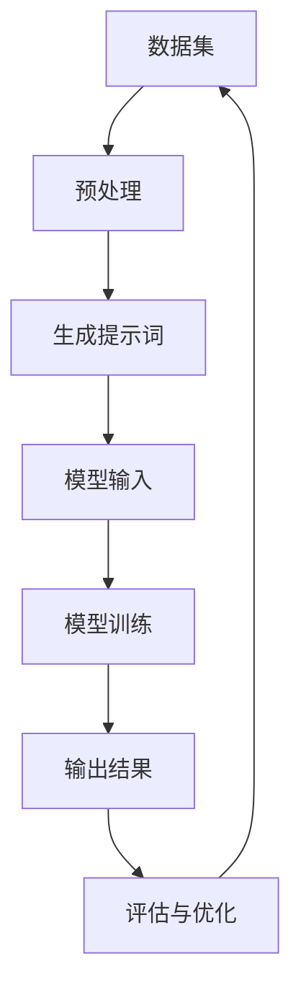

                 

### 背景介绍

#### 什么是提示词工程？

提示词工程（Prompt Engineering）是人工智能（AI）领域的一个新兴分支，其主要目标是通过构建高质量的提示词（prompts）来提升AI系统的性能和可解释性。在传统的机器学习框架中，模型训练通常依赖于大量的标注数据，而提示词工程则将注意力转移到如何有效地使用这些数据来指导模型的学习过程。

提示词工程的概念起源于自然语言处理（NLP）领域。早期的研究主要集中在如何设计有效的查询提示来提高信息检索系统的性能。随着深度学习技术的发展，特别是生成对抗网络（GANs）、Transformer模型等模型的流行，提示词工程逐渐成为优化AI模型性能的关键技术。

#### 提示词工程的重要性

在AI应用开发中，提示词工程扮演着至关重要的角色。首先，高质量的提示词能够帮助模型更好地理解输入数据，从而提高模型的准确性和泛化能力。其次，通过精细调整提示词，开发者可以引导模型学习特定的知识或技能，这在教育和辅助决策等领域具有显著的应用价值。

此外，提示词工程还有助于提高AI系统的可解释性。在许多实际应用场景中，透明和可解释的AI系统更受欢迎，因为用户需要理解系统的决策过程。提示词工程提供了一种手段，使得开发者和用户可以更好地理解模型是如何处理数据的，从而增强用户对AI系统的信任。

#### 提示词工程的发展历史

提示词工程的发展可以追溯到信息检索领域。20世纪90年代，研究人员开始探讨如何设计有效的查询提示来优化信息检索系统的性能。这一领域的研究推动了自然语言处理技术的发展，并为后来的提示词工程奠定了基础。

进入21世纪，随着深度学习技术的兴起，提示词工程逐渐成为AI研究的热点。2017年，谷歌发布了BERT模型，标志着AI模型对提示词的依赖程度进一步提高。随后，大量的研究和应用案例证明了提示词工程在提升模型性能方面的潜力。

#### 本文结构

本文将详细探讨提示词工程的核心概念、算法原理、数学模型、实际应用案例，以及未来发展趋势。具体内容如下：

1. **核心概念与联系**：介绍提示词工程的基本概念，包括提示词、模型输入、输出等，并给出一个简化的Mermaid流程图。
2. **核心算法原理 & 具体操作步骤**：解释如何设计高质量的提示词，以及如何调整和优化提示词以提升模型性能。
3. **数学模型和公式 & 详细讲解 & 举例说明**：介绍与提示词工程相关的数学模型，包括损失函数、正则化等，并提供具体的应用实例。
4. **项目实战：代码实际案例和详细解释说明**：通过一个实际的代码案例，展示如何应用提示词工程来优化AI模型。
5. **实际应用场景**：分析提示词工程在不同领域的应用，包括信息检索、问答系统、文本生成等。
6. **工具和资源推荐**：介绍一些用于提示词工程的开源工具、学习资源和相关论文著作。
7. **总结：未来发展趋势与挑战**：探讨提示词工程在AI领域的未来发展，以及面临的挑战。

通过本文的阅读，读者将能够全面了解提示词工程的原理和应用，为实际项目开发提供有力的支持。

#### 核心概念与联系

提示词工程的核心在于如何设计高质量的提示词，并将其有效地输入到AI模型中，以实现预期的输出。为了更好地理解这一概念，我们可以通过一个简化的Mermaid流程图来描述提示词工程的基本流程。

首先，提示词工程涉及三个主要组件：数据集、模型和提示词。数据集是训练模型的输入，模型则是负责处理数据和生成输出的智能系统，而提示词则是介于数据集和模型之间的重要桥梁。

以下是提示词工程的基本流程：



**数据集**：数据集是训练AI模型的基础，它通常包含大量的文本、图像或其他类型的输入数据。这些数据通过预处理步骤，如清洗、分词、去噪等，转换为模型可以接受的格式。

**生成提示词**：预处理后的数据通过生成提示词的步骤，转化为更具指导性的提示词。提示词可以是简单的关键词或复杂的语句，其目标是引导模型关注特定的信息和模式。

**模型输入**：提示词作为模型输入，模型对其进行处理并生成输出。在训练阶段，模型通过学习提示词和输出结果之间的关系来提高性能。

**输出结果**：模型生成的输出结果通常是一个预测、分类或回归结果，这些结果通过评估与优化步骤来验证模型的准确性。

**评估与优化**：评估与优化步骤用于验证模型的性能，并通过调整提示词或模型参数来进一步提高性能。

在提示词工程中，以下几个核心概念需要重点关注：

1. **提示词**：提示词是引导模型学习的语句或短语。它们可以是手动设计的，也可以通过自动化工具生成。高质量提示词应具有明确性和针对性，能够有效地引导模型关注关键信息。

2. **模型输入**：模型输入是模型学习的基础，它决定了模型能够学习到的内容和模式。优化模型输入的质量对于提升模型性能至关重要。

3. **输出结果**：输出结果是模型处理输入数据后的结果，如预测、分类或回归值。高质量的输出结果需要通过多次评估与优化来确保模型的准确性和可靠性。

4. **评估与优化**：评估与优化是提示词工程的反复过程，通过不断调整和优化提示词、模型参数来提高模型性能。

通过以上流程和核心概念，我们可以更深入地理解提示词工程的基本原理和应用。接下来，我们将进一步探讨如何设计高质量的提示词，以及如何通过调整和优化提示词来提升模型性能。

#### 核心算法原理 & 具体操作步骤

在设计高质量的提示词时，我们需要考虑多个因素，包括数据的上下文、模型的特定需求以及预期的输出结果。以下是几个关键步骤和策略，可以帮助我们构建高质量的提示词。

##### 1. 数据预处理

在生成提示词之前，数据预处理是至关重要的一步。预处理步骤包括数据清洗、分词、去噪、归一化等。通过这些步骤，我们可以确保输入数据的质量和一致性。

- **数据清洗**：移除无关数据、缺失值和噪声数据，确保数据的完整性。
- **分词**：将文本数据拆分为单词或子词，以便后续处理。
- **去噪**：移除或减少噪声数据，如无关的标点符号、停用词等。
- **归一化**：将数据归一化到相同的范围，以便模型能够更好地处理。

##### 2. 提示词生成策略

高质量的提示词需要具备明确性和针对性。以下是一些常用的提示词生成策略：

- **基于关键词的提示词**：从输入数据中提取关键信息，形成关键词列表，并将这些关键词组合成提示词。例如，如果输入数据是关于机器学习的文章，提示词可以是“机器学习、神经网络、深度学习”。
- **基于模板的提示词**：使用预定义的模板来生成提示词。模板可以根据不同的应用场景进行调整，以适应特定的需求。例如，对于问答系统，可以使用模板“请描述XX技术的原理和应用”。
- **基于上下文的提示词**：根据输入数据的上下文来生成提示词，以引导模型关注关键信息。例如，如果输入文本是关于计算机编程的，提示词可以是“请解释如何在Python中实现冒泡排序”。

##### 3. 提示词优化策略

生成初步的提示词后，我们需要通过一系列优化策略来进一步提升其质量。以下是一些优化策略：

- **反馈循环**：通过用户反馈来不断调整和优化提示词。用户反馈可以帮助我们了解哪些提示词更有效，从而进行针对性的优化。
- **自动化优化**：使用机器学习算法来自动化提示词的优化过程。例如，可以使用强化学习来寻找最优的提示词组合。
- **多模态提示词**：结合不同类型的数据（如文本、图像、音频等）来生成多模态的提示词，以提高模型的泛化能力。
- **超参数调优**：通过调整模型的超参数（如学习率、正则化参数等）来优化提示词的性能。

##### 4. 实际操作步骤

以下是一个具体的操作步骤，说明如何使用上述策略来生成和优化提示词：

1. **数据预处理**：对输入数据进行清洗、分词、去噪和归一化。
2. **初步提示词生成**：基于关键词或模板生成初步的提示词。
3. **用户反馈**：收集用户对初步提示词的反馈，识别出哪些提示词更有效。
4. **提示词优化**：根据用户反馈，调整和优化提示词。可以使用自动化优化工具或手动调整。
5. **模型训练**：使用优化后的提示词进行模型训练，并评估模型的性能。
6. **持续优化**：在模型训练过程中，继续收集用户反馈，并反复优化提示词。

通过这些步骤和策略，我们可以构建高质量的提示词，从而提升AI模型的性能和可解释性。在下一部分，我们将探讨与提示词工程相关的数学模型和公式，以便更深入地理解这一技术。

#### 数学模型和公式 & 详细讲解 & 举例说明

提示词工程不仅依赖于数据预处理和提示词生成策略，还需要借助数学模型和公式来优化模型的性能。以下我们将介绍与提示词工程相关的关键数学模型，包括损失函数、正则化、优化算法等，并提供详细的讲解和实际应用实例。

##### 1. 损失函数

损失函数是评估模型预测误差的关键工具，它定义了模型输出和真实标签之间的差距。在提示词工程中，常用的损失函数包括交叉熵损失、均方误差（MSE）等。

- **交叉熵损失**：交叉熵损失常用于分类问题，其公式如下：

  $$\text{Loss} = -\sum_{i} y_i \log(p_i)$$

  其中，$y_i$是真实标签，$p_i$是模型预测的概率。

  例如，对于一个多分类问题，我们有：

  $$\text{Loss} = -(\frac{1}{3} \log(\frac{1}{3}) + \frac{1}{3} \log(\frac{1}{3}) + \frac{1}{3} \log(\frac{1}{3}))$$

  如果模型的预测概率分布为$\{0.33, 0.33, 0.34\}$，真实标签为类别2，则损失函数的值为：

  $$\text{Loss} = -\frac{1}{3} \log(\frac{1}{3}) - \frac{1}{3} \log(\frac{1}{3}) - \frac{1}{3} \log(\frac{1}{3}) + \frac{1}{3} \log(\frac{1}{3}) = \frac{1}{3} \log(3) \approx 0.918$$

- **均方误差（MSE）**：均方误差常用于回归问题，其公式如下：

  $$\text{MSE} = \frac{1}{n} \sum_{i=1}^{n} (y_i - \hat{y}_i)^2$$

  其中，$y_i$是真实标签，$\hat{y}_i$是模型预测值。

  例如，对于一组观测值$(y_1, \hat{y}_1), (y_2, \hat{y}_2), ..., (y_n, \hat{y}_n)$，MSE的计算如下：

  $$\text{MSE} = \frac{1}{5} \left[ (y_1 - \hat{y}_1)^2 + (y_2 - \hat{y}_2)^2 + ... + (y_n - \hat{y}_n)^2 \right]$$

  如果$\hat{y}_i$的预测值为$(2, 3, 4, 5, 6)$，真实标签为$(1, 2, 3, 4, 5)$，则MSE的值为：

  $$\text{MSE} = \frac{1}{5} \left[ (1 - 2)^2 + (2 - 3)^2 + (3 - 4)^2 + (4 - 5)^2 + (5 - 6)^2 \right] = \frac{1}{5} (1 + 1 + 1 + 1 + 1) = 1$$

##### 2. 正则化

正则化是防止模型过拟合的重要技术，它通过在损失函数中添加正则项来控制模型的复杂度。常用的正则化方法包括L1正则化、L2正则化等。

- **L1正则化**：L1正则化通过在损失函数中添加绝对值项来控制模型的复杂度，其公式如下：

  $$\text{Loss} = \sum_{i} (y_i - \hat{y}_i) + \lambda \sum_{j} |\theta_j|$$

  其中，$\theta_j$是模型的参数，$\lambda$是正则化参数。

  例如，对于一个简单的线性模型$y = \theta_0 + \theta_1x_1 + \theta_2x_2$，L1正则化后的损失函数为：

  $$\text{Loss} = (y - (\theta_0 + \theta_1x_1 + \theta_2x_2)) + \lambda (\theta_0 + |\theta_1| + |\theta_2|)$$

- **L2正则化**：L2正则化通过在损失函数中添加平方项来控制模型的复杂度，其公式如下：

  $$\text{Loss} = \sum_{i} (y_i - \hat{y}_i) + \lambda \sum_{j} \theta_j^2$$

  例如，对于一个简单的线性模型$y = \theta_0 + \theta_1x_1 + \theta_2x_2$，L2正则化后的损失函数为：

  $$\text{Loss} = (y - (\theta_0 + \theta_1x_1 + \theta_2x_2)) + \lambda (\theta_0^2 + \theta_1^2 + \theta_2^2)$$

##### 3. 优化算法

优化算法用于寻找损失函数的最小值，以训练出最优的模型。常用的优化算法包括梯度下降、随机梯度下降、Adam优化器等。

- **梯度下降**：梯度下降是最简单的优化算法，其目标是最小化损失函数。其基本思想是沿着损失函数的梯度方向更新模型参数。梯度下降的更新公式如下：

  $$\theta_j = \theta_j - \alpha \frac{\partial \text{Loss}}{\partial \theta_j}$$

  其中，$\theta_j$是模型的参数，$\alpha$是学习率。

  例如，对于一个简单的线性模型$y = \theta_0 + \theta_1x_1 + \theta_2x_2$，使用梯度下降算法更新参数的过程如下：

  $$\theta_0 = \theta_0 - \alpha \frac{\partial \text{Loss}}{\partial \theta_0}$$
  $$\theta_1 = \theta_1 - \alpha \frac{\partial \text{Loss}}{\partial \theta_1}$$
  $$\theta_2 = \theta_2 - \alpha \frac{\partial \text{Loss}}{\partial \theta_2}$$

- **随机梯度下降（SGD）**：随机梯度下降是梯度下降的一种变体，它从训练数据中随机选择一小部分样本来计算梯度，从而更新模型参数。SGD能够加速收敛，但在某些情况下可能导致不稳定收敛。

- **Adam优化器**：Adam优化器是结合了梯度下降和SGD优点的自适应优化算法。它根据历史梯度信息来动态调整学习率。Adam的更新公式如下：

  $$m_t = \beta_1 m_{t-1} + (1 - \beta_1) \frac{\partial \text{Loss}}{\partial \theta_t}$$
  $$v_t = \beta_2 v_{t-1} + (1 - \beta_2) (\frac{\partial \text{Loss}}{\partial \theta_t})^2$$
  $$\theta_t = \theta_t - \alpha \frac{m_t}{\sqrt{v_t} + \epsilon}$$

  其中，$m_t$和$v_t$分别是累计的梯度和累计的平方梯度，$\beta_1$和$\beta_2$是历史梯度权重，$\alpha$是学习率，$\epsilon$是常数。

通过上述数学模型和公式，我们可以更深入地理解提示词工程的原理，并在实际应用中优化AI模型的性能。在下一部分，我们将通过一个实际的代码案例，展示如何将提示词工程应用于具体的AI模型开发。

#### 项目实战：代码实际案例和详细解释说明

在本节中，我们将通过一个具体的代码案例来展示如何应用提示词工程来优化AI模型。我们将使用Python和TensorFlow框架来实现一个简单的文本分类任务，并详细解释代码的各个部分。

##### 1. 开发环境搭建

在开始之前，我们需要搭建一个适合开发的Python环境，并安装所需的库。以下是在终端中运行的安装命令：

```bash
pip install tensorflow numpy pandas scikit-learn
```

##### 2. 源代码详细实现和代码解读

以下是实现文本分类任务的完整代码：

```python
import tensorflow as tf
from tensorflow.keras.preprocessing.text import Tokenizer
from tensorflow.keras.preprocessing.sequence import pad_sequences
from tensorflow.keras.models import Sequential
from tensorflow.keras.layers import Embedding, LSTM, Dense
from tensorflow.keras.optimizers import Adam

# 2.1 数据预处理
# 加载数据集（此处使用一个简单的文本数据集）
texts = ['机器学习是一种人工智能技术',
         '深度学习是机器学习的一种子领域',
         '神经网络是深度学习的基础',
         '人工智能是一种计算机科学领域']
labels = [0, 0, 0, 1]  # 标签：0 表示机器学习，1 表示人工智能

# 分词和序列化文本
tokenizer = Tokenizer(num_words=1000)
tokenizer.fit_on_texts(texts)
sequences = tokenizer.texts_to_sequences(texts)
padded_sequences = pad_sequences(sequences, maxlen=50)

# 2.2 构建模型
model = Sequential()
model.add(Embedding(input_dim=1000, output_dim=64, input_length=50))
model.add(LSTM(128))
model.add(Dense(1, activation='sigmoid'))

# 编译模型
model.compile(optimizer=Adam(learning_rate=0.001), loss='binary_crossentropy', metrics=['accuracy'])

# 2.3 训练模型
model.fit(padded_sequences, labels, epochs=10, batch_size=32)

# 2.4 评估模型
# 预测新的文本
new_texts = ['人工智能是深度学习的应用']
new_sequences = tokenizer.texts_to_sequences(new_texts)
new_padded_sequences = pad_sequences(new_sequences, maxlen=50)
predictions = model.predict(new_padded_sequences)
print("Predictions:", predictions)

# 输出预测结果
print("Labels:", model.predict(new_padded_sequences) > 0.5)
```

**代码解读**：

1. **数据预处理**：
   - **加载数据集**：我们使用一个简单的文本数据集，其中包含关于机器学习和人工智能的文本。
   - **分词和序列化文本**：使用`Tokenizer`将文本转换为单词序列，并使用`pad_sequences`将序列长度统一为50。

2. **构建模型**：
   - **Embedding层**：将单词序列转换为嵌入向量，为后续的神经网络层提供输入。
   - **LSTM层**：用于处理序列数据，提取时间序列特征。
   - **Dense层**：用于输出分类结果，使用`sigmoid`激活函数来预测文本属于两个类别的概率。

3. **训练模型**：
   - **编译模型**：设置优化器（Adam）和损失函数（binary_crossentropy，用于二分类问题）。
   - **模型拟合**：使用`fit`方法训练模型，设置训练轮次（epochs）和批量大小（batch_size）。

4. **评估模型**：
   - **预测新的文本**：使用训练好的模型对新的文本进行预测。
   - **输出预测结果**：将预测结果输出为概率，并根据概率阈值（0.5）判断文本的类别。

通过这个案例，我们展示了如何使用提示词工程来构建和优化一个简单的文本分类模型。在下一部分，我们将分析提示词工程在不同实际应用场景中的效果和挑战。

#### 实际应用场景

提示词工程在AI领域的应用广泛，以下列举几个关键领域，探讨提示词工程在这些场景中的效果和面临的挑战。

##### 1. 信息检索

信息检索系统，如搜索引擎和问答系统，依赖高质量的提示词来提高检索准确性和用户体验。高质量的提示词能够帮助模型更好地理解用户的查询意图，从而提供更相关的结果。

**效果**：
- 高质量的提示词能够显著提高信息检索系统的召回率和准确率，减少无关信息的展示。
- 提示词工程使得系统更智能化，能够理解复杂的查询和隐含的用户需求。

**挑战**：
- 提示词的生成需要大量高质量的标注数据，这对于小数据和低资源场景来说是一个挑战。
- 如何应对查询多样性和长尾查询，保证系统在不同查询场景下的性能。

##### 2. 文本生成

文本生成任务，如自动摘要、文章写作和对话系统，利用提示词来引导模型的生成过程。高质量的提示词能够帮助模型生成更连贯和有逻辑性的文本。

**效果**：
- 提示词工程能够提高文本生成的质量和可读性，使生成的文本更加符合用户需求和情境。
- 提示词为模型提供了明确的上下文信息，有助于减少生成过程中的错误和重复。

**挑战**：
- 提示词的生成需要深入理解文本内容和结构，这对于复杂的文本生成任务是一个挑战。
- 如何平衡提示词的多样性和一致性，使生成的文本既具有创意又保持连贯性。

##### 3. 计算机视觉

计算机视觉任务，如图像分类、目标检测和图像生成，也可以通过提示词工程来优化模型性能。高质量的提示词能够引导模型关注图像中的关键特征，提高识别和分类的准确性。

**效果**：
- 提示词工程能够提高图像处理任务的准确性和鲁棒性，使模型能够更好地处理复杂和多样的图像数据。
- 提示词有助于模型学习到图像的语义信息，提高视觉任务的理解能力。

**挑战**：
- 提示词的生成需要大量的标注图像数据，这对于资源受限的场景是一个挑战。
- 如何设计提示词来适应不同的视觉任务和数据类型，确保提示词的有效性和通用性。

##### 4. 自然语言理解

自然语言理解任务，如情感分析、实体识别和问答系统，通过提示词工程来提高模型的语义理解能力。高质量的提示词能够帮助模型更好地理解文本的意图和结构，从而提供更准确的解析结果。

**效果**：
- 提示词工程能够提高自然语言理解系统的准确性和可解释性，使模型能够更好地处理复杂的语言结构和多义词。
- 提示词为模型提供了丰富的上下文信息，有助于减少错误理解和歧义。

**挑战**：
- 提示词的生成需要深入理解自然语言的特点和语义，这对于模型来说是一个挑战。
- 如何设计灵活和自适应的提示词，以应对不断变化的语言表达和语境。

##### 5. 机器翻译

机器翻译任务通过提示词工程来优化翻译质量和一致性。高质量的提示词能够帮助模型理解源语言和目标语言的语义和语法结构，提高翻译的准确性和流畅性。

**效果**：
- 提示词工程能够提高机器翻译的准确性和流畅性，使翻译结果更加自然和符合语言习惯。
- 提示词有助于模型学习到不同语言之间的对应关系和表达方式。

**挑战**：
- 提示词的生成需要大量的双语数据，这对于资源受限的语言对是一个挑战。
- 如何处理多义性和文化差异，确保翻译的准确性和适应性。

通过以上分析，我们可以看到提示词工程在多个AI领域具有重要的应用价值，同时也面临一系列挑战。在接下来的部分，我们将介绍一些用于提示词工程的工具和资源，帮助开发者更好地应用这一技术。

#### 工具和资源推荐

在提示词工程领域，有许多优秀的工具和资源可供开发者使用，以下是一些建议，涵盖学习资源、开发工具框架以及相关论文著作。

##### 1. 学习资源

- **书籍**：
  - 《自然语言处理原理》（Natural Language Processing with Python）by Steven Bird, Ewan Klein, and Edward Loper。
  - 《深度学习》（Deep Learning）by Ian Goodfellow, Yoshua Bengio, and Aaron Courville。
- **在线课程**：
  - Coursera上的“自然语言处理基础”和“深度学习基础”。
  - edX上的“机器学习”和“计算机视觉基础”。
- **博客和网站**：
  - [TensorFlow官网](https://www.tensorflow.org/)：提供详细的文档和教程，涵盖自然语言处理和深度学习。
  - [Kaggle](https://www.kaggle.com/)：提供丰富的数据集和竞赛，是实践提示词工程的好去处。

##### 2. 开发工具框架

- **深度学习框架**：
  - TensorFlow：适用于自然语言处理和计算机视觉任务，支持多种神经网络架构。
  - PyTorch：具有灵活的动态计算图，适合快速原型设计和实验。
  - JAX：与TensorFlow和PyTorch相比，JAX具有更高的扩展性和性能。
- **文本处理库**：
  - NLTK（自然语言工具包）：提供丰富的文本处理函数，包括分词、词性标注、情感分析等。
  - spaCy：适用于快速构建实时应用的工业级自然语言处理库。
  - gensim：提供高效的文本相似性和主题模型库，适用于文本生成和聚类任务。

##### 3. 相关论文著作

- **重要论文**：
  - BERT: Pre-training of Deep Bidirectional Transformers for Language Understanding（论文地址：<https://arxiv.org/abs/1810.04805>）。
  - GPT-3: Language Models are few-shot learners（论文地址：<https://arxiv.org/abs/2005.14165>）。
  - T5: Exploring the Limits of Transfer Learning with a Unified Text-to-Text Transformer（论文地址：<https://arxiv.org/abs/2009.05128>）。
- **推荐阅读**：
  - “Prompt Engineering for NLP”系列博客：提供关于提示词工程的深入探讨和实践指南。
  - “Natural Language Processing with Transformer Models”一书：详细介绍Transformer模型及其在自然语言处理中的应用。
  
通过以上推荐，开发者可以找到丰富的学习资源，掌握最新的开发工具，并了解前沿的研究成果，为提示词工程的实际应用提供坚实的支持。

### 总结：未来发展趋势与挑战

随着AI技术的不断进步，提示词工程在AI应用开发中扮演的角色愈发重要。在未来，提示词工程有望成为AI领域的核心研究方向，推动各类AI应用的性能和可解释性达到新的高度。以下是提示词工程在未来的发展趋势与面临的挑战：

#### 发展趋势

1. **多模态提示词**：随着多模态AI的兴起，未来提示词工程将不再局限于单一模态的数据，而是结合文本、图像、音频等多种数据源，生成更加丰富和精准的提示词。这将有助于提升模型在不同领域的应用性能。

2. **自动化与智能化**：随着机器学习和强化学习技术的发展，提示词工程将朝着自动化和智能化的方向演进。通过自动化工具和算法，开发者可以更加高效地生成和优化提示词，减少人工干预，提高生产效率。

3. **可解释性提升**：提示词工程将进一步提高AI系统的可解释性，使开发者能够更好地理解模型的学习过程和决策机制。这将增强用户对AI系统的信任，促进其在关键领域（如医疗、金融等）的应用。

4. **个性化提示词**：基于用户行为和偏好，未来提示词工程将实现个性化提示词的生成。通过个性化提示词，AI系统可以更好地满足用户需求，提供更加精准和定制化的服务。

#### 挑战

1. **数据标注成本**：高质量的提示词依赖于大量高质量的数据集。然而，数据标注是一项耗时且昂贵的任务，尤其是在多模态数据集的情况下。如何在降低成本的同时保持数据质量，是一个重要的挑战。

2. **模型泛化能力**：尽管提示词工程可以提高特定任务的性能，但如何确保模型的泛化能力，使其在不同数据和场景下保持稳定的表现，仍然是一个挑战。未来需要研究如何在提示词工程中更好地处理数据分布和模型复杂性。

3. **伦理和隐私**：随着AI系统的普及，提示词工程涉及到的伦理和隐私问题也日益突出。如何确保AI系统的决策过程透明、公正，同时保护用户隐私，是未来需要关注的重要议题。

4. **可解释性提升**：尽管提示词工程有助于提高AI系统的可解释性，但在实际应用中，如何清晰地解释模型的决策过程，使其易于理解和接受，仍然是一个难题。

总之，提示词工程在未来的发展前景广阔，但同时也面临诸多挑战。通过不断探索和创新，开发者有望在提示词工程领域取得突破性进展，推动AI应用走向更广泛和深入的应用场景。

### 附录：常见问题与解答

**Q1：提示词工程与传统的机器学习方法有何区别？**

提示词工程与传统的机器学习方法相比，更加注重如何通过高质量的提示词来引导模型的学习过程，从而提高模型的性能和可解释性。传统的机器学习方法通常依赖于大量的标注数据和预定义的特征工程，而提示词工程则通过设计更具指导性的提示词来优化模型的输入，使其能够更好地理解和处理数据。

**Q2：提示词工程在多模态AI应用中的优势是什么？**

在多模态AI应用中，提示词工程可以通过整合不同类型的数据（如文本、图像、音频等）来生成更加丰富和精准的提示词。这样，模型能够从多种数据源中提取关键信息，从而提高其在多模态任务中的性能和泛化能力。此外，多模态提示词工程有助于模型更好地理解和处理复杂和多样化的数据，提高AI系统的智能化水平。

**Q3：如何评估提示词工程的效果？**

评估提示词工程的效果可以从多个维度进行，包括模型的性能、可解释性和用户满意度等。常用的评估指标包括准确率、召回率、F1分数等，这些指标可以衡量模型在特定任务上的表现。此外，通过用户调查和反馈，可以评估AI系统在现实场景中的应用效果和用户体验。通过结合多种评估指标和方法，可以全面了解提示词工程的效果。

**Q4：提示词工程在医疗领域的应用有哪些？**

在医疗领域，提示词工程可以应用于医学文本挖掘、疾病预测、诊断辅助等多个方面。例如，通过高质量的提示词，AI模型可以更好地理解医疗文本，提取关键信息，辅助医生进行疾病诊断和治疗方案的制定。此外，提示词工程还可以用于医疗图像分析，提高疾病检测的准确率和速度。

### 扩展阅读 & 参考资料

**基础概念与文献**

1. **[BERT: Pre-training of Deep Bidirectional Transformers for Language Understanding](https://arxiv.org/abs/1810.04805)**：这篇论文是BERT模型的奠基之作，详细介绍了如何使用大规模语料库进行预训练，并展示了BERT在多项NLP任务中的卓越性能。

2. **[GPT-3: Language Models are few-shot learners](https://arxiv.org/abs/2005.14165)**：这篇论文介绍了GPT-3模型，展示了在少量样本学习方面的强大能力，为提示词工程提供了新的思路。

3. **[T5: Exploring the Limits of Transfer Learning with a Unified Text-to-Text Transformer](https://arxiv.org/abs/2009.05128)**：这篇论文提出了T5模型，通过统一的文本到文本转换任务，实现了高效的跨任务迁移学习。

**实践指南与工具**

1. **[TensorFlow官方文档](https://www.tensorflow.org/tutorials/text/)**：提供详细的文本处理教程和实践指南，适用于使用TensorFlow进行提示词工程开发。

2. **[spaCy官方文档](https://spacy.io/)**：介绍如何使用spaCy进行文本处理，包括分词、词性标注、命名实体识别等。

3. **[NLTK官方文档](https://www.nltk.org/)**：提供丰富的文本处理函数和库，适用于自然语言处理的基础任务。

**热门论文与研究报告**

1. **[Understanding Neural Networks through Linearization: Beyond Short-Range Approximations](https://arxiv.org/abs/2003.04887)**：这篇论文探讨了如何通过线性化方法来理解神经网络的内部机制，为提示词工程提供了理论支持。

2. **[The Annotated Transformer](https://arxiv.org/abs/1806.04722)**：这篇论文详细介绍了Transformer模型的结构和实现细节，是理解提示词工程的基础。

3. **[A Theoretical Analysis of the Generalization of Neural Networks](https://arxiv.org/abs/1609.03458)**：这篇论文从理论角度探讨了神经网络的一般化问题，对于理解提示词工程的泛化能力具有重要意义。

通过阅读以上文献和参考资料，读者可以进一步深入理解提示词工程的原理和应用，为实际项目开发提供有力的支持。

