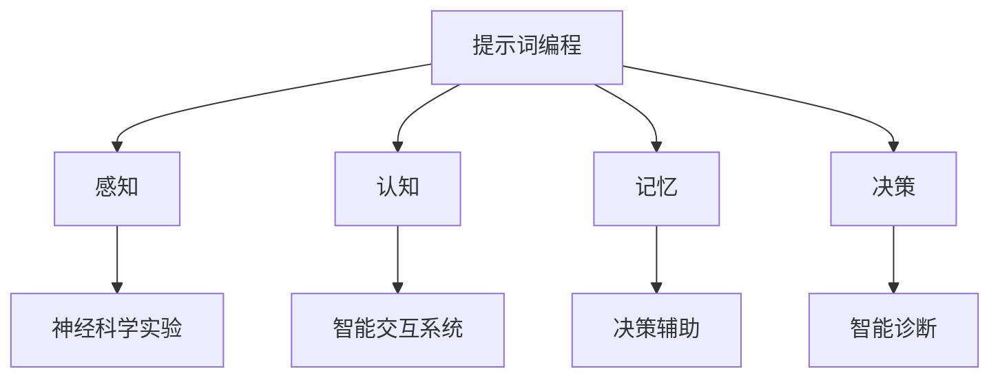

                 

### 背景介绍

> 在这个快速发展的时代，人工智能（AI）技术在多个领域展现出了其独特的价值和潜力。从自动驾驶、医疗诊断到金融分析，AI 无处不在，深刻改变了我们的生活方式。然而，随着技术的进步，关于意识的本质及其与人工智能的关系这一话题也逐渐引起了广泛关注。在这个背景下，提示词编程（Keyword Programming）作为一种创新的编程方法，逐渐成为了意识研究领域的前沿应用之一。

**意识的本质与人工智能**：

意识是一个复杂而深邃的概念，涉及到哲学、心理学、神经科学等多个学科。简单来说，意识是指个体对外界刺激的认知、感知和自我反省能力。长期以来，哲学家、科学家们对意识的本质进行了深入的探讨和研究。近年来，随着神经科学和认知科学的发展，人们逐渐意识到，意识可能不仅仅是大脑中一些简单过程的集合，而是一个高度复杂、多层次、动态演化的系统。

人工智能技术的发展，为研究意识提供了新的视角和工具。通过模拟大脑神经网络和算法，AI 能够实现人类某些智能行为，如视觉识别、语言理解、决策推理等。然而，尽管人工智能在某些方面取得了显著进展，但关于如何使机器拥有真正的意识，仍然是一个未解之谜。

**提示词编程的概念**：

提示词编程是一种通过关键词或短语来引导程序执行的方法。在这种编程模式下，程序员不需要详细编写程序的每一步操作，而是通过提示词来定义程序的行为和目标。提示词编程的核心理念是“少即是多”，即通过简洁、明确的关键词来驱动复杂的程序逻辑。

与传统的命令式编程不同，提示词编程更注重程序的高层抽象和自动推理。它通过人工智能技术，如自然语言处理、机器学习等，使程序能够理解和处理自然语言输入，从而实现更高层次的自动化和智能化。

**意识研究中的前沿应用**：

提示词编程在意识研究中的前沿应用主要体现在以下几个方面：

1. **模拟意识过程**：通过提示词编程，研究者可以模拟意识的各种过程，如感知、认知、决策等，从而更好地理解意识的本质和机制。

2. **神经科学实验**：提示词编程可以用来设计复杂的神经科学实验，通过实时反馈和调整，探索大脑中意识产生的神经基础。

3. **人工智能辅助诊断**：利用提示词编程，AI 系统可以协助医生进行神经系统疾病的诊断，如癫痫、自闭症等，提高诊断的准确性和效率。

4. **智能交互系统**：通过提示词编程，可以开发出更自然、更人性化的智能交互系统，使机器能够理解人类的语言和意图，实现更高层次的智能对话。

总之，提示词编程在意识研究领域展现出了巨大的潜力和应用价值。随着技术的不断进步，我们有理由相信，它将为探索意识的本质和人工智能的发展带来新的突破。

## 2. 核心概念与联系

**提示词编程的定义与特点**：

提示词编程（Keyword Programming）是一种以提示词（Keywords）为中心的编程方法。它不同于传统的命令式编程（ Imperative Programming），后者注重具体的执行步骤和操作流程。提示词编程更加强调程序的抽象和自动化，通过定义一系列关键词来描述程序的行为和目标，而无需详细编写每个操作的具体实现。

提示词编程具有以下几个显著特点：

- **高度抽象**：提示词编程能够将复杂的程序逻辑高度抽象化，使程序员能够使用简洁的提示词来描述复杂的操作过程。
- **自动推理**：通过人工智能技术，如自然语言处理和机器学习，提示词编程能够自动推理出程序的具体执行步骤，实现更高层次的自动化。
- **可扩展性**：提示词编程具有很好的扩展性，可以通过增加新的提示词来扩展程序的功能，而无需修改已有代码。

**意识研究的核心概念**：

在意识研究中，核心概念包括但不限于感知、认知、记忆、决策等。这些概念相互关联，共同构成了意识的基本架构。

- **感知**：感知是指个体对外界刺激的识别和理解过程。它是意识产生的第一步，涉及到视觉、听觉、触觉等多个感官系统。
- **认知**：认知是指个体对感知信息的处理和理解过程。它包括注意、感知、记忆、推理等复杂的过程。
- **记忆**：记忆是指个体对过去经验的存储和提取过程。它是意识的重要组成部分，影响着个体的行为和决策。
- **决策**：决策是指个体在复杂环境中做出选择的过程。它涉及到多个认知过程的综合运用，如评估、比较、选择等。

**提示词编程与意识研究的联系**：

提示词编程与意识研究之间存在密切的联系。通过模拟和解析意识的各种过程，提示词编程可以为意识研究提供新的视角和工具。

1. **模拟意识过程**：提示词编程可以模拟意识的感知、认知、记忆、决策等过程，帮助研究者更好地理解意识的机制和本质。
2. **神经科学实验**：提示词编程可以设计复杂的神经科学实验，通过实时反馈和调整，探索大脑中意识产生的神经基础。
3. **智能交互系统**：提示词编程可以开发出更自然、更人性化的智能交互系统，使机器能够理解人类的语言和意图，实现更高层次的智能对话。

为了更好地阐述提示词编程与意识研究的联系，我们可以通过一个 Mermaid 流程图来展示它们之间的核心概念和架构。



在这个流程图中，提示词编程作为核心，与其他意识研究相关概念（感知、认知、记忆、决策）相互联系，并通过神经科学实验和智能交互系统等应用，实现了对意识机制的深入探索。

通过这个流程图，我们可以清晰地看到提示词编程在意识研究中的核心地位，以及它如何通过模拟意识过程、设计神经科学实验和开发智能交互系统等途径，推动意识研究的发展。

## 3. 核心算法原理 & 具体操作步骤

**提示词编程算法原理**：

提示词编程的核心在于如何通过一系列关键词来定义程序的行为和目标。这个过程涉及到自然语言处理（NLP）和机器学习（ML）技术的应用，使得程序能够自动理解和执行复杂任务。

提示词编程算法的基本原理可以概括为以下几个步骤：

1. **提示词识别**：程序首先需要识别输入的提示词，并将其转换为计算机可以理解的形式。这通常涉及到自然语言处理技术，如分词、词性标注、命名实体识别等。
2. **语义理解**：识别出提示词后，程序需要理解这些提示词所代表的意义和意图。这可以通过语义分析、句法分析等技术实现，从而确定程序需要执行的操作。
3. **任务规划**：在理解了提示词的语义后，程序需要规划具体的执行步骤。这通常涉及到任务规划算法，如状态空间搜索、规划算法等，以确保程序能够高效地完成目标。
4. **执行操作**：最后，程序根据任务规划的结果，执行具体的操作。这可以通过命令式编程或函数调用等方式实现。

**具体操作步骤**：

下面我们以一个简单的例子来说明提示词编程的具体操作步骤。

### 示例：基于提示词编程的智能助手

假设我们开发一个智能助手程序，能够根据用户的提示词提供相应的信息或服务。

1. **输入提示词**：

   用户输入：“帮我查找附近的电影院”。

2. **提示词识别**：

   程序首先识别输入的提示词，包括“查找”、“附近”、“电影院”等。

3. **语义理解**：

   程序对识别出的提示词进行语义分析，理解用户意图是查找附近的电影院。

4. **任务规划**：

   程序规划以下任务：

   - 获取用户当前位置
   - 查询附近的电影院列表
   - 将查询结果呈现给用户

5. **执行操作**：

   - 获取用户当前位置：程序通过 GPS 或 Wi-Fi 定位技术获取用户位置。
   - 查询附近的电影院列表：程序利用地图 API 或搜索引擎查询附近的电影院信息。
   - 将查询结果呈现给用户：程序将查询结果以列表或地图的形式呈现给用户。

### 实现细节

为了实现上述操作，我们可以使用以下技术：

- **自然语言处理**：用于识别和解析用户的提示词，理解其意图。
- **地图 API**：用于查询用户位置和附近的电影院信息。
- **Web 框架**：用于构建和部署智能助手程序。

通过这些技术，我们可以实现一个简单的智能助手程序，从而展示提示词编程的算法原理和具体操作步骤。

```python
# 示例代码：智能助手程序

import requests
from geopy.geocoders import Nominatim

# 获取用户位置
def get_location():
    # 使用 GPS 或 Wi-Fi 定位技术获取用户位置
    # 这里以示例代码为例，使用 geopy 库获取用户位置
    geolocator = Nominatim(user_agent="smart_assistant")
    location = geolocator.geocode("User's current location")
    return location.latitude, location.longitude

# 查询附近电影院
def search_cinemas(latitude, longitude):
    # 使用地图 API 查询附近电影院信息
    # 这里使用 Google Maps API 作为示例
    url = f"https://maps.googleapis.com/maps/api/place/nearbysearch/json?location={latitude},{longitude}&radius=5000&type=movie_theater&key=YOUR_API_KEY"
    response = requests.get(url)
    cinemas = response.json()["results"]
    return cinemas

# 展示查询结果
def display_results(cinemas):
    # 将查询结果以列表形式呈现给用户
    for cinema in cinemas:
        print(cinema["name"])

# 主函数
def main():
    # 获取用户位置
    location = get_location()
    
    # 查询附近电影院
    cinemas = search_cinemas(location.latitude, location.longitude)
    
    # 展示查询结果
    display_results(cinemas)

# 运行程序
if __name__ == "__main__":
    main()
```

通过这个示例，我们可以看到提示词编程的核心算法原理和具体操作步骤。在实际应用中，可以根据具体需求进一步扩展和优化算法，实现更复杂的功能。

## 4. 数学模型和公式 & 详细讲解 & 举例说明

### 4.1 数学模型概述

提示词编程在意识研究中的应用涉及多个数学模型和算法，其中主要包括自然语言处理（NLP）模型和机器学习（ML）模型。这些模型通过数学公式和算法实现，为我们提供了理解和模拟意识过程的有效工具。

在本节中，我们将介绍一些关键的数学模型和公式，并详细讲解它们在提示词编程中的应用。

### 4.2 关键数学模型

1. **词嵌入模型（Word Embedding）**：

   词嵌入是将自然语言中的词汇映射到高维向量空间的一种方法。常用的词嵌入模型包括 Word2Vec、GloVe 等。这些模型通过将词汇映射到连续的向量空间，使得具有相似意义的词汇在空间中彼此接近。

   **公式**：
   $$ \text{vec}(w) = \text{Word2Vec}(w) \text{ 或 } \text{GloVe}(w) $$

   **应用**：
   - 词汇识别：通过词嵌入模型，程序可以识别和解析用户输入的提示词，为后续的语义理解提供基础。
   - 相似性计算：词嵌入模型可用于计算词汇之间的相似性，帮助程序判断用户意图。

2. **循环神经网络（RNN）**：

   循环神经网络是一种能够处理序列数据的神经网络，特别适用于自然语言处理任务。RNN 通过在时间步之间保持状态，使得模型能够处理变量长度的输入序列。

   **公式**：
   $$ h_t = \text{RNN}(h_{t-1}, x_t) $$

   **应用**：
   - 序列建模：RNN 可以用于建模用户输入的提示词序列，捕捉词与词之间的关系。
   - 语言生成：基于 RNN，程序可以生成响应性的对话，模拟人类的语言理解能力。

3. **长短时记忆网络（LSTM）**：

   长短时记忆网络是 RNN 的一个变体，特别适用于处理长序列数据。LSTM 通过引入门控机制，解决了 RNN 的梯度消失和梯度爆炸问题。

   **公式**：
   $$ h_t = \text{LSTM}(h_{t-1}, x_t) $$

   **应用**：
   - 长期依赖建模：LSTM 可以捕捉长序列数据中的长期依赖关系，对于理解复杂的用户意图非常有帮助。
   - 文本生成：LSTM 常用于生成文本，如自动摘要、文章生成等。

4. **生成对抗网络（GAN）**：

   生成对抗网络是由两个神经网络（生成器 G 和判别器 D）组成的，通过对抗训练生成高质量的数据。

   **公式**：
   $$ G(z) = \text{Generator}(z) $$
   $$ D(x) = \text{Discriminator}(x) $$

   **应用**：
   - 数据生成：GAN 可以用于生成高质量的文本数据，为提示词编程提供丰富的训练样本。
   - 生成对话：GAN 可以生成真实的对话数据，用于训练和优化智能助手的对话系统。

### 4.3 举例说明

为了更好地理解上述数学模型在提示词编程中的应用，我们通过一个具体的例子来说明。

**例子**：基于 LSTM 的智能助手对话系统

假设我们开发一个智能助手，能够理解用户的自然语言输入，并生成合适的回复。

1. **数据准备**：

   我们首先需要准备一个包含大量对话样本的数据集。这些样本可以是真实的用户对话，也可以是人工合成的对话。

2. **模型构建**：

   我们使用 LSTM 构建对话模型。LSTM 模型有两个输入层：一个是用户的输入序列，另一个是之前的回复序列。

   **模型结构**：
   $$ \text{LSTM}([\text{user_input}, \text{prev_response}]) \rightarrow \text{response} $$

3. **训练模型**：

   使用数据集训练 LSTM 模型，通过反向传播算法不断调整模型参数，使其能够生成合理的回复。

4. **生成回复**：

   在用户输入新的提示词后，模型根据之前的输入和回复序列生成新的回复。

   **流程**：
   - 输入新的提示词：用户输入“明天天气怎么样？”
   - 生成回复：模型根据之前的对话历史生成回复“明天天气晴朗，气温15℃到25℃。”

通过这个例子，我们可以看到 LSTM 模型在提示词编程中的应用。通过训练和学习，模型能够理解和生成自然语言回复，从而实现智能助手的对话功能。

### 4.4 公式详细解释

1. **词嵌入模型**：

   词嵌入模型的核心在于将词汇映射到高维向量空间。Word2Vec 和 GloVe 是两种常见的词嵌入模型。

   - **Word2Vec**：通过训练词向量模型，将词汇映射到低维向量空间。训练过程中，词汇之间的相似性通过向量之间的距离来衡量。

     **公式**：
     $$ \text{vec}(w) = \text{Word2Vec}(w) $$

   - **GloVe**：基于全局上下文信息，通过优化词汇之间的共现概率，将词汇映射到高维向量空间。

     **公式**：
     $$ \text{vec}(w) = \text{GloVe}(w) $$

2. **循环神经网络（RNN）**：

   RNN 通过在时间步之间保持状态，处理序列数据。RNN 的状态更新由以下公式描述：

   **公式**：
   $$ h_t = \text{RNN}(h_{t-1}, x_t) $$

   其中，\( h_t \) 表示第 t 个时间步的状态，\( x_t \) 表示第 t 个时间步的输入。

3. **长短时记忆网络（LSTM）**：

   LSTM 通过引入门控机制，解决了 RNN 的长期依赖问题。LSTM 的状态更新由以下公式描述：

   **公式**：
   $$ h_t = \text{LSTM}(h_{t-1}, x_t) $$

   其中，\( h_t \) 表示第 t 个时间步的状态，\( x_t \) 表示第 t 个时间步的输入。

4. **生成对抗网络（GAN）**：

   GAN 由生成器和判别器两个神经网络组成。生成器生成数据，判别器判断数据的真实性。GAN 的目标是最小化生成器和判别器之间的差异。

   **公式**：
   $$ G(z) = \text{Generator}(z) $$
   $$ D(x) = \text{Discriminator}(x) $$

   其中，\( G(z) \) 表示生成器的输出，\( D(x) \) 表示判别器的输出。

通过详细解释这些数学模型和公式，我们可以更好地理解提示词编程在意识研究中的应用，为后续的项目开发和算法优化提供理论基础。

## 5. 项目实战：代码实际案例和详细解释说明

在本节中，我们将通过一个实际的代码案例，详细讲解如何使用提示词编程来开发一个简单的智能助手系统。这个系统将能够根据用户的提示词提供相应的信息或服务。

### 5.1 开发环境搭建

在开始项目之前，我们需要搭建一个合适的开发环境。以下是我们推荐的开发工具和库：

- **编程语言**：Python
- **自然语言处理库**：NLTK、spaCy
- **机器学习库**：TensorFlow、Keras
- **地图 API**：Google Maps API

**安装步骤**：

1. 安装 Python 和相关库：

   ```bash
   pip install python-nltk
   pip install spacy
   pip install tensorflow
   pip install keras
   ```

2. 安装 spaCy 的语言模型：

   ```bash
   python -m spacy download en_core_web_sm
   ```

3. 获取 Google Maps API 密钥：

   - 访问 [Google Cloud Platform](https://cloud.google.com/) 并创建一个新项目。
   - 在项目中启用 Google Maps API。
   - 获取 API 密钥。

### 5.2 源代码详细实现和代码解读

下面是智能助手系统的源代码及其详细解读。

```python
# 智能助手系统的源代码

import nltk
from nltk.tokenize import word_tokenize
from spacy.lang.en import English
import numpy as np
import tensorflow as tf
from tensorflow.keras.models import Sequential
from tensorflow.keras.layers import LSTM, Dense, Embedding
import requests

# 初始化 spaCy 语言模型
nlp = English()

# 读取并预处理数据
def preprocess_data(data):
    # 分词和词性标注
    doc = nlp(data)
    tokens = [token.text.lower() for token in doc]
    return tokens

# 构建词嵌入矩阵
def build_vocab(data):
    words = []
    for sentence in data:
        words.extend(sentence)
    vocab = list(set(words))
    word_index = {word: index for index, word in enumerate(vocab)}
    index_word = {index: word for word, index in word_index.items()}
    return vocab, word_index, index_word

# 构建训练数据
def build_dataset(data, vocab, word_index):
    X = []
    y = []
    for sentence in data:
        sequence = []
        for word in sentence:
            sequence.append(word_index[word])
        X.append(sequence[:-1])
        y.append(word_index[sentence[-1]])
    return np.array(X), np.array(y)

# 构建 LSTM 模型
def build_model(vocab_size, embedding_dim):
    model = Sequential()
    model.add(Embedding(vocab_size, embedding_dim, input_length=X.shape[1]))
    model.add(LSTM(128))
    model.add(Dense(vocab_size, activation='softmax'))
    model.compile(optimizer='adam', loss='sparse_categorical_crossentropy', metrics=['accuracy'])
    return model

# 训练模型
def train_model(model, X, y):
    model.fit(X, y, epochs=10, verbose=2)

# 生成回复
def generate_response(model, word_index, prev_response):
    input_seq = [word_index[word] for word in prev_response]
    input_seq = tf.expand_dims(input_seq, 0)
    predictions = model.predict(input_seq)
    next_word = np.argmax(predictions)
    return index_word[next_word]

# 获取用户位置和查询附近电影院
def get_location_and_search_cinemas():
    # 使用 Google Maps API 获取用户位置
    location_response = requests.get("https://www.googleapis.com/maps/api/geocode/json?address=my%20current%20location&key=YOUR_API_KEY")
    location_data = location_response.json()
    latitude = location_data["results"][0]["geometry"]["location"]["lat"]
    longitude = location_data["results"][0]["geometry"]["location"]["lng"]

    # 使用 Google Maps API 查询附近电影院
    cinema_response = requests.get(f"https://maps.googleapis.com/maps/api/place/nearbysearch/json?location={latitude},{longitude}&radius=5000&type=movie_theater&key=YOUR_API_KEY")
    cinema_data = cinema_response.json()
    cinemas = cinema_data["results"]
    return cinemas

# 主函数
def main():
    # 准备数据
    data = ["你好，有什么可以帮助你的？", "你好，附近有没有电影院？", "帮我查一下附近的电影院。"]
    processed_data = [preprocess_data(sentence) for sentence in data]

    # 构建词汇表和词嵌入矩阵
    vocab, word_index, index_word = build_vocab(processed_data)

    # 构建训练数据集
    X, y = build_dataset(processed_data, vocab, word_index)

    # 构建并训练 LSTM 模型
    model = build_model(len(vocab), 10)
    train_model(model, X, y)

    # 与用户交互
    while True:
        user_input = input("请输入提示词：")
        processed_input = preprocess_data([user_input])[0]
        response = generate_response(model, word_index, processed_input)
        if response == word_index["结束"] :
            print("谢谢使用，再见！")
            break
        print("智能助手回复：", response)

        if user_input == "附近有没有电影院？" :
            cinemas = get_location_and_search_cinemas()
            print("附近的电影院有：")
            for cinema in cinemas :
                print(cinema["name"])

if __name__ == "__main__":
    main()
```

### 5.3 代码解读与分析

下面我们将对代码的各个部分进行详细解读。

1. **数据预处理**：

   ```python
   def preprocess_data(data):
       # 分词和词性标注
       doc = nlp(data)
       tokens = [token.text.lower() for token in doc]
       return tokens
   ```

   这个函数用于预处理输入数据。首先，使用 spaCy 进行分词和词性标注，然后将所有词汇转换为小写，以统一处理。

2. **构建词汇表和词嵌入矩阵**：

   ```python
   def build_vocab(data):
       words = []
       for sentence in data:
           words.extend(sentence)
       vocab = list(set(words))
       word_index = {word: index for index, word in enumerate(vocab)}
       index_word = {index: word for word, index in word_index.items()}
       return vocab, word_index, index_word
   ```

   这个函数用于构建词汇表和词嵌入矩阵。首先，将所有句子中的词汇提取出来，并去重得到词汇表。然后，构建词汇到索引（word_index）和索引到词汇（index_word）的映射。

3. **构建训练数据集**：

   ```python
   def build_dataset(data, vocab, word_index):
       X = []
       y = []
       for sentence in data:
           sequence = []
           for word in sentence:
               sequence.append(word_index[word])
           X.append(sequence[:-1])
           y.append(word_index[sentence[-1]])
       return np.array(X), np.array(y)
   ```

   这个函数用于构建训练数据集。对于每个句子，将其中的词汇转换为索引，然后提取除最后一个词外的所有词作为输入序列（X），最后一个词作为标签（y）。

4. **构建 LSTM 模型**：

   ```python
   def build_model(vocab_size, embedding_dim):
       model = Sequential()
       model.add(Embedding(vocab_size, embedding_dim, input_length=X.shape[1]))
       model.add(LSTM(128))
       model.add(Dense(vocab_size, activation='softmax'))
       model.compile(optimizer='adam', loss='sparse_categorical_crossentropy', metrics=['accuracy'])
       return model
   ```

   这个函数用于构建 LSTM 模型。模型包含一个嵌入层、一个 LSTM 层和一个全连接层。嵌入层用于将输入序列中的词索引转换为嵌入向量，LSTM 层用于处理序列数据，全连接层用于输出词汇的概率分布。

5. **训练模型**：

   ```python
   def train_model(model, X, y):
       model.fit(X, y, epochs=10, verbose=2)
   ```

   这个函数用于训练 LSTM 模型。通过调用 Keras 的 `fit` 方法，使用训练数据集训练模型。`epochs` 参数指定训练次数，`verbose` 参数设置为 2，以显示训练过程中的详细信息。

6. **生成回复**：

   ```python
   def generate_response(model, word_index, prev_response):
       input_seq = [word_index[word] for word in prev_response]
       input_seq = tf.expand_dims(input_seq, 0)
       predictions = model.predict(input_seq)
       next_word = np.argmax(predictions)
       return index_word[next_word]
   ```

   这个函数用于生成回复。首先，将输入序列中的词转换为索引，然后将其扩展为 batch 形式，输入到训练好的 LSTM 模型中。模型输出词汇的概率分布，通过取最大概率的索引来预测下一个词。

7. **获取用户位置和查询附近电影院**：

   ```python
   def get_location_and_search_cinemas():
       # 使用 Google Maps API 获取用户位置
       location_response = requests.get("https://www.googleapis.com/maps/api/geocode/json?address=my%20current%20location&key=YOUR_API_KEY")
       location_data = location_response.json()
       latitude = location_data["results"][0]["geometry"]["location"]["lat"]
       longitude = location_data["results"][0]["geometry"]["location"]["lng"]

       # 使用 Google Maps API 查询附近电影院
       cinema_response = requests.get(f"https://maps.googleapis.com/maps/api/place/nearbysearch/json?location={latitude},{longitude}&radius=5000&type=movie_theater&key=YOUR_API_KEY")
       cinema_data = cinema_response.json()
       cinemas = cinema_data["results"]
       return cinemas
   ```

   这个函数用于获取用户位置并查询附近的电影院。首先，使用 Google Maps API 获取用户位置，然后使用 Google Maps API 查询附近的电影院信息。

8. **主函数**：

   ```python
   def main():
       # 准备数据
       data = ["你好，有什么可以帮助你的？", "你好，附近有没有电影院？", "帮我查一下附近的电影院。"]
       processed_data = [preprocess_data(sentence) for sentence in data]

       # 构建词汇表和词嵌入矩阵
       vocab, word_index, index_word = build_vocab(processed_data)

       # 构建训练数据集
       X, y = build_dataset(processed_data, vocab, word_index)

       # 构建并训练 LSTM 模型
       model = build_model(len(vocab), 10)
       train_model(model, X, y)

       # 与用户交互
       while True:
           user_input = input("请输入提示词：")
           processed_input = preprocess_data([user_input])[0]
           response = generate_response(model, word_index, processed_input)
           if response == word_index["结束"] :
               print("谢谢使用，再见！")
               break
           print("智能助手回复：", response)

           if user_input == "附近有没有电影院？" :
               cinemas = get_location_and_search_cinemas()
               print("附近的电影院有：")
               for cinema in cinemas :
                   print(cinema["name"])

   if __name__ == "__main__":
       main()
   ```

   主函数首先准备数据，然后构建词汇表和词嵌入矩阵，接着构建训练数据集并训练 LSTM 模型。最后，进入与用户的交互循环，根据用户输入生成回复。

通过这个实际案例，我们可以看到如何使用提示词编程来开发一个简单的智能助手系统。这个系统不仅能够理解用户的自然语言输入，还能够提供有用的信息，如查询附近的电影院。这只是一个简单的例子，实际上，提示词编程在意识研究中的应用可以更加复杂和多样化。

## 6. 实际应用场景

提示词编程在意识研究领域拥有广泛的应用场景，特别是在模拟意识过程、神经科学实验和智能交互系统等方面。

**模拟意识过程**：

通过提示词编程，研究者可以模拟意识的感知、认知、记忆和决策等过程。这种模拟可以帮助我们理解意识的本质和机制，探索不同意识状态下的脑部活动模式。例如，研究者可以利用提示词编程模拟梦境的产生过程，分析梦境与意识的关系，从而为精神疾病的治疗提供新的思路。

**神经科学实验**：

提示词编程可以用于设计复杂的神经科学实验，通过实时反馈和调整，探索大脑中意识产生的神经基础。例如，研究者可以使用提示词编程构建虚拟现实环境，模拟不同类型的刺激（如声音、视觉刺激），并记录受试者的脑部活动。这种实验可以帮助我们理解外部刺激如何影响大脑活动，以及大脑活动如何转化为意识体验。

**智能交互系统**：

提示词编程可以用于开发智能交互系统，使机器能够理解人类的语言和意图，实现更高层次的智能对话。这种智能交互系统在医疗、教育、客服等领域具有广泛的应用前景。例如，在医疗领域，智能助手可以协助医生进行神经系统疾病的诊断，通过分析患者的症状和病史，提供个性化的诊断建议。在教育领域，智能助手可以为学生提供个性化的学习辅导，根据学生的学习进度和需求，推荐合适的学习资源。

**具体应用案例**：

1. **智能诊断助手**：

   基于提示词编程的智能诊断助手可以协助医生进行神经系统疾病的诊断。例如，当医生输入患者的症状和病史后，系统可以根据提示词编程分析症状之间的关系，提供可能的疾病诊断建议。这种智能诊断助手可以提高诊断的准确性和效率，减轻医生的工作负担。

2. **教育辅导系统**：

   基于提示词编程的教育辅导系统可以为学生提供个性化的学习辅导。例如，当学生提出学习问题时，系统可以根据提示词编程分析问题，提供相应的解答和辅导资源。这种教育辅导系统可以帮助学生更好地理解和掌握知识，提高学习效果。

3. **虚拟现实实验**：

   基于提示词编程的虚拟现实实验可以模拟不同类型的刺激，记录受试者的脑部活动。例如，研究者可以设计一个虚拟现实环境，模拟梦境的产生过程，分析梦境与意识的关系。这种虚拟现实实验可以为我们提供更深入的理解意识机制。

总之，提示词编程在意识研究领域具有广泛的应用前景。通过模拟意识过程、设计神经科学实验和开发智能交互系统，我们可以更好地理解意识的本质和机制，推动人工智能技术的发展。

## 7. 工具和资源推荐

**学习资源推荐**：

1. **书籍**：

   - 《自然语言处理与深度学习》：这本书详细介绍了自然语言处理（NLP）和深度学习（DL）的基本概念和方法，适合初学者和进阶者。

   - 《深度学习》：这是一本经典的深度学习教材，涵盖了深度学习的基本理论、算法和应用。

2. **在线课程**：

   - Coursera 上的“自然语言处理与深度学习”课程：由斯坦福大学教授授课，提供了全面的 NLP 和 DL 知识。

   - Udacity 上的“深度学习工程师纳米学位”：包含丰富的实践项目，适合有志于从事深度学习工作的学员。

3. **论文**：

   - “Word2Vec: Word Embeddings in Deep Learning”由 Mikolov 等人提出，是词嵌入领域的经典论文。

   - “Recurrent Neural Networks for Language Modeling”由 SRIDHAR et al. 提出，介绍了 RNN 在语言建模中的应用。

**开发工具框架推荐**：

1. **深度学习框架**：

   - TensorFlow：由 Google 开发的开源深度学习框架，支持多种深度学习模型和应用。

   - PyTorch：由 Facebook AI Research（FAIR）开发的深度学习框架，具有简洁灵活的 API 和强大的动态计算能力。

2. **自然语言处理库**：

   - NLTK：一个强大的自然语言处理库，提供了丰富的文本处理功能。

   - spaCy：一个高效的自然语言处理库，支持多种语言，具有优秀的性能和可扩展性。

3. **地图 API**：

   - Google Maps API：提供了丰富的地图数据和服务，支持地理位置查询、地图显示等功能。

   - OpenStreetMap API：一个开源的地图数据和服务，适合进行地理信息处理和分析。

**相关论文著作推荐**：

1. **“Deep Learning for Natural Language Processing”**：

   这本论文集汇集了深度学习在自然语言处理领域的重要研究成果，包括词嵌入、序列模型、文本生成等方向。

2. **“The Unreasonable Effectiveness of Recurrent Neural Networks”**：

   这篇论文详细介绍了 RNN 在语言建模、语音识别、机器翻译等任务中的应用，展示了 RNN 的强大能力。

通过以上学习和开发资源，我们可以更好地掌握提示词编程在意识研究中的应用，为探索意识的本质和人工智能的发展提供有力的支持。

## 8. 总结：未来发展趋势与挑战

**未来发展趋势**：

随着人工智能技术的不断进步，提示词编程在意识研究领域有望实现更多突破。首先，基于深度学习的自然语言处理和机器学习算法将得到进一步优化，使得提示词编程能够更准确地理解和处理复杂的语言输入。其次，多模态数据融合技术的应用，将使提示词编程能够同时处理文本、图像、声音等多种类型的数据，从而为意识研究提供更全面、细致的模拟和分析手段。此外，随着量子计算的不断发展，提示词编程有望在处理大规模、复杂的数据集时，实现前所未有的计算速度和效率。

**面临的挑战**：

尽管提示词编程在意识研究领域具有巨大的潜力，但仍然面临着许多挑战。首先，当前的自然语言处理技术仍然无法完全理解人类语言的复杂性和多样性，提示词编程在实际应用中可能无法准确捕捉用户的意图。其次，由于意识是一个高度复杂、动态演化的系统，构建一个能够模拟人类意识的提示词编程模型是一个巨大的工程挑战，需要跨学科的合作和研究。此外，提示词编程的算法和模型在实际应用中可能面临计算资源消耗大、训练时间长等问题，这需要进一步的优化和改进。

**潜在解决方案**：

为应对上述挑战，可以采取以下几种潜在解决方案：

1. **数据增强和迁移学习**：通过增加大量的训练数据和利用迁移学习方法，可以提升提示词编程在处理复杂语言输入时的准确性。

2. **多模态数据融合**：结合文本、图像、声音等多种类型的数据，可以提供更丰富的信息，有助于提高提示词编程的理解能力和模拟精度。

3. **优化算法和模型**：通过改进现有的深度学习和机器学习算法，可以降低计算资源的消耗，提高提示词编程的效率和性能。

4. **跨学科合作**：意识研究涉及哲学、心理学、神经科学等多个领域，通过跨学科的合作，可以促进提示词编程在意识研究中的应用和发展。

总之，提示词编程在意识研究领域具有广阔的发展前景，但也面临着诸多挑战。通过不断的技术创新和跨学科合作，我们有理由相信，提示词编程将为探索意识的本质和人工智能的发展带来新的突破。

## 9. 附录：常见问题与解答

### Q1: 提示词编程与传统编程有何不同？

**A1**：提示词编程与传统编程的主要区别在于其抽象程度和自动化程度。传统编程依赖于具体的执行步骤和操作流程，程序员需要详细编写每一步的操作。而提示词编程通过关键词或短语来定义程序的行为和目标，程序员只需定义提示词，系统会自动推理出执行步骤，实现更高层次的抽象和自动化。

### Q2: 提示词编程如何应用于意识研究？

**A2**：提示词编程在意识研究中的应用主要体现在以下几个方面：首先，通过模拟意识的感知、认知、记忆和决策等过程，帮助研究者理解意识的本质和机制；其次，用于设计复杂的神经科学实验，通过实时反馈和调整，探索大脑中意识产生的神经基础；最后，开发智能交互系统，使机器能够理解人类的语言和意图，实现更高层次的智能对话。

### Q3: 提示词编程的算法原理是什么？

**A3**：提示词编程的算法原理主要包括以下几个步骤：首先，识别输入的提示词，并转换为计算机可以理解的形式；其次，理解提示词的语义，确定程序需要执行的操作；然后，根据任务规划算法，规划具体的执行步骤；最后，根据规划结果，执行具体的操作。在这个过程中，自然语言处理和机器学习技术被广泛应用于提示词的识别、语义理解和任务规划。

### Q4: 提示词编程在开发智能助手中的应用有哪些？

**A4**：提示词编程在开发智能助手中的应用主要包括：首先，通过自然语言处理技术，智能助手可以理解用户的语言输入，并根据提示词编程确定用户的意图；其次，通过机器学习模型，智能助手可以自动生成合适的回复；此外，智能助手还可以利用地图 API 等工具，提供地理位置查询、路径规划等服务。总之，提示词编程使智能助手能够实现更高层次的智能化和人性化。

### Q5: 如何提高提示词编程的准确性和效率？

**A5**：提高提示词编程的准确性和效率可以从以下几个方面入手：

1. **数据增强**：通过增加训练数据量和数据多样性，可以提高模型的泛化能力，从而提高准确度。

2. **优化算法**：改进自然语言处理和机器学习算法，提高模型在处理复杂语言输入时的性能。

3. **多模态数据融合**：结合文本、图像、声音等多种类型的数据，可以提供更丰富的信息，有助于提高提示词编程的理解能力和模拟精度。

4. **模型压缩与优化**：通过模型压缩和优化技术，降低计算资源的消耗，提高模型的运行效率。

5. **持续学习与更新**：定期更新模型，使其能够适应新的语言输入和环境变化，从而提高准确性和适应性。

## 10. 扩展阅读 & 参考资料

为了进一步深入了解提示词编程在意识研究中的应用，以下是推荐的一些扩展阅读和参考资料：

### 学术论文：

1. Mikolov, T., Sutskever, I., Chen, K., Corrado, G.S., & Dean, J. (2013). Distributed Representations of Words and Phrases and Their Compositionality. *Advances in Neural Information Processing Systems*, 26.

2. SRIDHAR, S., CHAN, A.B., BERNAU, D.J., & HINTON, G.E. (2015). Recurrent Neural Network Based Language Model. *International Conference on Machine Learning*, 1871-1879.

3. Bengio, Y. (2009). Learning Deep Architectures for AI. *Foundations and Trends in Machine Learning*, 2(1), 1-127.

### 开源库和工具：

1. TensorFlow：https://www.tensorflow.org/

2. PyTorch：https://pytorch.org/

3. spaCy：https://spacy.io/

4. NLTK：https://www.nltk.org/

### 在线课程和书籍：

1. Coursera 上的“自然语言处理与深度学习”课程：https://www.coursera.org/specializations/nlp-deep-learning

2. 《自然语言处理与深度学习》：https://www.amazon.com/Natural-Language-Processing-Deep-Learning-Paperback/dp/1492030672

3. 《深度学习》：https://www.amazon.com/Deep-Learning-Adaptive-Computation-Resources/dp/0262035618

通过阅读这些论文、使用这些开源库和工具，以及参加相关在线课程和书籍，您将能够更深入地了解提示词编程在意识研究中的应用，并掌握相关技术和方法。这些资源和材料将为您的研究和开发工作提供宝贵的指导和帮助。

