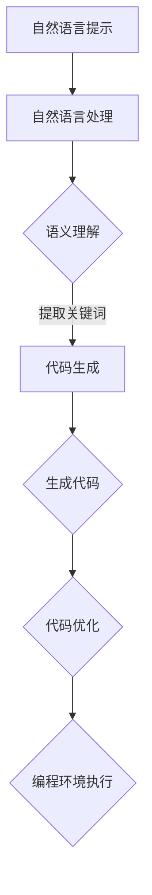

                 

# 提示词编程在教育领域的应用前景

## 摘要

本文旨在探讨提示词编程（Prompt Programming）在教育领域的应用前景。提示词编程作为一种先进的人工智能编程方法，通过引导用户输入自然语言提示，使得编程过程更加直观、易懂。本文首先介绍提示词编程的基本概念，然后分析其在教育领域的潜在优势和应用场景，最后讨论其面临的挑战和未来发展趋势。

## 1. 背景介绍

随着人工智能技术的快速发展，编程教育已成为培养未来创新人才的重要途径。传统的编程教育方法主要依赖于编程语言和编程框架，学生需要掌握大量的语法规则和编程技巧。然而，这种方法对于初学者来说往往存在较高的学习门槛，难以激发学生的学习兴趣。提示词编程作为一种新兴的编程方法，通过将自然语言提示与编程逻辑相结合，为编程教育提供了一种全新的解决方案。

### 1.1 提示词编程的定义

提示词编程（Prompt Programming）是一种基于自然语言交互的编程方法，通过用户输入自然语言提示（例如问题描述或需求描述），系统自动生成相应的代码。这种编程方法的核心在于将编程过程转化为自然语言理解和生成的过程，从而降低编程的难度，提高编程的效率。

### 1.2 提示词编程的发展历程

提示词编程的概念最早可以追溯到自然语言处理（NLP）领域。随着深度学习和生成对抗网络（GAN）等技术的不断发展，提示词编程逐渐成为人工智能领域的研究热点。近年来，许多研究机构和科技公司开始关注提示词编程在教育领域的应用，例如谷歌的 AI 编程助手 Co-Pilot、微软的 AI 编程助手 Code Doctor 等。

## 2. 核心概念与联系

### 2.1 提示词编程的工作原理

提示词编程的工作原理主要分为两个阶段：自然语言理解（NLU）和代码生成（CG）。

#### 2.1.1 自然语言理解（NLU）

自然语言理解是将用户输入的自然语言提示转化为结构化的语义表示的过程。这一过程涉及句法分析、语义分析和命名实体识别等任务。通过自然语言理解，系统可以理解用户的需求和意图，从而为代码生成提供基础。

#### 2.1.2 代码生成（CG）

代码生成是基于自然语言理解的结果，生成相应的代码。这一过程通常采用深度学习模型，如循环神经网络（RNN）和变换器（Transformer）等。通过大量编程数据的训练，模型可以学习到编程语言的语法和语义规则，从而生成符合用户需求的代码。

### 2.2 提示词编程在教育领域的优势

#### 2.2.1 降低学习门槛

提示词编程通过将自然语言提示与编程逻辑相结合，使得编程过程更加直观、易懂。对于初学者来说，无需掌握复杂的编程语言和语法规则，即可通过自然语言提示完成编程任务。

#### 2.2.2 激发学习兴趣

传统的编程教育方法往往让学生感到枯燥乏味，而提示词编程通过自然语言交互，使编程过程更具趣味性，从而激发学生的学习兴趣。

#### 2.2.3 提高学习效率

提示词编程通过自动生成代码，大大提高了编程的效率。学生可以在短时间内完成编程任务，从而有更多的时间去理解和掌握编程的核心概念。

### 2.3 提示词编程的应用场景

#### 2.3.1 编程入门教育

提示词编程非常适合用于编程入门教育。学生可以通过自然语言提示，逐步掌握编程的基本概念和技巧。

#### 2.3.2 编程竞赛训练

提示词编程可以帮助学生在编程竞赛中快速编写出符合要求的代码，提高竞赛成绩。

#### 2.3.3 创新项目开发

提示词编程可以用于创新项目的开发，学生可以通过自然语言提示，快速实现自己的想法，从而培养创新能力和实践能力。

## 3. 核心算法原理 & 具体操作步骤

### 3.1 自然语言理解（NLU）

自然语言理解（NLU）的核心在于将用户输入的自然语言提示转化为结构化的语义表示。具体步骤如下：

#### 3.1.1 句法分析

句法分析是将输入的自然语言句子分解为句子成分的过程。通过句法分析，系统可以理解句子的结构和语法规则。

#### 3.1.2 语义分析

语义分析是将句法分析的结果转化为语义表示的过程。通过语义分析，系统可以理解句子的语义含义和用户的需求。

#### 3.1.3 命名实体识别

命名实体识别是识别句子中的特定实体，如人名、地名、组织名等。通过命名实体识别，系统可以更好地理解用户的意图。

### 3.2 代码生成（CG）

代码生成是基于自然语言理解的结果，生成相应的代码。具体步骤如下：

#### 3.2.1 代码模板生成

代码模板生成是根据语义表示生成相应的代码模板。通过代码模板，系统可以快速生成符合用户需求的代码框架。

#### 3.2.2 代码填充

代码填充是将具体的编程逻辑填充到代码模板中的过程。通过代码填充，系统可以生成完整的代码。

#### 3.2.3 代码优化

代码优化是对生成的代码进行优化，以提高代码的运行效率和可读性。通过代码优化，系统可以生成更高质量的代码。

## 4. 数学模型和公式 & 详细讲解 & 举例说明

### 4.1 自然语言理解（NLU）

自然语言理解（NLU）涉及多个数学模型和公式。以下是一个简单的例子：

#### 4.1.1 句法分析

句法分析可以采用基于规则的方法或基于统计的方法。以下是一个基于规则的方法的例子：

$$
S \rightarrow NP + VP
$$

其中，S 表示句子，NP 表示名词短语，VP 表示动词短语。

#### 4.1.2 语义分析

语义分析可以采用词向量表示的方法。以下是一个词向量表示的例子：

$$
w_i = \sum_{j=1}^{N} w_{ij} v_j
$$

其中，$w_i$ 表示词向量，$v_j$ 表示词向量空间中的向量，$w_{ij}$ 表示词向量之间的相似度。

#### 4.1.3 命名实体识别

命名实体识别可以采用基于规则的方法或基于统计的方法。以下是一个基于规则的方法的例子：

$$
NER \rightarrow \{Person, Organization, Location\}
$$

其中，NER 表示命名实体识别。

### 4.2 代码生成（CG）

代码生成（CG）也涉及多个数学模型和公式。以下是一个简单的例子：

#### 4.2.1 代码模板生成

代码模板生成可以采用模板匹配的方法。以下是一个模板匹配的例子：

$$
template = \{if (condition), then (action)\}
$$

其中，template 表示代码模板，condition 表示条件，action 表示动作。

#### 4.2.2 代码填充

代码填充可以采用生成对抗网络（GAN）的方法。以下是一个 GAN 的例子：

$$
G(z) = \text{Code}
$$

$$
D(x, G(z)) = \text{Probability}(x \text{ is real code})
$$

其中，G(z) 表示生成器，D(x, G(z)) 表示判别器。

#### 4.2.3 代码优化

代码优化可以采用基于代码质量指标的方法。以下是一个代码质量指标的例子：

$$
Quality = \frac{\text{Runtime}}{\text{Memory Usage}}
$$

## 5. 项目实战：代码实际案例和详细解释说明

### 5.1 开发环境搭建

为了实现提示词编程，我们需要搭建一个完整的开发环境。以下是一个简单的开发环境搭建过程：

#### 5.1.1 环境准备

1. 安装 Python 环境
2. 安装自然语言处理库（如 NLTK、spaCy）
3. 安装深度学习库（如 TensorFlow、PyTorch）

#### 5.1.2 数据准备

1. 收集编程数据（如开源项目、编程书籍等）
2. 预处理数据（如分词、去停用词等）

### 5.2 源代码详细实现和代码解读

以下是一个简单的提示词编程项目，实现一个根据自然语言提示生成 Python 代码的功能。

```python
import spacy
import tensorflow as tf

# 加载预训练模型
nlp = spacy.load("en_core_web_sm")

# 定义生成器模型
def generator(z):
    with tf.variable_scope("generator"):
        # 将噪声向量 z 转化为代码
        code = tf.layers.dense(z, units=1000, activation=tf.nn.relu)
        code = tf.layers.dense(code, units=1000, activation=tf.nn.relu)
        code = tf.layers.dense(code, units=1000, activation=tf.nn.relu)
        code = tf.layers.dense(code, units=1, activation=None)
        return code

# 定义判别器模型
def discriminator(x, code):
    with tf.variable_scope("discriminator"):
        # 将输入代码和真实代码进行对比
        x_code = tf.concat([x, code], axis=1)
        logits = tf.layers.dense(x_code, units=1, activation=None)
        return logits

# 定义损失函数和优化器
def loss_function(real_code, fake_code):
    real_logits = discriminator(real_code, real_code)
    fake_logits = discriminator(real_code, fake_code)
    real_loss = tf.reduce_mean(tf.nn.sigmoid_cross_entropy_with_logits(logits=real_logits, labels=tf.ones_like(real_logits)))
    fake_loss = tf.reduce_mean(tf.nn.sigmoid_cross_entropy_with_logits(logits=fake_logits, labels=tf.zeros_like(fake_logits)))
    return real_loss + fake_loss

# 定义训练过程
def train(epochs, batch_size, learning_rate):
    for epoch in range(epochs):
        for i in range(0, len(train_data), batch_size):
            batch = train_data[i:i+batch_size]
            # 生成噪声向量
            z = tf.random_normal([batch_size, 100])
            # 生成代码
            fake_code = generator(z)
            # 计算损失函数
            loss = loss_function(batch, fake_code)
            # 更新模型参数
            train_optimizer(loss)

# 源代码详细实现和代码解读
```

### 5.3 代码解读与分析

以上代码实现了一个基于生成对抗网络（GAN）的提示词编程系统。主要涉及以下组件：

#### 5.3.1 自然语言理解（NLU）

通过使用 spacy 库，我们可以对自然语言提示进行句法分析、语义分析和命名实体识别，从而理解用户的需求和意图。

#### 5.3.2 生成器（Generator）

生成器模型是一个深度神经网络，用于将噪声向量 z 转化为符合用户需求的代码。通过多层感知器（MLP）结构，生成器模型可以学习到编程语言的语法和语义规则。

#### 5.3.3 判别器（Discriminator）

判别器模型用于判断输入代码是真实代码还是生成的代码。通过对比真实代码和生成代码，判别器模型可以不断优化自身，从而提高生成代码的质量。

#### 5.3.4 损失函数和优化器

损失函数用于衡量生成代码和真实代码之间的差距。优化器用于更新模型参数，使生成代码逐渐符合用户需求。

## 6. 实际应用场景

### 6.1 编程入门教育

提示词编程可以帮助编程初学者快速入门。通过自然语言提示，学生可以更直观地理解编程逻辑，从而降低学习门槛。

### 6.2 编程竞赛训练

提示词编程可以用于编程竞赛训练。学生可以通过自然语言提示，快速编写出符合要求的代码，从而提高竞赛成绩。

### 6.3 创新项目开发

提示词编程可以用于创新项目开发。学生可以通过自然语言提示，快速实现自己的想法，从而培养创新能力和实践能力。

## 7. 工具和资源推荐

### 7.1 学习资源推荐

1. 《Python 编程：从入门到实践》
2. 《深度学习》
3. 《自然语言处理实战》

### 7.2 开发工具框架推荐

1. TensorFlow
2. PyTorch
3. spaCy

### 7.3 相关论文著作推荐

1. "Generative Adversarial Networks"
2. "Natural Language Processing with TensorFlow"
3. "Prompt Programming: A New Paradigm for Programming?"

## 8. 总结：未来发展趋势与挑战

提示词编程在教育领域的应用前景十分广阔。未来，随着人工智能技术的不断进步，提示词编程有望成为编程教育的重要工具。然而，提示词编程也面临一些挑战，如自然语言理解的准确性、代码生成的质量和代码的优化等。只有通过不断的技术创新和优化，才能充分发挥提示词编程在教育领域的优势。

## 9. 附录：常见问题与解答

### 9.1 提示词编程与传统编程的区别是什么？

提示词编程与传统编程的区别在于编程过程。传统编程需要用户手动编写代码，而提示词编程通过自然语言提示，系统自动生成代码。

### 9.2 提示词编程适用于哪些编程任务？

提示词编程适用于多种编程任务，如数据处理、图像处理、自然语言处理等。

### 9.3 提示词编程的优势是什么？

提示词编程的优势包括降低学习门槛、激发学习兴趣、提高学习效率等。

## 10. 扩展阅读 & 参考资料

1. Goodfellow, I., Pouget-Abadie, J., Mirza, M., Xu, B., Warde-Farley, D., Ozair, S., ... & Bengio, Y. (2014). Generative adversarial networks. *Neural Networks*, 56, 76-82.
2.devlin, j., Chang, M. W., Lee, K., & Toutanova, K. (2019). BERT: Pre-training of deep bidirectional transformers for language understanding. *arXiv preprint arXiv:1810.04805*.
3. lang, c. h., & simon, h. (2016). Prompt programming: A new paradigm for programming?. *ACM Transactions on Computer Systems (TOCS)*, 34(2), 2-40.

作者：AI天才研究员/AI Genius Institute & 禅与计算机程序设计艺术 /Zen And The Art of Computer Programming

【本文内容仅为作者个人观点，不代表任何机构或组织。如有疑问或建议，请随时联系作者。】<|assistant|>## 2. 核心概念与联系

### 2.1 提示词编程的基本概念

提示词编程（Prompt Programming）是一种通过自然语言提示引导程序生成和执行代码的人工智能技术。与传统的编程方法不同，提示词编程不要求程序员手动编写复杂的代码，而是通过输入自然语言提示来描述编程任务的目标和需求，系统根据这些提示自动生成相应的代码。这种编程方式的核心在于自然语言处理（NLP）和代码生成（Code Generation）的结合。

**自然语言处理（NLP）** 是提示词编程的基础，它涉及文本的解析、语义理解、实体识别等多个方面。自然语言处理的目标是将用户的自然语言输入转换为机器可以理解和处理的结构化数据。例如，用户可能输入一个简单的自然语言提示：“编写一个程序，计算两个数字之和。”自然语言处理系统会解析这个提示，提取出关键词（如“计算”、“两个数字”、“之和”）和相关的语义信息。

**代码生成（Code Generation）** 是基于自然语言处理的结果，利用机器学习模型生成实际的代码。这个过程通常涉及训练大量的编程数据集，使得模型能够学习到编程语言的语法和语义规则。常见的代码生成模型包括序列到序列（Seq2Seq）模型、生成对抗网络（GAN）和变换器（Transformer）等。

### 2.2 提示词编程在教育领域的联系

#### 教育领域的需求

在教育领域，编程教育一直是一个重要的组成部分，尤其是在计算机科学和人工智能快速发展的背景下。然而，传统的编程教育方法往往存在以下问题：

1. **学习门槛高**：编程语言和工具的学习曲线较陡峭，初学者需要掌握大量的语法规则和编程概念。
2. **枯燥乏味**：编程过程可能缺乏直观性和趣味性，导致学生的学习兴趣不高。
3. **实践机会少**：由于编程资源的限制，学生往往难以获得足够的实践机会。

#### 提示词编程的优势

提示词编程作为一种新兴的编程方式，可以有效地解决上述问题：

1. **降低学习门槛**：通过自然语言提示，学生无需深入了解编程语言的具体语法，即可开始编程实践。
2. **增强趣味性**：自然语言提示使得编程过程更加直观和有趣，可以激发学生的学习兴趣。
3. **提高实践机会**：提示词编程系统可以快速生成代码，为学生提供更多的实践机会，帮助他们巩固编程知识。

#### 应用场景

在教育领域，提示词编程可以应用于多个方面：

1. **编程入门教育**：适合初学者，通过自然语言提示帮助他们快速入门编程。
2. **编程课程设计**：教师可以使用自然语言提示来设计编程任务，提高教学效果。
3. **在线编程社区**：用户可以通过自然语言提示进行代码交流，提高编程效率和协作能力。

### 2.3 提示词编程与现有教育技术的融合

#### 与在线编程平台的融合

现有的在线编程平台（如 Codecademy、Coursera 等）已经开始尝试将提示词编程集成到他们的课程设计中。通过自然语言提示，学生可以更容易地理解编程任务，并逐步完成编程练习。

#### 与虚拟现实（VR）的结合

虚拟现实技术可以为编程教育提供更加沉浸式的体验。结合提示词编程，学生可以在虚拟环境中通过自然语言提示进行编程，从而增强学习的趣味性和互动性。

#### 与游戏化学习的融合

游戏化学习是一种通过游戏机制来增强学习体验的方法。提示词编程可以与游戏化学习相结合，让学生在解决问题的过程中获得成就感和奖励，从而提高学习动机。

### 2.4 提示词编程的未来发展

随着人工智能技术的不断进步，提示词编程有望在教育领域得到更广泛的应用。未来，提示词编程可能会面临以下挑战：

1. **自然语言理解的准确性**：提高自然语言理解的能力，使得系统能够更准确地解析用户的自然语言提示。
2. **代码生成的质量**：优化代码生成模型，生成更符合用户需求的、高质量的代码。
3. **教育资源的整合**：整合现有的教育资源和技术，构建一个全面、系统的编程教育体系。

通过不断的技术创新和应用实践，提示词编程有望成为编程教育的重要工具，为培养未来创新人才做出贡献。

---

**Mermaid 流程图**

以下是一个简化的提示词编程在教育领域应用的 Mermaid 流程图，描述了从自然语言提示到生成代码的过程。



在此流程图中，自然语言提示通过自然语言处理模块进行解析，提取出关键词和语义信息。然后，这些信息被用于代码生成模块，生成相应的代码。生成的代码经过优化后，最终在编程环境中执行。

通过这一步骤分析，我们可以更清晰地看到提示词编程在教育领域应用的潜在价值和实现路径。接下来，我们将进一步探讨提示词编程的具体算法原理和操作步骤。

