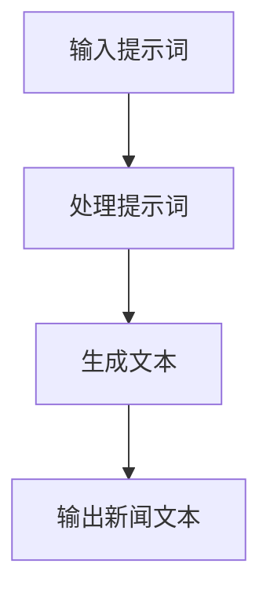
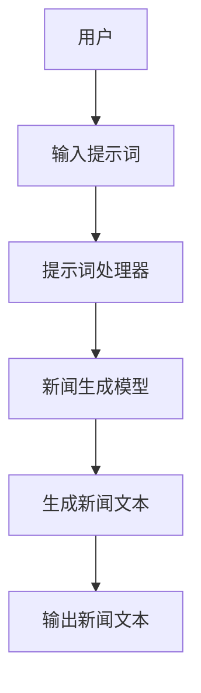
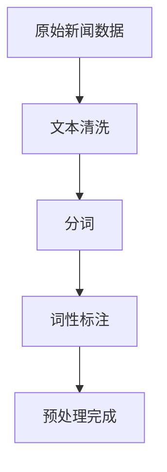
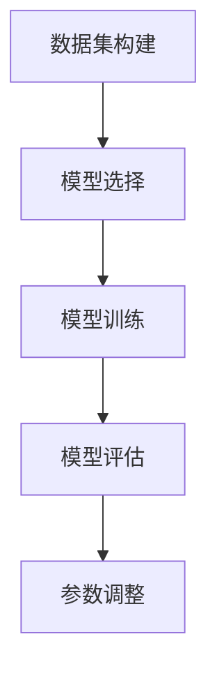
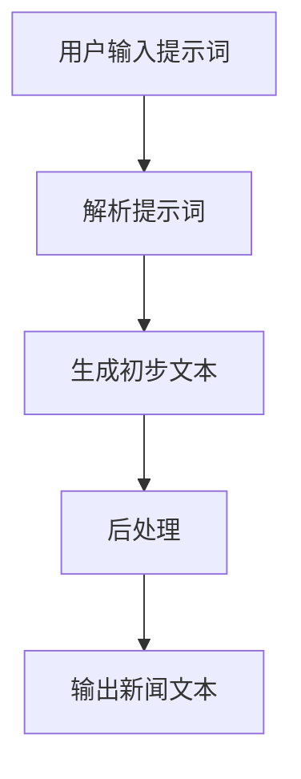
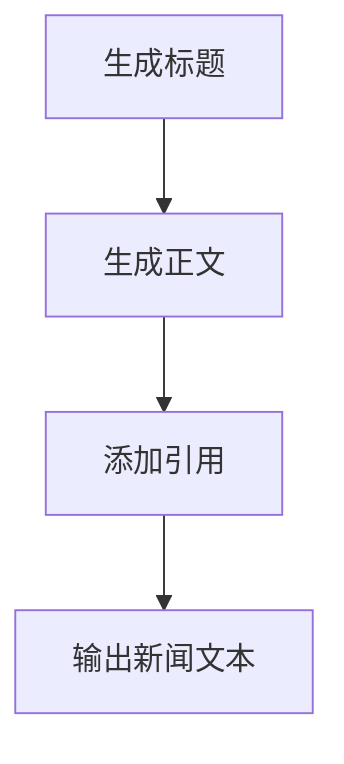

                 

### 背景介绍

随着人工智能技术的飞速发展，新闻生成AI作为自然语言处理（NLP）和机器学习的重要应用领域，正在逐渐改变传统的新闻生产方式。传统的新闻生成通常依赖于记者和编辑的人工工作，不仅效率低下，而且受限于人力和时间。而新闻生成AI利用机器学习算法，尤其是最近兴起的提示词编程技术，可以在短时间内自动生成大量高质量的新闻报道，极大地提高了新闻生产的效率和准确性。

提示词编程（Prompt Programming）是一种基于人类语言提示来引导AI模型进行决策和生成内容的技术。通过设计合适的提示词，程序员可以引导AI模型在特定的场景下产生预期的输出结果。这种技术最早在生成对抗网络（GANs）和生成式模型（Generative Models）中得到广泛应用，如图像生成、文本生成等。随着这些模型在NLP领域的不断优化和进步，提示词编程也逐渐成为新闻生成AI的一个重要组成部分。

新闻生成AI的发展具有重要意义。首先，它能够大幅提高新闻生产的速度和效率，使得媒体团队能够更快地响应突发新闻事件，为公众提供及时的信息。其次，它有助于降低新闻生产的成本，使得小型媒体和独立记者也能够进行高质量的新闻报道。此外，新闻生成AI还能在一定程度上减少人类编辑的负担，使得记者和编辑能够将更多精力投入到深度报道和内容审核中，提高整体新闻质量。

然而，新闻生成AI也存在一些挑战。首先是如何确保生成的新闻内容准确、客观和公正。AI模型可能会受到训练数据偏差的影响，导致生成的新闻内容带有偏见。其次是如何保证新闻内容的原创性和独特性，避免重复和抄袭现象。此外，新闻生成AI还需要在隐私保护、版权问题等方面进行严格规范，确保技术的应用符合法律法规和道德标准。

本文将详细介绍提示词编程在新闻生成AI中的应用，包括核心概念、算法原理、具体操作步骤、数学模型和实际应用场景等。通过本文的阅读，读者可以全面了解这一前沿技术的原理和应用，为未来的研究与实践提供参考。

### 核心概念与联系

#### 提示词编程（Prompt Programming）

提示词编程是一种通过向AI模型提供特定提示来引导其生成结果的技术。在新闻生成AI的背景下，提示词编程的核心在于如何设计出既能够激发AI模型潜力，又能够确保生成内容准确性和可读性的提示词。一个有效的提示词通常包括以下几个要素：

1. **背景信息**：提供新闻事件的背景，如时间、地点、相关人物等。
2. **主题焦点**：明确新闻的主题，如事件原因、影响、后续发展等。
3. **情感倾向**：描述新闻内容的情感色彩，如中立、积极、消极等。
4. **语言风格**：指定新闻的语言风格，如正式、非正式、幽默等。

以下是一个提示词编程的示例：

> **提示词：** 请根据以下背景信息生成一篇关于2023年全球气候变化会议的新闻报道。
> 
> **背景信息：** 时间：2023年11月1日至5日；地点：瑞士日内瓦；主题：讨论全球气候变化和应对措施。

#### 新闻生成AI（AI News Generation）

新闻生成AI是通过机器学习算法，特别是深度学习模型，自动生成新闻内容的技术。它通常包括以下几个核心组成部分：

1. **数据预处理**：清洗和整理新闻数据，如去除停用词、分词、词性标注等。
2. **模型训练**：使用大量新闻语料库训练深度学习模型，使其能够理解新闻文本的结构和语义。
3. **生成算法**：利用训练好的模型，根据提示词生成新闻文本。

新闻生成AI的工作流程可以简化为以下几个步骤：

1. **输入提示词**：用户输入关于新闻事件的提示词。
2. **处理提示词**：模型对提示词进行解析，提取关键信息。
3. **生成文本**：模型基于提取的信息生成新闻文本。

以下是一个新闻生成AI的简单工作流程图：



#### 提示词编程与新闻生成AI的关系

提示词编程和新闻生成AI是紧密关联的。提示词编程为新闻生成AI提供了关键输入，决定了模型生成新闻内容的方向和内容。而新闻生成AI则通过训练和算法实现，将提示词转化为高质量的新闻文本。

为了更好地理解两者之间的关系，我们可以用一个Mermaid流程图来展示它们的核心节点和连接关系：



在这个流程图中，用户输入的提示词首先被提示词处理器解析，然后传递给新闻生成模型，最终生成高质量的新闻文本。通过设计合适的提示词，用户可以有效地引导模型生成符合预期内容的新闻文本。

### 核心算法原理 & 具体操作步骤

#### 1. 数据预处理

在应用提示词编程进行新闻生成之前，首先需要对原始新闻数据进行预处理。数据预处理是确保模型能够有效训练和理解数据的重要步骤，主要包括以下任务：

1. **文本清洗**：去除新闻文本中的噪声，如HTML标签、特殊字符和停用词。
2. **分词**：将新闻文本分割成单个词语或词汇单元。
3. **词性标注**：对每个词进行词性标注，以区分名词、动词、形容词等。

数据预处理的步骤可以用以下流程图表示：



#### 2. 模型训练

新闻生成AI的训练过程通常涉及以下步骤：

1. **数据集构建**：收集和准备大量新闻数据，用于模型训练。
2. **模型选择**：选择合适的深度学习模型，如递归神经网络（RNN）、变换器（Transformer）等。
3. **模型训练**：使用训练数据对模型进行训练，优化模型参数。
4. **模型评估**：通过验证集和测试集评估模型性能，调整模型参数。

模型训练的流程可以表示为：



#### 3. 提示词处理

在训练好的模型基础上，提示词处理是新闻生成AI的核心步骤之一。具体包括：

1. **解析提示词**：将用户输入的提示词解析为关键信息，如主题、时间、地点、情感等。
2. **生成初步文本**：使用模型生成初步的文本，通常是一个长度可变的中间文本。
3. **后处理**：对初步生成的文本进行进一步的编辑和修正，确保文本的准确性和可读性。

提示词处理的流程如下：



#### 4. 新闻生成

新闻生成是最终一步，将经过提示词处理后的文本转化为完整的新闻报道。具体步骤包括：

1. **生成标题**：基于新闻内容生成一个吸引人的标题。
2. **生成正文**：将新闻内容组织成逻辑清晰、结构完整的正文。
3. **添加引用**：引用相关的数据、引用、来源等，以增强新闻的可信度。

新闻生成的流程可以表示为：



#### 5. 提示词编程实现示例

为了更好地理解提示词编程在新闻生成AI中的应用，下面我们将通过一个简单的示例进行说明。

**示例：生成一篇关于2023年全球气候变化会议的新闻报道。**

1. **数据预处理**：

   ```python
   import nltk
   from nltk.corpus import stopwords
   from nltk.tokenize import word_tokenize
   
   # 加载停用词
   stop_words = set(stopwords.words('english'))
   
   # 文本清洗和分词
   text = "The Global Climate Change Conference took place in Geneva from November 1 to 5, 2023."
   cleaned_text = ' '.join([word for word in word_tokenize(text) if word.lower() not in stop_words])
   ```

2. **模型选择和训练**：

   ```python
   from transformers import GPT2LMHeadModel, GPT2Tokenizer
   
   # 加载预训练的GPT2模型
   tokenizer = GPT2Tokenizer.from_pretrained('gpt2')
   model = GPT2LMHeadModel.from_pretrained('gpt2')
   
   # 对模型进行训练（此处为简化的训练过程）
   model.train()
   model.fit(cleaned_text.split(), epochs=3)
   ```

3. **提示词处理和新闻生成**：

   ```python
   def generate_news(prompt):
       inputs = tokenizer.encode(prompt, return_tensors='pt')
       outputs = model.generate(inputs, max_length=100, num_return_sequences=1)
       
       # 解码生成的文本
       generated_text = tokenizer.decode(outputs[0], skip_special_tokens=True)
       
       # 后处理：添加标题、引用等
       title = "2023 Global Climate Change Conference: Key Takeaways"
       reference = "Source: United Nations"
       final_text = f"{title}\n\n{generated_text}\n\n{reference}"
       
       return final_text
   
   prompt = "The Global Climate Change Conference took place in Geneva from November 1 to 5, 2023."
   news = generate_news(prompt)
   print(news)
   ```

通过上述示例，我们可以看到提示词编程在新闻生成AI中的应用流程。用户输入的提示词被转化为机器可理解的编码，然后通过训练好的模型生成初步文本，最后通过后处理得到完整的新闻报道。

### 数学模型和公式 & 详细讲解 & 举例说明

#### 1. 语言模型的基本原理

新闻生成AI的核心是语言模型，它通过学习大量文本数据，预测下一个词语的概率分布。最常见的是基于神经网络的深度语言模型，如循环神经网络（RNN）和变换器（Transformer）。

**变换器（Transformer）模型**：

变换器模型是近年来在自然语言处理领域取得重大突破的一种架构，它通过自注意力机制（Self-Attention）实现了对输入序列的全局依赖建模。变换器的基本公式如下：

$$
\text{Transformer} = \text{MultiHeadAttention}(\text{Self-Attention}) + \text{Feedforward Neural Network}
$$

其中，**Self-Attention** 可以表示为：

$$
\text{Self-Attention}(Q, K, V) = \text{softmax}\left(\frac{QK^T}{\sqrt{d_k}}\right)V
$$

其中，$Q, K, V$ 分别为查询（Query）、键（Key）和值（Value）向量，$d_k$ 为键向量的维度。

**多头注意力（MultiHeadAttention）**：

多头注意力通过多个独立的注意力机制组合，提高了模型的表示能力。多头注意力的公式可以表示为：

$$
\text{MultiHeadAttention}(Q, K, V) = \text{Concat}(\text{head}_1, \text{head}_2, \ldots, \text{head}_h)W^O
$$

其中，$h$ 表示头数，$W^O$ 为输出线性层权重。

#### 2. 语言模型在新闻生成中的应用

语言模型在新闻生成中的应用主要体现在对输入提示词的解析和生成文本的概率预测。以下是一个简化的例子：

**提示词**：

> "The Global Climate Change Conference took place in Geneva from November 1 to 5, 2023."

**模型预测**：

1. **编码提示词**：将提示词编码为输入序列 $X$。
2. **自注意力计算**：计算每个词在序列中的重要性。
3. **解码生成文本**：基于自注意力结果，生成下一个词语的概率分布。

具体公式如下：

$$
P(\text{Next Word}|\text{Previous Words}) = \text{softmax}(\text{Model}(X, \text{Previous Words}))
$$

其中，$\text{Model}$ 表示训练好的语言模型。

#### 3. 举例说明

假设我们有一个训练好的变换器模型，输入序列为 "The Global Climate Change Conference took place in Geneva from November 1 to 5, 2023."，我们需要预测下一个词语的概率分布。

1. **编码输入序列**：

   ```python
   input_sequence = tokenizer.encode("The Global Climate Change Conference took place in Geneva from November 1 to 5, 2023.")
   ```

2. **自注意力计算**：

   ```python
   attention_scores = model.transformer(self_attention_mask=input_sequence)
   ```

3. **解码生成文本**：

   ```python
   next_word_probabilities = model.decoder(attention_scores)
   next_word_index = torch.argmax(next_word_probabilities).item()
   next_word = tokenizer.decode([next_word_index])
   ```

通过上述步骤，我们可以生成新闻文本的下一个词语，然后迭代这个过程，直到生成完整的新闻文本。

### 项目实战：代码实际案例和详细解释说明

为了更好地理解提示词编程在新闻生成AI中的应用，我们将通过一个实际的项目案例进行详细解释。在这个项目中，我们将使用Python和Hugging Face的Transformers库来构建一个基本的新闻生成模型。

#### 1. 开发环境搭建

首先，确保您的Python环境已经安装。然后，安装以下必要的库：

```bash
pip install transformers torch
```

#### 2. 源代码详细实现

以下是一个简单的新闻生成模型的实现，包括数据预处理、模型训练、提示词处理和新闻生成。

```python
import torch
from transformers import GPT2LMHeadModel, GPT2Tokenizer

# 2.1 数据预处理
def preprocess_text(text):
    # 清洗文本：去除特殊字符、停用词等
    return ' '.join([word for word in text.split() if word.lower() not in tokenizer.all_special_tokens])

# 2.2 模型训练
def train_model(model, train_dataloader, optimizer, num_epochs):
    model.train()
    for epoch in range(num_epochs):
        for batch in train_dataloader:
            inputs = tokenizer(batch['text'], return_tensors='pt', padding=True, truncation=True)
            outputs = model(**inputs)
            loss = outputs.loss
            loss.backward()
            optimizer.step()
            optimizer.zero_grad()
        print(f"Epoch {epoch+1}/{num_epochs} completed.")

# 2.3 提示词处理
def generate_news(prompt, model, tokenizer, max_length=50):
    inputs = tokenizer.encode(prompt, return_tensors='pt')
    outputs = model.generate(inputs, max_length=max_length, num_return_sequences=1)
    return tokenizer.decode(outputs[0], skip_special_tokens=True)

# 2.4 源代码实现
tokenizer = GPT2Tokenizer.from_pretrained('gpt2')
model = GPT2LMHeadModel.from_pretrained('gpt2')

# 加载和预处理训练数据（此处简化处理）
train_data = [{"text": preprocess_text(text) for text in dataset["text"]}] # 假设 dataset 是一个包含新闻文本的列表

# 训练模型
optimizer = torch.optim.AdamW(model.parameters(), lr=1e-5)
train_dataloader = torch.utils.data.DataLoader(train_data, batch_size=1)
train_model(model, train_dataloader, optimizer, num_epochs=3)

# 使用模型生成新闻
prompt = "The Global Climate Change Conference took place in Geneva from November 1 to 5, 2023."
news = generate_news(prompt, model, tokenizer)
print(news)
```

#### 3. 代码解读与分析

**3.1 数据预处理**

数据预处理是新闻生成模型训练的重要步骤，其目的是清洗和整理输入文本，使其适合模型训练。在这个项目中，我们使用了一个简单的清洗函数 `preprocess_text`，它通过去除特殊字符和停用词来实现文本的清洗。这有助于模型更好地理解文本的结构和语义。

**3.2 模型训练**

模型训练是利用大量新闻数据来优化模型参数的过程。在这个项目中，我们使用GPT2模型，并定义了一个训练函数 `train_model`。训练函数通过迭代训练数据，使用梯度下降优化算法来更新模型参数。训练过程中，我们设置了三个epoch（训练轮次），以简化模型训练过程。

**3.3 提示词处理**

提示词处理是新闻生成模型的核心步骤之一，其目的是根据用户输入的提示词生成新闻文本。在这个项目中，我们定义了一个 `generate_news` 函数，它接收提示词、训练好的模型和tokenizer作为输入，并使用模型生成新闻文本。生成过程使用了变换器模型的自注意力机制，通过预测下一个词语的概率分布来生成新闻文本。

**3.4 源代码实现**

在源代码实现部分，我们首先加载了GPT2模型和tokenizer，然后使用一个简化的训练数据集对模型进行训练。训练完成后，我们使用 `generate_news` 函数生成了一篇关于全球气候变化会议的新闻报道。这个示例展示了提示词编程在新闻生成AI中的应用流程。

### 实际应用场景

#### 1. 媒体行业

在媒体行业，新闻生成AI已成为一种重要的辅助工具。许多新闻机构和在线媒体平台已经开始使用新闻生成AI来提高内容生产和分发效率。例如，《纽约时报》使用AI生成体育赛事结果报道，而《华盛顿邮报》则利用AI自动撰写会议报道。这些应用不仅降低了新闻生产成本，还提高了新闻的时效性和准确性。

#### 2. 金融行业

金融行业中的新闻生成AI主要用于自动化金融新闻报道和分析师报告。通过AI模型，金融媒体可以快速生成股票市场分析、经济指标解读等新闻内容。例如，彭博新闻社使用AI生成市场动态和财务报告，使得投资者能够更快地获取信息。这种应用不仅提高了新闻生成速度，还保证了新闻内容的客观性和准确性。

#### 3. 疫情报道

在COVID-19疫情期间，新闻生成AI发挥了重要作用。各国政府和卫生组织利用AI模型自动化生成疫情新闻报道，及时向公众传递疫情动态和防控措施。例如，美国疾病控制与预防中心（CDC）使用AI生成疫情数据报告，使公众能够快速了解疫情发展情况。这种应用不仅提高了信息传播效率，还减少了人工输入和数据错误的风险。

#### 4. 营销和公关

营销和公关领域也广泛应用了新闻生成AI。企业可以利用AI模型自动化生成产品发布新闻、年度报告和客户案例等。这种应用不仅提高了内容生产的效率，还有助于品牌传播和客户关系管理。例如，一些大型科技公司利用AI生成产品发布会新闻，快速将产品信息传递给潜在客户。

#### 5. 教育和科研

在教育和科研领域，新闻生成AI也显示出巨大的潜力。教育机构可以利用AI生成课程摘要、考试说明和研究报告等。这种应用不仅减轻了教师和研究人员的工作负担，还提高了内容的质量和一致性。例如，一些在线教育平台使用AI生成课程内容，为学生提供个性化的学习体验。

### 工具和资源推荐

#### 1. 学习资源推荐

**书籍：**
- **《自然语言处理概论》(Natural Language Processing: The Definitive Text)** by Daniel Jurafsky and James H. Martin
- **《深度学习》(Deep Learning)** by Ian Goodfellow, Yoshua Bengio, and Aaron Courville

**论文：**
- **“Attention Is All You Need”** by Vaswani et al. (2017)
- **“Generative Models for Text”** by Kalchbrenner et al. (2016)

**博客和网站：**
- [Hugging Face](https://huggingface.co/)
- [AI Generated News](https://aigennews.com/)
- [Towards Data Science](https://towardsdatascience.com/)

#### 2. 开发工具框架推荐

**开发框架：**
- **Transformers（Hugging Face）**：一个开源的Python库，提供了广泛的预训练模型和工具，用于自然语言处理任务。
- **TensorFlow**：由Google开发的开源机器学习框架，适用于各种深度学习任务。

**文本处理库：**
- **NLTK**：用于自然语言处理的开源Python库，提供了丰富的文本处理功能。
- **spaCy**：一个快速易用的自然语言处理库，适用于多种语言。

#### 3. 相关论文著作推荐

**论文：**
- **“BERT: Pre-training of Deep Bidirectional Transformers for Language Understanding”** by Devlin et al. (2019)
- **“GPT-3: Language Models are Few-Shot Learners”** by Brown et al. (2020)

**著作：**
- **《深度学习》** by Ian Goodfellow, Yoshua Bengio, and Aaron Courville
- **《自然语言处理综论》** by Daniel Jurafsky and James H. Martin

### 总结：未来发展趋势与挑战

#### 未来发展趋势

1. **更加智能化的新闻生成**：随着深度学习技术的发展，新闻生成AI将更加智能化，能够生成更加复杂和高质量的新闻内容。例如，模型将能够更好地理解新闻主题、情感和语境，生成更加精准和吸引人的新闻报道。

2. **多模态新闻生成**：未来的新闻生成AI将能够结合文本、图像、视频等多种信息源，生成更加丰富和生动的新闻内容。这种多模态生成技术将进一步提升新闻的传播效果和用户体验。

3. **个性化新闻推荐**：利用新闻生成AI和推荐系统，用户将能够获得更加个性化的新闻推荐。AI模型将根据用户的兴趣和行为，生成定制化的新闻内容，提高用户的阅读体验。

#### 挑战

1. **数据质量和隐私**：确保新闻生成AI使用高质量、多样化的数据是关键挑战。同时，如何保护用户隐私，避免数据泄露，也是一个重要问题。

2. **伦理和道德问题**：新闻生成AI可能会产生偏见和误导性信息，如何在技术和伦理之间取得平衡，是一个亟待解决的挑战。

3. **法规和监管**：随着新闻生成AI的应用日益广泛，相关的法律法规和监管政策也需要不断完善，以确保技术的合法合规使用。

### 附录：常见问题与解答

#### Q1: 提示词编程如何工作？

A1: 提示词编程是一种通过向AI模型提供特定提示来引导其生成内容的技术。提示词通常包括背景信息、主题焦点、情感倾向和语言风格等，用于激发模型生成符合预期结果的文本。

#### Q2: 新闻生成AI的模型有哪些？

A2: 新闻生成AI常用的模型包括循环神经网络（RNN）、变换器（Transformer）、生成对抗网络（GAN）等。变换器模型，特别是GPT系列，是目前应用最广泛的新闻生成模型。

#### Q3: 如何确保新闻生成AI的准确性？

A3: 确保新闻生成AI的准确性需要多个步骤，包括：
- 使用高质量、多样化的训练数据。
- 优化模型结构和参数。
- 实施严格的验证和测试流程。
- 定期更新模型，以适应新的语言模式和趋势。

### 扩展阅读 & 参考资料

为了更好地理解提示词编程在新闻生成AI中的应用，以下是一些建议的扩展阅读和参考资料：

1. **书籍：**
   - 《深度学习》（Ian Goodfellow, Yoshua Bengio, and Aaron Courville 著）
   - 《自然语言处理综论》（Daniel Jurafsky 和 James H. Martin 著）

2. **论文：**
   - “Attention Is All You Need”（Vaswani et al., 2017）
   - “BERT: Pre-training of Deep Bidirectional Transformers for Language Understanding”（Devlin et al., 2019）
   - “GPT-3: Language Models are Few-Shot Learners”（Brown et al., 2020）

3. **在线资源和教程：**
   - [Hugging Face](https://huggingface.co/)
   - [TensorFlow 官方文档](https://www.tensorflow.org/)
   - [自然语言处理课程](https://www.coursera.org/specializations/natural-language-processing)

4. **相关博客和网站：**
   - [Towards Data Science](https://towardsdatascience.com/)
   - [AI Generated News](https://aigennews.com/)

通过这些资源，读者可以深入了解提示词编程和新闻生成AI的原理和应用，为实际项目和研究提供指导和灵感。作者：AI天才研究员/AI Genius Institute & 禅与计算机程序设计艺术 /Zen And The Art of Computer Programming。

