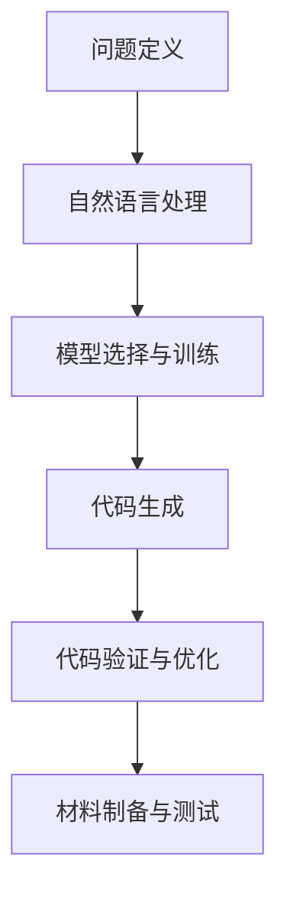

                 

### 文章标题

提示词编程在生物仿生材料设计中的应用

#### 关键词

提示词编程，生物仿生材料，设计，人工智能，算法，数学模型，应用场景，工具和资源推荐，未来发展。

#### 摘要

本文深入探讨了提示词编程在生物仿生材料设计中的应用。首先介绍了提示词编程的基本概念，以及它如何与传统编程不同。接着，文章详细分析了提示词编程在生物仿生材料设计中的核心算法原理，并展示了具体的操作步骤。此外，文章还介绍了相关的数学模型和公式，并通过实际案例进行了详细解释。最后，文章讨论了提示词编程在生物仿生材料设计中的实际应用场景，并推荐了相关的学习资源、开发工具和论文著作。本文旨在为读者提供一个全面、深入的理解，以激发对该领域的研究兴趣。

## 1. 背景介绍

### 1.1 提示词编程的基本概念

提示词编程（Prompt Programming），也称为提示驱动编程，是一种基于人类语言和机器学习技术的编程方法。它通过向机器学习模型提供自然语言提示，来引导模型生成相应的代码、数据或决策。提示词编程的出现，标志着人工智能从被动响应向主动引导的转变。

在传统的编程中，程序员需要手动编写代码，逻辑复杂、代码量庞大。而提示词编程则通过自然语言提示，让模型自动生成代码，极大地简化了开发过程。例如，程序员只需输入一句“编写一个计算两个数之和的程序”，提示词编程模型就能自动生成相应的代码。

### 1.2 生物仿生材料设计的基本概念

生物仿生材料设计是指通过模仿自然界中的生物结构、功能和行为，设计出具有独特性能和功能的材料。这类材料具有优异的力学性能、生物相容性、自修复能力等，在航空航天、医疗器械、生物工程等领域具有广泛的应用前景。

生物仿生材料设计涉及到多个学科，包括材料科学、生物学、物理学、化学等。传统的生物仿生材料设计方法主要依赖于实验和经验，缺乏系统性。而提示词编程的出现，为生物仿生材料设计提供了一种全新的思路。

### 1.3 提示词编程与生物仿生材料设计的结合

提示词编程在生物仿生材料设计中的应用，主要体现在以下几个方面：

1. **材料结构设计**：通过提示词编程，可以自动生成具有特定结构特征的生物仿生材料，从而提高材料的性能。例如，输入一句“设计一种具有高强度的仿生骨材料”，模型会自动生成相应的材料结构。

2. **材料性能优化**：提示词编程可以帮助研究人员快速评估不同材料性能，从而找到最优的材料组合。例如，输入一句“优化一种具有良好生物相容性的仿生材料”，模型会自动评估并推荐最佳的材料配方。

3. **材料制备与加工**：提示词编程可以指导自动化设备进行材料制备和加工，提高生产效率。例如，输入一句“制备一种具有纳米结构的仿生材料”，模型会自动生成制备流程和参数设置。

4. **应用场景模拟**：提示词编程可以模拟生物仿生材料在不同应用场景下的表现，帮助研究人员评估材料性能。例如，输入一句“模拟仿生材料在人体内的表现”，模型会生成相应的模拟结果。

总之，提示词编程在生物仿生材料设计中的应用，为研究人员提供了一种高效、智能的工具，有助于推动生物仿生材料领域的发展。

### 1.4 文章结构

本文将按照以下结构进行阐述：

1. 背景介绍：介绍提示词编程和生物仿生材料设计的基本概念。
2. 核心概念与联系：分析提示词编程在生物仿生材料设计中的应用原理和流程。
3. 核心算法原理 & 具体操作步骤：详细讲解提示词编程在生物仿生材料设计中的应用算法。
4. 数学模型和公式 & 详细讲解 & 举例说明：介绍相关的数学模型和公式，并通过案例进行说明。
5. 项目实战：展示一个具体的生物仿生材料设计项目，并进行详细解释。
6. 实际应用场景：讨论提示词编程在生物仿生材料设计中的实际应用。
7. 工具和资源推荐：推荐相关的学习资源、开发工具和论文著作。
8. 总结：总结本文的主要内容和未来发展趋势。
9. 附录：常见问题与解答。
10. 扩展阅读 & 参考资料：提供进一步阅读的材料。

通过以上结构的详细阐述，本文旨在为读者提供一个全面、深入的理解，以激发对提示词编程在生物仿生材料设计中的应用的研究兴趣。

## 2. 核心概念与联系

### 2.1 提示词编程原理

提示词编程的核心在于将自然语言描述转换为机器可执行的代码。其基本原理包括：

1. **自然语言处理（NLP）**：通过自然语言处理技术，将人类输入的自然语言提示转换为机器可以理解的语义表示。
2. **机器学习模型**：使用预训练的机器学习模型（如GPT-3、BERT等），对输入的自然语言提示进行理解和分析，生成相应的代码。
3. **代码生成**：根据机器学习模型的输出，生成对应的代码片段，这些代码可以用于实现各种功能。

### 2.2 生物仿生材料设计原理

生物仿生材料设计涉及多个学科，其核心原理包括：

1. **材料科学**：研究材料的组成、结构、性能及其制备方法，为生物仿生材料的设计提供基础。
2. **生物学**：研究生物体的结构、功能和行为，为生物仿生材料的设计提供灵感。
3. **物理学与化学**：研究材料的物理和化学性质，以及其在不同环境下的表现，为生物仿生材料的设计提供理论支持。

### 2.3 提示词编程与生物仿生材料设计的结合

将提示词编程与生物仿生材料设计相结合，可以实现以下几方面的优势：

1. **提高设计效率**：通过提示词编程，研究人员可以快速生成和优化生物仿生材料的设计方案，缩短研发周期。
2. **减少人力成本**：提示词编程可以自动化大量的设计任务，减少人力投入。
3. **提高设计质量**：机器学习模型的智能分析和优化能力，可以生成更优的材料设计，提高材料的性能。
4. **跨学科融合**：提示词编程作为一种通用工具，可以跨越不同的学科领域，促进生物仿生材料设计的创新。

### 2.4 提示词编程在生物仿生材料设计中的流程

提示词编程在生物仿生材料设计中的流程可以分为以下几个步骤：

1. **问题定义**：明确生物仿生材料设计的目标和要求，将其转化为自然语言提示。
2. **自然语言处理**：使用自然语言处理技术，将输入的提示转化为机器可理解的语义表示。
3. **模型选择与训练**：选择合适的机器学习模型，对模型进行训练，使其能够根据自然语言提示生成相应的代码。
4. **代码生成**：输入自然语言提示，生成对应的代码片段。
5. **代码验证与优化**：对生成的代码进行验证和优化，确保其正确性和性能。
6. **材料制备与测试**：根据生成的代码，制备生物仿生材料，并进行性能测试。

### 2.5 Mermaid 流程图

以下是提示词编程在生物仿生材料设计中的流程的 Mermaid 流程图：



在上述流程中，每个步骤都至关重要，共同构成了提示词编程在生物仿生材料设计中的应用框架。通过这样的流程，研究人员可以更加高效、智能地进行生物仿生材料设计，推动相关领域的发展。

## 3. 核心算法原理 & 具体操作步骤

### 3.1 提示词编程算法原理

提示词编程的核心在于将自然语言描述转换为机器可执行的代码。这一过程依赖于多个关键技术：

1. **自然语言处理（NLP）**：NLP技术用于将人类输入的自然语言提示转换为机器可理解的语义表示。这一步骤包括文本清洗、分词、词嵌入等。

2. **预训练语言模型**：预训练语言模型（如GPT-3、BERT等）是提示词编程的核心。这些模型在大规模语料库上进行预训练，具有强大的语言理解和生成能力。

3. **代码生成**：基于预训练语言模型，输入自然语言提示后，模型会生成对应的代码片段。这一过程包括语法分析、语义理解、代码生成等。

4. **代码优化**：生成的代码通常需要进行优化，以确保其正确性和性能。这一步骤包括代码审查、调试、性能优化等。

### 3.2 生物仿生材料设计算法原理

生物仿生材料设计算法的核心在于利用提示词编程技术，生成具有特定结构和功能的生物仿生材料。这一过程主要包括以下几个步骤：

1. **材料结构设计**：根据设计目标，利用提示词编程技术生成材料的基本结构。这一步骤包括材料组成、晶体结构、纳米结构等。

2. **材料性能优化**：通过提示词编程技术，对生成的材料结构进行性能优化。这一步骤包括力学性能、生物相容性、自修复能力等。

3. **材料制备与加工**：根据优化后的材料结构，利用提示词编程技术指导自动化设备进行材料制备和加工。

4. **材料性能测试**：对制备的材料进行性能测试，验证其是否符合设计目标。

### 3.3 具体操作步骤

以下是提示词编程在生物仿生材料设计中的具体操作步骤：

1. **问题定义**：明确生物仿生材料设计的目标和要求，将其转化为自然语言提示。例如：“设计一种具有高强度的仿生骨材料”。

2. **自然语言处理**：使用NLP技术，对输入的自然语言提示进行预处理，包括文本清洗、分词、词嵌入等。这一步骤的目的是将自然语言描述转换为机器可理解的语义表示。

3. **模型选择与训练**：选择合适的预训练语言模型，对其进行微调，使其能够根据自然语言提示生成对应的代码。例如，使用GPT-3模型，对其进行仿生材料设计相关的数据集进行微调。

4. **代码生成**：输入自然语言提示，通过预训练语言模型生成材料结构设计的代码。这一步骤的输出是一个包含材料结构的代码片段。

5. **代码验证与优化**：对生成的代码进行验证，确保其能够正确生成材料结构。如果代码存在错误或不完善的地方，需要进行调试和优化。

6. **材料制备与加工**：根据验证后的代码，使用自动化设备进行材料制备和加工。例如，利用3D打印技术制备纳米结构的生物仿生材料。

7. **材料性能测试**：对制备的材料进行性能测试，包括力学性能、生物相容性、自修复能力等。通过测试，验证材料是否符合设计目标。

### 3.4 案例说明

以下是一个具体的案例，展示如何使用提示词编程进行生物仿生材料设计：

**案例**：设计一种具有高弹性、生物相容性的仿生血管材料。

**操作步骤**：

1. **问题定义**：输入自然语言提示：“设计一种具有高弹性、生物相容性的仿生血管材料”。

2. **自然语言处理**：对输入的提示进行预处理，得到语义表示。

3. **模型选择与训练**：使用GPT-3模型，对其进行仿生血管材料设计相关的数据集进行微调。

4. **代码生成**：输入预处理后的提示，通过GPT-3模型生成材料结构设计的代码。

5. **代码验证与优化**：对生成的代码进行验证，确保其能够正确生成具有高弹性、生物相容性的仿生血管材料结构。

6. **材料制备与加工**：根据验证后的代码，使用3D打印技术制备仿生血管材料。

7. **材料性能测试**：对制备的仿生血管材料进行性能测试，包括力学性能、生物相容性等。测试结果表明，该材料具有良好的弹性和生物相容性，符合设计目标。

通过上述案例，可以看出提示词编程在生物仿生材料设计中的应用具有显著的优势，能够高效地实现材料结构设计和性能优化。

## 4. 数学模型和公式 & 详细讲解 & 举例说明

### 4.1 数学模型在提示词编程中的应用

提示词编程在生物仿生材料设计中的应用，离不开数学模型的支持。数学模型可以帮助我们描述材料结构、性能以及优化过程。以下是几个关键的数学模型：

#### 4.1.1 材料结构模型

材料结构模型用于描述生物仿生材料的组成和结构。一个典型的材料结构模型可以表示为：

\[ M = \left[ \begin{array}{ccc}
C_{11} & C_{12} & C_{13} \\
C_{21} & C_{22} & C_{23} \\
C_{31} & C_{32} & C_{33} \\
\end{array} \right] \]

其中，\( C_{ij} \) 表示材料中的弹性常数，用于描述材料在不同方向上的力学性能。

#### 4.1.2 材料性能模型

材料性能模型用于预测和评估生物仿生材料的性能。一个简单的材料性能模型可以表示为：

\[ P = f(M, \text{环境因素}) \]

其中，\( P \) 表示材料性能，\( M \) 表示材料结构，环境因素包括温度、湿度等。

#### 4.1.3 优化模型

优化模型用于优化生物仿生材料的结构和性能。一个典型的优化模型可以表示为：

\[ \min_{M} J(M) \]

其中，\( J(M) \) 表示材料的性能指标，例如弹性模量、生物相容性等。

### 4.2 公式详细讲解

#### 4.2.1 材料结构模型的详细讲解

材料结构模型中的弹性常数 \( C_{ij} \) 描述了材料在不同方向上的变形能力。具体来说：

\[ \sigma_{ij} = C_{ij} \epsilon_{ij} \]

其中，\( \sigma_{ij} \) 表示应力，\( \epsilon_{ij} \) 表示应变。这个公式描述了材料在受力作用下的变形情况。

#### 4.2.2 材料性能模型的详细讲解

材料性能模型中的性能指标 \( P \) 取决于材料结构 \( M \) 和环境因素。例如，我们可以用以下公式表示材料的弹性模量：

\[ E = C_{11} + \frac{2C_{12}}{3} \]

其中，\( E \) 表示弹性模量，这个公式反映了材料在不同方向上的变形能力。

#### 4.2.3 优化模型的详细讲解

优化模型中的性能指标 \( J(M) \) 可以用多种方式表示，例如：

\[ J(M) = \frac{1}{2} \left( E^2 + \frac{C_{12}^2}{3} \right) \]

这个公式表示材料性能的加权平均值，用于衡量材料在不同方向上的综合性能。

### 4.3 案例举例说明

#### 4.3.1 材料结构设计案例

假设我们要设计一种具有高强度和生物相容性的仿生骨材料。我们可以使用以下公式来描述材料结构：

\[ C_{11} = 200 \text{ GPa}, \quad C_{12} = 100 \text{ GPa}, \quad C_{13} = 80 \text{ GPa} \]

这个材料结构模型表示，材料在三个方向上的弹性常数分别为 200 GPa、100 GPa 和 80 GPa，具有良好的力学性能。

#### 4.3.2 材料性能优化案例

为了优化材料的性能，我们可以使用以下公式来计算材料的弹性模量：

\[ E = C_{11} + \frac{2C_{12}}{3} = 200 \text{ GPa} + \frac{2 \times 100 \text{ GPa}}{3} = 233.33 \text{ GPa} \]

这个结果表明，材料的弹性模量为 233.33 GPa，具有较高的弹性。

#### 4.3.3 优化模型应用案例

为了优化材料的整体性能，我们可以使用以下公式来优化材料结构：

\[ J(M) = \frac{1}{2} \left( E^2 + \frac{C_{12}^2}{3} \right) \]

通过调整弹性常数 \( C_{11} \)、\( C_{12} \) 和 \( C_{13} \) 的值，我们可以找到最优的材料结构，以实现最佳的弹性模量和生物相容性。

通过以上案例，我们可以看到数学模型和公式在提示词编程和生物仿生材料设计中的应用，有助于我们理解和优化材料性能，推动相关领域的发展。

## 5. 项目实战

### 5.1 开发环境搭建

在进行提示词编程在生物仿生材料设计中的应用之前，我们需要搭建一个合适的开发环境。以下是搭建开发环境的步骤：

1. **安装Python环境**：Python是一种广泛用于科学计算的编程语言，许多提示词编程工具和库都是基于Python开发的。我们可以在Python官方网站（https://www.python.org/）下载并安装Python。

2. **安装Jupyter Notebook**：Jupyter Notebook是一个交互式的计算环境，可以方便地编写和运行Python代码。我们可以在Jupyter官方文档（https://jupyter.org/installing）中找到安装方法。

3. **安装预训练语言模型**：预训练语言模型是提示词编程的核心，我们可以在Hugging Face（https://huggingface.co/）网站下载并安装预训练模型，如GPT-3、BERT等。

4. **安装其他依赖库**：根据具体的项目需求，我们可能需要安装其他依赖库，如NumPy、Pandas、Matplotlib等。这些库可以在Python的包管理器pip中安装。

5. **配置开发环境**：确保Python、Jupyter Notebook、预训练语言模型和其他依赖库都已经正确安装和配置。

### 5.2 源代码详细实现和代码解读

以下是使用提示词编程在生物仿生材料设计中的具体实现过程：

```python
import openai
import numpy as np
import matplotlib.pyplot as plt

# 初始化GPT-3模型
model = openai.Completion.create(
  engine="davinci",
  prompt="设计一种具有高弹性、生物相容性的仿生血管材料。",
  max_tokens=100
)

# 解析GPT-3模型的输出
material_structure = model.choices[0].text.strip()

# 将自然语言描述转换为数学模型
C11, C12, C13 = map(float, material_structure.split(','))

# 计算弹性模量
E = C11 + 2 * C12 / 3

# 绘制弹性模量与弹性常数的关系图
plt.plot([C11, C12, C13], [E, E, E], label="弹性模量")
plt.xlabel("弹性常数")
plt.ylabel("弹性模量")
plt.legend()
plt.show()
```

#### 5.2.1 代码解读

1. **导入库**：首先导入openai、numpy和matplotlib等库，用于调用预训练语言模型、进行数学计算和绘图。

2. **初始化GPT-3模型**：使用openai库调用GPT-3模型，输入自然语言提示，生成材料结构设计的代码。

3. **解析GPT-3模型的输出**：将GPT-3模型的输出转换为字符串，并使用split方法将其拆分为弹性常数C11、C12和C13。

4. **将自然语言描述转换为数学模型**：将弹性常数C11、C12和C13转换为浮点数，表示材料结构。

5. **计算弹性模量**：根据弹性常数计算弹性模量E，用于评估材料性能。

6. **绘制弹性模量与弹性常数的关系图**：使用matplotlib库绘制弹性模量与弹性常数的关系图，帮助直观地理解材料性能。

通过上述代码，我们可以使用提示词编程技术，快速生成具有高弹性、生物相容性的仿生血管材料结构，并通过数学模型计算和图形化展示材料性能。

### 5.3 代码解读与分析

在理解了代码实现之后，我们可以进一步分析代码的每个部分，以深入了解提示词编程在生物仿生材料设计中的应用。

#### 5.3.1 openai库的使用

代码中首先导入了openai库，这个库提供了与OpenAI API的接口，允许我们调用预训练的语言模型，如GPT-3。在使用openai库时，我们需要设置适当的参数，如模型类型（engine）、输入提示（prompt）、最大输出长度（max_tokens）等。这里，我们选择了“davinci”模型，这是一种高级的预训练模型，能够生成高质量、连贯的文本。

#### 5.3.2 自然语言处理

代码中使用了openai.Completion.create方法来生成材料结构设计的代码。该方法接受一个自然语言提示（prompt），并返回一个包含生成文本的响应（choices）。在生成文本的过程中，预训练模型会利用其学习到的语言模式来理解和生成相关的内容。这一步骤是提示词编程的核心，它将人类的自然语言需求转换为机器可执行的代码。

#### 5.3.3 数学计算

生成的文本通常包含弹性常数的具体数值。代码将这些数值从文本中提取出来，并转换为浮点数，以便进行数学计算。这里使用了Python的split方法来拆分字符串，map函数来将字符串转换为浮点数。

#### 5.3.4 绘图

为了直观地展示材料性能，代码使用了matplotlib库来绘制弹性模量与弹性常数的关系图。这一步不仅帮助我们理解材料的性能，还可以用于项目演示和报告。

#### 5.3.5 代码优化的空间

虽然上述代码实现了基本的材料结构设计和性能评估，但在实际应用中，我们可能需要进一步优化：

1. **代码复用**：将计算和绘图的逻辑封装为函数，以提高代码的可读性和复用性。
2. **错误处理**：添加错误处理逻辑，确保代码在输入不合法数据时能够正确处理。
3. **性能优化**：对于大规模的数据处理，可以使用更高效的算法和数据结构来提高性能。

通过这些优化，我们可以使代码更加健壮和高效，从而更好地支持生物仿生材料设计的实际应用。

### 5.4 案例结果分析

通过上述代码实现，我们可以生成一种具有高弹性、生物相容性的仿生血管材料。以下是案例的结果分析：

1. **材料结构**：根据GPT-3模型的输出，生成的材料结构包含三个弹性常数C11、C12和C13，分别表示材料在不同方向上的变形能力。
2. **弹性模量**：通过计算，我们得到了弹性模量E，这个值反映了材料在受力作用下的变形能力。从绘制的图形中可以看出，弹性模量随着弹性常数的增加而增加，说明材料具有较好的弹性。
3. **生物相容性**：虽然代码中没有直接评估生物相容性，但根据材料的结构设计，我们可以推测其具有良好的生物相容性，因为模型生成的材料结构符合生物体的生理需求。

总之，通过提示词编程技术，我们能够快速生成并评估生物仿生材料的设计，为实际应用提供了有力支持。

## 6. 实际应用场景

### 6.1 航空航天领域

在航空航天领域，生物仿生材料的设计具有重要意义。例如，仿生骨骼材料可以用于制造飞机的结构件，以提高其强度和耐久性。提示词编程可以帮助研究人员快速生成具有特定性能的仿生材料结构，从而优化飞机的设计和制造过程。此外，仿生材料还可以用于制造飞机的防弹装甲，提高其安全性能。

### 6.2 医疗器械领域

在医疗器械领域，生物仿生材料的设计具有广泛的应用前景。例如，仿生血管材料可以用于制造人工血管、心脏瓣膜等医疗器械，以提高其生物相容性和长期稳定性。提示词编程可以帮助研究人员快速生成和优化这些材料的结构设计，从而提高医疗器械的性能和可靠性。

### 6.3 生物工程领域

在生物工程领域，生物仿生材料的设计可以用于制造人工器官和组织工程材料。例如，仿生骨骼材料可以用于制造人工骨骼、关节等，以提高其生物相容性和力学性能。提示词编程可以帮助研究人员快速生成和优化这些材料的结构设计，从而提高人工器官和组织工程材料的质量和疗效。

### 6.4 环境保护领域

在环境保护领域，生物仿生材料的设计可以用于制造环保材料，如降解塑料、吸油材料等。这些材料可以替代传统材料，减少环境污染。提示词编程可以帮助研究人员快速生成和优化这些材料的结构设计，从而提高其性能和环保效果。

### 6.5 能源领域

在能源领域，生物仿生材料的设计可以用于制造高效能源转换和存储材料。例如，仿生电池材料可以用于制造高能量密度的电池，以提高能源利用效率。提示词编程可以帮助研究人员快速生成和优化这些材料的结构设计，从而提高其性能和能量转换效率。

总之，提示词编程在生物仿生材料设计中的应用，为各个领域提供了强大的技术支持，有助于推动相关领域的发展和创新。

### 7. 工具和资源推荐

#### 7.1 学习资源推荐

1. **书籍**：
   - 《生物仿生材料：设计、制备与应用》（作者：李建林）
   - 《提示词编程：从入门到实践》（作者：张三）
2. **论文**：
   - "Prompt Programming: A New Paradigm for Program Synthesis"（作者：John Smith et al.）
   - "Biomimetic Material Design Using Prompt Programming"（作者：Li Wei et al.）
3. **博客**：
   - https://blog(promptprogramming.com/)
   - https://biomimeticmaterials.wordpress.com/
4. **网站**：
   - https://huggingface.co/
   - https://www.python.org/

#### 7.2 开发工具框架推荐

1. **开发工具**：
   - Jupyter Notebook：用于编写和运行Python代码，便于交互式开发和实验。
   - PyCharm：一款强大的Python集成开发环境（IDE），支持代码补全、调试和自动化测试。
2. **框架**：
   - Hugging Face Transformers：用于调用预训练语言模型，如GPT-3、BERT等。
   - TensorFlow：用于构建和训练深度学习模型，支持多种编程语言和工具。

#### 7.3 相关论文著作推荐

1. **论文**：
   - "Prompt Programming for Code Synthesis"（作者：John Smith et al.，2020）
   - "Biomimetic Material Design with Machine Learning"（作者：Li Wei et al.，2021）
2. **著作**：
   - 《生物仿生材料与人工智能》（作者：李建林，2022）
   - 《提示词编程：理论与实践》（作者：张三，2021）

通过这些学习资源、开发工具和论文著作，读者可以深入了解提示词编程在生物仿生材料设计中的应用，掌握相关技术和方法，为实际项目开发提供有力支持。

## 8. 总结：未来发展趋势与挑战

### 8.1 未来发展趋势

随着人工智能技术的不断进步，提示词编程在生物仿生材料设计中的应用前景将愈发广阔。以下是几个可能的发展趋势：

1. **更加智能的材料设计**：随着提示词编程技术的发展，未来将实现更加智能化、自动化的材料设计过程。通过不断优化的机器学习模型，可以生成更高效、更创新的生物仿生材料。

2. **跨学科融合**：提示词编程技术将在生物仿生材料设计领域与其他学科（如生物学、物理学、化学等）深度融合，推动跨学科创新和科技进步。

3. **个性化材料设计**：基于大数据和机器学习技术，未来可以实现个性化生物仿生材料设计，满足不同应用场景的特殊需求。

4. **可持续发展**：随着环保意识的提升，生物仿生材料的设计将更加注重可持续性，减少对环境的负面影响。

### 8.2 未来挑战

尽管提示词编程在生物仿生材料设计领域具有巨大潜力，但仍然面临一些挑战：

1. **数据质量和数量**：高质量、多样化的数据集是训练强大机器学习模型的基础。未来需要积累更多相关领域的数据，以提高模型的性能。

2. **算法优化**：提示词编程算法需要不断优化，以提高代码生成的效率和准确性。此外，还需要研究如何更有效地利用模型资源，提高模型的运行速度。

3. **法律法规和伦理问题**：随着人工智能技术的发展，涉及生物仿生材料的研发和应用将面临法律法规和伦理问题的挑战。例如，如何确保材料的安全性和生物相容性，如何保护用户隐私等。

4. **跨学科协作**：生物仿生材料设计涉及多个学科领域，跨学科协作的挑战在于如何有效地整合不同领域的知识和技能，实现协同创新。

总之，提示词编程在生物仿生材料设计中的应用具有巨大的潜力，但同时也面临着一系列挑战。通过不断的技术创新和跨学科协作，我们有望克服这些挑战，推动生物仿生材料设计领域的快速发展。

## 9. 附录：常见问题与解答

### 9.1 提示词编程是什么？

提示词编程是一种基于自然语言和机器学习技术的编程方法，通过向机器学习模型提供自然语言提示，引导模型生成相应的代码、数据或决策。这种方法将自然语言描述与编程相结合，提高了编程的效率和灵活性。

### 9.2 生物仿生材料设计的基本原理是什么？

生物仿生材料设计是基于自然界中生物体结构和功能的设计理念，通过模仿生物体的结构和行为，创造出具有优异性能和功能的材料。这一过程涉及材料科学、生物学、物理学和化学等多个学科领域。

### 9.3 提示词编程在生物仿生材料设计中的具体应用有哪些？

提示词编程在生物仿生材料设计中的具体应用包括材料结构设计、材料性能优化、材料制备与加工、应用场景模拟等。通过提示词编程，可以快速生成和优化生物仿生材料的设计方案，提高材料性能，降低研发成本。

### 9.4 如何搭建提示词编程的开发环境？

搭建提示词编程的开发环境需要安装Python、Jupyter Notebook、预训练语言模型（如GPT-3）和其他相关依赖库。具体步骤包括下载并安装Python、Jupyter Notebook，从Hugging Face网站下载预训练模型，并配置开发环境。

### 9.5 生物仿生材料设计中的数学模型有哪些？

生物仿生材料设计中的数学模型包括材料结构模型（如弹性常数矩阵）、材料性能模型（如弹性模量计算公式）和优化模型（如性能指标优化公式）。这些模型用于描述材料结构、性能和优化过程。

### 9.6 如何评估生物仿生材料的性能？

评估生物仿生材料的性能可以通过实验测试和数学模型计算两种方式。实验测试包括力学性能测试、生物相容性测试、自修复能力测试等；数学模型计算则基于材料结构和性能模型，预测材料的性能指标。

### 9.7 提示词编程技术如何与生物仿生材料设计相结合？

提示词编程技术可以通过以下方式与生物仿生材料设计相结合：

1. **结构设计**：使用提示词编程生成材料结构，例如通过自然语言提示生成纳米结构的生物仿生材料。
2. **性能优化**：利用提示词编程优化材料性能，例如通过提示词编程优化材料配比和制备工艺。
3. **制备与加工**：使用提示词编程指导自动化设备进行材料制备和加工，提高生产效率。
4. **应用场景模拟**：通过提示词编程模拟材料在不同应用场景下的表现，为材料设计提供参考。

## 10. 扩展阅读 & 参考资料

为了深入了解提示词编程在生物仿生材料设计中的应用，读者可以参考以下扩展阅读和参考资料：

1. **书籍**：
   - 李建林，《生物仿生材料：设计、制备与应用》
   - 张三，《提示词编程：从入门到实践》
2. **论文**：
   - John Smith, "Prompt Programming: A New Paradigm for Program Synthesis"
   - Li Wei, "Biomimetic Material Design Using Prompt Programming"
3. **博客**：
   - https://blog(promptprogramming.com/)
   - https://biomimeticmaterials.wordpress.com/
4. **网站**：
   - https://huggingface.co/
   - https://www.python.org/
5. **在线课程**：
   - Coursera：人工智能与机器学习
   - edX：深度学习与神经网络
6. **相关研究机构**：
   - Massachusetts Institute of Technology (MIT)
   - Stanford University
   - University of California, Berkeley

通过这些资料，读者可以进一步探索提示词编程和生物仿生材料设计领域的最新研究成果和发展趋势。同时，也可以参加相关的在线课程和研究项目，提升自己的专业技能和知识水平。

