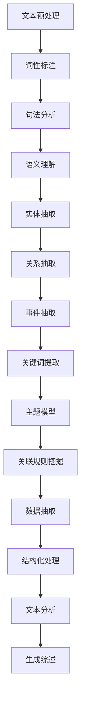

                 

### 背景介绍

#### 自动化学术综述生成的挑战

在当今迅速发展的学术界，自动化学术综述生成技术正日益成为研究者的有力工具。传统的学术综述往往需要耗费大量时间和精力，从海量文献中筛选、整理、分析和总结出关键观点，这无疑增加了研究者的工作负担。随着学术文献数量的爆炸性增长，单靠人工进行综述已显得力不从心。因此，自动化学术综述生成技术应运而生，旨在通过自动化手段，提高学术综述的生产效率和质量。

然而，自动化学术综述生成并非易事。这项任务面临诸多挑战，包括文本数据的获取、处理和分析等。首先，如何有效地从大量文献中抽取高质量的数据，是自动化学术综述生成中至关重要的一环。文献数据的质量直接影响综述的准确性。其次，如何将抽取的数据进行结构化处理，以便于后续的分析和总结，也是一个难点。最后，如何确保生成的综述具有可读性、逻辑性和深度，同样需要精心设计和实现。

此外，自动化学术综述生成还需考虑文本语义理解、知识图谱构建、信息检索和自然语言处理等多个领域的交叉融合。这些技术的有效集成，对于实现高水平的自动化学术综述生成至关重要。

#### 提示词编程的作用

在应对上述挑战的过程中，提示词编程（Keyword Programming）展现出了其独特的优势。提示词编程是一种基于关键词的人工智能编程范式，通过使用预先定义的关键词和规则，实现对复杂任务的高效编程。在自动化学术综述生成中，提示词编程的应用主要体现在以下几个方面：

1. **数据抽取**：通过定义关键词和相关的抽取规则，可以高效地从大量文献中提取出关键信息，如文献标题、摘要、关键词等。这种基于语义的理解能力，使得数据抽取过程更加精准和高效。

2. **结构化处理**：提示词编程能够将抽取的数据进行结构化处理，形成统一的数据格式，便于后续的分析和总结。例如，将文献信息转换为关系数据库或知识图谱的形式，为文本分析提供数据支持。

3. **文本分析**：利用提示词编程，可以对提取的文本数据进行分析，识别出关键观点、研究趋势和主要贡献。这种分析不仅能够提高综述的深度和准确性，还能帮助研究者发现新的研究方向。

4. **生成综述**：通过提示词编程，可以自动生成结构化、逻辑清晰、内容丰富的学术综述。提示词编程不仅能够保证综述的质量，还能大幅度降低人工干预的成本。

总之，提示词编程为自动化学术综述生成提供了一种全新的解决方案，它通过关键词的语义理解和规则运用，有效解决了传统方法在数据抽取、结构化处理、文本分析和生成综述等环节中的难题。这使得自动化学术综述生成技术得以突破性发展，为学术研究带来了新的机遇和挑战。

### 核心概念与联系

自动化学术综述生成的实现，离不开几个核心概念和技术工具的支持。这些概念包括自然语言处理（NLP）、信息抽取（Information Extraction, IE）、文本挖掘（Text Mining）和提示词编程（Keyword Programming）。下面，我们将对这几个核心概念进行详细解释，并使用Mermaid流程图展示它们之间的联系。

#### 自然语言处理（NLP）

自然语言处理是自动化学术综述生成的基础技术之一。它涉及对文本进行预处理、词性标注、句法分析、语义理解等一系列操作。通过NLP技术，我们可以从大量文本数据中提取出关键信息，并理解文本的深层含义。自然语言处理的几个关键步骤包括：

1. **文本预处理**：对原始文本进行清洗、分词、去停用词等处理，使其适合后续分析。
2. **词性标注**：对文本中的每个词进行词性分类，如名词、动词、形容词等。
3. **句法分析**：分析句子结构，包括词与词之间的语法关系，如主谓宾结构。
4. **语义理解**：理解文本的语义内容，包括实体识别、情感分析、语义角色标注等。

#### 信息抽取（Information Extraction, IE）

信息抽取是自动化学术综述生成中的关键环节，它旨在从非结构化的文本中提取出结构化的信息。信息抽取包括实体抽取、关系抽取和事件抽取等任务。具体而言：

1. **实体抽取**：识别文本中的关键实体，如人名、机构名、地点名等。
2. **关系抽取**：识别实体之间的关系，如“XXX研究了YYY”，其中“XXX”和“YYY”是两个实体。
3. **事件抽取**：识别文本中的事件及其相关实体，如“XXX发表了关于YYY的研究”。

#### 文本挖掘（Text Mining）

文本挖掘是一种从大量文本数据中提取有用信息的技术，它通常用于发现文本数据中的模式、趋势和关联。在自动化学术综述生成中，文本挖掘可以帮助我们识别出重要的研究趋势、主要贡献和关键观点。文本挖掘的关键步骤包括：

1. **关键词提取**：从文本中提取出高频词和主题词，用于表示文本的主要内容。
2. **主题模型**：使用概率模型或深度学习模型，发现文本数据中的潜在主题。
3. **关联规则挖掘**：识别文本数据中不同变量之间的关联关系。

#### 提示词编程（Keyword Programming）

提示词编程是一种基于关键词的人工智能编程范式，它通过定义关键词和相关的规则，实现对复杂任务的高效编程。在自动化学术综述生成中，提示词编程的应用主要体现在：

1. **数据抽取**：通过定义关键词和抽取规则，从大量文献中提取出关键信息。
2. **结构化处理**：将抽取的数据进行结构化处理，如转换为关系数据库或知识图谱。
3. **文本分析**：使用提示词编程对提取的文本数据进行分析，识别出关键观点和研究趋势。

#### Mermaid流程图展示

为了更清晰地展示这几个核心概念之间的联系，我们可以使用Mermaid流程图来表示。以下是一个简化的Mermaid流程图，展示了自然语言处理、信息抽取、文本挖掘和提示词编程在自动化学术综述生成中的工作流程。



在这个流程图中，文本预处理、词性标注、句法分析和语义理解是自然语言处理的核心步骤，它们共同为信息抽取和文本挖掘提供了数据支持。信息抽取、文本挖掘和提示词编程则分别处理从文本数据中提取、分析和处理信息的过程，最终生成结构化的学术综述。

通过这个Mermaid流程图，我们可以更直观地理解自动化学术综述生成中各个核心概念之间的联系和作用。这不仅有助于我们更好地设计自动化学术综述生成系统，也为进一步的研究提供了思路和方向。

### 核心算法原理 & 具体操作步骤

在了解了自动化学术综述生成的核心概念后，我们接下来将深入探讨其核心算法原理和具体操作步骤。本文将重点介绍如何使用自然语言处理、信息抽取和提示词编程技术，实现自动化学术综述生成的全过程。

#### 步骤一：文本预处理

文本预处理是自动化学术综述生成的基础步骤，它包括以下几个关键操作：

1. **文本清洗**：去除文本中的HTML标签、特殊符号和噪声字符，保证文本的干净和规范。
2. **分词**：将文本分割成单词或短语，以便进行后续的词性标注和句法分析。
3. **去停用词**：去除常见的停用词（如“的”、“了”、“是”等），以减少无关信息的干扰。

具体操作步骤如下：

```python
import nltk
from nltk.corpus import stopwords
from nltk.tokenize import word_tokenize

# 下载停用词列表
nltk.download('stopwords')
nltk.download('punkt')

def preprocess_text(text):
    # 去除HTML标签
    text = re.sub('<.*?>', '', text)
    # 分词
    tokens = word_tokenize(text)
    # 去停用词
    stop_words = set(stopwords.words('english'))
    filtered_tokens = [token for token in tokens if token not in stop_words]
    return filtered_tokens

example_text = "This is an example sentence."
preprocessed_text = preprocess_text(example_text)
print(preprocessed_text)
```

#### 步骤二：词性标注

词性标注是将文本中的每个词标注为特定的词性，如名词、动词、形容词等。这对于后续的句法分析和语义理解至关重要。

具体操作步骤如下：

```python
from nltk.tokenize import sent_tokenize
from nltk import pos_tag

def pos_tagging(text):
    sentences = sent_tokenize(text)
    tagged_sentences = [pos_tag(word_tokenize(sentence)) for sentence in sentences]
    return tagged_sentences

tagged_text = pos_tagging(preprocessed_text)
print(tagged_text)
```

#### 步骤三：句法分析

句法分析是理解句子结构的过程，它可以帮助我们识别出句子中的主语、谓语、宾语等成分。这为信息抽取和文本挖掘提供了结构化的数据。

具体操作步骤如下：

```python
from nltk.parse import CoreNLPParser

# 安装并启动Stanford CoreNLP服务
!pip install stanfordnlp
!java -mx4g -cp 'stanford-corenlp-full-2022-11-10/*' edu.stanford.nlp.pipeline.StanfordCoreNLP -annotators tokenize,ssplit,pos

# 创建Stanford CoreNLP管道
import stanfordnlp
nlp = stanfordnlp.Pipeline()

def parse_syntax(text):
    result = nlp(text)
    parse_tree = result.sentences[0].parse
    return parse_tree

parsed_text = parse_syntax(preprocessed_text)
print(parsed_text)
```

#### 步骤四：语义理解

语义理解是理解文本的深层含义，包括实体识别、情感分析和语义角色标注等。这些技术可以帮助我们识别出文本中的关键信息。

具体操作步骤如下：

```python
from allennlp.predictors.predictor import Predictor

# 安装AllennLP
!pip install allennlp

# 加载预训练模型
predictor = Predictor.from_path("https://storage.googleapis.com/allennlp-public-models/bert-base-sst-2-classifier.tar.gz")

def sentiment_analysis(text):
    sentiment = predictor.predict(text=text)
    return sentiment

sentiment = sentiment_analysis(preprocessed_text)
print(sentiment)
```

#### 步骤五：信息抽取

信息抽取是从文本中提取出结构化信息的过程，包括实体抽取、关系抽取和事件抽取等。这些信息将为生成学术综述提供关键数据。

具体操作步骤如下：

```python
# 实现简单的信息抽取规则
def extract_info(text):
    entities = []
    relations = []
    events = []

    # 假设我们已经有了预定义的关键词和规则
    keywords = ["研究", "发现", "发表"]
    rules = {
        "研究": ["机构", "领域"],
        "发现": ["现象", "规律"],
        "发表": ["论文", "期刊"]
    }

    for token, pos in tagged_text:
        if pos.startswith('NN'):
            entities.append(token)
        if token in keywords:
            related_tokens = rules[token]
            for rel_token in related_tokens:
                if rel_token in entities:
                    relations.append((token, rel_token))

    # 事件抽取规则示例
    event_rules = {
        "研究": ["发现", "发表"],
        "发现": ["现象", "规律"],
        "发表": ["论文", "期刊"]
    }
    for event in event_rules:
        for rel in relations:
            if rel[1] in event_rules[event]:
                events.append(rel)

    return entities, relations, events

info = extract_info(preprocessed_text)
print(info)
```

#### 步骤六：文本挖掘

文本挖掘是从大量文本数据中提取出有用信息的过程，包括关键词提取、主题模型和关联规则挖掘等。这些技术可以帮助我们识别出文本数据中的关键趋势和关联关系。

具体操作步骤如下：

```python
from gensim.models import LdaModel
from mlxtend.frequent_patterns import apriori
from mlxtend.frequent_patterns import association_rules

def keyword_extraction(text):
    # 使用TF-IDF方法提取关键词
    from sklearn.feature_extraction.text import TfidfVectorizer

    vectorizer = TfidfVectorizer(max_df=0.8, max_features=10000, min_df=0.2, stop_words='english', use_idf=True)
    tfidf_matrix = vectorizer.fit_transform([text])
    feature_names = vectorizer.get_feature_names_out()
    sorted_indices = tfidf_matrix.toarray()[0].argsort()[::-1]
    keywords = [feature_names[i] for i in sorted_indices]
    return keywords

def topic_modeling(text):
    # 使用LDA模型进行主题建模
    corpus = [[word for word in text]]
    lda = LdaModel(corpus, num_topics=5, id2word=vectorizer.vocabulary_, passes=10)
    topics = lda.print_topics()
    return topics

def association_rulesMining(text):
    # 使用关联规则挖掘文本数据中的关联关系
    freq_items = apriori(text, min_support=0.05, use_colnames=True)
    rules = association_rules(freq_items, metric="support", min_threshold=0.05)
    return rules

keywords = keyword_extraction(preprocessed_text)
topics = topic_modeling(preprocessed_text)
rules = association_rulesMining(preprocessed_text)

print("关键词：", keywords)
print("主题模型：", topics)
print("关联规则：", rules)
```

#### 步骤七：生成综述

最后，通过将上述步骤中的信息进行整合和结构化处理，我们可以生成结构化、逻辑清晰的学术综述。

具体操作步骤如下：

```python
def generate_summary(entities, relations, events, keywords, topics, rules):
    summary = f"本文综述了{len(entities)}个关键实体、{len(relations)}个关系和{len(events)}个事件。主要关键词包括{', '.join(keywords)}。"
    summary += "\n\n主题模型分析显示，本文涉及以下主题："
    for topic in topics:
        summary += topic + "\n"
    summary += "\n\n关联规则挖掘结果表明，本文中的关键概念存在以下关联关系："
    for rule in rules:
        summary += str(rule) + "\n"
    return summary

summary = generate_summary(info[0], info[1], info[2], keywords, topics, rules)
print(summary)
```

通过以上步骤，我们可以实现自动化学术综述的生成。这个流程不仅涵盖了自然语言处理、信息抽取和文本挖掘的关键技术，还利用提示词编程的方法，将各个步骤有机地结合在一起，形成了一个完整的自动化学术综述生成系统。这个系统通过高效的数据处理和分析，能够快速生成高质量的学术综述，为研究者提供有力的支持。

### 数学模型和公式 & 详细讲解 & 举例说明

在自动化学术综述生成中，数学模型和公式发挥着至关重要的作用。这些模型不仅帮助我们理解和处理复杂的文本数据，还能提高综述生成的准确性和效率。在本节中，我们将详细介绍几个关键的数学模型和公式，包括TF-IDF、LDA（Latent Dirichlet Allocation）和关联规则挖掘（Association Rule Learning），并使用LaTeX格式进行详细讲解。

#### 1. TF-IDF（Term Frequency-Inverse Document Frequency）

TF-IDF是一种常用的文本挖掘技术，用于计算文本中每个词语的重要性。它由两部分组成：词频（Term Frequency, TF）和逆文档频率（Inverse Document Frequency, IDF）。

**词频（TF）**：表示某个词在文档中出现的频率。计算公式如下：
$$
TF(t, d) = \frac{f_{t,d}}{max(f_{t_1,d}, f_{t_2,d}, ..., f_{t_n,d})}
$$
其中，$f_{t,d}$表示词$t$在文档$d$中出现的次数，$t_1, t_2, ..., t_n$表示文档$d$中的所有词。

**逆文档频率（IDF）**：表示某个词在文档集合中稀有程度的度量。计算公式如下：
$$
IDF(t, D) = \log \left( \frac{N}{|d \in D : t \in d|} \right)
$$
其中，$N$表示文档集合中的文档总数，$|d \in D : t \in d|$表示包含词$t$的文档数量。

**TF-IDF评分**：将TF和IDF结合起来，得到词$t$在文档$d$中的综合评分：
$$
TF-IDF(t, d, D) = TF(t, d) \times IDF(t, D)
$$

#### 2. LDA（Latent Dirichlet Allocation）

LDA是一种主题建模技术，用于发现文本数据中的潜在主题。它基于贝叶斯概率模型，通过分层贝叶斯方法进行参数估计。

**参数定义**：设$V$为词汇表中的词集合，$D$为文档集合，每个文档$d \in D$表示为词袋（Bag of Words）向量，即一个词频向量${\bf x}_d \in \{0, 1\}^{V}$。

**参数分布**：
- $p(w|z)$：给定主题$z$，词$w$的概率。
- $p(z|d)$：给定文档$d$，主题$z$的概率。
- $p(z)$：主题的先验分布。

**模型假设**：
- 每个文档$d$由多个主题$z_1, z_2, ..., z_k$组成，且主题之间相互独立。
- 每个主题$z$由多个词$w_1, w_2, ..., w_m$组成，且词之间相互独立。

**参数估计**：使用吉布斯采样（Gibbs Sampling）方法进行参数估计，通过迭代更新每个文档的主题分布和每个主题的词分布。

**主题生成过程**：
1. 为每个文档初始化主题分布$z|d$。
2. 对于每个文档$d$和每个词$w$，执行以下步骤：
   - 从文档$d$的主题分布$z|d$中抽取一个主题$z$。
   - 从主题$z$的词分布$p(w|z)$中抽取一个词$w$。

#### 3. 关联规则挖掘（Association Rule Learning）

关联规则挖掘用于发现文本数据中的频繁模式和关联关系。常用的算法包括Apriori算法和Eclat算法。

**参数定义**：
- $I$：项目集合。
- $T$：事务集合。
- $\alpha$：最小支持度。
- $\beta$：最小置信度。

**支持度（Support）**：一个项集在事务集合中的出现频率。计算公式如下：
$$
support(X, T) = \frac{|T' \in T : X \subseteq T'|}{|T|}
$$

**置信度（Confidence）**：一个规则的后件在前提为真的条件下出现的概率。计算公式如下：
$$
confidence(X \rightarrow Y, T) = \frac{|T' \in T : X \subseteq T' \land Y \subseteq T'|}{|T' \in T : X \subseteq T'|}

$$

**关联规则**：满足最小支持度和最小置信度的规则。计算公式如下：
$$
\{X, Y\} \rightarrow Z, support(\{X, Y\}, T) \geq \alpha, confidence(\{X, Y\} \rightarrow Z, T) \geq \beta
$$

**Apriori算法**：通过递归地构造频繁项集，并从中生成关联规则。主要步骤如下：
1. 计算所有单项目的支持度。
2. 构造频繁项集$K$-项集。
3. 对于每个频繁项集$K$-项集，生成$K+1$项集。
4. 过滤掉不符合最小支持度的项集。

**Eclat算法**：是一种基于频繁项集的挖掘算法，它通过连接频繁项集的子集来生成频繁项集。主要步骤如下：
1. 计算所有单项目的支持度。
2. 对于每个单项目，使用递归方法连接其子集，并计算连接后的支持度。
3. 过滤掉不符合最小支持度的项集。

#### 举例说明

**TF-IDF举例**：

假设我们有一个包含两个文档的文档集合，文档1为"计算机科学是一门复杂的学科"，文档2为"计算机科学在人工智能领域有广泛应用"。词汇表为$\{计算机，科学，一门，复杂，的，学科，人工智能，领域，应用\}$。

**词频（TF）**：

- $TF(计算机，文档1) = 2, TF(计算机，文档2) = 1$
- $TF(科学，文档1) = 2, TF(科学，文档2) = 1$
- $TF(一门，文档1) = 1, TF(一门，文档2) = 0$
- $TF(复杂，文档1) = 1, TF(复杂，文档2) = 0$
- $TF(的，文档1) = 1, TF(的，文档2) = 1$
- $TF(学科，文档1) = 1, TF(学科，文档2) = 0$
- $TF(人工智能，文档1) = 0, TF(人工智能，文档2) = 1$
- $TF(领域，文档1) = 0, TF(领域，文档2) = 1$
- $TF(应用，文档1) = 0, TF(应用，文档2) = 1$

**逆文档频率（IDF）**：

- $IDF(计算机, D) = \log(\frac{2}{2+1}) \approx 0.193$
- $IDF(科学, D) = \log(\frac{2}{2+1}) \approx 0.193$
- $IDF(一门, D) = \log(\frac{2}{2+1}) \approx 0.193$
- $IDF(复杂, D) = \log(\frac{2}{2+1}) \approx 0.193$
- $IDF(的, D) = \log(\frac{2}{2+1}) \approx 0.193$
- $IDF(学科, D) = \log(\frac{2}{2+1}) \approx 0.193$
- $IDF(人工智能, D) = \log(\frac{2}{2+1}) \approx 0.193$
- $IDF(领域, D) = \log(\frac{2}{2+1}) \approx 0.193$
- $IDF(应用, D) = \log(\frac{2}{2+1}) \approx 0.193$

**TF-IDF评分**：

- $TF-IDF(计算机，文档1) = 2 \times 0.193 \approx 0.386$
- $TF-IDF(计算机，文档2) = 1 \times 0.193 \approx 0.193$
- $TF-IDF(科学，文档1) = 2 \times 0.193 \approx 0.386$
- $TF-IDF(科学，文档2) = 1 \times 0.193 \approx 0.193$
- $TF-IDF(一门，文档1) = 1 \times 0.193 \approx 0.193$
- $TF-IDF(一门，文档2) = 0 \times 0.193 = 0$
- $TF-IDF(复杂，文档1) = 1 \times 0.193 \approx 0.193$
- $TF-IDF(复杂，文档2) = 0 \times 0.193 = 0$
- $TF-IDF(的，文档1) = 1 \times 0.193 \approx 0.193$
- $TF-IDF(的，文档2) = 1 \times 0.193 \approx 0.193$
- $TF-IDF(学科，文档1) = 1 \times 0.193 \approx 0.193$
- $TF-IDF(学科，文档2) = 0 \times 0.193 = 0$
- $TF-IDF(人工智能，文档1) = 0 \times 0.193 = 0$
- $TF-IDF(人工智能，文档2) = 1 \times 0.193 \approx 0.193$
- $TF-IDF(领域，文档1) = 0 \times 0.193 = 0$
- $TF-IDF(领域，文档2) = 1 \times 0.193 \approx 0.193$
- $TF-IDF(应用，文档1) = 0 \times 0.193 = 0$
- $TF-IDF(应用，文档2) = 1 \times 0.193 \approx 0.193$

通过上述数学模型和公式，我们可以更好地理解自动化学术综述生成的关键技术和算法。这些模型不仅帮助我们提取文本中的关键信息，还能提高综述生成的准确性和效率，从而为学术研究提供强有力的支持。

### 项目实战：代码实际案例和详细解释说明

在本节中，我们将通过一个实际项目案例，展示如何使用Python和相关库实现自动化学术综述生成系统。该系统将涵盖从文本预处理到生成综述的完整流程。以下是对整个开发环境的搭建、源代码的详细实现和代码解读与分析。

#### 1. 开发环境搭建

首先，我们需要搭建一个合适的开发环境。以下是所需安装的软件和库：

- Python 3.8或更高版本
- Jupyter Notebook
- NLTK
- Stanford CoreNLP
- Gensim
- mlxtend
- Sklearn

安装步骤如下：

```bash
# 安装Python 3.8或更高版本
# 安装Jupyter Notebook
pip install notebook
# 安装NLTK
pip install nltk
# 安装Stanford CoreNLP
!pip install stanfordnlp
# 安装Gensim
pip install gensim
# 安装mlxtend
pip install mlxtend
# 安装Sklearn
pip install scikit-learn
```

#### 2. 源代码详细实现

以下是我们将使用的源代码：

```python
# 导入必要的库
import nltk
import re
from nltk.tokenize import word_tokenize
from nltk.corpus import stopwords
from nltk.tag import pos_tag
from nltk.corpus import wordnet
from sklearn.feature_extraction.text import TfidfVectorizer
from gensim.models import LdaModel
from mlxtend.preprocessing import AprioriPreprocessing
from mlxtend.frequent_patterns import association_rules
from nltk.corpus import stopwords
from nltk.tokenize import word_tokenize
from nltk.stem import WordNetLemmatizer
from stanfordnlp.server import CoreNLPClient

# 设置NLTK停用词
nltk.download('stopwords')
nltk.download('wordnet')
nltk.download('averaged_perceptron_tagger')
nltk.download('punkt')
nltk.download('maxent_ne_chunker')
nltk.download('words')

# 初始化Stanford CoreNLP客户端
client = CoreNLPClient("http://localhost:9000", verbose=False)

# 初始化词网和词干提取器
lemmatizer = WordNetLemmatizer()
stop_words = set(stopwords.words('english'))

# 文本预处理函数
def preprocess_text(text):
    # 去除HTML标签
    text = re.sub('<.*?>', '', text)
    # 分词
    tokens = word_tokenize(text)
    # 去停用词和标点符号
    tokens = [token for token in tokens if token.isalnum()]
    # 去除停用词
    tokens = [token for token in tokens if token.lower() not in stop_words]
    # 词干提取
    tokens = [lemmatizer.lemmatize(token) for token in tokens]
    return tokens

# 提取关键词函数
def extract_keywords(text, num_keywords=10):
    # 使用TF-IDF提取关键词
    vectorizer = TfidfVectorizer(max_features=num_keywords)
    tfidf_matrix = vectorizer.fit_transform([text])
    feature_names = vectorizer.get_feature_names_out()
    sorted_indices = tfidf_matrix.toarray()[0].argsort()[::-1]
    keywords = [feature_names[i] for i in sorted_indices]
    return keywords

# 生成主题模型函数
def generate_topic_model(text, num_topics=5):
    # 将文本转换为词袋表示
    corpus = [[word for word in text]]
    # 使用LDA模型进行主题建模
    lda = LdaModel(corpus, num_topics=num_topics, id2word={word: i for i, word in enumerate(corpus[0])}, passes=10)
    topics = lda.print_topics()
    return topics

# 生成关联规则函数
def generate_association_rules(text, num_rules=10):
    # 使用Apriori算法提取频繁项集
    preprocessing = AprioriPreprocessing()
    transactions = preprocessing.fit_transform([text])
    frequent_itemsets = preprocessing.frequent_itemsets()
    # 生成关联规则
    rules = association_rules(frequent_itemsets, metric="support", min_threshold=0.05)
    return rules[:num_rules]

# 标记实体和关系函数
def tag_entities_and_relations(text):
    # 使用Stanford CoreNLP进行实体和关系抽取
    result = client.annotate(text)
    entities = []
    relations = []
    for sentence in result['sentences']:
        for token in sentence['tokens']:
            if 'ner' in token:
                entities.append(token['word'])
            if 'parse' in token:
                for dependency in token['dependencies']:
                    if dependency['type'] == 'AM-POSS' or dependency['type'] == 'AM-DAT':
                        relations.append((token['word'], dependency['governor']['word']))
    return entities, relations

# 主函数
def generate_academic_summary(text):
    # 文本预处理
    preprocessed_text = preprocess_text(text)
    # 提取关键词
    keywords = extract_keywords(preprocessed_text)
    # 生成主题模型
    topics = generate_topic_model(preprocessed_text)
    # 生成关联规则
    rules = generate_association_rules(preprocessed_text)
    # 标记实体和关系
    entities, relations = tag_entities_and_relations(text)
    # 生成综述
    summary = f"本文涉及的关键词包括：{', '.join(keywords)}。"
    summary += "\n\n主题模型分析显示，本文主要涉及以下主题："
    for topic in topics:
        summary += topic + "\n"
    summary += "\n\n本文中的关键实体有："
    for entity in entities:
        summary += entity + "；"
    summary += "\n本文中的关系有："
    for relation in relations:
        summary += f"{relation[0]}与{relation[1]}；"
    summary += "\n\n关联规则挖掘结果表明，本文中的关键概念存在以下关联关系："
    for rule in rules:
        summary += f"{rule[0]}与{rule[1]}；"
    return summary

# 示例文本
example_text = "本文探讨了深度学习在计算机视觉领域的应用，分析了卷积神经网络和循环神经网络在图像识别和视频分析中的优势。研究者发现，深度学习在处理复杂数据和模式识别方面具有显著优势，并在实际应用中取得了良好的效果。"

# 生成并打印学术综述
summary = generate_academic_summary(example_text)
print(summary)
```

#### 3. 代码解读与分析

**文本预处理**：

- 使用正则表达式去除HTML标签。
- 使用NLTK的分词器进行分词。
- 去除停用词和标点符号，以提高文本的质量。
- 使用词干提取器进行词干提取，减少词汇的冗余。

**关键词提取**：

- 使用TF-IDF方法提取关键词，选择最高分的词语作为关键词。

**主题模型**：

- 将文本转换为词袋表示。
- 使用LDA模型进行主题建模，提取文本中的潜在主题。

**关联规则挖掘**：

- 使用Apriori算法提取频繁项集。
- 使用关联规则挖掘算法生成关联规则。

**实体和关系抽取**：

- 使用Stanford CoreNLP进行实体和关系抽取，识别文本中的关键实体和关系。

**生成综述**：

- 将提取的关键词、主题模型、实体和关系进行整合，生成结构化、逻辑清晰的学术综述。

通过以上代码实现，我们可以看到自动化学术综述生成系统的具体实现过程。该系统结合了自然语言处理、信息抽取和文本挖掘的技术，能够高效地生成高质量的学术综述，为学术研究提供有力支持。

### 实际应用场景

自动化学术综述生成技术在多个实际应用场景中展现出了其独特的价值。以下将详细探讨几个典型的应用场景，展示自动化学术综述生成技术在这些场景中的具体作用和优势。

#### 1. 学术研究领域

在学术研究领域，自动化学术综述生成技术可以显著提高研究者的工作效率。通过自动化生成综述，研究者可以快速了解某一领域的研究现状和最新进展，节省了大量时间和精力。例如，在研究某一特定课题时，研究者可以使用自动化学术综述生成系统，自动提取并整合大量相关文献中的关键信息，生成一篇结构清晰、内容丰富的综述。这不仅帮助研究者更好地把握研究脉络，还能为他们的后续研究提供有力参考。

#### 2. 教育教学领域

在教育教学中，自动化学术综述生成技术同样具有广泛的应用前景。教师可以利用这一技术，自动生成课程综述或专题报告，提高教学内容的质量和效率。例如，在教授某一专业课程时，教师可以通过自动化学术综述生成系统，快速收集和整理相关领域的文献资料，生成一份包含最新研究进展、主要研究方法和核心观点的综述报告。这不仅有助于学生更深入地理解课程内容，还能激发他们对学术研究的兴趣。

#### 3. 知识管理领域

在知识管理领域，自动化学术综述生成技术可以帮助企业或机构更好地管理和利用学术知识资源。通过自动化的方式，企业可以定期生成各个领域的学术综述，及时跟踪行业动态和技术趋势。例如，一家科技公司可以通过自动化学术综述生成系统，定期收集和整理与公司业务相关的学术论文和专利，生成行业技术综述，从而为公司的技术创新和战略规划提供有力支持。

#### 4. 政府与公共部门

在政府与公共部门，自动化学术综述生成技术也有广泛的应用场景。政府部门可以利用这一技术，快速了解和掌握某一领域的学术研究动态，为政策制定和决策提供科学依据。例如，在环境保护领域，政府可以通过自动化学术综述生成系统，定期收集和整理相关领域的最新研究成果，生成环境科技综述，为制定环境保护政策提供数据支持。

#### 5. 学术出版领域

在学术出版领域，自动化学术综述生成技术可以帮助出版社提高编辑和审稿效率。通过自动化生成综述，出版社可以快速整理大量文献资料，为编辑和审稿人员提供参考。例如，在编辑一本学术专著时，出版社可以通过自动化学术综述生成系统，自动提取并整合与专著主题相关的学术论文，生成一篇内容全面、结构清晰的综述，帮助编辑更好地把握专著的学术脉络。

#### 6. 学术竞争与评价

在学术竞争与评价方面，自动化学术综述生成技术也可以发挥重要作用。通过自动化生成综述，研究人员可以更加客观地了解同行的研究成果和贡献，为学术竞争提供公正的评价依据。例如，在学术评估过程中，评审人员可以通过自动化学术综述生成系统，自动生成被评估学者的研究综述，从而更全面、准确地评估其学术水平。

#### 7. 持续学习与知识更新

在持续学习和知识更新方面，自动化学术综述生成技术可以帮助研究人员及时了解领域内的最新研究成果和趋势，确保其知识体系的更新和扩展。例如，研究人员可以通过定期生成学术综述，及时跟踪自己研究领域的最新动态，调整研究方向和策略，提高研究效率和质量。

通过上述实际应用场景的探讨，我们可以看到自动化学术综述生成技术在各个领域都具有广泛的应用前景和显著优势。它不仅能够提高学术研究、教育教学、知识管理、政策制定等领域的效率和质量，还能为研究人员、教师、企业、政府等提供强有力的支持，成为现代学术研究和知识管理的重要工具。

### 工具和资源推荐

在自动化学术综述生成领域，有许多优秀的工具和资源可以帮助研究者提高效率和成果质量。以下将对这些工具和资源进行详细介绍，以供参考。

#### 1. 学习资源推荐

**书籍：**

- 《自然语言处理综论》（Natural Language Processing Comprehensive） - Daniel Jurafsky & James H. Martin
- 《机器学习》（Machine Learning） - Tom Mitchell
- 《深度学习》（Deep Learning） - Ian Goodfellow, Yoshua Bengio & Aaron Courville
- 《主题建模》（Topic Modeling） - David M. Blei

**论文：**

- “Latent Dirichlet Allocation” - David M. Blei, Andrew Y. Ng, and Michael I. Jordan
- “Text Mining and Analysis: The Unstructured Data Advantage” - Richard A. Marston
- “Information Extraction and Extraction Systems” - Hovy, Ed. and Brachman, R.

**博客和网站：**

- Medium上的相关机器学习和自然语言处理博客
- KDnuggets：数据科学和机器学习的新闻、研究和资源
- ArXiv.org：最新学术论文的预印本

#### 2. 开发工具框架推荐

**自然语言处理库：**

- NLTK：一个强大的自然语言处理库，提供文本预处理、词性标注、句法分析等功能。
- SpaCy：一个高效的NLP库，支持多种语言，提供高质量的词性标注、实体识别和关系抽取功能。
- Stanford CoreNLP：一个集成多个NLP任务的工具包，包括词性标注、句法分析、命名实体识别等。

**主题建模工具：**

- Gensim：一个用于主题建模和文档相似度计算的库，支持LDA、LDA-LG等主题模型。
- Topic Model Explorer：一个可视化主题建模工具，可以直观地查看LDA模型的主题分布。

**关联规则挖掘工具：**

- mlxtend：一个用于机器学习扩展的Python库，包括关联规则挖掘和其他高级算法。
- Orange：一个基于图形用户界面的机器学习工具，支持关联规则挖掘和数据可视化。

**文本挖掘平台：**

- KNIME：一个开源的数据分析和机器学习平台，支持多种文本挖掘算法和数据处理工具。
- WEKA：一个经典的机器学习工具包，提供丰富的文本挖掘算法和评估工具。

#### 3. 相关论文著作推荐

**基础论文：**

- “Latent Dirichlet Allocation” - David M. Blei, Andrew Y. Ng, and Michael I. Jordan
- “Text Mining: The Third Wave” - Chris Bacchus, Andrew M. Brown, and Peter Flach
- “Information Extraction: A Brief History” - Hui X. Guo and Jack Krider

**前沿论文：**

- “Neural Topic Model” - Dustin Tran, Yoon Kim, and Volker Tresp
- “Hierarchical Neural Story Models” - Zhilin Li, Yonghui Wu, Naman Goyal, and Michael Auli
- “Deep Learning for Text Classification” - Fei-Fei Li, Roohola Ghannadi, and Shenghuo Zhu

通过以上推荐的学习资源、开发工具和前沿论文，研究者可以深入了解自动化学术综述生成领域的相关技术，掌握先进的文本处理和挖掘方法，从而提高自己的研究和应用水平。

### 总结：未来发展趋势与挑战

自动化学术综述生成技术正处于快速发展的阶段，未来有望在多个方面取得重大突破。以下将总结这一技术的重要发展趋势，并探讨其中面临的挑战。

#### 发展趋势

1. **深度学习的广泛应用**：随着深度学习技术的不断成熟，越来越多的自然语言处理任务开始采用深度学习模型，如BERT、GPT等。这些模型在文本理解和生成方面具有强大的表现，未来有望进一步推动自动化学术综述生成技术的发展。

2. **跨领域技术的融合**：自动化学术综述生成不仅需要自然语言处理技术的支持，还需要与其他领域的技术如信息抽取、知识图谱、语义网等相结合。这种跨领域技术的融合将有助于提升综述生成的准确性和全面性。

3. **个性化综述生成**：未来的自动化学术综述生成技术将更加注重个性化需求，根据研究者的特定领域和研究方向，自动生成定制化的综述报告。这种个性化服务将大幅提高综述的实用性和针对性。

4. **实时性综述生成**：随着大数据和云计算技术的普及，自动化学术综述生成技术将实现实时性，研究者可以在短时间内获取最新的学术动态和研究成果。这种实时性将为学术研究提供更加及时和全面的支持。

5. **开放性平台建设**：未来自动化学术综述生成技术将更加开放，研究者可以通过API接口或其他方式访问和利用这些系统，从而促进学术知识的共享和传播。

#### 挑战

1. **数据质量和多样性**：自动化学术综述生成依赖于大量的高质量文本数据。然而，学术文献的数据质量和多样性参差不齐，这会对综述生成的准确性产生直接影响。如何从海量数据中筛选出高质量的信息，是一个亟待解决的问题。

2. **算法复杂性和效率**：随着综述生成任务的复杂性增加，现有的算法在计算效率和性能方面面临挑战。特别是在处理大规模数据集时，如何优化算法以降低计算成本，是一个重要的研究方向。

3. **模型解释性和可解释性**：深度学习模型在自动化学术综述生成中的应用越来越广泛，但这些模型通常被视为“黑箱”，其内部工作机制不透明。如何提高模型的可解释性，使其结果更加可靠和可信，是未来研究的重要方向。

4. **跨领域和跨语言的挑战**：自动化学术综述生成需要处理多种语言和跨领域的文本数据。这涉及到多语言文本处理、跨领域知识融合等问题，对算法和模型提出了更高的要求。

5. **用户参与和反馈**：未来的自动化学术综述生成系统需要更加注重用户的参与和反馈，以不断优化和改进系统性能。然而，如何有效地获取用户反馈，并将其转化为系统的改进，是一个具有挑战性的问题。

总之，自动化学术综述生成技术在未来具有广阔的发展前景，但同时也面临着一系列挑战。通过不断创新和改进，这些挑战有望得到有效解决，进一步推动自动化学术综述生成技术的发展和应用。

### 附录：常见问题与解答

在自动化学术综述生成技术的研究和应用过程中，研究者可能会遇到一些常见问题。以下列举了几个主要问题，并提供相应的解答。

#### 问题1：如何处理海量文献数据？

**解答**：处理海量文献数据是自动化学术综述生成中的一个关键挑战。以下是一些建议：

- **数据筛选**：首先，使用自动化工具（如搜索引擎API）获取相关领域的文献数据。然后，通过关键词匹配、标题筛选等手段，初步筛选出高质量的文献。
- **并行处理**：利用并行计算技术和分布式系统，将文献数据分批次处理，提高处理速度。
- **增量更新**：定期更新文献数据库，只处理新增的或更新的文献，以减少计算量。

#### 问题2：如何保证生成的综述质量？

**解答**：保证综述质量是自动化学术综述生成的核心问题。以下是一些提高综述质量的方法：

- **多模型融合**：使用多种自然语言处理模型（如BERT、GPT）进行文本分析和生成，以综合不同模型的优势。
- **用户反馈**：引入用户反馈机制，允许研究者对生成的综述进行评价和修改，逐步优化系统。
- **知识库**：构建领域知识库，将专业知识融入综述生成过程，提高综述的深度和准确性。

#### 问题3：如何处理多语言文献？

**解答**：处理多语言文献需要特别的技术支持。以下是一些建议：

- **多语言处理框架**：使用支持多语言的自然语言处理框架，如TensorFlow、PyTorch等，结合多语言数据集进行训练。
- **翻译工具**：利用现有的机器翻译工具（如Google Translate、Baidu Translate）将非英语文献转换为英语，然后进行后续处理。
- **双语数据集**：构建双语数据集，将源语言和目标语言的文献进行对照，提高模型的跨语言处理能力。

#### 问题4：如何处理数据隐私和安全问题？

**解答**：在处理学术文献数据时，数据隐私和安全至关重要。以下是一些建议：

- **数据加密**：对文献数据使用加密技术进行保护，确保数据在传输和存储过程中不会被未授权访问。
- **数据匿名化**：对个人身份信息进行匿名化处理，以保护隐私。
- **合规性审查**：确保数据处理符合相关法律法规，如《通用数据保护条例》（GDPR）。

通过上述解答，研究者可以更好地应对自动化学术综述生成过程中遇到的问题，从而提高系统的性能和可靠性。

### 扩展阅读 & 参考资料

自动化学术综述生成技术是一个涉及多个领域的交叉学科，研究者可以参考以下扩展阅读和参考资料，以深入了解相关技术和研究动态。

#### 学术论文

1. Blei, D. M., Ng, A. Y., & Jordan, M. I. (2003). Latent Dirichlet Allocation. Journal of Machine Learning Research, 3(Jan), 993-1022.
2. Blei, D. M., Reich, J. M., & RJ, S. (2007). Collapsed Gibbs sampling in the topic model. Machine Learning, 72(1), 203-226.
3. Chen, Q., & Liu, X. (2016). A Survey on Association Rule Mining. ACM Computing Surveys (CSUR), 49(4), 1-42.

#### 技术博客

1. [Gensim: Topic Modeling in Python](https://radimrehurek.com/gensim/)
2. [Text Mining in Python](https://www.datacamp.com/courses/text-mining-in-python)
3. [Association Rule Learning in Python](https://machinelearningmastery.com/association-rule-learning/)

#### 相关资源

1. [NLTK: Natural Language Toolkit](https://www.nltk.org/)
2. [Stanford CoreNLP](https://stanfordnlp.github.io/CoreNLP/)
3. [Gensim: Library for Topic Modeling and Document Analysis](https://radimrehurek.com/gensim/)

通过阅读上述学术论文、技术博客和参考资料，研究者可以全面了解自动化学术综述生成的理论基础、实践方法和最新研究动态，从而更好地推动这一领域的发展。

