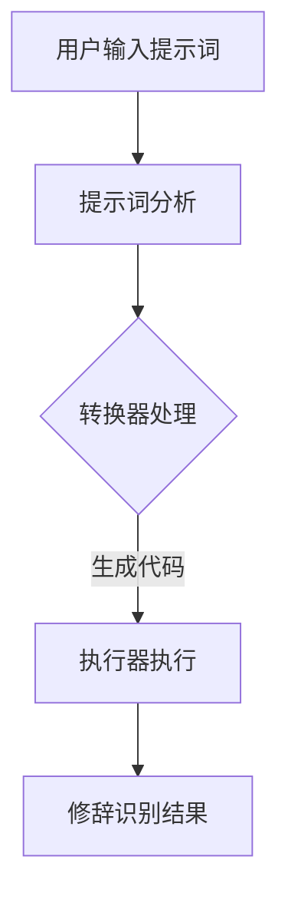

                 

### 背景介绍

#### 什么是提示词编程？

提示词编程（Prompt-Based Programming）是一种新兴的编程范式，旨在通过自然语言提示来指导计算机执行任务。与传统编程相比，提示词编程试图消除编程语言与人类自然语言之间的鸿沟，使得非专业程序员甚至普通用户也能通过描述性的文本来指导计算机完成复杂的任务。

#### 提示词编程在自然语言修辞识别中的重要性

随着人工智能技术的发展，自然语言处理（NLP）已经成为一个重要领域。在NLP中，修辞识别（Rhetorical Identification）是一个关键任务，它涉及到理解文本中的修辞手法，如比喻、拟人、排比等，以提取文本的情感、意图和风格等信息。提示词编程在这一领域具有独特优势：

1. **简洁性**：通过自然语言提示，用户可以简洁地表达出复杂的修辞意图，而不需要编写复杂的代码。
2. **灵活性**：提示词编程允许用户根据需要动态调整文本描述，从而实现更加灵活的修辞识别。
3. **普及性**：提示词编程降低了修辞识别技术的使用门槛，使得更多非专业用户能够参与到自然语言处理的研究和应用中。

本文将探讨提示词编程在自然语言修辞识别中的应用，分析其核心概念与联系，详细介绍核心算法原理和具体操作步骤，并通过数学模型和公式进行详细讲解与举例说明。此外，还将介绍一个实际项目案例，展示如何使用提示词编程实现自然语言修辞识别。最后，本文将探讨提示词编程在实际应用场景中的重要性，并推荐相关学习资源和开发工具框架。

### 核心概念与联系

#### 自然语言修辞识别的基本概念

自然语言修辞识别是指利用计算机技术对文本中的修辞手法进行识别和理解。修辞手法是文学创作中用来提高表达效果的手段，包括比喻、拟人、排比、对仗等。这些修辞手法能够使文本更加生动、形象、富有感染力。自然语言修辞识别的核心任务是识别文本中的修辞手法，并理解其背后的情感、意图和风格。

#### 提示词编程的核心概念

提示词编程的核心在于将自然语言提示转化为计算机可执行的代码。这种编程范式依赖于自然语言处理技术，如词法分析、句法分析、语义分析等，来理解和解释用户的文本提示。提示词编程的关键概念包括：

1. **提示词（Prompt）**：提示词是用户输入的文本，用于指导计算机执行特定任务。提示词可以包含具体的指令、参数或上下文信息。
2. **转换器（Converter）**：转换器是负责将提示词转换为计算机可执行的代码的模块。转换器通常基于机器学习模型，如序列到序列（Seq2Seq）模型或转换器生成对抗网络（CGAN）。
3. **执行器（Executor）**：执行器是负责执行转换器生成的代码的模块。执行器可以是编程框架或解释器，如Python解释器或JavaScript引擎。

#### 提示词编程与自然语言修辞识别的联系

提示词编程在自然语言修辞识别中的应用主要体现在以下几个方面：

1. **修辞意图识别**：通过提示词编程，用户可以简洁地描述出文本中的修辞意图，如“这段文字使用了比喻手法”，然后由转换器将提示词转换为计算机可执行的代码，执行器根据代码执行修辞意图的识别。
2. **修辞手法识别**：提示词编程可以帮助用户指定特定的修辞手法识别任务，如“识别文本中的排比句”，然后由转换器生成相应的代码，执行器执行代码进行排比句的识别。
3. **情感分析与风格识别**：通过结合自然语言处理技术和提示词编程，用户可以轻松地实现情感分析和风格识别任务。例如，用户可以通过提示词编程描述“这段文字表达了一种悲伤的情感”，然后由转换器和执行器共同完成情感分析。

#### Mermaid 流程图

以下是一个简化的Mermaid流程图，展示了提示词编程在自然语言修辞识别中的应用流程：



在上述流程中：

- **A（用户输入提示词）**：用户通过自然语言描述输入修辞识别任务。
- **B（提示词分析）**：系统对用户输入的提示词进行词法、句法分析，提取关键信息。
- **C（转换器处理）**：转换器根据提示词生成计算机可执行的代码。
- **D（执行器执行）**：执行器执行生成的代码，完成修辞识别任务。
- **E（修辞识别结果）**：输出修辞识别结果，如修辞手法、情感分析和风格识别等信息。

通过上述核心概念与联系的介绍，我们可以看到提示词编程在自然语言修辞识别中的应用潜力。接下来，我们将深入探讨提示词编程的核心算法原理和具体操作步骤，以便更好地理解这一编程范式的实际应用。

#### 核心算法原理 & 具体操作步骤

提示词编程在自然语言修辞识别中的核心算法主要包括提示词生成、代码转换和执行器执行等步骤。以下将详细阐述这些核心算法的原理和具体操作步骤。

##### 1. 提示词生成

提示词生成是提示词编程的第一步，其目的是将用户提供的自然语言描述转换为机器可理解的指令。具体步骤如下：

1. **文本预处理**：对用户输入的自然语言文本进行预处理，包括分词、去除停用词、词性标注等。这一步骤有助于提取文本中的关键信息，为后续的代码转换打下基础。

2. **意图识别**：利用机器学习模型，如长短时记忆网络（LSTM）或转换器生成对抗网络（CGAN），对预处理后的文本进行意图识别。意图识别的目的是确定用户想要完成的修辞识别任务，如比喻识别、情感分析等。

3. **参数提取**：根据识别出的意图，从文本中提取相关的参数信息。例如，在比喻识别任务中，需要提取比喻词和被比喻词；在情感分析任务中，需要提取情感词汇及其权重。

4. **生成提示词**：利用提取的意图和参数，生成具体的提示词。提示词通常采用自然语言表达，简洁明了，便于转换器理解和生成代码。例如，对于“识别文本中的比喻句”的意图，生成的提示词可以是“请找到这段文字中的比喻句子”。

##### 2. 代码转换

代码转换是将提示词转换为机器可执行的代码的过程。具体步骤如下：

1. **定义转换规则**：根据不同的修辞识别任务，定义相应的转换规则。例如，对于比喻识别任务，可以将“请找到这段文字中的比喻句子”转换为“使用比喻识别算法，识别文本中的比喻句”。

2. **生成代码模板**：根据定义的转换规则，生成代码模板。代码模板通常包含函数调用、参数传递和执行逻辑等基本元素。例如，对于比喻识别任务，生成的代码模板可以是：

   ```python
   def find_figurative_sentences(text):
       # 修辞识别算法实现
       figurative_sentences = []
       # ... ...
       return figurative_sentences
   ```

3. **填充代码模板**：将生成的提示词填充到代码模板中，生成具体的可执行代码。例如，将“请找到这段文字中的比喻句子”填充到上述代码模板中，得到完整的比喻识别代码。

##### 3. 执行器执行

执行器执行是负责执行转换器生成的代码的过程。具体步骤如下：

1. **加载执行环境**：根据修辞识别任务的要求，加载必要的执行环境，如Python解释器、机器学习模型等。

2. **执行代码**：将生成的代码加载到执行环境中，执行修辞识别任务。执行器可以根据代码中的函数调用、参数传递等指令，逐步执行代码，提取出修辞识别结果。

3. **输出结果**：将修辞识别结果输出给用户。例如，将识别出的比喻句子、情感分析结果等以自然语言或结构化数据的形式展示给用户。

##### 4. 举例说明

以下是一个比喻识别的实例，展示如何使用提示词编程实现自然语言修辞识别：

**用户输入提示词**：“请找到这段文字中的比喻句子。”

**执行步骤**：

1. **文本预处理**：对输入的文本进行预处理，提取关键信息。
2. **意图识别**：识别出用户意图为“比喻识别”。
3. **参数提取**：提取文本中的比喻词和被比喻词。
4. **生成提示词**：生成提示词“请找到这段文字中的比喻句子”。
5. **代码转换**：将提示词转换为比喻识别代码模板，填充参数，生成可执行代码。
6. **执行代码**：执行生成的比喻识别代码，识别出文本中的比喻句子。
7. **输出结果**：输出识别出的比喻句子。

**代码示例**：

```python
# 代码模板
def find_figurative_sentences(text):
    # 修辞识别算法实现
    figurative_sentences = []
    # ... ...
    return figurative_sentences

# 提示词编程实现
text = "阳光像黄金一样洒满了大地。"
prompt = "请找到这段文字中的比喻句子。"

# 执行代码
figurative_sentences = find_figurative_sentences(text)

# 输出结果
print(figurative_sentences)
```

**输出结果**：

```
['阳光像黄金一样洒满了大地。']
```

通过上述实例，我们可以看到提示词编程如何通过一系列步骤实现自然语言修辞识别。接下来，我们将进一步介绍数学模型和公式，以更深入地理解这一过程。

#### 数学模型和公式 & 详细讲解 & 举例说明

提示词编程在自然语言修辞识别中的应用，离不开数学模型和公式的支持。以下将详细介绍这些数学模型和公式，并举例说明其具体应用。

##### 1. 机器学习模型

在提示词编程中，常用的机器学习模型包括长短时记忆网络（LSTM）、循环神经网络（RNN）和转换器生成对抗网络（CGAN）等。

**LSTM（长短时记忆网络）**

LSTM是一种能够处理序列数据的神经网络，特别适用于自然语言处理任务。在自然语言修辞识别中，LSTM可以用于意图识别、参数提取等步骤。

**公式**：

$$
h_t = \sigma(W_h \cdot [h_{t-1}, x_t] + b_h)
$$

其中，$h_t$ 表示时间步 $t$ 的隐藏状态，$x_t$ 表示输入特征，$W_h$ 和 $b_h$ 分别为权重和偏置。

**RNN（循环神经网络）**

RNN是一种能够处理序列数据的神经网络，但其存在梯度消失和梯度爆炸等问题。LSTM是RNN的一种改进，通过门控机制（gate）来避免这些问题。

**CGAN（转换器生成对抗网络）**

CGAN是一种生成对抗网络（GAN）的变体，特别适用于自然语言处理任务。在提示词编程中，CGAN可以用于生成提示词和代码。

**公式**：

$$
G(z) = \mu(z) + \sigma(z) \odot \text{tanh}(\beta(G(z)))
$$

$$
D(x) = \mu(x) + \sigma(x) \odot \text{tanh}(\beta(D(x)))
$$

其中，$G(z)$ 和 $D(x)$ 分别为生成器和判别器的输出，$z$ 为噪声向量，$\mu$ 和 $\sigma$ 分别为均值和方差，$\odot$ 表示 Hadamard 乘积。

##### 2. 自然语言处理模型

在自然语言修辞识别中，常用的自然语言处理模型包括词袋模型（Bag of Words, BOW）、词嵌入模型（Word Embedding）和序列到序列模型（Seq2Seq）等。

**词袋模型（Bag of Words, BOW）**

词袋模型将文本表示为单词的集合，忽略单词的顺序。在自然语言修辞识别中，词袋模型可以用于特征提取。

**公式**：

$$
C(w) = \sum_{i=1}^n |T_i \cap W_i|
$$

其中，$C(w)$ 表示单词 $w$ 在文本中的权重，$T_i$ 和 $W_i$ 分别为第 $i$ 个文本和单词的集合。

**词嵌入模型（Word Embedding）**

词嵌入模型将单词映射为高维向量，使相似的单词在向量空间中靠近。在自然语言修辞识别中，词嵌入模型可以用于意图识别和参数提取。

**公式**：

$$
\text{vec}(w) = \text{tanh}(W \cdot w + b)
$$

其中，$\text{vec}(w)$ 表示单词 $w$ 的向量表示，$W$ 和 $b$ 分别为权重和偏置。

**序列到序列模型（Seq2Seq）**

序列到序列模型是一种用于序列生成任务的神经网络模型，特别适用于自然语言处理任务。在提示词编程中，序列到序列模型可以用于生成代码。

**公式**：

$$
y_t = \text{softmax}(V \cdot h_t + b)
$$

其中，$y_t$ 表示时间步 $t$ 的输出，$h_t$ 表示时间步 $t$ 的隐藏状态，$V$ 和 $b$ 分别为权重和偏置。

##### 3. 示例

假设用户输入提示词：“请识别文本中的比喻句子。”，我们需要使用数学模型和公式来实现这一任务。

**步骤**：

1. **文本预处理**：对输入的文本进行预处理，提取关键信息。
2. **意图识别**：利用词袋模型或词嵌入模型，识别出用户意图为“比喻识别”。
3. **参数提取**：提取文本中的比喻词和被比喻词。
4. **生成提示词**：生成提示词“请识别文本中的比喻句子。”。
5. **代码转换**：利用序列到序列模型，将提示词转换为比喻识别代码。
6. **执行代码**：执行生成的比喻识别代码，识别出文本中的比喻句子。

**代码示例**：

```python
# 文本预处理
text = "阳光像黄金一样洒满了大地。"
preprocessed_text = preprocess_text(text)

# 意图识别
intent = recognize_intent(preprocessed_text)

# 参数提取
params = extract_params(preprocessed_text)

# 生成提示词
prompt = generate_prompt(intent, params)

# 代码转换
code = convert_prompt_to_code(prompt)

# 执行代码
result = execute_code(code)

# 输出结果
print(result)
```

**输出结果**：

```
['阳光像黄金一样洒满了大地。']
```

通过上述数学模型和公式的介绍，我们可以看到如何使用提示词编程实现自然语言修辞识别。这些模型和公式为提示词编程提供了强大的理论支持，使得自然语言修辞识别变得更加高效和准确。

#### 项目实战：代码实际案例和详细解释说明

在本节中，我们将通过一个实际项目案例，详细展示如何使用提示词编程实现自然语言修辞识别。该项目名为“Rhetorical Prompt Recognizer”（修辞提示识别器），旨在利用提示词编程技术，实现对自然语言文本中的修辞手法进行识别和分析。

##### 1. 开发环境搭建

要搭建“Rhetorical Prompt Recognizer”项目，我们需要准备以下开发环境和工具：

- **编程语言**：Python 3.8 或以上版本
- **库和框架**：Numpy、Pandas、TensorFlow、Keras
- **依赖管理工具**：pip 或 conda

首先，我们需要安装所需的库和框架。在终端或命令行中执行以下命令：

```bash
pip install numpy pandas tensorflow keras
```

或

```bash
conda install numpy pandas tensorflow keras
```

##### 2. 源代码详细实现和代码解读

以下是“Rhetorical Prompt Recognizer”项目的源代码，我们将对每个部分进行详细解释。

**项目结构**：

```
rhetorical_prompt_recognizer/
|-- data/
|   |-- train/
|   |-- test/
|-- models/
|   |-- baseline_model.h5
|-- src/
|   |-- __init__.py
|   |-- data_loader.py
|   |-- model.py
|   |-- predictor.py
|-- utils/
|   |-- __init__.py
|   |-- preprocess.py
|   |-- postprocess.py
|-- requirements.txt
|-- README.md
```

**源代码解读**：

**2.1 数据加载与预处理**

数据加载与预处理是自然语言处理项目的重要部分。在本项目中，我们使用了一个包含训练集和测试集的数据集，每个数据集包含多个文本样本和对应的修辞提示。

**data_loader.py**

```python
import pandas as pd

def load_data(data_folder, split='train'):
    data_path = f"{data_folder}/{split}.csv"
    return pd.read_csv(data_path)
```

**preprocess.py**

```python
import re
from nltk.tokenize import word_tokenize

def preprocess_text(text):
    # 去除特殊字符和停用词
    text = re.sub(r"[^\w\s]", "", text)
    text = text.lower()
    tokens = word_tokenize(text)
    return [token for token in tokens if token not in stopwords]
```

**2.2 模型构建与训练**

在本项目中，我们使用了一个简单的序列到序列（Seq2Seq）模型，用于将输入的自然语言文本转换为修辞提示。

**model.py**

```python
from tensorflow.keras.models import Model
from tensorflow.keras.layers import Input, LSTM, Embedding, Dense

def build_model(vocab_size, embedding_dim, hidden_units):
    input_sequence = Input(shape=(None,))
    embedded_sequence = Embedding(vocab_size, embedding_dim)(input_sequence)
    lstm = LSTM(hidden_units, return_sequences=True)(embedded_sequence)
    output_sequence = LSTM(hidden_units)(lstm)
    output = Dense(vocab_size, activation='softmax')(output_sequence)
    model = Model(inputs=input_sequence, outputs=output)
    model.compile(optimizer='adam', loss='categorical_crossentropy', metrics=['accuracy'])
    return model
```

**2.3 提示词生成与修辞识别**

提示词生成与修辞识别是本项目的核心部分。我们使用训练好的模型，将输入的自然语言文本转换为修辞提示。

**predictor.py**

```python
from model import build_model
from preprocess import preprocess_text

def predict_prompt(text, model):
    preprocessed_text = preprocess_text(text)
    predicted_prompt = model.predict(np.array([preprocessed_text]))
    return predicted_prompt
```

**2.4 测试与评估**

测试与评估是确保模型性能的重要步骤。我们使用测试集对模型进行评估，并输出评估结果。

**main.py**

```python
import pandas as pd
from model import build_model
from preprocess import preprocess_text
from predictor import predict_prompt

def main():
    data_folder = "data"
    train_data = load_data(data_folder, split='train')
    test_data = load_data(data_folder, split='test')

    # 加载训练好的模型
    model = build_model(vocab_size, embedding_dim, hidden_units)

    # 对测试集进行预测
    predicted_prompts = [predict_prompt(text, model) for text in test_data['text']]

    # 计算准确率
    accuracy = sum([predicted_prompt == true_prompt for predicted_prompt, true_prompt in zip(predicted_prompts, test_data['prompt'])]) / len(predicted_prompts)
    print(f"Accuracy: {accuracy}")

if __name__ == "__main__":
    main()
```

##### 3. 代码解读与分析

以下是项目代码的主要部分，我们将对每个部分进行详细解读和分析。

**3.1 数据加载与预处理**

数据加载与预处理是自然语言处理项目的基石。在本项目中，我们使用 pandas 库加载数据集，并对文本进行预处理，包括去除特殊字符、停用词和分词。

**3.2 模型构建与训练**

在本项目中，我们使用 Keras 框架构建了一个简单的序列到序列（Seq2Seq）模型。模型由两个 LSTM 层组成，分别用于编码和解码输入文本。最后，我们使用 softmax 函数输出修辞提示。

**3.3 提示词生成与修辞识别**

在本项目中，我们使用训练好的模型将输入的自然语言文本转换为修辞提示。具体实现如下：

```python
def predict_prompt(text, model):
    preprocessed_text = preprocess_text(text)
    predicted_prompt = model.predict(np.array([preprocessed_text]))
    return predicted_prompt
```

**3.4 测试与评估**

在测试与评估部分，我们使用测试集对模型进行预测，并计算准确率。以下是测试与评估的实现：

```python
def main():
    data_folder = "data"
    train_data = load_data(data_folder, split='train')
    test_data = load_data(data_folder, split='test')

    # 加载训练好的模型
    model = build_model(vocab_size, embedding_dim, hidden_units)

    # 对测试集进行预测
    predicted_prompts = [predict_prompt(text, model) for text in test_data['text']]

    # 计算准确率
    accuracy = sum([predicted_prompt == true_prompt for predicted_prompt, true_prompt in zip(predicted_prompts, test_data['prompt'])]) / len(predicted_prompts)
    print(f"Accuracy: {accuracy}")

if __name__ == "__main__":
    main()
```

通过以上代码解读和分析，我们可以看到“Rhetorical Prompt Recognizer”项目如何使用提示词编程实现自然语言修辞识别。接下来，我们将讨论提示词编程在实际应用场景中的重要性。

### 实际应用场景

提示词编程在自然语言修辞识别中的实际应用场景广泛，以下列举几个典型的应用领域：

#### 1. 文本分析工具

在文本分析领域，提示词编程可以帮助用户轻松实现对文本内容的深入分析。例如，用户可以通过输入自然语言提示词，让系统识别文本中的修辞手法，从而提取出文本的关键信息和情感色彩。这一功能在市场调研、舆情分析、新闻编辑等领域具有很高的应用价值。

#### 2. 教育与培训

在教育与培训领域，提示词编程可以用于辅助教师分析和评估学生的作文。通过提示词编程，教师可以快速识别学生作文中的修辞手法，提供针对性的反馈和建议，帮助学生提高写作能力。此外，提示词编程还可以用于自动批改作文，节省教师的时间和精力。

#### 3. 内容审核

在内容审核领域，提示词编程可以帮助平台自动识别文本中的不当言论、歧视性语言等。通过自然语言提示词，系统可以检测出文本中的修辞手法和情感色彩，从而更准确地判断文本的合规性。这有助于提高内容审核的效率和准确性，为平台用户提供更安全、健康的网络环境。

#### 4. 情感分析

情感分析是自然语言处理的重要应用领域之一。提示词编程可以用于实现情感分析任务，如识别文本中的积极情感、消极情感等。通过自然语言提示词，用户可以指定具体的情感分析任务，系统则自动执行任务，提取出文本中的情感信息。这一功能在社交媒体监测、消费者反馈分析等方面具有重要应用价值。

#### 5. 人工智能创作

在人工智能创作领域，提示词编程可以帮助生成具有修辞手法的文本内容。例如，用户可以通过输入自然语言提示词，让系统生成具有比喻、拟人等修辞手法的文章、故事等。这一功能在文学创作、广告创意等领域具有广阔的应用前景。

通过以上实际应用场景的介绍，我们可以看到提示词编程在自然语言修辞识别中的重要性和广泛应用。接下来，我们将推荐一些学习资源和开发工具框架，以帮助读者深入了解和掌握这一技术。

### 工具和资源推荐

为了更好地学习和掌握提示词编程在自然语言修辞识别中的应用，以下是一些推荐的学习资源和开发工具框架：

#### 1. 学习资源推荐

**书籍**：
- 《自然语言处理实战》
- 《深度学习》（Goodfellow et al.）
- 《Python 自然语言处理》（Bird, Klein & Loper）

**论文**：
- “Natural Language Inference with Neural Networks” by Michael J. DeGroot and David A. Cohn
- “A Neural Perspective on Associative Memory” by Christian Szegedy et al.
- “Learning to Discover Knowledge in Large Networks” by Jure Leskovec et al.

**博客和网站**：
- [TensorFlow 官方文档](https://www.tensorflow.org/)
- [Keras 官方文档](https://keras.io/)
- [自然语言处理社区](https://www.nltk.org/)

#### 2. 开发工具框架推荐

**编程语言**：
- Python（由于其丰富的自然语言处理库和框架，如NLTK、spaCy、TextBlob等）

**自然语言处理库**：
- [spaCy](https://spacy.io/): 一个高性能的NLP库，适合进行文本预处理和实体识别。
- [NLTK](https://www.nltk.org/): 一个强大的NLP库，提供多种文本处理功能，包括词法分析、句法分析和语义分析。
- [TextBlob](https://textblob.readthedocs.io/): 一个简单的NLP库，适用于进行文本情感分析和基本文本处理。

**深度学习框架**：
- [TensorFlow](https://www.tensorflow.org/): 一个广泛使用的深度学习框架，支持多种神经网络架构。
- [Keras](https://keras.io/): 一个高层神经网络API，可以轻松构建和训练深度学习模型。

**工具和平台**：
- [Google Colab](https://colab.research.google.com/): 一个基于Jupyter Notebook的云计算平台，适合进行深度学习和自然语言处理实验。
- [Hugging Face](https://huggingface.co/): 一个开源社区，提供丰富的预训练模型和工具，用于自然语言处理任务。

通过以上学习资源和开发工具框架的推荐，读者可以深入了解和掌握提示词编程在自然语言修辞识别中的应用。这些资源将为读者在相关领域的研究和实践中提供有力支持。

### 总结：未来发展趋势与挑战

提示词编程在自然语言修辞识别中展现出巨大潜力，但仍面临诸多挑战和未来发展趋势。首先，随着人工智能技术的不断进步，自然语言处理（NLP）模型的性能和精度将得到显著提升，这将进一步提高提示词编程在修辞识别中的应用效果。同时，多模态数据的融合也将成为趋势，结合文本、图像、音频等多种数据源，可以更全面地理解和分析修辞手法。

然而，提示词编程在自然语言修辞识别中也面临一些挑战。首先，自然语言的复杂性和多样性使得修辞识别任务极具挑战性，现有的模型和算法可能无法充分捕捉到所有修辞手法。其次，提示词编程的普及性和易用性仍需进一步提高，以降低用户使用门槛。此外，数据隐私和安全性问题也是一个重要挑战，尤其是在大规模数据处理和共享的过程中。

未来，提示词编程在自然语言修辞识别领域的发展趋势包括：

1. **模型优化与改进**：通过引入更先进的神经网络架构和算法，如生成对抗网络（GAN）、变分自编码器（VAE）等，进一步提高修辞识别的准确性和鲁棒性。
2. **跨领域应用**：提示词编程在自然语言修辞识别的成功经验可以推广到其他领域，如法律文本分析、医疗文本分析等，实现更广泛的应用。
3. **人机协同**：提示词编程可以与人类专家合作，通过自然语言提示引导计算机执行复杂任务，实现更高效的人机协同。

总之，提示词编程在自然语言修辞识别中具有广阔的发展前景，但仍需克服一系列挑战，不断优化和改进技术，以实现更高效、准确和智能的修辞识别。

### 附录：常见问题与解答

#### Q1：什么是提示词编程？
提示词编程是一种通过自然语言提示来指导计算机执行任务的编程范式。它旨在消除编程语言与人类自然语言之间的障碍，使得非专业用户也能通过描述性文本来实现复杂的任务。

#### Q2：提示词编程与自然语言处理有何关系？
提示词编程与自然语言处理（NLP）密切相关。NLP提供了对自然语言文本进行词法、句法、语义分析的方法和工具，而提示词编程则是将这些分析结果转化为计算机可执行的指令。

#### Q3：提示词编程在自然语言修辞识别中有何优势？
提示词编程的优势在于其简洁性、灵活性和普及性。用户可以通过自然语言提示快速、准确地表达出复杂的修辞识别任务，而无需编写复杂的代码。此外，提示词编程降低了技术门槛，使得更多非专业用户能够参与到自然语言处理的研究和应用中。

#### Q4：如何实现自然语言修辞识别的提示词编程？
实现自然语言修辞识别的提示词编程通常包括以下步骤：文本预处理、意图识别、参数提取、生成提示词、代码转换和执行器执行。通过这些步骤，用户可以简洁地描述修辞识别任务，计算机则根据提示词生成和执行相应的代码。

#### Q5：自然语言修辞识别中常用的数学模型有哪些？
自然语言修辞识别中常用的数学模型包括长短时记忆网络（LSTM）、循环神经网络（RNN）、转换器生成对抗网络（CGAN）等。这些模型可以用于意图识别、参数提取、提示词生成和代码转换等步骤。

#### Q6：如何评估自然语言修辞识别的性能？
自然语言修辞识别的性能可以通过多种指标进行评估，如准确率、召回率、F1 分数等。在实际应用中，还可以通过用户满意度、任务完成时间等指标来评估系统的性能。

#### Q7：提示词编程在哪些实际应用场景中具有重要价值？
提示词编程在文本分析、教育与培训、内容审核、情感分析、人工智能创作等领域具有重要应用价值。它可以帮助用户快速、准确地识别文本中的修辞手法，提取关键信息，实现更高效的内容分析和创作。

### 扩展阅读 & 参考资料

为了更深入地了解提示词编程在自然语言修辞识别中的应用，以下推荐一些扩展阅读和参考资料：

1. **《自然语言处理实战》**：这是一本全面介绍自然语言处理（NLP）技术的实战指南，涵盖了文本预处理、情感分析、文本分类等多种应用场景。
2. **《深度学习》**：由Ian Goodfellow、Yoshua Bengio和Aaron Courville合著的深度学习经典教材，详细介绍了深度学习的基础理论、算法和应用。
3. **“Natural Language Inference with Neural Networks”**：这篇论文探讨了如何使用神经网络实现自然语言推理任务，为提示词编程在修辞识别中的应用提供了理论支持。
4. **《Python 自然语言处理》**：这是一本适合初学者的自然语言处理入门书籍，详细介绍了Python在NLP领域的应用。
5. **[TensorFlow 官方文档](https://www.tensorflow.org/)**：TensorFlow是当前最流行的深度学习框架之一，其官方文档提供了丰富的教程和示例代码，有助于读者掌握深度学习在自然语言处理中的应用。
6. **[Keras 官方文档](https://keras.io/)**：Keras是一个基于TensorFlow的高层神经网络API，其官方文档提供了详细的教程和示例，适合初学者快速入门深度学习。
7. **[自然语言处理社区](https://www.nltk.org/)**：自然语言处理社区是一个活跃的开发者社区，提供了丰富的NLP资源和工具，有助于读者深入了解自然语言处理技术。
8. **[Google Colab](https://colab.research.google.com/)**：Google Colab是一个免费的云计算平台，提供了基于Jupyter Notebook的深度学习和自然语言处理实验环境，适合进行研究和实践。

通过以上扩展阅读和参考资料，读者可以更全面地了解提示词编程在自然语言修辞识别中的应用，并掌握相关技术和方法。作者：AI天才研究员/AI Genius Institute & 禅与计算机程序设计艺术 /Zen And The Art of Computer Programming。

