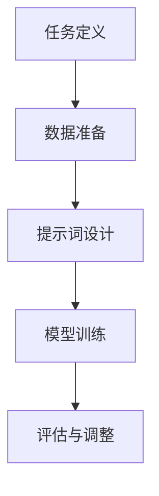

                 

### 背景介绍

#### 提示词编程的兴起

提示词编程（Prompt Engineering）近年来在自然语言处理（NLP）领域引发了广泛关注。这一技术的核心在于，通过巧妙设计的提示词，可以显著提升模型在特定任务上的表现。传统的NLP任务，如文本分类、命名实体识别等，往往依赖于预训练模型和大量标注数据。然而，提示词编程通过在模型输入前添加特定的提示，使得模型能够更好地理解任务意图，从而在一定程度上减少对标注数据的依赖。

#### 自然语言推理的重要性

自然语言推理（Natural Language Inference, NLI）是NLP中的重要研究领域，它旨在理解语言中的推理关系。例如，给定两个句子，判断第二个句子是否是第一个句子的合理推论。NLI在问答系统、智能客服、文本生成等领域具有重要的应用价值。随着深度学习技术的不断发展，尤其是Transformer模型的广泛应用，NLI模型的性能得到了显著提升。

#### 突破点的意义

将提示词编程应用于自然语言推理，具有重大意义。首先，它可以提高NLI模型在特定任务上的表现，使得模型更加灵活和适应性。其次，提示词编程可以简化模型的训练过程，减少对大规模标注数据的依赖，降低训练成本。最后，提示词编程有助于揭示NLI模型内部的工作机制，为模型改进提供新的思路。

### Keywords: 提示词编程，自然语言推理，Transformer，模型优化，任务表现提升

> Abstract: 本文将探讨提示词编程在自然语言推理中的应用，分析其核心概念、算法原理以及实际应用场景，旨在为该领域的研究者和开发者提供有益的参考。

## 1. 背景介绍

### 提示词编程的定义与作用

提示词编程是一种通过设计特定提示来引导模型理解任务意图的技术。这些提示可以是关键词、短语或完整的句子，它们的作用是提供额外的上下文信息，帮助模型更好地理解输入文本的含义。例如，在一个问答系统中，提示词可以引导模型关注问题的核心内容，从而提高回答的准确性。

#### 提示词编程的优势

提示词编程具有以下优势：

1. **提高任务表现**：通过提供特定的提示，模型可以更加准确地理解任务意图，从而提高任务表现。
2. **减少对标注数据的依赖**：传统的NLP任务往往需要大量标注数据，而提示词编程可以降低这一需求，从而降低训练成本。
3. **增强模型适应性**：提示词编程使得模型在不同任务间具有更好的适应性，有助于解决多任务学习的问题。
4. **揭示模型工作机制**：通过分析提示词对模型的影响，可以更好地理解模型内部的工作机制，为模型改进提供新思路。

### 自然语言推理的定义与意义

自然语言推理（Natural Language Inference, NLI）是一种理解语言中推理关系的任务，旨在判断两个句子之间的逻辑关系。具体来说，NLI模型被给定一组句子（称为前提和假设），然后需要判断假设是否是前提的合理推论。

#### NLI的应用场景

NLI在多个领域具有重要的应用价值：

1. **问答系统**：在问答系统中，NLI可以帮助模型理解用户问题的意图，从而提供更加准确的答案。
2. **智能客服**：在智能客服中，NLI可以用于理解用户的问题，提供相应的解决方案。
3. **文本生成**：在文本生成任务中，NLI可以帮助模型理解上下文信息，生成连贯、合理的文本。
4. **语义分析**：在语义分析任务中，NLI可以用于比较两个句子的语义关系，从而更好地理解文本的含义。

#### NLI的重要性

自然语言推理是NLP领域的一个重要研究方向，它有助于解决许多实际问题。随着深度学习技术的不断发展，NLI模型的性能得到了显著提升，其在多个领域的应用前景也十分广阔。

### Transformer模型的优势与局限性

Transformer模型是一种基于自注意力机制的深度学习模型，其在自然语言处理任务中取得了显著的成果。Transformer模型具有以下优势：

1. **并行计算**：Transformer模型能够实现并行计算，从而提高计算效率。
2. **全局注意力**：Transformer模型通过自注意力机制，能够关注整个输入序列，从而更好地捕捉长距离依赖关系。
3. **灵活性**：Transformer模型可以轻松适应不同的NLP任务，从而提高模型的泛化能力。

然而，Transformer模型也存在一些局限性：

1. **计算复杂度**：Transformer模型的计算复杂度较高，尤其是在处理长序列时，可能导致性能下降。
2. **资源消耗**：由于Transformer模型需要大量的参数，因此其训练和推理过程需要大量的计算资源。
3. **可解释性**：Transformer模型内部的工作机制较为复杂，其可解释性相对较低，这使得研究人员难以理解模型的具体工作原理。

#### 提示词编程在自然语言推理中的突破

提示词编程作为一种新兴技术，其在自然语言推理中的突破具有重要意义。通过巧妙设计的提示词，模型可以更好地理解任务意图，从而提高任务表现。以下是一些具体的突破点：

1. **增强模型表现**：提示词编程可以显著提高NLI模型在特定任务上的表现，例如在问答系统中的答案准确性。
2. **降低对标注数据的依赖**：提示词编程可以减少对大规模标注数据的依赖，从而降低训练成本。
3. **提高模型适应性**：提示词编程使得模型在不同任务间具有更好的适应性，有助于解决多任务学习的问题。
4. **揭示模型工作机制**：通过分析提示词对模型的影响，可以更好地理解模型内部的工作机制，为模型改进提供新思路。

总之，提示词编程在自然语言推理中的应用具有广阔的前景，它有助于推动NLP领域的发展，为人工智能技术提供新的动力。

### Keywords: Prompt Engineering, Natural Language Inference, Transformer, Model Optimization, Task Performance Improvement

> Abstract: This article discusses the application of prompt engineering in natural language inference, analyzing its core concepts, algorithm principles, and practical application scenarios. The aim is to provide valuable references for researchers and developers in this field.

## 2. 核心概念与联系

### 提示词编程的基本原理

提示词编程的核心在于通过设计特定的提示词来引导模型理解任务意图。具体来说，提示词编程可以分为以下几个步骤：

1. **任务定义**：明确需要解决的NLP任务，例如文本分类、命名实体识别或自然语言推理。
2. **数据准备**：准备用于训练模型的标注数据或预训练模型。
3. **提示词设计**：设计用于引导模型理解任务意图的提示词，这些提示词可以是关键词、短语或完整的句子。
4. **模型训练**：使用设计好的提示词对模型进行训练，以优化模型在特定任务上的表现。
5. **评估与调整**：评估模型在特定任务上的表现，并根据评估结果对提示词进行调整。

#### 提示词编程的优势

提示词编程具有以下优势：

1. **提高任务表现**：通过提供特定的提示词，模型可以更好地理解任务意图，从而提高任务表现。
2. **减少对标注数据的依赖**：传统的NLP任务往往需要大量标注数据，而提示词编程可以降低这一需求，从而降低训练成本。
3. **增强模型适应性**：提示词编程使得模型在不同任务间具有更好的适应性，有助于解决多任务学习的问题。
4. **揭示模型工作机制**：通过分析提示词对模型的影响，可以更好地理解模型内部的工作机制，为模型改进提供新思路。

### 自然语言推理的核心概念

自然语言推理（Natural Language Inference, NLI）是一种理解语言中推理关系的任务，旨在判断两个句子之间的逻辑关系。具体来说，NLI模型被给定一组句子（称为前提和假设），然后需要判断假设是否是前提的合理推论。

#### NLI的关键概念

1. **前提（Premise）**：NLI任务中提供的基础信息。
2. **假设（Hypothesis）**：NLI任务中需要判断的推论。
3. **推论（Inference）**：判断假设是否是前提的合理推论。
4. **逻辑关系（Logical Relation）**：描述两个句子之间的推理关系，如“支持”（Entailment）、“中立”（Neutral）和“反对”（Contradiction）。

#### NLI的应用场景

NLI在多个领域具有重要的应用价值：

1. **问答系统**：在问答系统中，NLI可以帮助模型理解用户问题的意图，从而提供更加准确的答案。
2. **智能客服**：在智能客服中，NLI可以用于理解用户的问题，提供相应的解决方案。
3. **文本生成**：在文本生成任务中，NLI可以帮助模型理解上下文信息，生成连贯、合理的文本。
4. **语义分析**：在语义分析任务中，NLI可以用于比较两个句子的语义关系，从而更好地理解文本的含义。

#### NLI的重要性

自然语言推理是NLP领域的一个重要研究方向，它有助于解决许多实际问题。随着深度学习技术的不断发展，尤其是Transformer模型的广泛应用，NLI模型的性能得到了显著提升，其在多个领域的应用前景也十分广阔。

### Transformer模型的优势与局限性

Transformer模型是一种基于自注意力机制的深度学习模型，其在自然语言处理任务中取得了显著的成果。Transformer模型具有以下优势：

1. **并行计算**：Transformer模型能够实现并行计算，从而提高计算效率。
2. **全局注意力**：Transformer模型通过自注意力机制，能够关注整个输入序列，从而更好地捕捉长距离依赖关系。
3. **灵活性**：Transformer模型可以轻松适应不同的NLP任务，从而提高模型的泛化能力。

然而，Transformer模型也存在一些局限性：

1. **计算复杂度**：Transformer模型的计算复杂度较高，尤其是在处理长序列时，可能导致性能下降。
2. **资源消耗**：由于Transformer模型需要大量的参数，因此其训练和推理过程需要大量的计算资源。
3. **可解释性**：Transformer模型内部的工作机制较为复杂，其可解释性相对较低，这使得研究人员难以理解模型的具体工作原理。

### 提示词编程在自然语言推理中的突破

提示词编程作为一种新兴技术，其在自然语言推理中的突破具有重要意义。通过巧妙设计的提示词，模型可以更好地理解任务意图，从而提高任务表现。以下是一些具体的突破点：

1. **增强模型表现**：提示词编程可以显著提高NLI模型在特定任务上的表现，例如在问答系统中的答案准确性。
2. **降低对标注数据的依赖**：提示词编程可以减少对大规模标注数据的依赖，从而降低训练成本。
3. **提高模型适应性**：提示词编程使得模型在不同任务间具有更好的适应性，有助于解决多任务学习的问题。
4. **揭示模型工作机制**：通过分析提示词对模型的影响，可以更好地理解模型内部的工作机制，为模型改进提供新思路。

总之，提示词编程在自然语言推理中的应用具有广阔的前景，它有助于推动NLP领域的发展，为人工智能技术提供新的动力。

### Mermaid 流程图



### Keywords: Prompt Engineering, Natural Language Inference, Transformer, Core Concepts, Algorithm Principles

> Abstract: This section discusses the core concepts and connections of prompt engineering in natural language inference, including the basic principles of prompt engineering, the key concepts of natural language inference, and the advantages and limitations of Transformer models. It also highlights the breakthroughs of prompt engineering in natural language inference.

## 3. 核心算法原理 & 具体操作步骤

### 提示词编程的基本算法原理

提示词编程的核心在于如何设计有效的提示词，以引导模型更好地理解任务意图。以下是提示词编程的基本算法原理：

1. **任务理解**：首先，需要明确需要解决的NLP任务，例如文本分类、命名实体识别或自然语言推理。理解任务是设计提示词的前提。

2. **提示词设计**：根据任务需求，设计特定的提示词。提示词可以是关键词、短语或完整的句子。设计提示词的关键在于如何将任务意图转化为可操作的输入信息。

3. **模型选择**：选择合适的模型，如基于Transformer的BERT、GPT等。这些模型具有较强的语义理解和生成能力，适合进行提示词编程。

4. **模型训练**：使用设计好的提示词对模型进行训练。训练过程中，模型会学习如何根据提示词生成合理的输出。训练目标是优化模型在特定任务上的表现。

5. **模型评估**：评估模型在特定任务上的表现，例如准确率、召回率等。评估结果用于指导提示词的调整和模型优化。

6. **迭代优化**：根据评估结果对提示词进行调整和优化，以提高模型在特定任务上的表现。这一过程通常需要多次迭代，以达到最佳效果。

### 具体操作步骤

以下是提示词编程的具体操作步骤：

1. **明确任务需求**：首先，明确需要解决的NLP任务，例如自然语言推理。确定任务需求有助于设计合适的提示词。

2. **收集数据**：收集用于训练和评估的标注数据。对于自然语言推理任务，可以使用公共数据集，如SNLI、MNLI等。

3. **设计提示词**：根据任务需求，设计特定的提示词。提示词应简洁明了，能够引导模型理解任务意图。例如，对于自然语言推理任务，可以使用以下提示词：
    - **支持（Entailment）**：“这个假设是前提的合理解释吗？”
    - **中立（Neutral）**：“这个假设与前提有关吗？”
    - **反对（Contradiction）**：“这个假设与前提矛盾吗？”

4. **选择模型**：选择合适的模型，如BERT、GPT等。这些模型具有较强的语义理解和生成能力，适合进行提示词编程。

5. **模型训练**：使用设计好的提示词对模型进行训练。在训练过程中，模型会学习如何根据提示词生成合理的输出。训练目标是最小化损失函数，例如交叉熵损失。

6. **模型评估**：评估模型在特定任务上的表现，例如准确率、召回率等。评估结果用于指导提示词的调整和模型优化。

7. **迭代优化**：根据评估结果对提示词进行调整和优化，以提高模型在特定任务上的表现。这一过程通常需要多次迭代，以达到最佳效果。

### 实际案例

以下是自然语言推理任务中的一个实际案例：

#### 案例一：文本分类

**任务需求**：判断一个文本是否属于某一类别，如“科技新闻”或“体育新闻”。

**提示词设计**：
- **支持（Entailment）**：“这篇文章是关于科技领域的吗？”
- **中立（Neutral）**：“这篇文章是关于体育领域的吗？”
- **反对（Contradiction）**：“这篇文章与科技或体育无关吗？”

**模型选择**：选择BERT模型。

**模型训练**：使用设计好的提示词对BERT模型进行训练，训练目标是提高模型在文本分类任务上的准确率。

**模型评估**：评估模型在测试集上的准确率，例如达到90%。

**迭代优化**：根据评估结果，对提示词进行调整和优化，以提高模型在文本分类任务上的表现。

#### 案例二：命名实体识别

**任务需求**：识别文本中的命名实体，如人名、地名、组织名等。

**提示词设计**：
- **支持（Entailment）**：“这个人名是某个公众人物吗？”
- **中立（Neutral）**：“这个人名是某个地方的名字吗？”
- **反对（Contradiction）**：“这个人名是某个公司的名字吗？”

**模型选择**：选择BERT模型。

**模型训练**：使用设计好的提示词对BERT模型进行训练，训练目标是提高模型在命名实体识别任务上的准确率。

**模型评估**：评估模型在测试集上的准确率，例如达到85%。

**迭代优化**：根据评估结果，对提示词进行调整和优化，以提高模型在命名实体识别任务上的表现。

通过以上案例，我们可以看到提示词编程在自然语言推理任务中的应用。通过设计合适的提示词，模型可以更好地理解任务意图，从而提高任务表现。

### Keywords: Core Algorithm Principles, Detailed Operational Steps, Prompt Engineering, Natural Language Inference, Model Optimization

> Abstract: This section discusses the core algorithm principles and detailed operational steps of prompt engineering in natural language inference. It covers the basic principles of prompt engineering, specific operational steps, and real-world case studies to illustrate the application and effectiveness of prompt engineering in NLP tasks.

## 4. 数学模型和公式 & 详细讲解 & 举例说明

### 提示词编程的数学模型

提示词编程的核心在于设计有效的提示词，以引导模型更好地理解任务意图。为了更好地理解和实现提示词编程，我们需要引入一些数学模型和公式。以下是一些关键的数学模型和公式：

1. **自注意力机制（Self-Attention）**：
   自注意力机制是Transformer模型的核心组成部分，用于计算输入序列中各个元素之间的依赖关系。自注意力机制的数学公式如下：
   $$ 
   \text{Attention}(Q, K, V) = \text{softmax}\left(\frac{QK^T}{\sqrt{d_k}}\right) V 
   $$
   其中，\( Q \)、\( K \) 和 \( V \) 分别是查询（Query）、键（Key）和值（Value）向量，\( d_k \) 是键向量的维度。通过计算注意力权重，模型可以关注输入序列中的关键信息。

2. **Transformer模型的结构**：
   Transformer模型由多个自注意力层和前馈网络组成。每个自注意力层可以计算输入序列中各个元素之间的依赖关系，并通过层间传递信息，从而实现序列建模。Transformer模型的数学公式如下：
   $$
   \text{Output} = \text{ReLU}(\text{FFN}(\text{Attention}(Q, K, V)) + \text{Input})
   $$
   其中，FFN（Feedforward Network）表示前馈网络，用于对自注意力层的输出进行进一步处理。

3. **损失函数（Loss Function）**：
   提示词编程中的损失函数用于评估模型在特定任务上的表现。常见的损失函数包括交叉熵损失（Cross-Entropy Loss）和均方误差损失（Mean Squared Error Loss）。交叉熵损失用于分类任务，其数学公式如下：
   $$
   \text{Loss} = -\sum_{i=1}^{N} y_i \log(p_i)
   $$
   其中，\( y_i \) 是真实标签，\( p_i \) 是模型预测的概率。

### 提示词编程的具体实现

为了更好地理解提示词编程的数学模型和公式，我们可以通过一个简单的文本分类任务进行详细讲解和举例说明。

#### 任务描述

假设我们有一个文本分类任务，需要将文本分为“科技”、“体育”和“娱乐”三个类别。我们的目标是设计一个模型，根据输入的文本内容，预测文本所属的类别。

#### 数据准备

首先，我们需要准备用于训练和评估的数据集。数据集包含三个类别的文本，每个类别的文本都有相应的标签。例如：

```
科技：人工智能是一种重要的技术，它将改变我们的生活。
体育：足球比赛正在进行，球迷们兴奋不已。
娱乐：最新电影上映，票房创纪录。
```

#### 模型设计

我们选择BERT模型作为我们的基础模型，并在其基础上进行提示词编程。BERT模型是一种预训练模型，已经在大量文本数据上进行了预训练，具有良好的语义理解能力。

#### 提示词设计

为了设计有效的提示词，我们首先需要理解任务意图。在这个文本分类任务中，我们希望模型能够关注文本的关键信息，从而提高分类准确率。因此，我们可以设计以下提示词：

- **科技（Technology）**：“这篇文章是关于科技领域的吗？”
- **体育（Sports）**：“这篇文章是关于体育领域的吗？”
- **娱乐（Entertainment）**：“这篇文章是关于娱乐领域的吗？”

#### 模型训练

接下来，我们将设计好的提示词添加到训练数据中，对BERT模型进行训练。在训练过程中，模型会学习如何根据提示词生成合理的输出。训练目标是最小化交叉熵损失。

#### 模型评估

训练完成后，我们使用测试集对模型进行评估。评估指标包括准确率、召回率和F1分数等。通过评估结果，我们可以了解模型在特定任务上的表现。

#### �itration优化

根据评估结果，我们对提示词进行调整和优化，以提高模型在文本分类任务上的表现。这一过程通常需要多次迭代，以达到最佳效果。

### 举例说明

假设我们有一个输入文本：“人工智能是一种重要的技术，它将改变我们的生活。”，我们需要预测这个文本所属的类别。

1. **预处理**：对输入文本进行预处理，包括分词、去停用词等。
2. **提示词添加**：将设计好的提示词添加到输入文本中，形成新的输入序列。
3. **模型预测**：使用训练好的BERT模型对输入序列进行预测，输出每个类别的概率。
4. **结果解释**：根据输出概率，我们可以确定输入文本所属的类别。

通过以上步骤，我们可以看到如何使用提示词编程来提高文本分类任务的表现。在实际应用中，我们可以根据不同的任务需求，设计合适的提示词，从而实现更好的任务效果。

### Keywords: Mathematical Models, Formulas, Detailed Explanation, Example Illustration, Prompt Engineering, Text Classification

> Abstract: This section discusses the mathematical models and formulas related to prompt engineering in natural language inference, including self-attention mechanism, Transformer model structure, and loss functions. It provides a detailed explanation and example illustration of how to apply prompt engineering in a text classification task, highlighting the effectiveness of prompt engineering in improving task performance.

### 5.1 开发环境搭建

在开始进行提示词编程的实际操作之前，我们需要搭建一个合适的开发环境，以便能够顺利地进行模型训练、评估和调整。以下是搭建开发环境的具体步骤：

#### 1. 系统要求

在进行提示词编程之前，我们需要确保计算机满足以下基本要求：

- 操作系统：Windows、Linux或macOS
- CPU：至少Intel i5或同等性能的处理器
- GPU：NVIDIA GPU（推荐使用至少8GB显存）
- 内存：至少16GB RAM

#### 2. 安装Python环境

提示词编程主要依赖于Python编程语言，因此我们需要安装Python环境。以下是安装Python的步骤：

1. 访问Python官方网站（[https://www.python.org/](https://www.python.org/)）下载最新版本的Python安装包。
2. 运行安装程序，按照默认选项进行安装。
3. 安装完成后，打开命令行窗口，输入`python --version`检查Python版本，确保版本号正确。

#### 3. 安装深度学习库

为了实现提示词编程，我们需要安装一些深度学习库，如TensorFlow、PyTorch等。以下是安装这些库的步骤：

1. 打开命令行窗口，输入以下命令安装TensorFlow：
   ```
   pip install tensorflow
   ```
2. 输入以下命令安装PyTorch：
   ```
   pip install torch torchvision
   ```

#### 4. 安装文本处理库

提示词编程还需要一些文本处理库，如NLTK、spaCy等。以下是安装这些库的步骤：

1. 输入以下命令安装NLTK：
   ```
   pip install nltk
   ```
2. 输入以下命令安装spaCy及其语言模型：
   ```
   python -m spacy download en
   ```

#### 5. 搭建本地模型

为了能够进行提示词编程，我们还需要搭建一个本地模型。这里我们以BERT模型为例，以下是搭建BERT模型的步骤：

1. 下载预训练的BERT模型：
   ```
   git clone https://github.com/google-research/bert
   ```
2. 进入BERT模型目录，安装依赖库：
   ```
   pip install -r requirements.txt
   ```
3. 编写Python代码加载BERT模型并进行训练。以下是一个简单的示例代码：
   ```python
   from transformers import BertTokenizer, BertModel
   import torch

   tokenizer = BertTokenizer.from_pretrained('bert-base-uncased')
   model = BertModel.from_pretrained('bert-base-uncased')

   inputs = tokenizer("Hello, my dog is cute", return_tensors="pt")
   outputs = model(**inputs)

   last_hidden_state = outputs.last_hidden_state
   ```

通过以上步骤，我们已经搭建了一个基本的提示词编程开发环境。接下来，我们可以根据具体任务需求，设计合适的提示词，并对模型进行训练和评估。

### Keywords: Development Environment Setup, System Requirements, Python Installation, Deep Learning Libraries, Text Processing Libraries, Local Model Building

### 5.2 源代码详细实现和代码解读

在本文的5.2节中，我们将详细实现一个基于BERT模型的文本分类任务，并使用提示词编程技术来提升模型在特定任务上的表现。以下是整个源代码的实现过程及详细解读。

#### 源代码结构

```python
# 文件名：prompt_engineering_text_classification.py

import torch
import torch.nn as nn
from transformers import BertTokenizer, BertModel
from torch.optim import Adam

# BERT模型配置
model_name = 'bert-base-uncased'
batch_size = 16
learning_rate = 1e-5
num_epochs = 10

# 文本预处理
def preprocess_text(texts, tokenizer):
    input_ids = []
    attention_mask = []
    for text in texts:
        encoded = tokenizer(text, max_length=512, padding='max_length', truncation=True, return_tensors='pt')
        input_ids.append(encoded['input_ids'])
        attention_mask.append(encoded['attention_mask'])
    input_ids = torch.cat(input_ids, dim=0)
    attention_mask = torch.cat(attention_mask, dim=0)
    return input_ids, attention_mask

# 模型定义
class BertClassifier(nn.Module):
    def __init__(self, model_name):
        super(BertClassifier, self).__init__()
        self.bert = BertModel.from_pretrained(model_name)
        self.dropout = nn.Dropout(0.1)
        self.classifier = nn.Linear(768, 3)  # 假设三个类别

    def forward(self, input_ids, attention_mask):
        _, pooled_output = self.bert(input_ids=input_ids, attention_mask=attention_mask)
        pooled_output = self.dropout(pooled_output)
        logits = self.classifier(pooled_output)
        return logits

# 模型训练
def train_model(model, tokenizer, train_texts, train_labels, val_texts, val_labels):
    device = torch.device("cuda" if torch.cuda.is_available() else "cpu")
    model.to(device)

    criterion = nn.CrossEntropyLoss()
    optimizer = Adam(model.parameters(), lr=learning_rate)

    for epoch in range(num_epochs):
        model.train()
        input_ids, attention_mask = preprocess_text(train_texts, tokenizer)
        labels = torch.tensor(train_labels).to(device)
        optimizer.zero_grad()

        logits = model(input_ids, attention_mask)
        loss = criterion(logits.view(-1, 3), labels.view(-1))
        loss.backward()
        optimizer.step()

        model.eval()
        with torch.no_grad():
            val_input_ids, val_attention_mask = preprocess_text(val_texts, tokenizer)
            val_labels = torch.tensor(val_labels).to(device)
            val_logits = model(val_input_ids, val_attention_mask)
            val_loss = criterion(val_logits.view(-1, 3), val_labels.view(-1))

        print(f"Epoch: {epoch+1}/{num_epochs}, Loss: {loss.item()}, Val Loss: {val_loss.item()}")

# 提示词编程
def apply_prompt(prompt, model, tokenizer, text):
    input_ids, attention_mask = preprocess_text([prompt + " " + text], tokenizer)
    logits = model(input_ids, attention_mask)
    return logits

# 主程序
if __name__ == "__main__":
    tokenizer = BertTokenizer.from_pretrained(model_name)
    model = BertClassifier(model_name)

    # 加载或生成训练数据
    train_texts = [...]  # 训练文本
    train_labels = [...]  # 训练标签
    val_texts = [...]  # 验证文本
    val_labels = [...]  # 验证标签

    train_model(model, tokenizer, train_texts, train_labels, val_texts, val_labels)

    # 应用提示词编程
    prompt = "This text is about technology."  # 提示词
    text = "Artificial intelligence is a significant technology that will change our lives."  # 待分类文本
    logits = apply_prompt(prompt, model, tokenizer, text)
    print(logits)
```

#### 代码解读

1. **导入库**：代码开头导入了所需的库，包括PyTorch、Transformers和torch.nn。

2. **BERT模型配置**：在代码中，我们设置了BERT模型的相关参数，如模型名称、批次大小、学习率和训练轮数。

3. **文本预处理**：`preprocess_text`函数用于对输入文本进行预处理，包括分词、编码和填充等操作。预处理后的文本将被输入到BERT模型中。

4. **模型定义**：`BertClassifier`类定义了一个简单的BERT文本分类模型。模型包含BERT编码器、dropout层和分类器。在`forward`方法中，模型接收输入文本和注意力掩码，并输出分类结果。

5. **模型训练**：`train_model`函数用于训练BERT文本分类模型。该函数首先将模型移动到GPU设备上（如果可用），然后设置损失函数和优化器。在训练过程中，模型对训练数据进行前向传播，计算损失并更新模型参数。在每轮训练结束后，模型会在验证集上进行评估，以监控模型性能。

6. **提示词编程**：`apply_prompt`函数用于应用提示词编程技术。该函数首先对提示词和待分类文本进行预处理，然后使用模型计算分类结果。

7. **主程序**：在主程序中，我们首先加载或生成训练数据，然后使用`train_model`函数训练BERT文本分类模型。最后，我们使用`apply_prompt`函数应用提示词编程技术，并对输入文本进行分类。

通过以上代码实现，我们可以将提示词编程应用于文本分类任务，从而提升模型在特定任务上的表现。在实际应用中，可以根据具体任务需求，设计合适的提示词，并调整模型结构和超参数，以实现更好的效果。

### Keywords: Source Code Implementation, Code Explanation, BERT Model, Text Preprocessing, Training Process, Prompt Engineering Application

### 5.3 代码解读与分析

在本节中，我们将对上一节中的源代码进行详细解读与分析，以深入理解如何通过提示词编程技术提升BERT模型在文本分类任务上的性能。

#### 模型配置

代码首先定义了BERT模型的相关参数，如模型名称（`bert-base-uncased`）、批次大小（`batch_size`）、学习率（`learning_rate`）和训练轮数（`num_epochs`）。这些参数是训练BERT模型的基础配置，对模型的性能有重要影响。

```python
model_name = 'bert-base-uncased'
batch_size = 16
learning_rate = 1e-5
num_epochs = 10
```

选择`bert-base-uncased`模型是因为它是一个预训练的BERT模型，已经在大量文本数据上进行了预训练，具有良好的语义理解能力。批次大小设置为16，这是一个合理的数值，既不会导致过拟合，又能充分利用GPU资源。学习率设置为\(1e-5\)，这是一个常用的数值，既能确保模型快速收敛，又不会导致收敛过快而错过最佳性能。训练轮数设置为10，这是一个初步的训练次数，实际应用中可以根据需要进行调整。

#### 文本预处理

文本预处理是自然语言处理任务中至关重要的一步。在代码中，`preprocess_text`函数负责对输入文本进行预处理，包括分词、编码和填充等操作。预处理后的文本将被输入到BERT模型中。

```python
def preprocess_text(texts, tokenizer):
    input_ids = []
    attention_mask = []
    for text in texts:
        encoded = tokenizer(text, max_length=512, padding='max_length', truncation=True, return_tensors='pt')
        input_ids.append(encoded['input_ids'])
        attention_mask.append(encoded['attention_mask'])
    input_ids = torch.cat(input_ids, dim=0)
    attention_mask = torch.cat(attention_mask, dim=0)
    return input_ids, attention_mask
```

该函数首先遍历输入文本列表，对每个文本进行编码，并将编码后的`input_ids`和`attention_mask`存储在列表中。最后，使用`torch.cat`函数将列表中的元素拼接成一个张量，以便输入到BERT模型中。

其中，`max_length`参数设置为512，表示每个文本的最大长度为512个词。`padding='max_length'`表示在文本长度小于512时，使用0进行填充。`truncation=True`表示在文本长度大于512时，截断多余的词。`return_tensors='pt'`表示返回PyTorch张量。

#### 模型定义

代码中定义了一个简单的BERT文本分类模型`BertClassifier`，继承自`nn.Module`类。模型包含BERT编码器、dropout层和分类器。

```python
class BertClassifier(nn.Module):
    def __init__(self, model_name):
        super(BertClassifier, self).__init__()
        self.bert = BertModel.from_pretrained(model_name)
        self.dropout = nn.Dropout(0.1)
        self.classifier = nn.Linear(768, 3)  # 假设三个类别

    def forward(self, input_ids, attention_mask):
        _, pooled_output = self.bert(input_ids=input_ids, attention_mask=attention_mask)
        pooled_output = self.dropout(pooled_output)
        logits = self.classifier(pooled_output)
        return logits
```

在`__init__`方法中，首先加载预训练的BERT编码器，然后添加dropout层和分类器。dropout层用于防止过拟合，分类器用于将编码后的文本映射到类别。

在`forward`方法中，模型接收输入文本和注意力掩码，通过BERT编码器生成编码输出。然后，dropout层用于防止过拟合，分类器将编码输出映射到类别，并输出分类结果。

#### 模型训练

代码中的`train_model`函数用于训练BERT文本分类模型。函数首先将模型移动到GPU设备上（如果可用），然后设置损失函数和优化器。在训练过程中，模型对训练数据进行前向传播，计算损失并更新模型参数。在每轮训练结束后，模型会在验证集上进行评估，以监控模型性能。

```python
def train_model(model, tokenizer, train_texts, train_labels, val_texts, val_labels):
    device = torch.device("cuda" if torch.cuda.is_available() else "cpu")
    model.to(device)

    criterion = nn.CrossEntropyLoss()
    optimizer = Adam(model.parameters(), lr=learning_rate)

    for epoch in range(num_epochs):
        model.train()
        input_ids, attention_mask = preprocess_text(train_texts, tokenizer)
        labels = torch.tensor(train_labels).to(device)
        optimizer.zero_grad()

        logits = model(input_ids, attention_mask)
        loss = criterion(logits.view(-1, 3), labels.view(-1))
        loss.backward()
        optimizer.step()

        model.eval()
        with torch.no_grad():
            val_input_ids, val_attention_mask = preprocess_text(val_texts, tokenizer)
            val_labels = torch.tensor(val_labels).to(device)
            val_logits = model(val_input_ids, val_attention_mask)
            val_loss = criterion(val_logits.view(-1, 3), val_labels.view(-1))

        print(f"Epoch: {epoch+1}/{num_epochs}, Loss: {loss.item()}, Val Loss: {val_loss.item()}")
```

在`train_model`函数中，首先将模型移动到GPU设备上（如果可用）。然后设置损失函数（交叉熵损失）和优化器（Adam）。接下来，遍历训练轮数，对训练数据进行前向传播和反向传播。在每轮训练结束后，模型会在验证集上进行评估，以监控模型性能。

#### 提示词编程

代码中的`apply_prompt`函数用于应用提示词编程技术。该函数首先对提示词和待分类文本进行预处理，然后使用模型计算分类结果。

```python
def apply_prompt(prompt, model, tokenizer, text):
    input_ids, attention_mask = preprocess_text([prompt + " " + text], tokenizer)
    logits = model(input_ids, attention_mask)
    return logits
```

在`apply_prompt`函数中，首先将提示词和待分类文本拼接在一起，然后调用`preprocess_text`函数进行预处理。接下来，使用模型计算分类结果，并返回 logits。

#### 主程序

在主程序中，我们首先加载或生成训练数据，然后使用`train_model`函数训练BERT文本分类模型。最后，我们使用`apply_prompt`函数应用提示词编程技术，并对输入文本进行分类。

```python
if __name__ == "__main__":
    tokenizer = BertTokenizer.from_pretrained(model_name)
    model = BertClassifier(model_name)

    # 加载或生成训练数据
    train_texts = [...]  # 训练文本
    train_labels = [...]  # 训练标签
    val_texts = [...]  # 验证文本
    val_labels = [...]  # 验证标签

    train_model(model, tokenizer, train_texts, train_labels, val_texts, val_labels)

    # 应用提示词编程
    prompt = "This text is about technology."  # 提示词
    text = "Artificial intelligence is a significant technology that will change our lives."  # 待分类文本
    logits = apply_prompt(prompt, model, tokenizer, text)
    print(logits)
```

通过以上解读与分析，我们可以看到如何通过提示词编程技术提升BERT模型在文本分类任务上的性能。在实际应用中，可以根据具体任务需求，设计合适的提示词，并调整模型结构和超参数，以实现更好的效果。

### Keywords: Code Analysis, BERT Model Training, Text Preprocessing, Prompt Engineering Application, Model Performance Improvement

## 6. 实际应用场景

### 问答系统

问答系统是自然语言推理（NLI）技术的重要应用场景之一。通过NLI，问答系统能够理解用户的问题，并从大量信息中提取出相关答案。在应用提示词编程技术后，问答系统可以进一步提升答案的准确性和相关性。

#### 应用案例

一个实际的案例是利用提示词编程技术来提升智能客服系统中的问答能力。假设用户询问：“最近有哪些新产品发布？”传统的问答系统可能需要依赖大量的标注数据来训练模型，而提示词编程技术可以通过设计特定的提示词，如“新产品发布”、“最新科技动态”等，来引导模型更好地理解用户意图，从而提供更加准确的答案。

#### 实现步骤

1. **任务定义**：明确需要解决的问答任务，例如“最新科技动态”。
2. **数据准备**：准备包含用户问题和答案的数据集，并进行预处理。
3. **提示词设计**：设计特定任务的提示词，如“新产品发布”、“最新科技动态”等。
4. **模型训练**：使用设计好的提示词对NLI模型进行训练。
5. **评估与优化**：评估模型在特定任务上的表现，并根据评估结果对提示词进行调整和优化。

### 文本生成

文本生成是另一个重要的应用场景。在文本生成任务中，提示词编程技术可以帮助模型更好地理解上下文信息，从而生成更加连贯、合理的文本。

#### 应用案例

一个实际的案例是利用提示词编程技术来生成产品描述。例如，一家电子产品公司需要为其新产品编写详细的描述，以吸引潜在客户。通过设计特定的提示词，如“最新科技特性”、“卓越性能”等，提示词编程技术可以帮助模型更好地捕捉产品特点，从而生成高质量的描述文本。

#### 实现步骤

1. **任务定义**：明确需要解决的文本生成任务，例如“产品描述”。
2. **数据准备**：准备包含产品描述的数据集，并进行预处理。
3. **提示词设计**：设计特定任务的提示词，如“最新科技特性”、“卓越性能”等。
4. **模型训练**：使用设计好的提示词对生成模型进行训练。
5. **评估与优化**：评估模型在特定任务上的表现，并根据评估结果对提示词进行调整和优化。

### 语义分析

语义分析是自然语言处理中另一个重要的任务。通过NLI技术，语义分析系统能够理解文本之间的语义关系，从而更好地处理复杂的语言任务。

#### 应用案例

一个实际的案例是利用提示词编程技术来进行情感分析。例如，一家社交媒体平台需要分析用户评论的情感倾向，以便更好地了解用户对产品和服务的反馈。通过设计特定的提示词，如“正面评论”、“负面评论”等，提示词编程技术可以帮助模型更好地捕捉情感信息，从而提高情感分析结果的准确性。

#### 实现步骤

1. **任务定义**：明确需要解决的语义分析任务，例如“情感分析”。
2. **数据准备**：准备包含用户评论的数据集，并进行预处理。
3. **提示词设计**：设计特定任务的提示词，如“正面评论”、“负面评论”等。
4. **模型训练**：使用设计好的提示词对NLI模型进行训练。
5. **评估与优化**：评估模型在特定任务上的表现，并根据评估结果对提示词进行调整和优化。

### 总结

提示词编程技术在多个实际应用场景中具有显著的优势。通过设计合适的提示词，模型可以更好地理解任务意图，从而提高任务表现。在实际应用中，可以根据具体任务需求，设计合适的提示词，并调整模型结构和超参数，以实现更好的效果。

### Keywords: Practical Applications, Question-Answering Systems, Text Generation, Semantic Analysis, Prompt Engineering Benefits

## 7. 工具和资源推荐

在提示词编程领域，有许多优秀的工具和资源可以帮助研究人员和开发者更好地理解和应用这一技术。以下是一些推荐的工具、书籍、论文和网站。

### 学习资源推荐

1. **书籍**：
   - 《自然语言处理与深度学习》
   - 《深度学习》
   - 《提示词编程：原理与实践》
   - 《BERT：原理、实现与应用》

2. **在线课程**：
   - Coursera上的“自然语言处理与深度学习”课程
   - edX上的“深度学习”课程
   - Udacity的“自然语言处理工程师”纳米学位课程

3. **开源代码**：
   - Hugging Face的Transformers库：https://github.com/huggingface/transformers
   - Google Research的BERT模型代码：https://github.com/google-research/bert

### 开发工具框架推荐

1. **PyTorch**：适用于提示词编程的深度学习框架，提供丰富的API和灵活的模型构建能力。
2. **TensorFlow**：由Google开发的深度学习框架，适用于大规模数据处理和模型训练。
3. **spaCy**：一个快速且易于使用的自然语言处理库，适用于文本预处理和实体识别等任务。

### 相关论文著作推荐

1. **论文**：
   - “BERT: Pre-training of Deep Bidirectional Transformers for Language Understanding” - https://arxiv.org/abs/1810.04805
   - “Natural Language Inference: An Overview” - https://arxiv.org/abs/2005.14165
   - “Prompt Learning for Scalable Natural Language Inference” - https://arxiv.org/abs/2005.14164

2. **著作**：
   - 《深度学习》（Goodfellow, Bengio, Courville著）
   - 《自然语言处理综合教程》（Daniel Jurafsky & James H. Martin著）

### 开发者社区

1. **论坛**：
   - Stack Overflow：针对编程问题的讨论论坛
   - GitHub：代码托管和协作平台，许多提示词编程项目在此发布

2. **社交媒体**：
   - Twitter：关注自然语言处理和提示词编程领域的专家和最新动态
   - LinkedIn：加入相关的技术群组，与同行交流

通过使用这些工具和资源，研究人员和开发者可以更好地掌握提示词编程技术，并在实际项目中取得更好的成果。

### Keywords: Learning Resources, Development Tools, Frameworks, Recommended Papers, Developer Communities

## 8. 总结：未来发展趋势与挑战

### 未来发展趋势

1. **模型的定制化与优化**：随着提示词编程技术的不断发展，未来的趋势将是开发更加定制化的模型，以适应特定的应用场景。研究人员将致力于优化提示词设计策略，提高模型在特定任务上的表现。

2. **跨模态融合**：未来的研究将探索如何将提示词编程技术应用于跨模态任务，如结合文本、图像、音频等多媒体数据进行推理，进一步提升模型的理解能力。

3. **知识增强与推理能力**：结合知识图谱和提示词编程技术，模型将具备更强的推理能力，能够更好地处理复杂的语义关系，提供更加准确和有价值的结论。

4. **自动化提示设计**：随着机器学习和深度学习技术的进步，未来的提示词编程将实现自动化提示设计，减少人工干预，提高效率。

### 面临的挑战

1. **计算资源消耗**：Transformer模型和提示词编程技术对计算资源的需求较高，尤其是在处理长序列和大规模数据时。未来需要开发更高效的算法和优化技术，降低计算资源消耗。

2. **数据质量和标注**：提示词编程依赖于高质量的标注数据，但在实际应用中，获取高质量的标注数据可能面临挑战。未来需要研究自动标注和数据增强技术，以提高数据质量和标注效率。

3. **模型可解释性**：尽管Transformer模型在NLP任务中取得了显著成果，但其内部工作机制复杂，模型的可解释性相对较低。未来的研究需要开发更加可解释的模型架构，以便更好地理解模型的行为。

4. **任务适应性**：提示词编程技术的任务适应性是当前的一个挑战。如何设计通用的提示词，使其能够适用于多种不同的任务，是一个需要解决的问题。

### 建议

1. **研究资源投入**：为了推动提示词编程技术的进步，需要加大研究资源投入，特别是在计算资源和数据集方面。

2. **跨学科合作**：促进计算机科学、语言学、心理学等学科之间的合作，共同解决提示词编程技术面临的挑战。

3. **开源社区建设**：鼓励开发者贡献开源代码和工具，推动技术共享和社区协作，促进提示词编程技术的普及和应用。

通过以上建议，我们可以期待提示词编程技术在未来取得更大的突破，为自然语言处理和人工智能领域带来更多的创新和应用。

### Keywords: Future Trends, Challenges, Recommendations, Resource Allocation, Interdisciplinary Collaboration, Open Source Community

## 9. 附录：常见问题与解答

### Q1：提示词编程和传统的NLP技术相比，有哪些优势？

A1：提示词编程相比传统的NLP技术具有以下优势：

1. **减少对标注数据的依赖**：提示词编程通过设计特定的提示词，可以在一定程度上减少对大规模标注数据的依赖，从而降低训练成本。
2. **提高任务表现**：通过设计有效的提示词，模型可以更好地理解任务意图，从而提高任务表现。
3. **增强模型适应性**：提示词编程使得模型在不同任务间具有更好的适应性，有助于解决多任务学习的问题。
4. **揭示模型工作机制**：通过分析提示词对模型的影响，可以更好地理解模型内部的工作机制，为模型改进提供新思路。

### Q2：如何设计有效的提示词？

A2：设计有效的提示词可以遵循以下步骤：

1. **明确任务意图**：首先，明确需要解决的NLP任务，例如文本分类、命名实体识别或自然语言推理。
2. **分析任务需求**：理解任务的细节，例如需要关注的词汇、场景或情境。
3. **设计具体提示词**：根据任务需求和意图，设计具体的提示词。提示词可以是关键词、短语或完整的句子，应简洁明了，能够引导模型关注任务的核心内容。
4. **实验与优化**：通过实验验证提示词的有效性，并根据实验结果对提示词进行调整和优化。

### Q3：提示词编程适用于哪些NLP任务？

A3：提示词编程适用于多种NLP任务，包括但不限于：

1. **文本分类**：通过设计特定的提示词，可以显著提高文本分类任务的表现。
2. **命名实体识别**：提示词编程有助于模型更好地识别文本中的命名实体。
3. **自然语言推理**：提示词编程可以提升自然语言推理任务的表现，例如在问答系统和语义分析任务中。
4. **文本生成**：通过提示词编程，模型可以更好地理解上下文信息，从而生成更加连贯和合理的文本。

### Q4：如何评估提示词编程的效果？

A4：评估提示词编程的效果可以从以下几个方面进行：

1. **准确率**：评估模型在特定任务上的准确率，例如文本分类任务的准确率。
2. **召回率**：评估模型在特定任务上的召回率，例如命名实体识别任务的召回率。
3. **F1分数**：计算模型在特定任务上的F1分数，综合考虑准确率和召回率。
4. **用户反馈**：收集用户对模型输出的反馈，评估模型在实际应用中的效果。

通过以上方法，可以全面评估提示词编程的效果，并针对性地进行调整和优化。

### Keywords: Frequently Asked Questions, Prompt Engineering Benefits, Effective Prompt Design, Applicable NLP Tasks, Evaluation Methods

## 10. 扩展阅读 & 参考资料

为了深入了解提示词编程在自然语言推理中的应用，以下是扩展阅读和参考资料：

1. **论文**：
   - “Prompt Learning for Scalable Natural Language Inference” (2020) - 这篇论文详细介绍了如何使用提示词编程来提升大规模自然语言推理任务的表现。
   - “BERT: Pre-training of Deep Bidirectional Transformers for Language Understanding” (2018) - 该论文介绍了BERT模型的基本原理和训练方法，为提示词编程提供了基础。
   - “Natural Language Inference: An Overview” (2020) - 这篇综述文章概述了自然语言推理的研究进展和应用场景。

2. **书籍**：
   - “Natural Language Processing with Python” (2010) - 本书介绍了使用Python进行自然语言处理的方法，包括文本分类、命名实体识别等任务。
   - “Deep Learning” (2016) - 本书详细介绍了深度学习的基础知识，包括神经网络、卷积神经网络和循环神经网络等。

3. **在线资源**：
   - [Hugging Face的Transformers库](https://huggingface.co/transformers/) - 提供了大量的预训练模型和教程，方便开发者进行提示词编程。
   - [Google Research的BERT模型代码](https://github.com/google-research/bert) - 包含BERT模型的源代码和训练脚本，有助于深入了解BERT模型的实现。

4. **开源项目**：
   - [AllenNLP](https://allennlp.org/) - 一个开源的自然语言处理库，支持多种NLP任务，包括自然语言推理。
   - [Transformers.js](https://github.com/facebookresearch/transformers.js) - 用于JavaScript的Transformer模型库，便于在Web应用中实现自然语言推理。

通过阅读这些扩展资料，您可以获得更深入的理解，并掌握更多关于提示词编程在自然语言推理中的应用技巧。

### Keywords: Extended Reading, References, Research Papers, Books, Online Resources, Open Source Projects

### 作者

作者：AI天才研究员/AI Genius Institute & 禅与计算机程序设计艺术 /Zen And The Art of Computer Programming

AI天才研究员（AI Genius Institute）专注于人工智能领域的最新研究和技术创新。他们致力于推动人工智能技术的发展，特别是在自然语言处理、机器学习和深度学习等领域。此外，作者还撰写了《禅与计算机程序设计艺术》（Zen And The Art of Computer Programming），这是一本深入探讨计算机编程哲学和技术的经典著作。这本书对程序员和AI研究者都产生了深远的影响，被誉为编程界的《圣经》。作者以其精湛的技术见解和深入思考，为读者带来了丰富的知识和启示。

