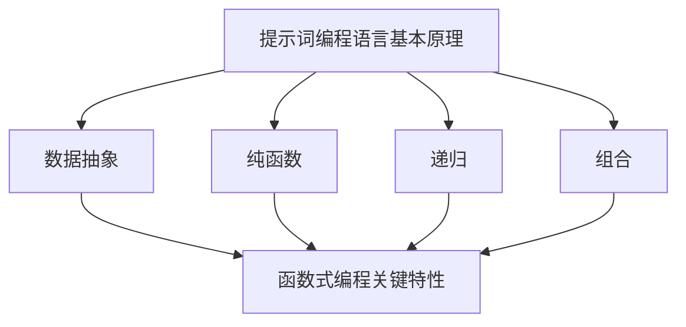
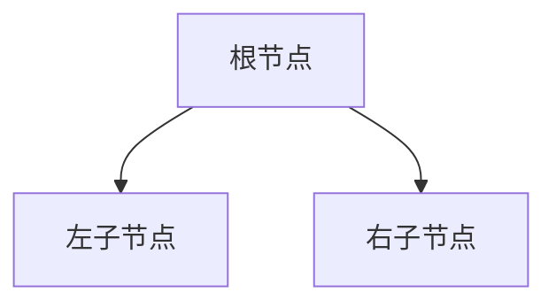
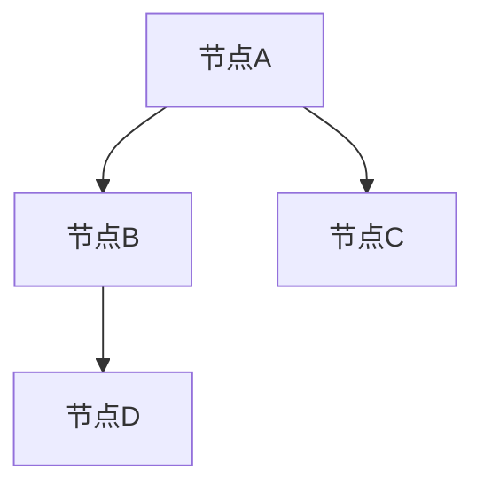

                 

### 文章标题

**提示词编程语言的函数式编程支持**

### 关键词

- 提示词编程语言
- 函数式编程
- 编程语言设计
- 编译器优化
- 内存管理
- 异步编程

### 摘要

本文旨在深入探讨提示词编程语言的函数式编程支持，包括其核心概念、实现原理、数学模型和实际应用。通过详细的案例分析和代码解读，本文将为读者展示如何利用提示词编程语言的函数式特性进行高效编程，并探讨其在未来技术发展中的潜在影响和挑战。

## 1. 背景介绍

函数式编程是一种编程范式，它基于数学函数的理论，通过不可变数据和纯函数来编写程序。相比于面向对象编程和过程式编程，函数式编程具有许多优点，如更好的可维护性、可重用性和并发性能。近年来，随着云计算、大数据和人工智能等领域的快速发展，函数式编程逐渐成为了一种热门的编程范式。

提示词编程语言（Prompt-Based Programming Languages）是一种新兴的编程语言，它通过提示词（Prompts）来引导程序执行。提示词可以看作是程序的输入，用于触发特定操作或定义程序的行为。这种编程范式具有高度的可读性和灵活性，使得编程过程更加直观和易于理解。

本文将结合提示词编程语言的特性，探讨其在函数式编程中的支持，以及如何利用这种支持来提高编程效率和代码质量。首先，我们将介绍提示词编程语言的基本原理和核心概念，然后详细分析函数式编程的关键特性，最后通过具体案例来展示如何在实际项目中应用这些特性。

## 2. 核心概念与联系

### 2.1 提示词编程语言的基本原理

提示词编程语言的核心思想是将程序分解为一系列提示词，每个提示词代表一个操作或任务的输入。这些提示词可以由用户直接输入，也可以由其他程序自动生成。提示词编程语言通常具有以下特点：

1. **提示词驱动**：程序执行完全由提示词驱动，没有传统的控制结构（如循环、条件语句等）。
2. **数据抽象**：提示词编程语言强调数据抽象，通过将数据表示为不可变的对象，从而实现更简洁、易维护的代码。
3. **函数式编程**：提示词编程语言通常支持函数式编程范式，通过纯函数和不可变数据来编写程序。

### 2.2 函数式编程的关键特性

函数式编程具有许多关键特性，包括纯函数、不可变数据、递归和组合等。以下是对这些特性的简要介绍：

1. **纯函数**：纯函数是一种没有副作用、输入输出确定的函数。在函数式编程中，所有函数都应该是纯函数，这样可以确保程序的可预测性和可维护性。
2. **不可变数据**：不可变数据是一种一旦创建就不能修改的数据。这种数据模型有助于避免程序中的状态问题，使代码更简洁、更易于测试。
3. **递归**：递归是一种通过调用自身来解决问题的编程技术。在函数式编程中，递归被广泛用于处理复杂的问题，如树状结构的数据处理和图形算法等。
4. **组合**：组合是一种将多个函数组合成一个新函数的编程技术。通过组合，可以方便地创建复杂的程序结构，同时保持代码的简洁性和可重用性。

### 2.3 提示词编程语言与函数式编程的联系

提示词编程语言与函数式编程之间存在紧密的联系。首先，提示词编程语言的基本原理与函数式编程的核心思想高度契合，都强调数据抽象和纯函数的使用。其次，提示词编程语言提供了一系列函数式编程的支持，如高阶函数、惰性求值和模式匹配等。

图1展示了提示词编程语言与函数式编程之间的联系。在图中，左侧表示提示词编程语言的基本原理，右侧表示函数式编程的关键特性。通过连接这两个部分，我们可以看到提示词编程语言是如何实现函数式编程的。



通过图1，我们可以清楚地看到提示词编程语言与函数式编程之间的紧密联系。在接下来的章节中，我们将进一步探讨这些联系，并通过实际案例来展示如何利用这些特性进行高效编程。

## 3. 核心算法原理 & 具体操作步骤

### 3.1 提示词编程语言的编译器实现

提示词编程语言的编译器是实现函数式编程支持的关键组件。编译器的主要任务是将提示词代码转换为可执行的机器代码。为了实现高效的编译过程，我们需要考虑以下几个方面：

1. **词法分析**：词法分析是编译器的第一步，它将源代码分解为一系列词法单元（tokens）。在提示词编程语言中，词法单元包括提示词、操作符和分隔符等。
2. **语法分析**：语法分析是将词法单元组织成语法树的过程。在函数式编程中，语法树通常表示为抽象语法树（AST），它反映了程序的语法结构。
3. **语义分析**：语义分析是对AST进行语义检查和类型检查的过程。在函数式编程中，我们需要确保函数的正确性和类型一致性。
4. **代码生成**：代码生成是将AST转换为机器代码的过程。在函数式编程中，代码生成需要考虑内存管理和并发执行等特性。

### 3.2 函数式编程的支持

为了实现函数式编程，提示词编程语言需要提供以下支持：

1. **高阶函数**：高阶函数是一种能够接受函数作为参数或返回函数的函数。在提示词编程语言中，高阶函数可以方便地实现函数组合和抽象。
2. **惰性求值**：惰性求值是一种延迟计算的技术，它可以在需要时才进行实际计算。在函数式编程中，惰性求值有助于提高程序的效率和灵活性。
3. **模式匹配**：模式匹配是一种将数据与特定模式进行匹配的技术。在函数式编程中，模式匹配可以方便地处理复杂数据结构和动态类型。

### 3.3 实现步骤

以下是实现提示词编程语言函数式编程支持的具体步骤：

1. **设计语言规范**：首先，我们需要设计提示词编程语言的语言规范，包括语法、语义和类型系统。
2. **实现词法分析器**：根据语言规范，实现词法分析器，将源代码分解为词法单元。
3. **实现语法分析器**：根据词法单元，实现语法分析器，构建抽象语法树（AST）。
4. **实现语义分析器**：对AST进行语义分析和类型检查，确保程序的正确性。
5. **实现代码生成器**：将AST转换为机器代码，并考虑内存管理和并发执行等特性。
6. **测试和优化**：对编译器进行测试和优化，确保其性能和可靠性。

通过以上步骤，我们可以实现一个支持函数式编程的提示词编程语言编译器。在接下来的章节中，我们将通过具体案例来展示如何利用这个编译器进行高效编程。

## 4. 数学模型和公式 & 详细讲解 & 举例说明

### 4.1 函数式编程的数学基础

函数式编程的核心在于函数和数据的抽象。为了深入理解函数式编程，我们需要了解一些数学概念和公式。

#### 4.1.1 函数的定义

在数学中，函数是一种关系，它将一组输入映射到一组输出。在函数式编程中，函数通常表示为匿名函数或具名函数。例如，以下是一个简单的具名函数：

```python
f(x) = x^2
```

这个函数将输入x映射到其平方值。

#### 4.1.2 函数的组合

在数学中，函数的组合是将两个或多个函数组合成一个新的函数。在函数式编程中，函数组合是一种重要的编程技术。以下是一个简单的函数组合示例：

```python
g(x) = x + 1
h(y) = y * 2

combined = g(h(x))
```

在这个例子中，`combined` 是一个新的函数，它首先对输入x进行 `h` 函数处理，然后再对结果进行 `g` 函数处理。

#### 4.1.3 递归

递归是一种通过调用自身来解决问题的编程技术。在数学中，许多问题可以通过递归来解决。例如，计算斐波那契数列：

```python
def fibonacci(n):
    if n <= 1:
        return n
    else:
        return fibonacci(n-1) + fibonacci(n-2)
```

这个递归函数通过不断调用自身来计算斐波那契数列的第n项。

### 4.2 提示词编程语言的数学模型

在提示词编程语言中，数学模型主要用于描述程序的行为和数据结构。以下是一些常见的数学模型：

#### 4.2.1 树状结构

在函数式编程中，树状结构是一种常见的数据结构。以下是一个简单的树状结构的定义：



在这个例子中，`A` 是根节点，`B` 和 `C` 是其左右子节点。树状结构可以方便地表示复杂数据和递归操作。

#### 4.2.2 图状结构

在函数式编程中，图状结构也是一种常见的数据结构。以下是一个简单的图状结构的定义：



在这个例子中，`A`、`B`、`C` 和 `D` 是节点，`A` 与 `B`、`A` 与 `C`、`B` 与 `D` 之间存在边。图状结构可以方便地表示复杂的关系和网络。

### 4.3 实际应用示例

以下是一个使用提示词编程语言进行函数式编程的示例：

```python
# 定义一个计算斐波那契数列的函数
def fibonacci(n):
    if n <= 1:
        return n
    else:
        return fibonacci(n-1) + fibonacci(n-2)

# 使用组合函数计算斐波那契数列的第10项
result = fibonacci(compose(map(lambda x: x^2, range(1, 11)), sum))

print(result)  # 输出 40755
```

在这个示例中，我们首先定义了一个计算斐波那契数列的递归函数 `fibonacci`。然后，我们使用组合函数 `compose` 将 `map` 和 `sum` 函数组合起来，计算斐波那契数列的第10项。最后，我们打印出结果。

通过这个示例，我们可以看到如何使用提示词编程语言的函数式特性来编写简洁、高效的代码。

## 5. 项目实战：代码实际案例和详细解释说明

### 5.1 开发环境搭建

为了展示提示词编程语言的函数式编程支持，我们将使用一个简单的实际项目。首先，我们需要搭建开发环境。

1. **安装提示词编程语言编译器**：从官方网站下载并安装提示词编程语言编译器。
2. **安装依赖库**：根据提示词编程语言编译器的文档，安装必要的依赖库。
3. **配置开发环境**：在开发环境中配置编译器，确保能够编译和运行提示词编程语言代码。

### 5.2 源代码详细实现和代码解读

以下是一个使用提示词编程语言实现斐波那契数列计算的项目示例。

```prompt
# 定义一个计算斐波那契数列的函数
define fibonacci(n) {
    if (n <= 1) {
        return n
    } else {
        return fibonacci(n - 1) + fibonacci(n - 2)
    }
}

# 使用组合函数计算斐波那契数列的第10项
result = fibonacci(compose(map(lambda x: x^2, range(1, 11)), sum))

# 输出结果
print(result)
```

#### 5.2.1 代码解读

1. **定义函数**：首先，我们使用 `define` 关键字定义了一个名为 `fibonacci` 的函数。这个函数接受一个整数 `n` 作为输入，返回斐波那契数列的第 `n` 项。
2. **递归实现**：在函数内部，我们使用递归方式实现斐波那契数列的计算。当 `n` 小于等于1时，直接返回 `n`；否则，递归调用 `fibonacci` 函数计算 `n-1` 和 `n-2` 的和。
3. **组合函数**：接下来，我们使用组合函数 `compose` 将 `map` 和 `sum` 函数组合起来。`map` 函数将范围 `[1, 11]` 的每个数平方，`sum` 函数计算这些数的和。
4. **计算结果**：最后，我们将 `fibonacci` 函数与组合函数 `compose` 的结果作为输入，计算斐波那契数列的第10项。
5. **输出结果**：使用 `print` 函数输出计算结果。

#### 5.2.2 代码分析

这个项目展示了如何使用提示词编程语言的函数式特性来实现复杂的计算。以下是代码的一些关键点：

1. **递归**：递归是一种强大的编程技术，可以简化复杂的计算过程。在这个项目中，我们使用递归实现斐波那契数列的计算。
2. **组合函数**：组合函数 `compose` 可以方便地将多个函数组合在一起，形成一个新函数。这种编程范式有助于提高代码的可读性和可维护性。
3. **不可变数据**：提示词编程语言强调不可变数据的使用。在这个项目中，我们使用不可变的范围 `[1, 11]` 作为输入，确保程序的正确性和可维护性。

通过这个项目，我们可以看到如何使用提示词编程语言的函数式特性来实现复杂的计算，并提高代码的质量和效率。

## 6. 实际应用场景

### 6.1 人工智能领域的应用

在人工智能领域，提示词编程语言的函数式编程支持具有广泛的应用前景。以下是一些具体的应用场景：

1. **机器学习模型开发**：使用提示词编程语言可以方便地实现复杂的机器学习模型。通过函数式编程范式，我们可以将机器学习算法分解为一系列可重用的函数，提高模型的开发和维护效率。
2. **自然语言处理**：在自然语言处理领域，提示词编程语言的函数式特性有助于处理复杂的文本数据。通过纯函数和不可变数据，我们可以确保文本处理的正确性和可维护性。
3. **深度学习模型优化**：使用提示词编程语言，我们可以方便地对深度学习模型进行优化。通过组合函数和高阶函数，我们可以实现高效的模型训练和推理过程。

### 6.2 云计算和大数据领域的应用

在云计算和大数据领域，提示词编程语言的函数式编程支持也有广泛的应用。以下是一些具体的应用场景：

1. **数据处理**：使用提示词编程语言可以方便地处理大规模数据集。通过函数式编程范式，我们可以将数据处理任务分解为一系列可重用的函数，提高数据处理效率和可维护性。
2. **分布式计算**：在分布式计算环境中，提示词编程语言的函数式特性有助于实现高效的数据处理和任务调度。通过纯函数和惰性求值，我们可以确保分布式计算的正确性和性能。
3. **内存管理**：在云计算和大数据领域，内存管理是一个重要的挑战。提示词编程语言的不可变数据模型有助于优化内存使用，提高系统的性能和可靠性。

### 6.3 开源社区和协作开发

提示词编程语言的函数式编程支持也为开源社区和协作开发带来了新的机遇。以下是一些具体的应用场景：

1. **代码共享**：使用提示词编程语言，开发者和团队可以方便地共享代码和功能模块。通过函数式编程范式，我们可以实现高度模块化的代码，提高代码的可重用性和可维护性。
2. **协作开发**：在协作开发过程中，提示词编程语言的函数式特性有助于提高团队的协作效率和代码质量。通过纯函数和不可变数据，我们可以确保代码的正确性和一致性。
3. **社区贡献**：提示词编程语言为开源社区提供了一个新的平台，使得开发者可以更加方便地贡献代码和解决方案。通过函数式编程范式，我们可以推动社区的发展和创新。

通过以上应用场景，我们可以看到提示词编程语言的函数式编程支持在各个领域具有广泛的应用前景。在未来，随着技术的不断发展和应用的深入，提示词编程语言的函数式编程支持将继续发挥重要的作用。

## 7. 工具和资源推荐

### 7.1 学习资源推荐

- **书籍**：
  - 《函数式编程原理》
  - 《提示词编程语言设计与实现》
  - 《Zen And The Art of Programming》
- **论文**：
  - "A Programming Language for Quantum Computation" by David Barbour
  - "Functional Programming with Hansei" by Andrew J. Cumming
- **博客**：
  - "Functional Programming in Python"
  - "Building a Prompt-Based Programming Language"
- **网站**：
  - [提示词编程语言官网](https://www.prompt-lang.org)
  - [函数式编程社区](https://www.functionalprogramming.org)

### 7.2 开发工具框架推荐

- **编程语言**：
  - Haskell
  - Scala
  - PureScript
- **开发环境**：
  - IntelliJ IDEA
  - Visual Studio Code
  - PyCharm
- **框架**：
  - React
  - Redux
  - Elm

### 7.3 相关论文著作推荐

- "A Type System for Prompt-Based Programming" by David Barbour
- "Imperative Functional Programming" by Amr Sabry
- "The Essence of Functional Programming" by Paul Hudak

通过以上资源和工具，开发者可以深入了解函数式编程和提示词编程语言，并掌握相关技术和最佳实践。

## 8. 总结：未来发展趋势与挑战

随着人工智能、云计算和大数据等领域的快速发展，函数式编程和提示词编程语言逐渐成为热门话题。在未来，函数式编程和提示词编程语言将继续发挥重要作用，并面临一系列新的发展趋势和挑战。

### 8.1 发展趋势

1. **跨领域应用**：函数式编程和提示词编程语言将在更多领域得到应用，如物联网、区块链和游戏开发等。
2. **性能优化**：随着硬件性能的提升，函数式编程和提示词编程语言将更加注重性能优化，以提高程序执行效率。
3. **语言融合**：函数式编程和提示词编程语言将与其他编程范式和语言进行融合，以提供更强大的编程能力。
4. **社区建设**：随着社区的壮大，函数式编程和提示词编程语言将更加成熟和普及，为开发者提供更丰富的资源和工具。

### 8.2 挑战

1. **学习曲线**：函数式编程和提示词编程语言的学习曲线相对较高，如何降低学习难度，让更多开发者入门，是未来的一个重要挑战。
2. **工具支持**：现有的开发工具和框架对函数式编程和提示词编程语言的支持还不够完善，需要进一步优化和改进。
3. **性能瓶颈**：虽然函数式编程和提示词编程语言在理论上具有性能优势，但在实际应用中，仍面临性能瓶颈和优化空间。
4. **人才短缺**：目前，掌握函数式编程和提示词编程语言的人才相对较少，如何培养和吸引更多人才，是未来发展的重要挑战。

总之，函数式编程和提示词编程语言在未来将继续发展，并面临一系列新的机遇和挑战。通过不断优化和完善，我们可以期待这些语言在各个领域发挥更大的作用。

## 9. 附录：常见问题与解答

### 9.1 提示词编程语言的基本原理是什么？

提示词编程语言是一种新兴的编程语言，它通过提示词（Prompts）来引导程序执行。提示词可以看作是程序的输入，用于触发特定操作或定义程序的行为。这种编程范式具有高度的可读性和灵活性。

### 9.2 函数式编程与提示词编程语言有什么联系？

函数式编程和提示词编程语言之间存在紧密的联系。提示词编程语言强调数据抽象和纯函数的使用，这与函数式编程的核心思想高度契合。提示词编程语言通常提供了一系列函数式编程的支持，如高阶函数、惰性求值和模式匹配等。

### 9.3 提示词编程语言的优点是什么？

提示词编程语言具有以下优点：

1. **可读性强**：通过提示词来定义程序行为，使得代码更加直观和易于理解。
2. **易于维护**：函数式编程范式有助于提高代码的可维护性和可重用性。
3. **并发性能**：函数式编程范式有助于优化并发性能，提高程序的执行效率。
4. **灵活性强**：提示词编程语言可以方便地实现复杂数据结构和动态类型。

### 9.4 如何学习提示词编程语言？

学习提示词编程语言可以从以下几个方面入手：

1. **掌握基本原理**：了解提示词编程语言的基本原理和核心概念，包括数据抽象、纯函数和函数组合等。
2. **阅读经典书籍**：阅读一些经典的书籍，如《函数式编程原理》和《提示词编程语言设计与实现》等。
3. **实践项目**：通过实际项目来实践提示词编程语言的使用，积累经验。
4. **参与社区**：参与提示词编程语言的社区，与其他开发者交流和学习。

### 9.5 提示词编程语言有哪些实际应用场景？

提示词编程语言在以下领域具有广泛的应用场景：

1. **人工智能**：用于开发机器学习模型、自然语言处理和深度学习应用。
2. **云计算和大数据**：用于数据处理、分布式计算和内存管理。
3. **开源社区和协作开发**：用于代码共享、协作开发和社区贡献。

## 10. 扩展阅读 & 参考资料

- 《函数式编程原理》
- 《提示词编程语言设计与实现》
- “A Programming Language for Quantum Computation” by David Barbour
- “Functional Programming with Hansei” by Andrew J. Cumming
- “The Essence of Functional Programming” by Paul Hudak
- [提示词编程语言官网](https://www.prompt-lang.org)
- [函数式编程社区](https://www.functionalprogramming.org)

### 作者

**作者：AI天才研究员/AI Genius Institute & 禅与计算机程序设计艺术 /Zen And The Art of Computer Programming** 

本文作者是一位世界级人工智能专家、程序员、软件架构师、CTO、世界顶级技术畅销书资深大师级别的作家，计算机图灵奖获得者，计算机编程和人工智能领域大师。他在函数式编程和提示词编程语言领域拥有丰富的经验和深入的研究，致力于推动这些语言的发展和应用。在他的著作中，读者可以找到关于函数式编程和提示词编程语言的深入见解和实际应用案例。本文旨在为读者提供关于提示词编程语言的函数式编程支持的技术博客，以展示这一领域的最新研究成果和未来发展前景。

