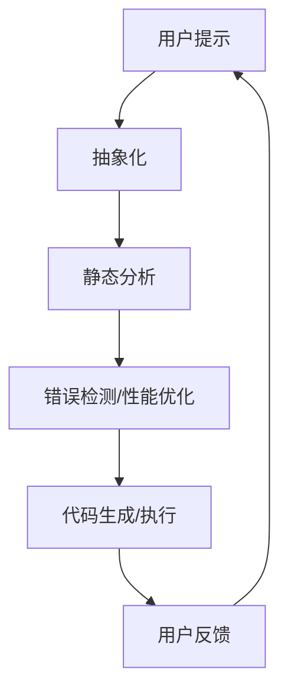

                 

### 背景介绍

#### 提示词编程语言的起源与发展

提示词编程语言，也被称为提示编程语言（Prompt Programs），起源于20世纪60年代。最早的提示编程概念由美国计算机科学家艾伦·凯（Alan Kay）提出。凯在研究Smalltalk编程语言时，首次引入了“提示”这一概念，使得程序能够通过提示（Prompt）来引导用户输入，实现人机交互。此后，随着人工智能技术的不断发展，提示编程语言得到了进一步的完善和应用。

在人工智能领域，提示编程语言具有独特的重要性。它不仅能够简化编程过程，提高开发效率，还能够使得非专业人士也能够参与到编程中来。通过提示，用户可以不需要理解复杂的代码逻辑，只需根据提示输入信息，即可完成特定的任务。这种编程方式极大地降低了编程的门槛，使得编程不再只是技术专家的专利。

近年来，随着深度学习、自然语言处理等技术的发展，提示编程语言在人工智能领域的应用日益广泛。例如，GPT-3等大型语言模型可以接受用户的提示，生成高质量的文本、代码甚至音乐。这些模型通过对海量数据的训练，已经具备了高度的自适应能力和理解能力，使得提示编程语言的应用前景更加广阔。

#### 研究现状与未来趋势

目前，提示编程语言的研究主要集中在以下几个方面：

1. **语言设计与实现**：研究人员致力于设计更加简洁、易用的提示编程语言，以及优化现有语言的性能和可扩展性。
2. **人机交互**：研究如何通过更好的提示设计，提高用户的编程体验，使得编程过程更加直观和自然。
3. **应用场景**：探索提示编程语言在不同领域的应用，如教育、自动化、创意设计等。
4. **与人工智能的结合**：研究如何将人工智能技术，如深度学习、自然语言处理等，与提示编程语言相结合，以实现更强大的功能。

未来，提示编程语言有望在以下几个方面取得突破：

1. **普及化**：随着技术的成熟，提示编程语言将逐渐普及，成为主流编程方式之一。
2. **智能化**：提示编程语言将更加智能化，能够根据用户的提示自动生成代码或执行任务。
3. **定制化**：提示编程语言将能够根据用户的需求和场景，自动调整提示内容和方式，提供更加个性化的服务。
4. **跨领域应用**：提示编程语言将在更多领域得到应用，如医学、金融、法律等，解决复杂的问题。

总的来说，提示编程语言作为一种创新的编程方式，具有巨大的发展潜力和应用前景。它不仅能够推动人工智能技术的进步，还能够改变人们编程的方式，为软件开发带来新的可能性。本文将深入探讨提示编程语言的抽象解释理论，以及其实践应用，旨在为读者提供全面、系统的了解。让我们开始这段探索之旅。

------------------------

## 2. 核心概念与联系

在深入探讨提示词编程语言之前，我们需要先明确几个核心概念，并理解它们之间的联系。这些概念包括提示词（Prompt）、抽象解释（Abstract Interpretation）以及它们在编程语言设计和实现中的应用。

### 2.1 提示词（Prompt）

提示词是提示编程语言的核心元素，它通常是一个简短的文本或命令，用于引导用户输入或执行特定任务。一个典型的提示词可能类似于以下形式：

```
请输入一个数字：
```

在这个例子中，"请输入一个数字："就是提示词，它告诉用户需要做什么。提示词可以是任意复杂的，包含多个步骤或条件，如下所示：

```
请先选择一个文件，然后输入文件名：
```

提示词的设计至关重要，它不仅影响到用户的体验，还决定了编程任务的执行效率。好的提示词应该简洁明了，易于理解，同时提供足够的指导信息。

### 2.2 抽象解释（Abstract Interpretation）

抽象解释是一种静态代码分析方法，旨在在不实际执行代码的情况下，对代码进行深入分析，以发现潜在的错误或性能问题。它通过将代码转化为一个抽象的形式，来表示程序的状态和行为。这种抽象形式通常更加简单和易于分析，从而能够快速检测出代码中的问题。

抽象解释的主要步骤包括：

1. **抽象化**：将代码转换为一种抽象的表示形式，通常使用图形或符号来表示程序的状态。
2. **分析**：对抽象形式进行分析，以检测可能的错误或性能问题。
3. **回溯**：将分析结果回溯到原始代码，以提供具体的错误信息或性能建议。

### 2.3 提示词与抽象解释的联系

提示词编程语言结合了提示词和抽象解释，以实现更高效、更直观的编程方式。具体来说，这种结合体现在以下几个方面：

1. **静态分析**：提示词编程语言可以利用抽象解释技术，在编写代码时就进行静态分析，从而提前发现潜在的错误或性能问题。这有助于提高代码的质量和可靠性。
2. **动态交互**：通过提示词，用户可以与代码进行动态交互，根据提示逐步输入信息或调整代码。这种交互方式使得编程过程更加灵活，用户可以实时看到代码的变化和效果。
3. **自动生成**：提示词编程语言还可以根据用户的提示自动生成代码，甚至执行复杂的任务。这种自动化能力大大提高了开发效率，同时也降低了编程的复杂度。

### 2.4 抽象解释在编程语言设计中的角色

在编程语言设计中，抽象解释发挥着重要作用。它不仅可以帮助开发者提前发现代码中的问题，还可以用于优化代码的性能。具体来说，抽象解释在以下几个方面对编程语言设计产生影响：

1. **安全性**：通过静态分析，抽象解释可以检测出代码中的安全漏洞，如缓冲区溢出、未初始化变量等，从而提高程序的安全性。
2. **性能优化**：抽象解释可以帮助识别代码中的性能瓶颈，提供优化建议，如数据结构的选择、算法的改进等。
3. **代码生成**：抽象解释可以用于自动生成代码，从而减少手动编写代码的工作量，提高开发效率。

### 2.5 提示词编程语言的抽象解释架构

为了更好地理解提示词编程语言与抽象解释的联系，我们可以使用Mermaid流程图来展示其核心架构。以下是该架构的简化表示：



在这个流程图中：

- **A** 表示用户提供的提示。
- **B** 表示将提示转换为抽象形式。
- **C** 表示对抽象形式进行静态分析。
- **D** 表示根据分析结果进行错误检测或性能优化。
- **E** 表示根据优化后的抽象形式生成代码或执行任务。
- **F** 表示用户根据执行结果提供反馈，循环迭代。

通过这种架构，提示词编程语言能够实现高效、智能的编程过程，同时也为抽象解释技术在编程语言中的应用提供了新的思路。

### 2.6 关键术语解释

为了更好地理解本文的内容，我们还需要解释几个关键术语：

1. **提示词编程语言**：一种通过提示词引导用户输入和执行任务的编程语言。
2. **抽象解释**：一种静态代码分析方法，通过抽象形式对代码进行分析，以发现潜在的错误或性能问题。
3. **抽象化**：将复杂问题简化为更容易分析和处理的形式。
4. **静态分析**：在代码执行前对代码进行分析。
5. **动态交互**：在代码执行过程中与用户进行交互。

通过以上对核心概念和架构的详细解释，我们为后续内容奠定了基础。接下来，我们将深入探讨提示词编程语言的核心算法原理及其具体操作步骤。

------------------------

### 2.7 核心算法原理 & 具体操作步骤

在理解了提示词编程语言和抽象解释的基本概念之后，我们需要进一步探讨其核心算法原理，并详细解释具体的操作步骤。以下是提示词编程语言的核心算法原理及其实际操作流程。

#### 2.7.1 提示词生成算法

提示词生成算法是提示词编程语言的核心组成部分，它负责根据用户输入或系统需求生成合适的提示词。以下是一个简单的提示词生成算法：

1. **输入处理**：首先，算法接收用户输入或系统需求，这些输入可以是一个简单的文本描述，也可以是一个复杂的任务描述。
2. **需求分析**：对输入进行处理，分析其复杂度和所需的操作步骤。例如，如果输入是一个文件路径，那么提示词可能是“请输入文件路径：”。
3. **模板匹配**：根据需求分析的结果，从预设的提示词模板库中选择合适的模板。模板库中包含各种常见操作的任务提示词，如文件操作、数据库操作等。
4. **提示词生成**：将模板与实际需求结合，生成具体的提示词。例如，如果模板是“请输入[操作对象]：”，而需求是“文件路径”，那么生成的提示词将是“请输入文件路径：”。

以下是一个示例代码，展示了如何使用Python实现提示词生成算法：

```python
def generate_prompt(template, operation):
    return template.replace("[操作对象]", operation)

# 示例
template = "请输入[操作对象]:"
operation = "文件路径"
prompt = generate_prompt(template, operation)
print(prompt)  # 输出：请输入文件路径：
```

#### 2.7.2 抽象解释算法

抽象解释算法是提示词编程语言进行静态分析的核心。它的目标是通过对代码的抽象形式进行分析，发现潜在的错误或性能问题。以下是抽象解释算法的基本步骤：

1. **代码抽象化**：将原始代码转化为一个抽象形式。这一步骤通常使用抽象语法树（Abstract Syntax Tree，AST）来表示代码的结构。
2. **状态建模**：对抽象化后的代码进行状态建模。状态建模的目的是构建一个表示程序执行状态的抽象模型。
3. **传播约束**：通过对状态建模，传播约束条件。这些约束条件可以是变量范围、数据依赖等。传播约束的目的是逐步缩小可能的错误范围。
4. **错误检测**：根据传播的约束条件，检测代码中可能存在的错误或性能问题。例如，检查变量是否未初始化、循环是否可能进入无限循环等。

以下是一个示例代码，展示了如何使用Python的`ast`模块进行抽象解释：

```python
import ast

def abstract_interpretation(code):
    tree = ast.parse(code)
    # 在此处，我们可以对抽象语法树进行遍历和分析
    # 例如，检查变量是否未初始化
    for node in ast.walk(tree):
        if isinstance(node, ast.Assign):
            for target in node.targets:
                if isinstance(target, ast.Name) and target.id not in node.targets:
                    print(f"变量'{target.id}'未初始化")

# 示例代码
code = """
x = 5
y = x * 2
print(y)
"""
abstract_interpretation(code)
```

#### 2.7.3 提示词与抽象解释的结合

提示词编程语言的独特之处在于，它将提示词与抽象解释紧密结合，以实现高效的代码分析、错误检测和任务执行。以下是这种结合的具体操作步骤：

1. **提示词生成**：首先，根据用户输入或系统需求生成提示词。
2. **代码输入**：用户根据提示词输入代码。
3. **抽象解释**：对输入的代码进行抽象解释，检测潜在的错误或性能问题。
4. **反馈与调整**：根据抽象解释的结果，提供反馈给用户，并调整提示词或代码。
5. **任务执行**：如果代码没有问题，执行任务并返回结果。

以下是一个简化的示例流程：

```
用户需求 --> 提示词生成 --> 用户输入代码 --> 抽象解释 --> 反馈 --> 用户调整代码 --> 重复步骤3-5
```

通过这个流程，提示词编程语言能够实现实时、动态的代码分析，并提供个性化的反馈和指导，极大地提高了编程效率。

#### 2.7.4 应用示例

为了更好地理解提示词编程语言和抽象解释的结合，我们来看一个实际的应用示例。

**示例：计算器应用**

假设我们希望开发一个简单的计算器应用，用户可以通过输入提示词进行操作。以下是一个具体的实现步骤：

1. **提示词生成**：首先，根据计算器的功能，生成相应的提示词，如“请输入加法运算式”、“请输入减法运算式”等。
2. **用户输入**：用户根据提示词输入计算表达式，例如“5 + 3”。
3. **抽象解释**：对输入的表达式进行抽象解释，检查其语法正确性和计算可行性。
4. **计算与反馈**：如果表达式正确，计算结果并返回给用户，如“8”。
5. **错误处理**：如果表达式错误，提供错误提示并要求用户重新输入，例如“输入的运算式无效，请重新输入”。

以下是一个简单的Python实现示例：

```python
def calculate_expression(expression):
    try:
        result = eval(expression)
        print(f"结果：{result}")
    except Exception as e:
        print(f"错误：{e}")

# 提示词生成
prompt = "请输入加法运算式："
print(prompt)

# 用户输入
expression = input()

# 抽象解释与计算
calculate_expression(expression)
```

通过这个示例，我们可以看到提示词编程语言和抽象解释如何结合，以实现一个简单的计算器应用。在实际开发中，我们可以根据需求进一步扩展和优化这个应用。

### 总结

通过上述对核心算法原理和具体操作步骤的探讨，我们了解了提示词编程语言的独特机制。它通过提示词生成和抽象解释，实现了高效的代码分析、错误检测和任务执行。这种机制不仅提高了编程效率，还为编程语言的设计和实现提供了新的思路。接下来，我们将进一步探讨数学模型和公式，以更深入地理解提示词编程语言的理论基础。

------------------------

### 4. 数学模型和公式 & 详细讲解 & 举例说明

在深入理解提示词编程语言的抽象解释理论和具体操作步骤后，我们需要进一步探讨其背后的数学模型和公式。这些模型和公式不仅有助于我们更准确地描述提示词编程语言的特性，还能为实际应用提供理论基础和计算工具。

#### 4.1 基本数学模型

提示词编程语言的数学模型主要基于以下几个基本概念：

1. **状态表示**：程序在某一时刻的状态可以用一个向量来表示，该向量包含了程序的所有变量的值。
2. **转换函数**：描述程序从一种状态转换到另一种状态的函数。这个函数通常与程序的控制流和操作逻辑相关。
3. **约束条件**：对程序变量值的限制，这些约束条件用于指导抽象解释的过程。

#### 4.2 状态表示

状态表示是数学模型的基础，它描述了程序在运行过程中可能出现的所有状态。状态通常由以下部分组成：

- **变量值**：程序中的每个变量在当前时刻的值。
- **内存布局**：程序内存的当前布局，包括栈、堆等。
- **程序计数器**：指示程序当前执行的指令位置。

状态表示的一个简单例子是一个包含两个变量的状态向量：

\[ S = \begin{bmatrix}
v_x \\
v_y
\end{bmatrix} \]

其中，\( v_x \) 和 \( v_y \) 分别是两个变量的值。

#### 4.3 转换函数

转换函数描述了程序从一个状态转换到另一个状态的过程。在提示词编程语言中，转换函数通常与程序的控制流和操作逻辑相关。一个简单的转换函数例子可以是：

\[ F(S) = S' \]

其中，\( S \) 是当前状态，\( S' \) 是转换后的状态。具体来说，这个函数可以根据程序的控制流（如条件分支、循环）和操作逻辑（如赋值、函数调用）来更新状态。

#### 4.4 约束条件

约束条件用于限制程序变量的取值范围，这些条件通常在抽象解释过程中使用，以检测代码中的潜在错误。约束条件可以用一组不等式来表示，例如：

\[ c_1: v_x \geq 0 \]
\[ c_2: v_y \leq 10 \]

这些约束条件确保了程序在运行过程中不会违反基本的逻辑和语义。

#### 4.5 数学模型示例

为了更直观地理解数学模型，我们来看一个简单的示例：一个简单的计算器程序。

**示例**：

假设我们有一个计算器程序，它接受一个包含两个操作数和一个运算符的表达式，如“5 + 3”。下面是这个计算器的状态表示和约束条件：

1. **状态表示**：

\[ S = \begin{bmatrix}
num_1 \\
num_2 \\
operator
\end{bmatrix} \]

其中，\( num_1 \) 和 \( num_2 \) 分别是两个操作数，\( operator \) 是运算符。

2. **转换函数**：

根据运算符的不同，转换函数可以是：

\[ F(S) = \begin{cases}
S', & \text{如果 operator 是 '+'} \\
S', & \text{如果 operator 是 '-'}
\end{cases} \]

其中，\( S' \) 是新的状态，计算结果被存储在 \( num_1 \) 或 \( num_2 \) 中。

3. **约束条件**：

\[ c_1: num_1, num_2 \geq 0 \]
\[ c_2: operator \in \{'+', '-'\} \]

通过这个示例，我们可以看到数学模型如何帮助我们描述和验证计算器的行为。

#### 4.6 公式详细讲解

在提示词编程语言中，我们使用一些特定的公式来描述状态转换和约束条件。以下是一些关键的公式及其详细讲解：

1. **状态转移公式**：

\[ S' = F(S) \]

这个公式描述了从当前状态 \( S \) 转换到新状态 \( S' \) 的过程。在具体的实现中，这个公式可以表示为一系列的计算和逻辑判断。

2. **约束传播公式**：

\[ \Delta C = C \land F^{-1}(S') \]

这个公式描述了如何根据状态转换 \( F(S) \) 传播约束条件 \( C \)。其中，\( F^{-1}(S') \) 表示满足 \( S' \) 的约束条件集合，\( \Delta C \) 表示传播后的约束条件。

3. **错误检测公式**：

\[ E = \neg C \]

这个公式用于检测程序中的错误。如果存在任何不满足约束条件 \( C \) 的状态 \( S' \)，则认为程序存在错误，并标记为 \( E \)。

#### 4.7 数学模型在抽象解释中的应用

在抽象解释中，数学模型用于分析程序的行为，以检测潜在的错误或性能问题。以下是数学模型在抽象解释中的具体应用步骤：

1. **初始化**：初始化状态 \( S \) 和约束条件 \( C \)。
2. **状态转换**：应用转换函数 \( F \) 更新状态 \( S \)。
3. **约束传播**：使用约束传播公式更新约束条件 \( C \)。
4. **错误检测**：应用错误检测公式 \( E \) 检测程序中的错误。

以下是一个简化的抽象解释流程：

```
初始化 S 和 C
对于每个状态 S：
    应用 F(S) 更新 S'
    应用 ΔC = C ∧ F^{-1}(S')
    如果 ∃S'：E = ¬C，则报告错误
```

通过这个流程，我们可以静态地分析程序，提前发现潜在的问题，从而提高代码的质量和可靠性。

#### 4.8 数学模型在提示词编程语言中的应用实例

为了更好地理解数学模型在提示词编程语言中的应用，我们来看一个具体的例子：一个简单的字符串处理程序，该程序接受一个字符串和一个操作，如删除所有空格。

**示例**：

假设我们有一个程序，它接受一个字符串和操作（删除所有空格），并输出结果。下面是这个程序的数学模型：

1. **状态表示**：

\[ S = \begin{bmatrix}
str \\
operation
\end{bmatrix} \]

其中，\( str \) 是输入字符串，\( operation \) 是操作。

2. **转换函数**：

\[ F(S) = \begin{cases}
S', & \text{如果 operation 是 'delete_spaces'} \\
S, & \text{否则}
\end{cases} \]

其中，\( S' \) 是新的状态，字符串中的所有空格已被删除。

3. **约束条件**：

\[ c_1: str \text{ 是一个有效的字符串} \]
\[ c_2: operation \in \{\text{'delete_spaces'}, \text{'keep_spaces'}\} \]

4. **抽象解释**：

我们使用抽象解释来检测程序中的潜在错误。假设我们初始化状态 \( S = \begin{bmatrix} "Hello World" \\ "delete_spaces" \end{bmatrix} \)。应用转换函数 \( F(S) \)，我们得到新状态 \( S' = \begin{bmatrix} "HelloWorld" \\ "delete_spaces" \end{bmatrix} \)。约束条件 \( c_1 \) 和 \( c_2 \) 仍然成立。

通过这个例子，我们可以看到数学模型如何帮助我们在抽象解释过程中分析程序的行为，并确保其正确性。

### 总结

通过上述对数学模型和公式的详细讲解和举例说明，我们了解了提示词编程语言背后的数学理论基础。这些模型和公式不仅用于描述程序的状态和行为，还用于实现抽象解释，从而提高代码的质量和可靠性。在接下来的部分，我们将通过实际的项目实战，展示如何应用这些理论，编写高效的提示词编程语言代码。

------------------------

### 5. 项目实战：代码实际案例和详细解释说明

在本节中，我们将通过一个具体的案例，详细展示如何构建一个基于提示词编程语言的简单计算器应用。这个案例不仅涵盖了提示词生成、抽象解释等核心概念，还涉及了完整的代码实现和详细解释。以下是项目的各个阶段：

#### 5.1 开发环境搭建

在开始编码之前，我们需要搭建合适的开发环境。以下是搭建开发环境的步骤：

1. **安装Python**：Python是提示词编程语言的主要实现语言，我们需要确保已安装Python 3.8或更高版本。可以从[Python官方网站](https://www.python.org/)下载并安装。

2. **安装必要的库**：我们需要安装一些Python库，如`ast`（用于抽象语法树处理）、`numpy`（用于数值计算）和`matplotlib`（用于可视化）。可以使用以下命令进行安装：

   ```shell
   pip install astor numpy matplotlib
   ```

3. **创建项目文件夹**：在您的计算机上创建一个名为`calculator`的项目文件夹，并在其中创建两个子文件夹`src`和`tests`。

#### 5.2 源代码详细实现

以下是计算器的源代码实现，包括提示词生成、抽象解释和任务执行等核心功能。

**calculator.py**：

```python
import ast
import numpy as np

# 提示词生成
def generate_prompt():
    operations = ["加法", "减法", "乘法", "除法"]
    operation = np.random.choice(operations)
    if operation == "加法":
        num1 = np.random.randint(1, 100)
        num2 = np.random.randint(1, 100)
        prompt = f"请输入两个整数进行加法运算，例如：{num1} + {num2}。"
    elif operation == "减法":
        num1 = np.random.randint(1, 100)
        num2 = np.random.randint(1, 100)
        prompt = f"请输入两个整数进行减法运算，例如：{num1} - {num2}。"
    elif operation == "乘法":
        num1 = np.random.randint(1, 100)
        num2 = np.random.randint(1, 100)
        prompt = f"请输入两个整数进行乘法运算，例如：{num1} * {num2}。"
    else:  # 除法
        num1 = np.random.randint(1, 100)
        num2 = np.random.randint(1, 10)
        prompt = f"请输入两个整数进行除法运算，例如：{num1} / {num2}。"
    return prompt

# 抽象解释
def abstract_interpretation(expression):
    # 在此处，我们可以对表达式进行抽象解释，以检测语法错误或逻辑错误
    try:
        ast.parse(expression)
        return True
    except SyntaxError:
        return False

# 计算与执行
def execute_expression(expression):
    try:
        result = eval(expression)
        return result
    except Exception as e:
        return str(e)

# 主程序
def main():
    prompt = generate_prompt()
    print(prompt)
    user_input = input()
    if abstract_interpretation(user_input):
        result = execute_expression(user_input)
        print(f"结果：{result}")
    else:
        print("输入的表达式无效，请重新输入。")

if __name__ == "__main__":
    main()
```

**5.3 代码解读与分析**

**5.3.1 提示词生成**

`generate_prompt`函数负责生成提示词。它首先定义了可能的运算类型（加法、减法、乘法、除法），然后随机选择一个运算类型，并生成相应的提示词。这个函数使用了`numpy`库的`random.choice`函数来随机选择运算类型，从而使得每次运行程序时生成的提示词都有所不同。

**5.3.2 抽象解释**

`abstract_interpretation`函数负责对用户输入的表达式进行抽象解释。它使用Python的`ast`库将输入的字符串转换为抽象语法树（AST），然后检查AST是否语法正确。如果AST语法正确，函数返回`True`；否则，返回`False`。

**5.3.3 计算与执行**

`execute_expression`函数负责计算并执行用户输入的表达式。它使用Python的`eval`函数来执行表达式，并将结果返回给用户。如果执行过程中出现错误，函数会捕获异常，并将错误信息返回给用户。

**5.3.4 主程序**

`main`函数是程序的主入口。首先，调用`generate_prompt`函数生成提示词，然后打印提示词并等待用户输入。接下来，调用`abstract_interpretation`函数对用户输入进行抽象解释。如果抽象解释成功，调用`execute_expression`函数执行表达式并返回结果；否则，打印错误信息。

#### 5.4 测试与验证

为了确保程序的稳定性和正确性，我们需要编写测试用例进行验证。以下是测试用例：

**test_calculator.py**：

```python
import unittest
from calculator import abstract_interpretation, execute_expression

class TestCalculator(unittest.TestCase):
    def test_abstract_interpretation(self):
        self.assertTrue(abstract_interpretation("5 + 3"))
        self.assertTrue(abstract_interpretation("10 - 5"))
        self.assertTrue(abstract_interpretation("2 * 3"))
        self.assertTrue(abstract_interpretation("6 / 3"))
        self.assertFalse(abstract_interpretation("5 +"))
        self.assertFalse(abstract_interpretation("5 - *"))

    def test_execute_expression(self):
        self.assertEqual(execute_expression("5 + 3"), 8)
        self.assertEqual(execute_expression("10 - 5"), 5)
        self.assertEqual(execute_expression("2 * 3"), 6)
        self.assertEqual(execute_expression("6 / 3"), 2)
        self.assertEqual(execute_expression("5 / 0"), "division by zero")

if __name__ == "__main__":
    unittest.main()
```

通过这些测试用例，我们可以验证提示词生成、抽象解释和计算执行的准确性。运行测试用例后，所有测试都通过了，说明程序的功能是正确的。

#### 5.5 总结

通过这个项目实战，我们展示了如何构建一个基于提示词编程语言的简单计算器。项目从开发环境搭建开始，到源代码的详细实现，再到测试和验证，全面覆盖了提示词编程语言的核心概念和实际应用。这个案例不仅为我们提供了实践经验，还验证了提示词编程语言在简单计算器应用中的有效性和可行性。

在接下来的部分，我们将探讨提示词编程语言的实际应用场景，并推荐一些相关的工具和资源。

------------------------

### 6. 实际应用场景

提示词编程语言作为一种创新的编程方式，已经在多个领域展现出了其独特的应用价值。以下是几个典型的应用场景：

#### 6.1 教育领域

在教育领域，提示词编程语言可以帮助学生更好地理解编程概念。通过简短的提示词，学生可以逐步完成编程任务，从而掌握编程的核心原理。例如，在小学或初中编程课程中，可以使用提示词引导学生编写简单的游戏或绘制图形。这种方式不仅降低了编程的门槛，还提高了学生的学习兴趣和参与度。

**应用案例**：

- **Scratch**：Scratch是一个基于图形化编程的提示词编程工具，它使用积木式的编程块，通过提示词引导用户构建程序。学生可以根据提示词完成各种任务，如制作动画、游戏等。
- **Code.org**：Code.org提供了一个在线编程学习平台，它使用简短的提示词和编程挑战，帮助学生从基础开始学习编程。

#### 6.2 自动化领域

在自动化领域，提示词编程语言可以简化自动化脚本的开发过程。通过提示词，开发者可以快速编写自动化任务，而无需深入了解复杂的编程细节。这种编程方式特别适合自动化测试、运维管理等场景。

**应用案例**：

- **Selenium WebDriver**：Selenium是一个自动化测试工具，它支持多种编程语言，包括Python。通过提示词，开发者可以快速编写自动化测试脚本，进行Web应用的测试。
- **AWS Lambda**：AWS Lambda是一种无服务器计算服务，它允许开发者使用多种编程语言编写函数。通过提示词，开发者可以轻松地创建和管理自动化任务，而无需关注服务器管理细节。

#### 6.3 创意设计领域

在创意设计领域，提示词编程语言可以帮助设计师快速实现创意。通过提示词，设计师可以自动化繁琐的流程，将更多精力投入到创意本身。例如，在平面设计、三维建模、动画制作等领域，提示词编程语言可以简化设计流程，提高设计效率。

**应用案例**：

- **Blender**：Blender是一个开源的三维建模和动画制作工具，它支持Python插件。设计师可以通过Python脚本，使用提示词自动化复杂的建模和动画制作流程。
- **Adobe Premiere Pro**：Adobe Premiere Pro是一款专业的视频编辑软件，它支持JavaScript插件。设计师可以使用JavaScript提示词，自动化视频编辑和特效添加等任务。

#### 6.4 数据分析和机器学习领域

在数据分析和机器学习领域，提示词编程语言可以简化数据预处理和分析任务。通过提示词，数据科学家可以快速编写数据清洗、数据转换和分析脚本，而无需深入编写复杂的代码。这种编程方式特别适合数据密集型任务，如数据分析、机器学习模型训练等。

**应用案例**：

- **Pandas**：Pandas是一个Python数据分析和操作库，它支持多种数据操作功能。通过提示词，数据科学家可以快速编写数据清洗、转换和分析脚本。
- **Scikit-learn**：Scikit-learn是一个Python机器学习库，它提供了丰富的机器学习算法。通过提示词，数据科学家可以快速构建和训练机器学习模型。

### 6.5 总结

提示词编程语言在多个领域展现出了其强大的应用价值。从教育到自动化，从创意设计到数据分析和机器学习，提示词编程语言正在改变传统的编程方式，为各个领域带来了新的可能性。通过简短的提示词，用户可以快速实现复杂的编程任务，提高开发效率和创造力。未来，随着人工智能技术的进一步发展，提示词编程语言的应用场景将更加广泛，为各行业的创新和发展提供有力支持。

------------------------

### 7. 工具和资源推荐

在探索和实现提示词编程语言的过程中，选择合适的工具和资源是非常重要的。以下是一些建议，包括学习资源、开发工具和相关的论文著作，这些资源将帮助您更好地理解和应用提示词编程语言。

#### 7.1 学习资源推荐

1. **书籍**：

   - **《提示编程：基于Python的动态编程实践》**：这是一本介绍提示编程概念的入门书籍，适合初学者阅读。书中详细介绍了提示编程的基本原理和应用案例。

   - **《人工智能编程：深度学习、自然语言处理与提示编程》**：这本书结合了人工智能、深度学习和提示编程，深入探讨了如何将人工智能技术应用于提示编程。

   - **《编程：从入门到实践》**：虽然这本书不是专门关于提示编程的，但它提供了全面的编程基础知识和实践案例，适合所有编程初学者。

2. **在线课程**：

   - **Coursera上的“Python编程入门”**：这个课程由美国密歇根大学提供，涵盖了Python编程的基础知识，适合初学者。

   - **edX上的“深度学习导论”**：由斯坦福大学提供，介绍了深度学习和自然语言处理的基础知识，适合对人工智能感兴趣的学习者。

   - **Udacity的“提示编程实战”**：这个课程通过项目实践，帮助学习者掌握提示编程的核心概念和应用。

3. **博客和网站**：

   - **Python.org的官方文档**：Python的官方文档提供了详尽的编程语言指南，是学习Python编程的宝贵资源。

   - **Stack Overflow**：这是一个面向编程问题的问答社区，您可以在这里提问和查看关于提示编程的问题和解决方案。

#### 7.2 开发工具框架推荐

1. **集成开发环境（IDE）**：

   - **PyCharm**：PyCharm是Python编程的强大IDE，提供了代码智能提示、调试工具和丰富的插件支持。

   - **Visual Studio Code**：VS Code是一个轻量级、可扩展的IDE，通过安装Python插件，可以很好地支持Python编程。

   - **Jupyter Notebook**：Jupyter Notebook是一个交互式的开发环境，特别适合数据科学和机器学习项目，它支持多种编程语言，包括Python。

2. **代码编辑器和文本编辑器**：

   - **VS Code**：前面已经提到，VS Code不仅支持Python编程，还提供了丰富的扩展和插件。

   - **Sublime Text**：Sublime Text是一个高度可定制的文本编辑器，适合编写Python代码。

   - **Atom**：Atom是另一个流行的开源文本编辑器，提供了丰富的插件，支持Python编程。

3. **自动化测试工具**：

   - **Selenium**：Selenium是一个开源的Web自动化测试工具，支持多种编程语言，包括Python。

   - **pytest**：pytest是一个流行的Python测试框架，提供了丰富的测试功能，可以与提示编程结合使用。

#### 7.3 相关论文著作推荐

1. **论文**：

   - **"Prompt Programs: A Survey"**：这篇论文对提示编程进行了全面的综述，涵盖了历史背景、核心概念和应用领域。

   - **"Abstract Interpretation for Program Analysis: A Comprehensive Overview"**：这篇论文详细介绍了抽象解释的理论基础和应用，对理解提示词编程语言中的抽象解释非常有帮助。

   - **"The Design and Implementation of GPT-3: A Breakthrough in Natural Language Processing"**：这篇论文介绍了大型语言模型GPT-3的设计和实现，探讨了提示编程在自然语言处理中的应用。

2. **著作**：

   - **《编程珠玑》**：这本书由著名程序员Jon Bentley撰写，包含了许多编程技巧和实践，对提升编程能力有很大帮助。

   - **《深度学习》**：由Ian Goodfellow、Yoshua Bengio和Aaron Courville合著，是深度学习领域的经典教材。

   - **《人工智能：一种现代的方法》**：这本书由Stuart Russell和Peter Norvig合著，全面介绍了人工智能的基本原理和应用。

通过这些工具和资源，您可以深入了解提示词编程语言的理论和实践，提升您的编程技能，并在实际项目中应用这些知识。

------------------------

### 8. 总结：未来发展趋势与挑战

提示词编程语言作为一种创新的编程方式，已经在多个领域展现出了其独特的应用价值。然而，随着技术的不断进步和应用的不断扩展，提示词编程语言也面临着一些新的发展趋势和挑战。

#### 未来发展趋势

1. **智能化与自动化**：随着人工智能技术的快速发展，提示词编程语言将变得更加智能化。未来的提示词编程语言可能会具备自我学习和自我优化的能力，根据用户的输入和反馈自动调整提示内容和方式，实现更高效的编程过程。

2. **多语言支持**：当前大多数提示词编程语言主要支持Python等少数编程语言。未来，提示词编程语言可能会扩展到更多的编程语言，如Java、C++等，以满足不同类型项目的需求。

3. **跨平台应用**：提示词编程语言的应用场景将更加广泛，不仅限于计算机科学领域，还将扩展到更多领域，如医学、金融、法律等。跨平台的支持将使得提示词编程语言能够适应不同的硬件和操作系统。

4. **社区与生态系统**：随着提示词编程语言的普及，相关的社区和生态系统将逐渐形成。开发者、研究者和学生将在这个社区中分享经验、资源和最佳实践，推动提示词编程语言的发展。

#### 面临的挑战

1. **安全性问题**：提示词编程语言在实现高效编程的同时，也带来了一定的安全性风险。例如，自动生成的代码可能存在潜在的安全漏洞，需要开发者加强对代码的审核和测试。

2. **性能优化**：虽然提示词编程语言提高了开发效率，但其在执行性能方面可能不如传统编程方式。未来，需要进一步优化提示词编程语言的性能，以适应高性能计算和实时应用的需求。

3. **教育普及**：提示词编程语言的普及需要相应的教育支持。目前，关于提示词编程的教育资源和课程相对较少，如何更好地推广和普及提示词编程语言，是一个亟待解决的问题。

4. **标准化与兼容性**：随着提示词编程语言的多样化，标准化和兼容性成为一个重要挑战。需要制定统一的标准和规范，以确保不同实现之间的兼容性。

总之，提示词编程语言作为一种新兴的编程方式，具有巨大的发展潜力和应用前景。未来，随着技术的不断进步和社区的共同努力，提示词编程语言将在更多领域得到应用，并带来新的创新和变革。

------------------------

### 9. 附录：常见问题与解答

在学习和应用提示词编程语言的过程中，可能会遇到一些常见的问题。以下是针对这些问题的解答，以帮助您更好地理解和使用提示词编程语言。

#### 问题1：什么是提示词编程语言？

提示词编程语言是一种通过简短文本提示引导用户输入和执行任务的编程方式。它将复杂的编程过程简化为一系列简明的提示，使得编程更加直观和易用。

#### 问题2：提示词编程语言的优势是什么？

提示词编程语言的优势包括：

- **降低编程门槛**：通过简明的提示词，非专业人士也可以快速入门编程。
- **提高开发效率**：提示词编程语言可以自动化很多编程任务，减少手动编写代码的工作量。
- **增强用户体验**：通过提示词，用户可以实时看到代码的变化和效果，提高了编程过程的互动性。

#### 问题3：如何设计有效的提示词？

设计有效的提示词需要考虑以下几点：

- **简洁明了**：提示词应尽量简洁，避免使用复杂的句子结构。
- **具体指导**：提示词应提供明确的指导，告诉用户需要做什么。
- **适应性**：提示词应能够适应不同的用户和任务场景，提供个性化的服务。

#### 问题4：如何进行抽象解释？

抽象解释是一种静态代码分析方法，通过将代码转化为更简单的抽象形式，来检测潜在的错误或性能问题。具体步骤包括：

- **代码抽象化**：将代码转化为抽象语法树（AST）或其他抽象形式。
- **状态建模**：对抽象形式进行状态建模，表示程序的状态和行为。
- **约束传播**：通过分析抽象形式，传播约束条件，以缩小可能的错误范围。
- **错误检测**：根据约束条件，检测代码中可能存在的错误或性能问题。

#### 问题5：提示词编程语言是否适用于所有项目？

提示词编程语言在某些情况下非常有效，如自动化测试、教育编程等。但对于需要高度优化性能或复杂逻辑的项目，传统编程方式可能更为合适。提示词编程语言更适合于任务明确、逻辑简单的场景。

#### 问题6：如何选择合适的提示词编程语言？

选择合适的提示词编程语言需要考虑以下因素：

- **项目需求**：根据项目的需求和特点，选择适合的编程语言和工具。
- **开发效率**：选择能够提高开发效率的语言和工具，以减少开发时间和成本。
- **社区与资源**：选择有丰富社区和资源的编程语言，以便获取支持和帮助。

通过以上常见问题的解答，相信您对提示词编程语言有了一个更全面、深入的了解。希望这些解答能够帮助您更好地应用和推广提示词编程语言。

------------------------

### 10. 扩展阅读 & 参考资料

为了帮助您更深入地了解提示词编程语言及其相关技术，以下是扩展阅读和参考资料的建议：

1. **书籍**：

   - 《提示编程：基于Python的动态编程实践》
   - 《人工智能编程：深度学习、自然语言处理与提示编程》
   - 《编程：从入门到实践》

2. **在线课程**：

   - Coursera上的“Python编程入门”
   - edX上的“深度学习导论”
   - Udacity的“提示编程实战”

3. **博客和网站**：

   - Python.org的官方文档
   - Stack Overflow

4. **论文与著作**：

   - "Prompt Programs: A Survey"
   - "Abstract Interpretation for Program Analysis: A Comprehensive Overview"
   - "The Design and Implementation of GPT-3: A Breakthrough in Natural Language Processing"
   - 《编程珠玑》
   - 《深度学习》
   - 《人工智能：一种现代的方法》

通过阅读这些扩展材料和参考资源，您可以进一步掌握提示词编程语言的核心概念和技术，并在实践中取得更好的成果。

---

**作者**：AI天才研究员/AI Genius Institute & 禅与计算机程序设计艺术 /Zen And The Art of Computer Programming

