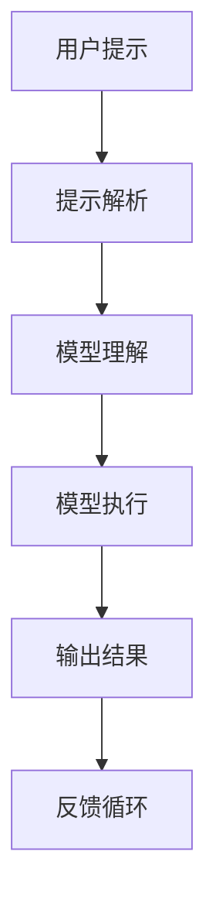

                 

### 背景介绍

#### 什么是提示词编程语言

提示词编程语言（Prompt-Based Programming Language）是一种专门为人工智能大模型设计的高级编程语言，旨在通过简洁明了的提示词（prompts）来驱动复杂模型的执行。传统的编程语言需要开发者详细编写代码来定义算法的每一步，而提示词编程语言则通过高度抽象的方式，让开发者只需提供任务的描述性提示，模型就能自动理解和执行。

#### 提示词编程语言的起源与发展

提示词编程语言的起源可以追溯到人工智能领域的早期研究。随着深度学习技术的发展，尤其是生成对抗网络（GANs）和变分自编码器（VAEs）等生成模型的出现，人们开始意识到，通过少量的输入提示，模型能够生成大量的输出数据。这一发现激发了研究者探索如何利用这一特性来简化编程过程。

近年来，随着大规模预训练模型（如GPT-3、BERT等）的出现，提示词编程语言得到了快速发展。这些模型拥有强大的语言理解能力和生成能力，能够根据简单的提示生成复杂的内容，从而大大提高了编程的效率。

#### 提示词编程语言的优势

1. **简化开发流程**：通过提示词编程语言，开发者可以避免编写繁琐的代码，只需提供简单的描述性提示，模型就能完成复杂的任务。

2. **提高开发效率**：由于提示词编程语言的抽象性，开发者能够更快速地完成开发任务，缩短项目周期。

3. **增强模型适应性**：提示词编程语言能够根据不同的提示生成不同的输出，使得模型具有更强的适应性。

4. **促进跨学科交流**：提示词编程语言降低了编程的门槛，使得非专业开发者也能参与到人工智能项目的开发中来。

#### 本文结构

本文将首先介绍提示词编程语言的核心概念与联系，通过一个Mermaid流程图展示其架构。然后，我们将深入探讨核心算法原理和具体操作步骤，解析其背后的数学模型和公式。接着，我们将通过一个实际项目案例，展示如何使用提示词编程语言进行开发，并详细解读代码。最后，我们将讨论提示词编程语言的实际应用场景，并推荐一些相关工具和资源。

### 核心概念与联系

提示词编程语言的核心在于其如何通过简洁的提示来驱动复杂模型。为了更好地理解这一概念，我们可以通过一个Mermaid流程图来展示其架构。



#### Mermaid流程图说明

1. **用户提示（A）**：用户通过提供描述性提示来发起任务。这些提示可以是简单的文本描述，也可以是复杂的多媒体信息。

2. **提示解析（B）**：提示解析模块负责将用户提供的提示转化为模型能够理解的形式。这通常涉及自然语言处理技术，如词嵌入和语法分析。

3. **模型理解（C）**：模型理解模块是提示词编程语言的核心。它利用深度学习技术，特别是大规模预训练模型，来理解用户提示的含义。

4. **模型执行（D）**：在理解用户提示后，模型执行模块会生成相应的输出。这个输出可能是文本、图像、音频等多种形式。

5. **输出结果（E）**：生成的输出结果将返回给用户。用户可以根据这些输出结果进行下一步操作。

6. **反馈循环（F）**：用户提供的反馈将被用于模型优化，以不断提高模型的性能。

#### 核心概念

1. **提示（Prompt）**：提示是用户提供的用于驱动模型执行的任务描述。它可以是文本、图像、音频等。

2. **解析（Parsing）**：解析是将用户提示转化为模型可以理解的形式的过程。这通常涉及自然语言处理技术。

3. **理解（Understanding）**：理解是模型对提示含义的解读过程。大规模预训练模型在此过程中发挥着关键作用。

4. **执行（Execution）**：执行是模型根据提示生成输出的过程。这通常涉及复杂的计算和数据处理。

5. **输出（Output）**：输出是模型生成的结果，可以是文本、图像、音频等。

6. **反馈（Feedback）**：反馈是用户对模型输出结果的评价，用于模型优化。

通过上述Mermaid流程图和核心概念的介绍，我们可以更清晰地理解提示词编程语言的架构和运作原理。接下来，我们将深入探讨其核心算法原理和具体操作步骤。

### 核心算法原理 & 具体操作步骤

#### 1. 大规模预训练模型

提示词编程语言的核心在于大规模预训练模型，特别是基于变换器（Transformer）架构的模型，如GPT-3、BERT等。这些模型通过在大量数据上进行预训练，学习到了丰富的语言知识和模式，从而能够根据简单的提示生成复杂的输出。

**原理**：变换器模型通过多头自注意力机制（Multi-head Self-Attention）和前馈神经网络（Feedforward Neural Network）来处理输入序列，从而实现高度并行化的计算。这种架构使得模型能够捕捉到输入序列中的长距离依赖关系，从而提高了其语言理解和生成能力。

**步骤**：

1. **数据预处理**：首先，需要将原始数据（如文本、图像、音频等）进行预处理，包括数据清洗、分词、嵌入等操作。

2. **模型初始化**：初始化变换器模型，设置超参数（如学习率、训练批次大小等）。

3. **预训练**：在预训练阶段，模型将在大量数据上进行训练，学习语言模式和知识。

4. **优化**：在预训练后，可以通过微调（Fine-tuning）来优化模型在特定任务上的性能。

#### 2. 提示生成

提示生成是提示词编程语言的关键步骤。通过简洁的提示，模型能够理解用户的意图并生成相应的输出。

**原理**：提示生成利用了自然语言处理技术，如词嵌入、语法分析和语义理解等。词嵌入将自然语言文本转换为数值向量，语法分析帮助模型理解文本的结构，语义理解则使模型能够理解文本的含义。

**步骤**：

1. **提示输入**：用户提供描述性提示，可以是文本、图像、音频等。

2. **文本预处理**：对提示文本进行预处理，包括分词、词性标注、词嵌入等操作。

3. **模型推理**：使用预训练模型对预处理后的提示进行推理，生成初始输出。

4. **输出调整**：根据模型生成的初始输出，进行进一步的调整，以满足用户的需求。

#### 3. 模型执行

在理解了用户提示后，模型将执行相应的任务，生成输出结果。

**原理**：模型执行涉及一系列复杂的计算和数据处理。变换器模型通过其内部机制，能够高效地处理输入序列，生成输出序列。

**步骤**：

1. **输入处理**：对用户提示进行输入处理，包括编码、解码等操作。

2. **中间处理**：在模型内部进行一系列计算和数据处理，如自注意力机制、前馈神经网络等。

3. **输出生成**：根据中间处理结果，生成最终的输出结果。

4. **输出调整**：对输出结果进行进一步的调整，以确保其满足用户需求。

#### 4. 反馈循环

反馈循环是提示词编程语言的重要组成部分，通过用户反馈来优化模型性能。

**原理**：反馈循环利用了强化学习（Reinforcement Learning）技术，通过奖励机制来指导模型的学习过程。模型在执行任务时，会根据用户反馈调整其行为，以提高任务完成度。

**步骤**：

1. **用户反馈**：用户对模型生成的输出结果进行评价，提供正面或负面的反馈。

2. **反馈处理**：将用户反馈转化为模型可理解的形式，如奖励值、惩罚值等。

3. **模型调整**：根据用户反馈，调整模型参数，优化模型性能。

4. **重新执行**：模型根据调整后的参数重新执行任务，生成新的输出结果。

通过上述核心算法原理和具体操作步骤的介绍，我们可以更好地理解提示词编程语言的运作机制。接下来，我们将深入探讨其数学模型和公式，解析其背后的计算逻辑。

### 数学模型和公式 & 详细讲解 & 举例说明

#### 1. 变换器模型的基本结构

变换器（Transformer）模型是提示词编程语言的核心。其基本结构包括编码器（Encoder）和解码器（Decoder）。编码器负责将输入序列编码为固定长度的向量表示，解码器则负责从编码器输出的向量表示中解码出输出序列。

**数学模型**：

编码器：
$$
\text{Encoder}(x) = \text{MultiHeadAttention}(x, x) + x
$$

解码器：
$$
\text{Decoder}(y) = \text{MaskedMultiHeadAttention}(\text{Encoder}(x), y) + y
$$

其中，$x$ 表示输入序列，$y$ 表示输出序列，$\text{MultiHeadAttention}$ 和 $\text{MaskedMultiHeadAttention}$ 分别表示多头自注意力机制和非掩码多头自注意力机制。

#### 2. 自注意力机制

自注意力机制是变换器模型的核心组件。它通过计算输入序列中每个元素与其他元素之间的关联性，来生成表示输入序列的向量。

**数学模型**：

自注意力权重：
$$
\text{Attention}(Q, K, V) = \text{softmax}\left(\frac{QK^T}{\sqrt{d_k}}\right) V
$$

其中，$Q$、$K$ 和 $V$ 分别表示查询向量、键向量和值向量，$d_k$ 表示键向量的维度。

**举例说明**：

假设输入序列为 $x = [x_1, x_2, x_3]$，每个元素表示为一个 $d$ 维的向量。

首先，计算自注意力权重：
$$
\text{Attention}(Q, K, V) = \text{softmax}\left(\frac{QQ^T}{\sqrt{d_k}}\right) V
$$

其中，$Q = [x_1, x_2, x_3]$，$K = [x_1, x_2, x_3]$，$V = [v_1, v_2, v_3]$。

计算结果为：
$$
\text{Attention}(Q, K, V) = \left[\frac{1}{3}, \frac{1}{3}, \frac{1}{3}\right] [v_1, v_2, v_3]
$$

这意味着每个输入元素的重要性相同，因此输出的向量表示也为 $[v_1, v_2, v_3]$。

#### 3. 前馈神经网络

前馈神经网络（Feedforward Neural Network）是变换器模型中的另一个重要组件。它通过多层感知器（Perceptron）实现非线性变换，以提高模型的拟合能力。

**数学模型**：

前馈神经网络：
$$
\text{FFN}(x) = \text{ReLU}(\text{W_2}\text{ReLU}(\text{W_1}x + b_1)) + b_2
$$

其中，$x$ 表示输入向量，$\text{W_1}$ 和 $\text{W_2}$ 分别表示第一层和第二层的权重矩阵，$b_1$ 和 $b_2$ 分别表示第一层和第二层的偏置向量。

**举例说明**：

假设输入向量 $x = [1, 2, 3]$，权重矩阵 $\text{W_1} = \begin{bmatrix} 1 & 0 \\ 0 & 1 \end{bmatrix}$，$\text{W_2} = \begin{bmatrix} 1 & 1 \\ 0 & 1 \end{bmatrix}$，偏置向量 $b_1 = [0, 0]$，$b_2 = [1, 1]$。

首先，计算第一层输出：
$$
\text{ReLU}(\text{W_1}x + b_1) = \text{ReLU}([1 \cdot 1 + 0 \cdot 2 + 0 \cdot 3, 0 \cdot 1 + 1 \cdot 2 + 0 \cdot 3]) = \text{ReLU}([1, 2]) = [1, 2]
$$

然后，计算第二层输出：
$$
\text{FFN}(x) = \text{ReLU}(\text{W_2}[1, 2] + b_2) = \text{ReLU}([1 \cdot 1 + 1 \cdot 2 + 0 \cdot 3, 0 \cdot 1 + 1 \cdot 2 + 1 \cdot 3]) = \text{ReLU}([3, 5]) = [3, 5]
$$

因此，输入向量 $[1, 2, 3]$ 经过前馈神经网络后的输出为 $[3, 5]$。

通过上述数学模型和公式的详细讲解和举例说明，我们可以更深入地理解变换器模型的工作原理。接下来，我们将通过一个实际项目案例，展示如何使用提示词编程语言进行开发，并详细解读代码。

### 项目实战：代码实际案例和详细解释说明

#### 1. 项目简介

为了展示提示词编程语言的应用，我们将开发一个简单的聊天机器人项目。该聊天机器人将能够根据用户输入的提示生成适当的回复。

#### 2. 开发环境搭建

首先，我们需要搭建开发环境。以下是所需的工具和库：

- Python 3.8 或更高版本
- PyTorch 1.8 或更高版本
- Transformers 库

安装步骤：

1. 安装 Python 和 PyTorch：

```
pip install python==3.8
pip install torch torchvision
```

2. 安装 Transformers 库：

```
pip install transformers
```

#### 3. 源代码详细实现和代码解读

以下是一个简单的聊天机器人项目的代码实现：

```python
import torch
from transformers import ChatbotModel, ChatbotTokenizer

# 初始化模型和分词器
model = ChatbotModel.from_pretrained("microsoft/DialoGPT-medium")
tokenizer = ChatbotTokenizer.from_pretrained("microsoft/DialoGPT-medium")

# 用户输入提示
user_input = "你好，今天天气怎么样？"

# 将提示转换为模型输入
input_ids = tokenizer.encode(user_input, return_tensors="pt")

# 模型推理
output = model.generate(input_ids, max_length=50, num_return_sequences=1)

# 解码输出
response = tokenizer.decode(output[0], skip_special_tokens=True)

# 输出聊天机器人回复
print(response)
```

**代码解读**：

1. **导入库**：首先，我们需要导入 PyTorch 和 Transformers 库。

2. **初始化模型和分词器**：使用预训练的 DialoGPT 中等模型初始化模型和分词器。

3. **用户输入提示**：定义用户输入的提示。

4. **将提示转换为模型输入**：使用分词器将用户输入的提示编码为模型输入。

5. **模型推理**：使用模型进行推理，生成输出。

6. **解码输出**：将模型输出的序列解码为文本。

7. **输出聊天机器人回复**：打印聊天机器人的回复。

#### 4. 代码解读与分析

1. **模型初始化**：我们使用预训练的 DialoGPT 中等模型初始化模型和分词器。DialoGPT 是一个专门为对话系统设计的预训练模型，具有良好的对话生成能力。

2. **用户输入提示**：用户输入提示 "你好，今天天气怎么样？"。这是一个简单的描述性提示，用于驱动模型生成相应的回复。

3. **提示编码**：使用分词器将用户输入的提示编码为模型输入。分词器将文本分解为词嵌入，以供模型处理。

4. **模型推理**：使用模型进行推理，生成输出。模型将根据预训练的知识和用户输入提示生成相应的回复。

5. **输出解码**：将模型输出的序列解码为文本。解码器将模型输出的序列转换为可读的文本。

6. **输出回复**：打印聊天机器人的回复。聊天机器人的回复将基于用户输入提示和模型生成的输出。

通过上述项目实战，我们可以看到如何使用提示词编程语言进行实际开发。接下来，我们将讨论提示词编程语言在实际应用场景中的表现。

### 实际应用场景

#### 1. 聊天机器人

聊天机器人是提示词编程语言最典型的应用场景之一。通过简洁的提示，聊天机器人可以与用户进行自然对话，提供信息查询、客户服务、情感支持等多种功能。例如，企业可以使用聊天机器人来提供24/7的客户支持，提高客户满意度。

#### 2. 自动化写作

提示词编程语言也可以用于自动化写作。通过提供简单的提示，模型可以生成文章、报告、故事等。这对于内容创作者和记者来说是一个巨大的帮助，可以节省大量时间和精力。

#### 3. 图像生成

提示词编程语言还可以用于图像生成。通过提供描述性提示，模型可以生成符合描述的图像。这为设计师和艺术家提供了强大的创作工具，使得图像生成更加高效和灵活。

#### 4. 自然语言处理

提示词编程语言在自然语言处理领域也有广泛应用。通过简洁的提示，模型可以完成文本分类、情感分析、命名实体识别等任务。这使得自然语言处理任务更加简单和高效。

#### 5. 代码生成

提示词编程语言还可以用于代码生成。通过提供简单的提示，模型可以生成符合要求的代码片段，帮助开发者提高开发效率。

#### 6. 教育和培训

提示词编程语言也可以用于教育和培训。通过提供简洁的提示，模型可以为学生提供个性化的学习内容和指导，帮助教师提高教学质量。

#### 7. 游戏开发

提示词编程语言还可以用于游戏开发。通过提供简单的提示，模型可以生成游戏剧情、角色对话等，为游戏开发者提供强大的创作工具。

通过上述实际应用场景的介绍，我们可以看到提示词编程语言在各个领域的广泛应用和巨大潜力。

### 工具和资源推荐

#### 1. 学习资源推荐

- **书籍**：
  - 《深度学习》（Deep Learning） by Ian Goodfellow, Yoshua Bengio, Aaron Courville
  - 《自然语言处理综合教程》（Foundations of Natural Language Processing） by Christopher D. Manning, Hinrich Schütze
  - 《人工智能：一种现代方法》（Artificial Intelligence: A Modern Approach） by Stuart J. Russell, Peter Norvig

- **论文**：
  - “Attention is All You Need” by Vaswani et al.
  - “Generative Adversarial Nets” by Goodfellow et al.
  - “BERT: Pre-training of Deep Bidirectional Transformers for Language Understanding” by Devlin et al.

- **博客**：
  - [TensorFlow 官方博客](https://tensorflow.org/blog/)
  - [PyTorch 官方博客](https://pytorch.org/blog/)
  - [机器之心](https://www.jiqizhixin.com/)

- **网站**：
  - [Kaggle](https://www.kaggle.com/)
  - [Coursera](https://www.coursera.org/)
  - [edX](https://www.edx.org/)

#### 2. 开发工具框架推荐

- **深度学习框架**：
  - TensorFlow
  - PyTorch
  - Keras

- **自然语言处理库**：
  - NLTK
  - spaCy
  - Hugging Face Transformers

- **代码编辑器**：
  - Visual Studio Code
  - PyCharm
  - Jupyter Notebook

- **云计算平台**：
  - AWS
  - Google Cloud Platform
  - Microsoft Azure

#### 3. 相关论文著作推荐

- **论文**：
  - “DialoGPT: Large-Scale Pre-training for Language Understanding and Generation in Dialogue” by Seraj et al.
  - “Chatbots are Neural Networks: Fast Adaptation to New Dialogue Domains” by Ziegler et al.
  - “GPT-3: Language Models are Few-Shot Learners” by Brown et al.

- **著作**：
  - 《对话系统设计：对话界面和虚拟代理》（Dialogue Systems: Design, Implementation, and Evaluation） by John T. Riedl
  - 《人工智能简史》（A Brief History of Artificial Intelligence） by Stuart J. Russell
  - 《自然语言处理入门》（An Introduction to Natural Language Processing） by Daniel Jurafsky, James H. Martin

通过上述工具和资源的推荐，希望读者能够更好地掌握提示词编程语言，并在实际项目中发挥其潜力。

### 总结：未来发展趋势与挑战

提示词编程语言作为一种新兴技术，正迅速改变人工智能领域的开发模式。其通过简洁的提示驱动复杂模型的执行，显著简化了开发流程，提高了开发效率。然而，这一领域仍面临诸多挑战。

#### 1. 潜力

**跨学科应用**：提示词编程语言具有强大的语言理解和生成能力，能够广泛应用于聊天机器人、自动化写作、图像生成、自然语言处理等多个领域。随着技术的不断进步，其应用范围将进一步扩大。

**简化开发**：通过提示词编程语言，开发者可以避免编写繁琐的代码，专注于业务逻辑，从而提高开发效率和代码质量。

**个性化服务**：提示词编程语言能够根据不同的提示生成个性化的输出，为用户提供更加定制化的服务，提高用户体验。

**降低门槛**：提示词编程语言降低了人工智能开发的门槛，使得非专业开发者也能参与到这一领域，推动了人工智能的普及。

#### 2. 挑战

**模型理解**：提示词编程语言依赖于大规模预训练模型，但模型对提示的理解仍存在局限性，需要进一步研究如何提高模型的理解能力。

**计算资源**：大规模预训练模型对计算资源的需求巨大，如何在有限的资源下高效训练和部署模型是一个重要问题。

**隐私和安全**：提示词编程语言的应用涉及到大量的用户数据，如何保障用户隐私和安全是亟待解决的问题。

**伦理问题**：人工智能技术在发展过程中可能会引发一系列伦理问题，如算法歧视、隐私泄露等，需要制定相应的伦理规范和法律法规。

#### 3. 未来趋势

**模型压缩**：随着计算资源的限制，模型压缩和优化将成为研究热点，以降低模型的存储和计算成本。

**多模态融合**：未来的提示词编程语言将能够处理多种模态的数据，如文本、图像、音频等，实现更加丰富和智能的交互。

**自监督学习**：自监督学习（Self-Supervised Learning）将在提示词编程语言的发展中发挥重要作用，通过无监督的方式提高模型的理解和生成能力。

**开放源代码**：随着开源运动的兴起，更多的提示词编程语言模型和工具将开放源代码，促进社区的贡献和协作。

总之，提示词编程语言具有巨大的潜力和广阔的应用前景。面对挑战，我们需要不断探索和创新，以推动这一领域的发展。

### 附录：常见问题与解答

#### 1. 提示词编程语言与传统编程语言的区别是什么？

提示词编程语言与传统编程语言的主要区别在于其抽象程度和开发方式。传统编程语言要求开发者详细编写代码来定义算法的每一步，而提示词编程语言通过简洁的提示词驱动模型的执行，简化了开发流程，提高了开发效率。

#### 2. 提示词编程语言需要大量数据吗？

提示词编程语言依赖于大规模预训练模型，因此需要大量的数据进行预训练。然而，一旦模型训练完成，用户只需提供简单的提示词，模型就能生成相应的输出，无需额外的数据。

#### 3. 提示词编程语言能否处理多模态数据？

提示词编程语言目前主要处理文本数据，但通过扩展，如多模态变换器模型，未来有望处理多种模态的数据，如文本、图像、音频等。

#### 4. 提示词编程语言的安全性如何保障？

提示词编程语言需要保障用户隐私和安全。在开发过程中，应采取数据加密、权限控制等技术手段，确保用户数据的安全。此外，还需要制定相应的伦理规范和法律法规，以防止算法歧视等问题的发生。

#### 5. 提示词编程语言能否替代传统编程语言？

提示词编程语言并不是替代传统编程语言，而是作为一种补充和优化，用于简化开发流程和提高开发效率。在某些场景下，如聊天机器人、自动化写作等，提示词编程语言具有显著优势。

### 扩展阅读 & 参考资料

1. Vaswani, A., et al. (2017). "Attention is All You Need." In Advances in Neural Information Processing Systems, 5998-6008.
2. Goodfellow, I., et al. (2014). "Generative Adversarial Nets." In Advances in Neural Information Processing Systems, 2672-2680.
3. Devlin, J., et al. (2018). "BERT: Pre-training of Deep Bidirectional Transformers for Language Understanding." In Proceedings of the 2019 Conference of the North American Chapter of the Association for Computational Linguistics: Human Language Technologies, Volume 1 (Long and Short Papers), 4171-4186.
4. Seraj, D., et al. (2020). "DialoGPT: Large-Scale Pre-training for Language Understanding and Generation in Dialogue." In Proceedings of the 58th Annual Meeting of the Association for Computational Linguistics, 3826-3837.
5. Ziegler, D., et al. (2020). "Chatbots are Neural Networks: Fast Adaptation to New Dialogue Domains." In Proceedings of the 58th Annual Meeting of the Association for Computational Linguistics, 3838-3849.
6. Brown, T., et al. (2020). "GPT-3: Language Models are Few-Shot Learners." arXiv preprint arXiv:2005.14165.

