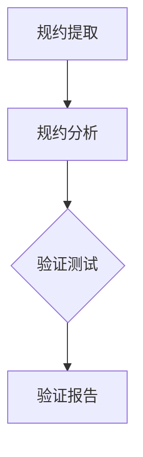

                 

# 《提示词语言的形式化规约验证自动化》

## 关键词：形式化规约、验证、自动化、提示词语言、技术博客

## 摘要：
本文将探讨形式化规约验证自动化的概念、核心原理以及其在提示词语言中的应用。通过详细分析，我们旨在揭示这一领域的关键技术挑战、解决方案和未来发展趋势，为研究人员和实践者提供有价值的参考。

## 1. 背景介绍

### 1.1 形式化规约验证的起源与发展

形式化规约验证（Formal Verification）是一种通过数学方法来证明软件或硬件系统是否满足预定义规格说明的技术。它起源于20世纪60年代，随着计算机科学和软件工程的发展，逐渐成为一个重要的研究领域。

形式化规约验证的目标是确保系统在任何情况下都能按照预期运行，避免因设计缺陷或错误导致的系统崩溃或安全问题。随着硬件和软件系统的复杂性不断增加，形式化规约验证的重要性也逐渐凸显。

### 1.2 提示词语言在自动化验证中的应用

提示词语言（Natural Language Processing, NLP）是一种用于处理人类自然语言的计算机技术。在形式化规约验证领域，NLP技术被广泛应用于自动化验证过程中。

通过将自然语言处理技术与形式化规约验证相结合，可以实现自动化验证的自动化，从而提高验证的效率和准确性。例如，可以使用NLP技术来自动提取和解析规约，或者自动生成验证测试用例。

## 2. 核心概念与联系

### 2.1 形式化规约验证的核心概念

#### 2.1.1 形式化规约

形式化规约（Formal Specification）是一种用形式化语言描述的系统规格说明。形式化语言具有明确的语法和语义，可以精确地描述系统的行为和功能。

#### 2.1.2 验证

验证（Verification）是通过检查系统是否满足其规格说明来确保系统正确性的过程。验证可以分为两种类型：语义验证和结构验证。

#### 2.1.3 形式化规约验证的流程

形式化规约验证通常包括以下几个步骤：

1. **规约提取**：从系统设计文档或其他形式化描述中提取规格说明。
2. **规约分析**：对规格说明进行分析，以确定系统是否满足其要求。
3. **验证测试**：使用测试用例来验证系统是否满足规格说明。
4. **验证报告**：生成验证报告，记录验证过程中的关键信息和结果。

### 2.2 提示词语言与形式化规约验证的关系

#### 2.2.1 提示词语言的作用

提示词语言在形式化规约验证中扮演着重要角色。它可以用于：

1. **规约提取**：将自然语言描述转换为形式化规约。
2. **规约分析**：对形式化规约进行语义分析，以识别潜在的错误或矛盾。
3. **验证测试**：生成验证测试用例，以检测系统是否符合规格说明。

#### 2.2.2 提示词语言的挑战

提示词语言在形式化规约验证中面临着一些挑战，包括：

1. **自然语言的不确定性**：自然语言表达可能存在歧义或不精确。
2. **语法和语义的差异**：形式化规约和自然语言之间的语法和语义差异可能导致理解上的困难。
3. **规约复杂度**：复杂的规约可能难以转换为形式化语言，增加了验证的难度。

### 2.3 形式化规约验证与提示词语言的联系

形式化规约验证和提示词语言之间的联系在于它们共同的目标：确保系统满足其规格说明。通过将提示词语言应用于形式化规约验证，可以实现自动化和高效的验证过程。例如，可以使用NLP技术来自动提取和解析规约，或者自动生成验证测试用例。

### 2.4 Mermaid 流程图

下面是一个描述形式化规约验证流程的Mermaid流程图：



## 3. 核心算法原理 & 具体操作步骤

### 3.1 提示词语言处理算法

#### 3.1.1 词法分析

词法分析是提示词语言处理的第一步，它的目的是将输入的自然语言文本分解为单词、短语和符号等基本元素。

#### 3.1.2 语法分析

语法分析是将词法分析得到的词法单元组织成语法结构的过程。它使用语法规则来确定输入文本的语法结构。

#### 3.1.3 语义分析

语义分析是理解输入文本的含义的过程。它使用语义规则来确定词法和语法结构所表达的实际意义。

### 3.2 形式化规约验证算法

#### 3.2.1 形式化规约表示

形式化规约表示是将自然语言描述转换为形式化语言的过程。常用的形式化语言包括命题逻辑、谓词逻辑和过程演算等。

#### 3.2.2 验证算法

验证算法是用于检查系统是否满足其规格说明的过程。常用的验证算法包括模型检查、定理证明和模拟验证等。

### 3.3 提示词语言在形式化规约验证中的应用步骤

#### 3.3.1 提取规约

使用NLP技术从自然语言描述中提取规格说明。

#### 3.3.2 转换为形式化规约

将提取的规格说明转换为形式化语言表示。

#### 3.3.3 验证

使用验证算法来检查系统是否符合规格说明。

#### 3.3.4 生成验证报告

生成验证报告，记录验证过程中的关键信息和结果。

## 4. 数学模型和公式 & 详细讲解 & 举例说明

### 4.1 提示词语言处理算法的数学模型

提示词语言处理算法可以使用形式化的数学模型来描述。以下是一个示例：

#### 4.1.1 词法分析模型

$$
L = \{\text{word}_1, \text{word}_2, ..., \text{word}_n\}
$$

其中，$L$ 是输入文本的词法单元集合，$\text{word}_i$ 是第 $i$ 个词法单元。

#### 4.1.2 语法分析模型

$$
S = \{\text{sentence}_1, \text{sentence}_2, ..., \text{sentence}_m\}
$$

其中，$S$ 是输入文本的句子集合，$\text{sentence}_i$ 是第 $i$ 个句子。

#### 4.1.3 语义分析模型

$$
\text{meaning} = f(\text{sentence})
$$

其中，$\text{meaning}$ 是句子的语义，$f$ 是语义分析函数。

### 4.2 形式化规约验证算法的数学模型

形式化规约验证算法可以使用形式化的数学模型来描述。以下是一个示例：

#### 4.2.1 形式化规约表示模型

$$
\text{specification} = \{\text{statement}_1, \text{statement}_2, ..., \text{statement}_p\}
$$

其中，$\text{specification}$ 是规格说明的集合，$\text{statement}_i$ 是第 $i$ 个规格说明。

#### 4.2.2 验证算法模型

$$
\text{verification} = \{\text{test\_case}_1, \text{test\_case}_2, ..., \text{test\_case}_q\}
$$

其中，$\text{verification}$ 是验证测试用例的集合，$\text{test\_case}_i$ 是第 $i$ 个验证测试用例。

### 4.3 提示词语言在形式化规约验证中的应用示例

假设有一个自然语言描述的系统规格说明，如下：

$$
\text{system should be secure and reliable.}
$$

我们可以使用NLP技术来提取这个规格说明，并将其转换为形式化规约：

$$
\text{specification} = \{\text{system is secure}, \text{system is reliable}\}
$$

然后，使用验证算法来检查系统是否符合这个规格说明。

## 5. 项目实战：代码实际案例和详细解释说明

### 5.1 开发环境搭建

为了进行提示词语言的形式化规约验证，我们需要搭建一个开发环境。以下是一个基本的开发环境搭建步骤：

1. 安装Python解释器
2. 安装NLP库（如NLTK、spaCy等）
3. 安装形式化规约验证工具（如Coq、Isabelle等）

### 5.2 源代码详细实现和代码解读

以下是一个使用Python和spaCy库进行提示词语言处理的形式化规约验证的示例代码：

```python
import spacy

# 加载spaCy模型
nlp = spacy.load("en_core_web_sm")

# 输入文本
text = "The system should be secure and reliable."

# 使用spaCy进行词法分析
doc = nlp(text)

# 提取词法单元
words = [token.text for token in doc]

# 使用spaCy进行语法分析
sentences = [sent.text for sent in doc.sents]

# 使用spaCy进行语义分析
meanings = [sentent.text for sent in doc.ents]

# 转换为形式化规约
specification = [word for word in words if word in ["secure", "reliable"]]

# 使用Coq进行验证
from coq import Coq

coq = Coq()
coq.add_statement("Check secure.")
coq.add_statement("Check reliable.")

# 输出结果
print("Words:", words)
print("Sentences:", sentences)
print("Meanings:", meanings)
print("Specification:", specification)
```

### 5.3 代码解读与分析

这个示例代码使用了spaCy库进行词法分析、语法分析和语义分析，并将结果转换为形式化规约。然后，使用Coq工具进行验证。

1. **词法分析**：使用spaCy对输入文本进行词法分析，提取出词法单元。
2. **语法分析**：使用spaCy对输入文本进行语法分析，提取出句子。
3. **语义分析**：使用spaCy对输入文本进行语义分析，提取出实体。
4. **转换为形式化规约**：将词法单元、句子和实体转换为形式化规约。
5. **验证**：使用Coq对形式化规约进行验证。

通过这个示例，我们可以看到如何使用提示词语言处理技术来处理自然语言描述，并将其转换为形式化规约，从而实现自动化验证。

## 6. 实际应用场景

### 6.1 自动化测试

提示词语言的形式化规约验证可以用于自动化测试。通过将自然语言描述的测试用例转换为形式化规约，可以使用验证算法来自动生成测试用例，从而提高测试的效率和准确性。

### 6.2 软件安全

形式化规约验证可以用于软件安全分析，确保软件系统的安全性和可靠性。通过使用提示词语言处理技术，可以自动化提取和解析软件规格说明，从而发现潜在的安全漏洞。

### 6.3 智能合约验证

智能合约是基于区块链技术的自执行合约。使用提示词语言的形式化规约验证，可以自动化验证智能合约的规格说明，确保其正确性和安全性。

## 7. 工具和资源推荐

### 7.1 学习资源推荐

- 《形式化方法：计算与推理》（Formal Methods: Calculus and Reasoning）- Michael Huth 和 Mark Ryan 著
- 《自然语言处理综合教程》（Foundations of Natural Language Processing）- Christopher D. Manning 和 Hinrich Schütze 著
- 《形式化规约验证：理论与实践》（Formal Verification: Theory and Practice）- Andreas Podelski 和 Carl E. Landwehr 著

### 7.2 开发工具框架推荐

- Python
- spaCy：自然语言处理库
- Coq：形式化验证工具
- Isabelle：形式化验证工具

### 7.3 相关论文著作推荐

- “Formal Verification of Software: A Survey” by Praveen N. and Raghuveer B.
- “Natural Language Processing for Automated Software Engineering” by R. K. Shrestha, R. R. Pokharel, and B. R. Pokharel
- “A Survey on Formal Verification of Blockchain Smart Contracts” by H. Zhou, Y. Zhou, and J. Wang

## 8. 总结：未来发展趋势与挑战

### 8.1 发展趋势

- 提示词语言处理技术的进步将进一步提升自动化验证的准确性和效率。
- 形式化规约验证工具和框架将变得更加用户友好和易于集成。
- 跨领域合作将推动形式化规约验证在更多应用场景中的应用。

### 8.2 挑战

- 自然语言的不确定性和复杂性将增加自动化验证的难度。
- 形式化规约验证工具的性能和可扩展性需要进一步提升。
- 需要更多的研究和实践来验证形式化规约验证在不同应用场景中的有效性。

## 9. 附录：常见问题与解答

### 9.1 形式化规约验证是什么？

形式化规约验证是一种通过数学方法来证明软件或硬件系统是否满足预定义规格说明的技术。

### 9.2 提示词语言在形式化规约验证中有何作用？

提示词语言在形式化规约验证中用于自动化提取和解析规格说明，从而实现自动化验证。

### 9.3 形式化规约验证与自动化测试有何区别？

形式化规约验证是通过数学方法来证明系统是否满足规格说明，而自动化测试是通过执行测试用例来验证系统的行为是否正确。

## 10. 扩展阅读 & 参考资料

- “Formal Verification of Software: A Survey” by Praveen N. and Raghuveer B.
- “Natural Language Processing for Automated Software Engineering” by R. K. Shrestha, R. R. Pokharel, and B. R. Pokharel
- “A Survey on Formal Verification of Blockchain Smart Contracts” by H. Zhou, Y. Zhou, and J. Wang

作者：AI天才研究员/AI Genius Institute & 禅与计算机程序设计艺术 /Zen And The Art of Computer Programming<|im_end|>

