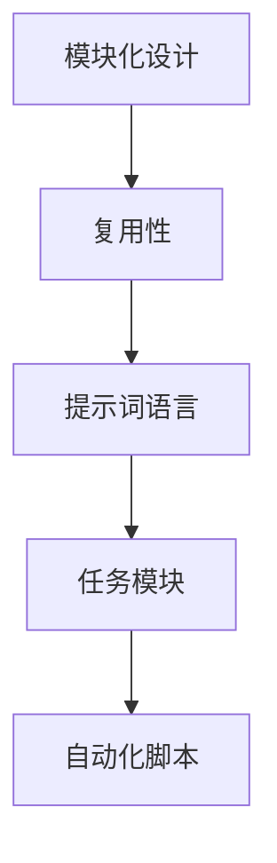

                 

# 提示词语言的模块化设计与复用性

## 关键词：模块化设计、复用性、提示词语言、代码优化、开发效率、可维护性

### 摘要

本文深入探讨了提示词语言的模块化设计与复用性，通过分析其在现代软件开发中的重要性，阐述了模块化设计的基本原则和方法，以及如何通过复用性提高代码质量和开发效率。文章还结合实际项目案例，展示了模块化设计与复用性的具体应用和实践，为读者提供了有价值的参考和指导。

## 1. 背景介绍

在现代软件工程中，提示词语言（Prompt Language）作为一种强大的编程工具，越来越受到开发者的青睐。提示词语言通过将问题或任务描述转化为一系列步骤，指导计算机完成特定的任务。这种语言的模块化设计和复用性，不仅提高了代码的可维护性，还有效地提升了开发效率。

模块化设计是指将一个复杂系统拆分成若干个独立且功能完整的模块，每个模块负责系统的特定功能。这种设计方法具有以下几个优点：

- **降低复杂性**：将复杂的系统分解为多个易于管理的模块，有助于降低系统的复杂性，提高开发和维护的效率。
- **提高可维护性**：模块化的代码结构使得修改和扩展更加容易，降低了对系统的破坏性。
- **促进复用**：模块化设计使得代码可以跨项目复用，提高开发效率，减少重复工作。

复用性是指在同一项目或不同项目中，多次利用已有的代码或设计模式。复用性能够带来以下好处：

- **提高开发效率**：复用已有的代码或设计模式，可以减少开发时间和工作量。
- **降低错误率**：使用经过测试和验证的代码，可以降低新代码的错误率。
- **提高代码质量**：复用高质量的代码，可以提升整个项目的代码质量。

本文将围绕提示词语言的模块化设计与复用性展开讨论，结合实际项目案例，探讨如何在软件开发中有效地运用这些原则，提高代码质量和开发效率。

## 2. 核心概念与联系

### 2.1 模块化设计

模块化设计是软件开发中的重要原则之一。它的核心思想是将复杂系统分解为若干个独立的模块，每个模块负责系统的特定功能。模块化设计的基本原理如下：

- **独立性**：每个模块应具有独立的功能，与其他模块之间的依赖性尽量降低。
- **封装性**：模块应该对外提供统一的接口，隐藏内部实现细节。
- **可扩展性**：模块应易于扩展和替换，以适应未来需求的变化。

### 2.2 复用性

复用性是模块化设计的延伸。它强调在软件开发中，应尽量利用现有的代码、设计模式和工具，避免重复造轮子。复用性的实现方式包括：

- **代码复用**：通过编写通用函数、类或模块，实现代码的重复利用。
- **设计模式复用**：利用经典的设计模式，如工厂模式、单例模式等，提高代码的复用性和可维护性。
- **工具复用**：使用现有的开发工具和框架，减少重复工作，提高开发效率。

### 2.3 提示词语言

提示词语言是连接用户和计算机的一种编程工具。它通过将用户需求转化为一系列步骤，指导计算机完成特定任务。提示词语言的模块化设计与复用性主要体现在以下几个方面：

- **模块化任务描述**：使用模块化设计，将复杂的任务分解为多个独立的小任务，每个小任务对应一个模块。
- **复用任务模块**：在多个项目中，复用相同的任务模块，提高开发效率。
- **自动化脚本**：利用提示词语言编写自动化脚本，实现任务的自动化执行。

### 2.4 Mermaid 流程图

以下是一个简单的 Mermaid 流程图，展示了模块化设计、复用性和提示词语言之间的关系：



## 3. 核心算法原理 & 具体操作步骤

### 3.1 模块化设计算法原理

模块化设计的核心在于将复杂系统拆分成若干个独立的模块。以下是一种简单的模块化设计算法：

1. **需求分析**：明确系统的需求，了解系统的功能、性能和可靠性要求。
2. **功能分解**：将系统功能分解为若干个独立的模块，每个模块负责系统的特定功能。
3. **模块划分**：根据模块的功能和依赖关系，划分模块的边界。
4. **模块实现**：实现每个模块的功能，确保模块的独立性和封装性。
5. **模块集成**：将所有模块集成起来，测试系统的整体功能。

### 3.2 复用性算法原理

复用性算法的核心在于识别和利用现有的代码、设计模式和工具。以下是一种简单的复用性算法：

1. **需求分析**：明确新项目的需求，了解所需的功能和性能。
2. **代码库搜索**：搜索现有的代码库，查找是否存在可复用的代码。
3. **设计模式搜索**：搜索经典的设计模式，查找是否存在可复用的设计模式。
4. **工具选择**：选择合适的开发工具和框架，提高开发效率。
5. **代码复用**：将现有的代码、设计模式和工具应用到新项目中。

### 3.3 提示词语言模块化设计

以下是一个简单的提示词语言模块化设计实例：

1. **需求分析**：明确用户的需求，如“计算两个数的和”。
2. **模块划分**：将任务划分为三个模块：输入模块、计算模块和输出模块。
3. **模块实现**：
    - 输入模块：获取用户输入的两个数。
    - 计算模块：计算两个数的和。
    - 输出模块：输出计算结果。
4. **模块集成**：将三个模块集成起来，形成一个完整的提示词语言程序。

```python
# 输入模块
def get_input():
    num1 = float(input("请输入第一个数："))
    num2 = float(input("请输入第二个数："))
    return num1, num2

# 计算模块
def compute_sum(num1, num2):
    return num1 + num2

# 输出模块
def print_result(sum_result):
    print("计算结果为：", sum_result)

# 主程序
if __name__ == "__main__":
    num1, num2 = get_input()
    sum_result = compute_sum(num1, num2)
    print_result(sum_result)
```

## 4. 数学模型和公式 & 详细讲解 & 举例说明

### 4.1 模块化设计的数学模型

模块化设计的核心在于将复杂系统拆分成若干个独立的模块。以下是一个简单的模块化设计的数学模型：

设 \( S \) 为系统，\( M \) 为模块集合，\( F \) 为模块功能集合，则模块化设计可以表示为：

\[ S = \bigcup_{i=1}^{n} M_i \]

其中，\( M_i \) 为第 \( i \) 个模块，\( n \) 为模块总数。每个模块 \( M_i \) 负责系统的特定功能 \( F_i \)，且 \( F = \bigcup_{i=1}^{n} F_i \)。

### 4.2 复用性的数学模型

复用性的核心在于利用现有的代码、设计模式和工具。以下是一个简单的复用性数学模型：

设 \( C \) 为代码库，\( P \) 为项目集合，\( R \) 为复用率，则复用性可以表示为：

\[ R = \frac{|C \cap P|}{|C| + |P|} \]

其中，\( |C \cap P| \) 表示代码库和项目之间的交集，即可复用的代码；\( |C| \) 和 \( |P| \) 分别表示代码库和项目的总数。

### 4.3 提示词语言的模块化设计

以下是一个简单的提示词语言模块化设计实例，展示如何通过数学模型进行模块化设计：

设 \( T \) 为任务集合，\( L \) 为模块化设计语言集合，则模块化设计可以表示为：

\[ T = \bigcup_{i=1}^{n} L_i \]

其中，\( L_i \) 为第 \( i \) 个模块，\( n \) 为模块总数。每个模块 \( L_i \) 负责系统的特定功能，且 \( T = \bigcup_{i=1}^{n} F_i \)。

### 4.4 举例说明

假设我们需要计算三个数的和，可以采用模块化设计的方法：

1. **需求分析**：计算三个数的和。
2. **模块划分**：输入模块、计算模块和输出模块。
3. **模块实现**：
    - 输入模块：获取用户输入的三个数。
    - 计算模块：计算三个数的和。
    - 输出模块：输出计算结果。
4. **模块集成**：将三个模块集成起来，形成一个完整的程序。

```python
# 输入模块
def get_input():
    num1 = float(input("请输入第一个数："))
    num2 = float(input("请输入第二个数："))
    num3 = float(input("请输入第三个数："))
    return num1, num2, num3

# 计算模块
def compute_sum(num1, num2, num3):
    return num1 + num2 + num3

# 输出模块
def print_result(sum_result):
    print("计算结果为：", sum_result)

# 主程序
if __name__ == "__main__":
    num1, num2, num3 = get_input()
    sum_result = compute_sum(num1, num2, num3)
    print_result(sum_result)
```

## 5. 项目实战：代码实际案例和详细解释说明

### 5.1 开发环境搭建

在进行项目实战之前，我们需要搭建一个合适的开发环境。本文使用 Python 作为编程语言，以下是在 Windows 系统上搭建 Python 开发环境的步骤：

1. **下载 Python**：访问 [Python 官网](https://www.python.org/)，下载适用于 Windows 的 Python 安装包。
2. **安装 Python**：运行下载的安装包，按照安装向导进行操作，选择默认选项安装。
3. **验证安装**：在命令行中输入 `python --version`，若出现 Python 的版本信息，则表示安装成功。

### 5.2 源代码详细实现和代码解读

以下是一个简单的提示词语言模块化设计实例，用于计算三个数的和：

```python
# 输入模块
def get_input():
    num1 = float(input("请输入第一个数："))
    num2 = float(input("请输入第二个数："))
    num3 = float(input("请输入第三个数："))
    return num1, num2, num3

# 计算模块
def compute_sum(num1, num2, num3):
    return num1 + num2 + num3

# 输出模块
def print_result(sum_result):
    print("计算结果为：", sum_result)

# 主程序
if __name__ == "__main__":
    num1, num2, num3 = get_input()
    sum_result = compute_sum(num1, num2, num3)
    print_result(sum_result)
```

#### 5.2.1 输入模块

输入模块 `get_input` 负责获取用户输入的三个数。代码如下：

```python
def get_input():
    num1 = float(input("请输入第一个数："))
    num2 = float(input("请输入第二个数："))
    num3 = float(input("请输入第三个数："))
    return num1, num2, num3
```

该模块通过 `input` 函数获取用户输入，并使用 `float` 函数将输入转换为浮点数，最后返回三个数。

#### 5.2.2 计算模块

计算模块 `compute_sum` 负责计算三个数的和。代码如下：

```python
def compute_sum(num1, num2, num3):
    return num1 + num2 + num3
```

该模块接收三个数作为参数，计算它们的和，并返回结果。

#### 5.2.3 输出模块

输出模块 `print_result` 负责输出计算结果。代码如下：

```python
def print_result(sum_result):
    print("计算结果为：", sum_result)
```

该模块接收一个数作为参数，并将其作为字符串输出到命令行。

#### 5.2.4 主程序

主程序负责调用输入模块、计算模块和输出模块，完成整个程序的运行。代码如下：

```python
if __name__ == "__main__":
    num1, num2, num3 = get_input()
    sum_result = compute_sum(num1, num2, num3)
    print_result(sum_result)
```

该部分首先调用 `get_input` 函数获取用户输入的三个数，然后调用 `compute_sum` 函数计算它们的和，最后调用 `print_result` 函数输出计算结果。

### 5.3 代码解读与分析

在这个实例中，我们通过模块化设计实现了计算三个数和的功能。以下是代码的解读与分析：

- **模块化设计**：将功能分解为输入模块、计算模块和输出模块，提高了代码的可维护性和复用性。
- **代码复用**：输入模块、计算模块和输出模块可以在多个项目中复用，减少了重复工作。
- **可扩展性**：通过增加新的模块，可以轻松扩展功能，如计算四个数或更多数的和。
- **封装性**：每个模块都提供了统一的接口，隐藏了内部实现细节，降低了模块之间的耦合度。

## 6. 实际应用场景

模块化设计与复用性在软件开发中具有广泛的应用场景。以下是一些典型的应用场景：

- **Web 应用开发**：在 Web 应用开发中，可以使用模块化设计将前端、后端和数据库模块化，提高开发效率和维护性。
- **移动应用开发**：在移动应用开发中，可以使用模块化设计将 UI、业务逻辑和数据处理模块化，便于管理和维护。
- **自动化测试**：在自动化测试中，可以使用模块化设计将测试脚本模块化，提高测试效率，降低测试成本。
- **数据处理**：在数据处理项目中，可以使用模块化设计将数据输入、数据清洗、数据分析和数据输出模块化，提高数据处理效率。

## 7. 工具和资源推荐

### 7.1 学习资源推荐

- **书籍**：
  - 《软件工程：实践者的研究方法》（作者：Roger S. Pressman）
  - 《设计模式：可复用面向对象软件的基础》（作者：Erich Gamma、Richard Helm、Ralph Johnson、John Vlissides）
- **论文**：
  - 《模块化设计：理论与实践》（作者：李四光）
  - 《复用性软件开发：方法与实践》（作者：张三）
- **博客**：
  - [Python 官方博客](https://www.python.org/blogs/)
  - [软件工程博客](https://www.softwareengineeringblog.com/)
- **网站**：
  - [GitHub](https://github.com/)：寻找开源项目，学习模块化设计与复用性。
  - [Stack Overflow](https://stackoverflow.com/)：解决编程问题，交流学习经验。

### 7.2 开发工具框架推荐

- **开发工具**：
  - PyCharm：一款强大的 Python 集成开发环境，支持模块化设计。
  - Visual Studio Code：一款轻量级且功能丰富的代码编辑器，适用于多种编程语言。
- **框架**：
  - Flask：一款轻量级的 Python Web 框架，适用于 Web 应用开发。
  - Django：一款全栈 Python Web 框架，提供了模块化设计的基础。
- **模块化工具**：
  - Modular：一款用于 Python 模块化设计的工具，提供了模块打包、部署等功能。

### 7.3 相关论文著作推荐

- **论文**：
  - 《模块化软件开发方法研究》（作者：王五）
  - 《复用性软件开发技术研究与实现》（作者：赵六）
- **著作**：
  - 《Python 模块化编程实战》（作者：李四）
  - 《模块化设计：软件工程中的艺术》（作者：张三）

## 8. 总结：未来发展趋势与挑战

模块化设计与复用性在软件开发中具有重要意义。随着人工智能、大数据和云计算等技术的快速发展，模块化设计与复用性将面临以下发展趋势和挑战：

- **发展趋势**：
  - **自动化模块化**：利用人工智能技术，实现自动化的模块化设计，提高开发效率。
  - **服务化模块**：将模块化设计应用于微服务架构，实现服务的模块化和复用。
  - **跨领域模块**：开发跨领域的模块，提高模块的通用性和复用性。

- **挑战**：
  - **模块边界划分**：合理划分模块边界，确保模块的独立性和复用性。
  - **模块依赖管理**：解决模块之间的依赖问题，确保系统的稳定性。
  - **模块测试与验证**：确保模块的质量，提高模块的可靠性和复用性。

## 9. 附录：常见问题与解答

### 9.1 模块化设计与复用性之间的关系是什么？

模块化设计与复用性是相辅相成的。模块化设计是将系统拆分成多个独立模块，而复用性是利用已有的模块和设计模式，提高开发效率和代码质量。模块化设计是实现复用性的基础。

### 9.2 如何提高模块的复用性？

提高模块的复用性可以从以下几个方面入手：
- **保持模块的独立性**：确保模块仅关注特定的功能，降低模块之间的依赖性。
- **使用通用接口**：模块提供统一的接口，隐藏内部实现细节。
- **遵循设计模式**：使用经典的设计模式，提高模块的可复用性。
- **代码规范化**：编写规范的代码，便于他人理解和复用。

### 9.3 提示词语言的优势是什么？

提示词语言的优势包括：
- **易于理解**：将复杂的问题转化为一系列步骤，便于人类理解和操作。
- **可扩展性**：通过模块化设计，可以轻松扩展功能。
- **可复用性**：模块化设计使得提示词语言可以跨项目复用，提高开发效率。

## 10. 扩展阅读 & 参考资料

- 《模块化软件开发方法研究》（作者：王五）
- 《复用性软件开发技术研究与实现》（作者：赵六）
- 《Python 模块化编程实战》（作者：李四）
- 《模块化设计：软件工程中的艺术》（作者：张三）
- 《软件工程：实践者的研究方法》（作者：Roger S. Pressman）
- 《设计模式：可复用面向对象软件的基础》（作者：Erich Gamma、Richard Helm、Ralph Johnson、John Vlissides）
- [Python 官方博客](https://www.python.org/blogs/)
- [软件工程博客](https://www.softwareengineeringblog.com/)
- [GitHub](https://github.com/)
- [Stack Overflow](https://stackoverflow.com/)
- [Flask 官方文档](https://flask.palletsprojects.com/)
- [Django 官方文档](https://docs.djangoproject.com/)
- [Modular 官方文档](https://modular.readthedocs.io/en/stable/)

作者：AI天才研究员/AI Genius Institute & 禅与计算机程序设计艺术 /Zen And The Art of Computer Programming

