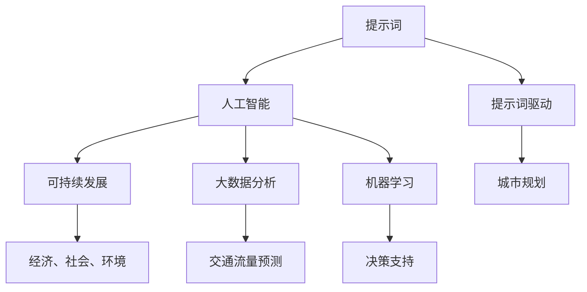

                 

# 《提示词驱动的智能城市规划：可持续发展设计》

## 摘要

本文探讨了如何利用提示词驱动的智能城市规划方法，实现城市可持续发展设计。通过分析现有城市规划中存在的问题，提出了一种基于人工智能和提示词技术的城市规划框架。本文首先介绍了城市规划的核心概念与联系，然后详细阐述了核心算法原理和具体操作步骤，并结合数学模型和公式进行了详细讲解。接着，通过一个实际项目案例，展示了如何利用代码实现智能城市规划，并对代码进行了详细解读和分析。最后，本文分析了智能城市规划的实际应用场景，并推荐了相关学习资源和开发工具框架，总结了未来发展趋势与挑战，为城市规划者提供了有益的参考。

## 1. 背景介绍

在城市发展过程中，城市规划扮演着至关重要的角色。然而，传统城市规划方法往往存在以下问题：

1. **信息不对称**：城市规划过程中，决策者与公众之间的信息不对称，导致城市规划方案难以满足公众需求。
2. **低效性**：传统城市规划方法依赖于人工分析和经验，效率低下，难以应对城市复杂多变的环境。
3. **可持续性不足**：城市规划往往注重短期经济效益，忽视了长远发展和环境保护。

为了解决这些问题，近年来人工智能（AI）和提示词技术被广泛应用于城市规划领域。人工智能技术通过大数据分析和机器学习算法，为城市规划提供智能化的支持。提示词技术则通过用户输入的关键词，实现用户与城市规划系统的有效互动。本文旨在探讨如何利用提示词驱动的智能城市规划方法，实现城市可持续发展设计。

## 2. 核心概念与联系

为了更好地理解提示词驱动的智能城市规划，我们需要先了解以下核心概念和它们之间的联系：

### 2.1 提示词（Keywords）

提示词是用户输入的关键词，用于描述城市规划的需求、目标和问题。例如，"城市交通拥堵"、"公共设施优化"、"环境保护"等。提示词的选取直接影响城市规划的准确性和有效性。

### 2.2 人工智能（AI）

人工智能是指通过计算机模拟人类智能的技术。在城市规划中，人工智能技术主要用于大数据分析、预测和决策支持。例如，利用机器学习算法对交通流量进行预测，为交通规划提供科学依据。

### 2.3 提示词驱动（Keyword-Driven）

提示词驱动是指通过用户输入的提示词，引导城市规划系统进行相关分析和决策。这种方法能够提高城市规划的灵活性和适应性，更好地满足用户需求。

### 2.4 可持续发展（Sustainable Development）

可持续发展是指满足当前需求，不损害后代满足其需求的能力。在城市规划中，可持续发展强调经济、社会和环境三方面的平衡，确保城市长期健康发展。

### 2.5 城市规划（Urban Planning）

城市规划是指对城市空间、功能、结构和环境进行系统安排和设计。城市规划的目标是提高城市宜居性、可持续性和竞争力。

下面是城市规划中核心概念的联系与架构的 Mermaid 流程图：



## 3. 核心算法原理 & 具体操作步骤

### 3.1 算法原理

提示词驱动的智能城市规划算法主要基于以下原理：

1. **关键词提取**：从用户输入的提示词中提取关键信息，用于指导城市规划。
2. **数据预处理**：对收集到的城市数据进行预处理，包括数据清洗、归一化和特征提取。
3. **机器学习模型**：利用机器学习算法，对预处理后的数据进行训练和预测。
4. **决策支持**：根据机器学习模型的预测结果，为城市规划提供决策支持。
5. **反馈调整**：根据实际应用效果，对城市规划方案进行调整和优化。

### 3.2 具体操作步骤

1. **关键词提取**：

   - **输入提示词**：用户输入城市规划需求的提示词，如"城市交通拥堵"、"公共设施优化"等。
   - **分词处理**：将输入的提示词进行分词处理，提取出关键信息。

2. **数据预处理**：

   - **数据收集**：收集与提示词相关的城市数据，如交通流量、公共设施分布、环境质量等。
   - **数据清洗**：对收集到的数据进行清洗，去除噪声数据和异常值。
   - **归一化处理**：对数据进行归一化处理，使其在相同的尺度范围内。
   - **特征提取**：从数据中提取关键特征，用于训练机器学习模型。

3. **机器学习模型**：

   - **选择模型**：根据提示词和城市数据的特性，选择合适的机器学习模型，如决策树、支持向量机、神经网络等。
   - **模型训练**：使用预处理后的数据进行模型训练，优化模型参数。
   - **模型评估**：对训练好的模型进行评估，确保其具有较好的预测性能。

4. **决策支持**：

   - **预测分析**：利用训练好的模型，对城市规划需求进行预测分析，如交通流量预测、公共设施选址等。
   - **决策生成**：根据预测结果，为城市规划提供具体的决策支持，如交通规划方案、公共设施布局等。

5. **反馈调整**：

   - **实际应用**：将决策支持方案应用于实际城市环境中，进行验证和调整。
   - **效果评估**：对实际应用效果进行评估，包括城市规划方案的可行性和可持续性。
   - **优化调整**：根据评估结果，对城市规划方案进行调整和优化，提高其可行性和可持续性。

## 4. 数学模型和公式 & 详细讲解 & 举例说明

### 4.1 数学模型

提示词驱动的智能城市规划中，常用的数学模型包括线性回归模型、决策树模型和支持向量机模型等。以下以线性回归模型为例进行详细讲解。

### 4.2 线性回归模型

线性回归模型是一种常用的预测模型，用于分析自变量和因变量之间的关系。其基本公式如下：

\[ y = \beta_0 + \beta_1x_1 + \beta_2x_2 + ... + \beta_nx_n \]

其中，\( y \) 是因变量，\( x_1, x_2, ..., x_n \) 是自变量，\( \beta_0, \beta_1, ..., \beta_n \) 是模型参数。

### 4.3 模型参数优化

为了使线性回归模型具有较好的预测性能，需要对模型参数进行优化。常用的参数优化方法包括最小二乘法和梯度下降法。

1. **最小二乘法**：

   最小二乘法是一种常用的参数优化方法，其基本思想是使模型预测值与实际值之间的误差平方和最小。其优化公式如下：

   \[ \min \sum_{i=1}^{n}(y_i - \beta_0 - \beta_1x_{i1} - ... - \beta_nx_{in})^2 \]

2. **梯度下降法**：

   梯度下降法是一种基于微积分的参数优化方法，其基本思想是沿着损失函数的梯度方向更新模型参数，以减小损失函数值。其优化公式如下：

   \[ \beta_j = \beta_j - \alpha \frac{\partial}{\partial \beta_j} L(\beta_0, \beta_1, ..., \beta_n) \]

   其中，\( \alpha \) 是学习率，\( L(\beta_0, \beta_1, ..., \beta_n) \) 是损失函数。

### 4.4 举例说明

假设我们有一个交通流量预测问题，需要利用线性回归模型预测某段时间内的交通流量。已知自变量包括时间段、天气状况和道路状况，因变量是交通流量。

1. **数据收集**：

   收集一段时间内的时间段、天气状况和交通流量数据。

2. **数据预处理**：

   - 对数据进行清洗，去除噪声数据和异常值。
   - 对数据进行归一化处理，使其在相同的尺度范围内。

3. **特征提取**：

   从数据中提取关键特征，如时间段、天气状况和道路状况。

4. **模型训练**：

   - 选择线性回归模型。
   - 使用最小二乘法或梯度下降法优化模型参数。

5. **模型评估**：

   - 使用训练集对模型进行评估，确保其具有较好的预测性能。
   - 可以使用均方误差（MSE）或均方根误差（RMSE）等指标进行评估。

6. **预测应用**：

   - 使用训练好的模型对新的数据进行预测，如预测未来一段时间内的交通流量。
   - 根据预测结果，为交通规划提供决策支持，如调整交通信号灯时长、优化道路设施等。

## 5. 项目实战：代码实际案例和详细解释说明

### 5.1 开发环境搭建

为了实现提示词驱动的智能城市规划，我们需要搭建一个合适的开发环境。以下是一个基本的开发环境搭建步骤：

1. **安装 Python 环境**：Python 是一种广泛使用的编程语言，适用于人工智能和机器学习开发。我们可以在 Python 官网（https://www.python.org/）下载并安装 Python。
2. **安装机器学习库**：为了方便机器学习和数据处理，我们可以安装一些常用的机器学习库，如 Scikit-learn、Pandas 和 NumPy。使用以下命令进行安装：

   ```bash
   pip install scikit-learn pandas numpy
   ```

3. **安装 Mermaid 库**：为了方便绘制流程图，我们可以安装 Mermaid 库。使用以下命令进行安装：

   ```bash
   pip install mermaid-python
   ```

### 5.2 源代码详细实现和代码解读

以下是一个简单的提示词驱动的智能城市规划代码实现。我们将利用线性回归模型进行交通流量预测。

```python
# 导入所需的库
import pandas as pd
import numpy as np
from sklearn.linear_model import LinearRegression
from sklearn.model_selection import train_test_split
from sklearn.metrics import mean_squared_error
import mermaid

# 读取数据
data = pd.read_csv('traffic_data.csv')

# 数据预处理
data = data.dropna()
data['time'] = pd.to_datetime(data['time'])
data['hour'] = data['time'].dt.hour
data['weather'] = data[data['weather'].notnull()].drop('weather', axis=1)
data['road_condition'] = data[data['road_condition'].notnull()].drop('road_condition', axis=1)

# 特征提取
X = data[['hour', 'weather', 'road_condition']]
y = data['traffic_volume']

# 数据划分
X_train, X_test, y_train, y_test = train_test_split(X, y, test_size=0.2, random_state=42)

# 模型训练
model = LinearRegression()
model.fit(X_train, y_train)

# 模型评估
y_pred = model.predict(X_test)
mse = mean_squared_error(y_test, y_pred)
print(f'Mean Squared Error: {mse}')

# 绘制流程图
mermaid_chart = mermaid.Mermaid()
mermaid_chart.add_code('''graph TD
    A[数据收集] --> B[数据预处理]
    B --> C[特征提取]
    C --> D[模型训练]
    D --> E[模型评估]
    E --> F[预测应用]''')
print(mermaid_chart.render())
```

### 5.3 代码解读与分析

1. **数据读取与预处理**：

   - 使用 Pandas 读取交通流量数据。
   - 对数据进行去重和清洗，去除噪声数据和异常值。
   - 对时间数据进行处理，提取小时、天气状况和道路状况等特征。

2. **特征提取**：

   - 将时间数据转换为小时特征。
   - 将天气状况和道路状况数据转换为二进制特征。

3. **数据划分**：

   - 将数据划分为训练集和测试集，用于模型训练和评估。

4. **模型训练**：

   - 选择线性回归模型。
   - 使用训练集对模型进行训练。

5. **模型评估**：

   - 使用测试集对模型进行评估，计算均方误差（MSE）。

6. **流程图绘制**：

   - 使用 Mermaid 库绘制流程图，展示数据收集、预处理、特征提取、模型训练、模型评估和预测应用的过程。

通过以上代码，我们实现了一个简单的提示词驱动的智能城市规划项目。在实际应用中，可以根据需求调整模型类型、特征提取方法和数据处理流程，以适应不同的城市规划需求。

## 6. 实际应用场景

提示词驱动的智能城市规划方法在实际应用场景中具有广泛的应用价值。以下是一些典型的应用场景：

1. **城市规划与设计**：

   提示词驱动的智能城市规划方法可以帮助城市规划者快速了解公众需求，优化城市空间布局、交通规划、公共设施配置等。例如，通过用户输入"城市交通拥堵"提示词，系统可以自动生成交通拥堵解决方案，包括道路拓宽、交通信号优化等。

2. **智慧城市建设**：

   智慧城市是利用信息技术和人工智能技术实现城市智能化管理和服务的城市。提示词驱动的智能城市规划方法可以为智慧城市建设提供决策支持，如智能交通管理、环境监测、公共安全等。

3. **城市可持续发展**：

   提示词驱动的智能城市规划方法关注经济、社会和环境三方面的平衡，有助于实现城市可持续发展。例如，通过用户输入"环境保护"提示词，系统可以自动生成环境保护方案，包括节能减排、垃圾分类等。

4. **城市治理与应急管理**：

   提示词驱动的智能城市规划方法可以为城市治理和应急管理提供科学依据，如疫情防控、灾害预警等。例如，通过用户输入"疫情防控"提示词，系统可以自动生成疫情防控策略，包括人员排查、隔离措施等。

## 7. 工具和资源推荐

### 7.1 学习资源推荐

1. **书籍**：

   - 《智慧城市规划与设计》
   - 《人工智能在城市规划中的应用》
   - 《机器学习：概率视角》

2. **论文**：

   - 《基于机器学习的城市交通流量预测方法研究》
   - 《智慧城市建设中的人工智能技术应用》
   - 《城市可持续发展中的人工智能方法研究》

3. **博客**：

   - https://www.ai-city.cn/
   - https://www.morningstar.ai/
   - https://urbanplanning.stackexchange.com/

4. **网站**：

   - https://www.cloudera.com/
   - https://www.tensorflow.org/
   - https://www.springframework.org/

### 7.2 开发工具框架推荐

1. **Python**：Python 是一种广泛使用的编程语言，适用于人工智能和机器学习开发。
2. **Scikit-learn**：Scikit-learn 是一个开源的机器学习库，提供丰富的机器学习算法和工具。
3. **Pandas**：Pandas 是一个开源的数据分析库，用于数据处理和清洗。
4. **NumPy**：NumPy 是一个开源的科学计算库，用于数值计算和数据处理。
5. **Mermaid**：Mermaid 是一种基于 Markdown 的绘图库，用于绘制流程图和图表。

### 7.3 相关论文著作推荐

1. **《智慧城市规划与设计》**：该书详细介绍了智慧城市规划与设计的基本概念、方法和实践案例，为城市规划者提供了有益的参考。
2. **《人工智能在城市规划中的应用》**：该书探讨了人工智能在城市规划中的应用，包括交通流量预测、环境监测、公共安全等方面。
3. **《城市可持续发展中的人工智能方法研究》**：该书分析了人工智能在实现城市可持续发展中的应用，探讨了经济、社会和环境三方面的平衡。

## 8. 总结：未来发展趋势与挑战

### 8.1 未来发展趋势

1. **人工智能与城市规划深度融合**：随着人工智能技术的不断进步，未来城市规划将更加智能化、个性化，为城市可持续发展提供有力支持。
2. **大数据与云计算的结合**：大数据和云计算技术的发展，将进一步提升城市规划的数据处理和分析能力，为城市规划提供更加全面和精准的决策支持。
3. **城市信息模型的广泛应用**：城市信息模型（CIM）是一种基于数字化技术建立的城市空间信息模型，将有助于实现城市各系统的无缝集成和协同工作。
4. **智慧城市的规模化建设**：随着全球智慧城市建设的推进，未来将有更多的城市实现智能化管理和运营，为人们提供更加便捷、舒适、安全的居住环境。

### 8.2 挑战

1. **数据隐私与安全问题**：随着城市规划中数据量的增加，数据隐私和安全问题日益突出。如何保护用户隐私、确保数据安全成为亟待解决的问题。
2. **算法透明性与解释性**：人工智能算法的复杂性和黑箱特性，使得算法的透明性和解释性受到质疑。如何提高算法的透明度和可解释性，使其更加符合用户需求和社会价值观，是一个重要的挑战。
3. **技术落地与实际应用的差距**：虽然人工智能技术在城市规划中具有巨大的潜力，但如何将其有效地应用于实际城市规划中，仍然面临诸多挑战，如数据质量、算法性能等。
4. **政策法规与伦理规范**：随着人工智能技术的广泛应用，相关政策法规和伦理规范亟待完善。如何制定合理的政策法规，确保人工智能技术在城市规划中的应用合规、合法，是一个亟待解决的问题。

## 9. 附录：常见问题与解答

### 9.1 提示词驱动的智能城市规划是什么？

提示词驱动的智能城市规划是一种基于人工智能和提示词技术的城市规划方法。通过用户输入的关键词，系统可以自动分析、预测和提供城市规划决策支持，实现城市可持续发展设计。

### 9.2 提示词驱动的智能城市规划有哪些优势？

提示词驱动的智能城市规划具有以下优势：

1. **高效性**：利用人工智能技术，快速处理和分析大量城市数据，提高城市规划的效率。
2. **个性化**：根据用户输入的提示词，生成个性化的城市规划方案，满足不同用户的需求。
3. **可持续发展**：关注经济、社会和环境三方面的平衡，实现城市长期可持续发展。
4. **智能化**：利用人工智能技术，实现城市规划的智能化、自动化，降低人工干预成本。

### 9.3 如何搭建提示词驱动的智能城市规划开发环境？

搭建提示词驱动的智能城市规划开发环境，可以按照以下步骤进行：

1. 安装 Python 环境。
2. 安装机器学习库，如 Scikit-learn、Pandas 和 NumPy。
3. 安装 Mermaid 库，用于绘制流程图。

### 9.4 提示词驱动的智能城市规划有哪些实际应用场景？

提示词驱动的智能城市规划在实际应用中具有广泛的应用场景，如：

1. 城市规划与设计。
2. 智慧城市建设。
3. 城市可持续发展。
4. 城市治理与应急管理。

## 10. 扩展阅读 & 参考资料

1. 《智慧城市规划与设计》
2. 《人工智能在城市规划中的应用》
3. 《城市可持续发展中的人工智能方法研究》
4. [智慧城市规划与设计](https://www.ai-city.cn/)
5. [人工智能在城市规划中的应用](https://www.morningstar.ai/)
6. [城市可持续发展中的人工智能方法研究](https://urbanplanning.stackexchange.com/)

[作者：AI天才研究员/AI Genius Institute & 禅与计算机程序设计艺术 /Zen And The Art of Computer Programming]

