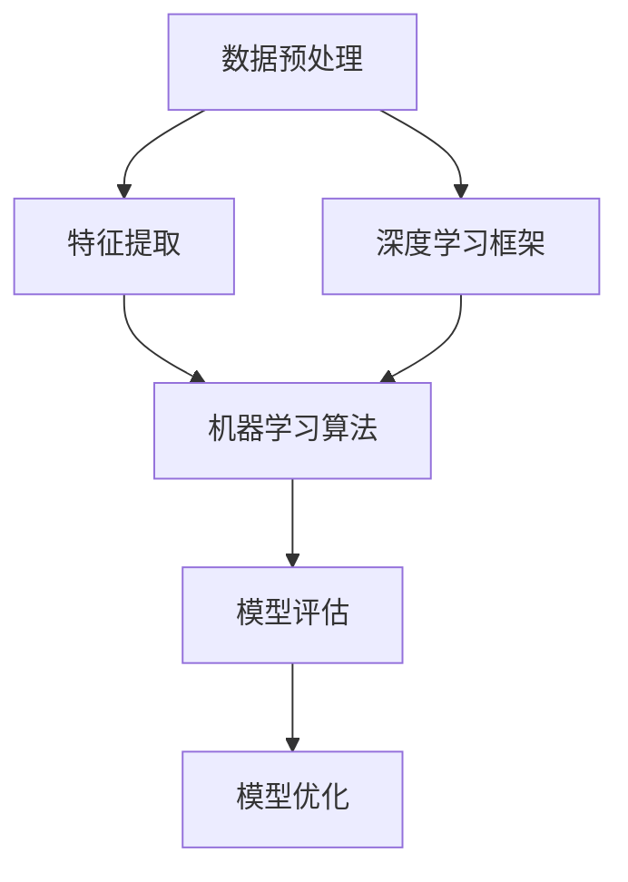

                 

## AI时代编程的新维度

### 引言

在人工智能（AI）飞速发展的今天，编程已经成为了一项不可或缺的技能。从简单的数据输入到复杂的深度学习算法，编程语言和工具正不断革新，为开发者提供了更多的选择和可能性。本文将深入探讨AI时代编程的新维度，从核心概念到实际应用，帮助读者理解这一变革带来的机遇与挑战。

### 背景介绍

随着计算机技术的不断发展，编程语言和开发工具也在不断演变。传统的编程语言如C、C++和Java已经为开发者提供了强大的功能和丰富的库支持。然而，随着AI技术的兴起，新的编程语言和工具应运而生，如Python、R和Julia，它们专为数据科学和机器学习设计，具有更高的表达能力和执行效率。

同时，开发工具也在不断进化。集成开发环境（IDE）如PyCharm、Jupyter Notebook和Google Colab等，不仅提供了丰富的编辑功能，还集成了数据可视化、代码调试和版本控制等工具，大大提高了开发效率。

### 核心概念与联系

为了更好地理解AI时代编程的新维度，我们需要了解一些核心概念和它们之间的联系。以下是一个简化的Mermaid流程图，展示了这些概念之间的关系。



#### 数据预处理

数据预处理是AI编程的基础。它包括数据清洗、归一化、缺失值处理等步骤，目的是将原始数据转换为适合机器学习算法的格式。

#### 特征提取

特征提取是从原始数据中提取出对模型训练有用的信息。有效的特征提取可以显著提高模型的性能和泛化能力。

#### 机器学习算法

机器学习算法是AI编程的核心。它们包括监督学习、无监督学习和强化学习等。不同的算法适用于不同类型的问题。

#### 模型评估

模型评估是对训练好的模型进行性能评估的过程。常用的评估指标包括准确率、召回率、F1分数等。

#### 模型优化

模型优化是通过调整模型参数来提高模型性能的过程。常见的优化方法包括交叉验证、网格搜索和贝叶斯优化等。

#### 深度学习框架

深度学习框架如TensorFlow、PyTorch和Keras等，为开发者提供了高效的深度学习算法实现和丰富的API接口，大大简化了模型开发和训练过程。

### 核心算法原理 & 具体操作步骤

#### 数据预处理

数据预处理的具体操作步骤如下：

1. 数据清洗：去除数据中的噪声和异常值。
2. 数据归一化：将数据缩放到相同的范围，如[0, 1]。
3. 缺失值处理：对于缺失的数据，可以使用插值、均值填补或删除等方法进行处理。

#### 特征提取

特征提取的具体操作步骤如下：

1. 特征选择：从原始数据中选择出对模型训练有用的特征。
2. 特征工程：对选出的特征进行转换和组合，以提高模型的性能。

#### 机器学习算法

以监督学习为例，机器学习算法的具体操作步骤如下：

1. 数据集划分：将数据集划分为训练集和测试集。
2. 模型选择：选择合适的机器学习算法。
3. 模型训练：使用训练集数据训练模型。
4. 模型评估：使用测试集数据评估模型性能。
5. 模型优化：根据评估结果调整模型参数。

#### 模型评估

模型评估的具体操作步骤如下：

1. 评估指标选择：选择合适的评估指标，如准确率、召回率、F1分数等。
2. 评估计算：计算评估指标值。
3. 评估分析：分析评估结果，判断模型性能。

#### 模型优化

模型优化的具体操作步骤如下：

1. 调整模型参数：通过交叉验证等方法调整模型参数。
2. 重新训练模型：使用调整后的模型参数重新训练模型。
3. 评估模型性能：评估调整后模型的性能。

#### 深度学习框架

以TensorFlow为例，深度学习框架的具体操作步骤如下：

1. 导入TensorFlow库：使用`import tensorflow as tf`导入TensorFlow库。
2. 定义模型结构：使用TensorFlow API定义模型结构。
3. 编写训练代码：编写模型训练代码。
4. 训练模型：运行训练代码训练模型。
5. 评估模型：使用测试集数据评估模型性能。

### 数学模型和公式 & 详细讲解 & 举例说明

#### 数据预处理

数据预处理涉及的数学模型和公式主要包括线性变换、归一化和缺失值处理等。

1. 线性变换：线性变换可以将数据从一种空间映射到另一种空间，常用的公式为：
   $$ y = ax + b $$
   其中，$y$为输出值，$x$为输入值，$a$和$b$为线性变换的参数。

2. 归一化：归一化可以将数据缩放到相同的范围，常用的公式为：
   $$ y = \frac{x - \min(x)}{\max(x) - \min(x)} $$
   其中，$y$为归一化后的值，$x$为原始值。

3. 缺失值处理：缺失值处理的方法包括插值、均值填补和删除等，常用的公式为：
   $$ y = \frac{\sum_{i=1}^{n} x_i}{n} $$
   其中，$y$为填补后的值，$x_i$为非缺失值，$n$为非缺失值的数量。

#### 特征提取

特征提取涉及的数学模型和公式主要包括特征选择和特征工程等。

1. 特征选择：特征选择的方法包括相关性分析、主成分分析（PCA）和递归特征消除（RFE）等，常用的公式为：
   $$ \rho(x, y) = \frac{\sum_{i=1}^{n} (x_i - \bar{x})(y_i - \bar{y})}{\sqrt{\sum_{i=1}^{n} (x_i - \bar{x})^2} \sqrt{\sum_{i=1}^{n} (y_i - \bar{y})^2}} $$
   其中，$\rho(x, y)$为相关性系数，$x$和$y$为两组特征。

2. 特征工程：特征工程的方法包括特征转换、特征组合和特征筛选等，常用的公式为：
   $$ y = f(x_1, x_2, ..., x_n) $$
   其中，$y$为新的特征，$x_1, x_2, ..., x_n$为原始特征，$f$为特征转换函数。

#### 机器学习算法

机器学习算法涉及的数学模型和公式主要包括损失函数、优化算法和评估指标等。

1. 损失函数：常用的损失函数包括均方误差（MSE）、交叉熵损失和Huber损失等，常用的公式为：
   $$ L(y, \hat{y}) = \frac{1}{2} (y - \hat{y})^2 $$
   其中，$L$为损失函数，$y$为真实值，$\hat{y}$为预测值。

2. 优化算法：常用的优化算法包括梯度下降、Adam优化和BFGS优化等，常用的公式为：
   $$ \theta_{t+1} = \theta_{t} - \alpha \nabla_\theta J(\theta) $$
   其中，$\theta$为模型参数，$\alpha$为学习率，$J(\theta)$为损失函数。

3. 评估指标：常用的评估指标包括准确率、召回率、F1分数和AUC值等，常用的公式为：
   $$ \text{accuracy} = \frac{\text{TP} + \text{TN}}{\text{TP} + \text{TN} + \text{FP} + \text{FN}} $$
   其中，$\text{accuracy}$为准确率，$\text{TP}$、$\text{TN}$、$\text{FP}$和$\text{FN}$分别为真阳性、真阴性、假阳性和假阴性。

#### 模型评估

模型评估涉及的数学模型和公式主要包括评估指标的计算和评估结果的分析等。

1. 评估指标计算：常用的评估指标包括准确率、召回率、F1分数和AUC值等，常用的公式已在前面介绍。

2. 评估结果分析：评估结果的分析包括评估指标的对比、模型性能的判断和模型优化的建议等。

#### 模型优化

模型优化涉及的数学模型和公式主要包括模型参数的调整、优化算法的选择和模型性能的评估等。

1. 模型参数调整：模型参数的调整包括学习率、正则化参数和超参数等，常用的公式已在前面介绍。

2. 优化算法选择：优化算法的选择包括梯度下降、Adam优化和BFGS优化等，常用的公式已在前面介绍。

3. 模型性能评估：模型性能的评估包括评估指标的计算、评估结果的分析和模型优化的建议等，常用的公式已在前面介绍。

### 项目实战：代码实际案例和详细解释说明

为了更好地理解AI时代编程的新维度，我们将通过一个实际案例来演示从数据预处理到模型训练和评估的全过程。

#### 开发环境搭建

首先，我们需要搭建开发环境。这里以Python为例，安装必要的库和工具：

```bash
pip install numpy pandas sklearn tensorflow
```

#### 源代码详细实现和代码解读

以下是一个简单的机器学习项目，包括数据预处理、模型训练、模型评估和模型优化。

```python
import numpy as np
import pandas as pd
from sklearn.model_selection import train_test_split
from sklearn.preprocessing import StandardScaler
from sklearn.linear_model import LinearRegression
from sklearn.metrics import mean_squared_error

# 读取数据
data = pd.read_csv('data.csv')

# 数据预处理
X = data.iloc[:, :-1].values
y = data.iloc[:, -1].values

# 数据集划分
X_train, X_test, y_train, y_test = train_test_split(X, y, test_size=0.2, random_state=42)

# 数据归一化
scaler = StandardScaler()
X_train = scaler.fit_transform(X_train)
X_test = scaler.transform(X_test)

# 模型训练
model = LinearRegression()
model.fit(X_train, y_train)

# 模型评估
y_pred = model.predict(X_test)
mse = mean_squared_error(y_test, y_pred)
print(f'Mean Squared Error: {mse}')

# 模型优化
# 这里可以通过调整模型参数、选择不同的优化算法或使用更复杂的模型来实现模型优化
```

#### 代码解读与分析

1. 读取数据：使用`pandas`库读取CSV文件，获取特征矩阵`X`和目标向量`y`。

2. 数据预处理：将特征矩阵`X`和目标向量`y`划分为训练集和测试集，使用`StandardScaler`进行数据归一化。

3. 模型训练：使用`LinearRegression`线性回归模型训练模型。

4. 模型评估：使用`mean_squared_error`计算均方误差，评估模型性能。

5. 模型优化：这里可以通过调整模型参数、选择不同的优化算法或使用更复杂的模型来实现模型优化。

### 实际应用场景

AI时代编程的新维度在实际应用场景中具有广泛的应用。以下是一些典型的应用场景：

1. 人工智能助手：使用自然语言处理（NLP）和语音识别技术，开发智能聊天机器人、语音助手等。

2. 图像识别与处理：使用深度学习技术，实现图像识别、目标检测和图像生成等。

3. 金融市场分析：使用机器学习技术，预测股票价格、交易策略优化等。

4. 医疗诊断：使用深度学习技术，辅助医生进行疾病诊断、治疗方案推荐等。

5. 自动驾驶：使用计算机视觉和强化学习技术，实现自动驾驶车辆的感知、规划和控制。

### 工具和资源推荐

为了更好地掌握AI时代编程的新维度，以下是一些推荐的工具和资源：

#### 学习资源推荐

1. 书籍：《Python机器学习》、《深度学习》、《机器学习实战》等。

2. 论文：查阅顶级会议和期刊的论文，如NeurIPS、ICML、JMLR等。

3. 博客：关注知名技术博客和专家的博客，如KDNuggets、AI Researchers等。

4. 网站：访问相关技术社区和论坛，如GitHub、Stack Overflow等。

#### 开发工具框架推荐

1. 开发工具：PyCharm、VSCode、Jupyter Notebook等。

2. 深度学习框架：TensorFlow、PyTorch、Keras等。

3. 机器学习库：scikit-learn、NumPy、Pandas等。

4. 数据可视化工具：Matplotlib、Seaborn、Plotly等。

#### 相关论文著作推荐

1. Geoffrey H. Fox, Stephen C. H. Hellefer, and Christiane Heine. "Parallel Computing: Fundamentals, Applications, and New Directions." Springer, 2015.

2. Ian Goodfellow, Yoshua Bengio, and Aaron Courville. "Deep Learning." MIT Press, 2016.

3. Andrew Ng. "Machine Learning Yearning." MicroSoft Research, 2019.

### 总结：未来发展趋势与挑战

在AI时代，编程的新维度正不断拓展。随着技术的不断发展，我们将迎来更多的机遇和挑战：

1. 更高效的编程语言和工具：未来将出现更多针对特定应用的编程语言和工具，如量子编程、分布式编程等。

2. 更智能的编程辅助：编程辅助工具将变得更加智能，如代码自动生成、代码优化等。

3. 跨学科融合：编程将与其他领域如生物学、物理学、经济学等相结合，产生新的研究方法和应用。

4. 安全与隐私：随着AI技术的发展，数据安全和隐私保护将成为编程的重要挑战。

5. 法律与伦理：AI时代编程将面临更多的法律和伦理问题，如算法偏见、数据滥用等。

### 附录：常见问题与解答

1. **什么是机器学习？**
   机器学习是一种通过数据训练模型，使模型能够自动从数据中学习并作出预测或决策的方法。

2. **什么是深度学习？**
   深度学习是一种基于多层神经网络进行训练和预测的方法，它在处理大规模数据和复杂模型方面具有优势。

3. **什么是Python编程语言？**
   Python是一种高级编程语言，具有简洁易读的语法和丰富的库支持，广泛应用于数据科学、人工智能和软件开发等领域。

4. **什么是深度学习框架？**
   深度学习框架是一种用于实现和训练深度学习模型的软件库，如TensorFlow、PyTorch和Keras等。

5. **如何提高模型性能？**
   提高模型性能的方法包括特征选择、特征工程、模型优化和超参数调优等。

### 扩展阅读 & 参考资料

1. Michael Nielsen. "Neural Networks and Deep Learning." Determination Press, 2015.

2. Andrew Ng. "深度学习笔记（中文版）." 机械工业出版社，2017.

3. J. Scott Junge. "Python Data Science Handbook: Essential Tools for Working with Data." O'Reilly Media, 2017.

4. Sebastian Raschka. "Python Machine Learning." Packt Publishing, 2016.

5. Tom Mitchell. "Machine Learning." McGraw-Hill, 1997.

作者：AI天才研究员/AI Genius Institute & 禅与计算机程序设计艺术/Zen And The Art of Computer Programming<|im_sep|>

