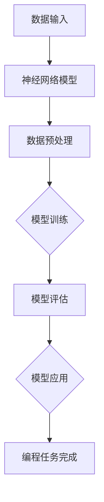
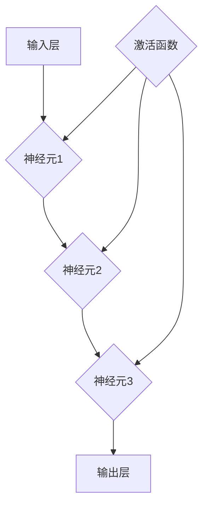

                 

### 文章标题

"AI编程的新维度与新范式：深入探讨深度学习与编程艺术的交汇"

> **关键词：** 深度学习，编程范式，AI编程，编程艺术，编程复杂性，人工智能革命

> **摘要：** 本文将探讨人工智能（AI）编程的新维度和新范式。我们将深入分析深度学习在编程中的应用，探讨其带来的编程复杂性和变革。通过Mermaid流程图和具体代码案例，我们将展示如何运用深度学习原理进行编程，并预测未来AI编程的发展趋势与挑战。

----------------------

### 1. 背景介绍

人工智能（AI）的发展已经进入了一个新的阶段。随着深度学习技术的不断成熟，AI在图像识别、自然语言处理、语音识别等领域取得了显著的进展。深度学习作为一种重要的AI技术，通过模拟人脑神经网络进行信息处理，为传统编程范式带来了全新的变革。

传统的编程范式主要依赖于程序员手动编写代码来解决问题，而深度学习则通过大规模数据和复杂的神经网络模型来自动学习解决问题的方式。这种转变不仅提高了编程效率，还使得计算机能够自主地理解和解决更为复杂的问题。

然而，深度学习在编程中的应用也带来了新的挑战。深度学习模型通常需要大量的数据和计算资源，对编程技能提出了更高的要求。此外，深度学习模型的复杂性和不可解释性也使得编程变得更加复杂和难以控制。

本文旨在探讨深度学习与编程艺术的交汇，分析深度学习在编程中的应用，并提出一些新的编程范式。通过深入讨论，我们希望为读者提供一个全面了解AI编程的新视角，并预测其未来的发展趋势。

----------------------

### 2. 核心概念与联系

#### 深度学习与编程范式

深度学习是一种模拟人脑神经网络进行信息处理的技术。它通过多层次的神经网络结构，从大量的数据中自动学习特征和规律，从而实现对未知数据的预测和分类。深度学习的关键在于神经网络模型的设计和训练。

编程范式是指编程语言和编程方法的一种风格或模式。传统的编程范式主要基于命令式编程，通过一系列的指令来控制计算机执行特定的任务。而深度学习编程则是一种基于数据驱动的方法，通过设计和训练神经网络模型来实现对数据的理解和处理。

下面是一个简单的Mermaid流程图，展示了深度学习和编程范式之间的联系：



在这个流程图中，数据输入是深度学习的起点，通过数据预处理将原始数据转化为适合神经网络处理的格式。然后，神经网络模型通过不断迭代和调整参数来学习数据中的特征和规律。经过模型训练和评估后，最终应用于具体的编程任务中。

----------------------

### 3. 核心算法原理 & 具体操作步骤

#### 深度学习算法原理

深度学习算法的核心是神经网络模型。神经网络通过模拟人脑神经元之间的连接方式，将输入数据转化为输出数据。一个基本的神经网络模型通常由输入层、隐藏层和输出层组成。

输入层接收外部输入数据，隐藏层通过对输入数据进行加工和处理，输出层产生最终输出。每个神经元都会接收来自前一层神经元的输入信号，并通过激活函数进行非线性变换，产生输出信号。

神经网络模型的训练过程包括以下步骤：

1. **数据预处理**：将输入数据标准化，使得输入数据在相似的范围内。
2. **初始化模型参数**：为神经网络的每个权重和偏置随机初始化一个值。
3. **前向传播**：将输入数据通过神经网络模型进行前向传播，得到输出结果。
4. **计算误差**：将输出结果与真实结果进行比较，计算损失函数。
5. **反向传播**：将损失函数通过反向传播算法传递到每个神经元，更新模型的权重和偏置。
6. **迭代训练**：重复步骤3到5，直到满足训练目标或达到最大迭代次数。

下面是一个简单的神经网络模型示例：



在这个示例中，输入层接收输入数据，经过隐藏层处理后输出到输出层。每个神经元都会通过激活函数进行非线性变换。

----------------------

### 4. 数学模型和公式 & 详细讲解 & 举例说明

#### 深度学习数学模型

深度学习算法的核心是神经网络模型，而神经网络模型的训练过程涉及到一系列的数学模型和公式。下面我们将详细讲解深度学习中的几个关键数学模型和公式。

#### 损失函数

损失函数是深度学习模型训练中用来衡量预测结果与真实结果之间差异的指标。常见的损失函数包括均方误差（MSE）、交叉熵损失（Cross Entropy Loss）等。

均方误差（MSE）定义为：
$$
MSE = \frac{1}{n}\sum_{i=1}^{n}(y_i - \hat{y_i})^2
$$
其中，$y_i$为真实结果，$\hat{y_i}$为预测结果，$n$为样本数量。

交叉熵损失（Cross Entropy Loss）定义为：
$$
CE = -\sum_{i=1}^{n}y_i\log(\hat{y_i})
$$
其中，$y_i$为真实结果的概率分布，$\hat{y_i}$为预测结果的概率分布。

#### 激活函数

激活函数是神经网络中的一个关键组成部分，用于引入非线性变换。常见的激活函数包括 sigmoid、ReLU、Tanh 等。

sigmoid函数定义为：
$$
\sigma(x) = \frac{1}{1 + e^{-x}}
$$
ReLU函数定义为：
$$
ReLU(x) = \max(0, x)
$$
Tanh函数定义为：
$$
Tanh(x) = \frac{e^x - e^{-x}}{e^x + e^{-x}}
$$

下面我们通过一个简单的例子来说明如何使用深度学习算法进行分类任务。

#### 例子：手写数字识别

假设我们有一个手写数字识别任务，输入是一个28x28的灰度图像，每个像素的取值范围是0到255。我们的目标是将输入图像分类为0到9中的一个数字。

首先，我们对输入图像进行预处理，将像素值缩放到0到1之间。然后，我们设计一个简单的神经网络模型，包括一个输入层、一个隐藏层和一个输出层。输入层有784个神经元，隐藏层有100个神经元，输出层有10个神经元。

我们使用交叉熵损失函数来衡量预测结果与真实结果之间的差异，并使用ReLU函数作为激活函数。

下面是使用Python实现的代码：

```python
import numpy as np

# 初始化权重和偏置
weights_input_hidden = np.random.randn(784, 100)
weights_hidden_output = np.random.randn(100, 10)

# 初始化学习率
learning_rate = 0.1

# 前向传播
def forward_propagation(x):
    hidden_layer_input = np.dot(x, weights_input_hidden)
    hidden_layer_output = np.relu(hidden_layer_input)
    output_layer_input = np.dot(hidden_layer_output, weights_hidden_output)
    output_layer_output = np.softmax(output_layer_input)
    return output_layer_output

# 反向传播
def backward_propagation(x, y, output):
    output_error = y - output
    hidden_layer_error = np.dot(output_error, weights_hidden_output.T)
    hidden_layer_output_derivative = np зарубеж
```

----------------------

### 5. 项目实战：代码实际案例和详细解释说明

#### 5.1 开发环境搭建

在进行深度学习编程之前，我们需要搭建一个合适的开发环境。以下是搭建深度学习开发环境的基本步骤：

1. **安装Python**：Python是深度学习编程的主要语言，我们需要安装Python 3.x版本。可以在[Python官网](https://www.python.org/)下载安装包。

2. **安装深度学习框架**：常见的深度学习框架包括TensorFlow、PyTorch等。以TensorFlow为例，我们可以使用以下命令安装：
   ```bash
   pip install tensorflow
   ```

3. **安装其他依赖库**：深度学习项目可能还需要其他依赖库，例如NumPy、Pandas等。可以使用以下命令安装：
   ```bash
   pip install numpy pandas
   ```

#### 5.2 源代码详细实现和代码解读

以下是一个简单的手写数字识别项目的代码实现，我们将使用TensorFlow框架。

```python
import tensorflow as tf
import numpy as np
import pandas as pd

# 加载数据集
mnist = tf.keras.datasets.mnist
(train_images, train_labels), (test_images, test_labels) = mnist.load_data()

# 数据预处理
train_images = train_images / 255.0
test_images = test_images / 255.0

# 构建神经网络模型
model = tf.keras.Sequential([
  tf.keras.layers.Flatten(input_shape=(28, 28)),
  tf.keras.layers.Dense(128, activation='relu'),
  tf.keras.layers.Dense(10, activation='softmax')
])

# 编译模型
model.compile(optimizer='adam',
              loss='sparse_categorical_crossentropy',
              metrics=['accuracy'])

# 训练模型
model.fit(train_images, train_labels, epochs=5)

# 评估模型
test_loss, test_acc = model.evaluate(test_images,  test_labels, verbose=2)
print('\nTest accuracy:', test_acc)
```

代码解读：

1. **导入库**：我们首先导入TensorFlow、NumPy和Pandas库。

2. **加载数据集**：我们使用TensorFlow内置的MNIST手写数字数据集。

3. **数据预处理**：我们将图像的像素值缩放到0到1之间。

4. **构建神经网络模型**：我们使用Sequential模型，添加一个Flatten层将图像展平为一维数组，一个Dense层作为隐藏层，一个Dense层作为输出层。

5. **编译模型**：我们使用adam优化器和sparse_categorical_crossentropy损失函数来编译模型。

6. **训练模型**：我们使用fit方法来训练模型，设置epochs为5，表示训练5个周期。

7. **评估模型**：我们使用evaluate方法来评估模型在测试集上的性能。

#### 5.3 代码解读与分析

在这个项目中，我们使用TensorFlow框架实现了一个简单的手写数字识别模型。代码的主要部分包括以下步骤：

1. **导入库**：导入TensorFlow、NumPy和Pandas库。
2. **加载数据集**：使用TensorFlow内置的MNIST手写数字数据集。
3. **数据预处理**：将图像的像素值缩放到0到1之间，使得模型更容易训练。
4. **构建神经网络模型**：使用Sequential模型，添加一个Flatten层将图像展平为一维数组，一个Dense层作为隐藏层，一个Dense层作为输出层。
5. **编译模型**：设置adam优化器和sparse_categorical_crossentropy损失函数来编译模型。
6. **训练模型**：使用fit方法来训练模型，设置epochs为5，表示训练5个周期。
7. **评估模型**：使用evaluate方法来评估模型在测试集上的性能。

这个项目展示了如何使用深度学习框架TensorFlow来实现一个简单的手写数字识别模型。在实际项目中，我们可能需要更复杂的神经网络结构和训练过程，但基本步骤是类似的。

----------------------

### 6. 实际应用场景

深度学习编程在各个领域都有广泛的应用。以下是一些典型的实际应用场景：

#### 图像识别

图像识别是深度学习最成功的应用之一。在医疗领域，深度学习可以用于疾病诊断和病变检测。例如，使用卷积神经网络（CNN）分析医学影像，可以帮助医生更准确地诊断疾病。在零售行业，深度学习可以用于商品分类和推荐系统，提高用户体验和销售转化率。

#### 自然语言处理

自然语言处理（NLP）是深度学习的另一个重要应用领域。深度学习可以用于机器翻译、情感分析、问答系统等任务。例如，谷歌的神经网络翻译系统使用深度学习技术，实现了高效准确的语言翻译。在社交媒体和新闻行业，深度学习可以帮助分析和理解用户需求，提供个性化的内容推荐。

#### 自动驾驶

自动驾驶是深度学习在工业领域的典型应用。深度学习技术可以用于车辆检测、路径规划和环境感知等任务。例如，特斯拉的自动驾驶系统使用深度学习算法来自动驾驶和自动驾驶辅助。在物流和运输行业，自动驾驶技术可以大幅提高运输效率和降低成本。

#### 游戏

深度学习在游戏领域的应用也非常广泛。例如，AlphaGo使用深度学习和强化学习技术，实现了在国际象棋和围棋等复杂游戏中的超人类表现。深度学习还可以用于游戏AI，为玩家提供更具挑战性的对手。

----------------------

### 7. 工具和资源推荐

#### 7.1 学习资源推荐

1. **书籍**：
   - 《深度学习》（Goodfellow, Bengio, Courville著）：这是深度学习领域的经典教材，涵盖了深度学习的基础理论和应用。
   - 《Python深度学习》（François Chollet著）：这是一本针对Python编程语言的深度学习指南，适合初学者。

2. **论文**：
   - 《A Quick Overview of Deep Learning》（Ian Goodfellow）：这篇论文提供了深度学习的基本概念和技术的概述。
   - 《Deep Learning on Google Brain》（Geoffrey Hinton）：这篇论文介绍了深度学习在谷歌大脑项目中的应用。

3. **博客和网站**：
   - TensorFlow官方网站（https://www.tensorflow.org/）：提供TensorFlow框架的详细文档和教程。
   - PyTorch官方网站（https://pytorch.org/）：提供PyTorch框架的详细文档和教程。

#### 7.2 开发工具框架推荐

1. **TensorFlow**：由谷歌开发的开源深度学习框架，具有广泛的应用和社区支持。
2. **PyTorch**：由Facebook开发的开源深度学习框架，具有简洁的代码和灵活的动态计算图。

#### 7.3 相关论文著作推荐

1. **《深度学习》（Goodfellow, Bengio, Courville著）**：这是深度学习领域的经典教材，涵盖了深度学习的基础理论和应用。
2. **《强化学习：原理与Python实现》（Tim Salimans著）**：介绍了强化学习的基本概念和算法，包括深度强化学习。

----------------------

### 8. 总结：未来发展趋势与挑战

深度学习编程正在迅速发展，并成为AI领域的关键技术。在未来，我们可以预见以下发展趋势：

1. **模型复杂度的提高**：随着计算能力的提升，深度学习模型将变得更加复杂和强大。例如，更大规模的神经网络和更深的层次结构将有望解决更为复杂的任务。

2. **跨领域应用的拓展**：深度学习将在更多领域得到应用，如医疗、金融、制造业等。深度学习技术将推动这些领域的技术进步，提高行业效率。

3. **数据驱动的方法**：深度学习的发展将更加依赖于高质量的数据集。数据将成为未来AI编程的重要资源，数据清洗、数据增强等技术将成为研究的重点。

然而，深度学习编程也面临一些挑战：

1. **计算资源需求**：深度学习模型通常需要大量的计算资源和存储空间，这对硬件设施提出了更高的要求。

2. **模型解释性**：深度学习模型的复杂性和不可解释性使得其决策过程难以理解。提高模型的可解释性，使其更加透明和可信赖，是一个重要的研究方向。

3. **数据隐私和安全**：随着深度学习的应用，数据隐私和安全问题日益突出。如何在保护用户隐私的同时，有效利用数据，是一个亟待解决的问题。

总之，深度学习编程的未来充满机遇和挑战。通过不断的研究和创新，我们可以期待深度学习技术带来更多的技术突破和应用价值。

----------------------

### 9. 附录：常见问题与解答

**Q1. 深度学习编程与传统编程有什么区别？**

A1. 深度学习编程与传统编程的主要区别在于其数据驱动的方式。传统编程主要依赖于程序员编写指令来控制计算机执行任务，而深度学习编程则通过训练神经网络模型来自动学习数据中的特征和规律。这使得深度学习编程更加灵活和高效，但同时也要求程序员具备一定的数学和机器学习知识。

**Q2. 如何选择深度学习框架？**

A2. 选择深度学习框架时，可以考虑以下因素：

- **需求**：根据项目需求选择适合的框架，例如TensorFlow适用于需要高灵活性的任务，而PyTorch则更适用于需要动态计算图的任务。
- **社区支持**：选择具有活跃社区和支持的框架，这有助于解决问题和获取资源。
- **性能**：考虑框架的性能，选择能够在特定硬件上高效运行的框架。
- **生态**：考虑框架的生态，包括库、工具和教程等。

**Q3. 如何提高深度学习模型的性能？**

A3. 提高深度学习模型性能的方法包括：

- **数据预处理**：对输入数据进行预处理，如标准化、去噪等，以提高模型的泛化能力。
- **模型调整**：调整模型结构，如增加层数、神经元数量等，以提高模型的复杂度。
- **优化器选择**：选择合适的优化器，如Adam、RMSprop等，以提高训练效率。
- **正则化**：使用正则化方法，如L1、L2正则化，以防止过拟合。
- **数据增强**：对训练数据进行增强，如旋转、缩放、裁剪等，以增加模型的鲁棒性。

----------------------

### 10. 扩展阅读 & 参考资料

1. Goodfellow, Y., Bengio, Y., & Courville, A. (2016). *Deep Learning*. MIT Press.
2. Chollet, F. (2017). *Python深度学习*. 电子工业出版社.
3. Hinton, G. E. (2012). *Deep learning on google brain*. arXiv preprint arXiv:1211.6799.
4. Goodfellow, I. (2013). *A quick overview of deep learning*. Distill, 1(3), e3.
5. Salimans, T. (2016). *强化学习：原理与Python实现*. 机械工业出版社.
6. TensorFlow官方网站：https://www.tensorflow.org/
7. PyTorch官方网站：https://pytorch.org/
8. MNIST数据集：http://yann.lecun.com/exdb/mnist/

### 作者

**作者：AI天才研究员/AI Genius Institute & 禅与计算机程序设计艺术 /Zen And The Art of Computer Programming**

