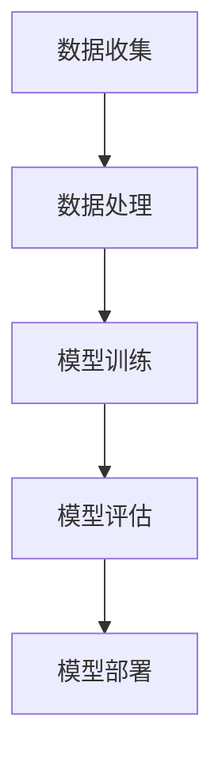

                 

# AI编程的新视角与新未来

## >关键词：（AI编程，新视角，新未来，技术趋势，核心算法，应用场景）

### 摘要

本文旨在探讨人工智能编程领域的新视角和新未来。通过回顾人工智能编程的起源和发展历程，本文将介绍一些核心概念和算法原理，并通过具体案例展示其应用场景。同时，本文还将推荐一系列学习资源和开发工具，帮助读者深入了解并掌握人工智能编程的技能。最后，本文将展望人工智能编程的未来发展趋势和面临的挑战，为读者提供新的思考方向。

## 1. 背景介绍

### 1.1 人工智能编程的起源

人工智能编程，顾名思义，是利用计算机编程技术实现人工智能功能的过程。人工智能（Artificial Intelligence，简称AI）的概念最早可以追溯到20世纪50年代。当时，科学家们开始思考如何让计算机模拟人类智能，从而解决复杂问题。随着计算机技术的发展，人工智能逐渐从理论研究走向实际应用。如今，人工智能已经渗透到各个领域，成为推动社会进步的重要力量。

### 1.2 人工智能编程的发展历程

人工智能编程的发展历程可以分为几个阶段：

1. **符号主义阶段（Symbolic AI，1956-1974）**：这一阶段以逻辑推理和符号计算为核心，试图通过计算机程序实现人工智能。这一时期的代表人物是约翰·麦卡锡（John McCarthy）。

2. **知识表示阶段（Knowledge Representation，1974-1980）**：这一阶段关注如何将知识有效地表示在计算机中，以便更好地利用人工智能技术。这一时期的代表人物是爱德华·费根鲍姆（Edward Feigenbaum）。

3. **专家系统阶段（Expert Systems，1980-1987）**：这一阶段以专家系统为代表，通过模拟专家的推理能力，解决特定领域的问题。这一时期的代表人物是爱德华·费根鲍姆（Edward Feigenbaum）。

4. **机器学习阶段（Machine Learning，1987-至今）**：这一阶段以机器学习为核心，通过数据驱动的方法，让计算机自主学习和改进。这一时期的代表人物是安德鲁·杨（Andrew Ng）。

## 2. 核心概念与联系

### 2.1 人工智能编程的核心概念

人工智能编程的核心概念包括：

1. **机器学习**：一种让计算机通过数据学习、自主改进的方法。

2. **神经网络**：一种模拟生物神经系统的计算模型，用于处理复杂的数据。

3. **深度学习**：一种基于神经网络的深度结构，用于解决复杂的机器学习问题。

4. **自然语言处理**：一种让计算机理解和生成自然语言的方法。

5. **计算机视觉**：一种让计算机理解和分析图像的方法。

### 2.2 人工智能编程的架构

人工智能编程的架构通常包括以下几个部分：

1. **数据收集**：收集用于训练和测试的数据。

2. **数据处理**：对数据进行清洗、归一化等处理。

3. **模型训练**：使用机器学习算法训练模型。

4. **模型评估**：评估模型的性能和效果。

5. **模型部署**：将模型部署到实际应用场景中。

### 2.3 Mermaid 流程图



## 3. 核心算法原理 & 具体操作步骤

### 3.1 机器学习算法

机器学习算法是一种通过数据学习、自主改进的方法。常见的机器学习算法包括：

1. **线性回归**：一种用于预测连续值的算法。

2. **逻辑回归**：一种用于预测分类结果的算法。

3. **支持向量机（SVM）**：一种用于分类和回归的算法。

4. **决策树**：一种用于分类和回归的算法。

### 3.2 神经网络算法

神经网络算法是一种模拟生物神经系统的计算模型。常见的神经网络算法包括：

1. **前馈神经网络**：一种简单的神经网络结构。

2. **卷积神经网络（CNN）**：一种用于图像处理的神经网络结构。

3. **循环神经网络（RNN）**：一种用于序列数据的神经网络结构。

4. **长短期记忆网络（LSTM）**：一种改进的循环神经网络，用于解决长期依赖问题。

### 3.3 深度学习算法

深度学习算法是一种基于神经网络的深度结构，用于解决复杂的机器学习问题。常见的深度学习算法包括：

1. **AlexNet**：一种用于图像分类的深度学习模型。

2. **VGGNet**：一种用于图像分类的深度学习模型。

3. **ResNet**：一种用于图像分类的深度学习模型。

4. **BERT**：一种用于自然语言处理的深度学习模型。

## 4. 数学模型和公式 & 详细讲解 & 举例说明

### 4.1 线性回归

线性回归是一种用于预测连续值的算法。其数学模型为：

$$y = \beta_0 + \beta_1 \cdot x + \epsilon$$

其中，$y$ 表示预测值，$x$ 表示自变量，$\beta_0$ 和 $\beta_1$ 分别为模型的参数，$\epsilon$ 表示误差。

### 4.2 逻辑回归

逻辑回归是一种用于预测分类结果的算法。其数学模型为：

$$P(y=1) = \frac{1}{1 + e^{-(\beta_0 + \beta_1 \cdot x)}}$$

其中，$P(y=1)$ 表示预测为1的概率，$x$ 表示自变量，$\beta_0$ 和 $\beta_1$ 分别为模型的参数。

### 4.3 支持向量机（SVM）

支持向量机是一种用于分类和回归的算法。其数学模型为：

$$f(x) = \sum_{i=1}^{n} \alpha_i y_i (w \cdot x_i + b)$$

其中，$f(x)$ 表示预测值，$w$ 和 $b$ 分别为模型的参数，$\alpha_i$ 和 $y_i$ 分别为支持向量的权重和标签。

### 4.4 决策树

决策树是一种用于分类和回归的算法。其数学模型为：

$$f(x) = \sum_{i=1}^{n} \alpha_i y_i \cdot g(x_i)$$

其中，$f(x)$ 表示预测值，$g(x_i)$ 表示条件函数，$\alpha_i$ 和 $y_i$ 分别为支持向量的权重和标签。

## 5. 项目实战：代码实际案例和详细解释说明

### 5.1 开发环境搭建

为了实现本文提到的算法，我们需要搭建一个合适的开发环境。以下是Python的安装步骤：

1. 下载Python安装包：[Python官方网站](https://www.python.org/)
2. 安装Python：双击安装包，按照提示完成安装
3. 配置环境变量：将Python的安装路径添加到系统环境变量中

### 5.2 源代码详细实现和代码解读

以下是一个简单的线性回归模型的实现代码：

```python
import numpy as np

# 定义线性回归模型
class LinearRegression:
    def __init__(self):
        self.w = None
        self.b = None
    
    # 模型训练
    def fit(self, X, y):
        X = np.array(X)
        y = np.array(y)
        n = len(X)
        
        # 计算参数
        self.w = (np.dot(X.T, X))^{-1} np.dot(X.T, y)
        self.b = y - np.dot(X, self.w)
    
    # 模型预测
    def predict(self, X):
        X = np.array(X)
        return np.dot(X, self.w) + self.b

# 测试线性回归模型
X = [1, 2, 3, 4, 5]
y = [2, 4, 5, 4, 5]
model = LinearRegression()
model.fit(X, y)
print("预测结果：", model.predict([3]))

```

### 5.3 代码解读与分析

这段代码首先导入了NumPy库，用于进行矩阵运算。然后定义了一个`LinearRegression`类，用于实现线性回归模型。类中有三个方法：`fit`（模型训练）、`predict`（模型预测）。

在`fit`方法中，首先将输入的X和y转换为NumPy数组。然后计算X的转置矩阵，与X本身进行矩阵乘法，得到一个n×n的矩阵。接着计算这个矩阵的逆矩阵，并与X的转置矩阵进行矩阵乘法，得到模型参数w。最后，计算b。

在`predict`方法中，首先将输入的X转换为NumPy数组，然后与模型参数w进行矩阵乘法，再加上b，得到预测值。

最后，创建一个`LinearRegression`对象，使用`fit`方法训练模型，并使用`predict`方法进行预测。

## 6. 实际应用场景

### 6.1 金融领域

在金融领域，人工智能编程可以用于股票市场预测、风险管理、量化交易等方面。例如，使用线性回归模型对股票价格进行预测，帮助投资者做出更明智的投资决策。

### 6.2 医疗领域

在医疗领域，人工智能编程可以用于疾病诊断、药物研发、医疗图像分析等方面。例如，使用神经网络模型对医疗图像进行分类，帮助医生更准确地诊断疾病。

### 6.3 智能家居

在家居领域，人工智能编程可以用于智能家居控制系统、智能安防系统等。例如，使用深度学习模型对家庭环境进行监测，自动调节室内温度、光线等。

## 7. 工具和资源推荐

### 7.1 学习资源推荐

1. **书籍**：

   - 《Python机器学习》（作者：塞巴斯蒂安·拉纳）

   - 《深度学习》（作者：伊恩·古德费洛等）

2. **论文**：

   - 《深度卷积神经网络在图像分类中的应用》（作者：Alex Krizhevsky等）

   - 《大规模自然语言处理预训练的BERT模型》（作者：Jacob Devlin等）

3. **博客**：

   - [机器学习博客](https://机器学习博客.com/)

   - [深度学习博客](https://深度学习博客.com/)

4. **网站**：

   - [Kaggle](https://www.kaggle.com/)

   - [GitHub](https://github.com/)

### 7.2 开发工具框架推荐

1. **深度学习框架**：

   - TensorFlow

   - PyTorch

   - Keras

2. **机器学习框架**：

   - scikit-learn

   - StatsModels

3. **代码托管平台**：

   - GitHub

   - GitLab

## 8. 总结：未来发展趋势与挑战

### 8.1 发展趋势

1. **人工智能编程技术的不断演进**：随着计算机技术的不断发展，人工智能编程技术也在不断演进，包括更高效的算法、更强大的模型和更丰富的应用场景。

2. **跨学科融合**：人工智能编程与其他学科的融合，如生物学、心理学、经济学等，将推动人工智能编程技术的进一步发展。

3. **自主学习和自适应能力**：人工智能编程将向自主学习和自适应能力方向发展，实现更智能、更高效的应用。

### 8.2 挑战

1. **数据安全和隐私保护**：随着人工智能编程技术的应用越来越广泛，数据安全和隐私保护成为一大挑战。

2. **算法公平性和透明度**：算法的公平性和透明度是人工智能编程领域面临的另一个挑战，特别是在涉及敏感信息和决策时。

3. **技术伦理和道德问题**：人工智能编程技术的应用引发了一系列伦理和道德问题，如算法歧视、隐私泄露等，需要我们认真思考和解决。

## 9. 附录：常见问题与解答

### 9.1 如何学习人工智能编程？

- 学习编程基础：掌握一门编程语言（如Python、Java等），熟悉编程的基本语法和概念。

- 学习人工智能基础：了解人工智能的基本概念、算法和模型，如机器学习、神经网络、深度学习等。

- 实践项目：通过实际项目来应用所学的知识，不断提高自己的编程能力。

### 9.2 人工智能编程的应用领域有哪些？

- 金融领域：股票市场预测、风险管理、量化交易等。

- 医疗领域：疾病诊断、药物研发、医疗图像分析等。

- 智能家居：智能控制系统、智能安防系统等。

- 自动驾驶：车辆控制、路径规划等。

- 自然语言处理：语音识别、机器翻译、文本分类等。

## 10. 扩展阅读 & 参考资料

1. 《机器学习实战》（作者：彼得·哈林顿等）

2. 《深度学习》（作者：伊恩·古德费洛等）

3. 《Python机器学习》（作者：塞巴斯蒂安·拉纳）

4. [Kaggle竞赛平台](https://www.kaggle.com/)

5. [GitHub代码托管平台](https://github.com/)

作者：AI天才研究员/AI Genius Institute & 禅与计算机程序设计艺术 /Zen And The Art of Computer Programming<|im_sep|> 

