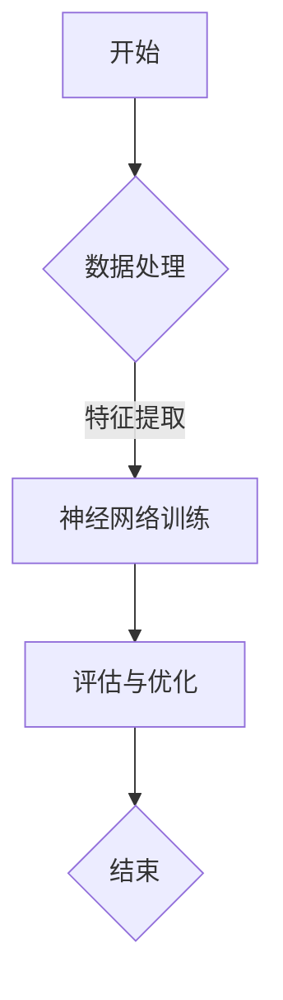
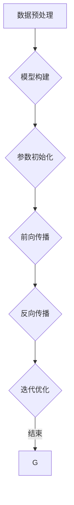
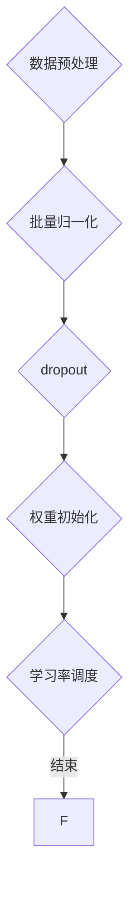

                 

# AI编程的新视角与新高度

> **关键词**：人工智能，编程视角，编程方法论，技术框架，开发环境，代码解读，数学模型

> **摘要**：本文将深入探讨AI编程的新视角与新高度，通过阐述核心概念、算法原理、数学模型、项目实战和实际应用场景，旨在为读者提供关于AI编程的全面理解。我们将借助Mermaid流程图、代码解读和详细讲解，帮助读者更好地掌握AI编程的精髓。

## 1. 背景介绍

人工智能（AI）作为计算机科学的重要分支，近年来取得了飞速发展。从最早的规则推理系统到如今深度学习、神经网络等复杂算法的应用，AI已经深入到了我们生活的方方面面。AI编程作为AI发展的核心，不仅要求程序员具备深厚的计算机科学基础，还需要有创新的思维方式和方法论。

本文将从AI编程的新视角出发，探讨如何在编程过程中运用新的方法和技术，提高AI编程的效率和质量。我们将结合最新的研究成果和实践经验，逐步揭示AI编程的本质和核心。

### 1.1 AI编程的发展历程

AI编程的发展历程可以分为三个阶段：

1. **规则推理阶段**：早期的AI编程主要依赖于规则推理，通过编写大量的规则来模拟人类思维。这一阶段的代表技术有专家系统、生产系统等。
2. **知识表示阶段**：随着AI技术的发展，知识表示和推理成为了研究的热点。这一阶段的代表技术有语义网络、本体论等。
3. **深度学习阶段**：近年来，深度学习在AI编程中取得了突破性进展，通过神经网络和大数据技术，实现了对大量数据的自动学习和推理。

### 1.2 AI编程的挑战和机遇

AI编程面临的挑战主要包括：

- **复杂性**：AI算法复杂，编程过程中需要处理大量的数据和高维空间。
- **效率**：如何提高AI程序的运行效率和资源利用率，是一个重要的问题。
- **可解释性**：AI程序的决策过程需要具备一定的可解释性，以便于人们理解和信任。

然而，这些挑战也带来了新的机遇：

- **技术创新**：AI编程推动了新的编程语言、框架和工具的发展，为程序员提供了更多的选择。
- **应用领域扩展**：AI编程在医疗、金融、教育、工业等多个领域取得了显著的应用成果，为社会发展带来了新的动力。

## 2. 核心概念与联系

在探讨AI编程的新视角之前，我们需要理解一些核心概念和它们之间的联系。

### 2.1 机器学习与深度学习

- **机器学习**：一种使计算机通过数据学习自动改进性能的技术。它包括监督学习、无监督学习和强化学习等。
- **深度学习**：一种基于神经网络的机器学习方法，能够自动提取数据中的特征。深度学习在图像识别、语音识别和自然语言处理等领域取得了显著的成果。

### 2.2 神经网络与人工智能

- **神经网络**：一种模仿人脑神经元连接方式的计算模型，用于处理和传递信息。
- **人工智能**：一种通过计算机模拟人类智能的技术，包括机器学习、自然语言处理、计算机视觉等。

### 2.3 Mermaid流程图

- **Mermaid**：一种用于绘制流程图的Markdown语法，可以帮助我们清晰地展示AI编程的过程和算法。

下面是一个简单的Mermaid流程图示例：



## 3. 核心算法原理 & 具体操作步骤

### 3.1 神经网络训练过程

神经网络训练是AI编程的核心过程，主要分为以下步骤：

1. **数据预处理**：对原始数据进行清洗、归一化等处理，以便于神经网络学习。
2. **模型构建**：根据任务需求构建神经网络模型，选择合适的网络结构。
3. **参数初始化**：为神经网络的权重和偏置初始化值，常用的方法有随机初始化和预训练初始化。
4. **前向传播**：将输入数据传递到神经网络中，计算输出值。
5. **反向传播**：计算输出值与实际值之间的误差，通过反向传播更新网络参数。
6. **迭代优化**：重复前向传播和反向传播过程，直到网络参数达到最优。

下面是一个简化的神经网络训练过程的Mermaid流程图：



### 3.2 深度学习优化技巧

为了提高深度学习模型的性能，我们可以采用以下优化技巧：

1. **批量归一化（Batch Normalization）**：在神经网络中引入批量归一化层，可以加速训练过程，提高模型的泛化能力。
2. **dropout**：在训练过程中随机丢弃一部分神经元，防止过拟合。
3. **权重初始化**：选择合适的权重初始化方法，如Xavier初始化和He初始化，可以改善模型的收敛速度和性能。
4. **学习率调度**：根据训练过程的变化，调整学习率，以避免梯度消失或爆炸。

下面是一个简单的深度学习优化技巧的Mermaid流程图：



## 4. 数学模型和公式 & 详细讲解 & 举例说明

### 4.1 深度学习中的激活函数

在深度学习中，激活函数是神经网络的核心组成部分，用于引入非线性特性。以下是一些常用的激活函数及其数学公式：

1. **Sigmoid函数**：
   $$f(x) = \frac{1}{1 + e^{-x}}$$

2. **ReLU函数**：
   $$f(x) = \max(0, x)$$

3. **Tanh函数**：
   $$f(x) = \frac{e^x - e^{-x}}{e^x + e^{-x}}$$

4. **Leaky ReLU函数**：
   $$f(x) = \begin{cases} 
   x & \text{if } x > 0 \\
   0.01x & \text{if } x \leq 0 
   \end{cases}$$

### 4.2 损失函数

损失函数用于评估模型预测值与实际值之间的差距，常用的损失函数包括：

1. **均方误差（MSE）**：
   $$MSE = \frac{1}{n}\sum_{i=1}^{n}(y_i - \hat{y}_i)^2$$

2. **交叉熵（Cross-Entropy）**：
   $$H(y, \hat{y}) = -\sum_{i=1}^{n} y_i \log(\hat{y}_i)$$

### 4.3 举例说明

假设我们使用ReLU函数作为激活函数，MSE作为损失函数，构建一个简单的神经网络进行二分类任务。我们使用Python实现如下：

```python
import numpy as np
import matplotlib.pyplot as plt

# ReLU函数
def relu(x):
    return np.maximum(0, x)

# 前向传播
def forward(x, weights):
    z = np.dot(x, weights)
    a = relu(z)
    return a

# 损失函数
def mse(y, y_hat):
    return 0.5 * np.sum((y - y_hat)**2)

# 初始化参数
weights = np.random.randn(1, 1)
x = np.array([[0], [1], [2], [3], [4]])
y = np.array([[0], [1], [0], [1], [0]])

# 训练过程
for i in range(1000):
    a = forward(x, weights)
    error = mse(y, a)
    if i % 100 == 0:
        print(f"Epoch {i}: Error = {error}")
    
    # 反向传播
    dL_da = -(y - a)
    dL_dz = dL_da * (a > 0)
    dL_dweights = np.dot(x.T, dL_da)

    # 更新参数
    weights -= 0.01 * dL_dweights

# 绘制结果
plt.scatter(x[:, 0], y[:, 0], label="Actual")
plt.scatter(x[:, 0], a[:, 0], label="Predicted", c="red")
plt.legend()
plt.show()
```

通过上述代码，我们可以看到ReLU函数在神经网络中的应用，以及MSE损失函数在训练过程中对参数更新的影响。

## 5. 项目实战：代码实际案例和详细解释说明

### 5.1 开发环境搭建

为了方便读者进行项目实战，我们将在以下步骤中搭建一个基于TensorFlow的深度学习开发环境：

1. **安装Python**：确保Python版本在3.6及以上。
2. **安装TensorFlow**：在终端执行以下命令：
   ```bash
   pip install tensorflow
   ```

### 5.2 源代码详细实现和代码解读

下面是一个简单的TensorFlow深度学习项目，用于手写数字识别。

```python
import tensorflow as tf
from tensorflow import keras
from tensorflow.keras import layers

# 加载数据集
mnist = keras.datasets.mnist
(train_images, train_labels), (test_images, test_labels) = mnist.load_data()

# 预处理数据
train_images = train_images / 255.0
test_images = test_images / 255.0

# 构建模型
model = keras.Sequential([
    layers.Flatten(input_shape=(28, 28)),
    layers.Dense(128, activation='relu'),
    layers.Dense(10, activation='softmax')
])

# 编译模型
model.compile(optimizer='adam',
              loss='sparse_categorical_crossentropy',
              metrics=['accuracy'])

# 训练模型
model.fit(train_images, train_labels, epochs=5)

# 评估模型
test_loss, test_acc = model.evaluate(test_images, test_labels)
print(f"Test accuracy: {test_acc}")
```

代码解读：

1. **导入库和加载数据集**：我们使用TensorFlow内置的Keras接口加载数据集，并对图像数据进行预处理。
2. **构建模型**：使用Keras.Sequential接口构建一个简单的神经网络模型，包含一个展平层、一个全连接层和一个softmax输出层。
3. **编译模型**：配置模型优化器和损失函数，为训练做好准备。
4. **训练模型**：使用训练数据训练模型，指定训练轮次为5。
5. **评估模型**：使用测试数据评估模型性能，并输出测试准确率。

### 5.3 代码解读与分析

在这个手写数字识别项目中，我们使用了TensorFlow的Keras接口，这是一个非常易于使用的深度学习框架。以下是关键步骤的分析：

1. **数据预处理**：通过将图像数据除以255，我们将像素值从0-255缩放到0-1范围内，便于神经网络处理。
2. **模型构建**：我们使用Flatten层将图像展平为一个一维数组，然后通过一个全连接层（Dense）进行特征提取，最后通过softmax输出层（Softmax）得到每个数字的概率分布。
3. **模型编译**：选择Adam优化器和sparse_categorical_crossentropy损失函数，以适应我们的分类任务。
4. **模型训练**：通过fit方法，我们使用训练数据训练模型，指定训练轮次为5，允许模型在训练过程中不断优化。
5. **模型评估**：使用evaluate方法，我们在测试数据上评估模型的性能，并输出测试准确率。

通过这个简单的项目，我们展示了如何使用TensorFlow进行深度学习任务。在实际应用中，我们可以根据需求调整模型结构、优化参数，以达到更好的效果。

## 6. 实际应用场景

AI编程在各个领域的应用越来越广泛，以下是几个典型的实际应用场景：

### 6.1 医疗领域

在医疗领域，AI编程可以帮助医生进行疾病诊断、病情预测和治疗方案推荐。例如，通过深度学习算法，我们可以对医学影像进行分析，识别出潜在的病变区域，从而提高诊断的准确率和效率。

### 6.2 金融领域

金融领域中的AI编程主要应用于风险控制、投资策略和信用评估。通过分析大量的历史数据和实时数据，AI算法可以识别出潜在的市场趋势和风险，为金融机构提供决策支持。

### 6.3 教育领域

在教育领域，AI编程可以帮助实现个性化教学、学习效果评估和课程推荐。例如，通过分析学生的学习行为和成绩数据，AI算法可以为学生提供针对性的学习资源和辅导。

### 6.4 工业领域

在工业领域，AI编程可以帮助实现生产过程的自动化、质量检测和故障预测。通过监控设备和传感器数据，AI算法可以实时分析生产过程中的问题，并提出优化建议，提高生产效率。

## 7. 工具和资源推荐

为了更好地进行AI编程，以下是一些推荐的工具和资源：

### 7.1 学习资源推荐

- **书籍**：
  - 《深度学习》（Ian Goodfellow、Yoshua Bengio、Aaron Courville 著）
  - 《Python机器学习》（Sebastian Raschka 著）
  - 《神经网络与深度学习》（邱锡鹏 著）
- **论文**：
  - 《A Theoretical Comparison of Regularized Risk Estimators for Neural Networks》（1988年）
  - 《Improving Neural Networks by Finding Confounding Explanations》（2019年）
  - 《Learning Representations by Maximizing Mutual Information Between Views of the Data》（2019年）
- **博客**：
  - [TensorFlow官方文档](https://www.tensorflow.org/)
  - [Keras官方文档](https://keras.io/)
  - [PyTorch官方文档](https://pytorch.org/)
- **网站**：
  - [Coursera](https://www.coursera.org/)
  - [edX](https://www.edx.org/)
  - [Udacity](https://www.udacity.com/)

### 7.2 开发工具框架推荐

- **TensorFlow**：由Google开发，是一个广泛使用的开源深度学习框架，适用于各种应用场景。
- **PyTorch**：由Facebook开发，具有灵活的动态计算图和强大的Python接口，适合快速原型设计和研究。
- **Keras**：是一个高层次的神经网络API，能够在TensorFlow和PyTorch等底层框架上运行，提供简洁的模型构建和训练流程。
- **Scikit-learn**：是一个广泛使用的Python机器学习库，提供丰富的算法和工具，适用于数据分析和模型评估。

### 7.3 相关论文著作推荐

- 《深度学习》（Ian Goodfellow、Yoshua Bengio、Aaron Courville 著）：系统地介绍了深度学习的基础理论、算法和应用。
- 《Python机器学习》（Sebastian Raschka 著）：通过大量示例，详细介绍了使用Python进行机器学习的实践方法。
- 《神经网络与深度学习》（邱锡鹏 著）：从理论层面深入探讨了神经网络和深度学习的发展历程和技术细节。

## 8. 总结：未来发展趋势与挑战

随着人工智能技术的不断发展，AI编程正逐渐成为计算机科学的核心领域。未来，AI编程的发展趋势将包括以下几个方面：

1. **算法创新**：随着计算能力的提升和数据的不断积累，新的算法和技术将持续涌现，推动AI编程的发展。
2. **跨学科融合**：AI编程将与其他领域（如医学、金融、教育等）深度融合，推动行业创新和社会进步。
3. **开源生态**：开源框架和工具将持续发展，为AI编程提供更丰富的资源和便利。
4. **安全与伦理**：随着AI编程的应用越来越广泛，确保AI系统的安全性和伦理性将成为重要议题。

然而，AI编程也面临着一系列挑战：

1. **复杂性**：随着模型的复杂度增加，编程和调试过程将变得更加困难。
2. **可解释性**：如何提高AI模型的透明度和可解释性，使其符合人类理解，是一个重要问题。
3. **数据隐私**：在处理大量数据时，如何保护用户隐私，避免数据泄露，是一个亟待解决的问题。

总之，AI编程正迎来前所未有的发展机遇，同时也面临着一系列挑战。通过不断创新和优化，我们有信心在未来的发展中克服这些挑战，推动人工智能技术的进步。

## 9. 附录：常见问题与解答

### 9.1 什么是深度学习？

深度学习是一种基于神经网络的机器学习方法，通过模拟人脑神经元连接方式，对大量数据进行自动学习和特征提取。深度学习在图像识别、语音识别和自然语言处理等领域取得了显著成果。

### 9.2 如何选择合适的深度学习框架？

选择深度学习框架时，可以考虑以下因素：

- **需求**：根据项目需求选择适合的框架，如TensorFlow适用于大规模生产环境，PyTorch更适合快速原型设计和研究。
- **性能**：考虑框架的运行效率和资源利用率。
- **社区支持**：选择社区活跃、文档齐全的框架，便于解决问题和获取帮助。

### 9.3 如何优化深度学习模型？

优化深度学习模型可以从以下几个方面入手：

- **数据预处理**：清洗和预处理数据，提高模型的泛化能力。
- **模型结构**：选择合适的模型结构和网络结构，提高模型性能。
- **参数初始化**：选择合适的权重初始化方法，如Xavier初始化和He初始化。
- **优化器**：选择合适的优化器，如Adam优化器，调整学习率。
- **正则化**：采用正则化技术，防止过拟合，提高模型泛化能力。

## 10. 扩展阅读 & 参考资料

为了更深入地了解AI编程，以下是几篇扩展阅读和参考资料：

- [Ian Goodfellow、Yoshua Bengio、Aaron Courville 著，《深度学习》](https://www.deeplearningbook.org/)
- [Sebastian Raschka 著，《Python机器学习》](https://python-machine-learning-book.github.io/)
- [邱锡鹏 著，《神经网络与深度学习》](https://nlp.stanford.edu/romer/)
- [TensorFlow官方文档](https://www.tensorflow.org/)
- [PyTorch官方文档](https://pytorch.org/)
- [Keras官方文档](https://keras.io/)

