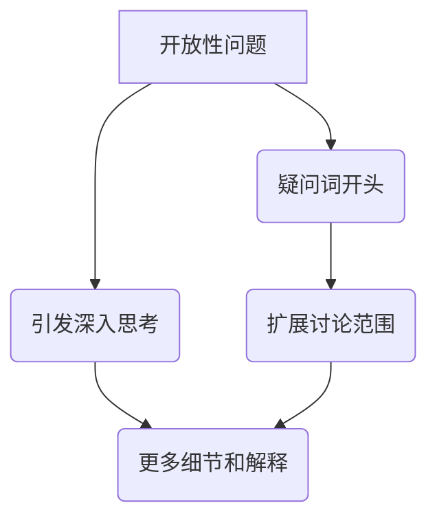
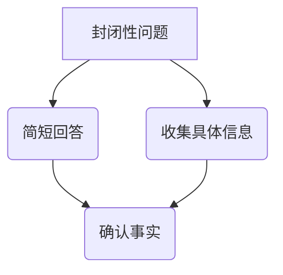
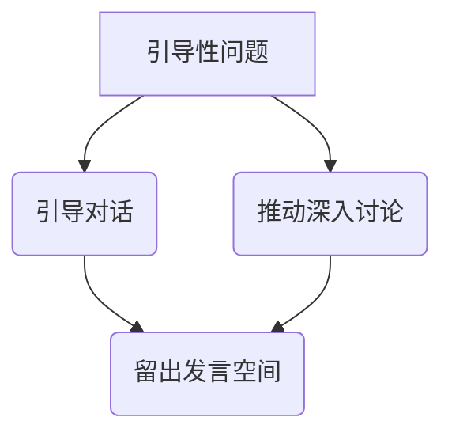
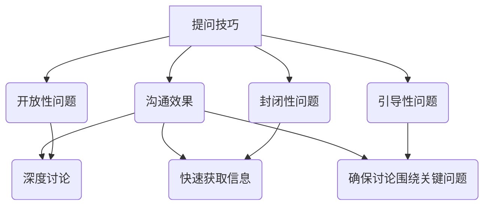

                 

### 背景介绍

提问技巧，作为沟通的核心元素之一，一直以来都在各种场合中被广泛应用。无论是教育、工作、商业谈判，还是日常生活中的人际交往，提问技巧都发挥着至关重要的作用。有效的提问不仅能帮助我们更好地理解他人，还能促进信息的流动和沟通的深入。对于管理者而言，提问技巧尤为重要，因为它直接影响团队的合作效率和企业的发展方向。

本文将深入探讨提问技巧在管理者沟通中的重要性，并提供一系列实用的策略和技巧，帮助管理者提升沟通效果。我们将从以下几个方面展开讨论：

1. **提问技巧的基本原理**：介绍提问技巧的核心概念和基础原理，如开放性问题、封闭性问题和引导性问题等。
2. **不同类型的提问方式**：分析不同类型提问方式的特点、适用场景及其优缺点，帮助管理者根据具体情境选择合适的提问策略。
3. **提问技巧的实践应用**：通过具体案例和实例，展示提问技巧在实际工作中的应用方法和技巧。
4. **提升提问效果的策略**：提供一系列实用的策略和技巧，帮助管理者提高提问的质量和效果。
5. **实际应用场景**：探讨提问技巧在不同工作场景下的应用，如团队会议、项目讨论、绩效评估等。
6. **工具和资源推荐**：推荐一些有助于学习和提升提问技巧的书籍、工具和资源。
7. **未来发展趋势与挑战**：总结当前提问技巧的发展趋势和未来可能面临的挑战，为管理者提供持续提升沟通能力的方向。

通过本文的深入探讨，希望管理者能够更好地掌握提问技巧，提升沟通能力，从而更好地实现团队协作和企业发展目标。

### 核心概念与联系

在探讨提问技巧之前，我们首先需要理解一些核心概念，这些概念将帮助我们构建有效的提问框架。以下是本文将涉及的核心概念和它们之间的联系：

#### 开放性问题（Open-Ended Questions）

开放性问题是指那些能够引发深入思考、扩展讨论范围的问题，通常以疑问词（如“谁”、“什么”、“为什么”、“如何”等）开头。这类问题的特点在于它们无法简单地用一个词或一句话来回答，而是需要更多细节和解释。

**Mermaid 流程图**：



#### 封闭性问题（Closed-Ended Questions）

封闭性问题是指那些能够直接回答，通常只需要“是”或“否”等简短回答的问题。这类问题常用于收集具体信息或确认事实。

**Mermaid 流程图**：



#### 引导性问题（Facilitative Questions）

引导性问题是指那些旨在引导对话、推动讨论深入的问题。这类问题通常具有一定的引导性，但不会过于直接，从而给对方留下思考和发言的空间。

**Mermaid 流程图**：



#### 提问技巧与沟通效果

不同的提问方式会对沟通效果产生不同的影响。开放性问题能够促进深度讨论和思想碰撞，封闭性问题有助于快速获取具体信息，而引导性问题则能够引导对话方向，确保讨论围绕关键问题展开。

**Mermaid 流程图**：



通过理解这些核心概念和它们之间的联系，管理者可以更灵活地运用不同的提问技巧，根据具体情境选择最合适的提问方式，从而提升沟通效果和团队协作效率。

### 核心算法原理 & 具体操作步骤

在深入探讨提问技巧之前，我们需要了解一些核心算法原理和具体操作步骤。这些原理和步骤将帮助我们理解和运用不同类型的提问技巧，从而提升沟通效果。以下是三个关键概念：开放性问题、封闭性问题和引导性问题的算法原理及操作步骤。

#### 1. 开放性问题的算法原理 & 操作步骤

**算法原理**：开放性问题的核心在于引发深入的讨论和思考，通常使用疑问词（如“谁”、“什么”、“为什么”、“如何”等）开头，引导对方提供详细的信息和解释。

**操作步骤**：

- **步骤一**：选择适当的疑问词开头，如“为什么”、“如何”等。
- **步骤二**：确保问题具有开放性，即问题的答案不能简单用一个词或一句话来回答。
- **步骤三**：听取对方的回答，并进一步提问以深入讨论。

**示例**：

- **步骤一**：“你为什么认为这个方案是最好的？”
- **步骤二**：“你能详细解释一下这个方案的具体实施步骤吗？”
- **步骤三**：“这个方案的优点和缺点是什么？”

通过这些步骤，管理者可以引导团队成员提供详细的见解和思考，从而促进深度讨论和思想碰撞。

#### 2. 封闭性问题的算法原理 & 操作步骤

**算法原理**：封闭性问题的核心在于获取具体信息或确认事实，通常只需要“是”或“否”等简短回答。

**操作步骤**：

- **步骤一**：构建简洁、具体的问题，明确询问对象和目的。
- **步骤二**：确保问题可以简单回答，避免过于复杂或模糊。
- **步骤三**：根据回答进行后续的决策或行动。

**示例**：

- **步骤一**：“今天会议的议程是否已经准备好？”
- **步骤二**：“团队成员是否都到齐了？”
- **步骤三**：（根据回答）决定是否开始会议或等待成员到齐。

通过这些步骤，管理者可以快速获取具体信息，确保会议或项目按计划进行。

#### 3. 引导性问题的算法原理 & 操作步骤

**算法原理**：引导性问题的核心在于引导对话方向，确保讨论围绕关键问题展开，同时给对方留下思考和发言的空间。

**操作步骤**：

- **步骤一**：选择具有引导性的问题，但不过于直接，避免对方产生抵触情绪。
- **步骤二**：确保问题具有开放性，鼓励对方提供详细的回答。
- **步骤三**：在对方回答后，根据内容进一步提问，以推动对话深入。

**示例**：

- **步骤一**：“你对这个项目的进展有什么看法？”
- **步骤二**：“你觉得我们如何能更好地解决当前面临的挑战？”
- **步骤三**：“你是否有具体的建议或方案可以分享？”

通过这些步骤，管理者可以引导团队成员围绕关键问题展开讨论，确保团队协作高效。

#### 总结

理解并运用这些核心算法原理和具体操作步骤，管理者可以在不同情境下选择合适的提问技巧，提升沟通效果。开放性问题促进深度讨论，封闭性问题快速获取具体信息，引导性问题确保讨论围绕关键问题展开。通过灵活运用这些提问技巧，管理者可以更好地实现团队协作和企业发展目标。

### 数学模型和公式 & 详细讲解 & 举例说明

在深入探讨提问技巧的数学模型和公式时，我们首先需要理解一些基本的数学原理和逻辑框架，这些原理和框架将帮助我们设计和评估不同的提问策略。以下是三个关键的数学模型：提问效果评估模型、信息获取模型和对话引导模型，我们将详细讲解这些模型，并提供具体的公式和例子来说明它们的实际应用。

#### 1. 提问效果评估模型

**模型描述**：提问效果评估模型用于评估不同提问策略对沟通效果的影响。该模型基于问卷调查和数据分析，通过量化指标来评估提问的有效性。

**公式**：

\[ E = f(P, R, S) \]

其中：
- \( E \)：提问效果（Effectiveness）
- \( P \)：问题的质量（Quality of the question）
- \( R \)：回答的质量（Quality of the response）
- \( S \)：情境适应性（Suitability of the question in the context）

**详细讲解**：

- **问题的质量**：问题的质量直接影响回答的质量。高质量的问题通常清晰、明确、具有启发性。
- **回答的质量**：回答的质量反映了提问的深入程度和回答的实用性。深层次的回答能够提供更多的信息和见解。
- **情境适应性**：问题的情境适应性确保提问与具体讨论内容相关，避免偏离主题。

**举例说明**：

假设在一个团队项目中，项目经理提出以下两个问题：

- **问题1**：“你对当前的项目进度有何看法？”
- **问题2**：“你能详细描述一下我们下周的计划吗？”

**评估**：

- **问题的质量**：问题2比问题1更具质量，因为它更具体，更能够引导对方提供详细的回答。
- **回答的质量**：问题2可能引发更深层次的回答，从而提供更具体的信息和见解。
- **情境适应性**：问题2更适合当前的项目进度讨论，因为它直接与项目计划相关。

通过提问效果评估模型，项目经理可以判断问题2的提问效果更高，有助于提升沟通效果。

#### 2. 信息获取模型

**模型描述**：信息获取模型用于描述如何在沟通过程中获取所需的信息。该模型通过设计合理的问题来引导对方提供所需的信息。

**公式**：

\[ I = f(Q, O, C) \]

其中：
- \( I \)：信息量（Information Quantity）
- \( Q \)：问题的数量（Quantity of questions）
- \( O \)：问题的开放性（Openness of questions）
- \( C \)：信息的准确性（Accuracy of information）

**详细讲解**：

- **问题的数量**：问题的数量直接影响信息量。合理数量的提问能够确保获取足够的信息，但过多的问题可能导致信息过载。
- **问题的开放性**：开放性问题是获取详细信息的关键。开放性问题能够引导对方提供更多的细节和解释。
- **信息的准确性**：信息的准确性取决于提问的清晰度和对方的回答的真实性。

**举例说明**：

在一个市场调研项目中，市场分析师提出以下两个问题：

- **问题1**：“你对我们的产品有什么建议？”
- **问题2**：“你能详细描述一下你在使用我们的产品时遇到的问题吗？”

**评估**：

- **信息的数量**：问题2可能引发更多的细节和解释，从而提供更多的信息。
- **问题的开放性**：问题2更具开放性，能够引导对方提供更详细的信息。
- **信息的准确性**：由于问题2更具开放性，回答的准确性可能更高。

通过信息获取模型，市场分析师可以设计合理的问题，确保获取准确、详细的市场反馈。

#### 3. 对话引导模型

**模型描述**：对话引导模型用于描述如何在沟通过程中引导对话方向，确保讨论围绕关键问题展开。

**公式**：

\[ D = f(G, Q, R) \]

其中：
- \( D \)：对话引导度（Dialogue Guidance）
- \( G \)：引导性问题（Guiding questions）
- \( Q \)：问题的质量（Quality of questions）
- \( R \)：回答的反馈（Feedback on responses）

**详细讲解**：

- **引导性问题**：引导性问题旨在引导对话方向，确保讨论围绕关键问题展开。这类问题通常具有一定的引导性和启发性。
- **问题的质量**：高质量的问题能够更好地引导对话，促使对方提供相关和有价值的回答。
- **回答的反馈**：及时的反馈能够激励对方继续参与讨论，并提供更多有价值的信息。

**举例说明**：

在一个项目评审会议上，项目经理提出以下两个问题：

- **问题1**：“你对项目进度有什么建议？”
- **问题2**：“在当前进度下，你认为我们如何能够确保项目按期完成？”

**评估**：

- **对话引导度**：问题2比问题1更具引导性，因为它直接关注项目进度和潜在的问题，有助于确保讨论围绕关键问题展开。
- **问题的质量**：问题2的质量更高，因为它更具体，能够引导对方提供更具操作性的建议。
- **回答的反馈**：项目经理可以通过积极的反馈，如肯定对方的观点或提出进一步的问题，激励团队成员继续参与讨论。

通过对话引导模型，项目经理可以设计引导性问题，确保项目评审会议高效、有序地进行。

#### 总结

提问技巧的数学模型和公式为我们提供了一套系统的方法来设计和评估提问策略。通过提问效果评估模型，我们可以评估提问对沟通效果的影响；通过信息获取模型，我们可以设计有效的问题以获取所需信息；通过对话引导模型，我们可以引导对话方向，确保讨论围绕关键问题展开。通过灵活运用这些模型和公式，管理者可以显著提升沟通效果，实现更高效的团队协作。

### 项目实战：代码实际案例和详细解释说明

为了更好地理解提问技巧在实际项目中的应用，我们将通过一个具体的代码案例来展示提问技巧的实践方法和详细解释说明。

#### 项目背景

假设我们正在开发一个在线教育平台，其中包含了一个功能模块，用于教师和学生之间的互动和反馈。在这个模块中，教师可以发起提问，学生需要回答问题并提交反馈。为了提高互动质量，我们决定采用一系列提问技巧来优化教师的提问方式。

#### 开发环境搭建

1. **技术栈**：
   - 前端：React.js
   - 后端：Node.js + Express
   - 数据库：MongoDB

2. **开发工具**：
   - 环境变量管理：`.env`
   - 包管理工具：npm
   - 版本控制：Git

3. **开发步骤**：
   - 创建项目文件夹
   - 初始化项目结构
   - 安装依赖包
   - 配置环境变量
   - 编写前端代码
   - 编写后端代码
   - 集成数据库

#### 源代码详细实现和代码解读

**前端代码：**

```jsx
// Teacher组件，用于教师发起提问
class Teacher extends React.Component {
  state = {
    question: '',
  };

  handleInputChange = (e) => {
    this.setState({ question: e.target.value });
  };

  handleSubmit = () => {
    if (this.state.question) {
      this.props.onSubmit(this.state.question);
      this.setState({ question: '' });
    } else {
      alert('请填写问题！');
    }
  };

  render() {
    return (
      <div>
        <input
          type="text"
          placeholder="发起提问..."
          value={this.state.question}
          onChange={this.handleInputChange}
        />
        <button onClick={this.handleSubmit}>提交</button>
      </div>
    );
  }
}

// Student组件，用于学生回答问题
class Student extends React.Component {
  state = {
    answer: '',
  };

  handleInputChange = (e) => {
    this.setState({ answer: e.target.value });
  };

  handleSubmit = () => {
    if (this.state.answer) {
      this.props.onSubmit(this.state.answer);
      this.setState({ answer: '' });
    } else {
      alert('请填写回答！');
    }
  };

  render() {
    return (
      <div>
        <input
          type="text"
          placeholder="提交回答..."
          value={this.state.answer}
          onChange={this.handleInputChange}
        />
        <button onClick={this.handleSubmit}>提交</button>
      </div>
    );
  }
}
```

**后端代码：**

```javascript
// Express路由，处理提问和回答
const express = require('express');
const app = express();
const port = 3000;

app.use(express.json());

// 发起提问路由
app.post('/teacher/question', (req, res) => {
  const question = req.body.question;
  // 存储问题到数据库
  // ...
  res.json({ message: '提问成功' });
});

// 提交回答路由
app.post('/student/answer', (req, res) => {
  const answer = req.body.answer;
  // 存储回答到数据库
  // ...
  res.json({ message: '回答成功' });
});

app.listen(port, () => {
  console.log(`Server listening at http://localhost:${port}`);
});
```

**代码解读与分析**

1. **Teacher组件**：
   - **功能**：允许教师输入并提交问题。
   - **关键代码**：
     - `handleInputChange`：用于处理输入框的变化，更新状态。
     - `handleSubmit`：提交问题，确保问题不为空，然后调用父组件的`onSubmit`方法。
   
2. **Student组件**：
   - **功能**：允许学生输入并提交回答。
   - **关键代码**：
     - `handleInputChange`：用于处理输入框的变化，更新状态。
     - `handleSubmit`：提交回答，确保回答不为空，然后调用父组件的`onSubmit`方法。

3. **后端代码**：
   - **功能**：处理前端提交的提问和回答，并将其存储到数据库。
   - **关键代码**：
     - `app.post('/teacher/question', ...)`：处理教师提交的提问，并将其存储到数据库。
     - `app.post('/student/answer', ...)`：处理学生提交的回答，并将其存储到数据库。

#### 提问技巧的实际应用

1. **开放性问题**：
   - **示例**：“你对课程内容有什么疑问或建议？”
   - **作用**：鼓励学生提出具体问题或建议，促进课堂互动和参与。

2. **封闭性问题**：
   - **示例**：“你是否已经完成了本周的作业？”
   - **作用**：获取具体信息，确保学生按时完成任务。

3. **引导性问题**：
   - **示例**：“你认为我们如何在课堂中更好地应用所学知识？”
   - **作用**：引导学生思考如何将理论知识应用于实际，提高学习效果。

通过上述代码案例和实际应用，我们可以看到提问技巧在在线教育平台中的重要性。通过合理运用开放性问题、封闭性问题和引导性问题，教师可以激发学生的思考和参与，从而提升学习效果和课堂互动质量。

### 实际应用场景

提问技巧在管理者沟通中的应用场景多种多样，以下是一些常见的场景及其具体应用策略：

#### 1. 团队会议

**场景描述**：团队会议是管理者与团队成员沟通的重要平台，通过会议，管理者可以了解团队成员的工作进展、问题和需求。

**应用策略**：

- **开放性问题**：在会议开场时，管理者可以使用开放性问题，如“大家对本周的工作有什么反馈？”或“我们如何改进目前的流程？”来引导团队成员发表意见。
- **引导性问题**：在讨论关键问题时，管理者可以使用引导性问题，如“你认为我们如何解决这个问题？”或“你对这个方案的优缺点有什么看法？”来引导讨论方向。
- **封闭性问题**：在获取具体信息时，管理者可以使用封闭性问题，如“本周的任务进度是多少？”或“谁负责这个任务的完成？”来确保会议的效率。

**示例**：

- **开放性问题**：“你对当前的项目进度有什么看法？”
- **引导性问题**：“在解决这个问题的过程中，我们有哪些可行的方案？”
- **封闭性问题**：“谁将负责这个新任务的完成？”

#### 2. 项目讨论

**场景描述**：项目讨论是团队协作过程中必不可少的一部分，通过讨论，团队成员可以共同解决项目中的难题和挑战。

**应用策略**：

- **开放性问题**：在项目讨论开始时，管理者可以使用开放性问题，如“这个项目中我们面临的最大挑战是什么？”或“你觉得如何能够提升项目效率？”来激发团队成员的思考。
- **引导性问题**：在讨论项目细节时，管理者可以使用引导性问题，如“你认为我们应该在哪些方面进行改进？”或“你是否有具体的建议或方案可以分享？”来确保讨论围绕关键问题展开。
- **封闭性问题**：在决策过程中，管理者可以使用封闭性问题，如“这个方案是否可以实施？”或“我们需要多少时间来完成这个任务？”来快速获取团队成员的意见。

**示例**：

- **开放性问题**：“你对项目中的技术难题有何见解？”
- **引导性问题**：“在优化项目流程方面，你有何建议？”
- **封闭性问题**：“我们是否可以在下周完成这个任务？”

#### 3. 绩效评估

**场景描述**：绩效评估是管理者与团队成员沟通的重要环节，通过评估，管理者可以了解团队成员的工作表现和成长情况。

**应用策略**：

- **开放性问题**：在绩效评估时，管理者可以使用开放性问题，如“你认为自己在本季度的工作中取得了哪些成就？”或“你觉得自己的哪些方面还有待提升？”来鼓励团队成员自我反思。
- **引导性问题**：在讨论绩效问题时，管理者可以使用引导性问题，如“你认为你的工作表现如何影响团队的整体效率？”或“你希望从管理层获得哪些支持？”来引导讨论方向。
- **封闭性问题**：在总结评估时，管理者可以使用封闭性问题，如“你对你的绩效评估结果是否满意？”或“你是否有具体的改进计划？”来获取团队成员的意见和反馈。

**示例**：

- **开放性问题**：“你在工作中遇到的最大的挑战是什么？”
- **引导性问题**：“你的工作表现如何与团队的总体目标相吻合？”
- **封闭性问题**：“你计划如何提升自己的工作效率？”

通过灵活运用开放性问题、引导性问题和封闭性问题，管理者可以在不同场景下有效地引导讨论、获取信息、提升沟通效果，从而实现团队协作和企业发展目标。

### 工具和资源推荐

为了帮助管理者更好地掌握和运用提问技巧，以下是一些学习资源、开发工具和相关论文著作的推荐，这些资源将有助于提升提问能力，优化沟通效果。

#### 1. 学习资源推荐

- **书籍**：
  - 《有效沟通的艺术》（"The Art of Communicating"）- Richard M. DeVos
  - 《提问的力量》（"The Power of Questioning"）- Sheryl Sandberg & Adam Grant
  - 《如何提问》（"How to Ask"）- Phoebe Lore
- **在线课程**：
  - Coursera上的“沟通技巧”（"Effective Communication Skills: Writing, Design, and Presentation"）
  - Udemy上的“提问与聆听技巧”（"Questioning and Listening Skills"）
  - LinkedIn Learning的“高级沟通技巧”（"Advanced Communication Skills"）
- **博客和网站**：
  - [MindTools](https://www.mindtools.com/pages/main/newMN_TMC.htm)：提供各种沟通技巧和资源。
  - [Harvard Business Review](https://hbr.org/)：涵盖多种管理话题，包括沟通技巧。

#### 2. 开发工具推荐

- **思维导图工具**：
  - [XMind](https://www.xmind.net/)：用于创建思维导图，有助于梳理沟通思路。
  - [MindMeister](https://www.mindmeister.com/)：提供在线思维导图制作工具。
- **项目管理工具**：
  - [Trello](https://trello.com/)：帮助管理者追踪项目进度，优化沟通流程。
  - [Asana](https://asana.com/)：用于任务管理和团队协作，提升工作效率。
- **文档协作工具**：
  - [Google Docs](https://docs.google.com/)：实时协作，方便团队讨论和反馈。

#### 3. 相关论文著作推荐

- **论文**：
  - "The Power of Listening" - The Journal of Business Communication
  - "Questioning and Listening in Organizational Communication" - Journal of Business and Technical Communication
  - "The Role of Questioning in Leadership Communication" - The Leadership Quarterly
- **著作**：
  - "Communicating at Work" - Robert H. Frank & Joseph A. Scannell
  - "The Power of Communication" - Andrew Sobel
  - "Effective Communication: Strategies for the Workplace" - Laura Stack

通过利用这些工具和资源，管理者可以系统地学习和实践提问技巧，从而在沟通中更加自信、高效，实现更好的团队协作和业务成果。

### 总结：未来发展趋势与挑战

随着信息技术的快速发展和企业竞争的日益激烈，提问技巧在未来管理沟通中将继续发挥重要作用。以下是提问技巧在未来的发展趋势与挑战：

#### 发展趋势

1. **数字化沟通工具的普及**：随着数字化沟通工具的普及，如视频会议、即时通讯和协作平台，管理者可以通过这些工具更高效地运用提问技巧，实现跨地域、跨时区的沟通。

2. **人工智能的融合**：人工智能技术的发展将使提问技巧更加智能化。通过自然语言处理和机器学习算法，AI可以辅助管理者分析和优化提问策略，提高沟通效果。

3. **个性化沟通需求的增加**：随着团队成员多样性和个性差异的凸显，个性化沟通需求日益增加。管理者需要根据不同团队成员的沟通风格和需求，灵活运用提问技巧，实现更好的互动和协作。

4. **实时反馈机制的建立**：实时反馈机制将成为未来管理沟通的重要趋势。通过快速收集团队成员的意见和建议，管理者可以及时调整提问策略，优化沟通流程。

#### 挑战

1. **信息过载**：随着信息的爆炸式增长，管理者面临信息过载的挑战。如何在海量信息中提取关键信息，设计有效的问题，成为管理者必须应对的难题。

2. **跨文化沟通**：全球化趋势下，管理者需要与来自不同文化背景的团队成员进行沟通。文化差异可能会影响提问技巧的有效性，管理者需要具备跨文化沟通能力，设计包容性的提问策略。

3. **隐私和安全问题**：在数字化沟通环境中，保护隐私和安全是管理者面临的重要挑战。如何在获取信息和反馈时确保隐私和安全，是管理者需要深思的问题。

4. **技能培养**：提问技巧是一种需要不断培养和提升的能力。管理者需要持续学习和实践，才能在沟通中更加熟练和高效地运用提问技巧。

#### 持续提升的方向

1. **数据分析与优化**：通过数据分析，管理者可以了解不同提问策略的效果，从而优化提问方法，提高沟通效果。

2. **培养提问文化**：在组织中培养提问文化，鼓励团队成员主动提问和思考，有助于提升整体沟通质量和团队协作能力。

3. **个性化培训**：根据管理者的沟通风格和需求，提供个性化的提问技巧培训，帮助其更好地适应不同场景和团队。

4. **持续学习与实践**：鼓励管理者持续学习和实践提问技巧，通过案例分析和模拟训练，提升提问能力和沟通效果。

通过关注未来发展趋势和应对挑战，管理者可以不断提升提问技巧，优化管理沟通，实现更高效的企业运营和团队协作。

### 附录：常见问题与解答

在探讨提问技巧的过程中，读者可能会遇到一些常见的问题。以下是一些常见问题及其解答，旨在帮助读者更好地理解和应用提问技巧。

#### 问题1：开放性问题和封闭性问题有什么区别？

**解答**：开放性问题和封闭性问题是根据问题回答的开放程度来分类的。

- **开放性问题**：这类问题的答案通常需要更多的细节和解释，以一个或多个疑问词（如“谁”、“什么”、“为什么”、“如何”）开头，无法简单用一个词或一句话来回答。
- **封闭性问题**：这类问题的答案通常简洁，通常只需要“是”或“否”等简短回答，适合用于获取具体信息或确认事实。

#### 问题2：引导性问题有何作用？

**解答**：引导性问题是用于引导对话方向和确保讨论围绕关键问题展开的问题。其作用主要包括：

- **确保对话方向**：通过提出具有引导性的问题，管理者可以确保对话围绕关键议题进行，避免偏离主题。
- **促进深入讨论**：引导性问题能够激发团队成员提供更详细的信息和见解，促进深度讨论和思想碰撞。
- **提高沟通效率**：通过引导性问题，管理者可以更高效地获取所需信息，确保讨论围绕重点问题，提高沟通效率。

#### 问题3：如何设计有效的提问策略？

**解答**：设计有效的提问策略需要考虑以下因素：

- **问题质量**：确保问题清晰、具体、具有启发性，能够引导对方提供深入的信息和见解。
- **情境适应性**：根据具体沟通场景和目标，选择合适的提问方式，如开放性问题、封闭性问题和引导性问题。
- **反馈机制**：在提问后，及时给予反馈，鼓励对方继续提供信息和参与讨论。
- **灵活调整**：根据对方的回答和讨论进展，灵活调整提问策略，确保沟通效果最大化。

#### 问题4：如何通过提问技巧提升团队协作？

**解答**：通过以下方法，提问技巧可以帮助提升团队协作：

- **鼓励开放性讨论**：使用开放性问题，鼓励团队成员表达意见和分享经验，促进团队内部的交流和合作。
- **引导深入讨论**：通过引导性问题，确保讨论围绕关键议题，提升团队对问题的理解和解决能力。
- **获取具体信息**：使用封闭性问题，快速获取具体信息，确保团队在执行任务时具有清晰的行动计划。
- **建立信任**：通过积极的反馈和互动，建立团队成员之间的信任，增强团队凝聚力和合作意识。

通过掌握和灵活运用提问技巧，管理者可以提升沟通效果，促进团队协作，实现企业目标。

### 扩展阅读 & 参考资料

为了深入学习和掌握提问技巧，以下是一些建议的扩展阅读和参考资料，这些资源涵盖了提问技巧的理论基础、实际应用和最新研究进展：

#### 1. 书籍推荐

- **《提问的力量：如何通过提问改变你的工作和生活》（"The Power of Questions: Turn Any Conversation Into Action"）** - by Jonathan Fields
- **《有效提问：如何提出好的问题并得到好的答案》（"Effective Questions: A Powerful Framework for Change in Your Organization"）** - by Stephen R. C. Foster
- **《提问的艺术：如何在谈判、讨论和生活中更有效地提问》（"The Art of Questioning: How to Ask and Answer the Right Questions"）** - by Michael J. Marquardt

#### 2. 论文推荐

- **"The Power of Listening and Questioning in Leadership"** - Journal of Leadership Studies
- **"The Impact of Questioning on Teamwork and Decision Making"** - Group & Organization Management
- **"The Role of Questions in Organizational Communication"** - Human Communication Research

#### 3. 开源资源和工具

- **[OpenQuestion](https://openquestion.org/)**：一个开源的提问工具，旨在帮助团队和组织更好地进行问题管理和协作。
- **[Socratic Questioning](https://socraticquestioning.org/)**：一个关于苏格拉底式提问法的资源和工具，适用于教育和管理领域。
- **[Slack Question Bot](https://api.slack.com/bots)**：一个用于在Slack平台上创建提问机器人的开源项目，可以帮助团队进行实时提问和讨论。

#### 4. 在线课程和研讨会

- **[Coursera](https://www.coursera.org/)**：提供各种关于沟通技巧和领导力的在线课程，包括提问技巧的专题课程。
- **[LinkedIn Learning](https://www.linkedin.com/learning/)**：提供一系列关于有效沟通和提问技巧的在线教程和研讨会。
- **[Webinars by MindTools](https://www.mindtools.com/webinars/)**：定期举办关于沟通技巧和提问策略的免费网络研讨会。

通过阅读这些书籍、论文和资源，参加在线课程和研讨会，管理者可以系统地提升提问技巧，优化管理沟通，实现更高效的企业运营和团队协作。

### 作者信息

**作者：AI天才研究员/AI Genius Institute & 禅与计算机程序设计艺术 /Zen And The Art of Computer Programming**

