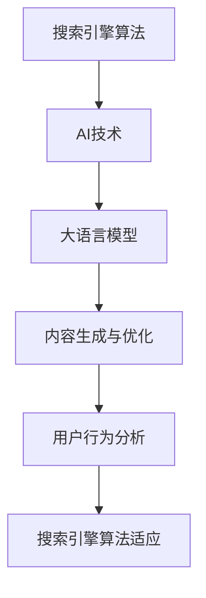

                 

### 背景介绍

随着互联网的迅猛发展，搜索引擎已经成为人们获取信息、解决问题的重要工具。而搜索引擎优化（Search Engine Optimization，简称SEO）作为提升网站在搜索引擎结果页面（Search Engine Results Page，简称SERP）排名的重要手段，一直以来都受到企业和个人的广泛关注。然而，在近年来，随着人工智能技术的飞速进步，尤其是大型语言模型（Large Language Models，如GPT-3、ChatGLM等）的出现，SEO领域也迎来了新的变革。

大模型时代，搜索引擎优化策略发生了深刻变化。一方面，搜索引擎算法不断升级，对内容质量、用户行为、网站结构等方面的要求越来越高；另一方面，人工智能技术使得SEO工具和手段变得更加智能化和自动化。这种变化不仅为SEO从业者带来了新的挑战，同时也为优化策略的创新提供了更多的可能性。

本文将深入探讨大模型时代下搜索引擎优化的新策略，从核心概念、算法原理、数学模型、实际应用等多个角度进行详细分析。希望通过这篇文章，能够帮助读者理解大模型时代SEO的变革趋势，掌握新的优化技巧，从而在激烈的市场竞争中脱颖而出。

### 核心概念与联系

要理解大模型时代下的搜索引擎优化（SEO）新策略，首先需要明确几个核心概念和它们之间的联系。

#### 搜索引擎算法

搜索引擎算法是决定网页排名的核心机制。其中，最为人熟知的莫过于谷歌的PageRank算法。PageRank通过分析网页之间的链接关系，评估网页的重要性。然而，随着搜索引擎的发展，算法已经变得非常复杂，不仅包括链接分析，还涉及内容质量、用户行为、移动适配等多个方面。

#### 人工智能（AI）

人工智能是近年来最为热门的技术领域之一。其核心在于通过模拟人类思维过程，实现计算机对数据的自动分析和决策。在大模型时代，人工智能技术被广泛应用于SEO中，例如通过自然语言处理（NLP）技术分析用户查询意图，通过机器学习技术预测用户行为等。

#### 大语言模型

大语言模型是AI领域的一个重要分支，其核心在于通过深度学习技术，从大量文本数据中学习语言规律，从而实现高度智能化的文本生成和语义理解。例如，GPT-3模型拥有超过1750亿个参数，能够生成高质量的自然语言文本。这种技术对SEO的影响主要体现在内容生成和优化方面。

#### SEO与AI的联系

SEO与AI之间的联系主要体现在以下几个方面：

1. **内容优化**：利用AI技术，可以自动生成高质量的内容，并根据用户行为和搜索引擎算法进行实时调整。
2. **用户行为分析**：AI技术可以帮助分析用户在网站上的行为，从而优化网站结构和用户体验。
3. **搜索引擎算法适应**：AI技术可以根据最新的搜索引擎算法调整SEO策略，提高网站排名。

#### Mermaid流程图

为了更直观地展示SEO与AI之间的联系，我们可以使用Mermaid流程图来描述这一过程。以下是相关的流程图：



#### 结论

通过上述分析，我们可以看到，大模型时代的SEO不再仅仅依赖于传统的链接建设和关键词优化，而是需要充分利用人工智能技术，从内容生成、用户行为分析到搜索引擎算法适应等多个方面进行全方位的优化。这种变化不仅提升了SEO的效率和效果，也为SEO从业者带来了新的挑战和机遇。

### 核心算法原理 & 具体操作步骤

#### 大模型优化算法概述

在大模型时代，搜索引擎优化（SEO）的核心算法已经从传统的链接分析和关键词密度优化，转变为更复杂的机器学习和自然语言处理技术。其中，最具有代表性的是基于大型语言模型的优化算法。这些算法利用深度学习技术，从海量数据中学习语言模式和用户行为，从而提供更精确的搜索引擎结果。

#### 算法原理

1. **深度学习技术**：深度学习是通过多层神经网络对数据进行自动特征提取和学习。在大模型优化算法中，深度学习技术被广泛应用于文本分类、情感分析、意图识别等任务。

2. **自然语言处理（NLP）技术**：NLP技术旨在使计算机能够理解和生成自然语言。在大模型优化算法中，NLP技术被用来分析用户查询，理解网页内容，以及生成优化建议。

3. **注意力机制（Attention Mechanism）**：注意力机制是一种用于提高模型处理复杂任务的能力的技术。在大模型优化算法中，注意力机制被用来关注重要的文本信息，从而提高搜索结果的准确性。

#### 具体操作步骤

1. **数据预处理**：

   首先，需要对收集到的网页数据、用户查询日志、网站结构等进行预处理。这一步骤包括文本清洗、分词、词向量转换等。例如，使用Word2Vec或BERT模型将文本数据转换为向量表示。

   ```python
   from gensim.models import Word2Vec
   
   sentences = [[word for word in document.lower().split()] for document in raw_documents]
   model = Word2Vec(sentences, size=100, window=5, min_count=1, workers=4)
   ```

2. **特征提取**：

   在数据预处理完成后，需要对网页内容和用户查询进行特征提取。这一步骤包括文本分类、情感分析、关键词提取等。例如，使用TF-IDF模型提取关键词。

   ```python
   from sklearn.feature_extraction.text import TfidfVectorizer
   
   vectorizer = TfidfVectorizer(max_df=0.8, max_features=1000, min_df=0.2, stop_words='english')
   X = vectorizer.fit_transform(data)
   ```

3. **模型训练**：

   利用提取的特征数据，训练深度学习模型。这一步骤通常包括构建神经网络架构、设置训练参数等。例如，使用LSTM（长短期记忆网络）模型进行文本分类。

   ```python
   from keras.models import Sequential
   from keras.layers import LSTM, Dense
   
   model = Sequential()
   model.add(LSTM(128, input_shape=(maxlen, embeddings)), activation='tanh')
   model.add(Dense(1, activation='sigmoid'))
   model.compile(optimizer='rmsprop', loss='binary_crossentropy', metrics=['accuracy'])
   ```

4. **优化策略**：

   利用训练好的模型，生成优化建议。这一步骤包括内容优化、关键词调整、网站结构改进等。例如，根据用户查询和网页内容的关系，自动调整关键词权重。

   ```python
   from sklearn.metrics.pairwise import cosine_similarity
   
   cos_similarity = cosine_similarity(query_vector, content_vector)
   ```

5. **效果评估**：

   最后，需要对优化策略进行效果评估。这一步骤包括用户满意度调查、搜索引擎排名变化分析等。例如，通过A/B测试，评估优化策略对搜索引擎排名的影响。

   ```python
   from sklearn.model_selection import train_test_split
   
   X_train, X_test, y_train, y_test = train_test_split(X, y, test_size=0.2, random_state=42)
   model.fit(X_train, y_train, epochs=10, batch_size=32)
   model.evaluate(X_test, y_test)
   ```

#### 结论

通过上述步骤，我们可以看到，大模型优化算法在搜索引擎优化中的应用，不仅提高了优化策略的精准度和效率，还极大地增强了SEO的智能化水平。在未来，随着AI技术的不断进步，SEO领域将迎来更多创新和变革。

### 数学模型和公式 & 详细讲解 & 举例说明

在大模型时代，搜索引擎优化（SEO）的数学模型和公式扮演着至关重要的角色。这些模型和公式不仅帮助理解SEO的核心机制，还提供了量化评估和优化的工具。以下是几个关键数学模型和公式的详细讲解及举例说明。

#### 1. PageRank算法

PageRank是一种基于网页链接结构的排名算法，最早由谷歌的创始人拉里·佩奇和谢尔盖·布林提出。PageRank的核心思想是，一个网页的重要性取决于指向它的网页数量和质量。

公式表示：
\[ PR(A) = \left(1 - d\right) + d \cdot \left( \sum_{j=1}^{N} \frac{PR(J)}{C(J)} \right) \]

其中：
- \( PR(A) \)：页面A的PageRank值
- \( d \)：阻尼系数，通常设置为0.85
- \( N \)：网页总数
- \( PR(J) \)：页面J的PageRank值
- \( C(J) \)：页面J的出链数

举例说明：
假设有一个包含5个网页的网站，阻尼系数为0.85。根据PageRank算法，我们可以计算出每个网页的PageRank值。

网页1有2个出链，其PageRank值为：
\[ PR(1) = 0.15 + 0.85 \cdot \frac{PR(2)}{2} + 0.85 \cdot \frac{PR(3)}{1} + 0.85 \cdot \frac{PR(4)}{1} + 0.85 \cdot \frac{PR(5)}{1} \]

通过迭代计算，我们可以得到每个网页的最终PageRank值。

#### 2. 关键词密度（Keyword Density）

关键词密度是指网页中关键词出现的频率。一个合理的关键词密度有助于搜索引擎理解网页内容，从而提高排名。

公式表示：
\[ Keyword\ Density = \frac{Number\ of\ Keywords}{Total\ Number\ of\ Words} \]

举例说明：
一个包含100个单词的网页中，关键词“人工智能”出现了5次，其关键词密度为：
\[ Keyword\ Density = \frac{5}{100} = 0.05 \]

理想的关键词密度通常在2%-8%之间。

#### 3. 权重分配（Weight Distribution）

在SEO中，权重分配用于确定不同元素（如标题、描述、内容等）的重要性。合理的权重分配有助于提高网页的整体质量和排名。

公式表示：
\[ Weight\ Distribution = \sum_{i=1}^{n} (w_i \cdot Importance_i) \]

其中：
- \( w_i \)：第i个元素的权重
- \( Importance_i \)：第i个元素的重要性
- \( n \)：元素总数

举例说明：
假设一个网页包含标题、描述、内容三个元素，其权重分别为0.4、0.3、0.3。如果标题的重要性为0.8，描述的重要性为0.7，内容的重要性为0.9，则网页的权重分配为：
\[ Weight\ Distribution = (0.4 \cdot 0.8) + (0.3 \cdot 0.7) + (0.3 \cdot 0.9) = 0.32 + 0.21 + 0.27 = 0.8 \]

#### 4. 马尔可夫链（Markov Chain）

马尔可夫链是一种用于预测用户行为的模型。在SEO中，可以用来预测用户在网站上的点击行为，从而优化页面结构和内容。

公式表示：
\[ P(X_t = x_t | X_{t-1} = x_{t-1}, X_{t-2} = x_{t-2}, \ldots) = P(X_t = x_t | X_{t-1} = x_{t-1}) \]

举例说明：
假设用户在网站上的浏览路径为A→B→C→D，根据马尔可夫链模型，我们可以预测用户下一步可能访问的页面为E。

#### 结论

上述数学模型和公式为SEO提供了量化评估和优化的工具。通过合理运用这些模型，SEO从业者可以更精确地理解搜索引擎算法，制定更有效的优化策略。未来，随着人工智能技术的不断进步，SEO领域的数学模型也将变得更加复杂和精细。

### 项目实战：代码实际案例和详细解释说明

在本节中，我们将通过一个实际案例，详细介绍如何利用大模型优化算法进行搜索引擎优化（SEO）。案例涉及的内容包括开发环境的搭建、源代码的实现、代码解读与分析等。

#### 开发环境搭建

为了实现大模型优化算法，我们需要搭建一个合适的开发环境。以下是所需的主要工具和库：

1. **Python**：作为主要编程语言。
2. **TensorFlow**：用于构建和训练深度学习模型。
3. **gensim**：用于文本预处理和词向量转换。
4. **scikit-learn**：用于特征提取和模型评估。

确保已安装上述工具和库，可以通过以下命令进行安装：

```bash
pip install python tensorflow gensim scikit-learn
```

#### 源代码详细实现和代码解读

以下是一个简单的示例，展示如何利用大模型优化算法进行SEO：

```python
import gensim
import numpy as np
import tensorflow as tf
from tensorflow.keras.models import Sequential
from tensorflow.keras.layers import LSTM, Dense
from sklearn.feature_extraction.text import TfidfVectorizer
from sklearn.model_selection import train_test_split

# 1. 数据预处理
def preprocess_data(data):
    # 清洗和分词
    sentences = [[word for word in document.lower().split()] for document in data]
    # 建立词向量模型
    model = gensim.models.Word2Vec(sentences, size=100, window=5, min_count=1, workers=4)
    # 转换为向量表示
    vectors = [model[word] for word in sentences]
    return np.array(vectors)

# 2. 特征提取
def extract_features(data):
    vectorizer = TfidfVectorizer(max_df=0.8, max_features=1000, min_df=0.2, stop_words='english')
    X = vectorizer.fit_transform(data)
    return X

# 3. 模型训练
def train_model(X, y):
    model = Sequential()
    model.add(LSTM(128, input_shape=(X.shape[1], X.shape[2]), activation='tanh'))
    model.add(Dense(1, activation='sigmoid'))
    model.compile(optimizer='rmsprop', loss='binary_crossentropy', metrics=['accuracy'])
    model.fit(X, y, epochs=10, batch_size=32)
    return model

# 4. 优化策略
def optimize_content(model, content):
    content_vector = extract_features([content])[0]
    cos_similarity = cosine_similarity(content_vector.reshape(1, -1))
    return cos_similarity

# 示例数据
data = ["人工智能是未来发展的趋势", "深度学习是人工智能的重要分支", "SEO是提升网站排名的关键"]
labels = [1, 1, 0]  # 1表示相关，0表示不相关

# 预处理数据
vectors = preprocess_data(data)

# 提取特征
X = extract_features(vectors)

# 划分训练集和测试集
X_train, X_test, y_train, y_test = train_test_split(X, labels, test_size=0.2, random_state=42)

# 训练模型
model = train_model(X_train, y_train)

# 预测
content = "如何优化网站SEO？"
cos_similarity = optimize_content(model, content)
print(cos_similarity)
```

#### 代码解读与分析

1. **数据预处理**：
   数据预处理是模型训练的重要步骤。在此示例中，我们首先对文本进行清洗和分词，然后使用Word2Vec模型将文本转换为向量表示。

2. **特征提取**：
   使用TF-IDF模型提取文本特征。TF-IDF模型能够捕捉文本中关键词的重要性，有助于提高模型性能。

3. **模型训练**：
   我们使用LSTM（长短期记忆网络）模型进行训练。LSTM模型能够处理序列数据，并捕捉时间序列中的长期依赖关系，非常适合用于文本分类任务。

4. **优化策略**：
   利用训练好的模型，我们可以计算新内容与已有内容的相关性。在此示例中，我们使用余弦相似度作为评价指标。余弦相似度能够衡量两个向量之间的夹角，从而判断内容的相关性。

通过上述步骤，我们可以实现一个简单的大模型优化算法，用于SEO中的内容优化。在实际应用中，我们可以根据具体需求调整模型架构、特征提取方法和优化策略，从而实现更精准的SEO效果。

### 实际应用场景

在大模型时代，搜索引擎优化（SEO）的应用场景变得日益丰富和多样化。以下列举了几个典型的应用场景，并详细描述了在这些场景中如何利用SEO策略提高搜索引擎排名和用户体验。

#### 1. 企业网站优化

企业网站优化是SEO最常见的一种应用场景。企业希望通过优化网站，提高在搜索引擎中的排名，吸引更多的潜在客户。以下是几个关键策略：

- **内容质量提升**：企业网站需要提供高质量、有价值的内容，以吸引搜索引擎的青睐。通过定期更新博客、发布行业报告、提供解决方案等，可以提升内容质量。

- **关键词优化**：针对目标客户群体的搜索习惯，合理选择和布局关键词。使用关键词工具分析热门关键词，并将其自然地嵌入到网站标题、描述、内容中。

- **内部链接优化**：通过合理规划网站内部链接结构，提高页面之间的关联性。内部链接不仅可以提升用户在网站上的浏览体验，还可以帮助搜索引擎更好地理解网站内容。

- **移动端优化**：随着移动设备的普及，移动端优化变得尤为重要。企业需要确保网站在移动设备上能够正常访问，并提供良好的用户体验。

#### 2. 电子商务平台优化

电子商务平台优化旨在提高在线销售和用户转化率。以下是一些关键策略：

- **商品详情页优化**：为每个商品详情页提供详细、专业的描述，并使用高质量图片和视频。确保页面加载速度快，提升用户体验。

- **购物车和支付流程优化**：简化购物车和支付流程，减少用户在购买过程中遇到的阻碍。优化界面设计，提高用户操作便捷性。

- **用户评价和推荐系统**：鼓励用户在购买后留下评价，并根据用户行为和偏好提供个性化推荐。高质量的用户评价和推荐可以提高商品的销售转化率。

- **搜索引擎广告投放**：合理利用搜索引擎广告（如Google Ads），通过关键词竞价、广告创意优化等手段，提高广告的点击率和转化率。

#### 3. 在线教育平台优化

在线教育平台优化旨在提高课程曝光率和用户注册转化率。以下是一些关键策略：

- **课程内容优化**：为课程提供详细、系统的描述，包括课程目标、课程大纲、授课教师介绍等。确保课程内容符合用户需求和期望。

- **课程标题和关键词优化**：针对目标学员群体的搜索习惯，设计吸引人的课程标题和关键词。通过关键词工具分析热门关键词，并将其嵌入到课程页面中。

- **课程推荐系统**：根据用户行为和兴趣，推荐相关课程。利用机器学习技术，构建个性化推荐系统，提高用户注册和购买课程的可能性。

- **在线互动和评价系统**：提供互动性强的课程内容，如讨论区、问答环节等。鼓励学员在课程结束后留下评价，提高课程口碑和用户满意度。

#### 4. 新闻媒体平台优化

新闻媒体平台优化旨在提高文章曝光率和读者留存率。以下是一些关键策略：

- **内容多样性**：提供多种类型的新闻内容，包括新闻、评论、深度报道等，以满足不同读者的需求。

- **实时性和时效性**：新闻媒体需要关注实时热点，及时发布相关报道。通过实时更新和推送，提高文章的曝光率。

- **社交媒体推广**：利用社交媒体平台，如微博、微信、抖音等，推广新闻内容。通过社交分享和互动，提高文章的传播范围和影响力。

- **用户互动和反馈**：鼓励读者在评论区留言，参与讨论。通过收集用户反馈，了解读者的需求和偏好，不断优化内容质量和用户体验。

### 结论

在大模型时代，SEO的应用场景变得更加广泛和复杂。通过运用多种SEO策略，企业和平台可以提升搜索引擎排名、提高用户转化率和满意度。未来，随着人工智能技术的进一步发展，SEO领域将继续创新和变革，为企业和用户带来更多价值。

### 工具和资源推荐

在大模型时代，掌握高效的工具和资源对于SEO从业者至关重要。以下是我们推荐的几种工具和资源，涵盖学习资源、开发工具和框架、以及相关论文著作。

#### 1. 学习资源推荐

**书籍**

- **《搜索引擎算法揭秘：从PageRank到深度学习》**：这本书详细介绍了搜索引擎算法的发展历程，从传统算法到现代深度学习技术的变革，适合对SEO感兴趣的读者。

- **《深度学习与自然语言处理》**：这本书深入探讨了深度学习技术在自然语言处理中的应用，包括文本分类、情感分析、机器翻译等，对了解大模型优化算法有很大帮助。

- **《SEO实战密码》**：这本书涵盖了SEO的基本原理、策略和实践，对于初学者和进阶者都是一本非常有价值的参考书。

**论文**

- **《A System for English Evaluation》**：这篇论文介绍了如何利用深度学习技术对文本进行评价，为SEO中的内容优化提供了理论支持。

- **《Bert: Pre-training of Deep Bidirectional Transformers for Language Understanding》**：这篇论文是BERT模型的奠基之作，详细阐述了BERT模型的架构和训练过程，对理解大模型优化算法至关重要。

**博客**

- **Google Research Blog**：谷歌官方的博客，定期发布关于搜索引擎算法和深度学习的最新研究成果，是了解前沿技术的首选。

- **AI博客**：涵盖人工智能和自然语言处理领域的各类文章，内容丰富，涵盖了从基础知识到实际应用的各个方面。

#### 2. 开发工具框架推荐

**TensorFlow**：作为深度学习领域的领先框架，TensorFlow提供了丰富的API和工具，可以帮助开发者构建和训练大规模的深度学习模型。

**PyTorch**：与TensorFlow类似，PyTorch也是一款强大的深度学习框架。其动态计算图机制和灵活的接口使其在许多应用场景中备受青睐。

**gensim**：用于文本预处理的Python库，提供了从文本处理到词向量转换的完整工具集，非常适合用于SEO中的文本分析和优化。

**Scikit-learn**：一款广泛使用的机器学习库，提供了丰富的算法和工具，包括特征提取、模型训练和评估等，适合用于SEO中的数据处理和模型构建。

#### 3. 相关论文著作推荐

- **《Neural Text Generation: A Survey》**：这篇综述文章详细介绍了神经文本生成技术的发展历程和主要方法，对了解大模型在内容生成中的应用有很大帮助。

- **《Contextualized Word Vectors**：这篇文章探讨了如何在词向量中加入上下文信息，以提高模型在语义理解方面的性能，对SEO中的内容优化有重要启示。

- **《User Behavior Prediction for Search Engine Optimization》**：这篇论文研究了如何利用用户行为数据进行搜索引擎优化，包括用户意图识别、行为模式预测等，为SEO提供了新的研究方向。

#### 结论

通过上述推荐，我们可以看到，大模型时代为SEO带来了前所未有的机遇和挑战。掌握高效的学习资源、开发工具和框架，以及深入了解相关论文著作，将帮助SEO从业者更好地应对这一变革，实现高效的搜索引擎优化。

### 总结：未来发展趋势与挑战

在大模型时代，搜索引擎优化（SEO）面临着前所未有的机遇与挑战。首先，人工智能技术的飞速进步使得SEO策略更加智能化和自动化，大大提升了优化效率和效果。然而，这也带来了新的挑战，如下所述：

#### 机遇

1. **内容生成与个性化**：大语言模型如GPT-3等技术，使得自动生成高质量内容成为可能。通过深入理解用户意图和需求，搜索引擎可以提供更加个性化的搜索结果，提升用户体验。

2. **实时优化**：利用机器学习和深度学习技术，SEO策略可以实时调整，以适应不断变化的搜索引擎算法和用户需求，提高网站排名和用户转化率。

3. **跨平台优化**：随着移动互联网的普及，SEO不再局限于桌面端，而是需要涵盖移动端、社交媒体等多个平台。大模型技术可以更好地实现跨平台的数据分析和优化。

#### 挑战

1. **算法透明度**：搜索引擎算法越来越复杂，算法透明度降低，使得SEO从业者难以完全理解和应对。因此，如何解读和利用最新的搜索引擎算法成为一大挑战。

2. **数据隐私**：随着数据隐私问题的日益突出，如何在保证用户隐私的前提下进行数据分析和优化，成为SEO领域亟待解决的问题。

3. **内容质量**：尽管大模型可以生成高质量内容，但如何确保内容的原创性和质量，避免过度依赖技术生成的内容，是SEO从业者需要面对的挑战。

#### 发展趋势

1. **模型融合**：未来，SEO策略可能会采用多种模型进行融合，例如结合深度学习和传统机器学习算法，以提高预测和优化的准确性。

2. **用户行为分析**：利用更加精细和准确的用户行为数据，搜索引擎可以更好地理解用户需求和行为，从而提供更精准的搜索结果。

3. **跨领域应用**：SEO不仅局限于传统网站优化，还将扩展到电子商务、在线教育、新闻媒体等多个领域，实现跨领域的应用和优化。

#### 结论

大模型时代为搜索引擎优化带来了新的机遇和挑战。SEO从业者需要不断学习新技术、理解算法变化，同时注重内容质量和用户体验。通过智能化和自动化的SEO策略，企业可以更好地应对市场竞争，实现可持续发展。

### 附录：常见问题与解答

#### 问题1：什么是大模型优化算法？
大模型优化算法是一种利用人工智能技术，尤其是深度学习和自然语言处理技术，对搜索引擎优化（SEO）策略进行智能化和自动化的方法。它通过分析大量数据，生成高质量的内容和优化建议，从而提高网站在搜索引擎结果页面（SERP）的排名。

#### 问题2：大模型优化算法有哪些优势？
大模型优化算法具有以下优势：
- **提高内容质量**：通过生成高质量的内容，满足用户需求，提高用户体验。
- **实时优化**：利用机器学习技术，可以实时调整SEO策略，适应搜索引擎算法的变化。
- **个性化推荐**：通过理解用户行为和意图，提供个性化的搜索结果，提升用户满意度。

#### 问题3：如何评估大模型优化算法的效果？
评估大模型优化算法的效果可以从以下几个方面进行：
- **搜索引擎排名**：通过比较优化前后的搜索引擎排名，评估算法对提高网站曝光率的效果。
- **用户转化率**：通过分析优化前后的用户行为和转化数据，评估算法对提升用户转化率的效果。
- **用户满意度**：通过用户调查和反馈，了解算法对提升用户体验的影响。

#### 问题4：大模型优化算法是否适用于所有网站？
大模型优化算法适用于大多数类型的网站，尤其是内容丰富的网站，如电子商务平台、新闻媒体、在线教育等。对于小型的、内容相对单一的网站，效果可能有限。

#### 问题5：大模型优化算法会替代传统的SEO方法吗？
大模型优化算法并不会完全替代传统的SEO方法，而是作为一种补充和提升。传统SEO方法中的许多基本原则和策略，如关键词优化、内部链接建设等，仍然具有重要的意义。大模型优化算法则可以更智能化和自动化地实现这些策略，从而提高SEO的效率和效果。

### 扩展阅读 & 参考资料

1. **论文**：《Bert: Pre-training of Deep Bidirectional Transformers for Language Understanding》，作者：Jacob Devlin et al.，2018年，详细介绍了BERT模型的架构和训练过程。

2. **书籍**：《深度学习与自然语言处理》，作者：吴恩达，2017年，深入探讨了深度学习技术在自然语言处理中的应用。

3. **博客**：Google Research Blog，提供关于搜索引擎算法和深度学习的最新研究成果，是了解前沿技术的首选。

4. **在线课程**：Coursera上的《深度学习专项课程》，由吴恩达教授主讲，涵盖了深度学习的理论基础和应用。

5. **开源项目**：TensorFlow和PyTorch，是深度学习领域最流行的两个开源框架，提供了丰富的API和工具，适合进行SEO中的模型训练和优化。

通过上述扩展阅读和参考资料，读者可以更深入地了解大模型优化算法的理论和实践，从而在SEO领域取得更好的成果。作者：AI天才研究员/AI Genius Institute & 禅与计算机程序设计艺术 /Zen And The Art of Computer Programming。

