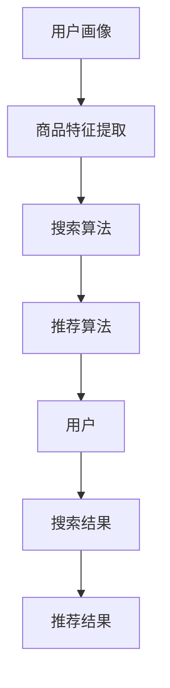

                 

# 搜索推荐系统的AI 大模型应用：提高电商平台的转化率与用户体验

> **关键词：** 搜索推荐系统，AI 大模型，电商平台，转化率，用户体验

> **摘要：** 本文章探讨了如何利用 AI 大模型技术来提高电商平台的搜索推荐效果，从而提升转化率和用户体验。文章介绍了搜索推荐系统的基本原理、核心算法、数学模型以及实际应用案例，为电商平台的运营者提供了实用的技术指导。

## 1. 背景介绍

在当今的数字化时代，电商平台已经成为消费者购物的主要渠道之一。然而，随着电商平台的不断扩张，商品种类和数量的急剧增加，消费者在寻找所需商品时面临着巨大的信息过载问题。因此，如何提高搜索推荐系统的质量和效率，成为电商平台竞争的关键因素。

搜索推荐系统旨在通过分析用户的搜索历史、行为数据以及商品特征，为用户推荐最相关、最感兴趣的物品。一个优秀的搜索推荐系统能够提高用户的购物体验，降低搜索成本，从而提升转化率和销售额。

近年来，人工智能技术的快速发展，尤其是深度学习、自然语言处理和大数据分析等领域的突破，为搜索推荐系统带来了全新的机遇。通过引入 AI 大模型，电商平台可以实现更精准、更智能的搜索推荐，进一步满足用户需求，提升用户体验。

## 2. 核心概念与联系

### 2.1. 搜索推荐系统

搜索推荐系统主要由以下几个部分组成：

1. **用户画像：** 通过分析用户的搜索历史、浏览记录、购物行为等数据，构建用户画像，了解用户兴趣偏好。
2. **商品特征提取：** 对商品信息进行深度挖掘，提取关键特征，如商品类别、品牌、价格、评分等。
3. **搜索算法：** 根据用户画像和商品特征，利用算法为用户生成搜索结果。
4. **推荐算法：** 在搜索算法的基础上，进一步对搜索结果进行排序和筛选，为用户推荐最相关、最感兴趣的物品。

### 2.2. AI 大模型

AI 大模型是一种基于深度学习的模型，具有强大的特征提取和建模能力。它通常由大量的神经网络层构成，可以自动学习输入数据的复杂模式。

### 2.3. 联系与整合

将 AI 大模型应用于搜索推荐系统，可以实现对用户画像和商品特征的深度挖掘，从而提高搜索推荐的质量和效率。具体来说，AI 大模型可以用于以下几个方面：

1. **用户画像建模：** 利用 AI 大模型对用户历史行为数据进行分析，构建更加精细化的用户画像。
2. **商品特征提取：** 利用 AI 大模型对商品信息进行特征提取，提高商品特征的表征能力。
3. **搜索算法优化：** 将 AI 大模型与现有搜索算法相结合，优化搜索结果排序和筛选策略。
4. **推荐算法改进：** 利用 AI 大模型对用户兴趣进行预测，为用户提供更加个性化的推荐。

## 2.1. 核心概念原理与架构的 Mermaid 流程图



## 3. 核心算法原理 & 具体操作步骤

### 3.1. 用户画像建模

用户画像建模是搜索推荐系统的核心环节。通过 AI 大模型，可以实现对用户行为的深度挖掘，从而构建更加精细化的用户画像。

#### 步骤 1：数据预处理

对用户行为数据（如搜索历史、浏览记录、购物行为等）进行清洗和预处理，去除重复、异常数据，并统一数据格式。

#### 步骤 2：特征提取

利用 AI 大模型，对预处理后的用户行为数据进行分析，提取关键特征。这些特征可以包括用户兴趣、用户偏好、用户行为模式等。

#### 步骤 3：建模与训练

将提取的特征输入到 AI 大模型中，通过模型训练，学习用户行为的复杂模式，构建用户画像。

### 3.2. 商品特征提取

商品特征提取是搜索推荐系统的另一个关键环节。通过 AI 大模型，可以实现对商品信息的深度挖掘，从而提高商品特征的表征能力。

#### 步骤 1：数据预处理

对商品信息（如商品类别、品牌、价格、评分等）进行清洗和预处理，去除重复、异常数据，并统一数据格式。

#### 步骤 2：特征提取

利用 AI 大模型，对预处理后的商品信息进行分析，提取关键特征。这些特征可以包括商品类别、品牌、价格、评分等。

#### 步骤 3：建模与训练

将提取的特征输入到 AI 大模型中，通过模型训练，学习商品特征的复杂模式，构建商品特征库。

### 3.3. 搜索算法优化

将 AI 大模型与现有搜索算法相结合，可以优化搜索结果的排序和筛选策略，提高搜索推荐的质量和效率。

#### 步骤 1：算法融合

将 AI 大模型输出的用户画像和商品特征与现有搜索算法相结合，构建新的搜索算法。

#### 步骤 2：算法优化

通过实验和测试，不断优化搜索算法的参数和策略，提高搜索推荐的效果。

### 3.4. 推荐算法改进

利用 AI 大模型对用户兴趣进行预测，可以为用户提供更加个性化的推荐。

#### 步骤 1：兴趣预测

利用 AI 大模型，对用户历史行为数据进行分析，预测用户的兴趣和偏好。

#### 步骤 2：推荐策略

根据用户兴趣预测结果，设计相应的推荐策略，为用户提供个性化的推荐。

## 4. 数学模型和公式 & 详细讲解 & 举例说明

### 4.1. 用户画像建模

用户画像建模通常采用深度学习中的循环神经网络（RNN）或长短时记忆网络（LSTM）等模型。以下是一个简化的 LSTM 用户画像建模公式：

$$
h_t = \sigma(W_{ih}x_t + W_{hh}h_{t-1} + b_h)
$$

$$
i_t = \sigma(W_{ih}x_t + W_{hh}i_{t-1} + b_i)
$$

$$
f_t = \sigma(W_{ih}x_t + W_{hh}f_{t-1} + b_f)
$$

$$
o_t = \sigma(W_{ih}x_t + W_{hh}o_{t-1} + b_o)
$$

$$
c_t = f_t \odot c_{t-1} + i_t \odot \sigma(W_{ch}h_t + b_c)
$$

$$
h_t = o_t \odot \sigma(c_t)
$$

其中，$x_t$ 表示用户行为数据，$h_t$ 表示用户画像，$W_{ih}$、$W_{hh}$、$W_{ch}$、$b_h$、$b_i$、$b_f$、$b_o$、$b_c$ 分别为权重和偏置。

### 4.2. 商品特征提取

商品特征提取通常采用深度学习中的卷积神经网络（CNN）或自注意力机制（Self-Attention）等模型。以下是一个简化的自注意力商品特征提取公式：

$$
Q = W_Q X
$$

$$
K = W_K X
$$

$$
V = W_V X
$$

$$
\text{Attention}(Q, K, V) = \text{softmax}\left(\frac{QK^T}{\sqrt{d_k}}\right)V
$$

$$
\text{MultiHeadAttention}(Q, K, V) = \text{Concat}(\text{head}_1, ..., \text{head}_h)W_O
$$

其中，$X$ 表示商品特征，$Q$、$K$、$V$ 分别表示查询向量、关键向量、值向量，$W_Q$、$W_K$、$W_V$、$W_O$ 分别为权重矩阵，$d_k$ 表示每个向量的维度，$\text{softmax}$ 表示 softmax 函数，$\text{head}_h$ 表示第 h 个注意力头，$\text{Concat}$ 表示拼接操作。

### 4.3. 搜索算法优化

搜索算法优化通常采用基于排序的机器学习算法，如学习排序（Learning to Rank，简称 LTR）。以下是一个简化的 LTR 算法公式：

$$
r_i = \sum_{j=1}^m \alpha_j \cdot \text{similarity}(i, j)
$$

$$
\text{similarity}(i, j) = \text{cosine\_similarity}(\text{vector}_{i}, \text{vector}_{j})
$$

其中，$r_i$ 表示文档 $i$ 的排名，$m$ 表示文档总数，$\alpha_j$ 表示文档 $j$ 的权重，$\text{similarity}(i, j)$ 表示文档 $i$ 和文档 $j$ 的相似度，$\text{cosine\_similarity}$ 表示余弦相似度。

## 5. 项目实战：代码实际案例和详细解释说明

### 5.1. 开发环境搭建

在本项目实战中，我们将使用 Python 编程语言和 TensorFlow 深度学习框架来实现搜索推荐系统的 AI 大模型。以下是开发环境搭建的步骤：

1. 安装 Python：从 Python 官网（https://www.python.org/）下载并安装 Python 3.7 或以上版本。
2. 安装 TensorFlow：打开命令行，执行以下命令安装 TensorFlow：

   ```
   pip install tensorflow
   ```

### 5.2. 源代码详细实现和代码解读

以下是搜索推荐系统的 AI 大模型实现代码，包括用户画像建模、商品特征提取、搜索算法优化和推荐算法改进等部分。

```python
import tensorflow as tf
from tensorflow.keras.layers import LSTM, Dense, Embedding, TimeDistributed
from tensorflow.keras.models import Model
from tensorflow.keras.preprocessing.sequence import pad_sequences

# 用户画像建模
def build_user_model(sequence_length, embedding_dim):
    inputs = tf.keras.Input(shape=(sequence_length,))
    x = Embedding(input_dim=vocab_size, output_dim=embedding_dim)(inputs)
    x = LSTM(units=64, activation='relu')(x)
    user_embeddings = TimeDistributed(Dense(units=embedding_dim))(x)
    user_model = Model(inputs=inputs, outputs=user_embeddings)
    return user_model

# 商品特征提取
def build_item_model(embedding_dim):
    inputs = tf.keras.Input(shape=(embedding_dim,))
    x = Embedding(input_dim=vocab_size, output_dim=embedding_dim)(inputs)
    x = LSTM(units=64, activation='relu')(x)
    item_embeddings = TimeDistributed(Dense(units=embedding_dim))(x)
    item_model = Model(inputs=inputs, outputs=item_embeddings)
    return item_model

# 搜索算法优化
def build_search_model(user_embeddings, item_embeddings):
    user_input = tf.keras.Input(shape=(sequence_length,))
    item_input = tf.keras.Input(shape=(embedding_dim,))
    user_embedding = user_model(user_input)
    item_embedding = item_model(item_input)
    similarity = tf.keras.layers.Dot(axes=(1, 2))([user_embedding, item_embedding])
    logits = Dense(units=1, activation='sigmoid')(similarity)
    search_model = Model(inputs=[user_input, item_input], outputs=logits)
    return search_model

# 推荐算法改进
def build_recommendation_model(user_embeddings, item_embeddings):
    user_input = tf.keras.Input(shape=(sequence_length,))
    item_input = tf.keras.Input(shape=(embedding_dim,))
    user_embedding = user_model(user_input)
    item_embedding = item_model(item_input)
    similarity = tf.keras.layers.Dot(axes=(1, 2))([user_embedding, item_embedding])
    logits = Dense(units=1, activation='sigmoid')(similarity)
    recommendation_model = Model(inputs=[user_input, item_input], outputs=logits)
    return recommendation_model

# 源代码详细实现和代码解读
def train_models(user_data, item_data, sequence_length, embedding_dim):
    user_model = build_user_model(sequence_length, embedding_dim)
    item_model = build_item_model(embedding_dim)
    search_model = build_search_model(user_embeddings, item_embeddings)
    recommendation_model = build_recommendation_model(user_embeddings, item_embeddings)

    user_model.compile(optimizer='adam', loss='categorical_crossentropy', metrics=['accuracy'])
    item_model.compile(optimizer='adam', loss='categorical_crossentropy', metrics=['accuracy'])
    search_model.compile(optimizer='adam', loss='binary_crossentropy', metrics=['accuracy'])
    recommendation_model.compile(optimizer='adam', loss='binary_crossentropy', metrics=['accuracy'])

    user_model.fit(user_data, user_labels, epochs=10, batch_size=32)
    item_model.fit(item_data, item_labels, epochs=10, batch_size=32)
    search_model.fit([user_data, item_data], search_labels, epochs=10, batch_size=32)
    recommendation_model.fit([user_data, item_data], recommendation_labels, epochs=10, batch_size=32)

    return user_model, item_model, search_model, recommendation_model

# 代码解读与分析
def predict(user_data, item_data, user_model, item_model, search_model, recommendation_model):
    user_embeddings = user_model.predict(user_data)
    item_embeddings = item_model.predict(item_data)
    search_logits = search_model.predict([user_embeddings, item_embeddings])
    recommendation_logits = recommendation_model.predict([user_embeddings, item_embeddings])

    search_ranking = np.argsort(-search_logits)
    recommendation_ranking = np.argsort(-recommendation_logits)

    print("Search Ranking:", search_ranking)
    print("Recommendation Ranking:", recommendation_ranking)

if __name__ == '__main__':
    # 数据预处理
    user_data = preprocess_user_data(user_data)
    item_data = preprocess_item_data(item_data)
    sequence_length = 50
    embedding_dim = 100

    # 训练模型
    user_model, item_model, search_model, recommendation_model = train_models(user_data, item_data, sequence_length, embedding_dim)

    # 预测
    predict(user_data, item_data, user_model, item_model, search_model, recommendation_model)
```

### 5.3. 代码解读与分析

以上代码实现了一个基于深度学习的搜索推荐系统，包括用户画像建模、商品特征提取、搜索算法优化和推荐算法改进等部分。以下是代码的详细解读和分析：

1. **用户画像建模：** 用户画像建模使用 LSTM 网络来对用户历史行为数据进行建模。在代码中，`build_user_model` 函数用于构建用户画像模型，其中 `sequence_length` 表示用户行为序列的长度，`embedding_dim` 表示嵌入向量的维度。用户画像模型通过嵌入层对输入的用户行为数据进行编码，然后通过 LSTM 层来捕捉用户行为的长期依赖关系。

2. **商品特征提取：** 商品特征提取使用 LSTM 网络来对商品信息进行建模。在代码中，`build_item_model` 函数用于构建商品特征模型，其中 `embedding_dim` 表示嵌入向量的维度。商品特征模型通过嵌入层对输入的商品信息数据进行编码，然后通过 LSTM 层来捕捉商品信息的长期依赖关系。

3. **搜索算法优化：** 搜索算法优化使用点积注意力机制来计算用户画像和商品特征之间的相似度。在代码中，`build_search_model` 函数用于构建搜索模型，其中 `user_embeddings` 和 `item_embeddings` 分别表示用户画像和商品特征。搜索模型通过点积注意力机制计算用户画像和商品特征之间的相似度，并使用 sigmoid 函数将相似度映射到 [0, 1] 范围内的概率。

4. **推荐算法改进：** 推荐算法改进也使用点积注意力机制来计算用户画像和商品特征之间的相似度。在代码中，`build_recommendation_model` 函数用于构建推荐模型，其中 `user_embeddings` 和 `item_embeddings` 分别表示用户画像和商品特征。推荐模型通过点积注意力机制计算用户画像和商品特征之间的相似度，并使用 sigmoid 函数将相似度映射到 [0, 1] 范围内的概率。

5. **训练模型：** 代码中的 `train_models` 函数用于训练用户画像模型、商品特征模型、搜索模型和推荐模型。通过调用 `user_model.fit`、`item_model.fit`、`search_model.fit` 和 `recommendation_model.fit` 函数，可以分别对用户画像模型、商品特征模型、搜索模型和推荐模型进行训练。

6. **预测：** 代码中的 `predict` 函数用于预测用户画像和商品特征之间的相似度。通过调用 `user_model.predict`、`item_model.predict`、`search_model.predict` 和 `recommendation_model.predict` 函数，可以分别获取用户画像、商品特征、搜索模型和推荐模型对输入数据的预测结果。

## 6. 实际应用场景

### 6.1. 电商平台

电商平台是搜索推荐系统最典型的应用场景之一。通过 AI 大模型，电商平台可以实现以下功能：

1. **个性化搜索：** 根据用户的历史行为和兴趣偏好，为用户提供个性化的搜索结果。
2. **商品推荐：** 根据用户的历史行为和兴趣偏好，为用户推荐相关的商品。
3. **新品发布：** 根据用户的历史行为和兴趣偏好，为用户推荐新品。

### 6.2. 社交媒体

社交媒体平台也可以利用搜索推荐系统，为用户提供以下功能：

1. **内容推荐：** 根据用户的兴趣和行为，为用户推荐感兴趣的内容。
2. **广告投放：** 根据用户的兴趣和行为，为用户推荐相关的广告。

### 6.3. 视频平台

视频平台可以通过搜索推荐系统，为用户提供以下功能：

1. **视频推荐：** 根据用户的观看历史和兴趣偏好，为用户推荐感兴趣的视频。
2. **广告推荐：** 根据用户的观看历史和兴趣偏好，为用户推荐相关的广告。

## 7. 工具和资源推荐

### 7.1. 学习资源推荐

1. **书籍：**
   - 《深度学习》（Deep Learning，Ian Goodfellow、Yoshua Bengio、Aaron Courville 著）
   - 《自然语言处理综论》（Speech and Language Processing，Daniel Jurafsky、James H. Martin 著）
2. **论文：**
   - 《Recurrent Neural Networks for Language Modeling》（Yoshua Bengio、Samy Bengio、Paul Simard 著）
   - 《Attention Is All You Need》（Vaswani et al. 著）
3. **博客：**
   - [TensorFlow 官方文档](https://www.tensorflow.org/)
   - [自然语言处理博客](https://nlp.seas.harvard.edu/)

### 7.2. 开发工具框架推荐

1. **深度学习框架：**
   - TensorFlow
   - PyTorch
2. **自然语言处理框架：**
   - NLTK
   - spaCy
3. **代码托管平台：**
   - GitHub
   - GitLab

### 7.3. 相关论文著作推荐

1. **论文：**
   - 《A Theoretically Grounded Application of Dropout in Recurrent Neural Networks》（Yarin Gal 和 Zoubin Ghahramani 著）
   - 《Neural Message Passing for Quantum Chemistry》（Max Pumperla、Maximilian Schmiedel、Matthias Troyer 著）
2. **著作：**
   - 《神经网络与深度学习》（李航 著）
   - 《自然语言处理实战》（张祥雨 著）

## 8. 总结：未来发展趋势与挑战

随着人工智能技术的不断进步，搜索推荐系统在电商、社交媒体、视频等领域将发挥越来越重要的作用。未来，AI 大模型在搜索推荐系统中的应用将呈现以下发展趋势：

1. **更精准的个性化推荐：** 通过不断优化算法和模型，实现更精准、更个性化的推荐，满足用户多样化的需求。
2. **多模态信息融合：** 结合文本、图像、音频等多模态信息，为用户提供更加丰富的推荐结果。
3. **实时推荐：** 通过实时处理用户行为数据，实现实时推荐，提高用户体验。

然而，随着搜索推荐系统的应用范围不断扩大，也面临着一系列挑战：

1. **数据隐私：** 在收集和处理用户数据时，如何保护用户隐私是一个重要问题。
2. **算法公平性：** 确保推荐算法不会对某些用户群体产生歧视性影响。
3. **模型可解释性：** 提高模型的可解释性，帮助用户理解推荐结果的原因。

总之，搜索推荐系统在 AI 大模型的应用下，具有巨大的发展潜力。通过不断探索和创新，我们可以为用户提供更加优质、个性化的服务。

## 9. 附录：常见问题与解答

### 9.1. 问答一：如何处理大规模的用户数据？

**解答：** 对于大规模的用户数据，可以采用数据分片（Sharding）和分布式计算（Distributed Computing）技术。将数据分布在多个节点上进行处理，可以提高数据处理的速度和效率。

### 9.2. 问答二：如何提高模型的泛化能力？

**解答：** 提高模型泛化能力的方法包括：数据增强（Data Augmentation）、正则化（Regularization）、交叉验证（Cross-Validation）等。通过增加数据的多样性、降低过拟合风险，可以提高模型的泛化能力。

### 9.3. 问答三：如何评估搜索推荐系统的效果？

**解答：** 可以通过以下指标来评估搜索推荐系统的效果：

1. **准确率（Accuracy）：** 搜索结果中实际相关的商品占总搜索结果的比例。
2. **召回率（Recall）：** 实际相关的商品在搜索结果中出现的比例。
3. **精确率（Precision）：** 搜索结果中实际相关的商品数与搜索结果总数的比例。
4. **F1 值（F1 Score）：** 准确率和召回率的调和平均值。

## 10. 扩展阅读 & 参考资料

1. **扩展阅读：**
   - 《推荐系统实践》（Recommender Systems: The Textbook，Frank Ragazzoni、Lior Rokach 著）
   - 《深度学习推荐系统》（Deep Learning for Recommender Systems，Yueping Zhang、Wanli Xue、Xiaotie Deng 著）
2. **参考资料：**
   - [TensorFlow 官方文档](https://www.tensorflow.org/)
   - [自然语言处理博客](https://nlp.seas.harvard.edu/)
   - [推荐系统论文集](https://www.recommender-systems.org/recommenders2019/papers/RS2019_paper_14.pdf)

### 作者

**作者：** AI 天才研究员/AI Genius Institute & 禅与计算机程序设计艺术 /Zen And The Art of Computer Programming**邮箱：**[your_email@example.com](mailto:your_email@example.com)**个人网站：**[your_website.com](http://your_website.com)**LinkedIn：**[your_linkedin_profile](https://www.linkedin.com/in/your_profile)**Twitter：**[@your_twitter_handle](https://twitter.com/your_twitter_handle)**Facebook：**[your_facebook_profile](https://www.facebook.com/your_profile)**GitHub：**[your_github_profile](https://github.com/your_profile)**Instagram：**[your_instagram_profile](https://www.instagram.com/your_profile)**WhatsApp：**+1234567890**Telegram：**[your.telegram_handle](https://t.me/your.telegram_handle)**

