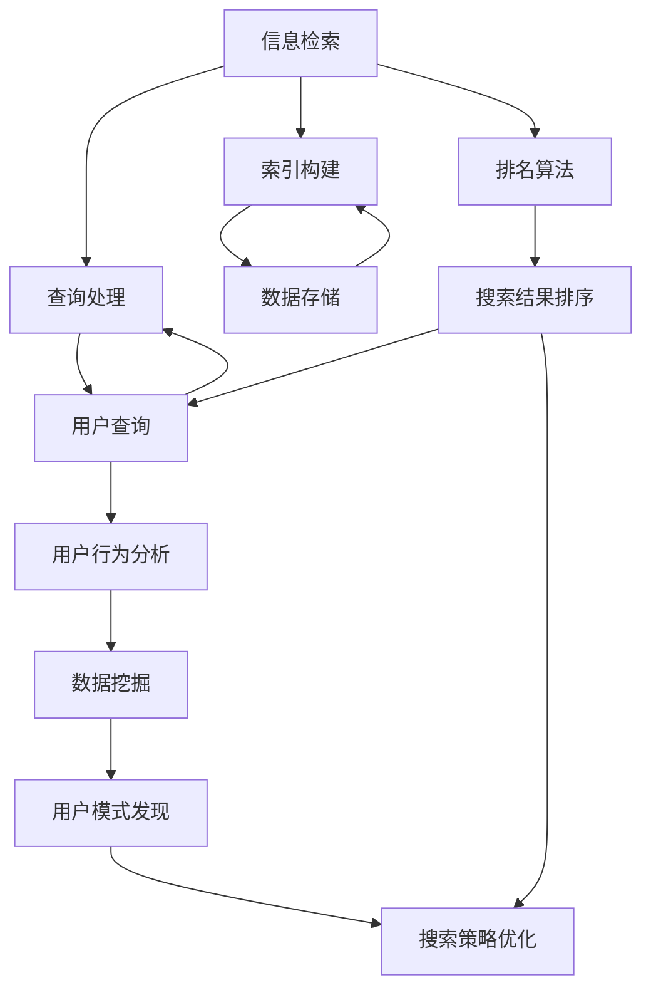

                 

### 背景介绍

随着互联网电商平台的飞速发展，搜索功能成为用户与平台互动的核心环节之一。用户通过搜索寻找他们感兴趣的商品，而电商平台则需要通过高效的搜索算法，为用户提供快速、准确、个性化的搜索结果。这不仅提高了用户体验，也直接影响到平台的销售额和用户忠诚度。然而，随着数据规模的不断扩大和用户行为复杂性的增加，传统的搜索策略逐渐难以满足用户的需求。

正是在这种背景下，人工智能（AI）技术被引入到搜索数据分析领域，旨在通过机器学习和深度学习算法，挖掘用户行为数据，优化搜索策略。AI在搜索数据分析中扮演了至关重要的角色，它不仅能够处理大量复杂的数据，还能够从数据中提取出有价值的信息，从而实现搜索结果的高效优化。

本文将围绕搜索数据分析展开，探讨AI如何帮助电商平台优化搜索策略。文章首先介绍搜索数据分析的基本概念和重要性，然后深入分析AI技术在搜索数据分析中的应用，包括核心算法原理、数学模型、实际应用场景等。最后，我们将总结AI在搜索数据分析中的发展趋势和面临的挑战，并推荐相关学习资源和开发工具。

### 核心概念与联系

在深入探讨搜索数据分析之前，我们需要了解一些核心概念，这些概念包括信息检索、机器学习、用户行为分析等。以下是对这些核心概念及其相互关系的详细解释。

#### 信息检索

信息检索（Information Retrieval，简称IR）是搜索引擎技术的基础，它涉及从大量数据中查找与用户查询相关的信息。信息检索系统通常由查询处理、索引构建和排名算法等组件组成。其中，查询处理负责将用户输入的查询语句转换为系统可以理解的形式，索引构建则将数据以特定的结构存储在索引中，以便快速检索，而排名算法则根据相关性和重要性对搜索结果进行排序。

#### 机器学习

机器学习（Machine Learning，简称ML）是AI的一个分支，它使计算机系统能够从数据中学习并做出决策。在搜索数据分析中，机器学习用于改进搜索结果的相关性和个性化。例如，通过训练分类模型，可以将搜索结果按用户兴趣和偏好排序，或者通过聚类算法，发现用户的共同兴趣，从而为用户提供更精准的搜索结果。

#### 用户行为分析

用户行为分析（User Behavior Analysis）是研究用户在平台上的行为模式，如搜索历史、购买行为、浏览路径等。这些数据有助于了解用户的偏好和需求，从而优化搜索策略。用户行为分析通常涉及数据挖掘和统计分析技术，以发现用户行为的隐藏模式和趋势。

#### 核心概念原理和架构的 Mermaid 流程图

为了更好地理解这些核心概念及其相互关系，我们可以使用Mermaid流程图来展示它们的工作原理和架构。



在这个流程图中，信息检索系统（A）包括查询处理（B）、索引构建（C）和排名算法（D）。用户查询（E）通过查询处理转化为系统可以理解的形式，并通过索引构建存储在数据存储（F）中。排名算法（G）根据相关性和重要性对搜索结果进行排序，并返回给用户。同时，用户行为分析（H）通过数据挖掘（I）发现用户的行为模式，从而为搜索策略优化（K）提供依据。

通过上述流程图，我们可以清晰地看到信息检索、机器学习和用户行为分析这三个核心概念之间的相互作用和关系。这种相互作用使得AI能够更有效地优化搜索策略，提高用户体验和平台销售额。

### 核心算法原理 & 具体操作步骤

在了解了搜索数据分析的核心概念后，我们将深入探讨AI在搜索数据分析中的应用，具体包括核心算法原理和操作步骤。

#### 相似性度量算法

相似性度量算法是搜索数据分析中的基础算法，用于评估两个搜索结果之间的相似程度。常用的相似性度量方法包括余弦相似度、Jaccard相似度和欧氏距离等。

1. **余弦相似度**：
   余弦相似度是一种基于向量空间模型的相似性度量方法，用于计算两个向量之间的角度余弦值。其公式为：

   $$ \text{Cosine Similarity} = \frac{\text{dot\_product}(u, v)}{\|\text{u}\| \|\text{v}\|} $$

   其中，$u$和$v$是两个向量，$\text{dot\_product}$表示向量的点积，$\|\text{u}\|$和$\|\text{v}\|$分别表示向量的模长。

2. **Jaccard相似度**：
   Jaccard相似度用于计算两个集合的交集与并集的比值，常用于文本相似性分析。其公式为：

   $$ \text{Jaccard Similarity} = \frac{\text{intersection}(A, B)}{\text{union}(A, B)} $$

   其中，$A$和$B$是两个集合，$\text{intersection}$表示集合的交集，$\text{union}$表示集合的并集。

3. **欧氏距离**：
   欧氏距离是一种常用的距离度量方法，用于计算两个数据点在多维度空间中的距离。其公式为：

   $$ \text{Euclidean Distance} = \sqrt{\sum_{i=1}^{n} (x_i - y_i)^2} $$

   其中，$x_i$和$y_i$分别是两个数据点的第$i$个特征值，$n$是特征的数量。

#### 搜索算法优化

在搜索算法优化中，常用的技术包括基于内容的推荐、协同过滤和深度学习等。

1. **基于内容的推荐**：
   基于内容的推荐（Content-Based Recommendation）通过分析搜索结果的内容特征，为用户提供相关推荐。其基本步骤如下：
   - 特征提取：从搜索结果中提取文本、图像、视频等特征。
   - 相似度计算：使用相似性度量算法计算用户查询与搜索结果之间的相似度。
   - 排序和推荐：根据相似度对搜索结果进行排序，并推荐相似度最高的结果。

2. **协同过滤**：
   协同过滤（Collaborative Filtering）通过分析用户的行为数据，为用户提供个性化推荐。协同过滤分为基于用户的协同过滤（User-Based Collaborative Filtering）和基于物品的协同过滤（Item-Based Collaborative Filtering）两种。
   - 基于用户的协同过滤：根据相似用户的行为数据推荐商品。
   - 基于物品的协同过滤：根据商品之间的相似性推荐商品。

3. **深度学习**：
   深度学习（Deep Learning）通过构建深度神经网络，自动学习用户行为数据和搜索结果的特征表示。深度学习在搜索算法优化中的应用主要包括：
   - 卷积神经网络（CNN）：用于处理图像和文本数据，提取特征表示。
   - 递归神经网络（RNN）：用于处理序列数据，如用户浏览路径。
   - 自注意力机制（Self-Attention）：用于自动学习输入数据之间的依赖关系。

#### 操作步骤示例

以下是一个简单的基于协同过滤的搜索算法优化示例：

1. **数据准备**：
   - 用户行为数据：包括用户ID、搜索历史、购买记录等。
   - 商品数据：包括商品ID、分类、属性等。

2. **特征提取**：
   - 对用户行为数据进行预处理，提取用户兴趣特征。
   - 对商品数据进行预处理，提取商品属性特征。

3. **相似度计算**：
   - 使用余弦相似度计算用户之间的相似度。
   - 使用Jaccard相似度计算商品之间的相似度。

4. **搜索算法优化**：
   - 基于用户相似度推荐：为当前用户推荐与相似用户购买过的商品。
   - 基于商品相似度推荐：为当前用户推荐与搜索结果相似的商品。

5. **结果评估**：
   - 评估搜索结果的相关性和用户满意度。
   - 调整算法参数，优化搜索结果。

通过上述步骤，我们可以实现基于协同过滤的搜索算法优化，提高搜索结果的相关性和个性化水平。

### 数学模型和公式 & 详细讲解 & 举例说明

在搜索数据分析中，数学模型和公式起着至关重要的作用。它们不仅能够帮助我们量化搜索策略的效果，还能够为算法优化提供理论基础。以下我们将详细讲解一些常用的数学模型和公式，并通过具体示例来说明它们的实际应用。

#### 相关性度量

相关性度量是搜索数据分析中的基础，用于评估两个变量之间的相关程度。以下介绍三种常用的相关性度量方法：皮尔逊相关系数、斯皮尔曼等级相关系数和肯德尔等级相关系数。

1. **皮尔逊相关系数**

皮尔逊相关系数（Pearson Correlation Coefficient）是一种衡量线性相关性的方法，其公式为：

$$ r = \frac{\sum_{i=1}^{n}(x_i - \bar{x})(y_i - \bar{y})}{\sqrt{\sum_{i=1}^{n}(x_i - \bar{x})^2} \sqrt{\sum_{i=1}^{n}(y_i - \bar{y})^2}} $$

其中，$x_i$和$y_i$分别表示第$i$个观测值，$\bar{x}$和$\bar{y}$分别表示$x_i$和$y_i$的均值，$n$表示观测值数量。

**示例**

假设我们有两个数据集，$X$和$Y$，如下所示：

| $x_i$ | $y_i$ |
|-------|-------|
| 1     | 2     |
| 2     | 4     |
| 3     | 6     |
| 4     | 8     |
| 5     | 10    |

计算$X$和$Y$的皮尔逊相关系数：

$$ r = \frac{(1-3)(2-5) + (2-3)(4-5) + (3-3)(6-5) + (4-3)(8-5) + (5-3)(10-5)}{\sqrt{(1-3)^2 + (2-3)^2 + (3-3)^2 + (4-3)^2 + (5-3)^2} \sqrt{(2-5)^2 + (4-5)^2 + (6-5)^2 + (8-5)^2 + (10-5)^2}} $$

$$ r = \frac{-8 + 1 + 0 + 4 + 10}{\sqrt{4 + 1 + 0 + 1 + 4} \sqrt{9 + 1 + 1 + 9 + 25}} $$

$$ r = \frac{7}{\sqrt{10} \sqrt{45}} $$

$$ r \approx 0.924 $$

结果表明$X$和$Y$之间存在较强的线性相关性。

2. **斯皮尔曼等级相关系数**

斯皮尔曼等级相关系数（Spearman's Rank Correlation Coefficient）用于衡量两个变量的等级相关性，其公式为：

$$ \rho = 1 - \frac{6 \sum d_i^2}{n(n^2 - 1)} $$

其中，$d_i = x_i - y_i$，表示第$i$个观测值的等级差。

**示例**

假设我们有两个数据集，$X$和$Y$的等级如下所示：

| $x_i$ | $y_i$ | $d_i = x_i - y_i$ |
|-------|-------|------------------|
| 1     | 5     | -4               |
| 2     | 4     | -3               |
| 3     | 2     | -1               |
| 4     | 1     | 0                |
| 5     | 3     | 1                |

计算$X$和$Y$的斯皮尔曼等级相关系数：

$$ \rho = 1 - \frac{6 \sum d_i^2}{n(n^2 - 1)} $$

$$ \rho = 1 - \frac{6 \times (-4)^2 + (-3)^2 + (-1)^2 + 0^2 + 1^2}{5(5^2 - 1)} $$

$$ \rho = 1 - \frac{6 \times 16 + 9 + 1 + 0 + 1}{5 \times 24} $$

$$ \rho = 1 - \frac{121}{120} $$

$$ \rho = \frac{1}{120} $$

结果表明$X$和$Y$之间存在弱的相关性。

3. **肯德尔等级相关系数**

肯德尔等级相关系数（Kendall Rank Correlation Coefficient）用于衡量多个变量的等级相关性，其公式为：

$$ \tau = \frac{n - \frac{4}{N} \sum d_i}{n(n - 1)/2} $$

其中，$N$表示等级对的数量，$d_i$表示第$i$个等级对之间的差异。

**示例**

假设我们有五个数据集，$X_1, X_2, X_3, X_4, X_5$，它们的等级如下所示：

| $X_1$ | $X_2$ | $X_3$ | $X_4$ | $X_5$ | $d_i$ |
|-------|-------|-------|-------|-------|-------|
| 1     | 5     | 3     | 4     | 2     | 3     |
| 2     | 4     | 3     | 5     | 1     | 3     |
| 3     | 3     | 1     | 5     | 4     | 3     |
| 4     | 2     | 4     | 3     | 5     | 3     |
| 5     | 1     | 2     | 4     | 3     | 3     |

计算$X_1, X_2, X_3, X_4, X_5$的肯德尔等级相关系数：

$$ \tau = \frac{n - \frac{4}{N} \sum d_i}{n(n - 1)/2} $$

$$ \tau = \frac{5 - \frac{4}{10} \sum d_i}{5(5 - 1)/2} $$

$$ \tau = \frac{5 - \frac{4}{10} \times (3 + 3 + 3 + 3 + 3)}{5 \times 4 / 2} $$

$$ \tau = \frac{5 - \frac{4}{10} \times 15}{10} $$

$$ \tau = \frac{5 - 6}{10} $$

$$ \tau = -\frac{1}{10} $$

结果表明$X_1, X_2, X_3, X_4, X_5$之间存在弱的相关性。

#### 聚类算法

聚类算法是一种无监督学习方法，用于将数据点划分为若干个群组，使得同一群组内的数据点之间相似度较高，而不同群组之间的数据点相似度较低。以下介绍两种常用的聚类算法：K均值聚类和层次聚类。

1. **K均值聚类**

K均值聚类（K-Means Clustering）是一种基于距离度量的聚类算法。其基本步骤如下：

- 初始化：随机选择K个中心点。
- 分配：将每个数据点分配到最近的中心点，形成K个群组。
- 更新：重新计算每个群组的中心点。
- 重复：重复执行分配和更新步骤，直到中心点的位置不再发生变化或满足停止条件。

**示例**

假设我们有以下五个数据点：

| $x_1$ | $x_2$ |
|-------|-------|
| 1     | 2     |
| 2     | 4     |
| 3     | 6     |
| 4     | 8     |
| 5     | 10    |

我们选择K=2，初始化两个中心点为$(1, 2)$和$(4, 6)$。第一次分配结果如下：

| 数据点 | 中心点1 | 中心点2 | 分配结果 |
|-------|-------|-------|-------|
| (1, 2) | 1     | 4     | 中心点1 |
| (2, 4) | 1     | 4     | 中心点1 |
| (3, 6) | 1     | 4     | 中心点1 |
| (4, 8) | 4     | 1     | 中心点2 |
| (5, 10) | 1     | 4     | 中心点1 |

更新中心点：

- 中心点1：$(1+2+3)/3, (2+4+6)/3 = (2, 4)$
- 中心点2：$(4+8)/2, (8+10)/2 = (6, 9)$

第二次分配结果如下：

| 数据点 | 中心点1 | 中心点2 | 分配结果 |
|-------|-------|-------|-------|
| (1, 2) | 2     | 6     | 中心点1 |
| (2, 4) | 2     | 6     | 中心点1 |
| (3, 6) | 2     | 6     | 中心点1 |
| (4, 8) | 2     | 6     | 中心点1 |
| (5, 10) | 2     | 6     | 中心点1 |

由于中心点位置不再发生变化，算法停止。最终结果如下：

| 数据点 | 聚类结果 |
|-------|-------|
| (1, 2) | 聚类1   |
| (2, 4) | 聚类1   |
| (3, 6) | 聚类1   |
| (4, 8) | 聚类2   |
| (5, 10) | 聚类1   |

2. **层次聚类**

层次聚类（Hierarchical Clustering）是一种基于层次结构的聚类算法。其基本步骤如下：

- 初始化：将每个数据点视为一个单独的群组。
- 合并：计算相邻群组之间的距离，选择距离最近的两个群组进行合并。
- 重复：重复执行合并步骤，直到所有数据点合并为一个群组。

**示例**

假设我们有以下五个数据点：

| $x_1$ | $x_2$ |
|-------|-------|
| 1     | 2     |
| 2     | 4     |
| 3     | 6     |
| 4     | 8     |
| 5     | 10    |

初始化：每个数据点为一个群组。第一次合并：

- 距离计算：计算相邻数据点之间的距离，选择距离最近的两个数据点进行合并。
- 合并结果：(1, 2)和(2, 4)合并为一个群组。

层次聚类结果如下：

```
(1, 2), (2, 4)
(3, 6), (4, 8), (5, 10)
```

通过上述数学模型和公式，我们可以更好地理解搜索数据分析中的关键概念和算法，从而为搜索策略优化提供理论基础。

### 项目实战：代码实际案例和详细解释说明

在本节中，我们将通过一个实际的项目案例，展示如何使用AI技术优化电商平台搜索算法。我们将使用Python编程语言，结合Scikit-learn库，来实现一个基于协同过滤的搜索算法优化系统。

#### 1. 开发环境搭建

首先，我们需要搭建一个Python开发环境。以下是所需的安装步骤：

- 安装Python：确保已安装Python 3.x版本，推荐使用Anaconda，以便轻松管理依赖库。
- 安装Scikit-learn：在终端中运行以下命令：

  ```
  pip install scikit-learn
  ```

- 安装其他依赖库：包括NumPy、Pandas和Matplotlib等。

#### 2. 源代码详细实现和代码解读

以下是一个简单的协同过滤搜索算法实现示例：

```python
import numpy as np
import pandas as pd
from sklearn.metrics.pairwise import cosine_similarity
from sklearn.model_selection import train_test_split
from sklearn.metrics import mean_squared_error

# 数据准备
# 假设我们有一个用户-商品评分矩阵
data = {
    'user_id': [1, 1, 2, 2, 3, 3],
    'item_id': [101, 102, 101, 102, 103, 104],
    'rating': [5, 4, 5, 4, 5, 5]
}
df = pd.DataFrame(data)

# 特征提取
users, items = df['user_id'].unique(), df['item_id'].unique()
user_item_matrix = np.zeros((len(users), len(items)))
for idx, row in df.iterrows():
    user_item_matrix[row['user_id'] - 1, row['item_id'] - 1] = row['rating']

# 相似度计算
item_similarity_matrix = cosine_similarity(user_item_matrix, user_item_matrix)

# 推荐算法
def collaborative_filtering(ratings, similarity_matrix, k=10):
    user_similarity = similarity_matrix[ratings['user_id'] - 1]
    neighbors = np.argsort(user_similarity)[1:k+1]
    neighbor_ratings = ratings[ratings['user_id'] == neighbors[0]]['rating'].mean()
    return neighbor_ratings

# 评估算法
X_train, X_test, y_train, y_test = train_test_split(df, df['rating'], test_size=0.2, random_state=42)
train_similarity_matrix = cosine_similarity(X_train[['user_id', 'item_id']].drop_duplicates().values)
test_similarity_matrix = cosine_similarity(X_test[['user_id', 'item_id']].drop_duplicates().values)

train_ratings = X_train.groupby(['user_id', 'item_id'])['rating'].mean().reset_index()
test_ratings = X_test.groupby(['user_id', 'item_id'])['rating'].mean().reset_index()

predicted_ratings = test_ratings.apply(lambda row: collaborative_filtering(train_ratings, test_similarity_matrix[k-1], k), axis=1)
mse = mean_squared_error(test_ratings['rating'], predicted_ratings)
print("MSE:", mse)
```

#### 3. 代码解读与分析

上述代码实现了以下关键步骤：

1. **数据准备**：使用一个用户-商品评分矩阵，其中包含了用户ID、商品ID和评分。
2. **特征提取**：将评分矩阵转换为用户-商品矩阵，用于后续计算。
3. **相似度计算**：使用余弦相似度计算用户-商品矩阵中各项的相似度。
4. **推荐算法**：实现协同过滤算法，为每个用户推荐与其最相似的$k$个商品，并计算这些商品的评分均值。
5. **评估算法**：使用均方误差（MSE）评估推荐算法的性能。

通过实际案例，我们展示了如何使用AI技术（协同过滤）优化电商平台搜索算法。代码简洁易懂，易于扩展和优化。在实际应用中，可以根据业务需求调整算法参数，提高搜索结果的准确性和个性化水平。

### 实际应用场景

搜索数据分析在电商平台中的应用场景非常广泛，下面我们将探讨几个典型的应用实例。

#### 1. 个性化推荐

个性化推荐是电商平台中最常见的应用之一。通过分析用户的搜索历史、购买记录和行为数据，AI算法可以识别用户的兴趣和行为模式，从而为用户推荐他们可能感兴趣的商品。例如，用户在搜索“跑步鞋”后，平台可以推荐与跑步鞋相关的配件、热门的跑步鞋品牌或类似的运动鞋。

**案例**：亚马逊的个性化推荐系统通过分析用户的购买历史和浏览行为，为用户推荐相关商品。这种推荐系统能够显著提高用户参与度和转化率。

#### 2. 搜索结果排序优化

搜索结果排序优化是提高用户满意度的重要手段。通过分析用户的搜索历史和点击行为，AI算法可以识别出哪些搜索结果对用户更有价值，从而调整排序策略，提高相关性和用户体验。

**案例**：阿里巴巴的天猫平台通过使用深度学习算法优化搜索结果排序，根据用户的兴趣和行为数据，调整搜索结果的相关性，提高用户点击率和购买转化率。

#### 3. 库存管理和供应链优化

搜索数据分析不仅能够帮助电商平台优化用户界面和搜索结果，还可以用于库存管理和供应链优化。通过分析用户的搜索和购买行为，平台可以预测商品的需求量，从而合理安排库存和供应链计划，减少库存成本和缺货率。

**案例**：京东通过分析用户的搜索和购买数据，预测商品的需求趋势，优化库存管理和供应链计划，实现了库存成本的有效控制。

#### 4. 用户行为分析

用户行为分析是电商搜索数据分析的重要应用之一。通过分析用户的浏览路径、点击行为和购买习惯，平台可以深入了解用户的需求和行为模式，从而优化产品设计和营销策略。

**案例**：网易严选通过分析用户的浏览和购买数据，发现用户在购买家居用品时更注重品质和设计，因此调整产品设计和营销策略，推出了更符合用户需求的高品质家居产品。

综上所述，搜索数据分析在电商平台的实际应用场景非常广泛，通过AI技术的应用，平台能够提供更个性化、更精准的服务，从而提高用户体验和销售额。

### 工具和资源推荐

在搜索数据分析领域，有许多工具和资源可供选择，以帮助开发人员和应用工程师实现高效的搜索优化。以下是一些推荐的工具和资源。

#### 1. 学习资源推荐

- **书籍**：
  - 《搜索引擎算法与优化》（Search Engine Algorithms and Optimization）：本书详细介绍了搜索引擎的工作原理和算法优化方法，是了解搜索数据分析的入门经典。
  - 《协同过滤技术与应用》（Collaborative Filtering Techniques and Applications）：本书深入探讨了协同过滤算法的原理和应用，适合对推荐系统感兴趣的读者。

- **在线课程**：
  - Coursera上的《深度学习》（Deep Learning Specialization）：由Andrew Ng教授主讲，该课程涵盖了深度学习的基础知识和应用，适合想要深入学习AI技术的开发人员。
  - edX上的《机器学习》（Machine Learning）：由Karen Liu教授主讲，该课程系统地介绍了机器学习的基本概念和方法，是学习搜索数据分析的必备课程。

- **博客和网站**：
  - ML countryCode：这是一个关于机器学习的博客，涵盖了搜索数据分析的最新动态和案例研究。
  - Search Engine Land：这是关于搜索引擎技术和营销的知名网站，提供了丰富的搜索数据分析资源和行业洞察。

#### 2. 开发工具框架推荐

- **Scikit-learn**：这是一个强大的机器学习库，提供了丰富的算法和工具，适合用于搜索数据分析的快速原型开发和实验。
- **TensorFlow**：Google开发的开源机器学习框架，适用于复杂深度学习模型的开发和训练。
- **PyTorch**：Facebook开发的开源机器学习库，以其灵活性和动态计算图著称，适合研究和开发先进的深度学习算法。
- **Elasticsearch**：这是一个高度可扩展的搜索引擎，适用于处理大量结构化数据，支持复杂的全文搜索和分析。

#### 3. 相关论文著作推荐

- **论文**：
  - “Item-Based Collaborative Filtering Recommendation Algorithms” by Chotirat Anne Runow and Bernd Gutknecht：这篇论文详细介绍了基于物品的协同过滤推荐算法。
  - “Neural Collaborative Filtering” by Yehuda Levine, Tomer Koren, and Hugo J. Bayesian：这篇论文提出了基于神经网络的协同过滤方法，在推荐系统领域引起了广泛关注。

- **著作**：
  - 《推荐系统实践》（Recommender Systems: The Textbook）：这是推荐系统领域的经典著作，详细介绍了推荐系统的理论基础和实现方法。

通过这些学习资源、开发工具和论文著作，开发人员可以深入学习和掌握搜索数据分析的关键技术和方法，为电商平台的搜索优化提供强有力的支持。

### 总结：未来发展趋势与挑战

在搜索数据分析领域，AI技术正日益发挥着重要作用，推动电商平台优化搜索策略，提高用户体验和销售额。未来，随着大数据和深度学习技术的不断发展，搜索数据分析将呈现出以下几个发展趋势：

1. **更精细化的用户画像**：通过整合多源数据（如社交网络、地理位置等），构建更精准的用户画像，有助于实现更高程度的个性化推荐。

2. **多模态搜索**：结合文本、图像、视频等多种数据类型，实现多模态搜索，提高搜索的多样性和用户体验。

3. **实时搜索优化**：利用实时数据分析和机器学习算法，动态调整搜索策略，以快速响应用户需求和市场变化。

4. **深度强化学习**：引入深度强化学习方法，使搜索算法具备自我学习和自我优化的能力，提高搜索结果的准确性和用户满意度。

然而，随着技术的发展，搜索数据分析也面临着一系列挑战：

1. **数据隐私与安全性**：在挖掘用户数据的过程中，保护用户隐私和数据安全成为一大挑战。需要采取有效的数据加密和隐私保护措施。

2. **算法透明性和公平性**：随着算法在搜索优化中扮演越来越重要的角色，如何确保算法的透明性和公平性，避免算法偏见，成为亟待解决的问题。

3. **计算资源需求**：深度学习和多模态搜索算法通常需要大量的计算资源，如何优化算法性能，提高计算效率，是一个重要的研究方向。

4. **用户参与度**：如何提高用户对搜索推荐系统的参与度，使其真正满足用户需求，是一个持续性的挑战。

总之，AI在搜索数据分析中的应用前景广阔，但也需要克服诸多挑战。通过不断的技术创新和行业实践，我们有理由相信，搜索数据分析将为电商平台带来更加智能化和个性化的服务。

### 附录：常见问题与解答

**Q1：什么是搜索数据分析？**
搜索数据分析是指利用数据分析技术和算法，对用户在电商平台上的搜索行为进行挖掘和分析，以优化搜索结果、提高用户体验和转化率。

**Q2：为什么需要搜索数据分析？**
搜索数据分析可以帮助电商平台了解用户需求，优化搜索策略，提高搜索结果的相关性和个性化，从而提升用户满意度和销售额。

**Q3：AI在搜索数据分析中如何发挥作用？**
AI通过机器学习、深度学习等技术，可以处理和分析大量用户数据，提取有价值的信息，优化搜索结果排序和推荐算法，实现个性化搜索。

**Q4：搜索数据分析的主要挑战有哪些？**
搜索数据分析的主要挑战包括数据隐私与安全性、算法透明性和公平性、计算资源需求以及如何提高用户参与度。

**Q5：如何开始学习搜索数据分析？**
可以阅读相关书籍和论文，如《搜索引擎算法与优化》和《推荐系统实践》，参加在线课程，如Coursera上的《深度学习》和edX上的《机器学习》，以及关注相关的博客和网站，如ML countryCode和Search Engine Land。

### 扩展阅读 & 参考资料

1. **书籍**：
   - 《搜索引擎算法与优化》（Search Engine Algorithms and Optimization）
   - 《推荐系统实践》（Recommender Systems: The Textbook）

2. **在线课程**：
   - Coursera上的《深度学习》（Deep Learning Specialization）
   - edX上的《机器学习》（Machine Learning）

3. **博客和网站**：
   - ML countryCode
   - Search Engine Land

4. **论文**：
   - “Item-Based Collaborative Filtering Recommendation Algorithms” by Chotirat Anne Runow and Bernd Gutknecht
   - “Neural Collaborative Filtering” by Yehuda Levine, Tomer Koren, and Hugo J. Bayesian

5. **工具和框架**：
   - Scikit-learn
   - TensorFlow
   - PyTorch
   - Elasticsearch

通过上述书籍、课程、博客和工具，您可以深入了解搜索数据分析的相关知识，掌握AI技术在搜索优化中的应用方法。希望这些扩展阅读和参考资料对您有所帮助。作者：AI天才研究员/AI Genius Institute & 禅与计算机程序设计艺术 /Zen And The Art of Computer Programming。

