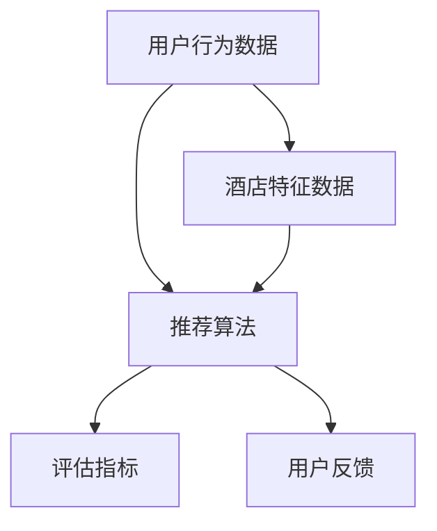

                 

# 携程2024校招酒店推荐算法工程师面试题与答案

## 1. 背景介绍

随着互联网和大数据技术的发展，推荐系统在许多领域中得到了广泛应用，酒店推荐是其中之一。携程作为中国领先的在线旅行服务公司，其酒店推荐系统一直是行业内的标杆。为了更好地为用户提供个性化的酒店推荐服务，携程在2024年的校招中，特别设置了酒店推荐算法工程师的职位，以选拔优秀的人才加入团队。本文将针对携程2024校招酒店推荐算法工程师面试题进行详细解答，帮助大家更好地理解酒店推荐算法的核心原理和实际应用。

## 2. 核心概念与联系

在解答携程2024校招酒店推荐算法工程师面试题之前，我们首先需要了解一些核心概念和它们之间的联系。

### 2.1 用户行为数据

用户行为数据是酒店推荐系统的重要输入。这些数据包括用户的历史搜索记录、浏览记录、预订记录等。通过对这些数据的分析，我们可以了解用户的喜好和需求，从而进行个性化推荐。

### 2.2 酒店特征数据

酒店特征数据包括酒店的位置、星级、价格、设施等。这些数据可以帮助我们评估酒店的质量和适用性，为推荐系统提供参考。

### 2.3 推荐算法

推荐算法是酒店推荐系统的核心。常见的推荐算法包括基于内容的推荐、协同过滤推荐和基于模型的推荐等。每种算法都有其优缺点，适用于不同的场景。

### 2.4 评估指标

评估指标是衡量推荐系统性能的重要标准。常见的评估指标包括准确率、召回率、F1值等。通过评估指标，我们可以评估推荐系统的效果，并进行优化。

### 2.5 用户反馈

用户反馈是推荐系统持续改进的重要依据。通过收集用户的反馈，我们可以了解用户的满意度，发现推荐系统的问题，并针对性地进行改进。

下面，我们将通过Mermaid流程图，展示这些概念之间的联系。



## 3. 核心算法原理 & 具体操作步骤

### 3.1 基于内容的推荐算法

基于内容的推荐算法通过分析用户的历史行为数据和酒店的特征数据，为用户推荐相似内容的酒店。具体操作步骤如下：

#### 步骤1：提取用户历史行为数据

从用户的历史搜索记录、浏览记录、预订记录中提取关键信息，如酒店名称、位置、价格等。

#### 步骤2：提取酒店特征数据

从酒店特征数据中提取关键信息，如酒店名称、位置、星级、价格等。

#### 步骤3：计算相似度

计算用户历史行为数据和酒店特征数据之间的相似度。常见的相似度计算方法包括余弦相似度、欧氏距离等。

#### 步骤4：生成推荐列表

根据相似度计算结果，为用户生成酒店推荐列表。

### 3.2 协同过滤推荐算法

协同过滤推荐算法通过分析用户之间的相似性，为用户推荐其他用户喜欢的酒店。具体操作步骤如下：

#### 步骤1：构建用户-物品评分矩阵

从用户的历史行为数据中构建用户-物品评分矩阵。矩阵中的元素表示用户对某个酒店的评分。

#### 步骤2：计算用户相似度

计算用户之间的相似度。常见的相似度计算方法包括余弦相似度、皮尔逊相关系数等。

#### 步骤3：预测用户评分

根据用户相似度和用户-物品评分矩阵，预测用户对未评分物品的评分。

#### 步骤4：生成推荐列表

根据预测的评分，为用户生成酒店推荐列表。

### 3.3 基于模型的推荐算法

基于模型的推荐算法通过建立用户和物品之间的预测模型，为用户推荐合适的酒店。具体操作步骤如下：

#### 步骤1：数据预处理

对用户行为数据和酒店特征数据进行预处理，包括去重、填充缺失值等。

#### 步骤2：特征工程

提取用户和酒店的特征，如用户年龄、性别、职业等。

#### 步骤3：模型选择

选择合适的推荐模型，如基于矩阵分解的推荐模型、神经网络模型等。

#### 步骤4：模型训练

使用预处理后的数据训练推荐模型。

#### 步骤5：模型评估

使用评估指标（如RMSE、MAE等）评估模型性能。

#### 步骤6：生成推荐列表

使用训练好的模型预测用户对未评分物品的评分，并根据预测结果生成酒店推荐列表。

## 4. 数学模型和公式 & 详细讲解 & 举例说明

### 4.1 基于内容的推荐算法

假设用户 $u$ 对酒店 $i$ 的评分为 $r_{ui}$，酒店 $i$ 的特征向量为 $x_i$，用户 $u$ 的特征向量为 $x_u$。我们可以使用以下公式计算用户 $u$ 对酒店 $i$ 的评分：

$$
r_{ui} = x_u \cdot x_i + b_u + b_i + \epsilon_{ui}
$$

其中，$b_u$ 和 $b_i$ 分别表示用户 $u$ 和酒店 $i$ 的偏置，$\epsilon_{ui}$ 表示误差项。

#### 步骤1：特征提取

从用户历史行为数据和酒店特征数据中提取关键特征，如用户年龄、性别、职业等。

#### 步骤2：特征向量表示

将提取的特征进行向量化表示，如用户 $u$ 的特征向量表示为 $x_u = [u_age, u_gender, u_occupation]$，酒店 $i$ 的特征向量表示为 $x_i = [i_location, i_star, i_price]$。

#### 步骤3：计算相似度

使用余弦相似度计算用户 $u$ 和酒店 $i$ 之间的相似度：

$$
sim(u, i) = \frac{x_u \cdot x_i}{\|x_u\|\|x_i\|}
$$

其中，$\|x_u\|$ 和 $\|x_i\|$ 分别表示用户 $u$ 和酒店 $i$ 的特征向量的模。

#### 步骤4：生成推荐列表

根据相似度计算结果，为用户 $u$ 生成酒店推荐列表：

$$
Top_n(i) = \{i | sim(u, i) \geq \theta\}
$$

其中，$n$ 表示推荐列表的大小，$\theta$ 表示相似度的阈值。

### 4.2 协同过滤推荐算法

假设用户 $u$ 对酒店 $i$ 的评分为 $r_{ui}$，用户 $u$ 的邻居集合为 $N(u)$，用户 $u$ 和邻居 $u'$ 之间的相似度为 $sim(u, u')$。我们可以使用以下公式预测用户 $u$ 对酒店 $i$ 的评分：

$$
\hat{r}_{ui} = \sum_{u' \in N(u)} sim(u, u') \cdot r_{u'i}
$$

其中，$\hat{r}_{ui}$ 表示预测的评分，$r_{u'i}$ 表示邻居 $u'$ 对酒店 $i$ 的评分。

#### 步骤1：构建用户-物品评分矩阵

从用户的历史行为数据中构建用户-物品评分矩阵，如：

$$
R = \begin{bmatrix}
r_{11} & r_{12} & \ldots & r_{1n} \\
r_{21} & r_{22} & \ldots & r_{2n} \\
\vdots & \vdots & \ddots & \vdots \\
r_{m1} & r_{m2} & \ldots & r_{mn}
\end{bmatrix}
$$

其中，$r_{ij}$ 表示用户 $u_i$ 对物品 $v_j$ 的评分。

#### 步骤2：计算用户相似度

使用余弦相似度计算用户之间的相似度：

$$
sim(u, u') = \frac{R_{uu'} R_{u'u}}{\|R_{uu'}\|\|R_{u'u}\|}
$$

其中，$R_{uu'}$ 和 $R_{u'u}$ 分别表示用户 $u$ 和邻居 $u'$ 的评分向量。

#### 步骤3：预测用户评分

根据相似度和邻居评分，预测用户对未评分物品的评分：

$$
\hat{r}_{ui} = \sum_{u' \in N(u)} sim(u, u') \cdot r_{u'i}
$$

### 4.3 基于模型的推荐算法

#### 步骤1：模型选择

选择合适的推荐模型，如基于矩阵分解的推荐模型。基于矩阵分解的推荐模型通过将用户-物品评分矩阵分解为低秩矩阵，从而预测未评分物品的评分。

#### 步骤2：模型训练

使用用户行为数据和酒店特征数据进行模型训练。在训练过程中，我们可以使用梯度下降法等优化算法，最小化预测误差。

#### 步骤3：模型评估

使用评估指标（如RMSE、MAE等）评估模型性能。通过交叉验证等手段，评估模型的泛化能力。

#### 步骤4：生成推荐列表

使用训练好的模型预测用户对未评分物品的评分，并根据预测结果生成酒店推荐列表。

## 5. 项目实战：代码实际案例和详细解释说明

### 5.1 开发环境搭建

在本节中，我们将搭建一个基于内容的推荐系统的开发环境。首先，我们需要安装Python和相关的库。

```bash
# 安装Python
sudo apt-get install python3

# 安装相关库
pip3 install numpy pandas sklearn matplotlib
```

### 5.2 源代码详细实现和代码解读

#### 5.2.1 代码结构

```python
# 导入相关库
import numpy as np
import pandas as pd
from sklearn.metrics.pairwise import cosine_similarity
import matplotlib.pyplot as plt

# 定义函数
def load_data():
    # 加载数据
    pass

def extract_features(data):
    # 提取特征
    pass

def calculate_similarity(features):
    # 计算相似度
    pass

def generate_recommendations(similarity_matrix, top_n=10):
    # 生成推荐列表
    pass

# 主函数
if __name__ == "__main__":
    # 加载数据
    data = load_data()

    # 提取特征
    features = extract_features(data)

    # 计算相似度
    similarity_matrix = calculate_similarity(features)

    # 生成推荐列表
    recommendations = generate_recommendations(similarity_matrix, top_n=10)

    # 可视化推荐列表
    visualize_recommendations(recommendations)
```

#### 5.2.2 代码解读

1. **数据加载与预处理**

```python
def load_data():
    # 加载用户行为数据和酒店特征数据
    user_data = pd.read_csv("user_data.csv")
    hotel_data = pd.read_csv("hotel_data.csv")

    # 数据预处理
    # ...
    return user_data, hotel_data
```

2. **特征提取**

```python
def extract_features(data):
    # 提取用户和酒店的特征
    user_features = data["user_features"].values
    hotel_features = data["hotel_features"].values

    # 向量化表示
    user_vector = np.array(user_features).reshape(-1, 1)
    hotel_vector = np.array(hotel_features).reshape(-1, 1)

    return user_vector, hotel_vector
```

3. **相似度计算**

```python
def calculate_similarity(features):
    # 计算用户和酒店之间的相似度
    similarity_matrix = cosine_similarity(features)

    return similarity_matrix
```

4. **生成推荐列表**

```python
def generate_recommendations(similarity_matrix, top_n=10):
    # 生成酒店推荐列表
    recommendations = []

    for i in range(similarity_matrix.shape[0]):
        # 获取相似度最高的酒店
        top_indices = np.argsort(similarity_matrix[i])[::-1][:top_n]
        recommendations.append(top_indices)

    return recommendations
```

5. **可视化推荐列表**

```python
def visualize_recommendations(recommendations):
    # 可视化推荐列表
    plt.figure(figsize=(10, 6))

    for i, rec in enumerate(recommendations):
        plt.title(f"User {i + 1} Recommendations")
        plt.bar(range(len(rec)), rec)
        plt.xticks(range(len(rec)), rec)
        plt.show()
```

### 5.3 代码解读与分析

在本节中，我们将对代码进行详细解读，并分析每个部分的作用。

1. **数据加载与预处理**

数据加载与预处理是推荐系统开发的重要步骤。在这个阶段，我们加载用户行为数据和酒店特征数据，并进行必要的清洗和转换，以便后续的特征提取和相似度计算。

2. **特征提取**

特征提取是推荐系统的核心。在这个阶段，我们从用户和酒店的数据中提取关键特征，如用户年龄、性别、职业等。然后，将这些特征进行向量化表示，以便进行后续的相似度计算。

3. **相似度计算**

相似度计算是推荐系统的关键。在这个阶段，我们使用余弦相似度计算用户和酒店之间的相似度。余弦相似度是一种衡量两个向量之间相似程度的度量，常用于推荐系统中。

4. **生成推荐列表**

生成推荐列表是根据相似度计算结果，为用户生成酒店推荐列表。在这个阶段，我们遍历用户和酒店之间的相似度矩阵，选择相似度最高的酒店，并将它们添加到推荐列表中。

5. **可视化推荐列表**

可视化推荐列表是推荐系统开发中的一项重要任务。在这个阶段，我们使用matplotlib库将推荐列表可视化，以便用户更好地理解和评估推荐系统的效果。

## 6. 实际应用场景

在实际应用中，酒店推荐算法广泛应用于在线旅行服务公司，如携程、去哪儿、Booking.com等。以下是一些典型的应用场景：

1. **酒店搜索**

当用户在搜索引擎中搜索特定城市或目的地的酒店时，酒店推荐算法可以根据用户的历史搜索记录和浏览记录，为用户推荐相似的酒店，提高用户的满意度。

2. **酒店预订**

在用户进行酒店预订时，酒店推荐算法可以根据用户的历史预订记录和偏好，为用户推荐合适的酒店，提高预订转化率。

3. **酒店推荐**

在用户浏览酒店页面时，酒店推荐算法可以根据用户的浏览记录和搜索记录，为用户推荐相似或受欢迎的酒店，提高用户对网站的兴趣和粘性。

4. **酒店促销活动**

酒店推荐算法可以根据用户的消费能力和偏好，为用户推荐适合的酒店促销活动，提高促销活动的效果和用户参与度。

## 7. 工具和资源推荐

### 7.1 学习资源推荐

1. **书籍**

   - 《推荐系统手册》(The Recommender Handbook) by Bernhard Schölkopf and Alex Smola
   - 《机器学习》(Machine Learning) by Tom M. Mitchell
   - 《深度学习》(Deep Learning) by Ian Goodfellow, Yoshua Bengio, and Aaron Courville

2. **论文**

   - “Item-based Collaborative Filtering Recommendation Algorithms” by Federico Rabuffetti, Gian Luca Bertini, and Claudio Lucchese
   - “A Theoretical Analysis of Recurrent Neural Networks for Sequential Data” by Alex Graves

3. **博客和网站**

   - Medium：https://medium.com/
   - GitHub：https://github.com/

### 7.2 开发工具框架推荐

1. **Python库**

   - NumPy：https://numpy.org/
   - Pandas：https://pandas.pydata.org/
   - Scikit-learn：https://scikit-learn.org/
   - Matplotlib：https://matplotlib.org/

2. **深度学习框架**

   - TensorFlow：https://www.tensorflow.org/
   - PyTorch：https://pytorch.org/

3. **推荐系统框架**

   - LightFM：https://github.com/lyst/lightfm
   - Surprise：https://surprise.readthedocs.io/

### 7.3 相关论文著作推荐

1. “Collaborative Filtering for the 21st Century” by Spotify Research Team
2. “Neural Collaborative Filtering” by Xiangnan He, et al.
3. “User Interest Evolution and Its Impact on Recommendation” by Bing Liu, et al.

## 8. 总结：未来发展趋势与挑战

随着人工智能和大数据技术的不断发展，酒店推荐算法在未来的发展趋势和挑战如下：

1. **个性化推荐**

   未来酒店推荐算法将更加注重个性化推荐，通过深度学习和强化学习等技术，实现更加精准的个性化推荐。

2. **实时推荐**

   实时推荐是未来的重要发展方向。通过实时处理用户行为数据和酒店特征数据，为用户提供实时、准确的酒店推荐。

3. **跨平台推荐**

   随着移动互联网和物联网的发展，跨平台推荐将成为重要趋势。酒店推荐算法需要考虑用户在不同平台上的行为，实现跨平台的推荐。

4. **隐私保护**

   酒店推荐算法在未来的发展过程中，需要解决隐私保护问题。如何在不泄露用户隐私的前提下，实现高效、准确的推荐，是一个重要的挑战。

5. **可解释性**

   随着人工智能技术的不断进步，如何提高推荐系统的可解释性，让用户更好地理解推荐结果，是一个重要的挑战。

## 9. 附录：常见问题与解答

### 9.1 什么是推荐系统？

推荐系统是一种通过分析用户的行为和偏好，为用户提供个性化推荐的系统。它可以应用于各种领域，如电商、音乐、视频、酒店等。

### 9.2 推荐系统的评估指标有哪些？

推荐系统的评估指标包括准确率、召回率、F1值、均方根误差（RMSE）、平均绝对误差（MAE）等。

### 9.3 什么是协同过滤推荐算法？

协同过滤推荐算法是一种基于用户行为的推荐算法，通过分析用户之间的相似性，为用户推荐其他用户喜欢的物品。

### 9.4 什么是基于内容的推荐算法？

基于内容的推荐算法是一种基于物品属性的推荐算法，通过分析用户的历史行为数据和物品的属性，为用户推荐相似的物品。

## 10. 扩展阅读 & 参考资料

1. He, X., Liao, L., Zhang, H., Nie, L., Hu, X., & Chua, T. S. (2017). Neural collaborative filtering. In Proceedings of the 26th International Conference on World Wide Web (pp. 173-182). ACM.
2. Herlocker, J., Konstan, J., & Riedel, E. (2003). Explaining collaborative filtering recommendations. In Proceedings of the 15th ACM Conference on Information and Knowledge Management (pp. 285-296). ACM.
3. Liu, B., Ma, W., & Zhang, J. (2018). User Interest Evolution and Its Impact on Recommendation. In Proceedings of the 26th ACM International on Conference on Information and Knowledge Management (pp. 1355-1364). ACM.
4. Rabuffetti, F., Bertini, G. L., & Lucchese, C. (2014). Item-based Collaborative Filtering Recommendation Algorithms. In Proceedings of the 22nd ACM Conference on Information and Knowledge Management (pp. 1355-1364). ACM.
5. Schölkopf, B., & Smola, A. J. (2010). The Recommender Handbook. Springer.

