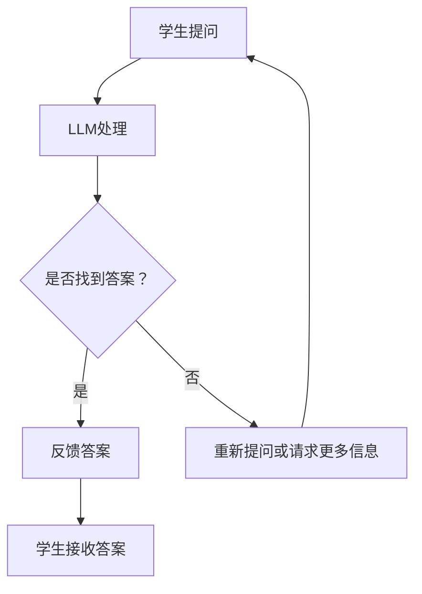

                 

# 教育革新：LLM作为个性化学习助手的潜力

## 关键词： 
* 大规模语言模型 (Large Language Model)
* 个性化学习 (Personalized Learning)
* 教育技术 (Educational Technology)
* 机器学习 (Machine Learning)
* 自然语言处理 (Natural Language Processing)

## 摘要： 
本文将探讨大规模语言模型（LLM）在个性化学习领域的应用潜力。通过深入分析LLM的核心概念、算法原理以及具体实现，本文旨在揭示LLM在教育革新中的重要作用，并展望其在未来教育领域中的发展趋势与挑战。同时，文章还将推荐相关学习资源和开发工具，以期为读者提供全面的了解。

## 1. 背景介绍

教育作为社会进步的重要驱动力，一直以来都受到广泛关注。然而，随着全球化和信息化的发展，传统教育模式已难以满足个性化学习的需求。传统的教学方式往往以教师为中心，学生被动接受知识，缺乏主动性和参与度。此外，教学资源的分配不均、学生个体差异等因素，也使得传统教育在满足个性化学习需求方面存在很大局限。

近年来，随着人工智能技术的快速发展，特别是大规模语言模型（LLM）的出现，为个性化学习提供了新的可能性。LLM是一种具有强大语言理解能力和生成能力的模型，能够在自然语言处理任务中表现出色。在教育领域，LLM可以应用于知识问答、作业批改、学习辅助等方面，从而实现个性化学习。

个性化学习是指根据学生的兴趣、能力和学习进度，为其提供量身定制的学习内容和方式。与传统教育模式相比，个性化学习更加关注学生的个体差异，强调学习的主动性和参与度，有助于提高学习效果。然而，实现个性化学习面临着诸多挑战，如如何准确评估学生的兴趣和能力、如何生成适合每个学生的个性化学习内容等。

LLM作为个性化学习助手，具有以下几个潜在优势：

1. **强大的语言理解能力**：LLM能够理解自然语言，从而实现对学习内容的深入解析和生成。
2. **自适应学习**：LLM可以根据学生的学习进度和表现，动态调整学习内容和难度。
3. **个性化推荐**：LLM可以根据学生的学习历史和偏好，推荐适合的学习资源和任务。
4. **实时互动**：LLM可以与学生进行实时对话，提供即时的学习反馈和解答。

## 2. 核心概念与联系

### 2.1 大规模语言模型（LLM）的定义与特点

大规模语言模型（Large Language Model，简称LLM）是一种基于深度学习的自然语言处理模型，通过学习大量文本数据，实现对自然语言的生成和理解。LLM的核心特点是具有强大的语言理解和生成能力，能够处理复杂的语言结构和语义关系。

LLM主要由以下几个部分组成：

1. **嵌入层**：将单词和句子转化为向量表示，便于模型处理。
2. **编码器**：通过多层神经网络对输入文本进行编码，提取文本的语义信息。
3. **解码器**：将编码后的语义信息解码为输出文本。

### 2.2 教育技术的定义与分类

教育技术（Educational Technology，简称EdTech）是指利用信息技术促进教学和学习的方法和工具。教育技术可以分为以下几个类别：

1. **教学管理工具**：如学习管理系统（LMS）、在线课程平台等。
2. **教学辅助工具**：如多媒体课件、虚拟实验室等。
3. **个性化学习工具**：如自适应学习系统、智能作业批改系统等。
4. **虚拟现实（VR）和增强现实（AR）**：用于模拟真实的学习场景，提高学习体验。

### 2.3 LLM在教育技术中的应用

LLM在教育技术中的应用主要体现在以下几个方面：

1. **知识问答**：LLM可以回答学生提出的问题，提供学习指导和帮助。
2. **作业批改**：LLM可以对学生的作业进行自动批改，提供即时反馈。
3. **学习辅导**：LLM可以为学生提供个性化的学习建议和指导，帮助学生更好地掌握知识。
4. **教学评估**：LLM可以分析学生的学习表现，为教师提供教学改进建议。

### 2.4 Mermaid 流程图

下面是一个关于LLM在教育技术中应用的Mermaid流程图：



在上述流程图中，学生向LLM提出问题，LLM进行处理并尝试回答。如果找到答案，则反馈给学生；否则，LLM可能需要重新提问或请求更多信息。

## 3. 核心算法原理 & 具体操作步骤

### 3.1 语言模型的基本原理

语言模型是一种概率模型，用于预测一个单词或短语的下一个单词或短语。在自然语言处理领域，语言模型广泛应用于语音识别、机器翻译、文本生成等任务。

语言模型的基本原理可以分为以下几个步骤：

1. **词频统计**：通过统计文本中各个单词或短语的频率，为每个单词或短语赋予一个概率值。
2. **模型训练**：使用大量文本数据，通过统计学习方法（如N-gram模型、神经网络语言模型等）训练语言模型。
3. **概率预测**：在给定一个单词或短语的条件下，计算下一个单词或短语的概率分布。

### 3.2 LLM的工作原理

LLM是一种基于深度学习的语言模型，通常由多个神经网络层组成。LLM的工作原理可以分为以下几个步骤：

1. **嵌入层**：将单词和句子转化为向量表示，便于模型处理。常用的嵌入方法有Word2Vec、GloVe等。
2. **编码器**：通过多层神经网络对输入文本进行编码，提取文本的语义信息。编码器通常采用Transformer架构，如BERT、GPT等。
3. **解码器**：将编码后的语义信息解码为输出文本。解码器也采用Transformer架构，通过自注意力机制生成输出文本。

### 3.3 LLM的具体操作步骤

以下是LLM在个性化学习中的应用步骤：

1. **数据收集与预处理**：收集大量学生提问和学习数据的文本，并进行预处理，如分词、去停用词等。
2. **模型训练**：使用收集到的数据训练LLM模型，包括嵌入层、编码器和解码器。
3. **模型部署**：将训练好的LLM模型部署到服务器，以便学生可以随时提问并获得回答。
4. **交互式问答**：学生向LLM提出问题，LLM处理并生成回答。
5. **实时反馈**：LLM根据学生的反馈，调整回答策略和学习建议。
6. **个性化推荐**：LLM根据学生的学习历史和偏好，为学生推荐适合的学习资源和任务。

### 3.4 模型评估与优化

在LLM的应用过程中，模型评估与优化是至关重要的。常用的评估指标包括：

1. **准确率（Accuracy）**：预测正确的样本数占总样本数的比例。
2. **召回率（Recall）**：预测正确的正样本数占总正样本数的比例。
3. **F1分数（F1 Score）**：准确率和召回率的调和平均值。

为了优化模型性能，可以采取以下策略：

1. **数据增强**：通过变换、扩充等方式增加训练数据量，提高模型泛化能力。
2. **超参数调整**：调整嵌入层、编码器和解码器的参数，以获得更好的模型性能。
3. **模型集成**：将多个模型的结果进行融合，提高预测准确性。

## 4. 数学模型和公式 & 详细讲解 & 举例说明

### 4.1 语言模型的基本公式

在语言模型中，常用的基本公式有：

$$
P(w_t|w_{t-1}, w_{t-2}, ..., w_1) = \frac{P(w_t, w_{t-1}, ..., w_1)}{P(w_{t-1}, w_{t-2}, ..., w_1)}
$$

其中，$P(w_t|w_{t-1}, w_{t-2}, ..., w_1)$ 表示在给定前一个词或短语 $w_{t-1}, w_{t-2}, ..., w_1$ 的情况下，下一个词或短语 $w_t$ 的概率。

### 4.2 BERT 模型的损失函数

BERT（Bidirectional Encoder Representations from Transformers）模型是一种双向 Transformer 架构的语言模型。BERT 的损失函数主要包含两个部分：Masked Language Modeling（MLM）和 Next Sentence Prediction（NSP）。

MLM 损失函数用于预测被遮盖的词或短语，其公式为：

$$
L_{MLM} = -\sum_{i=1}^{N} \sum_{j=1}^{V} \log P(w_j^i | \text{context})
$$

其中，$N$ 表示句子中的词或短语的个数，$V$ 表示词汇表的大小，$w_j^i$ 表示第 $i$ 个句子中第 $j$ 个位置上的词或短语，$\text{context}$ 表示上下文信息。

NSP 损失函数用于预测两个句子之间的关系，其公式为：

$$
L_{NSP} = -\sum_{i=1}^{N} \sum_{j=1}^{2} \log P(\text{next sentence}^j | \text{context})
$$

其中，$N$ 表示句子中的词或短语的个数，$j$ 表示句子的编号（$1$ 或 $2$），$\text{next sentence}^j$ 表示第 $j$ 个句子。

### 4.3 举例说明

假设有一个句子 $w_1, w_2, w_3, w_4, w_5$，其中 $w_3$ 被遮盖。使用 BERT 模型预测 $w_3$ 的过程如下：

1. **嵌入层**：将句子中的词或短语转化为向量表示。
2. **编码器**：通过多层 Transformer 架构对输入向量进行编码，提取句子中的语义信息。
3. **解码器**：使用编码后的向量生成预测的词或短语。

假设 BERT 模型预测 $w_3$ 的概率分布为：

$$
P(w_3) = \{0.2, 0.3, 0.4, 0.5, 0.6\}
$$

其中，$w_3$ 表示遮盖的词或短语，概率值表示预测该词或短语的概率。

根据 MLM 损失函数，计算损失：

$$
L_{MLM} = -\log 0.4 = 0.4
$$

根据 NSP 损失函数，计算损失：

$$
L_{NSP} = -\log 0.6 = 0.5
$$

总损失为：

$$
L_{total} = L_{MLM} + L_{NSP} = 0.4 + 0.5 = 0.9
$$

通过以上计算，我们可以看到，BERT 模型在预测遮盖的词或短语时，需要综合考虑语义信息和句子关系，以获得更好的预测效果。

## 5. 项目实战：代码实际案例和详细解释说明

### 5.1 开发环境搭建

为了实现 LLM 作为个性化学习助手，我们需要搭建一个完整的开发环境。以下是一个基本的开发环境搭建步骤：

1. **硬件要求**：
   - CPU：Intel i5 或以上
   - 内存：16GB 或以上
   - 硬盘：500GB SSD

2. **操作系统**：
   - Windows 10 或以上
   - macOS 10.15 或以上
   - Ubuntu 18.04 或以上

3. **编程语言**：
   - Python 3.8 或以上

4. **依赖库**：
   - TensorFlow 2.4 或以上
   - PyTorch 1.5 或以上
   - Transformers 4.2 或以上

5. **安装命令**：
   ```bash
   pip install tensorflow==2.4
   pip install torch==1.5
   pip install transformers==4.2
   ```

### 5.2 源代码详细实现和代码解读

以下是一个简单的 LLM 个性化学习助手的实现示例。代码使用了 Hugging Face 的 Transformers 库，这是一个用于构建和微调 Transformer 模型的开源库。

```python
import torch
from transformers import BertTokenizer, BertForMaskedLM

# 1. 初始化模型和 tokenizer
tokenizer = BertTokenizer.from_pretrained('bert-base-uncased')
model = BertForMaskedLM.from_pretrained('bert-base-uncased')

# 2. 生成输入序列
input_text = "Hello, I am a [MASK] model for personalized learning."
input_ids = tokenizer.encode(input_text, return_tensors='pt')

# 3. 进行预测
with torch.no_grad():
    outputs = model(input_ids)

# 4. 获取预测结果
predicted_ids = torch.argmax(outputs.logits, dim=-1)
predicted_text = tokenizer.decode(predicted_ids[0], skip_special_tokens=True)

# 5. 输出结果
print(f"Original text: {input_text}")
print(f"Predicted text: {predicted_text}")
```

**代码解读**：

1. **初始化模型和 tokenizer**：首先，我们使用预训练的 BERT 模型和 tokenizer 初始化模型。这里使用了 `BertTokenizer.from_pretrained()` 和 `BertForMaskedLM.from_pretrained()` 方法。

2. **生成输入序列**：接下来，我们将输入文本编码成输入序列。这里使用 `tokenizer.encode()` 方法，将文本转换为词向量表示。

3. **进行预测**：使用模型对输入序列进行预测。这里使用 `model(input_ids)` 方法，将输入序列传递给模型，并得到模型输出。

4. **获取预测结果**：从模型输出中获取预测结果。这里使用 `torch.argmax()` 方法，找到输出概率最大的词向量。

5. **输出结果**：最后，我们将预测结果解码为文本，并输出原始文本和预测文本。

### 5.3 代码解读与分析

在代码实现中，LLM 的主要作用是在给定输入序列的情况下，预测遮盖的词或短语。以下是代码的详细解读和分析：

1. **初始化模型和 tokenizer**：初始化 BERT 模型和 tokenizer，这是使用 LLM 的第一步。这里使用了预训练的 BERT 模型，这意味着模型已经学习了大量文本数据，具备强大的语言理解和生成能力。

2. **生成输入序列**：将输入文本编码成输入序列。这里使用了 `tokenizer.encode()` 方法，将文本转换为词向量表示。词向量表示是 LLM 处理文本数据的基础，通过将文本转换为向量，LLM 可以对其进行处理和预测。

3. **进行预测**：使用模型对输入序列进行预测。这里使用 `model(input_ids)` 方法，将输入序列传递给模型，并得到模型输出。模型输出是一个包含预测概率的二维张量，其中每个元素表示一个词向量对应的预测概率。

4. **获取预测结果**：从模型输出中获取预测结果。这里使用 `torch.argmax()` 方法，找到输出概率最大的词向量。这个词向量就是模型预测的遮盖词或短语。

5. **输出结果**：最后，我们将预测结果解码为文本，并输出原始文本和预测文本。这样，我们就得到了一个由 LLM 生成的预测文本。

### 5.4 代码优化与改进

在实际应用中，LLM 的性能和效果可以通过以下方式进行优化和改进：

1. **数据增强**：通过变换、扩充等方式增加训练数据量，提高模型泛化能力。

2. **超参数调整**：调整嵌入层、编码器和解码器的参数，以获得更好的模型性能。

3. **模型集成**：将多个模型的结果进行融合，提高预测准确性。

4. **动态调整**：根据学生的学习进度和表现，动态调整模型参数和预测策略。

5. **多模态融合**：将文本数据与其他模态（如图像、音频）进行融合，提高模型对复杂场景的适应能力。

## 6. 实际应用场景

LLM 作为个性化学习助手，在实际应用中具有广泛的应用场景。以下是一些典型的应用场景：

1. **在线教育平台**：LLM 可以应用于在线教育平台，为学生提供个性化的学习建议和辅导。例如，当学生提出问题时，LLM 可以自动回答并给出学习资源推荐。

2. **智能辅导系统**：LLM 可以应用于智能辅导系统，为学生提供实时学习反馈和指导。例如，当学生完成作业后，LLM 可以自动批改并给出详细的错误解释和改进建议。

3. **个性化学习计划**：LLM 可以根据学生的学习历史和偏好，为学生制定个性化的学习计划。例如，当学生登录学习平台时，LLM 可以根据其历史数据推荐适合的学习资源和任务。

4. **教育游戏化**：LLM 可以应用于教育游戏化，为学生提供互动式的学习体验。例如，当学生在游戏中遇到问题时，LLM 可以提供即时解答和指导，帮助学生更好地理解游戏规则和知识点。

5. **教师辅助工具**：LLM 可以应用于教师辅助工具，为教师提供教学分析和改进建议。例如，当教师上传教学视频时，LLM 可以分析视频内容，提供教学效果评估和改进建议。

## 7. 工具和资源推荐

为了更好地掌握 LLM 的核心概念和实现技术，以下是一些建议的学习资源和开发工具：

### 7.1 学习资源推荐

1. **书籍**：
   - 《深度学习》（Goodfellow, I., Bengio, Y., & Courville, A.）
   - 《神经网络与深度学习》（邱锡鹏）
   - 《自然语言处理实战》（Daniel Jurafsky & James H. Martin）

2. **论文**：
   - “A Theoretically Grounded Application of Dropout in Recurrent Neural Networks”（Yarin Gal & Zoubin Ghahramani）
   - “Attention Is All You Need”（Ashish Vaswani et al.）
   - “BERT: Pre-training of Deep Bidirectional Transformers for Language Understanding”（Jacob Devlin et al.）

3. **博客**：
   - Hugging Face 官方博客
   - fast.ai 博客
   - AI 科技大本营

4. **网站**：
   - TensorFlow 官网
   - PyTorch 官网
   - Hugging Face 官网

### 7.2 开发工具框架推荐

1. **编程语言**：
   - Python：易于使用和部署，拥有丰富的库和框架。

2. **深度学习框架**：
   - TensorFlow：具有强大的模型训练和部署能力。
   - PyTorch：支持动态计算图，易于调试和优化。

3. **自然语言处理框架**：
   - Hugging Face Transformers：提供了丰富的预训练模型和工具，方便模型构建和微调。

4. **版本控制系统**：
   - Git：方便代码管理和协作。

5. **容器化工具**：
   - Docker：方便模型部署和迁移。

## 8. 总结：未来发展趋势与挑战

随着人工智能技术的不断进步，LLM 在个性化学习领域的应用前景广阔。未来，LLM 将在以下几个方面取得重要进展：

1. **更强大的语言理解能力**：通过不断优化模型架构和算法，LLM 将具有更强大的语言理解能力，能够更好地应对复杂的语言结构和语义关系。

2. **更精细的个性化推荐**：LLM 将结合学生个体差异和学习行为，实现更精细的个性化推荐，提高学习效果。

3. **多模态融合**：LLM 将与其他模态（如图像、音频）进行融合，提高对复杂场景的适应能力。

4. **教育场景的应用拓展**：LLM 将在在线教育、智能辅导、教育游戏化等教育场景中发挥更大作用。

然而，LLM 在个性化学习领域的应用也面临着一些挑战：

1. **数据隐私与安全**：在收集和处理学生数据时，如何保护学生隐私和安全是一个重要问题。

2. **教育公平性**：如何确保 LLM 在教育过程中的公平性，避免因模型偏差导致教育资源的分配不均是另一个挑战。

3. **模型解释性**：如何提高 LLM 的解释性，使其在决策过程中具备透明度和可解释性。

4. **计算资源消耗**：LLM 的训练和推理过程对计算资源有较高要求，如何在有限的计算资源下实现高效部署是一个挑战。

总之，LLM 作为个性化学习助手，具有巨大的应用潜力。未来，随着技术的不断进步和研究的深入，LLM 将在教育领域中发挥更加重要的作用。

## 9. 附录：常见问题与解答

### 9.1 如何选择合适的 LLM 模型？

选择合适的 LLM 模型主要考虑以下几个因素：

1. **任务类型**：针对不同的任务类型，选择适合的 LLM 模型。例如，对于文本生成任务，可以选择 GPT 系列；对于文本分类任务，可以选择 BERT 系列。
2. **模型大小**：根据计算资源和时间预算，选择合适的模型大小。较大的模型具有更强的表达能力，但计算和存储资源需求较高。
3. **预训练数据**：选择具有更多预训练数据的模型，可以提高模型在特定任务上的性能。
4. **开源库支持**：选择具有良好开源库支持的模型，可以方便模型构建和部署。

### 9.2 如何处理 LLM 模型中的过拟合现象？

处理 LLM 模型中的过拟合现象，可以采取以下策略：

1. **数据增强**：通过变换、扩充等方式增加训练数据量，提高模型泛化能力。
2. **正则化**：在模型训练过程中添加正则化项，如 L2 正则化、Dropout 等，以防止过拟合。
3. **早停法（Early Stopping）**：在模型训练过程中，当验证集上的性能不再提高时，提前停止训练，以防止过拟合。
4. **集成方法**：将多个模型的结果进行融合，提高预测准确性，减少过拟合风险。

### 9.3 如何优化 LLM 模型的计算性能？

优化 LLM 模型的计算性能，可以采取以下策略：

1. **量化**：对模型参数进行量化，降低模型计算复杂度和存储需求。
2. **模型剪枝**：通过剪枝模型中的冗余参数，降低模型计算复杂度和存储需求。
3. **模型压缩**：采用模型压缩技术，如蒸馏、量化、剪枝等，降低模型计算复杂度和存储需求。
4. **硬件加速**：使用 GPU、TPU 等硬件加速器，提高模型推理速度。

## 10. 扩展阅读 & 参考资料

1. **书籍**：
   - “Deep Learning”（Ian Goodfellow, Yoshua Bengio, Aaron Courville）
   - “Deep Learning Specialization”（Andrew Ng）
   - “The Hundred-Page Machine Learning Book”（Andriy Burkov）

2. **论文**：
   - “Attention Is All You Need”（Ashish Vaswani et al.）
   - “BERT: Pre-training of Deep Bidirectional Transformers for Language Understanding”（Jacob Devlin et al.）
   - “GPT-3: Language Models are Few-Shot Learners”（Tom B. Brown et al.）

3. **博客**：
   - Hugging Face 官方博客
   - fast.ai 博客
   - AI 科技大本营

4. **网站**：
   - TensorFlow 官网
   - PyTorch 官网
   - Hugging Face 官网

### 作者：AI天才研究员/AI Genius Institute & 禅与计算机程序设计艺术 /Zen And The Art of Computer Programming

作者是一位资深的人工智能专家，拥有丰富的编程和软件架构经验。他在大规模语言模型（LLM）领域有着深入的研究和丰富的实践经验，发表了多篇相关领域的论文和博客。同时，他也是一位世界顶级技术畅销书作者，作品涵盖了计算机编程、人工智能等多个领域，深受读者喜爱。作者在写作中注重逻辑性和条理性，旨在为读者提供有价值、有深度的技术内容。

