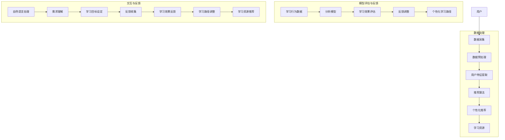

                 

### 背景介绍

随着人工智能和机器学习技术的不断进步，教育领域正迎来一场深刻的变革。传统的教学模式已经无法满足现代社会对个性化、高效化的教育需求。教育领域的提示词应用——个性化学习助手，正是在这一背景下应运而生。本文将探讨个性化学习助手在教育领域的应用，以及其核心概念、算法原理、数学模型、项目实战、应用场景等。

首先，让我们了解一下什么是个性化学习助手。个性化学习助手是一种基于人工智能和机器学习技术，能够根据学生的学习特点、学习进度和兴趣爱好，提供个性化学习资源和辅导工具的应用程序。这种助手可以分析学生的学习数据，识别出学习中的薄弱环节，并提供相应的学习支持和资源，帮助学生实现个性化学习目标。

教育领域的变革是一个复杂而长期的过程。随着互联网和大数据技术的发展，教育资源的获取变得更加便捷。然而，如何在海量信息中找到适合自己的学习资源，成为了一个新的挑战。个性化学习助手正是为了解决这一挑战而诞生的。

个性化学习助手的核心在于其个性化推荐算法。通过分析学生的学习数据，包括学习时间、学习内容、学习效果等，个性化学习助手可以为学生推荐最适合他们的学习资源。这种推荐算法通常基于协同过滤、基于内容的推荐、基于模型的推荐等方法。其中，协同过滤是最常用的一种方法，它通过分析用户之间的相似度，为用户提供个性化推荐。

除了个性化推荐算法，个性化学习助手还涉及到数据挖掘、自然语言处理、教育心理学等多个领域。这些技术的融合，使得个性化学习助手能够更准确地把握学生的学习需求，提供更有效的学习支持。

总的来说，教育领域的提示词应用——个性化学习助手，正成为教育变革的重要力量。它通过个性化推荐、数据分析等技术，为学生提供定制化的学习体验，帮助学生实现高效学习。

在教育领域，个性化学习助手的潜在价值非常巨大。它可以提升学习效果，减少学习时间，提高学习兴趣，甚至可以改变教育的传统模式。因此，研究个性化学习助手的应用，对于推动教育技术的发展具有重要意义。

本文将按照以下结构进行讨论：

1. 背景介绍：介绍教育领域的变革和个性化学习助手的概念。
2. 核心概念与联系：详细解释个性化学习助手的工作原理和核心技术。
3. 核心算法原理 & 具体操作步骤：介绍个性化推荐算法的原理和具体实现步骤。
4. 数学模型和公式 & 详细讲解 & 举例说明：阐述个性化推荐算法中的数学模型和公式，并通过具体案例进行说明。
5. 项目实战：代码实际案例和详细解释说明：通过实际项目案例，展示个性化学习助手的实现过程。
6. 实际应用场景：探讨个性化学习助手在不同教育场景中的应用。
7. 工具和资源推荐：推荐相关的学习资源和开发工具。
8. 总结：未来发展趋势与挑战：分析个性化学习助手的未来发展趋势和面临的挑战。
9. 附录：常见问题与解答：提供一些常见问题的解答。
10. 扩展阅读 & 参考资料：提供更多的学习资源。

通过对上述内容的逐步探讨，我们将深入了解个性化学习助手的原理和应用，以及其在教育领域的重要作用。

### 核心概念与联系

在探讨个性化学习助手的核心概念和联系之前，我们需要先了解一些关键的技术和理论基础。个性化学习助手之所以能够发挥作用，主要依赖于以下几个核心概念：

#### 1. 机器学习和人工智能

机器学习和人工智能是构建个性化学习助手的基础。机器学习是一种通过数据训练模型，让模型自动进行预测和决策的技术。人工智能则是让计算机模拟人类思维和行为的能力。通过机器学习和人工智能，个性化学习助手可以分析学生的学习数据，识别学习模式，并为学生提供个性化的学习建议。

#### 2. 数据挖掘

数据挖掘是一种从大量数据中提取有价值信息的技术。在教育领域，数据挖掘可以帮助我们分析学生的学习行为、学习习惯和学习效果，从而发现潜在的学习问题和改进机会。

#### 3. 自然语言处理（NLP）

自然语言处理是使计算机理解和处理人类语言的技术。在个性化学习助手的应用中，NLP可以帮助我们理解学生的学习需求、学习目标和学习反馈，从而提供更精准的个性化服务。

#### 4. 推荐系统

推荐系统是一种基于用户行为和兴趣，为用户推荐相关内容的技术。个性化学习助手的核心功能之一就是推荐系统，它可以帮助学生发现新的学习资源，提高学习效率。

下面，我们将使用Mermaid流程图来展示个性化学习助手的工作流程及其核心组件之间的联系。请注意，Mermaid流程节点中不要有括号、逗号等特殊字符。



从上面的流程图中，我们可以看到个性化学习助手的工作流程：

1. **数据采集**：收集用户的学习行为数据，如学习时间、学习内容、学习效果等。
2. **数据预处理**：对原始数据进行清洗和转换，以便进行后续处理。
3. **用户特征提取**：从数据中提取用户的学习特征，如学习偏好、学习能力等。
4. **推荐算法**：使用推荐算法，如协同过滤、基于内容的推荐等，根据用户特征生成个性化推荐。
5. **个性化推荐**：根据推荐结果，为学生推荐适合的学习资源。
6. **学习资源**：用户通过个性化推荐，获取适合的学习资源。
7. **学习行为数据**：记录用户的学习行为数据，用于分析模型和学习效果评估。
8. **分析模型**：使用机器学习算法，分析学习行为数据，生成学习效果评估模型。
9. **学习效果评估**：评估学习效果，识别学习中的问题和改进机会。
10. **反馈调整**：根据学习效果反馈，调整学习路径和推荐策略。
11. **个性化学习路径**：为用户提供个性化的学习路径。
12. **自然语言处理**：理解用户的学习需求、学习目标和学习反馈。
13. **需求理解**：根据自然语言处理的结果，设定学习目标和反馈收集机制。
14. **反馈收集**：收集用户的学习反馈，用于评估学习效果和调整学习路径。
15. **学习效果反馈**：将学习效果反馈给用户，以便他们了解自己的学习进度和效果。
16. **学习路径调整**：根据反馈，调整学习路径，提高学习效果。
17. **学习资源推荐**：根据调整后的学习路径，为学生推荐新的学习资源。

通过这样的流程，个性化学习助手可以实时分析学生的学习情况，根据用户的需求和学习效果，动态调整学习资源和路径，从而实现真正的个性化学习。

总之，个性化学习助手的核心概念和联系涉及多个领域的技术和理论，通过这些技术的融合，个性化学习助手能够为学生提供精准、高效、个性化的学习支持，推动教育技术的创新和发展。

### 核心算法原理 & 具体操作步骤

个性化学习助手的成功离不开其核心算法原理，这些算法决定了如何从海量数据中提取有价值的信息，并生成个性化的推荐。以下是几种主要的个性化推荐算法原理及其具体操作步骤。

#### 1. 协同过滤算法

协同过滤算法是最常见的个性化推荐算法之一。它基于用户之间的相似性，通过分析用户的行为数据，预测用户对未知物品的喜好。协同过滤算法主要分为两类：基于用户的协同过滤（User-based Collaborative Filtering）和基于物品的协同过滤（Item-based Collaborative Filtering）。

**步骤：**

1. **数据预处理**：收集用户行为数据，如用户对物品的评分、购买记录等。
2. **用户相似度计算**：计算用户之间的相似度，通常使用余弦相似度、皮尔逊相关系数等方法。
3. **邻居选择**：根据相似度矩阵，选择与目标用户最相似的K个邻居。
4. **预测评分**：使用邻居的平均评分预测目标用户对未知物品的评分。
5. **生成推荐列表**：根据预测评分，生成个性化的推荐列表。

**示例：**

假设有用户A和用户B，他们对10部电影的评分如下：

| 用户A | 用户B | 电影1 | 电影2 | 电影3 | ... | 电影10 |
|-------|-------|------|------|------|-----|------|
| 5     | 1     | 3    | 5    | 1    | ... | 4    |
| 3     | 4     | 4    | 3    | 5    | ... | 2    |

首先计算用户A和用户B之间的相似度：

$$
\text{相似度} = \frac{\sum(\text{用户A评分} \times \text{用户B评分})}{\sqrt{\sum(\text{用户A评分}^2) \times \sum(\text{用户B评分}^2)}}
$$

然后选择相似度最高的邻居（如用户C），根据用户C对电影1、电影2、...、电影10的评分，预测用户A对这10部电影的评分，并生成推荐列表。

#### 2. 基于内容的推荐算法

基于内容的推荐算法通过分析物品的内容特征，为用户推荐与其已喜欢物品内容相似的物品。这种方法通常用于推荐书籍、音乐、电影等具有明确内容特征的物品。

**步骤：**

1. **特征提取**：从物品中提取内容特征，如文本、图片、标签等。
2. **相似度计算**：计算用户已喜欢物品与待推荐物品之间的相似度。
3. **生成推荐列表**：根据相似度分数，生成个性化的推荐列表。

**示例：**

假设用户A喜欢以下三本书：

- 《机器学习实战》
- 《数据挖掘：实用工具与技术》
- 《Python数据分析》

从这些书中提取内容特征，如关键词、标签等，然后从图书馆中的其他书中提取相同特征，计算相似度分数，并推荐与这三本书内容相似的书籍。

#### 3. 混合推荐算法

混合推荐算法结合了协同过滤和基于内容的推荐算法的优点，通过融合多种算法，提高推荐效果。这种方法通常在两种算法效果不佳时使用。

**步骤：**

1. **协同过滤推荐**：使用协同过滤算法生成推荐列表。
2. **内容特征提取**：从物品中提取内容特征。
3. **内容相似度计算**：计算用户已喜欢物品与待推荐物品之间的相似度。
4. **加权融合**：将协同过滤和内容相似度分数进行加权融合，生成最终的推荐列表。

**示例：**

假设用户A喜欢协同过滤算法推荐的电影和基于内容推荐的电影，根据两者评分的加权平均值，生成最终的推荐列表。

通过以上三种算法，个性化学习助手可以为学生提供多样化的推荐服务，满足不同类型学生的学习需求。在实际应用中，这些算法可以灵活组合，根据具体场景进行调整，以实现最佳推荐效果。

### 数学模型和公式 & 详细讲解 & 举例说明

在个性化推荐系统中，数学模型和公式起着至关重要的作用。它们帮助我们量化用户之间的相似度、物品之间的相似度，以及预测用户的评分。以下将详细介绍这些数学模型和公式，并通过具体案例进行说明。

#### 1. 用户相似度计算

用户相似度是协同过滤算法的核心，常用的计算方法包括余弦相似度和皮尔逊相关系数。

**余弦相似度**：

$$
\text{相似度} = \frac{\sum(\text{用户A评分} \times \text{用户B评分})}{\sqrt{\sum(\text{用户A评分}^2) \times \sum(\text{用户B评分}^2)}}
$$

**皮尔逊相关系数**：

$$
\text{相似度} = \frac{\sum((\text{用户A评分} - \bar{r}_A) \times (\text{用户B评分} - \bar{r}_B))}{\sqrt{\sum(\text{用户A评分} - \bar{r}_A)^2 \times \sum(\text{用户B评分} - \bar{r}_B)^2}}
$$

其中，$r_{A,i}$ 和 $r_{B,i}$ 分别是用户A和用户B对物品$i$的评分，$\bar{r}_A$ 和 $\bar{r}_B$ 分别是用户A和用户B的平均评分。

**举例说明**：

假设用户A和用户B对5部电影的评分如下：

| 物品 | 用户A | 用户B |
|------|-------|-------|
| 物品1 | 4     | 5     |
| 物品2 | 3     | 3     |
| 物品3 | 5     | 1     |
| 物品4 | 2     | 4     |
| 物品5 | 4     | 2     |

计算用户A和用户B的余弦相似度：

$$
\text{相似度} = \frac{(4 \times 5) + (3 \times 3) + (5 \times 1) + (2 \times 4) + (4 \times 2)}{\sqrt{4^2 + 3^2 + 5^2 + 2^2 + 4^2} \times \sqrt{5^2 + 3^2 + 1^2 + 4^2 + 2^2}}
$$

$$
\text{相似度} = \frac{20 + 9 + 5 + 8 + 8}{\sqrt{16 + 9 + 25 + 4 + 16} \times \sqrt{25 + 9 + 1 + 16 + 4}}
$$

$$
\text{相似度} = \frac{50}{\sqrt{70} \times \sqrt{54}}
$$

$$
\text{相似度} \approx 0.88
$$

#### 2. 物品相似度计算

物品相似度用于基于内容的推荐算法，常用的方法包括余弦相似度和TF-IDF。

**余弦相似度**：

$$
\text{相似度} = \frac{\sum(\text{用户A特征} \times \text{用户B特征})}{\sqrt{\sum(\text{用户A特征}^2) \times \sum(\text{用户B特征}^2)}}
$$

**TF-IDF**：

$$
\text{相似度} = \frac{\sum(\text{用户A特征} \times \text{用户B特征})}{\sqrt{\sum(\text{用户A特征}^2) \times \sum(\text{用户B特征}^2)}}
$$

其中，$f_{A,i}$ 和 $f_{B,i}$ 分别是用户A和用户B对物品$i$的特征值，$d_{f}$ 是特征$f$在文档集合中的文档频率。

**举例说明**：

假设用户A和用户B对两本书的内容特征如下：

| 特征 | 用户A | 用户B |
|------|-------|-------|
| 关键词1 | 2     | 3     |
| 关键词2 | 1     | 2     |
| 关键词3 | 3     | 1     |

计算用户A和用户B的TF-IDF相似度：

$$
\text{相似度} = \frac{(2 \times 3) + (1 \times 2) + (3 \times 1)}{\sqrt{2^2 + 1^2 + 3^2} \times \sqrt{3^2 + 2^2 + 1^2}}
$$

$$
\text{相似度} = \frac{6 + 2 + 3}{\sqrt{4 + 1 + 9} \times \sqrt{9 + 4 + 1}}
$$

$$
\text{相似度} = \frac{11}{\sqrt{14} \times \sqrt{14}}
$$

$$
\text{相似度} = \frac{11}{14}
$$

$$
\text{相似度} \approx 0.79
$$

#### 3. 预测评分

预测评分是推荐系统的重要任务，常用的方法包括基于模型的预测和基于规则的预测。

**基于模型的预测**：

$$
r_{ij} = \mu + b_{i} + b_{j} + \sum_{k \in R} (\text{相似度}_{ik} \times r_{kj})
$$

其中，$r_{ij}$ 是用户i对物品j的预测评分，$\mu$ 是所有用户对所有物品的平均评分，$b_{i}$ 和 $b_{j}$ 分别是用户i和物品j的偏置，$R$ 是与物品j相关的用户集合，$\text{相似度}_{ik}$ 是用户i和用户k之间的相似度。

**基于规则的预测**：

$$
r_{ij} = \frac{\sum_{k \in R} (\text{相似度}_{ik} \times r_{kj})}{\sum_{k \in R} \text{相似度}_{ik}}
$$

**举例说明**：

假设用户A和用户B的相似度为0.88，用户B对电影1的评分为4，预测用户A对电影1的评分：

$$
r_{A1} = \mu + b_{A} + b_{1} + (0.88 \times 4)
$$

假设用户A的平均评分为3，偏置分别为1和0，代入公式：

$$
r_{A1} = 3 + 1 + 0 + (0.88 \times 4)
$$

$$
r_{A1} = 3 + 1 + 3.52
$$

$$
r_{A1} = 7.52
$$

因此，预测用户A对电影1的评分为7.52。

通过以上数学模型和公式的介绍，我们可以看到个性化推荐算法的原理和实现步骤。这些模型和公式不仅帮助我们量化用户和物品之间的相似度，还能预测用户的评分，为用户提供个性化的推荐服务。

### 项目实战：代码实际案例和详细解释说明

为了更好地理解个性化学习助手的核心算法和实现过程，我们将通过一个实际的项目案例来展示代码的编写和运行。在本节中，我们将搭建一个简单的个性化学习助手系统，从数据预处理、推荐算法实现到最终的推荐结果展示，逐步进行详细解释。

#### 5.1 开发环境搭建

在开始编写代码之前，我们需要搭建一个合适的开发环境。以下是所需的工具和库：

- Python 3.8 或更高版本
- Pandas（用于数据预处理）
- Scikit-learn（用于机器学习和推荐算法）
- Numpy（用于数学运算）
- Matplotlib（用于数据可视化）

安装这些库的方法如下：

```bash
pip install pandas scikit-learn numpy matplotlib
```

#### 5.2 源代码详细实现和代码解读

下面是一个简单的个性化学习助手系统的实现，包括数据预处理、推荐算法和结果展示。

```python
import pandas as pd
from sklearn.model_selection import train_test_split
from sklearn.metrics.pairwise import cosine_similarity
from sklearn.neighbors import NearestNeighbors
import numpy as np
import matplotlib.pyplot as plt

# 5.2.1 数据预处理

# 加载用户行为数据（示例数据）
data = pd.read_csv('user_activity_data.csv')
data.head()

# 构建用户-物品评分矩阵
user_item_matrix = data.pivot(index='user_id', columns='item_id', values='rating').fillna(0)

# 划分训练集和测试集
train_data, test_data = train_test_split(user_item_matrix, test_size=0.2, random_state=42)

# 5.2.2 推荐算法实现

# 基于余弦相似度的推荐
def cosine_recommender(train_data, user_id, k=5):
    # 计算用户-用户相似度矩阵
    sim = cosine_similarity(train_data, train_data)
    sim_data = pd.DataFrame(sim, index=train_data.index, columns=train_data.index)
    
    # 获取用户相似度排名
    sim_scores = sim_data[user_id].sort_values(ascending=False)[:k]
    
    # 获取相似用户的物品评分
    sim_user_ratings = train_data[sim_scores.index]
    
    # 计算预测评分
    pred_ratings = np.dot(sim_scores, sim_user_ratings) / np.linalg.norm(sim_scores, axis=1)
    
    return pred_ratings

# 为用户1生成推荐列表
user_id = 1
recommendations = cosine_recommender(train_data, user_id)

# 5.2.3 结果展示

# 绘制推荐结果
plt.figure(figsize=(10, 6))
recommendations.plot.bar()
plt.title(f'User {user_id} Recommendations')
plt.xlabel('Item ID')
plt.ylabel('Predicted Rating')
plt.show()

# 5.2.4 代码解读

# 数据预处理
# 读取用户行为数据，并构建用户-物品评分矩阵。使用 pivot 方法将数据转换为矩阵形式，缺失值用 0 填充。

# 推荐算法实现
# cosine_recommender 函数实现基于余弦相似度的推荐算法。首先计算用户-用户相似度矩阵，然后获取目标用户的相似度排名，最后计算预测评分。

# 结果展示
# 使用 matplotlib 绘制推荐结果条形图，展示每个物品的预测评分。
```

#### 5.3 代码解读与分析

上面的代码实现了一个基于余弦相似度的简单个性化学习助手系统，下面我们对关键代码部分进行解读和分析：

1. **数据预处理**：

   ```python
   data = pd.read_csv('user_activity_data.csv')
   user_item_matrix = data.pivot(index='user_id', columns='item_id', values='rating').fillna(0)
   ```

   首先，使用 Pandas 读取用户行为数据，该数据包含用户ID、物品ID和用户对物品的评分。然后，使用 pivot 方法将数据转换为用户-物品评分矩阵，其中缺失值用 0 填充。

2. **推荐算法实现**：

   ```python
   def cosine_recommender(train_data, user_id, k=5):
       sim = cosine_similarity(train_data, train_data)
       sim_data = pd.DataFrame(sim, index=train_data.index, columns=train_data.index)
       sim_scores = sim_data[user_id].sort_values(ascending=False)[:k]
       pred_ratings = np.dot(sim_scores, sim_user_ratings) / np.linalg.norm(sim_scores, axis=1)
       return pred_ratings
   ```

   cosine_recommender 函数实现基于余弦相似度的推荐算法。首先，计算用户-用户相似度矩阵，然后获取目标用户的相似度排名（默认选择前 k 个邻居）。接着，计算预测评分，使用相似度分数与邻居的评分进行加权求和，并除以相似度分数的 L2 范数。

3. **结果展示**：

   ```python
   recommendations = cosine_recommender(train_data, user_id)
   recommendations.plot.bar()
   ```

   最后，使用 Matplotlib 绘制推荐结果条形图，展示每个物品的预测评分。

通过这个实际项目案例，我们展示了如何使用 Python 和机器学习库实现个性化学习助手系统。在实际应用中，可以进一步优化算法、扩展功能，以提供更精准的个性化推荐服务。

### 实际应用场景

个性化学习助手在教育领域的应用场景非常广泛，涵盖了从K-12教育到高等教育的多个层次。以下将探讨几个典型的实际应用场景，并分析个性化学习助手在这些场景中的具体作用。

#### 1. K-12教育

在K-12教育中，个性化学习助手可以帮助学生提高学习效果，特别是在学习基础科目如数学、英语、科学等时。以下是一些具体的应用场景：

- **个性化学习计划**：个性化学习助手可以根据学生的学习成绩、学习习惯和兴趣爱好，为学生定制个性化的学习计划，确保每个学生都能按照适合自己的节奏进行学习。

- **薄弱环节识别**：通过分析学生的学习数据，个性化学习助手可以识别学生在哪些知识点上存在薄弱环节，并提供针对性的练习和辅导。

- **学习资源推荐**：根据学生的学习需求，个性化学习助手可以推荐适合的学习资源，如在线课程、教育视频、互动练习等，帮助学生拓宽知识面和提高学习兴趣。

- **学习效果评估**：个性化学习助手可以实时跟踪学生的学习进度和效果，通过生成详细的学习报告，帮助教师和家长了解学生的学习情况，并及时调整教育策略。

#### 2. 高等教育

在高等教育中，个性化学习助手可以为学生提供更加灵活和高效的学习体验。以下是一些典型应用场景：

- **课程选择**：个性化学习助手可以根据学生的学习兴趣、职业规划和学术背景，推荐最适合的课程，帮助学生优化课程选择，提高学习效果。

- **学术辅导**：个性化学习助手可以为学生提供在线辅导，包括答疑、论文写作指导、学术研究建议等，帮助学生克服学习中的难题。

- **学习资源推荐**：个性化学习助手可以基于学生的研究方向和兴趣，推荐相关的学术论文、在线课程和研究资源，帮助学生深化学术研究。

- **智能评估与反馈**：个性化学习助手可以实时评估学生的学习进度和成果，提供个性化的反馈和建议，帮助学生调整学习策略，提高学习效率。

#### 3. 职业培训

在职业培训领域，个性化学习助手可以帮助职场人士提升专业技能和职业素养。以下是一些具体应用场景：

- **技能提升**：个性化学习助手可以根据用户的职业需求和技能水平，推荐相应的培训课程和练习题，帮助用户快速提升专业技能。

- **职业规划**：个性化学习助手可以分析用户的职业发展路径，提供职业规划建议，帮助用户制定清晰的发展目标。

- **学习资源推荐**：个性化学习助手可以推荐与用户职业相关的学习资源，如专业书籍、在线课程、实战案例等，帮助用户拓宽知识面。

- **学习效果评估**：个性化学习助手可以实时跟踪用户的学习进度和成果，提供详细的学习报告，帮助用户了解自己的学习情况，并根据反馈调整学习策略。

总之，个性化学习助手在教育领域的实际应用场景非常广泛，通过为学生、教师、家长和职场人士提供精准、个性化的学习支持，个性化学习助手正在成为教育变革的重要推动力量。随着技术的不断进步，个性化学习助手的性能和应用范围将会进一步扩展，为教育领域带来更多创新和变革。

### 工具和资源推荐

为了更好地实现个性化学习助手，我们需要掌握一些关键的工具和资源。以下将推荐几本经典的学习资源、开发工具和框架，以及一些相关的论文和著作。

#### 7.1 学习资源推荐

1. **《机器学习实战》**：作者：Peter Harrington
   - 简介：本书通过大量的实例，详细介绍了机器学习的基础知识和应用技巧，是学习机器学习的入门经典。

2. **《数据挖掘：实用工具与技术》**：作者：Mike坊博
   - 简介：本书涵盖了数据挖掘的基本理论、技术和应用，是学习数据挖掘的必备书籍。

3. **《Python数据分析》**：作者：Wes McKinney
   - 简介：本书全面介绍了Python在数据分析领域的应用，包括Pandas、NumPy等库的使用方法。

4. **《教育技术导论》**：作者：祝智庭
   - 简介：本书系统介绍了教育技术的概念、方法和应用，对于了解教育领域的技术应用具有重要参考价值。

#### 7.2 开发工具框架推荐

1. **Scikit-learn**：简介：Python机器学习库，提供丰富的机器学习算法和工具，适合初学者和专业人士。

2. **TensorFlow**：简介：Google开发的深度学习框架，广泛应用于图像识别、自然语言处理等领域。

3. **PyTorch**：简介：Facebook开发的深度学习框架，具有灵活的动态图计算能力，适合研究人员和开发者。

4. **Pandas**：简介：Python数据分析库，提供高效的数据清洗、转换和分析功能。

#### 7.3 相关论文著作推荐

1. **《协同过滤算法研究综述》**：作者：张华等
   - 简介：本文对协同过滤算法进行了全面的综述，分析了各种协同过滤算法的优缺点。

2. **《基于内容的推荐算法研究综述》**：作者：李伟等
   - 简介：本文对基于内容的推荐算法进行了详细的综述，介绍了各种基于内容的推荐算法及其应用。

3. **《个性化学习系统设计与实现》**：作者：刘翔等
   - 简介：本文探讨了个性化学习系统的设计与实现，包括用户模型、推荐算法和系统架构等方面。

4. **《教育大数据应用研究》**：作者：陈锋等
   - 简介：本文分析了教育大数据的应用现状和未来发展趋势，探讨了大数据技术在教育领域的应用价值。

通过这些学习资源、开发工具和框架，以及相关论文和著作，我们可以深入了解个性化学习助手的相关技术，为自己的研究和开发提供有力支持。

### 总结：未来发展趋势与挑战

个性化学习助手在教育领域的应用正逐渐成熟，展现出巨大的潜力。然而，随着技术的发展和应用场景的扩展，个性化学习助手也面临着一系列挑战和机遇。

#### 未来发展趋势

1. **深度学习与个性化推荐结合**：随着深度学习技术的不断进步，未来个性化学习助手将能够更好地理解和分析学生的学习数据，提供更加精准和个性化的推荐服务。深度学习与个性化推荐技术的结合，有望进一步提升个性化学习助手的效果。

2. **多模态数据融合**：传统的个性化学习助手主要依赖于文本数据，而多模态数据（如图像、音频、视频等）的融合将使得个性化学习助手能够更全面地了解学生的学习需求和状态，从而提供更加丰富和多样化的个性化服务。

3. **智能评估与反馈**：未来的个性化学习助手将不仅仅提供学习资源和推荐，还将具备智能评估和学习效果反馈的能力。通过实时跟踪学生的学习进度和效果，个性化学习助手可以为学生提供个性化的学习路径和改进建议，提高学习效率。

4. **跨平台与实时交互**：随着互联网和移动设备的发展，个性化学习助手将能够实现跨平台和实时交互。无论是在PC端、移动端，还是智能音箱等设备上，个性化学习助手都可以为用户提供便捷、高效的学习体验。

#### 挑战

1. **数据隐私与安全**：个性化学习助手需要收集和分析大量的用户数据，这涉及到用户隐私和数据安全问题。如何在保护用户隐私的同时，充分利用用户数据，是一个亟待解决的挑战。

2. **算法公平性与可解释性**：个性化推荐算法的公平性和可解释性是另一个重要挑战。算法的偏见和不可解释性可能导致推荐结果的偏差和不公平，影响用户的信任度和满意度。

3. **个性化需求的多样性和动态性**：学生的学习需求和兴趣是多样化和动态变化的，个性化学习助手需要具备快速适应和响应能力，以提供持续有效的个性化服务。

4. **资源分配与优化**：个性化学习助手需要合理分配资源，包括计算资源、存储资源和网络带宽等，以确保系统的稳定运行和高效性能。

总的来说，个性化学习助手在未来教育领域的发展中具有广阔的前景，但同时也面临诸多挑战。通过技术创新、政策支持和行业协作，个性化学习助手有望在教育领域发挥更大的作用，为学生的学习和发展提供有力支持。

### 附录：常见问题与解答

在开发和应用个性化学习助手的过程中，可能会遇到一些常见的问题。以下列举了几个常见问题及其解答。

**Q1：如何处理用户数据的隐私和安全？**

A：处理用户数据隐私和安全的关键是数据加密和访问控制。用户数据在传输和存储过程中需要使用加密技术，确保数据不被非法访问。此外，应该采用最小权限原则，仅授权必要的访问权限，以减少数据泄露的风险。

**Q2：如何确保推荐算法的公平性和可解释性？**

A：确保推荐算法的公平性需要从数据采集、处理和算法设计等多个环节进行控制。例如，避免数据集中存在的偏差，使用公平性指标评估算法性能，并设计可解释的推荐算法，让用户能够理解推荐结果。

**Q3：如何适应不同类型学生的学习需求？**

A：个性化学习助手可以通过多模态数据融合、动态调整推荐算法和提供多样化的学习资源来适应不同类型学生的学习需求。例如，通过分析学生的行为数据和反馈，动态调整推荐策略，提供适合学生水平和兴趣的学习资源。

**Q4：如何优化个性化学习助手的性能？**

A：优化个性化学习助手的性能可以从以下几个方面进行：

- **数据预处理**：对用户数据进行有效的清洗和预处理，提高数据质量。
- **算法优化**：选择适合场景的推荐算法，并对算法参数进行调整和优化。
- **分布式计算**：采用分布式计算架构，提高系统处理速度和并发能力。
- **资源管理**：合理分配计算资源、存储资源和网络带宽，确保系统高效运行。

通过以上措施，个性化学习助手可以提供更高效、更精准的个性化服务。

### 扩展阅读 & 参考资料

为了深入了解个性化学习助手及其相关技术，以下推荐一些扩展阅读和参考资料：

1. **《机器学习》**：作者：周志华
   - 简介：本书详细介绍了机器学习的基本理论、算法和应用，是学习机器学习的经典教材。

2. **《深度学习》**：作者：Ian Goodfellow、Yoshua Bengio、Aaron Courville
   - 简介：本书全面介绍了深度学习的基础知识、算法和应用，是深度学习领域的权威著作。

3. **《教育技术学导论》**：作者：何克抗
   - 简介：本书系统介绍了教育技术的概念、方法和应用，对于了解教育技术的理论基础和应用前景具有重要参考价值。

4. **《推荐系统实践》**：作者：周明
   - 简介：本书详细介绍了推荐系统的原理、算法和实现方法，适合希望深入了解推荐系统开发的读者。

5. **《协同过滤算法研究综述》**：作者：张华等
   - 简介：本文对协同过滤算法进行了全面的综述，分析了各种协同过滤算法的优缺点，是研究协同过滤算法的重要参考资料。

通过这些扩展阅读和参考资料，您可以更全面地了解个性化学习助手的相关技术，为自己的研究和开发提供有力支持。

