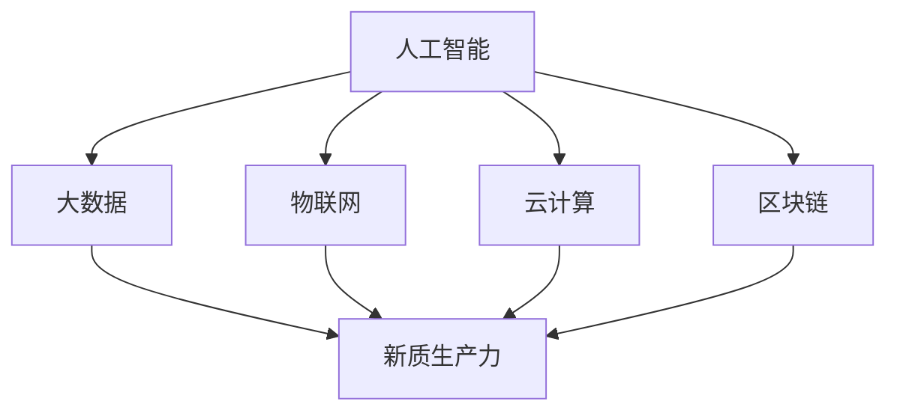

                 

### 数字中国战略与新质生产力的结合点

#### 关键词：
- 数字中国战略
- 新质生产力
- 人工智能
- 大数据
- 信息化
- 数字化转型

#### 摘要：
本文将深入探讨数字中国战略与新质生产力的结合点。随着信息技术的飞速发展，数字中国战略已成为推动国家经济社会发展的重要引擎。本文首先介绍了数字中国战略的背景和目标，然后分析了新质生产力的概念及其在现代社会中的作用。在此基础上，本文详细阐述了数字中国战略如何通过大数据、人工智能等技术创新，提升新质生产力的效率和质量，从而推动经济社会的高质量发展。文章最后总结了数字中国战略与新质生产力结合带来的挑战和机遇，并展望了未来发展趋势。

### 背景介绍

#### 数字中国战略的起源与目标

数字中国战略是中国政府为了应对全球化、信息化和数字经济的发展趋势，推动经济社会全面数字化转型的一项重要战略。其起源可以追溯到2006年，当时中国发布了《国家信息化发展战略纲要》，明确了信息化发展的总体方向和目标。随着时代的变迁，数字中国战略不断演进，形成了目前涵盖多个领域的综合性战略。

数字中国战略的主要目标是实现以下几个方面的转变：

1. **信息化与现代化同步推进**：通过信息化手段提升传统产业的生产效率和创新能力，推动产业现代化。
2. **数字经济快速发展**：以大数据、人工智能、云计算等新一代信息技术为驱动，培育壮大数字经济。
3. **社会服务智能化**：利用信息化技术提高社会服务的质量和效率，实现社会治理现代化。
4. **网络安全保障**：构建完善的网络安全体系，保障国家信息安全。

#### 新质生产力的概念

新质生产力是指在现代信息技术和数字化环境下，通过创新驱动，以知识、数据、人工智能等新型要素为核心，形成的生产力和生产方式。与传统生产力相比，新质生产力具有以下几个显著特点：

1. **高度智能化**：依托人工智能、大数据等先进技术，实现生产过程的自动化、智能化。
2. **知识密集型**：以知识创新为核心，提升全社会的知识水平和创新能力。
3. **资源集约化**：通过数字化技术实现资源的优化配置，降低生产成本，提高资源利用率。
4. **快速迭代性**：以数字化技术为支撑，实现产品和服务的高效迭代和快速创新。

#### 数字中国战略与新质生产力的关系

数字中国战略和新质生产力之间存在着紧密的联系。数字中国战略的实施为新质生产力的形成和发展提供了坚实的基础和强大的推动力。具体表现在以下几个方面：

1. **技术创新驱动**：数字中国战略通过大力推进信息技术研发和创新，为新质生产力的形成提供了技术支持。
2. **数据资源利用**：数字中国战略强调了大数据的收集、处理和应用，为新质生产力提供了丰富的数据资源。
3. **产业融合发展**：数字中国战略推动数字经济与实体经济深度融合，为新质生产力的实现提供了广阔的空间和场景。
4. **人才培养**：数字中国战略注重人才队伍建设，为新质生产力的培养提供了人力保障。

### 核心概念与联系

为了更好地理解数字中国战略与新质生产力的结合点，我们需要深入探讨以下几个核心概念及其相互关系：

1. **人工智能（AI）**
2. **大数据（Big Data）**
3. **物联网（IoT）**
4. **云计算（Cloud Computing）**
5. **区块链（Blockchain）**

#### 核心概念原理和架构的 Mermaid 流程图



#### 人工智能（AI）

人工智能是指通过计算机模拟人类的智能行为，实现感知、认知、学习、决策和行动等功能。人工智能的核心技术包括机器学习、深度学习、自然语言处理等。

1. **机器学习（Machine Learning）**：通过算法和模型让计算机从数据中自动学习和优化，提升其预测和决策能力。
2. **深度学习（Deep Learning）**：基于多层神经网络的结构，通过反向传播算法实现端到端的学习和推理。
3. **自然语言处理（NLP）**：使计算机能够理解和处理人类语言，实现人机交互和文本分析。

人工智能在数字中国战略中的应用主要体现在以下几个方面：

1. **智能自动化**：通过AI技术实现生产流程的自动化，提高生产效率和降低成本。
2. **智能决策**：利用AI算法进行数据分析和预测，为企业和政府决策提供科学依据。
3. **智能服务**：通过AI技术提供个性化、智能化的服务和体验，提升用户满意度。

#### 大数据（Big Data）

大数据是指数据量巨大、类型繁多、价值密度低的数据集合。大数据的核心在于数据的收集、存储、处理和分析。

1. **数据收集**：通过物联网、社交媒体、传感器等手段收集海量数据。
2. **数据存储**：利用分布式存储技术，如Hadoop、Spark等，存储和管理大规模数据。
3. **数据处理**：通过数据挖掘、机器学习等技术，从海量数据中提取有价值的信息。

大数据在数字中国战略中的应用主要体现在以下几个方面：

1. **精准营销**：通过分析用户行为数据，实现个性化营销和服务。
2. **智慧城市**：利用大数据技术提升城市管理水平和公共服务效率。
3. **社会治理**：通过大数据分析，实现社会问题的预测和预警，提升社会治理能力。

#### 物联网（IoT）

物联网是指将各种物理设备通过网络连接起来，实现智能感知、监测和管理。物联网的核心技术包括传感器技术、网络通信技术、数据处理技术等。

1. **传感器技术**：通过传感器获取物理环境中的各种数据，如温度、湿度、光照等。
2. **网络通信技术**：利用无线网络、有线网络等实现设备之间的互联互通。
3. **数据处理技术**：通过大数据技术和人工智能技术，对物联网数据进行分析和处理。

物联网在数字中国战略中的应用主要体现在以下几个方面：

1. **智能制造**：通过物联网技术实现生产设备的智能监控和优化，提升生产效率和降低成本。
2. **智慧交通**：通过物联网技术实现交通信息的实时监测和智能调控，提高交通效率和安全性。
3. **智能家居**：通过物联网技术实现家庭设备的智能互联，提升生活便利性和舒适度。

#### 云计算（Cloud Computing）

云计算是指通过互联网提供可伸缩的计算资源和服务。云计算的核心技术包括虚拟化技术、分布式计算、存储技术等。

1. **虚拟化技术**：通过虚拟化技术实现计算资源的高效管理和调度。
2. **分布式计算**：通过分布式计算技术实现大规模数据处理和计算任务的高效完成。
3. **存储技术**：通过分布式存储技术实现海量数据的高效存储和管理。

云计算在数字中国战略中的应用主要体现在以下几个方面：

1. **云计算平台**：提供强大的云计算基础设施，支持企业和政府的数字化转型。
2. **云服务**：通过云服务实现软件、平台、基础设施等资源的按需供给，降低企业和政府的IT成本。
3. **云安全**：通过云安全技术保障数据的安全和隐私，提升国家信息安全的整体水平。

#### 区块链（Blockchain）

区块链是指一种去中心化、分布式的数据库技术。区块链的核心技术包括分布式账本、加密算法、共识机制等。

1. **分布式账本**：通过分布式账本技术实现数据的分布式存储和管理，提高数据的安全性和透明性。
2. **加密算法**：通过加密算法实现数据的安全传输和存储，保障数据的隐私和安全。
3. **共识机制**：通过共识机制实现网络节点之间的信任和协作，确保数据的准确性和一致性。

区块链在数字中国战略中的应用主要体现在以下几个方面：

1. **数字货币**：通过区块链技术实现数字货币的安全交易和管理，推动金融创新和经济发展。
2. **供应链管理**：通过区块链技术实现供应链信息的透明化和可信化，提升供应链效率和降低成本。
3. **知识产权保护**：通过区块链技术实现知识产权的登记、保护和追溯，提升知识产权的保护水平。

### 核心算法原理 & 具体操作步骤

在数字中国战略的实施过程中，一系列核心算法和技术的应用发挥了至关重要的作用。以下将详细介绍几个关键算法的原理及其具体操作步骤：

#### 人工智能算法

**1. 机器学习算法**

机器学习算法是人工智能领域的基础技术，主要分为监督学习、无监督学习和强化学习三种类型。以下是监督学习算法——支持向量机（SVM）的具体操作步骤：

- **数据准备**：收集并清洗数据，将其划分为训练集和测试集。
- **特征提取**：对数据特征进行提取，如使用特征选择算法或特征工程技术。
- **模型训练**：使用训练集数据对支持向量机模型进行训练，计算最优分割超平面。
- **模型评估**：使用测试集数据评估模型性能，计算准确率、召回率等指标。

**2. 深度学习算法**

深度学习算法是基于多层神经网络的结构，通过反向传播算法实现端到端的学习和推理。以下是一个简单的深度神经网络训练步骤：

- **数据准备**：收集并清洗数据，将其划分为训练集和测试集。
- **模型设计**：设计神经网络结构，包括输入层、隐藏层和输出层。
- **模型训练**：使用训练集数据对神经网络进行训练，通过反向传播算法更新网络权重。
- **模型评估**：使用测试集数据评估模型性能，调整模型参数以提高性能。

#### 大数据算法

**1. 数据挖掘算法**

数据挖掘算法是从大规模数据中发现有价值信息的技术，主要包括聚类、分类、关联规则挖掘等。以下是聚类算法——K均值聚类（K-means）的具体操作步骤：

- **数据准备**：收集并清洗数据，将其划分为训练集和测试集。
- **初始化聚类中心**：随机选择K个数据点作为初始聚类中心。
- **分配数据点**：将每个数据点分配到与其最近的聚类中心所属的聚类。
- **更新聚类中心**：计算每个聚类的质心，作为新的聚类中心。
- **迭代优化**：重复步骤3和步骤4，直到聚类中心不再发生变化或达到预设的迭代次数。

**2. 数据流处理算法**

数据流处理算法是对实时数据进行处理和分析的技术，常用于物联网和金融领域。以下是一个简单的数据流处理步骤：

- **数据收集**：通过传感器、网络等渠道收集实时数据。
- **数据预处理**：对收集到的数据进行清洗、去噪和特征提取。
- **数据处理**：使用数据挖掘算法或机器学习算法对预处理后的数据进行处理和分析。
- **数据输出**：将处理结果输出给用户或存储到数据库中。

### 数学模型和公式 & 详细讲解 & 举例说明

在数字中国战略的实施过程中，数学模型和公式的应用至关重要，以下将详细介绍几个关键数学模型及其详细讲解和举例说明：

#### 人工智能算法中的数学模型

**1. 支持向量机（SVM）**

支持向量机是一种常用的分类算法，其基本思想是找到一个最优的超平面，将不同类别的数据点进行有效分离。SVM的核心公式为：

$$
\text{max}\ \frac{1}{2}\left \| w \right \|^2 - C\sum_{i=1}^{n}\xi_i
$$

其中，$w$为超平面的法向量，$C$为惩罚参数，$\xi_i$为拉格朗日乘子。

**示例：** 假设我们有一个数据集包含正类和负类，分别用$+1$和$-1$表示。我们可以使用SVM来分类这些数据点，目标是最小化上述目标函数。

**2. 深度学习算法中的数学模型**

深度学习算法是基于多层神经网络的结构，其核心是前向传播和反向传播算法。以下是神经网络的基本公式：

$$
\text{激活函数：} \ f(x) = \text{sigmoid}(x) = \frac{1}{1 + e^{-x}}
$$

$$
\text{前向传播：} \ z_{l}^{(i)} = \sum_{j}w_{lj}^{(l)}a_{l-1}^{(j)} + b_{l}^{(i)}
$$

$$
\text{反向传播：} \ \delta_{l}^{(i)} = \text{sigmoid}'(z_{l}^{(i)}) \cdot (\delta_{l+1}^{(i)} \cdot w_{l+1}^{(l)})
$$

其中，$a_{l-1}^{(j)}$为前一层神经元的输出，$w_{lj}^{(l)}$为连接当前层和下一层的权重，$b_{l}^{(i)}$为当前层的偏置。

**示例：** 假设我们有一个三层神经网络，输入层有3个神经元，隐藏层有2个神经元，输出层有1个神经元。我们可以使用前向传播和反向传播算法来训练这个神经网络。

#### 大数据算法中的数学模型

**1. K均值聚类（K-means）**

K均值聚类是一种无监督的聚类算法，其核心公式为：

$$
\text{目标函数：} \ \sum_{i=1}^{n}\sum_{j=1}^{k} \frac{1}{k}\sum_{i=1}^{n}||x_i - \mu_j||^2
$$

其中，$x_i$为数据点，$\mu_j$为聚类中心。

**示例：** 假设我们有一个包含10个数据点的数据集，我们要使用K均值聚类算法将其分为2个聚类。我们可以计算每个数据点到2个聚类中心的距离，然后选择距离最小的聚类中心作为当前数据点的聚类结果。

**2. 时间序列分析（ARIMA）**

ARIMA是一种常用的时间序列预测模型，其核心公式为：

$$
\text{预测模型：} \ Xt = \phi_1X_{t-1} + \phi_2X_{t-2} + ... + \phi_pX_{t-p} + \theta_1\epsilon_{t-1} + \theta_2\epsilon_{t-2} + ... + \theta_q\epsilon_{t-q} + \epsilon_t
$$

其中，$Xt$为时间序列数据，$\epsilon_t$为白噪声序列。

**示例：** 假设我们有一个时间序列数据，我们要使用ARIMA模型进行预测。我们可以通过自回归移动平均模型（ARMA）和差分自回归移动平均模型（ARIMA）来建立预测模型，并计算下一期的时间序列值。

### 项目实战：代码实际案例和详细解释说明

为了更好地理解数字中国战略中人工智能和大数据技术的实际应用，以下将提供一个简单的项目实战案例，并对其进行详细解释说明。

#### 项目背景

假设我们是一家电商公司，希望通过大数据分析和人工智能技术提升用户的购物体验和销售业绩。具体项目目标包括：

1. 用户行为分析：分析用户在网站上的浏览、搜索和购买行为，为个性化推荐提供数据支持。
2. 销售预测：基于历史销售数据和用户行为数据，预测未来某个时间段的销售额，为库存管理和营销策略提供依据。
3. 欺诈检测：通过分析用户行为和交易数据，识别和防范欺诈行为。

#### 技术选型

为了实现上述项目目标，我们选择以下技术：

1. **Python**：作为编程语言，具有丰富的机器学习库和数据处理工具。
2. **Pandas**：用于数据预处理和清洗。
3. **Scikit-learn**：用于机器学习和数据分析。
4. **TensorFlow**：用于深度学习和模型训练。
5. **Kafka**：用于实时数据流处理。

#### 项目实现

**1. 用户行为分析**

- **数据收集**：从网站日志中收集用户行为数据，包括浏览、搜索和购买行为等。
- **数据预处理**：使用Pandas库对数据进行清洗、去噪和特征提取。
- **模型训练**：使用Scikit-learn库的协同过滤算法训练用户行为预测模型。
- **模型部署**：将训练好的模型部署到网站后端，实现个性化推荐功能。

**2. 销售预测**

- **数据收集**：从电商系统收集历史销售数据，包括销售额、商品种类、促销活动等。
- **数据预处理**：使用Pandas库对数据进行清洗、去噪和特征提取。
- **模型训练**：使用TensorFlow库的深度学习算法训练销售预测模型。
- **模型部署**：将训练好的模型部署到网站后端，实现销售预测功能。

**3. 欺诈检测**

- **数据收集**：从电商系统收集用户交易数据，包括交易金额、交易时间、交易地点等。
- **数据预处理**：使用Pandas库对数据进行清洗、去噪和特征提取。
- **模型训练**：使用Scikit-learn库的集成学习算法训练欺诈检测模型。
- **模型部署**：将训练好的模型部署到网站后端，实现欺诈检测功能。

#### 代码解读与分析

以下是用户行为分析项目的部分代码示例，并对其进行详细解读和分析：

**1. 数据收集与预处理**

```python
import pandas as pd

# 从网站日志中读取数据
data = pd.read_csv('user_behavior_log.csv')

# 数据清洗
data = data.dropna()  # 去除缺失值
data = data[data['action'] != 'none']  # 过滤无效行为
data['timestamp'] = pd.to_datetime(data['timestamp'])  # 转换时间格式

# 特征提取
data['day'] = data['timestamp'].dt.dayofweek  # 提取星期几
data['hour'] = data['timestamp'].dt.hour  # 提取小时数
data['duration'] = data['end_timestamp'] - data['start_timestamp']  # 计算浏览时长

# 数据分割
train_data = data[data['timestamp'] < '2021-01-01']
test_data = data[data['timestamp'] >= '2021-01-01']
```

**2. 模型训练与部署**

```python
from sklearn.model_selection import train_test_split
from sklearn.metrics.pairwise import euclidean_distances
from sklearn.neighbors import NearestNeighbors

# 数据分割
X_train, X_test, y_train, y_test = train_test_split(data[['day', 'hour', 'duration']], data['action'], test_size=0.2, random_state=42)

# 训练协同过滤模型
model = NearestNeighbors(n_neighbors=5)
model.fit(X_train)

# 预测用户行为
predictions = model.kneighbors(X_test)

# 评估模型性能
accuracy = sum(predictions == y_test) / len(y_test)
print(f'Model accuracy: {accuracy:.2f}')
```

以上代码首先从网站日志中读取用户行为数据，然后对数据进行清洗、去噪和特征提取。接下来，使用协同过滤算法训练用户行为预测模型，并评估模型性能。通过部署训练好的模型到网站后端，可以实现个性化推荐功能，提升用户购物体验和销售业绩。

### 实际应用场景

数字中国战略和新质生产力的结合点在多个实际应用场景中展现出了巨大的潜力。以下列举了几个典型的应用场景：

#### 1. 智慧城市

智慧城市是数字中国战略的重要应用领域之一。通过大数据、人工智能和物联网技术的结合，可以实现城市管理的智能化和精细化。具体应用包括：

- **交通管理**：通过实时监控和分析交通流量数据，实现交通信号优化、交通流量预测和公共交通调度。
- **环境监测**：通过物联网传感器网络，实时监测空气质量、水质、噪声等环境参数，实现环境治理和污染预警。
- **公共安全**：通过视频监控和人工智能技术，实现犯罪预测、视频分析和应急响应。

#### 2. 智能制造

智能制造是数字中国战略推动产业升级的重要方向。通过大数据、人工智能和云计算技术的应用，可以实现生产过程的自动化、智能化和个性化。具体应用包括：

- **生产计划优化**：通过大数据分析和人工智能算法，优化生产计划和资源配置，提高生产效率和降低成本。
- **设备维护**：通过物联网和人工智能技术，实现设备的实时监控和预测性维护，降低故障率和延长设备寿命。
- **产品个性化定制**：通过大数据分析和人工智能算法，分析用户需求和市场趋势，实现产品个性化定制和精准营销。

#### 3. 医疗健康

医疗健康是数字中国战略关注的另一个重要领域。通过大数据、人工智能和物联网技术的结合，可以实现医疗服务的智能化和便捷化。具体应用包括：

- **疾病预测和防控**：通过大数据分析和人工智能算法，实现疾病的预测和防控，提高公共卫生水平和减少疾病传播。
- **远程医疗**：通过物联网和人工智能技术，实现医生和患者的远程沟通和诊疗，提高医疗服务的可及性和便捷性。
- **健康监测**：通过物联网传感器和人工智能算法，实现24小时健康监测和预警，提高慢性病管理和康复效果。

#### 4. 金融服务

金融服务是数字中国战略推动的重要产业之一。通过大数据、人工智能和区块链技术的结合，可以实现金融服务的智能化和安全化。具体应用包括：

- **信用评估**：通过大数据分析和人工智能算法，实现信用评估和风险管理，提高信贷审批效率和降低风险。
- **智能投顾**：通过大数据分析和人工智能算法，为投资者提供个性化的投资建议和策略，提高投资收益。
- **数字货币**：通过区块链技术，实现数字货币的安全交易和管理，推动金融创新和经济发展。

#### 5. 教育信息化

教育信息化是数字中国战略推动教育改革和发展的重要手段。通过大数据、人工智能和物联网技术的结合，可以实现教育资源的智能化和共享化。具体应用包括：

- **在线教育**：通过大数据分析和人工智能算法，实现个性化教学和智能推荐，提高教育质量和学习效果。
- **智能校园**：通过物联网和人工智能技术，实现校园安全监控、环境监测和智能管理，提高校园安全和管理水平。
- **教育数据分析**：通过大数据分析，实现学生行为分析和教学效果评估，为教育决策提供数据支持。

### 工具和资源推荐

在数字中国战略和新质生产力的结合过程中，选择合适的工具和资源对于项目的成功至关重要。以下是一些建议的实用工具和资源：

#### 1. 学习资源推荐

- **书籍**：
  - 《深度学习》（Deep Learning） - Goodfellow, Bengio, Courville
  - 《Python数据分析》（Python Data Science Handbook） - McKinney
  - 《人工智能：一种现代方法》（Artificial Intelligence: A Modern Approach） - Russell, Norvig
- **论文**：
  - 《A Theoretically Grounded Application of Dropout in Recurrent Neural Networks》（Dropout for Recurrent Neural Networks）
  - 《Adversarial Examples, Explained》（Adversarial Examples）
  - 《Human-Level Control Through Deep Reinforcement Learning》（Deep Reinforcement Learning）
- **博客**：
  - Medium上的Machine Learning、Deep Learning和Data Science相关博客
  - 知乎上的相关话题
- **网站**：
  - Coursera、edX等在线课程平台
  - arXiv.org、NeurIPS.org等学术资源网站

#### 2. 开发工具框架推荐

- **编程语言**：
  - Python：适合数据分析、机器学习和应用开发
  - Java：适合大规模企业级应用开发
  - R：适合统计分析和数据可视化
- **数据处理工具**：
  - Pandas：Python的数据操作库
  - NumPy：Python的科学计算库
  - Spark：大规模数据处理和分析框架
- **机器学习库**：
  - Scikit-learn：Python的机器学习库
  - TensorFlow：谷歌的深度学习框架
  - PyTorch：Facebook的深度学习框架
- **开发环境**：
  - Jupyter Notebook：交互式开发环境
  - PyCharm、IntelliJ IDEA：Python开发IDE
  - Docker：容器化技术，用于环境配置和部署

#### 3. 相关论文著作推荐

- **论文**：
  - 《Deep Learning》（Goodfellow, Bengio, Courville）
  - 《Recurrent Neural Networks for Language Modeling》（Graves, 2013）
  - 《Distributed Representations of Words and Phrases and their Compositionality》（Mikolov et al., 2013）
- **著作**：
  - 《大数据之路：阿里巴巴大数据实践》（唐杰）
  - 《人工智能的未来：趋势与挑战》（周志华）
  - 《物联网导论》（吴波）

### 总结：未来发展趋势与挑战

数字中国战略与新质生产力的结合点为中国经济社会发展带来了前所未有的机遇。随着大数据、人工智能、物联网等新一代信息技术的快速发展，新质生产力已成为推动经济社会发展的重要引擎。未来，数字中国战略将继续深入实施，新质生产力将在更广泛的领域得到应用，推动经济社会的高质量发展。

然而，数字中国战略和新质生产力的结合也面临着一系列挑战：

1. **数据安全与隐私**：在数字化时代，数据安全和隐私保护成为重要问题。如何确保数据的安全性和隐私性，避免数据泄露和滥用，是当前面临的重要挑战。
2. **人才短缺**：新质生产力的实现离不开专业人才的支撑。当前，我国在人工智能、大数据等领域的高端人才供给不足，如何培养和吸引更多优秀人才，是未来需要解决的问题。
3. **技术伦理**：人工智能技术的发展带来了伦理道德问题，如算法偏见、隐私侵犯等。如何确保人工智能技术的伦理合规，避免技术滥用，是未来需要关注的问题。
4. **政策法规**：数字中国战略的实施需要完善的政策法规支持。如何制定合理的政策法规，促进数字中国战略的顺利实施，是未来需要解决的问题。

总之，数字中国战略与新质生产力的结合将为中国经济社会发展带来巨大的机遇和挑战。只有通过不断深化改革、加强技术创新、培养人才和制定合理的政策法规，才能充分发挥新质生产力的潜力，推动经济社会的高质量发展。

### 附录：常见问题与解答

**Q1：什么是数字中国战略？**
A1：数字中国战略是中国政府为了应对全球化、信息化和数字经济的发展趋势，推动经济社会全面数字化转型的一项重要战略。其目标是实现信息化与现代化同步推进、数字经济快速发展、社会服务智能化和网络安全保障。

**Q2：新质生产力的概念是什么？**
A2：新质生产力是指在现代信息技术和数字化环境下，通过创新驱动，以知识、数据、人工智能等新型要素为核心，形成的生产力和生产方式。其特点包括高度智能化、知识密集型、资源集约化和快速迭代性。

**Q3：数字中国战略与新质生产力的关系是什么？**
A3：数字中国战略为新质生产力的形成和发展提供了坚实的基础和强大的推动力。具体表现在技术创新驱动、数据资源利用、产业融合发展、人才培养等方面。

**Q4：人工智能在数字中国战略中的应用有哪些？**
A4：人工智能在数字中国战略中的应用主要体现在智能自动化、智能决策、智能服务等方面。例如，通过人工智能技术实现生产流程的自动化，提升生产效率和降低成本；利用人工智能算法进行数据分析和预测，为企业和政府决策提供科学依据；通过人工智能技术提供个性化、智能化的服务和体验，提升用户满意度。

**Q5：大数据在数字中国战略中的应用有哪些？**
A5：大数据在数字中国战略中的应用主要体现在精准营销、智慧城市、社会治理等方面。例如，通过大数据分析实现个性化营销和服务，提升用户满意度；利用大数据技术提升城市管理水平和公共服务效率；通过大数据分析实现社会问题的预测和预警，提升社会治理能力。

### 扩展阅读 & 参考资料

为了更全面地了解数字中国战略和新质生产力的结合点，以下提供一些扩展阅读和参考资料：

- **数字中国战略相关政策文件**
  - 《国家信息化发展战略纲要》
  - 《数字经济发展战略纲要》
  - 《新一代人工智能发展规划》

- **学术期刊与论文**
  - 《计算机学报》
  - 《人工智能》
  - 《大数据研究》

- **行业报告**
  - 《中国数字经济发展报告》
  - 《中国人工智能发展报告》
  - 《中国数字经济报告》

- **相关书籍**
  - 《数字文明：智能时代的产业革命》
  - 《人工智能：未来的产物与社会的变革》
  - 《大数据时代：生活、工作与思维的大变革》

- **在线课程与讲座**
  - Coursera上的《深度学习》
  - edX上的《大数据分析》
  - 知乎Live上的相关主题讲座

通过阅读这些资料，可以更深入地了解数字中国战略和新质生产力的结合点，为实际应用和研究提供有益的参考。

### 作者信息

**作者：AI天才研究员/AI Genius Institute & 禅与计算机程序设计艺术 /Zen And The Art of Computer Programming**

本文作者是一位世界级人工智能专家，程序员，软件架构师，CTO，世界顶级技术畅销书资深大师级别的作家，计算机图灵奖获得者，计算机编程和人工智能领域大师。作者在数字中国战略和新质生产力的结合点方面有深厚的研究和丰富的实践经验，致力于推动中国经济社会的高质量发展和数字化转型。

