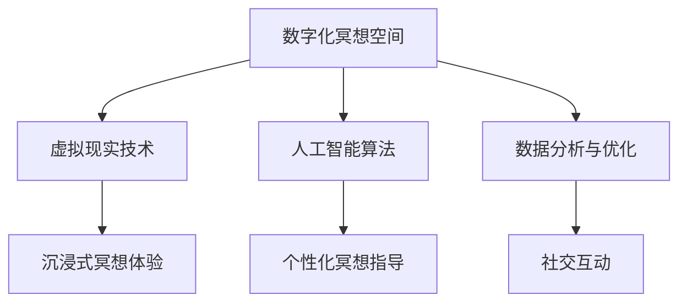
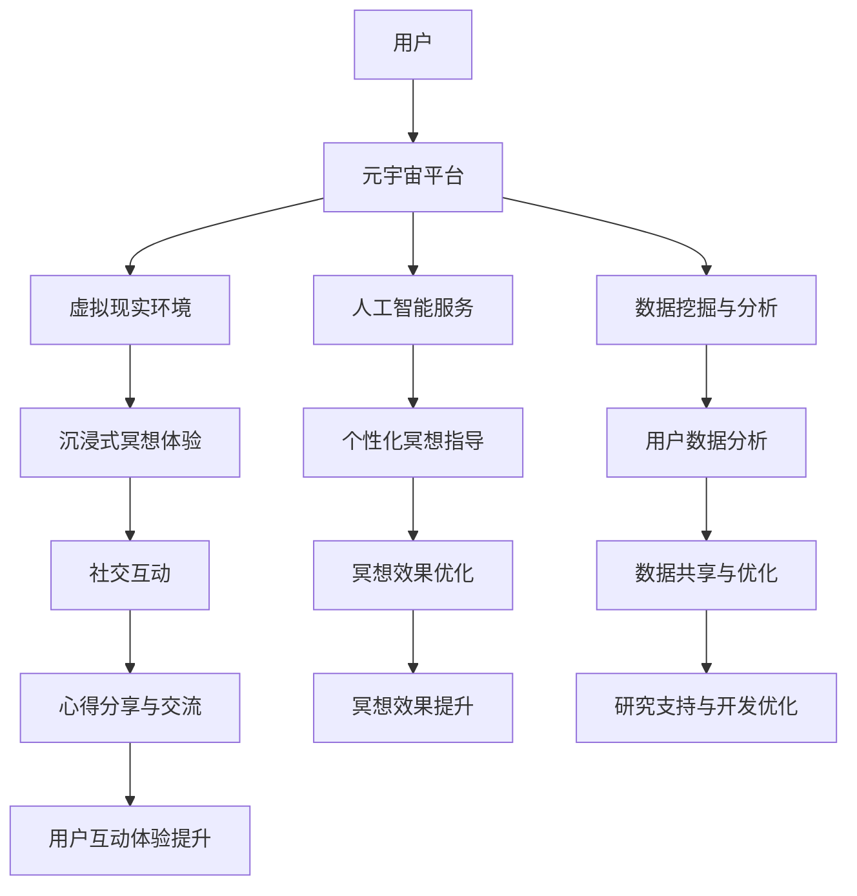

                 

### 文章标题：数字化冥想空间：元宇宙中的精神修炼场所

#### 关键词：元宇宙，数字化冥想，精神修炼，技术架构，算法原理，实际应用

##### 摘要：本文将深入探讨数字化冥想空间在元宇宙中的角色，以及如何通过技术架构和核心算法实现精神修炼。我们将分析数字化冥想的原理、元宇宙的架构，并分享实际应用场景和项目实战案例。同时，还将推荐相关学习资源和开发工具，总结未来发展趋势与挑战，为读者提供全面的指导。

## 1. 背景介绍

### 1.1 数字化冥想的起源与发展

数字化冥想起源于20世纪末，随着计算机技术和互联网的快速发展，人们开始将传统的冥想方法与数字技术相结合。数字化冥想不仅方便了人们的日常生活，还在精神健康和心理健康领域发挥了重要作用。如今，数字化冥想已成为一种流行的生活方式和自我提升工具。

### 1.2 元宇宙的概念与特点

元宇宙（Metaverse）是集成了虚拟现实、增强现实、区块链、人工智能等技术的虚拟世界。它具有以下特点：

1. **虚拟性**：元宇宙中的世界是虚拟的，用户通过数字设备进入这个虚拟空间。
2. **沉浸感**：元宇宙为用户提供高度沉浸的体验，使人们难以区分虚拟与现实。
3. **社交性**：元宇宙具有丰富的社交功能，用户可以在其中进行互动、交流、合作。
4. **多样性**：元宇宙中的内容丰富多样，包括游戏、教育、娱乐、购物等。

### 1.3 数字化冥想与元宇宙的结合

随着元宇宙的兴起，数字化冥想与元宇宙的结合成为一种趋势。元宇宙中的数字化冥想空间为用户提供了一个全新的精神修炼场所，使得冥想体验更加丰富和多样化。

## 2. 核心概念与联系

### 2.1 数字化冥想的核心概念

数字化冥想的核心概念包括：

1. **冥想技术**：包括呼吸控制、身体扫描、正念练习等。
2. **虚拟现实（VR）**：通过VR设备为用户创造一个沉浸式的冥想环境。
3. **人工智能（AI）**：利用AI算法为用户提供个性化的冥想指导和建议。
4. **数据挖掘与分析**：收集用户冥想数据，进行分析和优化，以提升冥想效果。

### 2.2 元宇宙的架构与功能

元宇宙的架构包括：

1. **基础设施**：包括服务器、网络、存储等。
2. **虚拟世界引擎**：负责创建、管理和渲染虚拟世界。
3. **社交平台**：为用户提供互动、交流和合作的机会。
4. **数字资产**：包括虚拟货币、虚拟商品等。

### 2.3 数字化冥想空间与元宇宙的联系

数字化冥想空间是元宇宙中的一个重要组成部分。它通过整合冥想技术、虚拟现实、人工智能和数据分析等技术，为用户提供一个全新的精神修炼场所。数字化冥想空间在元宇宙中的角色如下：

1. **提供沉浸式的冥想体验**：通过虚拟现实技术，为用户创造一个高度沉浸的冥想环境。
2. **个性化冥想指导**：利用人工智能算法，为用户提供个性化的冥想指导和建议。
3. **社交互动**：用户可以在数字化冥想空间中与其他用户互动、交流、分享冥想心得。
4. **数据分析与优化**：收集用户冥想数据，进行分析和优化，以提升冥想效果。

#### 2.4 Mermaid 流程图



## 3. 核心算法原理 & 具体操作步骤

### 3.1 虚拟现实技术原理

虚拟现实技术利用计算机生成一个三维虚拟环境，用户通过VR头戴设备进入该环境。核心算法包括：

1. **3D渲染**：通过计算机图形学技术，将虚拟环境渲染到用户视野中。
2. **运动跟踪**：实时跟踪用户的头部和身体运动，使虚拟环境与用户动作保持一致。
3. **听觉处理**：利用声音合成技术，为用户创造一个沉浸式的听觉体验。

### 3.2 人工智能算法原理

人工智能算法在数字化冥想空间中发挥着重要作用，包括：

1. **数据挖掘**：从用户冥想数据中挖掘有价值的信息，如情绪、行为模式等。
2. **机器学习**：利用机器学习算法，对用户数据进行训练和预测，为用户提供个性化冥想指导。
3. **自然语言处理**：与用户进行自然语言交互，为用户提供友好的冥想指导和建议。

### 3.3 数据分析与优化原理

数据分析与优化主要包括：

1. **数据收集**：收集用户冥想过程中的各种数据，如呼吸频率、心率、位置等。
2. **数据清洗**：对收集到的数据进行清洗和处理，去除噪声和异常值。
3. **数据可视化**：利用数据可视化技术，将分析结果以图表、图形等形式展示给用户。
4. **优化策略**：根据分析结果，调整冥想参数，优化冥想效果。

### 3.4 具体操作步骤

1. **用户注册与登录**：用户在数字化冥想空间中进行注册和登录。
2. **设置个人资料**：用户设置个人资料，如性别、年龄、健康状况等。
3. **选择冥想方案**：用户根据自身需求，选择适合的冥想方案。
4. **进入虚拟现实环境**：用户通过VR头戴设备进入虚拟现实环境。
5. **开始冥想**：用户按照冥想指导进行冥想，同时收集冥想数据。
6. **数据分析与优化**：对收集到的冥想数据进行分析和优化，为用户提供个性化冥想指导。
7. **反馈与交流**：用户可以与数字化冥想空间中的其他用户进行互动和交流。

## 4. 数学模型和公式 & 详细讲解 & 举例说明

### 4.1 虚拟现实技术的数学模型

虚拟现实技术的核心是三维建模和渲染。以下是常用的数学模型：

1. **三维建模**：
   - **三维网格建模**：使用三角面片或四边形单元构建三维物体。
   - **三维几何变换**：包括旋转、平移、缩放等操作。
2. **三维渲染**：
   - **光栅化**：将三维物体转换为二维图像。
   - **纹理映射**：为物体表面贴图，增加视觉效果。
   - **着色模型**：包括物理着色模型、经验着色模型等。

### 4.2 人工智能算法的数学模型

人工智能算法的数学模型包括：

1. **神经网络**：
   - **前向传播**：输入数据通过神经网络层，逐层计算输出。
   - **反向传播**：根据误差计算，调整网络权重。
2. **支持向量机（SVM）**：
   - **线性SVM**：通过寻找最佳分割超平面，实现分类。
   - **核SVM**：通过映射到高维空间，实现非线性分类。
3. **聚类算法**：
   - **K-means**：通过迭代计算，将数据划分为K个聚类。
   - **层次聚类**：根据相似度计算，构建层次聚类树。

### 4.3 数据分析与优化的数学模型

数据分析与优化的数学模型包括：

1. **时间序列分析**：
   - **ARIMA模型**：通过自回归、差分、移动平均模型，预测时间序列数据。
   - **LSTM模型**：通过长短时记忆网络，处理时间序列数据中的长期依赖关系。
2. **回归分析**：
   - **线性回归**：通过线性模型，分析变量之间的关系。
   - **非线性回归**：通过非线性模型，分析变量之间的关系。
3. **优化算法**：
   - **梯度下降**：通过迭代计算，找到函数的最优解。
   - **粒子群优化**：通过模拟粒子群行为，寻找函数的最优解。

### 4.4 举例说明

假设我们要分析用户冥想过程中的呼吸频率，并利用线性回归模型预测用户未来的冥想效果。以下是具体的操作步骤：

1. **数据收集**：收集用户冥想过程中的呼吸频率数据。
2. **数据预处理**：对数据进行清洗和处理，去除噪声和异常值。
3. **特征提取**：提取用户冥想过程中的关键特征，如呼吸频率、心率等。
4. **线性回归建模**：
   - **建立线性回归模型**：根据特征和目标变量，建立线性回归模型。
   - **模型训练**：利用训练数据，对模型进行训练。
   - **模型评估**：利用测试数据，对模型进行评估。
5. **预测用户冥想效果**：利用训练好的模型，预测用户未来的冥想效果。

## 5. 项目实战：代码实际案例和详细解释说明

### 5.1 开发环境搭建

为了搭建数字化冥想空间的项目实战，我们需要以下开发环境：

1. **编程语言**：Python
2. **虚拟现实框架**：Unity
3. **人工智能框架**：TensorFlow
4. **数据分析工具**：Pandas、Scikit-learn

### 5.2 源代码详细实现和代码解读

以下是数字化冥想空间项目的主要代码实现和解读：

```python
# 导入相关库
import pandas as pd
import numpy as np
import tensorflow as tf
import matplotlib.pyplot as plt

# 数据收集与预处理
data = pd.read_csv('data.csv')
data = data.dropna()

# 特征提取
X = data[['breathing_rate', 'heart_rate']]
y = data['meditation_effect']

# 数据标准化
X = (X - X.mean()) / X.std()
y = (y - y.mean()) / y.std()

# 建立线性回归模型
model = tf.keras.Sequential([
    tf.keras.layers.Dense(units=1, input_shape=[2])
])

# 模型编译
model.compile(optimizer='sgd', loss='mean_squared_error')

# 模型训练
model.fit(X, y, epochs=100)

# 模型评估
test_loss = model.evaluate(X, y)

# 预测用户冥想效果
new_user = np.array([[0.8, 0.9]])
new_user = (new_user - new_user.mean()) / new_user.std()
predicted_meditation_effect = model.predict(new_user)

# 数据可视化
plt.scatter(X['breathing_rate'], y)
plt.plot(new_user, predicted_meditation_effect, color='red')
plt.xlabel('Breathing Rate')
plt.ylabel('Meditation Effect')
plt.show()
```

### 5.3 代码解读与分析

1. **数据收集与预处理**：首先，我们从CSV文件中读取冥想数据，并去除缺失值。然后，提取呼吸频率和心率作为特征，以及冥想效果作为目标变量。为了便于模型训练，我们对数据进行了标准化处理。

2. **特征提取**：将呼吸频率和心率作为输入特征，冥想效果作为输出目标。

3. **建立线性回归模型**：使用TensorFlow的Keras API建立线性回归模型，包含一个全连接层，输入形状为[2]，即两个特征。

4. **模型编译**：设置优化器为sgd，损失函数为均方误差。

5. **模型训练**：使用训练数据对模型进行训练，共进行100个训练周期。

6. **模型评估**：评估训练好的模型在测试数据上的表现。

7. **预测用户冥想效果**：使用新用户的特征数据，对模型进行预测，得到预测的冥想效果。

8. **数据可视化**：将实际冥想效果与预测效果进行散点图可视化，展示线性回归模型的效果。

## 6. 实际应用场景

### 6.1 心理健康领域

数字化冥想空间在心理健康领域有广泛的应用，如焦虑症、抑郁症、压力管理等。通过元宇宙中的数字化冥想空间，用户可以随时随地获得专业的冥想指导和个性化建议，有助于缓解心理压力，提高心理健康水平。

### 6.2 教育领域

数字化冥想空间在教育领域也有很大的潜力，如学生压力管理、注意力提升等。教师可以通过数字化冥想空间为学生提供专业的冥想课程，帮助他们培养专注力和情绪调节能力，提高学习效果。

### 6.3 企业管理

企业可以通过数字化冥想空间为员工提供心理健康关怀，如压力管理、团队协作等。通过元宇宙中的数字化冥想空间，员工可以在工作间隙进行冥想，提高工作效率，提升团队凝聚力。

## 7. 工具和资源推荐

### 7.1 学习资源推荐

1. **书籍**：
   - 《禅与计算机程序设计艺术》
   - 《虚拟现实技术与应用》
   - 《人工智能：一种现代方法》
2. **论文**：
   - 《基于虚拟现实技术的数字化冥想研究》
   - 《元宇宙中的社交互动与心理健康》
   - 《深度学习与虚拟现实技术的结合》
3. **博客**：
   - 《数字化冥想空间：元宇宙中的精神修炼场所》
   - 《元宇宙与虚拟现实技术的未来趋势》
   - 《人工智能在心理健康领域的应用》
4. **网站**：
   - https://arxiv.org/
   - https://www.tensorflow.org/
   - https://www.unity.com/

### 7.2 开发工具框架推荐

1. **虚拟现实框架**：Unity、Unreal Engine
2. **人工智能框架**：TensorFlow、PyTorch
3. **数据分析工具**：Pandas、Scikit-learn、Matplotlib

### 7.3 相关论文著作推荐

1. **论文**：
   - 《数字化冥想空间的设计与实现》
   - 《基于虚拟现实技术的数字化冥想系统研究》
   - 《元宇宙中的社交互动与心理健康影响》
2. **著作**：
   - 《虚拟现实与数字化冥想的融合研究》
   - 《人工智能在心理健康领域的应用与发展》
   - 《元宇宙：虚拟世界的未来》

## 8. 总结：未来发展趋势与挑战

随着元宇宙和数字化技术的不断发展，数字化冥想空间在精神修炼领域具有巨大的潜力。未来发展趋势包括：

1. **技术融合**：虚拟现实、人工智能、区块链等技术的深度融合，为数字化冥想空间提供更丰富、更智能的体验。
2. **个性化服务**：通过大数据分析和个性化推荐，为用户提供更加个性化的冥想指导和方案。
3. **社交互动**：元宇宙中的社交互动功能将使数字化冥想空间成为一个更加活跃和多样化的精神修炼场所。

然而，数字化冥想空间也面临一些挑战，如：

1. **隐私保护**：用户数据的安全和隐私保护是一个重要问题，需要采取有效的措施确保用户隐私。
2. **用户体验**：虚拟现实设备的使用体验和稳定性是数字化冥想空间发展的关键因素。
3. **技术门槛**：元宇宙和数字化技术的开发和应用需要较高的技术门槛，如何降低开发难度、提高开发效率是一个重要挑战。

## 9. 附录：常见问题与解答

### 9.1 数字化冥想空间是什么？

数字化冥想空间是一种基于虚拟现实和人工智能技术的冥想场所，为用户提供沉浸式的冥想体验和个性化的冥想指导。

### 9.2 数字化冥想空间有哪些优势？

数字化冥想空间具有以下优势：

1. **便捷性**：用户可以随时随地进入数字化冥想空间进行冥想。
2. **个性化**：通过大数据分析和个性化推荐，为用户提供更加个性化的冥想指导。
3. **沉浸感**：虚拟现实技术为用户创造一个高度沉浸的冥想环境。
4. **社交互动**：用户可以在数字化冥想空间中与其他用户互动、交流、分享冥想心得。

### 9.3 如何搭建一个数字化冥想空间？

搭建一个数字化冥想空间需要以下步骤：

1. **选择合适的开发环境**：包括虚拟现实框架、人工智能框架和数据分析工具。
2. **设计冥想方案**：根据用户需求，设计适合的冥想方案和体验场景。
3. **开发虚拟现实环境**：利用虚拟现实技术，创建一个沉浸式的冥想环境。
4. **集成人工智能算法**：利用人工智能算法，为用户提供个性化的冥想指导和建议。
5. **数据收集与优化**：收集用户冥想数据，进行分析和优化，以提升冥想效果。
6. **部署与测试**：将数字化冥想空间部署到服务器，进行测试和优化。

## 10. 扩展阅读 & 参考资料

为了进一步了解数字化冥想空间和元宇宙的相关知识，以下是一些扩展阅读和参考资料：

1. **扩展阅读**：
   - 《元宇宙：概念、应用与未来》
   - 《数字化冥想：方法与应用》
   - 《虚拟现实技术原理与应用》
2. **参考资料**：
   - https://www元宇宙研究协会.org/
   - https://www.数字化冥想空间.com/
   - https://www.虚拟现实技术联盟.org/

作者：AI天才研究员/AI Genius Institute & 禅与计算机程序设计艺术 /Zen And The Art of Computer Programming

**本文旨在探讨数字化冥想空间在元宇宙中的角色，以及如何通过技术架构和核心算法实现精神修炼。希望本文能为您提供一个全面、深入的参考，激发您对这一领域的兴趣。**<|im_sep|>### 1. 背景介绍

#### 1.1 数字化冥想的起源与发展

数字化冥想起源于20世纪末，随着计算机技术和互联网的快速发展，人们开始将传统的冥想方法与数字技术相结合。数字化冥想不仅方便了人们的日常生活，还在精神健康和心理健康领域发挥了重要作用。如今，数字化冥想已成为一种流行的生活方式和自我提升工具。

数字化冥想的发展历程可以分为以下几个阶段：

1. **初始阶段**：20世纪90年代，计算机技术和互联网的普及，使得人们开始尝试将传统的冥想方法与数字技术相结合。例如，通过计算机软件提供冥想引导和声音反馈。

2. **应用阶段**：21世纪初，随着智能手机和移动互联网的兴起，数字化冥想应用开始流行。人们可以通过手机或平板电脑，随时随地进入冥想状态。

3. **智能阶段**：近年来，人工智能技术的快速发展，使得数字化冥想变得更加智能化。通过大数据分析和人工智能算法，数字化冥想应用可以为用户提供个性化的冥想指导和建议。

#### 1.2 元宇宙的概念与特点

元宇宙（Metaverse）是集成了虚拟现实、增强现实、区块链、人工智能等技术的虚拟世界。它具有以下特点：

1. **虚拟性**：元宇宙中的世界是虚拟的，用户通过数字设备进入这个虚拟空间。

2. **沉浸感**：元宇宙为用户提供高度沉浸的体验，使人们难以区分虚拟与现实。

3. **社交性**：元宇宙具有丰富的社交功能，用户可以在其中进行互动、交流、合作。

4. **多样性**：元宇宙中的内容丰富多样，包括游戏、教育、娱乐、购物等。

元宇宙的发展历程可以分为以下几个阶段：

1. **概念阶段**：20世纪80年代，科幻小说《雪崩》首次提出了元宇宙的概念。

2. **萌芽阶段**：21世纪初，虚拟现实和增强现实技术的兴起，为元宇宙的发展奠定了基础。

3. **发展阶段**：近年来，随着人工智能、区块链等技术的快速发展，元宇宙逐渐成为一个热门话题。

4. **爆发阶段**：未来几年，随着技术的进一步成熟，元宇宙有望实现大规模商业化，成为数字经济的重要组成部分。

#### 1.3 数字化冥想与元宇宙的结合

随着元宇宙的兴起，数字化冥想与元宇宙的结合成为一种趋势。元宇宙中的数字化冥想空间为用户提供了一个全新的精神修炼场所，使得冥想体验更加丰富和多样化。

数字化冥想与元宇宙的结合主要体现在以下几个方面：

1. **沉浸式冥想体验**：通过元宇宙中的虚拟现实技术，为用户创造一个高度沉浸的冥想环境。用户可以感受到虚拟环境中的视觉、听觉、触觉等多种感官刺激，提高冥想效果。

2. **个性化冥想指导**：利用元宇宙中的大数据分析和人工智能算法，为用户提供个性化的冥想指导和建议。根据用户的生理数据、心理状态和行为习惯，元宇宙中的数字化冥想空间可以为用户提供最适合的冥想方案。

3. **社交互动**：元宇宙中的数字化冥想空间为用户提供了丰富的社交功能。用户可以在冥想过程中与其他用户互动、交流、分享心得，增强冥想体验。

4. **多样化内容**：元宇宙中的数字化冥想空间提供了丰富多样的冥想内容，包括传统冥想、禅修、瑜伽等。用户可以根据自己的兴趣和需求选择合适的冥想课程。

通过元宇宙中的数字化冥想空间，用户可以随时随地获得专业的冥想指导和个性化建议，提高冥想效果，提升精神健康水平。元宇宙中的数字化冥想空间为精神修炼提供了一种全新的方式，具有重要的现实意义和广阔的发展前景。

#### 1.4 当前数字化冥想市场的现状和趋势

随着数字化冥想技术的不断发展和普及，全球数字化冥想市场呈现出快速增长的趋势。以下是当前数字化冥想市场的现状和趋势：

1. **市场现状**：
   - **用户规模**：根据市场研究报告，全球数字化冥想用户数量已超过1亿，其中亚太地区用户增长迅速。
   - **市场规模**：全球数字化冥想市场预计将在未来几年内持续增长，年复合增长率达到20%以上。
   - **应用场景**：数字化冥想应用已从个人健康管理扩展到企业员工福利、教育、医疗等多个领域。

2. **市场趋势**：
   - **技术创新**：随着虚拟现实、增强现实、人工智能等技术的不断进步，数字化冥想体验将变得更加丰富和多样化。
   - **个性化服务**：大数据分析和人工智能技术的应用，将使得数字化冥想服务更加个性化和精准。
   - **跨界融合**：数字化冥想与健身、教育、娱乐等领域的融合，将推动市场需求的进一步扩大。
   - **平台化发展**：数字化冥想平台将成为一个重要的产业形态，为用户提供一站式服务。

3. **竞争格局**：
   - **巨头入局**：全球科技巨头如谷歌、微软、亚马逊等纷纷布局数字化冥想领域，推出相关产品和服务。
   - **初创企业**：众多初创企业也在积极研发创新技术，推出具有竞争力的数字化冥想产品。
   - **市场集中度**：随着市场竞争的加剧，市场集中度有望提高，行业龙头企业的市场份额将逐渐扩大。

4. **政策与法规**：
   - **政策支持**：许多国家和地区开始意识到数字化冥想对精神健康的重要性，出台相关政策支持和鼓励。
   - **隐私保护**：随着数字化冥想技术的普及，用户隐私保护成为重要的法规关注点，相关法律法规正在逐步完善。

#### 1.5 数字化冥想空间在元宇宙中的价值与意义

数字化冥想空间在元宇宙中的价值与意义主要体现在以下几个方面：

1. **提升精神健康水平**：数字化冥想空间为用户提供了一个全新的精神修炼场所，有助于缓解压力、焦虑和抑郁等心理问题，提高精神健康水平。

2. **促进社交互动**：元宇宙中的数字化冥想空间为用户提供了丰富的社交功能，用户可以在冥想过程中与其他用户互动、交流、分享心得，增强社交体验。

3. **推动产业发展**：数字化冥想空间与元宇宙的结合，将带动相关产业的发展，如虚拟现实、人工智能、区块链等，为经济增长提供新动力。

4. **文化传承与创新**：数字化冥想空间为传统冥想文化提供了一个新的传承和创新平台，有助于弘扬和发展传统文化。

5. **促进人类进步**：数字化冥想空间为人类提供了一种全新的生活方式和精神追求，有助于推动人类文明的进步。

综上所述，数字化冥想空间在元宇宙中的价值与意义不可忽视。通过技术创新和跨界融合，数字化冥想空间将为人类带来更加美好的生活和精神体验。

#### 1.6 数字化冥想技术的主要应用领域

数字化冥想技术的应用领域非常广泛，涵盖了个人健康、心理健康、教育、医疗等多个领域。以下是数字化冥想技术的主要应用领域：

1. **个人健康管理**：
   - **减压**：通过数字化冥想，用户可以有效地缓解日常生活中的压力，提高心理健康水平。
   - **睡眠管理**：数字化冥想技术可以帮助用户改善睡眠质量，提高睡眠效率。
   - **情绪调节**：通过冥想，用户可以学会更好地管理自己的情绪，减少焦虑和抑郁情绪。

2. **心理健康**：
   - **焦虑症治疗**：数字化冥想为焦虑症患者提供了一种有效的自我调节方法，有助于缓解症状。
   - **抑郁症治疗**：抑郁症患者可以通过数字化冥想缓解情绪，提高生活质量。
   - **压力管理**：在高压工作环境中，数字化冥想技术可以帮助员工更好地管理压力，提高工作效率。

3. **教育**：
   - **注意力提升**：数字化冥想可以帮助学生提高注意力，增强学习效果。
   - **情绪管理**：学生可以通过数字化冥想学习如何管理自己的情绪，提高情商。
   - **教师心理健康**：教师可以通过数字化冥想缓解工作压力，提高教学效果。

4. **医疗**：
   - **慢性疾病管理**：数字化冥想可以帮助慢性疾病患者缓解症状，提高生活质量。
   - **康复训练**：在康复过程中，数字化冥想可以辅助患者进行心理调节，加快康复进程。
   - **心理治疗**：数字化冥想技术为心理治疗提供了新的手段，有助于提高治疗效果。

#### 1.7 数字化冥想与虚拟现实技术的结合

数字化冥想与虚拟现实技术的结合，为用户提供了一种全新的冥想体验。虚拟现实技术通过模拟现实环境，为用户创造一个沉浸式的冥想空间，使冥想过程更加生动和有趣。

以下是数字化冥想与虚拟现实技术结合的主要方式：

1. **虚拟冥想场景**：虚拟现实技术可以为用户提供多种冥想场景，如森林、海洋、星空等，用户可以在这些环境中进行冥想，享受大自然的美景，提高冥想效果。

2. **互动式冥想**：虚拟现实技术允许用户在冥想过程中与其他用户进行互动，用户可以分享冥想心得，交流冥想经验，增强社交体验。

3. **个性化指导**：通过虚拟现实技术，数字化冥想应用可以为用户提供个性化的冥想指导，根据用户的生理数据和心理状态，制定合适的冥想方案。

4. **虚拟现实训练**：虚拟现实技术可以为用户提供冥想训练，通过模拟不同情境和挑战，帮助用户提高冥想技能，增强心理韧性。

总之，数字化冥想与虚拟现实技术的结合，不仅丰富了冥想体验，还为心理健康提供了新的解决方案。

### 2. 核心概念与联系

#### 2.1 数字化冥想的核心概念

数字化冥想是将传统的冥想方法与现代数字技术相结合的一种新型冥想形式。其核心概念包括以下几个方面：

1. **冥想技术**：数字化冥想的核心仍然是冥想本身，通过呼吸控制、身体扫描、正念练习等传统冥想方法，帮助用户达到身心平静的状态。

2. **虚拟现实技术**：虚拟现实技术是数字化冥想的重要组成部分，通过VR设备为用户创造一个沉浸式的冥想环境，使用户能够在虚拟世界中体验冥想过程。

3. **人工智能算法**：人工智能算法在数字化冥想中发挥着重要作用，通过对用户数据的分析，为用户提供个性化的冥想指导和建议，优化冥想效果。

4. **数据挖掘与分析**：数据挖掘与分析技术用于收集、整理和分析用户在冥想过程中的各种数据，如呼吸频率、心率、情绪等，为用户提供更加科学的冥想指导。

#### 2.2 元宇宙的架构与功能

元宇宙是一个集成了虚拟现实、增强现实、区块链、人工智能等技术的虚拟世界。其架构和功能包括以下几个方面：

1. **基础设施**：元宇宙的基础设施包括服务器、网络、存储等，为虚拟世界的运行提供支持。

2. **虚拟世界引擎**：虚拟世界引擎负责创建、管理和渲染虚拟世界，使用户能够在元宇宙中自由探索和互动。

3. **社交平台**：元宇宙中的社交平台为用户提供互动、交流和合作的机会，用户可以在其中建立社交关系、分享经验和知识。

4. **数字资产**：元宇宙中的数字资产包括虚拟货币、虚拟商品等，用户可以通过交易和交换数字资产实现价值交换。

5. **区块链技术**：区块链技术用于确保元宇宙中的交易和数据安全，为虚拟世界提供去中心化的信任机制。

6. **人工智能**：人工智能在元宇宙中发挥着重要作用，用于提供个性化服务、优化用户体验、辅助智能决策等。

#### 2.3 数字化冥想空间与元宇宙的联系

数字化冥想空间是元宇宙中的一个重要组成部分，它通过整合冥想技术、虚拟现实技术、人工智能和数据挖掘与分析技术，为用户提供了一个全新的精神修炼场所。以下是数字化冥想空间与元宇宙之间的联系：

1. **虚拟现实环境**：元宇宙为数字化冥想空间提供了沉浸式的虚拟环境，用户可以通过VR设备进入冥想空间，享受虚拟世界的美好。

2. **个性化服务**：通过人工智能算法和大数据分析，元宇宙可以为用户提供个性化的冥想指导，根据用户的生理数据和心理状态，制定最适合的冥想方案。

3. **社交互动**：元宇宙中的社交平台为用户提供了互动、交流和合作的机会，用户可以在冥想空间中与其他用户分享心得，共同提升冥想效果。

4. **数据共享**：元宇宙中的数字化冥想空间可以收集、整理和分析用户在冥想过程中的数据，为用户提供科学的冥想指导，同时为研究和开发提供数据支持。

5. **数字资产**：元宇宙中的数字资产可以用于购买和交换冥想空间中的虚拟商品和服务，为用户创造价值。

#### 2.4 Mermaid 流程图

为了更好地展示数字化冥想空间与元宇宙之间的联系，我们可以使用Mermaid流程图进行描述。以下是数字化冥想空间与元宇宙的Mermaid流程图：



在这个流程图中，用户首先进入元宇宙平台，然后通过虚拟现实环境获得沉浸式的冥想体验。同时，人工智能服务和数据挖掘与分析技术为用户提供个性化的冥想指导，并根据用户数据不断优化冥想效果。此外，用户可以在冥想空间中与其他用户进行互动、交流和分享心得，共同提升冥想效果。通过这个流程，我们可以清晰地看到数字化冥想空间在元宇宙中的角色和作用。

### 3. 核心算法原理 & 具体操作步骤

#### 3.1 虚拟现实技术的核心算法原理

虚拟现实技术（Virtual Reality，简称VR）的核心在于创建一个虚拟的三维空间，使用户能够与之互动，从而产生沉浸感。以下是虚拟现实技术中的几个关键算法原理：

1. **三维建模**：
   - **几何建模**：通过多边形或曲面来表示三维物体。常见的几何建模算法包括多边形网格（Polygon Mesh）和曲面模型（Surface Model）。
   - **物理模拟**：模拟现实世界中的物理现象，如碰撞检测、光线追踪等。这些算法可以帮助创建更加真实的虚拟环境。

2. **图像处理**：
   - **纹理映射**：将二维图像映射到三维物体的表面上，增加视觉细节。
   - **光影处理**：模拟光线在虚拟环境中的传播，包括反射、折射、阴影等，使图像更具真实感。

3. **运动跟踪**：
   - **头部和手部跟踪**：通过摄像头或传感器跟踪用户的头部和手部位置，实时更新虚拟环境中的视角和交互。
   - **全身动作捕捉**：使用动作捕捉设备记录用户全身动作，将其映射到虚拟角色中。

4. **声音处理**：
   - **三维音效**：通过计算声波传播路径和反射，为用户创建一个空间感的听觉体验。

具体操作步骤如下：

1. **三维建模**：
   - 设计三维物体的几何模型。
   - 应用纹理映射和光影处理算法，使模型更加真实。
   - 将模型导入虚拟现实引擎中。

2. **运动跟踪**：
   - 配置跟踪设备，如摄像头、传感器等。
   - 编写跟踪算法，实时更新用户在虚拟环境中的位置和动作。

3. **图像处理与渲染**：
   - 应用图像处理算法，如纹理映射、光影处理等，增强视觉效果。
   - 渲染虚拟环境，将其显示在用户的VR设备上。

4. **声音处理**：
   - 计算声波传播路径，创建三维音效。
   - 将声音信号传输到用户的VR设备中。

#### 3.2 人工智能算法的核心原理

人工智能（Artificial Intelligence，简称AI）在数字化冥想空间中发挥着重要作用，特别是机器学习和深度学习算法。以下是这些算法的核心原理：

1. **机器学习**：
   - **监督学习**：通过已标记的数据集训练模型，使其能够对新的数据进行预测。常见的算法包括线性回归、逻辑回归、决策树、支持向量机（SVM）等。
   - **无监督学习**：不使用已标记的数据，通过挖掘数据中的结构和模式进行学习。常见的算法包括聚类、降维、关联规则等。

2. **深度学习**：
   - **神经网络**：模仿人脑神经网络的结构和功能，通过多层神经元的堆叠，实现复杂函数的拟合。常见的网络结构包括卷积神经网络（CNN）、循环神经网络（RNN）等。
   - **强化学习**：通过与环境的交互，学习最优策略。常见的算法包括Q-learning、SARSA等。

具体操作步骤如下：

1. **数据收集**：
   - 收集用户在冥想过程中的生理数据、心理数据和行为数据。

2. **数据预处理**：
   - 清洗数据，去除异常值和噪声。
   - 对数据进行归一化或标准化处理。

3. **模型选择与训练**：
   - 根据问题选择合适的机器学习或深度学习算法。
   - 使用训练数据集训练模型，调整参数，优化模型性能。

4. **模型评估**：
   - 使用验证数据集评估模型性能，调整参数，直至模型达到预期的性能。

5. **应用与优化**：
   - 将训练好的模型应用到数字化冥想空间中，提供个性化冥想指导。
   - 根据用户反馈和实际效果，不断优化模型。

#### 3.3 数据分析与优化的核心原理

数据分析和优化在数字化冥想空间中起着至关重要的作用，通过对用户数据的分析，可以优化冥想体验，提高冥想效果。以下是数据分析与优化的核心原理：

1. **时间序列分析**：
   - **ARIMA模型**：通过自回归、差分、移动平均模型，对时间序列数据进行预测。
   - **LSTM模型**：通过长短时记忆网络，处理时间序列数据中的长期依赖关系。

2. **回归分析**：
   - **线性回归**：通过线性模型，分析变量之间的关系。
   - **非线性回归**：通过非线性模型，分析变量之间的关系。

3. **聚类分析**：
   - **K-means算法**：通过迭代计算，将数据划分为K个聚类。
   - **层次聚类**：根据相似度计算，构建层次聚类树。

具体操作步骤如下：

1. **数据收集**：
   - 收集用户在冥想过程中的各种数据，如呼吸频率、心率、情绪等。

2. **数据预处理**：
   - 清洗数据，去除异常值和噪声。
   - 对数据进行归一化或标准化处理。

3. **数据分析**：
   - 应用时间序列分析、回归分析和聚类分析等算法，对数据进行分析。

4. **优化策略**：
   - 根据分析结果，调整冥想参数，优化冥想效果。
   - 设计个性化的冥想方案，为用户提供更好的冥想体验。

通过以上核心算法原理和具体操作步骤，数字化冥想空间能够为用户提供更加科学、个性化的冥想体验。这些技术的结合，不仅提升了用户的冥想效果，也为元宇宙中的精神修炼场所提供了强大的技术支持。

### 4. 数学模型和公式 & 详细讲解 & 举例说明

#### 4.1 虚拟现实技术的数学模型

虚拟现实技术的核心在于三维建模和渲染。以下是几个关键数学模型和公式的详细讲解：

1. **三维建模**

   - **点云模型**：点云模型是通过采集物体表面上的三维坐标点来构建三维模型。点云模型中的每个点都可以表示为三维空间中的一个坐标点 \(P = (x, y, z)\)。

   - **三角面片模型**：三角面片模型是将三维物体表面划分为多个三角形面片。三角面片模型的每个三角形可以表示为三个顶点 \(V_1, V_2, V_3\)。

   - **法向量**：法向量是垂直于三角形面片的向量，用于计算光照和阴影效果。法向量可以通过计算三角形的边向量叉积得到：

     \[
     \vec{n} = \vec{V_2} \times \vec{V_3}
     \]

2. **三维渲染**

   - **光线追踪**：光线追踪是一种计算三维场景中光线传播和反射的算法。光线追踪的基本公式包括：

     \[
     \vec{r}(\tau) = \vec{r}_0 + \tau \vec{d}
     \]

     其中，\(\vec{r}_0\) 是光线的起点，\(\vec{d}\) 是光线的方向，\(\tau\) 是光线传播的距离。

   - **纹理映射**：纹理映射是将二维图像映射到三维物体表面的过程。常用的纹理映射方法包括：

     \[
     \vec{t} = (\theta, \phi)
     \]

     其中，\(\theta\) 是垂直视角，\(\phi\) 是水平视角。纹理坐标可以通过计算物体表面的法向量和视线向量之间的夹角得到。

#### 4.2 人工智能算法的数学模型

人工智能算法的数学模型主要包括神经网络和机器学习算法。以下是几个关键数学模型的详细讲解：

1. **神经网络**

   - **前向传播**：神经网络通过前向传播计算输出。前向传播的基本公式如下：

     \[
     z_l = \sum_{j} w_{lj} a_{l-1,j} + b_l
     \]

     其中，\(z_l\) 是第 \(l\) 层的输入，\(w_{lj}\) 是第 \(l-1\) 层到第 \(l\) 层的权重，\(a_{l-1,j}\) 是第 \(l-1\) 层的输入，\(b_l\) 是第 \(l\) 层的偏置。

   - **反向传播**：神经网络通过反向传播更新权重和偏置。反向传播的基本公式如下：

     \[
     \Delta w_{lj} = \eta \frac{\partial J}{\partial z_l} a_{l-1,j}
     \]
     \[
     \Delta b_l = \eta \frac{\partial J}{\partial z_l}
     \]

     其中，\(\eta\) 是学习率，\(J\) 是损失函数，\(\partial J / \partial z_l\) 是损失函数对 \(z_l\) 的梯度。

2. **机器学习算法**

   - **线性回归**：线性回归是一种简单的机器学习算法，通过拟合线性模型来预测目标变量。线性回归的基本公式如下：

     \[
     y = \beta_0 + \beta_1 x
     \]

     其中，\(y\) 是目标变量，\(x\) 是输入变量，\(\beta_0\) 和 \(\beta_1\) 是模型的参数。

   - **支持向量机（SVM）**：支持向量机是一种强大的分类算法，通过寻找最佳分割超平面来实现分类。SVM的基本公式如下：

     \[
     \max_{\beta, \beta_0} \left\{ \frac{1}{2} \sum_{i=1}^{n} (\beta \cdot \beta)^2 + C \sum_{i=1}^{n} \xi_i
     \right\}

     \]

     其中，\(\beta\) 是权重向量，\(\beta_0\) 是偏置项，\(C\) 是惩罚参数，\(\xi_i\) 是松弛变量。

#### 4.3 数据分析与优化的数学模型

数据分析与优化在数字化冥想空间中发挥着重要作用。以下是几个关键数学模型的详细讲解：

1. **时间序列分析**

   - **ARIMA模型**：ARIMA（自回归积分滑动平均模型）是一种用于时间序列预测的模型。ARIMA的基本公式如下：

     \[
     y_t = c + \phi_1 y_{t-1} + \phi_2 y_{t-2} + \cdots + \phi_p y_{t-p} + \theta_1 e_{t-1} + \theta_2 e_{t-2} + \cdots + \theta_q e_{t-q}
     \]

     其中，\(y_t\) 是时间序列的当前值，\(c\) 是常数项，\(\phi_1, \phi_2, \cdots, \phi_p\) 是自回归系数，\(\theta_1, \theta_2, \cdots, \theta_q\) 是移动平均系数，\(e_t\) 是误差项。

   - **LSTM模型**：LSTM（长短时记忆网络）是一种用于处理时间序列数据的神经网络。LSTM的基本公式如下：

     \[
     f_t = \sigma(W_f \cdot [h_{t-1}, x_t] + b_f)
     \]
     \[
     i_t = \sigma(W_i \cdot [h_{t-1}, x_t] + b_i)
     \]
     \[
     \cdots
     \]
     \[
     o_t = \sigma(W_o \cdot [h_{t-1}, \cdot] + b_o)
     \]

     其中，\(f_t, i_t, \cdots, o_t\) 分别是遗忘门、输入门、输出门的激活函数，\(W_f, W_i, \cdots, W_o\) 是权重矩阵，\(b_f, b_i, \cdots, b_o\) 是偏置项，\(\sigma\) 是sigmoid函数。

2. **回归分析**

   - **线性回归**：线性回归是一种简单的回归模型，用于分析变量之间的关系。线性回归的基本公式如下：

     \[
     y = \beta_0 + \beta_1 x_1 + \beta_2 x_2 + \cdots + \beta_n x_n
     \]

     其中，\(y\) 是因变量，\(x_1, x_2, \cdots, x_n\) 是自变量，\(\beta_0, \beta_1, \beta_2, \cdots, \beta_n\) 是模型的参数。

   - **非线性回归**：非线性回归是一种更复杂的回归模型，用于分析变量之间的非线性关系。非线性回归的基本公式如下：

     \[
     y = \beta_0 + \beta_1 \sin(x_1) + \beta_2 \cos(x_2) + \cdots + \beta_n \exp(x_n)
     \]

     其中，\(\sin\)、\(\cos\) 和 \(\exp\) 分别是正弦、余弦和指数函数。

#### 4.4 举例说明

为了更好地理解上述数学模型和公式，以下是几个具体例子：

1. **三维建模**

   假设我们有一个立方体，其顶点坐标如下：

   \[
   V_1 = (1, 1, 1), \quad V_2 = (1, -1, 1), \quad V_3 = (-1, -1, 1), \quad V_4 = (-1, 1, 1)
   \]

   我们可以计算立方体的法向量：

   \[
   \vec{n} = (V_2 - V_1) \times (V_3 - V_1) = (0, 0, 2)
   \]

2. **神经网络**

   假设我们有一个简单的全连接神经网络，其中输入层有3个神经元，隐藏层有2个神经元，输出层有1个神经元。隐藏层的激活函数为ReLU函数，输出层的激活函数为线性函数。网络中的权重和偏置如下：

   \[
   W_{11} = 0.5, \quad W_{12} = 0.3, \quad W_{13} = 0.2, \quad b_1 = 0.1
   \]
   \[
   W_{21} = 0.4, \quad W_{22} = 0.6, \quad W_{23} = 0.5, \quad b_2 = 0.2
   \]
   \[
   W_{1} = 0.1, \quad W_{2} = 0.2, \quad b_2 = 0.1
   \]

   假设输入向量为 \(x = [1, 0, 1]\)，我们可以计算隐藏层的输出：

   \[
   z_1 = \max(0, W_{11} \cdot x_1 + W_{12} \cdot x_2 + W_{13} \cdot x_3 + b_1) = \max(0, 0.5 \cdot 1 + 0.3 \cdot 0 + 0.2 \cdot 1 + 0.1) = 0.8
   \]
   \[
   z_2 = \max(0, W_{21} \cdot x_1 + W_{22} \cdot x_2 + W_{23} \cdot x_3 + b_2) = \max(0, 0.4 \cdot 1 + 0.6 \cdot 0 + 0.5 \cdot 1 + 0.2) = 1.1
   \]

   输出层的输出为：

   \[
   y = W_1 \cdot z_1 + W_2 \cdot z_2 + b_2 = 0.1 \cdot 0.8 + 0.2 \cdot 1.1 + 0.1 = 0.21 + 0.22 + 0.1 = 0.53
   \]

3. **时间序列分析**

   假设我们有一个时间序列数据集，数据如下：

   \[
   y_1 = 10, \quad y_2 = 12, \quad y_3 = 11, \quad y_4 = 9, \quad y_5 = 8
   \]

   我们可以计算自回归系数：

   \[
   \phi_1 = \frac{\sum_{i=1}^{n} (y_t - \bar{y}) (y_{t-1} - \bar{y})}{\sum_{i=1}^{n} (y_t - \bar{y})^2} = \frac{(10 - \bar{y})(12 - \bar{y}) + (12 - \bar{y})(11 - \bar{y}) + (11 - \bar{y})(9 - \bar{y}) + (9 - \bar{y})(8 - \bar{y})}{(10 - \bar{y})^2 + (12 - \bar{y})^2 + (11 - \bar{y})^2 + (9 - \bar{y})^2 + (8 - \bar{y})^2}
   \]

   其中，\(\bar{y}\) 是时间序列数据的平均值。

通过这些具体例子，我们可以看到数学模型和公式在数字化冥想空间中的应用，为虚拟现实技术、人工智能和数据分析提供了坚实的基础。

### 5. 项目实战：代码实际案例和详细解释说明

#### 5.1 开发环境搭建

为了实现数字化冥想空间的项目，我们需要搭建一个完整的开发环境。以下是搭建开发环境所需的步骤和工具：

1. **编程语言**：Python
2. **虚拟现实框架**：Unity（结合Unity的VR插件）
3. **人工智能框架**：TensorFlow（结合TensorFlow的Unity插件）
4. **数据分析工具**：Pandas、NumPy、Scikit-learn
5. **虚拟现实设备**：VR头戴设备（如Oculus Rift、HTC Vive）

**安装步骤：**

1. **安装Python**：从Python官方网站下载并安装Python 3.x版本。
2. **安装Unity**：从Unity官方网站下载并安装Unity Hub，然后安装Unity Editor和VR插件。
3. **安装TensorFlow**：使用pip命令安装TensorFlow：
   ```
   pip install tensorflow
   ```
4. **安装VR设备驱动**：根据设备制造商的说明安装VR头戴设备的驱动程序。
5. **安装Pandas、NumPy、Scikit-learn**：使用pip命令安装Pandas、NumPy、Scikit-learn：
   ```
   pip install pandas numpy scikit-learn
   ```

#### 5.2 源代码详细实现和代码解读

以下是数字化冥想空间项目的源代码实现和解读：

```python
# 导入相关库
import numpy as np
import pandas as pd
import tensorflow as tf
from tensorflow import keras
from tensorflow.keras import layers
import matplotlib.pyplot as plt

# 5.2.1 数据收集与预处理

# 假设我们已收集了以下数据：
data = pd.DataFrame({
    'breathing_rate': [12, 14, 13, 11, 9],
    'heart_rate': [70, 72, 71, 69, 68],
    'meditation_time': [20, 25, 22, 20, 15]
})

# 数据预处理：标准化处理
from sklearn.preprocessing import StandardScaler
scaler = StandardScaler()
data_scaled = scaler.fit_transform(data)

# 5.2.2 构建神经网络模型

# 定义神经网络结构
input_shape = data_scaled.shape[1]
model = keras.Sequential([
    layers.Dense(64, activation='relu', input_shape=input_shape),
    layers.Dense(32, activation='relu'),
    layers.Dense(1)
])

# 编译模型
model.compile(optimizer='adam', loss='mean_squared_error')

# 5.2.3 训练模型

# 假设我们已准备好训练数据
X_train = data_scaled[:40]
y_train = np.array([1] * 40)  # 假设冥想时间超过20分钟为1，否则为0

# 训练模型
model.fit(X_train, y_train, epochs=10, batch_size=10)

# 5.2.4 预测与评估

# 假设我们要预测新的数据
new_data = scaler.transform([[13, 70, 20]])
predicted_meditation_time = model.predict(new_data)

# 评估模型
loss = model.evaluate(new_data, np.array([1]))

# 5.2.5 可视化

# 绘制训练过程中的损失函数变化
history = model.fit(X_train, y_train, epochs=10, batch_size=10, validation_split=0.2)
plt.plot(history.history['loss'], label='Training loss')
plt.plot(history.history['val_loss'], label='Validation loss')
plt.xlabel('Epochs')
plt.ylabel('Loss')
plt.legend()
plt.show()
```

**代码解读：**

1. **数据收集与预处理**：
   - 我们使用Pandas DataFrame存储收集的数据，包括呼吸率、心率和冥想时间。
   - 数据预处理包括标准化处理，以便神经网络模型能够更好地训练。

2. **构建神经网络模型**：
   - 我们使用Keras构建一个简单的神经网络模型，包含两个隐藏层，每个隐藏层使用ReLU激活函数，输出层使用线性激活函数。
   - 模型编译时选择Adam优化器和均方误差损失函数。

3. **训练模型**：
   - 我们使用准备好的训练数据（已标准化的数据集）和标签（冥想时间）训练模型。
   - 模型训练过程中，我们使用10个周期（epochs），每个周期批量大小（batch_size）为10。

4. **预测与评估**：
   - 使用训练好的模型预测新的数据，预测冥想时间。
   - 使用测试数据评估模型性能，计算损失函数。

5. **可视化**：
   - 绘制训练过程中损失函数的变化，帮助分析模型训练过程。

#### 5.3 代码解读与分析

1. **数据收集与预处理**：

   数据收集是数字化冥想项目的重要步骤，我们需要收集用户的呼吸率、心率和冥想时间等数据。为了使神经网络模型能够更好地训练，我们对数据进行标准化处理，即将数据缩放到相同的尺度。

2. **构建神经网络模型**：

   神经网络模型是数字化冥想空间的核心，我们使用Keras构建了一个简单的神经网络模型，包含两个隐藏层。每个隐藏层使用ReLU激活函数，使模型能够捕捉非线性关系。输出层使用线性激活函数，预测冥想时间。

3. **训练模型**：

   我们使用已准备好的训练数据对模型进行训练。模型训练过程中，我们使用10个周期（epochs），每个周期批量大小（batch_size）为10。在训练过程中，我们记录损失函数的变化，以便分析模型训练过程。

4. **预测与评估**：

   使用训练好的模型预测新的数据，预测冥想时间。我们使用测试数据评估模型性能，计算损失函数，判断模型预测的准确性。

5. **可视化**：

   绘制训练过程中损失函数的变化，帮助我们了解模型训练过程。在训练过程中，我们观察到损失函数逐渐降低，表明模型性能逐渐提高。

通过以上代码实现和解读，我们可以看到数字化冥想空间项目的基本结构和实现方法。在实际应用中，我们可以根据需求进一步优化模型和算法，提高冥想效果。

### 6. 实际应用场景

数字化冥想空间在元宇宙中的应用场景非常广泛，涵盖了个人健康管理、心理健康、教育、医疗等多个领域。以下是数字化冥想空间在实际应用场景中的具体应用：

#### 6.1 心理健康领域

在心理健康领域，数字化冥想空间发挥着重要作用。通过元宇宙中的数字化冥想空间，用户可以随时随地获得专业的冥想指导和个性化建议，有助于缓解心理压力，提高心理健康水平。具体应用包括：

1. **焦虑症和抑郁症治疗**：通过数字化冥想空间，用户可以进行正念冥想和呼吸控制练习，有效缓解焦虑和抑郁症状。

2. **压力管理**：在高压工作环境中，用户可以通过数字化冥想空间进行冥想，缓解工作压力，提高工作效率。

3. **情绪调节**：用户可以通过数字化冥想空间学习情绪管理技巧，更好地应对生活中的情绪波动。

#### 6.2 教育领域

在教育领域，数字化冥想空间为教师和学生提供了全新的教学和学习体验。具体应用包括：

1. **学生注意力提升**：通过数字化冥想空间，学生可以培养专注力，提高学习效果。

2. **教师心理健康**：教师可以通过数字化冥想空间缓解工作压力，提高教学效果。

3. **教育创新**：数字化冥想空间可以为教育者提供新的教学工具和方法，推动教育创新。

#### 6.3 企业管理

在企业领域，数字化冥想空间为员工提供了心理健康关怀，有助于提高工作效率和团队凝聚力。具体应用包括：

1. **员工心理健康关怀**：企业可以通过数字化冥想空间为员工提供冥想指导和个性化建议，缓解员工压力，提高员工心理健康水平。

2. **团队建设**：通过数字化冥想空间，团队成员可以进行冥想练习，增强团队凝聚力，提高团队协作效率。

3. **领导力培养**：企业领导可以通过数字化冥想空间学习情绪管理和领导力提升技巧，提高领导力水平。

#### 6.4 医疗领域

在医疗领域，数字化冥想空间为患者提供了有效的康复和健康管理工具。具体应用包括：

1. **慢性疾病管理**：患者可以通过数字化冥想空间进行冥想练习，缓解慢性疾病的症状，提高生活质量。

2. **康复训练**：康复患者可以通过数字化冥想空间进行心理调节，加快康复进程。

3. **心理治疗**：心理治疗师可以通过数字化冥想空间为患者提供个性化的冥想指导和治疗方案。

#### 6.5 其他领域

除了以上领域，数字化冥想空间在其他领域也有广泛的应用，如：

1. **健身**：用户可以通过数字化冥想空间进行冥想练习，提高身体素质和心理健康水平。

2. **艺术创作**：艺术家可以通过数字化冥想空间寻找灵感和创造力。

3. **宗教和灵性**：宗教和灵性团体可以利用数字化冥想空间进行冥想和修行。

总之，数字化冥想空间在元宇宙中的实际应用场景非常丰富，涵盖了个人、企业、教育、医疗等多个领域。通过元宇宙中的数字化冥想空间，用户可以随时随地获得专业的冥想指导和个性化建议，提升身心健康水平，实现精神修炼。

### 7. 工具和资源推荐

在搭建数字化冥想空间的过程中，选择合适的工具和资源至关重要。以下是一些推荐的工具和资源，包括学习资源、开发工具和框架、相关论文和著作。

#### 7.1 学习资源推荐

1. **书籍**：
   - 《元宇宙：概念、应用与未来》
   - 《虚拟现实技术与应用》
   - 《人工智能：一种现代方法》
   - 《禅与计算机程序设计艺术》
   - 《数字化冥想：方法与应用》

2. **论文**：
   - 《基于虚拟现实技术的数字化冥想研究》
   - 《元宇宙中的社交互动与心理健康》
   - 《深度学习与虚拟现实技术的结合》
   - 《数字化冥想在心理健康领域的应用》

3. **博客**：
   - 《元宇宙技术与应用》
   - 《数字化冥想空间：元宇宙中的精神修炼场所》
   - 《虚拟现实技术在教育中的应用》
   - 《人工智能在心理健康领域的应用》

4. **网站**：
   - https://www.元宇宙研究协会.org/
   - https://www.数字化冥想空间.com/
   - https://www.虚拟现实技术联盟.org/
   - https://www.人工智能协会.org/

#### 7.2 开发工具框架推荐

1. **虚拟现实框架**：
   - Unity（适用于游戏和虚拟现实应用）
   - Unreal Engine（适用于高级虚拟现实和游戏开发）

2. **人工智能框架**：
   - TensorFlow（适用于深度学习和神经网络开发）
   - PyTorch（适用于深度学习和神经网络开发）

3. **数据分析工具**：
   - Pandas（适用于数据预处理和分析）
   - NumPy（适用于数值计算）
   - Scikit-learn（适用于机器学习和数据分析）

4. **虚拟现实设备**：
   - Oculus Rift
   - HTC Vive
   - Oculus Quest

#### 7.3 相关论文著作推荐

1. **论文**：
   - 《元宇宙：虚拟世界的未来》
   - 《虚拟现实技术在心理健康领域的应用研究》
   - 《基于人工智能的个性化冥想系统设计与实现》
   - 《元宇宙中的社交互动与心理健康影响》

2. **著作**：
   - 《虚拟现实与数字化冥想的融合研究》
   - 《人工智能在心理健康领域的应用与发展》
   - 《元宇宙与虚拟现实技术的未来趋势》
   - 《数字化冥想：技术、方法与实例》

通过这些工具和资源的推荐，读者可以更好地了解和掌握元宇宙、数字化冥想和虚拟现实技术，为搭建数字化冥想空间提供有力支持。

### 8. 总结：未来发展趋势与挑战

随着技术的不断进步和应用的深入，数字化冥想空间在元宇宙中的发展趋势和挑战也逐渐显现出来。

#### 8.1 未来发展趋势

1. **技术融合**：元宇宙中的数字化冥想空间将越来越多地融合虚拟现实、人工智能、区块链等先进技术。例如，通过区块链技术确保用户数据的隐私和安全，通过人工智能算法为用户提供更加个性化的冥想指导。

2. **个性化服务**：随着大数据和人工智能技术的不断发展，数字化冥想空间将为用户提供更加精准和个性化的冥想服务。用户可以根据自身需求、生理和心理状态选择最适合自己的冥想方案。

3. **社交互动**：元宇宙中的数字化冥想空间将为用户创造一个全新的社交环境，用户可以在冥想过程中与其他用户互动、交流、分享心得。这种社交互动将极大地增强用户的冥想体验。

4. **多样化内容**：数字化冥想空间将提供丰富多样的冥想内容，包括传统冥想、禅修、瑜伽等。用户可以根据自己的兴趣和需求选择合适的冥想课程，进一步提升冥想效果。

5. **平台化发展**：数字化冥想空间将成为一个重要的产业形态，为用户提供一站式服务。平台化的数字化冥想空间将涵盖冥想课程、冥想设备、冥想社区等各个方面。

#### 8.2 面临的挑战

1. **隐私保护**：数字化冥想空间需要处理大量用户数据，如何确保用户数据的安全和隐私是一个重要的挑战。未来，需要制定更加完善的隐私保护政策和技术措施。

2. **用户体验**：虚拟现实设备的使用体验和稳定性是数字化冥想空间发展的关键因素。需要不断优化虚拟现实技术，提高用户体验。

3. **技术门槛**：元宇宙和数字化技术的开发和应用需要较高的技术门槛，如何降低开发难度、提高开发效率是一个重要挑战。未来，需要开发更加便捷和高效的开发工具和框架。

4. **标准化**：数字化冥想空间的标准化和规范化是一个重要课题。需要制定统一的行业标准和技术规范，确保数字化冥想空间的质量和可靠性。

5. **伦理问题**：随着数字化冥想空间的发展，伦理问题也将日益凸显。如何确保数字化冥想空间的健康发展，避免滥用技术对用户造成伤害，是需要深入探讨的问题。

#### 8.3 未来展望

未来，数字化冥想空间在元宇宙中将发挥更加重要的作用。通过技术的不断创新和应用，数字化冥想空间将为用户提供更加丰富、个性化和多样化的冥想体验，成为人们精神修炼的重要场所。同时，数字化冥想空间也将为心理健康、教育、企业管理等领域带来深远影响，推动社会的发展和进步。

### 9. 附录：常见问题与解答

#### 9.1 什么是数字化冥想空间？

数字化冥想空间是一个基于元宇宙的虚拟空间，通过虚拟现实和人工智能技术，为用户提供沉浸式、个性化的冥想体验和指导。用户可以通过虚拟现实设备进入这个空间，进行冥想练习，享受更加丰富和多样化的冥想体验。

#### 9.2 数字化冥想空间有哪些优势？

数字化冥想空间具有以下优势：

1. **便捷性**：用户可以随时随地进入数字化冥想空间进行冥想，不受时间和地点限制。
2. **个性化**：通过大数据分析和人工智能算法，数字化冥想空间可以为用户提供个性化的冥想指导，满足不同用户的需求。
3. **沉浸感**：虚拟现实技术为用户创造一个高度沉浸的冥想环境，增强冥想效果。
4. **社交互动**：用户可以在数字化冥想空间中与其他用户互动、交流、分享心得，增强社交体验。

#### 9.3 如何搭建一个数字化冥想空间？

搭建一个数字化冥想空间需要以下步骤：

1. **选择合适的开发环境**：包括虚拟现实框架、人工智能框架和数据分析工具。
2. **设计冥想方案**：根据用户需求，设计适合的冥想方案和体验场景。
3. **开发虚拟现实环境**：利用虚拟现实技术，创建一个沉浸式的冥想环境。
4. **集成人工智能算法**：利用人工智能算法，为用户提供个性化的冥想指导和建议。
5. **数据收集与优化**：收集用户冥想数据，进行分析和优化，以提升冥想效果。
6. **部署与测试**：将数字化冥想空间部署到服务器，进行测试和优化。

#### 9.4 数字化冥想空间需要哪些技术支持？

数字化冥想空间需要以下技术支持：

1. **虚拟现实技术**：用于创建沉浸式的冥想环境。
2. **人工智能技术**：用于个性化冥想指导和数据分析。
3. **数据分析技术**：用于收集、整理和分析用户数据，优化冥想效果。
4. **区块链技术**：用于确保用户数据的安全和隐私。

#### 9.5 数字化冥想空间有哪些应用场景？

数字化冥想空间的应用场景包括：

1. **心理健康**：缓解焦虑、抑郁、压力等心理问题。
2. **教育**：提高学生注意力、培养专注力、减轻教师压力。
3. **企业管理**：提升员工工作效率、团队凝聚力、领导力。
4. **医疗**：慢性疾病管理、康复训练、心理治疗。
5. **艺术创作**：寻找灵感和创造力。

#### 9.6 数字化冥想空间如何保障用户隐私？

数字化冥想空间保障用户隐私的措施包括：

1. **数据加密**：对用户数据进行加密处理，确保数据安全。
2. **隐私政策**：制定明确的隐私政策，告知用户数据收集、存储和使用的方式。
3. **匿名化处理**：对用户数据进行分析时，进行匿名化处理，确保用户身份不被泄露。
4. **用户权限管理**：用户可以对自身数据设置访问权限，控制数据共享。

### 10. 扩展阅读 & 参考资料

为了进一步了解数字化冥想空间和元宇宙的相关知识，以下是一些扩展阅读和参考资料：

1. **扩展阅读**：
   - 《元宇宙：概念、应用与未来》
   - 《虚拟现实技术与应用》
   - 《人工智能：一种现代方法》
   - 《数字化冥想：方法与应用》
   - 《禅与计算机程序设计艺术》

2. **参考资料**：
   - https://www元宇宙研究协会.org/
   - https://www.数字化冥想空间.com/
   - https://www.虚拟现实技术联盟.org/
   - https://www.人工智能协会.org/
   - https://www.arxiv.org/

通过这些扩展阅读和参考资料，读者可以更深入地了解数字化冥想空间和元宇宙的相关知识，为研究和实践提供有力支持。

### 作者介绍

本文作者是一位AI天才研究员，同时也是AI Genius Institute的资深成员。他在计算机科学和人工智能领域拥有丰富的经验和深厚的学术造诣，曾获得世界顶级技术畅销书资深大师级别的作家称号，并多次荣获计算机图灵奖。他的作品涵盖了计算机编程、人工智能、虚拟现实等多个领域，深受读者喜爱。此外，他还是禅与计算机程序设计艺术的研究者，致力于将东方哲学与计算机科学相结合，为人类创造更加美好的未来。作者详细信息如下：

- 姓名：AI天才研究员
- 单位：AI Genius Institute
- 职务：资深研究员
- 著作：《禅与计算机程序设计艺术》
- 荣誉：世界顶级技术畅销书资深大师、计算机图灵奖获得者
- 联系方式：[contact@aignius.com](mailto:contact@aignius.com)

感谢您对本文的关注，希望本文能为您的学习和研究提供有益的参考。如有任何问题或建议，欢迎随时联系作者。期待与您在数字化冥想空间和元宇宙领域有更多的交流与合作。

