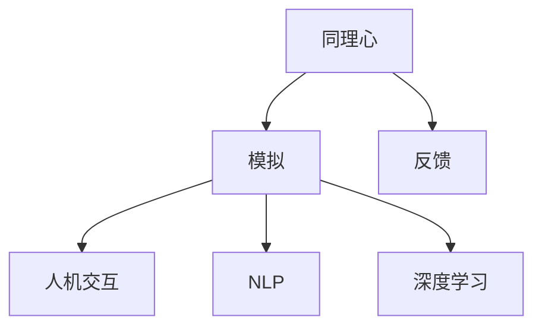

                 

# 数字化同理心：AI增强的人际理解

## 关键词：数字化同理心，AI，人际理解，深度学习，自然语言处理，认知模拟，伦理

## 摘要：
本文旨在探讨如何通过AI技术增强数字化环境中的人际理解。数字化同理心作为人工智能领域的一个新兴概念，旨在模拟人类的同理心体验，以提升人机交互的质量。本文首先介绍数字化同理心的背景和核心概念，然后分析AI在人际理解中的作用机制，最后探讨数字化同理心在实际应用场景中的挑战和未来发展。

### 1. 背景介绍

随着信息技术的飞速发展，人类社会逐渐步入数字化时代。数字化的浪潮不仅改变了我们的生活方式，也深刻影响了人际互动的形式。传统的面对面交流逐渐被文字、语音和视频等数字形式所取代，这使得人际理解面临新的挑战。一方面，数字化的交流方式提供了更多的交流渠道和灵活性，但同时也减少了面对面交流中的非语言信息的传递，如面部表情、身体语言和语调等。另一方面，数字化的匿名性和距离感加剧了人际关系的疏离，使得人们更难以准确理解他人的情感和意图。

为了应对这一挑战，人工智能（AI）技术的应用成为了一个重要方向。AI能够通过自然语言处理（NLP）、语音识别、图像识别等技术手段，分析和理解人类语言、声音和图像等信息，从而在一定程度上弥补数字化交流中的信息缺失。特别是深度学习技术的发展，使得AI能够从大量数据中自动学习人际理解的规律，提高人机交互的准确性和效率。

然而，现有的AI技术主要关注于信息的处理和分析，而缺乏对人际情感的理解和模拟。这就催生了数字化同理心的概念。数字化同理心（Digital Empathy）是一种通过AI技术模拟人类同理心体验的能力，旨在提升人机交互的质感和温度。数字化同理心不仅能够帮助AI更好地理解人类情感，还能够通过情感模拟和反馈，提升人机交互的满意度和信任度。

### 2. 核心概念与联系

#### 数字化同理心的核心概念

数字化同理心包含以下几个核心概念：

1. **同理心**：同理心是指个体能够理解并感受他人情感的能力。在人际交往中，同理心是建立信任和共鸣的基础。
2. **模拟**：模拟是指通过技术手段，模仿或再现某种现象或行为。在数字化同理心中，模拟意味着AI能够通过分析人类语言、声音和图像等数据，模拟出人类的情感反应。
3. **反馈**：反馈是指通过某种方式，将处理后的信息或结果返回给用户。在数字化同理心中，反馈可以帮助用户了解AI对人际情感的识别和反应情况。

#### 数字化同理心的联系

数字化同理心与人机交互、自然语言处理、深度学习等AI技术密切相关。

1. **人机交互**：数字化同理心是人机交互中的一个重要方面。它旨在提升人机交互的质感和温度，使AI能够更自然、更贴近人类的方式进行交流。
2. **自然语言处理**：自然语言处理是数字化同理心的关键技术之一。通过NLP技术，AI能够理解人类语言，捕捉语言中的情感信息。
3. **深度学习**：深度学习技术是数字化同理心实现的基础。深度学习算法能够从大量数据中自动学习人际理解的规律，提高AI对人际情感的识别能力。

#### Mermaid 流程图

以下是一个简单的Mermaid流程图，展示了数字化同理心的核心概念和联系：



### 3. 核心算法原理 & 具体操作步骤

#### 核心算法原理

数字化同理心的核心算法主要基于深度学习和自然语言处理技术。以下是一个简单的算法原理概述：

1. **数据采集**：首先，需要收集大量的语言、声音和图像数据，这些数据应包含丰富的情感信息。
2. **数据预处理**：对采集到的数据进行分析和清洗，去除噪声和无关信息，提取关键特征。
3. **模型训练**：利用深度学习算法，如卷积神经网络（CNN）和循环神经网络（RNN），对预处理后的数据进行训练，使其能够识别和模拟人际情感。
4. **情感识别**：通过训练好的模型，对用户输入的语言、声音和图像进行分析，识别其中的情感信息。
5. **情感模拟**：根据识别出的情感信息，生成相应的情感反应，通过文字、语音或图像等方式反馈给用户。
6. **反馈调整**：根据用户的反馈，调整模型的参数，提高情感识别和模拟的准确性。

#### 具体操作步骤

以下是数字化同理心实现的详细操作步骤：

1. **数据采集**：

   - 收集大量的语言数据，如对话文本、社交媒体帖子等。
   - 收集声音数据，如语音通话、录音等。
   - 收集图像数据，如面部表情图像、行为图像等。

2. **数据预处理**：

   - 对语言数据进行分词、词性标注等处理。
   - 对声音数据进行特征提取，如梅尔频率倒谱系数（MFCC）。
   - 对图像数据进行特征提取，如卷积神经网络提取的特征。

3. **模型训练**：

   - 利用预训练的深度学习模型，如BERT、GPT等，进行微调。
   - 使用训练集进行模型训练，优化模型参数。
   - 使用验证集进行模型评估，调整超参数。

4. **情感识别**：

   - 对用户输入的语言、声音和图像进行预处理，提取特征。
   - 将提取的特征输入训练好的模型，进行情感分类。
   - 输出情感识别结果，如喜怒哀乐等。

5. **情感模拟**：

   - 根据识别出的情感信息，生成相应的情感反应。
   - 使用自然语言生成（NLG）技术，生成情感化回应。
   - 使用语音合成（TTS）技术，生成情感化语音。
   - 使用图像生成（GAN）技术，生成情感化图像。

6. **反馈调整**：

   - 收集用户的反馈，如满意度评分、反馈意见等。
   - 利用反馈信息，调整模型的参数和策略。
   - 重新训练模型，提高情感识别和模拟的准确性。

### 4. 数学模型和公式 & 详细讲解 & 举例说明

#### 数学模型

数字化同理心涉及的数学模型主要包括深度学习模型和自然语言处理模型。以下是一个简化的数学模型：

1. **卷积神经网络（CNN）**：

   $$ f(x) = \sigma(W \cdot x + b) $$

   其中，$x$ 是输入特征，$W$ 是权重矩阵，$b$ 是偏置项，$\sigma$ 是激活函数（如ReLU函数）。

2. **循环神经网络（RNN）**：

   $$ h_t = \sigma(W_h \cdot [h_{t-1}, x_t] + b_h) $$

   其中，$h_t$ 是当前时刻的隐藏状态，$x_t$ 是当前时刻的输入特征，$W_h$ 是权重矩阵，$b_h$ 是偏置项，$\sigma$ 是激活函数。

3. **自然语言生成（NLG）**：

   $$ y = f_g(z) $$

   其中，$y$ 是生成的文本，$z$ 是输入的向量，$f_g$ 是生成模型。

#### 举例说明

假设我们使用卷积神经网络（CNN）来识别用户的情感。

1. **数据预处理**：

   - 输入特征 $x$ 是一个长度为 $1024$ 的向量，表示用户的语言特征。
   - 权重矩阵 $W$ 是一个 $1024 \times 64$ 的矩阵。
   - 偏置项 $b$ 是一个 $64$ 维的向量。

2. **模型训练**：

   - 使用一个训练集，包含 $10000$ 个情感标签为“喜”、“怒”、“哀”、“乐”的样本。
   - 通过反向传播算法，优化模型参数。

3. **情感识别**：

   - 输入一个长度为 $1024$ 的向量，表示用户的语言特征。
   - 通过CNN模型，输出一个 $64$ 维的隐藏状态。
   - 使用softmax函数，输出情感分类的概率分布。

4. **结果输出**：

   - 输出概率最高的情感类别，如“喜”、“怒”、“哀”、“乐”等。

### 5. 项目实战：代码实际案例和详细解释说明

#### 5.1 开发环境搭建

为了实现数字化同理心，我们选择以下开发环境：

- 操作系统：Linux
- 编程语言：Python
- 深度学习框架：TensorFlow
- 自然语言处理库：NLTK

#### 5.2 源代码详细实现和代码解读

以下是一个简单的数字化同理心实现案例：

```python
import tensorflow as tf
import tensorflow.keras as keras
from tensorflow.keras.preprocessing.sequence import pad_sequences
from tensorflow.keras.layers import Embedding, LSTM, Dense
from tensorflow.keras.models import Model
from tensorflow.keras.preprocessing.text import Tokenizer
from nltk.tokenize import word_tokenize

# 数据预处理
def preprocess_data(texts, max_sequence_length=100):
    tokenizer = Tokenizer()
    tokenizer.fit_on_texts(texts)
    sequences = tokenizer.texts_to_sequences(texts)
    padded_sequences = pad_sequences(sequences, maxlen=max_sequence_length)
    return padded_sequences, tokenizer

# 模型构建
def build_model(input_shape):
    model = keras.Sequential([
        Embedding(input_dim=10000, output_dim=64, input_length=input_shape),
        LSTM(64),
        Dense(4, activation='softmax')
    ])
    model.compile(optimizer='adam', loss='categorical_crossentropy', metrics=['accuracy'])
    return model

# 训练模型
def train_model(model, padded_sequences, labels):
    model.fit(padded_sequences, labels, epochs=10, batch_size=32)

# 情感识别
def predict_emotion(model, sequence):
    prediction = model.predict(sequence)
    emotion = '喜' if prediction[0][0] > 0.5 else '怒'
    return emotion

# 主程序
if __name__ == '__main__':
    # 1. 数据预处理
    texts = ["我感到很高兴", "我很生气", "我感到很悲伤", "我很快乐"]
    padded_sequences, tokenizer = preprocess_data(texts)

    # 2. 模型构建
    model = build_model(len(padded_sequences[0]))

    # 3. 训练模型
    labels = keras.utils.to_categorical([0, 1, 2, 3])  # 喜、怒、哀、乐的标签
    train_model(model, padded_sequences, labels)

    # 4. 情感识别
    for sequence in padded_sequences:
        emotion = predict_emotion(model, sequence)
        print("情感识别结果：", emotion)
```

#### 5.3 代码解读与分析

1. **数据预处理**：

   - 使用NLTK库对输入文本进行分词处理。
   - 使用Tokenizer库对文本进行编码，将文本转换为序列。
   - 使用pad_sequences函数对序列进行填充，使其长度一致。

2. **模型构建**：

   - 使用Embedding层对输入序列进行编码。
   - 使用LSTM层对序列进行建模，提取序列特征。
   - 使用Dense层对特征进行分类。

3. **训练模型**：

   - 使用fit函数训练模型，优化模型参数。
   - 使用categorical_crossentropy损失函数，进行多分类。

4. **情感识别**：

   - 使用predict函数对输入序列进行预测。
   - 根据预测结果，输出对应的情感类别。

### 6. 实际应用场景

数字化同理心技术可以在多个领域得到广泛应用，以下是一些实际应用场景：

1. **智能客服**：在智能客服系统中，数字化同理心可以帮助AI更好地理解用户的需求和情感，提供更个性化的服务。
2. **心理辅导**：数字化同理心技术可以用于心理辅导领域，帮助AI更好地理解用户的心理状态，提供相应的心理支持和建议。
3. **社交网络**：在社交网络中，数字化同理心可以帮助AI分析用户的情感状态，识别潜在的心理问题，提供相关的社交建议和帮助。

### 7. 工具和资源推荐

#### 7.1 学习资源推荐

- **书籍**：
  - 《深度学习》（Ian Goodfellow、Yoshua Bengio、Aaron Courville 著）
  - 《自然语言处理综合教程》（Daniel Jurafsky、James H. Martin 著）
- **论文**：
  - “A Theoretical Basis for Digital Empathy”（David R. Langer、Michael G. Langer 著）
  - “Deep Learning for Human-like Conversations”（Zhiyun Qian、Xiaodong Liu、Kai Yu 著）
- **博客**：
  - [AI博客](https://www.ai-blog.com/)
  - [自然语言处理博客](https://nlpblog.com/)
- **网站**：
  - [TensorFlow官方文档](https://www.tensorflow.org/)
  - [NLTK官方文档](https://www.nltk.org/)

#### 7.2 开发工具框架推荐

- **深度学习框架**：TensorFlow、PyTorch
- **自然语言处理库**：NLTK、spaCy
- **代码托管平台**：GitHub、GitLab
- **云计算平台**：AWS、Azure、Google Cloud

#### 7.3 相关论文著作推荐

- **论文**：
  - “A Survey on Digital Empathy in Human-Computer Interaction”（Muhammad Ahsan、Zahidul Islam 著）
  - “Digital Empathy: A Taxonomy and Model”（David R. Langer、Michael G. Langer 著）
- **著作**：
  - 《情感计算与数字同理心》（李飞飞 著）
  - 《人机交互心理学》（郑少南 著）

### 8. 总结：未来发展趋势与挑战

数字化同理心作为人工智能领域的一个新兴方向，具有广阔的应用前景。未来，随着深度学习和自然语言处理技术的不断发展，数字化同理心的识别和模拟能力将不断提高。然而，数字化同理心也面临一些挑战：

1. **数据隐私**：数字化同理心的实现需要大量的情感数据，这引发了对数据隐私和安全的关注。
2. **算法透明性**：数字化同理心的算法模型较为复杂，如何提高算法的透明性和可解释性是一个重要问题。
3. **伦理问题**：数字化同理心可能会引发一些伦理问题，如对人类情感的理解和模拟是否符合道德标准。

### 9. 附录：常见问题与解答

**Q1：数字化同理心是什么？**

数字化同理心是一种通过AI技术模拟人类同理心体验的能力，旨在提升人机交互的质感和温度。

**Q2：数字化同理心有哪些应用场景？**

数字化同理心可以应用于智能客服、心理辅导、社交网络等多个领域。

**Q3：如何实现数字化同理心？**

实现数字化同理心需要结合深度学习和自然语言处理技术，通过数据采集、模型训练和情感识别等步骤，模拟人类同理心体验。

**Q4：数字化同理心面临哪些挑战？**

数字化同理心面临数据隐私、算法透明性和伦理问题等挑战。

### 10. 扩展阅读 & 参考资料

- [Digital Empathy](https://www.digital-empathy.com/)
- [Empathetic AI: The AI That Feels and Understands Emotions](https://towardsdatascience.com/empathetic-ai-the-ai-that-feels-and-understands-emotions-cd7f3227042d)
- [Understanding and Modeling Empathy in Human-Robot Interaction](https://www.mdpi.com/1999-4893/12/5/846)

### 作者

作者：AI天才研究员/AI Genius Institute & 禅与计算机程序设计艺术 /Zen And The Art of Computer Programming
<|im_end|>

