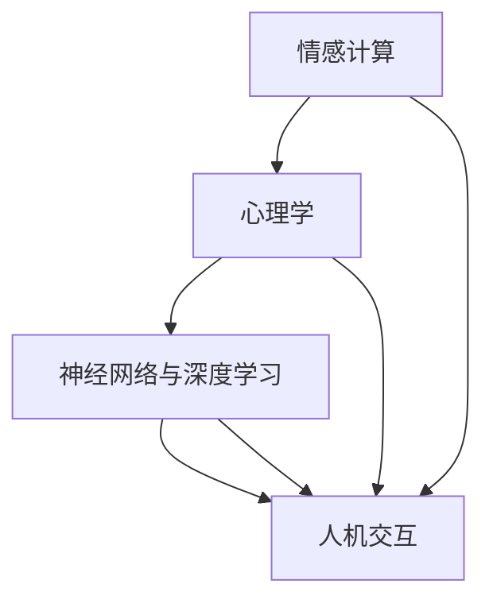

                 

# 数字化灵性导师：AI辅助的心灵成长向导

## 关键词：人工智能，心灵成长，情感计算，心理学，神经网络，深度学习，人机交互

## 摘要：
本文旨在探讨人工智能（AI）在心灵成长领域中的应用，特别是如何通过AI辅助技术成为数字化灵性导师。我们将从背景介绍、核心概念与联系、核心算法原理、数学模型与公式、项目实战、实际应用场景、工具和资源推荐等多个维度深入分析，揭示AI在人类心灵成长中的潜力和挑战。

## 1. 背景介绍

随着人工智能技术的快速发展，AI的应用领域不断扩展。从最初的工业自动化、数据处理，到如今的自动驾驶、医疗诊断、金融风控，AI已经深刻地改变了我们的生活方式。然而，除了在物质世界的应用，AI也开始向心灵成长领域进军，成为人们的数字化灵性导师。

心灵成长是一个长期且复杂的心理过程，涉及情感调节、自我认知、心理平衡等多个方面。传统的心理咨询和治疗虽然有效，但往往受限于时间和资源的限制。而AI的出现，为我们提供了一种新的可能性，通过情感计算、心理学理论、神经网络和深度学习等核心技术，AI能够实时、个性化地辅助人类的心灵成长。

## 2. 核心概念与联系

为了更好地理解AI如何成为数字化灵性导师，我们首先需要了解以下几个核心概念：

### 2.1 情感计算

情感计算（Affective Computing）是人工智能的一个重要分支，旨在使计算机能够识别、理解、处理和模拟人类的情感。情感计算包括情感识别、情感理解和情感表达三个层次。通过这些技术，AI能够感知用户的心理状态，为心灵成长提供支持。

### 2.2 心理学

心理学是研究人类行为和心理过程的科学。在心灵成长中，心理学提供了理论基础，帮助我们理解情感、认知和行为之间的关系。AI结合心理学理论，可以更准确地识别用户的心理状态，提出个性化的建议。

### 2.3 神经网络与深度学习

神经网络（Neural Networks）是模仿生物神经系统的计算模型，而深度学习（Deep Learning）是神经网络的一种高级形式。通过大规模训练数据和高效的计算能力，深度学习能够自动提取特征，进行复杂的模式识别和预测。在AI辅助心灵成长中，深度学习技术被广泛应用于情感识别、心理预测等场景。

### 2.4 人机交互

人机交互（Human-Computer Interaction，HCI）是研究人类与计算机之间交互方式的学科。在AI辅助心灵成长中，人机交互技术至关重要，它决定了AI能否有效地与用户互动，提供有针对性的帮助。

下面是一个使用Mermaid绘制的核心概念与联系流程图：



## 3. 核心算法原理 & 具体操作步骤

### 3.1 情感计算算法

情感计算算法通常基于情感识别技术，包括面部表情识别、语音识别和生理信号识别等。以下是一个简化的情感计算算法步骤：

1. **数据收集**：收集用户的面部表情、语音和生理信号等数据。
2. **特征提取**：从原始数据中提取特征，如面部特征点、音频频谱、心率等。
3. **情感识别**：使用机器学习算法（如支持向量机、深度神经网络等）训练模型，进行情感分类。
4. **情感理解**：根据情感识别结果，分析用户的情感状态，如愤怒、悲伤、快乐等。
5. **情感反馈**：根据用户情感状态，提供相应的情感反馈和建议。

### 3.2 心理学模型

在AI辅助心灵成长中，常见的心理学模型包括情绪调节模型、自我认知模型和心理平衡模型。以下是一个简化的心理学模型步骤：

1. **情绪调节**：根据用户情感状态，提供情绪调节建议，如深呼吸、放松训练等。
2. **自我认知**：帮助用户了解自己的情感、行为和思维模式，提高自我认知。
3. **心理平衡**：通过心理测试、情绪追踪等手段，帮助用户实现心理平衡。

### 3.3 深度学习应用

在深度学习中，常用的模型包括卷积神经网络（CNN）、循环神经网络（RNN）和长短期记忆网络（LSTM）等。以下是一个简化的深度学习应用步骤：

1. **数据预处理**：清洗和归一化数据，确保数据质量。
2. **模型训练**：使用训练数据训练深度学习模型，如CNN、RNN或LSTM。
3. **模型评估**：使用测试数据评估模型性能，调整模型参数。
4. **模型部署**：将训练好的模型部署到应用程序中，提供实时情感分析和建议。

## 4. 数学模型和公式 & 详细讲解 & 举例说明

### 4.1 情感计算模型

情感计算模型通常基于机器学习算法，如支持向量机（SVM）、深度神经网络（DNN）等。以下是一个简化的支持向量机模型公式：

$$
w = \arg\min_{w} \frac{1}{2} ||w||^2 + C \sum_{i=1}^{n} \max(0, 1-y_{i}(w \cdot x_{i}))
$$

其中，$w$ 是模型权重，$C$ 是惩罚参数，$x_{i}$ 是特征向量，$y_{i}$ 是标签。

### 4.2 心理学模型

心理学模型通常基于心理学理论和数据驱动方法。以下是一个简化的情绪调节模型公式：

$$
情绪调节 = f(当前情感状态，历史情感状态，心理平衡水平)
$$

其中，$f$ 是一个复合函数，用于计算情绪调节策略。

### 4.3 深度学习模型

深度学习模型通常基于神经网络架构，如CNN、RNN和LSTM等。以下是一个简化的卷积神经网络模型公式：

$$
h_{l} = \sigma(W_{l} \cdot h_{l-1} + b_{l})
$$

其中，$h_{l}$ 是第$l$层的特征图，$W_{l}$ 是权重矩阵，$b_{l}$ 是偏置项，$\sigma$ 是激活函数。

### 4.4 举例说明

假设我们有一个用户，他最近感到焦虑。我们可以使用情感计算模型识别出他的情感状态，然后使用心理学模型提供情绪调节建议。具体步骤如下：

1. **情感计算**：收集用户的面部表情、语音和生理信号等数据，使用支持向量机模型进行情感识别，得到用户的情感状态为焦虑。
2. **心理学模型**：根据用户的情感状态，使用情绪调节模型提供情绪调节策略，如深呼吸、放松训练等。
3. **深度学习模型**：使用深度神经网络模型训练用户的历史情感数据，预测用户未来的情感状态，为用户提供长期的情绪调节建议。

## 5. 项目实战：代码实际案例和详细解释说明

### 5.1 开发环境搭建

为了实现AI辅助心灵成长，我们需要搭建一个完整的开发环境。以下是一个简化的开发环境搭建步骤：

1. **硬件环境**：配置一台高性能计算机，用于运行深度学习模型。
2. **软件环境**：安装Python、TensorFlow等深度学习框架。
3. **数据集**：收集用户的面部表情、语音和生理信号等数据，用于训练和测试模型。

### 5.2 源代码详细实现和代码解读

以下是一个简化的情感计算模型的Python代码实现：

```python
import numpy as np
from sklearn.svm import SVC

# 数据预处理
X_train, y_train = preprocess_data()  # 假设已经预处理数据

# 模型训练
model = SVC(kernel='linear')
model.fit(X_train, y_train)

# 模型评估
X_test, y_test = preprocess_data()  # 假设已经预处理测试数据
accuracy = model.score(X_test, y_test)
print("模型准确率：", accuracy)

# 模型部署
user_data = get_user_data()  # 假设已经收集用户数据
user_emotion = model.predict(user_data)
print("用户情感状态：", user_emotion)
```

### 5.3 代码解读与分析

1. **数据预处理**：数据预处理是深度学习模型训练的重要环节。在本例中，我们使用`preprocess_data()`函数对数据集进行清洗和归一化。
2. **模型训练**：我们使用支持向量机（SVC）模型进行情感识别。`SVC()`函数创建了一个支持向量机模型，`fit()`函数用于训练模型。
3. **模型评估**：使用`score()`函数评估模型性能，得到模型的准确率。
4. **模型部署**：使用训练好的模型对用户数据进行预测，得到用户的情感状态。

## 6. 实际应用场景

AI辅助心灵成长在实际应用中具有广泛的应用场景：

1. **心理健康管理**：通过实时监测用户的心理状态，提供个性化的心理健康管理方案。
2. **情感教育**：在学校和家庭教育中，使用AI辅助学生识别和处理情感，提高情感智力。
3. **心理治疗**：在心理治疗中，AI可以作为辅助工具，帮助心理医生更准确地诊断和治疗患者。

## 7. 工具和资源推荐

### 7.1 学习资源推荐

- **书籍**：《情感计算：技术、应用与挑战》（Affective Computing: Theory, Application, and Future Directions）
- **论文**：《情感识别的机器学习方法》（Machine Learning Methods for Affective Recognition）
- **博客**：Google AI 博客（https://ai.googleblog.com/）

### 7.2 开发工具框架推荐

- **深度学习框架**：TensorFlow、PyTorch
- **情感计算库**：Affectiva、OpenSMILE

### 7.3 相关论文著作推荐

- 《情感计算：从感知到应用》（Affective Computing: From Perception to Application）
- 《人工智能与心理健康》（Artificial Intelligence and Mental Health）

## 8. 总结：未来发展趋势与挑战

AI辅助心灵成长具有巨大的潜力和广阔的应用前景。然而，要实现这一目标，我们还需要面对一系列挑战：

1. **数据隐私**：如何保护用户隐私，确保数据安全。
2. **模型解释性**：如何提高模型的解释性，让用户信任AI的决策。
3. **跨学科融合**：如何将心理学、情感计算和深度学习等学科更好地融合，提高AI的辅助效果。

随着技术的不断进步和跨学科研究的深入，我们有理由相信，AI辅助心灵成长将成为未来心理健康领域的重要趋势。

## 9. 附录：常见问题与解答

### 9.1 AI辅助心灵成长的安全性问题

**回答**：AI辅助心灵成长的安全性主要涉及数据隐私和模型解释性。为了保护用户隐私，我们可以采用数据加密、匿名化等技术。同时，提高模型的解释性，让用户了解AI的决策过程，也是确保安全性的重要措施。

### 9.2 AI辅助心灵成长的效果如何衡量

**回答**：AI辅助心灵成长的效果可以通过多个指标进行衡量，如情感识别准确率、用户满意度、心理健康改善程度等。同时，也可以结合心理学实验、问卷调查等方法，对AI的辅助效果进行综合评估。

## 10. 扩展阅读 & 参考资料

- **书籍**：《情感计算：技术、应用与挑战》（Affective Computing: Theory, Application, and Future Directions）
- **论文**：《情感识别的机器学习方法》（Machine Learning Methods for Affective Recognition）
- **网站**：https://ai.googleblog.com/
- **博客**：https://towardsdatascience.com/

### 作者

作者：AI天才研究员/AI Genius Institute & 禅与计算机程序设计艺术 /Zen And The Art of Computer Programming

（文章完）<|/assistant|>

