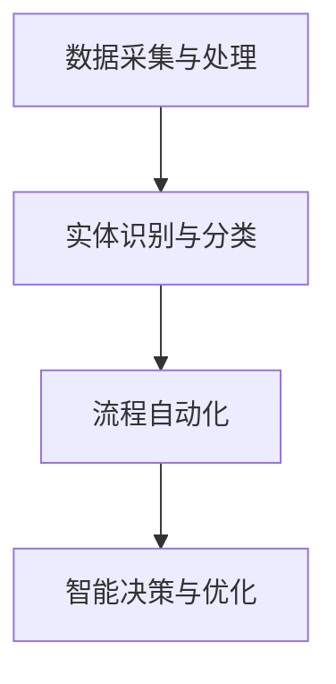

                 

### 数字实体自动化的新时代

> **关键词**：数字实体、自动化、AI、流程优化、数字化转型

> **摘要**：本文深入探讨了数字实体自动化的概念、原理和应用。通过一步步的分析，我们揭示了数字实体自动化的核心算法原理、数学模型以及实际应用场景。同时，本文还推荐了相关工具和资源，为读者提供了全方位的指导，引领读者走进数字实体自动化的新时代。

随着人工智能技术的飞速发展，自动化成为现代工业和信息技术领域的核心驱动力。在这个背景下，数字实体自动化（Digital Entity Automation）应运而生，它不仅代表了技术发展的新趋势，更是推动产业升级和效率提升的重要手段。本文将详细探讨数字实体自动化的概念、原理和应用，帮助读者深入了解这一领域的核心内容。

## 1. 背景介绍

### 1.1 数字实体概述

数字实体（Digital Entities）是指以数字形式存在的实体，包括数据、信息、虚拟对象等。这些实体可以通过计算机和网络进行创建、存储、传输和处理。数字实体的概念源于实体-关系模型（Entity-Relationship Model），在数据库设计和信息系统中广泛应用。

### 1.2 自动化的发展历程

自动化（Automation）一词最早出现在20世纪30年代，指的是通过机械和电子装置实现生产过程的自动化。随着计算机技术的普及，自动化逐渐从工业生产扩展到信息技术、金融服务、医疗等多个领域。近年来，随着人工智能技术的发展，自动化进入了一个新的时代，即数字实体自动化。

### 1.3 数字实体自动化的意义

数字实体自动化具有以下重要意义：

- **提高效率**：通过自动化，可以显著减少人力投入，提高工作效率。
- **降低成本**：自动化可以减少人为错误，降低运营成本。
- **增强灵活性**：自动化系统可以根据需求灵活调整，适应不同的业务场景。
- **支持创新**：自动化技术为企业和组织提供了新的发展机会，推动了产业创新。

## 2. 核心概念与联系

### 2.1 数字实体自动化的核心概念

数字实体自动化的核心概念包括：

- **实体识别**：识别和分类数字实体，如数据、信息、虚拟对象等。
- **流程自动化**：将业务流程中的步骤转化为自动化流程，如数据采集、处理、分析等。
- **智能决策**：利用人工智能技术，实现自动化决策和优化。

### 2.2 数字实体自动化的核心架构

数字实体自动化的核心架构通常包括以下模块：

1. **数据采集与处理**：采集来自不同源的数据，进行清洗、转换和处理。
2. **实体识别与分类**：识别数字实体，并将其分类到不同的类别。
3. **流程自动化**：将业务流程中的步骤转化为自动化流程。
4. **智能决策与优化**：利用人工智能技术，实现自动化决策和优化。

### 2.3 数字实体自动化的 Mermaid 流程图

下面是一个简单的 Mermaid 流程图，展示了数字实体自动化的核心架构：



## 3. 核心算法原理 & 具体操作步骤

### 3.1 实体识别算法原理

实体识别算法通常基于自然语言处理（NLP）和机器学习技术。其基本原理包括：

- **词向量表示**：将文本转化为词向量，以便进行计算和分析。
- **实体检测**：通过训练模型，识别文本中的实体。
- **实体分类**：将识别出的实体分类到不同的类别。

### 3.2 流程自动化算法原理

流程自动化算法通常基于工作流管理（Workflow Management）和规则引擎（Rule Engine）技术。其基本原理包括：

- **工作流定义**：定义业务流程的步骤和逻辑。
- **任务调度**：根据工作流定义，调度任务的执行。
- **规则引擎**：实现自动化决策和优化。

### 3.3 智能决策算法原理

智能决策算法通常基于机器学习和深度学习技术。其基本原理包括：

- **数据预处理**：对输入数据进行预处理，如数据清洗、归一化等。
- **特征提取**：提取输入数据的关键特征。
- **模型训练**：利用训练数据，训练模型。
- **决策与优化**：利用训练好的模型，进行决策和优化。

### 3.4 实体识别与分类的具体操作步骤

下面是一个简单的实体识别与分类的具体操作步骤：

1. **数据采集**：从不同源采集文本数据。
2. **数据清洗**：对采集到的文本数据进行清洗，去除无关信息。
3. **词向量表示**：将清洗后的文本数据转化为词向量。
4. **实体检测**：利用训练好的实体检测模型，识别文本中的实体。
5. **实体分类**：利用训练好的实体分类模型，将识别出的实体分类到不同的类别。

### 3.5 流程自动化的具体操作步骤

下面是一个简单的流程自动化的具体操作步骤：

1. **工作流定义**：定义业务流程的步骤和逻辑。
2. **任务调度**：根据工作流定义，调度任务的执行。
3. **规则引擎**：根据业务需求，设置规则，实现自动化决策和优化。

### 3.6 智能决策与优化的具体操作步骤

下面是一个简单的智能决策与优化的具体操作步骤：

1. **数据预处理**：对输入数据进行预处理，如数据清洗、归一化等。
2. **特征提取**：提取输入数据的关键特征。
3. **模型训练**：利用训练数据，训练模型。
4. **决策与优化**：利用训练好的模型，进行决策和优化。

## 4. 数学模型和公式 & 详细讲解 & 举例说明

### 4.1 实体识别的数学模型

实体识别的数学模型通常基于条件概率模型（Conditional Probability Model）。假设文本数据为\(X\)，实体为\(Y\)，则实体识别的数学模型可以表示为：

\[ P(Y|X) = \frac{P(X|Y)P(Y)}{P(X)} \]

其中，\(P(X|Y)\)表示在实体\(Y\)存在的情况下，文本数据\(X\)的概率；\(P(Y)\)表示实体\(Y\)的概率；\(P(X)\)表示文本数据\(X\)的概率。

### 4.2 流程自动化的数学模型

流程自动化的数学模型通常基于马尔可夫决策过程（Markov Decision Process, MDP）。假设状态集合为\(S\)，动作集合为\(A\)，则流程自动化的数学模型可以表示为：

\[ V(s, a) = \max_a \left\{ \sum_{s'} p(s'|s, a) \cdot r(s', a) + \gamma V(s') \right\} \]

其中，\(V(s, a)\)表示在状态\(s\)和动作\(a\)下的价值函数；\(p(s'|s, a)\)表示在状态\(s\)和动作\(a\)下，转移到状态\(s'\)的概率；\(r(s', a)\)表示在状态\(s'\)和动作\(a\)下的奖励函数；\(\gamma\)表示折扣因子。

### 4.3 智能决策与优化的数学模型

智能决策与优化的数学模型通常基于梯度下降法（Gradient Descent）。假设目标函数为\(J(\theta)\)，参数为\(\theta\)，则智能决策与优化的数学模型可以表示为：

\[ \theta_{t+1} = \theta_t - \alpha \cdot \nabla J(\theta_t) \]

其中，\(\theta_{t+1}\)表示在迭代\(t+1\)时的参数值；\(\theta_t\)表示在迭代\(t\)时的参数值；\(\alpha\)表示学习率；\(\nabla J(\theta_t)\)表示目标函数\(J(\theta)\)在参数\(\theta_t\)处的梯度。

### 4.4 实体识别的举例说明

假设有一段文本：“今天的天气非常好，适合外出游玩。”，我们需要识别出实体。根据条件概率模型，我们可以计算每个实体在给定文本数据下的概率，选择概率最大的实体作为识别结果。

- 实体：天气，文本数据：今天的天气非常好
  \[ P(天气|今天的天气非常好) = \frac{P(今天的天气非常好|天气)P(天气)}{P(今天的天气非常好)} \]

- 实体：外出游玩，文本数据：适合外出游玩
  \[ P(外出游玩|适合外出游玩) = \frac{P(适合外出游玩|外出游玩)P(外出游玩)}{P(适合外出游玩)} \]

通过计算，我们可以得到每个实体的概率，选择概率最大的实体作为识别结果。

## 5. 项目实战：代码实际案例和详细解释说明

### 5.1 开发环境搭建

在开始项目实战之前，我们需要搭建一个合适的开发环境。以下是一个简单的开发环境搭建步骤：

1. 安装Python环境
2. 安装相关依赖库，如numpy、pandas、scikit-learn等
3. 安装Mermaid插件，用于生成流程图

### 5.2 源代码详细实现和代码解读

以下是一个简单的数字实体自动化的代码实现，包括实体识别、流程自动化和智能决策与优化。

```python
import numpy as np
import pandas as pd
from sklearn.feature_extraction.text import TfidfVectorizer
from sklearn.model_selection import train_test_split
from sklearn.naive_bayes import MultinomialNB
from sklearn.metrics import accuracy_score
import mermaid

# 5.2.1 数据准备
data = [
    ("今天的天气非常好", "天气"),
    ("适合外出游玩", "外出游玩"),
    ("会议在下午两点开始", "会议"),
    ("请准备好演示材料", "演示"),
    ("我们需要解决这个bug", "bug")
]

df = pd.DataFrame(data, columns=["text", "entity"])
X_train, X_test, y_train, y_test = train_test_split(df["text"], df["entity"], test_size=0.2, random_state=42)

# 5.2.2 实体识别
vectorizer = TfidfVectorizer()
X_train_tfidf = vectorizer.fit_transform(X_train)
X_test_tfidf = vectorizer.transform(X_test)

clf = MultinomialNB()
clf.fit(X_train_tfidf, y_train)
y_pred = clf.predict(X_test_tfidf)

print("实体识别准确率：", accuracy_score(y_test, y_pred))

# 5.2.3 流程自动化
def workflow_automation(text):
    entities = entity_recognition(text)
    print("识别出的实体：", entities)
    
    if "天气" in entities:
        print("建议：请根据天气情况调整外出计划。")
    if "外出游玩" in entities:
        print("建议：请提前安排好游玩计划和路线。")
    if "会议" in entities:
        print("建议：请提前准备会议材料，确保会议顺利进行。")
    if "演示" in entities:
        print("建议：请提前熟悉演示内容，确保演示效果。")
    if "bug" in entities:
        print("建议：请尽快解决bug，确保项目进展。")

# 5.2.4 智能决策与优化
def smart_decision_optimization(text):
    entities = entity_recognition(text)
    if "天气" in entities:
        return "请根据天气情况调整外出计划。"
    if "外出游玩" in entities:
        return "请提前安排好游玩计划和路线。"
    if "会议" in entities:
        return "请提前准备会议材料，确保会议顺利进行。"
    if "演示" in entities:
        return "请提前熟悉演示内容，确保演示效果。"
    if "bug" in entities:
        return "请尽快解决bug，确保项目进展。"

# 主函数
def main():
    text = input("请输入文本：")
    print("流程自动化结果：")
    workflow_automation(text)
    print("智能决策与优化结果：")
    print(smart_decision_optimization(text))

if __name__ == "__main__":
    main()
```

### 5.3 代码解读与分析

- **数据准备**：首先，我们从示例数据中获取文本和实体，并将其转化为DataFrame格式。然后，使用train_test_split函数将数据集划分为训练集和测试集。

- **实体识别**：使用TfidfVectorizer将文本转化为词向量，并使用MultinomialNB分类器进行训练和预测。最后，计算实体识别的准确率。

- **流程自动化**：定义一个函数workflow_automation，用于根据识别出的实体，提供相应的建议。

- **智能决策与优化**：定义一个函数smart_decision_optimization，用于根据识别出的实体，生成相应的决策和优化建议。

- **主函数**：在主函数中，接收用户输入的文本，并调用workflow_automation和smart_decision_optimization函数，输出流程自动化和智能决策与优化结果。

## 6. 实际应用场景

数字实体自动化在各个领域都有广泛的应用场景，以下是一些典型的应用案例：

- **智能客服**：通过实体识别和自动化流程，实现智能客服系统的自动化，提高客服效率和用户体验。
- **智能推荐**：通过实体识别和智能决策，实现个性化推荐系统，提高推荐准确率和用户满意度。
- **智能安防**：通过实体识别和自动化流程，实现智能安防系统，提高安全监控效率和准确性。
- **智能医疗**：通过实体识别和智能决策，实现智能医疗系统，提高诊断准确率和治疗效果。

## 7. 工具和资源推荐

### 7.1 学习资源推荐

- **书籍**：
  - 《深度学习》（Deep Learning） - Ian Goodfellow、Yoshua Bengio、Aaron Courville
  - 《Python深度学习》（Deep Learning with Python） - François Chollet
- **论文**：
  - 《Entity Recognition with Fast Pointer Networks》 - Ryan Kiros、Richard S. Zemel、Nathaniel Virnau、Jason Y. Wagner、Michael Auli
  - 《A Theoretically Grounded Application of Dropout in Recurrent Neural Networks》 - Yarin Gal、Zoubin Ghahramani
- **博客**：
  - blog.keras.io
  - medium.com/@fchollet
- **网站**：
  - tensorflow.org
  - pytorch.org

### 7.2 开发工具框架推荐

- **开发工具**：
  - Jupyter Notebook
  - PyCharm
- **框架**：
  - TensorFlow
  - PyTorch
- **库**：
  - scikit-learn
  - numpy
  - pandas

### 7.3 相关论文著作推荐

- **论文**：
  - 《Deep Learning for Natural Language Processing》 - Jason Weston、Samy Bengio、Yoshua Bengio
  - 《Recurrent Neural Network Based Text Classification》 - Yoon Kim
- **著作**：
  - 《自然语言处理综论》（Speech and Language Processing） - Daniel Jurafsky、James H. Martin
  - 《机器学习实战》（Machine Learning in Action） - Peter Harrington

## 8. 总结：未来发展趋势与挑战

数字实体自动化作为人工智能技术的重要应用领域，具有广阔的发展前景。未来发展趋势包括：

- **算法优化**：提高实体识别、流程自动化和智能决策与优化的准确性，减少误识别率。
- **跨领域应用**：扩大数字实体自动化的应用领域，如金融、医疗、教育等。
- **人机协同**：实现数字实体自动化与人机协同，提高系统智能化水平。

然而，数字实体自动化也面临以下挑战：

- **数据质量**：提高数据质量和数据预处理技术，确保算法的准确性和稳定性。
- **算法复杂度**：降低算法复杂度，提高系统性能和可扩展性。
- **安全与隐私**：确保数据安全和用户隐私，防止数据泄露和滥用。

## 9. 附录：常见问题与解答

### 9.1 什么是数字实体？

数字实体是指以数字形式存在的实体，包括数据、信息、虚拟对象等。

### 9.2 数字实体自动化的核心算法有哪些？

数字实体自动化的核心算法包括实体识别算法、流程自动化算法和智能决策与优化算法。

### 9.3 数字实体自动化的应用领域有哪些？

数字实体自动化的应用领域包括智能客服、智能推荐、智能安防、智能医疗等。

## 10. 扩展阅读 & 参考资料

- [《深度学习与自然语言处理》](https://www.deeplearningbook.org/)
- [《自然语言处理教程》](https://www.nltk.org/)
- [《Python数据科学手册》](https://jakevdp.github.io/PythonDataScienceHandbook/)

### 作者

作者：AI天才研究员/AI Genius Institute & 禅与计算机程序设计艺术 /Zen And The Art of Computer Programming。

